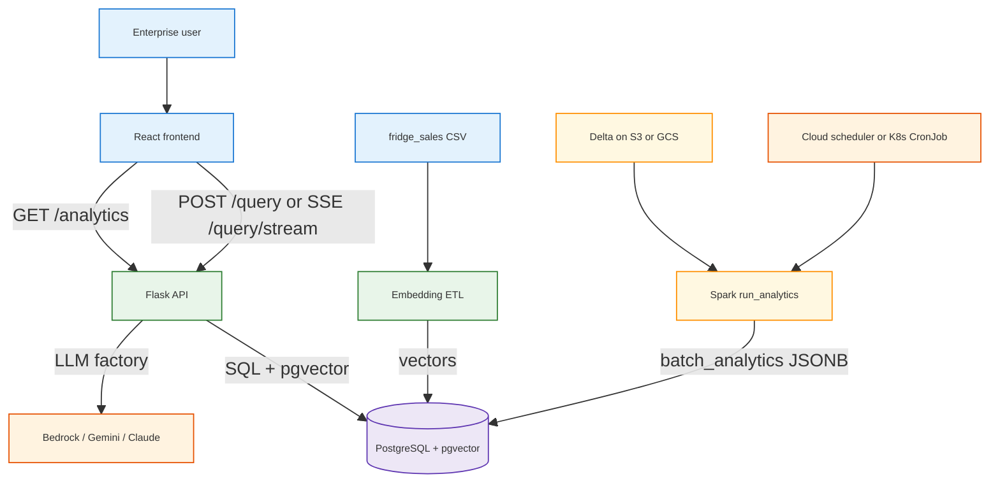

<h1 id="fru-readme-title" style="color:#0d47a1;font-size:1.5em;font-weight:700;border-bottom:2px solid #90caf9;padding-bottom:0.25em;margin-top:0">FRU GenAI Analytics Evolved (Multi-Cloud Based Enterprise Level AI Data Analytics Assistant)</h1>

Inspired by real-life industrial usecases and data, **Fridges R Us (FRU)** is an end-to-end enterprise conversational analytics assistant over refrigerator sales data: **`structured`** fields (brand, store, ratings, dates) plus **`unstructured`** customer feedback (long complaints and themes). Users ask questions in plain language; the system returns grounded answers backed by SQL, vector search, and batch aggregates—not free-form hallucination.

This repository is the evolution of [ultra-fru-genai-analytics](https://github.com/horselord-joe-8053/ultra-fru-genai-analytics): same domain and data philosophy with **`Data Vectorizing, Query Embedding and RAG`**, extended with **`LLM query-workflow visualization`** (live LLM tool traces), a **`ReAct-style agent`**, and a **`Multi-cloud Auto Deploy/Teardown`** system (`AWS`, `GCP`, etc, plus `local` parity; `Kubernetes` and `non-Kubernetes` deployment paradigms) built from **`OpenTofu/Terraform IaC`** and **clean Python-base orchestration and automation**. Getting this system working end-to-end was more challenging, educational and fun than I anticipated, with many lessons learned captured in the [war stories](#war-stories).

---

<h2 id="table-of-contents" style="color:#1565c0;font-size:1.22em;font-weight:650;border-left:4px solid #42a5f5;padding-left:10px;margin-top:1.1em">📋 Table of Contents</h2>

- [🧠 1. What this project is](#what-this-is)
- [✨ 2. Golden separation](#golden-separation)
- [⚡ 3. Capabilities](#capabilities)
  - [3.1 Conversational agent](#capabilities-agent)
  - [3.2 Web UI](#capabilities-ui)
  - [3.3 Operations](#capabilities-ops)
- [🧩 4. Architecture at a glance](#architecture)
- [🗂 5. Repository layout](#repo-layout)
- [🛠 6. Prerequisites](#prerequisites)
- [⚙️ 7. Configuration](#configuration)
- [🚀 8. Quick start](#quick-start)
  - [8.1 Local](#quick-local)
  - [8.2 AWS](#quick-aws)
  - [8.3 GCP](#quick-gcp)
  - [8.4 Teardown](#quick-teardown)
- [🏗 9. Deploy and teardown model](#deploy-model)
- [📊 10. Deployment matrix](#deploy-matrix)
- [🗄 11. Data model](#data-model)
- [🦾 12. Intelligence stack](#intelligence)
- [📐 13. Query workflow visualization](#query-viz)
- [📚 14. War stories](#war-stories)
- [📖 15. Documentation map](#docs-map)
- [🧪 16. Testing (unit + integration)](#testing)
  - [16.1 Unit tests](#unit-tests)
  - [16.2 Integration tests (Docker)](#integration-tests)
- [🔗 17. Related repositories](#related-repos)

---

<h2 id="what-this-is" style="color:#1565c0;font-size:1.22em;font-weight:650;border-left:4px solid #42a5f5;padding-left:10px;margin-top:1.1em">🧠 1. What this project is</h2>

FRU answers questions such as:

- *“Why are Samsung customers unhappy?”*
- *“How many LG fridges did we sell last month?”*
- *“Which stores consistently get negative delivery feedback?”*

The system combines:

- **Offline / batch intelligence** — Apache Spark + Delta Lake on object storage (S3 or GCS), scheduled jobs writing aggregates to PostgreSQL.
- **Online / interactive intelligence** — OpenAI embeddings + **pgvector** similarity search, plus **SQL** over structured columns.
- **Grounded narrative** — a cloud LLM (AWS Bedrock, GCP Gemini or Claude, or local Claude) explains retrieved facts; prompts enforce **no invented numbers**.

Compared to the original [ultra-fru-genai-analytics](https://github.com/horselord-joe-8053/ultra-fru-genai-analytics) prototype, this repo adds:

<table>
<thead>
<tr style="background:#1565c0;color:white"><th>Area</th><th>Evolution</th></tr>
</thead>
<tbody>
<tr><td style="background:#e3f2fd"><strong>UX</strong></td><td style="background:#e8f5e9">React UI with chat, <strong>execution log</strong> (per-tool SSE stream), and <strong>batch analytics</strong> panel</td></tr>
<tr><td style="background:#e3f2fd"><strong>Query engine</strong></td><td style="background:#fff3e0">Optional <strong>agent</strong> (<code>USE_AGENT_QUERY</code>) with <code>generate_sql</code>, <code>execute_sql</code>, <code>semantic_search</code> tools</td></tr>
<tr><td style="background:#e3f2fd"><strong>Clouds</strong></td><td style="background:#e8f5e9">First-class <strong>AWS</strong> and <strong>GCP</strong>; shared abstractions in <code>core_app/backend/env_utils/cloud_shared/</code></td></tr>
<tr><td style="background:#e3f2fd"><strong>Deploy</strong></td><td style="background:#fff3e0"><code>orchestrator.py</code> + <code>tools/{aws,gcp,local}/</code> + <code>infra_terraform/live_deploy/</code> — repeatable <strong>deploy</strong> and <strong>teardown</strong></td></tr>
<tr><td style="background:#e3f2fd"><strong>Topology</strong></td><td style="background:#e8f5e9">Same app on <strong>EKS / GKE</strong> (kube) or <strong>ECS Fargate / Cloud Run</strong> (nonkube), mirrored <strong>locally</strong> via Compose and Docker Desktop Kubernetes</td></tr>
</tbody>
</table>

---

<h2 id="golden-separation" style="color:#1565c0;font-size:1.22em;font-weight:650;border-left:4px solid #42a5f5;padding-left:10px;margin-top:1.1em">✨ 2. Golden separation</h2>

> **Spark does batch intelligence.**  
> **pgvector + SQL do interactive intelligence.**  
> **The LLM explains what was retrieved.**

That split keeps cost, latency, and governance under control: heavy work stays in scheduled Spark jobs; the API path stays fast; the model never substitutes for missing data.

---

<h2 id="capabilities" style="color:#1565c0;font-size:1.22em;font-weight:650;border-left:4px solid #42a5f5;padding-left:10px;margin-top:1.1em">⚡ 3. Capabilities</h2>

<h3 id="capabilities-agent" style="color:#00695c;font-size:1.05em;font-weight:600;margin-top:0.85em">3.1 Conversational agent</h3>

When `USE_AGENT_QUERY=true`, `POST /query` and `GET /query/stream` route through `core_app/backend/agents/query_agent.py` (ReAct loop). Tools:

- **`generate_sql`** — NL → SQL over `fru_sales_embeddings` / related tables.
- **`execute_sql`** — run approved SQL and return rows.
- **`semantic_search`** — pgvector search over `customer_feedback` embeddings.

Entry API: `core_app/backend/api/app.py`.

<h3 id="capabilities-ui" style="color:#00695c;font-size:1.05em;font-weight:600;margin-top:0.85em">3.2 Web UI</h3>

- **Chat** — `core_app/frontend/src/components/Chat.tsx`
- **Execution log** — `ExecutionPanel.tsx` consumes **Server-Sent Events** from `/query/stream` and shows each tool call, iteration, and token usage as the agent runs.
- **Batch analytics** — `BatchAnalyticsPanel.tsx` polls `/analytics` (Spark-written JSON aggregates).
- **Data management** — `DataManagement.tsx` for `/rawdata` CRUD on source rows.

<h3 id="capabilities-ops" style="color:#00695c;font-size:1.05em;font-weight:600;margin-top:0.85em">3.3 Operations</h3>

- **`orchestrator.py`** — unified `deploy` | `teardown` | `doctor` | `verify` for `aws`, `gcp`, `local`.
- **Content-hash image skip** — avoid rebuilding/pushing API and Spark images when Docker context unchanged (see war story §27 in [WAR_STORIES_CLOUD_SHARED.md](docs/war_stories/WAR_STORIES_CLOUD_SHARED.md)).
- **Explicit durable destroy** — long-lived VPC/DB/state buckets require `ALLOW_DURABLE_DESTROY=YES` (AWS) and matching GCP guards.

---

<h2 id="architecture" style="color:#1565c0;font-size:1.22em;font-weight:650;border-left:4px solid #42a5f5;padding-left:10px;margin-top:1.1em">🧩 4. Architecture at a glance</h2>

Two **container images** (API + Spark), two **subsystems**, one **PostgreSQL** database per environment/region:



**Deeper diagrams (per cloud and scope):** [docs/learned/cloud_shared/ARCHITECTURE_AWS_GCP_GENERAL.md](docs/learned/cloud_shared/ARCHITECTURE_AWS_GCP_GENERAL.md) · [docs/CORE_APP_STRUCTURE.md](docs/CORE_APP_STRUCTURE.md).

---

<h2 id="repo-layout" style="color:#1565c0;font-size:1.22em;font-weight:650;border-left:4px solid #42a5f5;padding-left:10px;margin-top:1.1em">🗂 5. Repository layout</h2>

```text
fru-genai-analytics-new/
├── orchestrator.py              # deploy | teardown | doctor | verify (all providers)
├── requirements.txt             # Python deps for app + tools
├── .env.example                 # env contract (copy to .env)
├── config/
│   ├── local/local_deploy_config.yaml
│   └── cloud/{aws,gcp}_deploy_config.yaml
├── core_app/
│   ├── backend/api/app.py       # Flask API
│   ├── backend/agents/          # QueryAgent + prompts
│   ├── backend/env_utils/       # cloud_shared factory (LLM, storage)
│   ├── frontend/                # React + Vite
│   ├── analytics/jobs/          # Spark batch (run_analytics.py)
│   ├── sql/schema_pgvector.sql
│   └── data/raw/                # sample CSV
├── infra_terraform/
│   ├── modules/{aws,gcp,cloud_shared}
│   └── live_deploy/{aws,gcp}/scope_shared/{durable,nondurable,...}, {kube,nonkube}
├── tools/
│   ├── aws/                     # deploy.py, teardown.py, verify, doctor
│   ├── gcp/
│   ├── local/                   # Compose + Docker Desktop k8s
│   └── cloud_shared/            # shared deploy helpers, logging, env
└── docs/
    ├── CORE_APP_STRUCTURE.md
    ├── GCP_AWS_REFERENCE.md
    ├── WHAT_TO_DO_TO_BUILD_FOR_ANOTHER_CLOUD_PROVIDER.md
    └── war_stories/             # WAR_STORIES_{AWS,GCP,CLOUD_SHARED,OTHER}.md
```

---

<h2 id="prerequisites" style="color:#1565c0;font-size:1.22em;font-weight:650;border-left:4px solid #42a5f5;padding-left:10px;margin-top:1.1em">🛠 6. Prerequisites</h2>

<table>
<thead>
<tr style="background:#1565c0;color:white"><th>Tool</th><th>Local dev</th><th>AWS deploy</th><th>GCP deploy</th></tr>
</thead>
<tbody>
<tr><td style="background:#e3f2fd"><strong>Python 3.10+</strong> + venv</td><td style="background:#e8f5e9"><span style="background:#c8e6c9;padding:2px 4px">✓</span></td><td style="background:#e8f5e9"><span style="background:#c8e6c9;padding:2px 4px">✓</span></td><td style="background:#e8f5e9"><span style="background:#c8e6c9;padding:2px 4px">✓</span></td></tr>
<tr><td style="background:#e3f2fd"><strong>Docker</strong></td><td style="background:#e8f5e9"><span style="background:#c8e6c9;padding:2px 4px">✓</span></td><td style="background:#e8f5e9"><span style="background:#c8e6c9;padding:2px 4px">✓</span> (build/push)</td><td style="background:#e8f5e9"><span style="background:#c8e6c9;padding:2px 4px">✓</span></td></tr>
<tr><td style="background:#e3f2fd"><strong>Node.js 18+</strong> (frontend)</td><td style="background:#e8f5e9"><span style="background:#c8e6c9;padding:2px 4px">✓</span></td><td style="background:#fff3e0">optional</td><td style="background:#fff3e0">optional</td></tr>
<tr><td style="background:#e3f2fd"><strong>OpenTofu</strong> or <strong>Terraform</strong></td><td style="background:#fff3e0">—</td><td style="background:#e8f5e9"><span style="background:#c8e6c9;padding:2px 4px">✓</span></td><td style="background:#e8f5e9"><span style="background:#c8e6c9;padding:2px 4px">✓</span></td></tr>
<tr><td style="background:#e3f2fd"><strong>AWS CLI</strong> + profile</td><td style="background:#fff3e0">—</td><td style="background:#e8f5e9"><span style="background:#c8e6c9;padding:2px 4px">✓</span></td><td style="background:#fff3e0">—</td></tr>
<tr><td style="background:#e3f2fd"><strong>gcloud</strong> + service account key</td><td style="background:#fff3e0">—</td><td style="background:#fff3e0">—</td><td style="background:#e8f5e9"><span style="background:#c8e6c9;padding:2px 4px">✓</span></td></tr>
<tr><td style="background:#e3f2fd"><strong>kubectl</strong></td><td style="background:#fff3e0">kube scope</td><td style="background:#e8f5e9">EKS</td><td style="background:#e8f5e9">GKE</td></tr>
</tbody>
</table>

**macOS tip:** `brew install node python@3.12 docker` (and cloud CLIs as needed). ChatGPT share tooling under `docs/war_stories/chatgpt/playwright/` is **Node-only** — see [playwright/README.md](docs/war_stories/chatgpt/playwright/README.md).

---

<h2 id="configuration" style="color:#1565c0;font-size:1.22em;font-weight:650;border-left:4px solid #42a5f5;padding-left:10px;margin-top:1.1em">⚙️ 7. Configuration</h2>

1. Copy the env template and edit secrets:

```bash
cp .env.example .env
# Set OPENAI_API_KEY, PG*, cloud credentials, Bedrock/GCP LLM keys
```

2. Key variables (see `.env.example` for the full list):

<table>
<thead>
<tr style="background:#1565c0;color:white"><th>Group</th><th>Examples</th><th>Purpose</th></tr>
</thead>
<tbody>
<tr><td style="background:#e3f2fd"><strong>Database</strong></td><td style="background:#e8f5e9"><code>PGHOST</code>, <code>PGPORT</code>, <code>PGUSER</code>, <code>PGPASSWORD</code>, <code>PGDATABASE</code></td><td style="background:#fff3e0">Aurora / Cloud SQL / local Postgres</td></tr>
<tr><td style="background:#e3f2fd"><strong>Agent</strong></td><td style="background:#e8f5e9"><code>USE_AGENT_QUERY=true</code></td><td style="background:#fff3e0">Enable ReAct agent path</td></tr>
<tr><td style="background:#e3f2fd"><strong>Embeddings</strong></td><td style="background:#e8f5e9"><code>OPENAI_API_KEY</code>, <code>OPENAI_EMBED_MODEL</code></td><td style="background:#fff3e0"><code>text-embedding-3-small</code> → pgvector</td></tr>
<tr><td style="background:#e3f2fd"><strong>AWS LLM</strong></td><td style="background:#e8f5e9"><code>AWS_BEDROCK_INFERENCE_PROFILE_ID</code>, <code>CLOUD_REGION</code></td><td style="background:#fff3e0">Bedrock Claude</td></tr>
<tr><td style="background:#e3f2fd"><strong>GCP LLM</strong></td><td style="background:#e8f5e9"><code>GCP_LLM_PROVIDER</code>, <code>GOOGLE_AI_API_KEY</code> or <code>CLAUDE_API_KEY</code></td><td style="background:#fff3e0">Gemini or Claude on GCP</td></tr>
<tr><td style="background:#e3f2fd"><strong>Analytics</strong></td><td style="background:#e8f5e9"><code>DELTA_TABLE_PATH</code>, <code>ANALYTICS_SCHEDULER_INTERVAL_SECONDS</code></td><td style="background:#fff3e0">Spark + scheduler</td></tr>
<tr><td style="background:#e3f2fd"><strong>Terraform</strong></td><td style="background:#e8f5e9"><code>TF_STATE_BUCKET_COMPONENT</code>, <code>FRU_TF_BIN=tofu</code></td><td style="background:#fff3e0">Remote state</td></tr>
</tbody>
</table>

3. YAML sizing and ports: `config/local/local_deploy_config.yaml`, `config/cloud/aws_deploy_config.yaml`, `config/cloud/gcp_deploy_config.yaml`.

---

<h2 id="quick-start" style="color:#1565c0;font-size:1.22em;font-weight:650;border-left:4px solid #42a5f5;padding-left:10px;margin-top:1.1em">🚀 8. Quick start</h2>

<h3 id="quick-local" style="color:#00695c;font-size:1.05em;font-weight:600;margin-top:0.85em">8.1 Local (no cloud Terraform)</h3>

```bash
python3 -m venv .venv && source .venv/bin/activate
pip install -r requirements.txt
cp .env.example .env   # edit keys

# Deploy local kube + nonkube stacks, start API + frontend, verify
python orchestrator.py deploy --provider local --scope all
```

API default: `http://localhost:5001` (from `LOCAL_SERVER_PORT`). Frontend: Vite on ports in `config/local/local_deploy_config.yaml`.

Optional smoke after deploy (requires Docker + running API — see [§16.2 Integration tests](#integration-tests)):

```bash
pip install -r requirements-dev.txt
./scripts/run_integration_tests.sh
```

<h3 id="quick-aws" style="color:#00695c;font-size:1.05em;font-weight:600;margin-top:0.85em">8.2 AWS (recommended full stack)</h3>

```bash
# After .env has AWS_PROFILE, CLOUD_REGION, Bedrock IDs, etc.
python orchestrator.py doctor --provider aws --env dev
python orchestrator.py deploy --provider aws --scope all --env dev
python orchestrator.py verify --provider aws --scope all --env dev
```

Equivalent direct entry:

```bash
python tools/aws/deploy.py --scope all --env dev
```

<h3 id="quick-gcp" style="color:#00695c;font-size:1.05em;font-weight:600;margin-top:0.85em">8.3 GCP</h3>

```bash
python orchestrator.py doctor --provider gcp --env dev --cloud-region us-central1
python orchestrator.py deploy --provider gcp --scope all --env dev
python orchestrator.py verify --provider gcp --scope all --env dev
```

<h3 id="quick-teardown" style="color:#00695c;font-size:1.05em;font-weight:600;margin-top:0.85em">8.4 Teardown</h3>

```bash
python orchestrator.py teardown --provider aws --scope all --env dev --non-interactive
python orchestrator.py teardown --provider gcp --scope all --env dev --non-interactive
python orchestrator.py teardown --provider local
```

**Durable destroy (AWS, explicit):**

```bash
ALLOW_DURABLE_DESTROY=YES python tools/aws/standalone/destroy_durable.py --env dev --force
```

---

<h2 id="deploy-model" style="color:#1565c0;font-size:1.22em;font-weight:650;border-left:4px solid #42a5f5;padding-left:10px;margin-top:1.1em">🏗 9. Deploy and teardown model</h2>

Deploy is **not** “run Terraform once.” Python scripts enforce **phase order**, secrets, image build, DB bootstrap, and verification—lessons from dozens of war stories (ordering, locks, imports, scale-to-zero).


**Scope `all`:** deploy **nonkube first**, then **kube** (shared durable/nondurable phases run once). Teardown reverses order and runs pre-destroy hooks (CronJobs, EventBridge, ECS drains, etc.).

**IaC roots:**

```text
infra_terraform/live_deploy/aws/scope_shared/{durable_with_cooloff,durable,nondurable}
infra_terraform/live_deploy/aws/{kube,nonkube}
infra_terraform/live_deploy/gcp/scope_shared/{durable_with_cooloff,durable,nondurable}
infra_terraform/live_deploy/gcp/{kube,nonkube}
```

**Orchestrator** sets `REPO_ROOT`, `PYTHONPATH`, and shared `TF_DATA_DIR=tofu_data/` for all OpenTofu invocations.

---

<h2 id="deploy-matrix" style="color:#1565c0;font-size:1.22em;font-weight:650;border-left:4px solid #42a5f5;padding-left:10px;margin-top:1.1em">📊 10. Deployment matrix</h2>

**Legend:** <span style="background:#e3f2fd;padding:1px 3px">kube</span> = Kubernetes (EKS/GKE/local k8s). <span style="background:#fff3e0;padding:1px 3px">nonkube</span> = managed containers without cluster ops (ECS/Cloud Run/Compose).

<table>
<thead>
<tr style="background:#1565c0;color:white"><th>Aspect</th><th>Local</th><th>AWS</th><th>GCP</th></tr>
</thead>
<tbody>
<tr><td style="background:#e3f2fd"><strong>API (nonkube)</strong></td><td style="background:#fff3e0">Docker Compose</td><td style="background:#fff3e0">ECS Fargate + ALB + CloudFront</td><td style="background:#fff3e0">Cloud Run + VPC connector + CDN</td></tr>
<tr><td style="background:#e3f2fd"><strong>API (kube)</strong></td><td style="background:#e8f5e9">Docker Desktop k8s + NodePort</td><td style="background:#e8f5e9">EKS + NLB + CloudFront</td><td style="background:#e8f5e9">GKE + LB (+ optional kube_proxy)</td></tr>
<tr><td style="background:#e3f2fd"><strong>Spark schedule (nonkube)</strong></td><td style="background:#fff3e0">scheduler_local.py</td><td style="background:#fff3e0">EventBridge → ECS task</td><td style="background:#fff3e0">Cloud Scheduler → Cloud Run Job</td></tr>
<tr><td style="background:#e3f2fd"><strong>Spark schedule (kube)</strong></td><td style="background:#e8f5e9">K8s CronJob</td><td style="background:#e8f5e9">EKS CronJob</td><td style="background:#e8f5e9">GKE CronJob</td></tr>
<tr><td style="background:#e3f2fd"><strong>Database</strong></td><td style="background:#ede7f6">Postgres + pgvector (container)</td><td style="background:#ede7f6">Aurora PostgreSQL</td><td style="background:#ede7f6">Cloud SQL PostgreSQL</td></tr>
<tr><td style="background:#e3f2fd"><strong>Object store / Delta</strong></td><td style="background:#e8f5e9">local path / MinIO-style</td><td style="background:#e8f5e9">S3</td><td style="background:#e8f5e9">GCS</td></tr>
<tr><td style="background:#e3f2fd"><strong>State backend</strong></td><td style="background:#fff3e0">n/a</td><td style="background:#e8f5e9">S3 + DynamoDB lock</td><td style="background:#e8f5e9">GCS (no DynamoDB lock)</td></tr>
<tr><td style="background:#e3f2fd"><strong>Default LLM</strong></td><td style="background:#fff3e0">Claude API</td><td style="background:#e8f5e9">Bedrock</td><td style="background:#e8f5e9">Gemini or Claude (<code>GCP_LLM_PROVIDER</code>)</td></tr>
</tbody>
</table>

Mapping reference: [docs/GCP_AWS_REFERENCE.md](docs/GCP_AWS_REFERENCE.md). Adding another cloud: [docs/WHAT_TO_DO_TO_BUILD_FOR_ANOTHER_CLOUD_PROVIDER.md](docs/WHAT_TO_DO_TO_BUILD_FOR_ANOTHER_CLOUD_PROVIDER.md).

---

<h2 id="data-model" style="color:#1565c0;font-size:1.22em;font-weight:650;border-left:4px solid #42a5f5;padding-left:10px;margin-top:1.1em">🗄 11. Data model</h2>

Schema: `core_app/sql/schema_pgvector.sql`. Sample CSV: `core_app/data/raw/fridge_sales_with_rating.csv`.

<table>
<thead>
<tr style="background:#1565c0;color:white"><th>Table</th><th>Role</th></tr>
</thead>
<tbody>
<tr><td style="background:#e3f2fd"><code>fru_sales_raw</code></td><td style="background:#e8f5e9">Editable source rows (UI + <code>/rawdata</code> API)</td></tr>
<tr><td style="background:#e3f2fd"><code>fru_sales_embeddings</code></td><td style="background:#fff3e0">Query plane: structured columns + <strong>embedding vector(1536)</strong> + IVFFlat index</td></tr>
<tr><td style="background:#e3f2fd"><code>batch_analytics</code></td><td style="background:#e8f5e9">Spark-written JSON aggregates (<code>sales_by_brand</code>, <code>store_performance</code>, <code>feedback_analysis</code>, …)</td></tr>
</tbody>
</table>

**Structured:** `brand`, `fridge_model`, `capacity_liters`, `price`, `sales_date`, `store_name`, `feedback_rating`, `feedback_sentiment_category`.

**Unstructured:** `customer_feedback` (long text) — embedded with OpenAI, retrieved via **`semantic_search`** in the agent.

---

<h2 id="intelligence" style="color:#1565c0;font-size:1.22em;font-weight:650;border-left:4px solid #42a5f5;padding-left:10px;margin-top:1.1em">🦾 12. Intelligence stack</h2>

<table>
<thead>
<tr style="background:#1565c0;color:white"><th>Layer</th><th>Implementation</th></tr>
</thead>
<tbody>
<tr><td style="background:#e3f2fd"><strong>Embeddings</strong></td><td style="background:#e8f5e9">OpenAI <code>text-embedding-3-small</code> (all clouds)</td></tr>
<tr><td style="background:#e3f2fd"><strong>Vector store</strong></td><td style="background:#fff3e0">PostgreSQL <strong>pgvector</strong></td></tr>
<tr><td style="background:#e3f2fd"><strong>LLM</strong></td><td style="background:#e8f5e9"><code>env_utils/cloud_shared/client_factory.py</code> — <code>create_llm_client()</code> selects <strong>aws</strong> (Bedrock), <strong>gcp</strong> (Gemini or Claude), or <strong>local</strong> (Claude)</td></tr>
<tr><td style="background:#e3f2fd"><strong>Batch</strong></td><td style="background:#fff3e0"><code>core_app/analytics/jobs/run_analytics.py</code> — Delta → aggregates → <code>batch_analytics</code></td></tr>
</tbody>
</table>

The query path does **not** import Bedrock/Gemini directly; it goes through the factory (war story §31).

---

<h2 id="query-viz" style="color:#1565c0;font-size:1.22em;font-weight:650;border-left:4px solid #42a5f5;padding-left:10px;margin-top:1.1em">📐 13. Query workflow visualization</h2>

For transparency and debugging, the UI subscribes to **`GET /query/stream?query=...`** (SSE). Each event corresponds to an agent step—tool name, inputs/outputs, iteration count—rendered in **Execution log** (`ExecutionPanel.tsx`).

Deploy verification uses **HEAD** (not GET) on the stream endpoint so status codes are not corrupted by streaming body bytes (war story §1 in [WAR_STORIES_CLOUD_SHARED.md](docs/war_stories/WAR_STORIES_CLOUD_SHARED.md)).

---

<h2 id="war-stories" style="color:#1565c0;font-size:1.22em;font-weight:650;border-left:4px solid #42a5f5;padding-left:10px;margin-top:1.1em">📚 14. War stories</h2>

Building multi-cloud **automatic deploy/teardown** surfaced many non-obvious failures (Terraform state, CloudFront caching, SSE validation, scale-to-zero cold starts, GCP secret ordering, EKS CronJob overload, “just copy AWS” anti-patterns). They are documented as **numbered war stories** with context → root cause → insight → resolution → takeaway.

<table>
<thead>
<tr style="background:#1565c0;color:white"><th>File</th><th>Focus</th><th>Stories</th></tr>
</thead>
<tbody>
<tr><td style="background:#e3f2fd"><a href="docs/war_stories/WAR_STORIES_CLOUD_SHARED.md">WAR_STORIES_CLOUD_SHARED.md</a></td><td style="background:#fff3e0">Multi-cloud factory, deploy phases, Terraform/OpenTofu, K8s layout, SSE, image tags</td><td style="background:#e8f5e9">44</td></tr>
<tr><td style="background:#e3f2fd"><a href="docs/war_stories/WAR_STORIES_AWS.md">WAR_STORIES_AWS.md</a></td><td style="background:#e8f5e9">EKS, ECS, CloudFront, Aurora, Bedrock, S3A, teardown orphans</td><td style="background:#fff3e0">43</td></tr>
<tr><td style="background:#e3f2fd"><a href="docs/war_stories/WAR_STORIES_GCP.md">WAR_STORIES_GCP.md</a></td><td style="background:#fff3e0">GKE, Cloud Run, GCS state, Artifact Registry, Gemini/Claude auth</td><td style="background:#e8f5e9">9</td></tr>
<tr><td style="background:#e3f2fd"><a href="docs/war_stories/WAR_STORIES_OTHER.md">WAR_STORIES_OTHER.md</a></td><td style="background:#e8f5e9">ChatGPT share JSON extraction, local Docker disk</td><td style="background:#fff3e0">2</td></tr>
</tbody>
</table>

Index: [docs/war_stories/README.md](docs/war_stories/README.md).

---

<h2 id="docs-map" style="color:#1565c0;font-size:1.22em;font-weight:650;border-left:4px solid #42a5f5;padding-left:10px;margin-top:1.1em">📖 15. Documentation map</h2>

<table>
<thead>
<tr style="background:#1565c0;color:white"><th>Topic</th><th>Document</th></tr>
</thead>
<tbody>
<tr><td style="background:#e3f2fd"><strong>Core app + data flow</strong></td><td style="background:#e8f5e9"><a href="docs/CORE_APP_STRUCTURE.md">docs/CORE_APP_STRUCTURE.md</a></td></tr>
<tr><td style="background:#e3f2fd"><strong>AWS/GCP architecture diagrams</strong></td><td style="background:#fff3e0"><a href="docs/learned/cloud_shared/ARCHITECTURE_AWS_GCP_GENERAL.md">docs/learned/cloud_shared/ARCHITECTURE_AWS_GCP_GENERAL.md</a></td></tr>
<tr><td style="background:#e3f2fd"><strong>Analytics + Delta</strong></td><td style="background:#e8f5e9"><a href="docs/learned/cloud_shared/ANALYTICS_AND_DATA.md">docs/learned/cloud_shared/ANALYTICS_AND_DATA.md</a></td></tr>
<tr><td style="background:#e3f2fd"><strong>AWS ↔ GCP mapping</strong></td><td style="background:#fff3e0"><a href="docs/GCP_AWS_REFERENCE.md">docs/GCP_AWS_REFERENCE.md</a></td></tr>
<tr><td style="background:#e3f2fd"><strong>GCP readiness / refactor</strong></td><td style="background:#e8f5e9"><a href="docs/REFACTOR_PLAN_GCP_READINESS.md">docs/REFACTOR_PLAN_GCP_READINESS.md</a></td></tr>
<tr><td style="background:#e3f2fd"><strong>Another cloud provider</strong></td><td style="background:#fff3e0"><a href="docs/WHAT_TO_DO_TO_BUILD_FOR_ANOTHER_CLOUD_PROVIDER.md">docs/WHAT_TO_DO_TO_BUILD_FOR_ANOTHER_CLOUD_PROVIDER.md</a></td></tr>
<tr><td style="background:#e3f2fd"><strong>Config schema</strong></td><td style="background:#e8f5e9"><a href="docs/CONFIG_SCHEMA.md">docs/CONFIG_SCHEMA.md</a></td></tr>
<tr><td style="background:#e3f2fd"><strong>Orchestrator</strong></td><td style="background:#fff3e0"><code>orchestrator.py</code> module docstring</td></tr>
<tr><td style="background:#e3f2fd"><strong>Testing</strong></td><td style="background:#e8f5e9"><a href="tests/README.md">tests/README.md</a> · unit <code>pytest -m "not integration"</code> · integration <code>./scripts/run_integration_tests.sh</code></td></tr>
</tbody>
</table>

---

<h2 id="testing" style="color:#1565c0;font-size:1.22em;font-weight:650;border-left:4px solid #42a5f5;padding-left:10px;margin-top:1.1em">🧪 16. Testing (unit + integration)</h2>

**pytest** suite for fast refactors: **unit** tests mock DB/LLM/cloud (every PR); **integration** tests hit a live local API after Docker deploy (optional, manual CI).

<table>
<thead>
<tr style="background:#1565c0;color:white"><th>Layer</th><th>When</th><th>Command</th><th>Needs Docker / stack</th></tr>
</thead>
<tbody>
<tr><td style="background:#e3f2fd"><strong>Unit</strong></td><td style="background:#e8f5e9">Every PR, local dev</td><td style="background:#e8f5e9"><code>pytest -m "not integration"</code></td><td style="background:#e8f5e9"><span style="background:#c8e6c9;padding:2px 4px">no</span></td></tr>
<tr><td style="background:#e3f2fd"><strong>Integration</strong></td><td style="background:#fff3e0">After local deploy</td><td style="background:#fff3e0"><code>./scripts/run_integration_tests.sh</code></td><td style="background:#fff3e0"><span style="background:#fff9c4;padding:2px 4px">yes</span></td></tr>
</tbody>
</table>

<h3 id="unit-tests" style="color:#00695c;font-size:1.05em;font-weight:600;margin-top:0.85em">16.1 Unit tests</h3>

No AWS/GCP credentials or running Postgres. **~64 tests** under <code>tests/unit/</code> covering Flask helpers/routes (mocked), agents/tools, <code>tools/cloud_shared</code> parsers, and deploy helpers.

<table>
<thead>
<tr style="background:#1565c0;color:white"><th>Artifact</th><th>Purpose</th></tr>
</thead>
<tbody>
<tr><td style="background:#e3f2fd"><code>requirements-dev.txt</code>, <code>pytest.ini</code></td><td style="background:#e8f5e9">Dev deps; marker <code>integration</code> excluded by default</td></tr>
<tr><td style="background:#e3f2fd"><code>tests/conftest.py</code></td><td style="background:#fff3e0">Minimal env before <code>backend.api.app</code> import</td></tr>
<tr><td style="background:#e3f2fd"><code>.coveragerc</code></td><td style="background:#e8f5e9">Staged <code>fail_under</code> (raise as coverage grows)</td></tr>
<tr><td style="background:#e3f2fd"><a href=".github/workflows/unit-tests.yml">unit-tests.yml</a></td><td style="background:#fff3e0">CI on push/PR</td></tr>
</tbody>
</table>

```bash
pip install -r requirements-dev.txt
pytest -m "not integration"
# optional: pytest -m "not integration" --cov --cov-report=term-missing
```

If <code>--cov</code> fails, unset <code>PYTEST_DISABLE_PLUGIN_AUTOLOAD</code> (see [tests/README.md](tests/README.md)).

<h3 id="integration-tests" style="color:#00695c;font-size:1.05em;font-weight:600;margin-top:0.85em">16.2 Integration tests (Docker)</h3>

Live HTTP checks against the API started by [§8.1 Local](#quick-local). Tests **skip** when <code>/health</code> is unreachable (safe if Docker is off).

**Prerequisites:** Docker running → <code>python orchestrator.py deploy --provider local --scope all</code> → API at <code>http://localhost:5001</code> (<code>LOCAL_SERVER_PORT</code>).

**Run:**

```bash
./scripts/run_integration_tests.sh
# equivalent:
pytest tests/integration -m integration -v
```

**What runs (<code>tests/integration/</code>):**

<table>
<thead>
<tr style="background:#1565c0;color:white"><th>Module</th><th>Checks</th></tr>
</thead>
<tbody>
<tr><td style="background:#e3f2fd"><code>test_query_flow.py</code></td><td style="background:#e8f5e9"><code>/health</code>, <code>/version</code>, <code>/query/stream</code> (SSE), <code>/analytics</code></td></tr>
<tr><td style="background:#e3f2fd"><code>test_verify_against_local.py</code></td><td style="background:#fff3e0">Same <code>verify_api_endpoints</code> as <code>orchestrator.py verify --provider local</code> (smoke: Health + Version)</td></tr>
</tbody>
</table>

**Optional full verify** (QueryStream + Analytics, needs CSV/ETL loaded):

```bash
INTEGRATION_FULL_VERIFY=1 ./scripts/run_integration_tests.sh
```

| Variable | Purpose |
|----------|---------|
| `INTEGRATION_API_BASE_URL` | Override API base URL |
| `INTEGRATION_VERIFY_TIMEOUT_SEC` | Poll timeout for verify helper |
| `INTEGRATION_QUERY_STREAM_TIMEOUT` | Timeout for <code>/query/stream</code> |
| `INTEGRATION_TOTAL_REC` | Expected row count if CSV path differs |

**CI:** Unit tests gate every PR. Integration: manual [integration-tests.yml](.github/workflows/integration-tests.yml) (<code>workflow_dispatch</code>) — start the stack on the runner or use a self-hosted runner with deploy already up.

**References:** [tests/README.md](tests/README.md) · [docs/todos/TODO_UNIT_TEST.md](docs/todos/TODO_UNIT_TEST.md) · [REFACTOR_UNIT_TEST_COVERAGE.md](cursor_gen/refactor_plan/completed/REFACTOR_UNIT_TEST_COVERAGE.md) · lineage [ultra-fru-genai-analytics](https://github.com/horselord-joe-8053/ultra-fru-genai-analytics) (<code>scripts/run_unit_tests.sh</code>, <code>module_test_verification/</code>).

---

<h2 id="related-repos" style="color:#1565c0;font-size:1.22em;font-weight:650;border-left:4px solid #42a5f5;padding-left:10px;margin-top:1.1em">🔗 17. Related repositories</h2>

<table>
<thead>
<tr style="background:#1565c0;color:white"><th>Repository</th><th>Relationship</th></tr>
</thead>
<tbody>
<tr><td style="background:#e3f2fd"><a href="https://github.com/horselord-joe-8053/ultra-fru-genai-analytics">ultra-fru-genai-analytics</a></td><td style="background:#e8f5e9"><strong>Lineage</strong> — original FRU prototype (Spark + Delta + pgvector + Bedrock); strong conceptual README and local quickstart patterns.</td></tr>
<tr><td style="background:#e3f2fd"><strong>This repo</strong> (<code>ultra-fru-genai-analytics-new</code>)</td><td style="background:#fff3e0"><strong>Production-shaped</strong> umbrella: full <code>core_app</code>, multi-cloud <code>tools/</code> + <code>infra_terraform/</code>, agent + UI execution log, war stories.</td></tr>
</tbody>
</table>

---

<p style="margin-top:1.5em;color:#546e7a;font-size:0.95em"><strong>Summary:</strong> FRU is a working enterprise GenAI analytics stack—grounded Q&amp;A over structured and unstructured fridge sales data—with serious investment in <strong>how</strong> it is built, deployed, observed, and torn down across clouds. Start with <a href="#quick-start">🚀 8. Quick start</a>, run <a href="#unit-tests">unit tests</a> on every change and <a href="#integration-tests">integration tests</a> after local deploy, then dive into <a href="docs/CORE_APP_STRUCTURE.md">CORE_APP_STRUCTURE</a> and the <a href="#war-stories">📚 14. War stories</a> when something breaks in deploy or query paths.</p>
