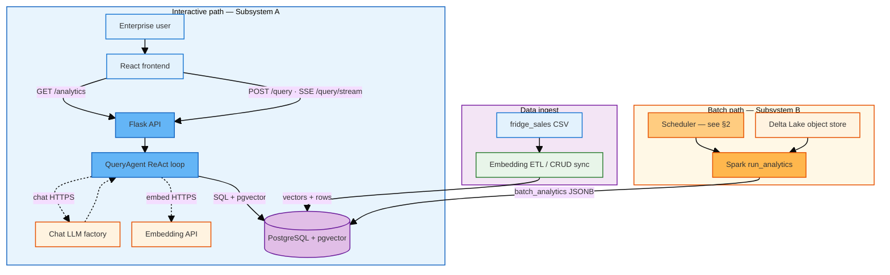
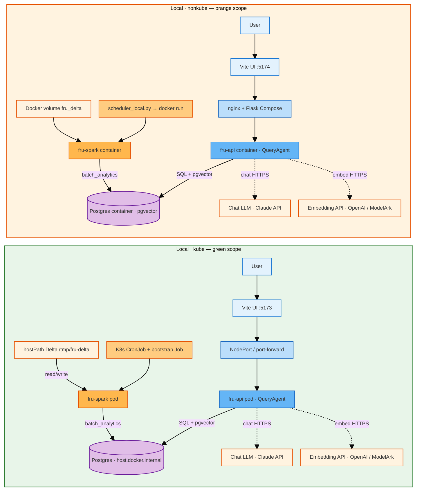
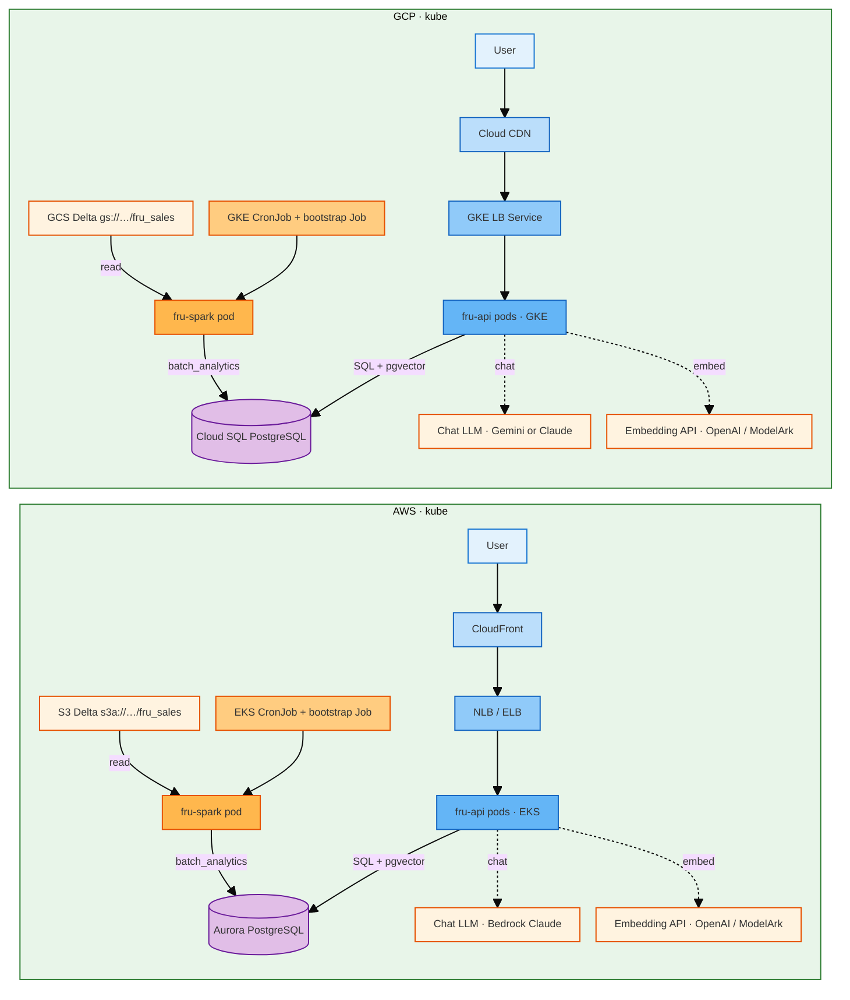
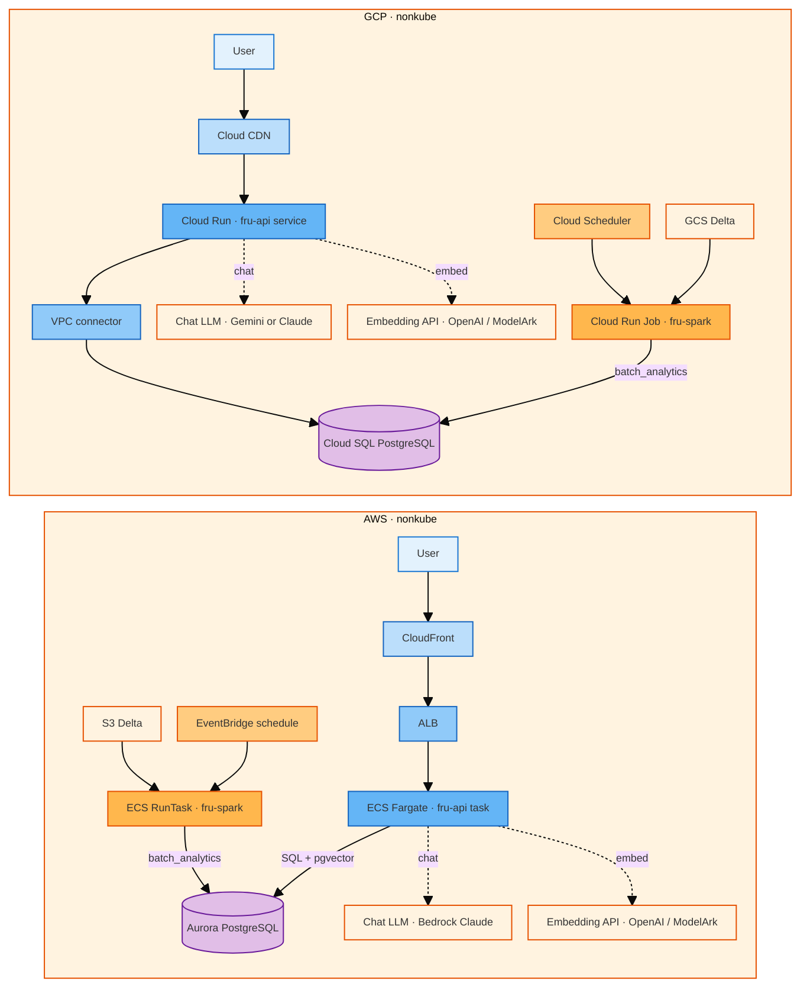
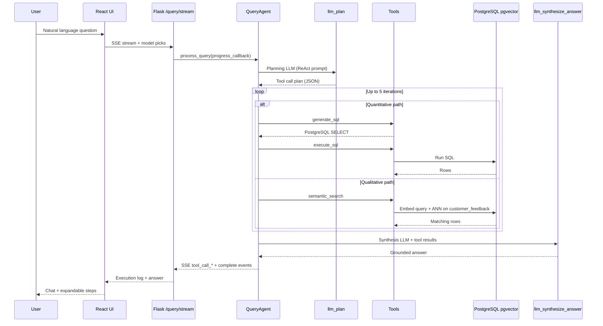
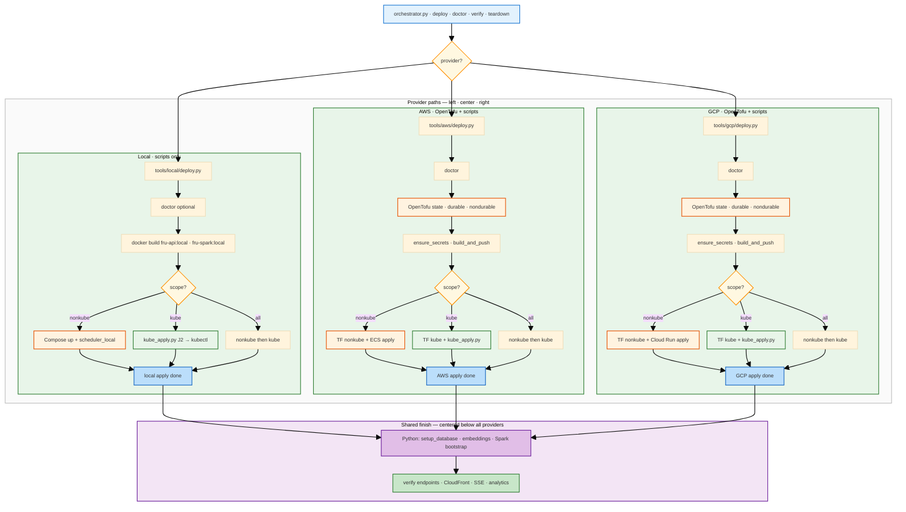

<h1 id="fru-readme-title" style="color:#0d47a1;font-size:1.5em;font-weight:700;border-bottom:2px solid #90caf9;padding-bottom:0.25em;margin-top:0">FRU GenAI Analytics — Multi-Cloud Enterprise Analytics Platform</h1>

**Fridges R Us (FRU)** is a conversational analytics assistant over refrigerator sales: structured fields (brand, store, ratings) plus unstructured customer feedback. Users ask in plain language; answers are grounded in **SQL**, **vector search**, and **batch aggregates**—not free-form hallucination.

Gen 2 of [ultra-fru-genai-analytics](https://github.com/horselord-joe-8053/ultra-fru-genai-analytics): RAG + pgvector, a **ReAct agent** with live **execution-log** streaming, and **repeatable multi-cloud deploy/teardown** (`local` · `AWS` · `GCP` × `kube` · `nonkube`).

---

<h2 id="table-of-contents" style="color:#1565c0;font-size:1.22em;font-weight:650;border-left:4px solid #42a5f5;padding-left:10px;margin-top:1.1em">📋 Table of Contents</h2>

- [🧩 1. System architecture](#architecture)
- [🗺 2. Deployment topology (3×2 matrix)](#deployment-topology)
- [🤖 3. Agent query flow](#agent-query-flow)
- [✨ 4. Golden separation](#golden-separation)
- [🏗 5. Cloud deploy pipeline](#deploy-pipeline)
- [🚀 6. Quick start](#quick-start)
- [⚙️ 7. Configuration](#configuration)
- [📦 8. Technology reference](#tech-reference)
- [🗄 9. Data model](#data-model)
- [🧪 10. Testing](#testing)
- [📚 11. War stories & docs](#war-stories-docs)

---

<h2 id="architecture" style="color:#1565c0;font-size:1.22em;font-weight:650;border-left:4px solid #42a5f5;padding-left:10px;margin-top:1.1em">🧩 1. System architecture</h2>

One logical system in every environment: **two container images** (`fru-api`, `fru-spark`), **one PostgreSQL** database per env/region, **two subsystems** that share the DB but never call each other directly.

**Legend:** <span style="background:#e3f2fd;padding:2px 4px">blue</span> = interactive / API path · <span style="background:#fff3e0;padding:2px 4px">amber</span> = batch / Spark path · <span style="background:#ede7f6;padding:2px 4px">purple</span> = shared storage


```mermaid
%%{init: {'theme':'base', 'themeVariables': {'fontSize':'9px', 'fontFamily':'sans-serif'}, 'flowchart': {'nodeSpacing':14, 'rankSpacing':18, 'padding':8, 'useMaxWidth':true}}}%%
flowchart TB
  subgraph interactive["Interactive path — Subsystem A"]
    U["Enterprise user"]
    UI["React frontend"]
    API["Flask API"]
    AG["QueryAgent ReAct loop"]
    LLM["Chat LLM factory"]
    EMB["Embedding API"]
    PG[("PostgreSQL + pgvector")]
    U --> UI
    UI -->|"GET /analytics"| API
    UI -->|"POST /query · SSE /query/stream"| API
    API --> AG
    AG -->|"SQL + pgvector"| PG
    AG -.->|"chat HTTPS"| LLM
    AG -.->|"embed HTTPS"| EMB
    LLM -.-> AG
  end

  subgraph ingest["Data ingest"]
    CSV["fridge_sales CSV"]
    ETL["Embedding ETL / CRUD sync"]
    CSV --> ETL
    ETL -->|"vectors + rows"| PG
  end

  subgraph batch["Batch path — Subsystem B"]
    SCHED["Scheduler — see §2"]
    SPARK["Spark run_analytics"]
    DELTA["Delta Lake object store"]
    SCHED --> SPARK
    DELTA --> SPARK
    SPARK -->|"batch_analytics JSONB"| PG
  end

  style U fill:#e3f2fd,stroke:#1976d2,stroke-width:1px,font-size:9px
  style UI fill:#e3f2fd,stroke:#1976d2,stroke-width:1px,font-size:9px
  style API fill:#64b5f6,stroke:#1565c0,stroke-width:1px,font-size:9px
  style AG fill:#64b5f6,stroke:#1565c0,stroke-width:1px,font-size:9px
  style LLM fill:#fff3e0,stroke:#e65100,stroke-width:1px,font-size:9px
  style EMB fill:#fff3e0,stroke:#e65100,stroke-width:1px,font-size:9px
  style PG fill:#e1bee7,stroke:#6a1b9a,stroke-width:1px,font-size:9px
  style CSV fill:#e3f2fd,stroke:#1976d2,stroke-width:1px,font-size:9px
  style ETL fill:#e8f5e9,stroke:#2e7d32,stroke-width:1px,font-size:9px
  style SCHED fill:#ffcc80,stroke:#e65100,stroke-width:1px,font-size:9px
  style SPARK fill:#ffb74d,stroke:#e65100,stroke-width:1px,font-size:9px
  style DELTA fill:#fff3e0,stroke:#e65100,stroke-width:1px,font-size:9px
  style interactive fill:#e8f4fd,stroke:#1565c0,stroke-width:1px,font-size:9px
  style batch fill:#fff8e6,stroke:#e65100,stroke-width:1px,font-size:9px
  style ingest fill:#f3e5f5,stroke:#7b1fa2,stroke-width:1px,font-size:9px
```

| Subsystem | Serves | Reads | Writes |
|-----------|--------|-------|--------|
| **A — API + agent** | `/query`, `/query/stream`, `/analytics`, `/rawdata` | `fru_sales_embeddings`, `batch_analytics` | CRUD on raw rows; embedding sync on write |
| **B — Spark batch** | `/analytics` (indirect) | Delta `fru_sales`, Postgres `fru_sales_raw` | Delta table; `batch_analytics` |

Deeper diagrams per cloud: [docs/learned/cloud_shared/ARCHITECTURE_AWS_GCP_GENERAL.md](docs/learned/cloud_shared/ARCHITECTURE_AWS_GCP_GENERAL.md) · app layout: [docs/CORE_APP_STRUCTURE.md](docs/CORE_APP_STRUCTURE.md).

---

<h2 id="deployment-topology" style="color:#1565c0;font-size:1.22em;font-weight:650;border-left:4px solid #42a5f5;padding-left:10px;margin-top:1.1em">🗺 2. Deployment topology (3×2 matrix)</h2>

**Same application**, six concrete placements: **provider** (`local` · `AWS` · `GCP`) × **scope** (`kube` · `nonkube`).

| Axis | Meaning |
|------|---------|
| <span style="background:#e8f5e9;padding:2px 4px">**kube**</span> | Kubernetes — EKS, GKE, or Docker Desktop K8s. API + Spark as **pods**; Spark on **CronJob + bootstrap Job**. |
| <span style="background:#fff3e0;padding:2px 4px">**nonkube**</span> | No cluster ops — ECS Fargate, Cloud Run, or Docker Compose. API as **service/task**; Spark on **platform scheduler** or host loop. |

**Diagram legend (consistent across both charts below):**

<table>
<thead>
<tr style="background:#1565c0;color:white"><th>Color / lane</th><th>Components</th></tr>
</thead>
<tbody>
<tr><td style="background:#e8f4fd">Blue — Subsystem A</td><td style="background:#e8f5e9">User → edge/UI → <strong>fru-api</strong> (Flask + QueryAgent) → Postgres pgvector</td></tr>
<tr><td style="background:#fff8e1">Amber — Subsystem B</td><td style="background:#fff3e0">Scheduler → <strong>fru-spark</strong> → Delta → <code>batch_analytics</code> in Postgres</td></tr>
<tr><td style="background:#fff3e0">Orange — external AI</td><td style="background:#fff3e0"><strong>Chat LLM</strong> (plan + synthesize) and <strong>embedding API</strong> (vector search + CRUD sync) — HTTPS from API only; Spark does not call LLMs</td></tr>
<tr><td style="background:#f3e5f5">Purple — data plane</td><td style="background:#ede7f6">PostgreSQL (raw + embeddings + batch JSONB)</td></tr>
</tbody>
</table>

<h3 id="deploy-local-diagram" style="color:#00695c;font-size:1.05em;font-weight:600;margin-top:0.85em">2.1 Local — kube and nonkube (first)</h3>


```mermaid
%%{init: {'theme':'base', 'themeVariables': {'fontSize':'9px', 'fontFamily':'sans-serif'}, 'flowchart': {'nodeSpacing':14, 'rankSpacing':18, 'padding':8, 'useMaxWidth':true}}}%%
flowchart LR
  subgraph LK["Local · kube — green scope"]
    direction TB
    LU["User"]
    LUI["Vite UI :5173"]
    LNP["NodePort / port-forward"]
    LAPI["fru-api pod · QueryAgent"]
    LCHAT["Chat LLM · Claude API"]
    LEMB["Embedding API · OpenAI / ModelArk"]
    LPG[("Postgres · host.docker.internal")]
    LCRON["K8s CronJob + bootstrap Job"]
    LSPK["fru-spark pod"]
    LDEL["hostPath Delta /tmp/fru-delta"]
    LU --> LUI --> LNP --> LAPI
    LAPI -->|"SQL + pgvector"| LPG
    LAPI -.->|"chat HTTPS"| LCHAT
    LAPI -.->|"embed HTTPS"| LEMB
    LCRON --> LSPK
    LDEL -->|"read/write"| LSPK
    LSPK -->|"batch_analytics"| LPG
  end

  subgraph LN["Local · nonkube — orange scope"]
    direction TB
    NU["User"]
    NUI["Vite UI :5174"]
    NNG["nginx + Flask Compose"]
    NAPI["fru-api container · QueryAgent"]
    NCHAT["Chat LLM · Claude API"]
    NEMB["Embedding API · OpenAI / ModelArk"]
    NPG[("Postgres container · pgvector")]
    NSCH["scheduler_local.py → docker run"]
    NSPK["fru-spark container"]
    NDEL["Docker volume fru_delta"]
    NU --> NUI --> NNG --> NAPI
    NAPI -->|"SQL + pgvector"| NPG
    NAPI -.->|"chat HTTPS"| NCHAT
    NAPI -.->|"embed HTTPS"| NEMB
    NSCH --> NSPK
    NDEL --> NSPK
    NSPK -->|"batch_analytics"| NPG
  end

  style LK fill:#e8f5e9,stroke:#2e7d32,stroke-width:1px,font-size:9px
  style LN fill:#fff3e0,stroke:#e65100,stroke-width:1px,font-size:9px
  style LU fill:#e3f2fd,stroke:#1976d2,stroke-width:1px,font-size:9px
  style LUI fill:#e3f2fd,stroke:#1976d2,stroke-width:1px,font-size:9px
  style LNP fill:#bbdefb,stroke:#1565c0,stroke-width:1px,font-size:9px
  style LAPI fill:#64b5f6,stroke:#1565c0,stroke-width:1px,font-size:9px
  style LCHAT fill:#fff3e0,stroke:#e65100,stroke-width:1px,font-size:9px
  style LEMB fill:#fff3e0,stroke:#e65100,stroke-width:1px,font-size:9px
  style LPG fill:#e1bee7,stroke:#6a1b9a,stroke-width:1px,font-size:9px
  style LCRON fill:#ffcc80,stroke:#e65100,stroke-width:1px,font-size:9px
  style LSPK fill:#ffb74d,stroke:#e65100,stroke-width:1px,font-size:9px
  style LDEL fill:#fff3e0,stroke:#e65100,stroke-width:1px,font-size:9px
  style NU fill:#e3f2fd,stroke:#1976d2,stroke-width:1px,font-size:9px
  style NUI fill:#e3f2fd,stroke:#1976d2,stroke-width:1px,font-size:9px
  style NNG fill:#bbdefb,stroke:#1565c0,stroke-width:1px,font-size:9px
  style NAPI fill:#64b5f6,stroke:#1565c0,stroke-width:1px,font-size:9px
  style NCHAT fill:#fff3e0,stroke:#e65100,stroke-width:1px,font-size:9px
  style NEMB fill:#fff3e0,stroke:#e65100,stroke-width:1px,font-size:9px
  style NPG fill:#e1bee7,stroke:#6a1b9a,stroke-width:1px,font-size:9px
  style NSCH fill:#ffcc80,stroke:#e65100,stroke-width:1px,font-size:9px
  style NSPK fill:#ffb74d,stroke:#e65100,stroke-width:1px,font-size:9px
  style NDEL fill:#fff3e0,stroke:#e65100,stroke-width:1px,font-size:9px
```

<h3 id="deploy-kube-cloud-diagram" style="color:#00695c;font-size:1.05em;font-weight:600;margin-top:0.85em">2.2 Cloud · kube — AWS and GCP</h3>


```mermaid
%%{init: {'theme':'base', 'themeVariables': {'fontSize':'9px', 'fontFamily':'sans-serif'}, 'flowchart': {'nodeSpacing':14, 'rankSpacing':18, 'padding':8, 'useMaxWidth':true}}}%%
flowchart LR
  subgraph AK["AWS · kube"]
    direction TB
    AU["User"]
    ACF["CloudFront"]
    ANLB["NLB / ELB"]
    AAPI["fru-api pods · EKS"]
    ACHAT["Chat LLM · Bedrock Claude"]
    AEMB["Embedding API · OpenAI / ModelArk"]
    APG[("Aurora PostgreSQL")]
    ACRON["EKS CronJob + bootstrap Job"]
    ASPK["fru-spark pod"]
    AS3["S3 Delta s3a://…/fru_sales"]
    AU --> ACF --> ANLB --> AAPI
    AAPI -->|"SQL + pgvector"| APG
    AAPI -.->|"chat"| ACHAT
    AAPI -.->|"embed"| AEMB
    ACRON --> ASPK
    AS3 -->|"read"| ASPK
    ASPK -->|"batch_analytics"| APG
  end

  subgraph GK["GCP · kube"]
    direction TB
    GU["User"]
    GCDN["Cloud CDN"]
    GLB["GKE LB Service"]
    GAPI["fru-api pods · GKE"]
    GCHAT["Chat LLM · Gemini or Claude"]
    GEMB["Embedding API · OpenAI / ModelArk"]
    GPG[("Cloud SQL PostgreSQL")]
    GCRON["GKE CronJob + bootstrap Job"]
    GSPK["fru-spark pod"]
    GGCS["GCS Delta gs://…/fru_sales"]
    GU --> GCDN --> GLB --> GAPI
    GAPI -->|"SQL + pgvector"| GPG
    GAPI -.->|"chat"| GCHAT
    GAPI -.->|"embed"| GEMB
    GCRON --> GSPK
    GGCS -->|"read"| GSPK
    GSPK -->|"batch_analytics"| GPG
  end

  style AK fill:#e8f5e9,stroke:#2e7d32,stroke-width:1px,font-size:9px
  style GK fill:#e8f5e9,stroke:#2e7d32,stroke-width:1px,font-size:9px
  style AU fill:#e3f2fd,stroke:#1976d2,stroke-width:1px,font-size:9px
  style ACF fill:#bbdefb,stroke:#1565c0,stroke-width:1px,font-size:9px
  style ANLB fill:#90caf9,stroke:#1565c0,stroke-width:1px,font-size:9px
  style AAPI fill:#64b5f6,stroke:#1565c0,stroke-width:1px,font-size:9px
  style ACHAT fill:#fff3e0,stroke:#e65100,stroke-width:1px,font-size:9px
  style AEMB fill:#fff3e0,stroke:#e65100,stroke-width:1px,font-size:9px
  style APG fill:#e1bee7,stroke:#6a1b9a,stroke-width:1px,font-size:9px
  style ACRON fill:#ffcc80,stroke:#e65100,stroke-width:1px,font-size:9px
  style ASPK fill:#ffb74d,stroke:#e65100,stroke-width:1px,font-size:9px
  style AS3 fill:#fff3e0,stroke:#e65100,stroke-width:1px,font-size:9px
  style GU fill:#e3f2fd,stroke:#1976d2,stroke-width:1px,font-size:9px
  style GCDN fill:#bbdefb,stroke:#1565c0,stroke-width:1px,font-size:9px
  style GLB fill:#90caf9,stroke:#1565c0,stroke-width:1px,font-size:9px
  style GAPI fill:#64b5f6,stroke:#1565c0,stroke-width:1px,font-size:9px
  style GCHAT fill:#fff3e0,stroke:#e65100,stroke-width:1px,font-size:9px
  style GEMB fill:#fff3e0,stroke:#e65100,stroke-width:1px,font-size:9px
  style GPG fill:#e1bee7,stroke:#6a1b9a,stroke-width:1px,font-size:9px
  style GCRON fill:#ffcc80,stroke:#e65100,stroke-width:1px,font-size:9px
  style GSPK fill:#ffb74d,stroke:#e65100,stroke-width:1px,font-size:9px
  style GGCS fill:#fff3e0,stroke:#e65100,stroke-width:1px,font-size:9px
```

<h3 id="deploy-nonkube-cloud-diagram" style="color:#00695c;font-size:1.05em;font-weight:600;margin-top:0.85em">2.3 Cloud · nonkube — AWS and GCP</h3>


```mermaid
%%{init: {'theme':'base', 'themeVariables': {'fontSize':'9px', 'fontFamily':'sans-serif'}, 'flowchart': {'nodeSpacing':14, 'rankSpacing':18, 'padding':8, 'useMaxWidth':true}}}%%
flowchart LR
  subgraph AN["AWS · nonkube"]
    direction TB
    AU2["User"]
    ACF2["CloudFront"]
    AALB["ALB"]
    AECS["ECS Fargate · fru-api task"]
    ACHAT2["Chat LLM · Bedrock Claude"]
    AEMB2["Embedding API · OpenAI / ModelArk"]
    APG2[("Aurora PostgreSQL")]
    AEB["EventBridge schedule"]
    ASPK2["ECS RunTask · fru-spark"]
    AS32["S3 Delta"]
    AU2 --> ACF2 --> AALB --> AECS
    AECS -->|"SQL + pgvector"| APG2
    AECS -.->|"chat"| ACHAT2
    AECS -.->|"embed"| AEMB2
    AEB --> ASPK2
    AS32 --> ASPK2
    ASPK2 -->|"batch_analytics"| APG2
  end

  subgraph GN["GCP · nonkube"]
    direction TB
    GU2["User"]
    GCDN2["Cloud CDN"]
    GCR["Cloud Run · fru-api service"]
    GVPC["VPC connector"]
    GCHAT2["Chat LLM · Gemini or Claude"]
    GEMB2["Embedding API · OpenAI / ModelArk"]
    GPG2[("Cloud SQL PostgreSQL")]
    GCS2["Cloud Scheduler"]
    GCRJ["Cloud Run Job · fru-spark"]
    GGCS2["GCS Delta"]
    GU2 --> GCDN2 --> GCR
    GCR --> GVPC --> GPG2
    GCR -.->|"chat"| GCHAT2
    GCR -.->|"embed"| GEMB2
    GCS2 --> GCRJ
    GGCS2 --> GCRJ
    GCRJ -->|"batch_analytics"| GPG2
  end

  style AN fill:#fff3e0,stroke:#e65100,stroke-width:1px,font-size:9px
  style GN fill:#fff3e0,stroke:#e65100,stroke-width:1px,font-size:9px
  style AU2 fill:#e3f2fd,stroke:#1976d2,stroke-width:1px,font-size:9px
  style ACF2 fill:#bbdefb,stroke:#1565c0,stroke-width:1px,font-size:9px
  style AALB fill:#90caf9,stroke:#1565c0,stroke-width:1px,font-size:9px
  style AECS fill:#64b5f6,stroke:#1565c0,stroke-width:1px,font-size:9px
  style ACHAT2 fill:#fff3e0,stroke:#e65100,stroke-width:1px,font-size:9px
  style AEMB2 fill:#fff3e0,stroke:#e65100,stroke-width:1px,font-size:9px
  style APG2 fill:#e1bee7,stroke:#6a1b9a,stroke-width:1px,font-size:9px
  style AEB fill:#ffcc80,stroke:#e65100,stroke-width:1px,font-size:9px
  style ASPK2 fill:#ffb74d,stroke:#e65100,stroke-width:1px,font-size:9px
  style AS32 fill:#fff3e0,stroke:#e65100,stroke-width:1px,font-size:9px
  style GU2 fill:#e3f2fd,stroke:#1976d2,stroke-width:1px,font-size:9px
  style GCDN2 fill:#bbdefb,stroke:#1565c0,stroke-width:1px,font-size:9px
  style GCR fill:#64b5f6,stroke:#1565c0,stroke-width:1px,font-size:9px
  style GVPC fill:#90caf9,stroke:#1565c0,stroke-width:1px,font-size:9px
  style GCHAT2 fill:#fff3e0,stroke:#e65100,stroke-width:1px,font-size:9px
  style GEMB2 fill:#fff3e0,stroke:#e65100,stroke-width:1px,font-size:9px
  style GPG2 fill:#e1bee7,stroke:#6a1b9a,stroke-width:1px,font-size:9px
  style GCS2 fill:#ffcc80,stroke:#e65100,stroke-width:1px,font-size:9px
  style GCRJ fill:#ffb74d,stroke:#e65100,stroke-width:1px,font-size:9px
  style GGCS2 fill:#fff3e0,stroke:#e65100,stroke-width:1px,font-size:9px
```

**Reading the charts:** §2.1 **local first** (kube vs nonkube side by side); §2.2–2.3 **cloud** kube then nonkube. Green border = **kube** scope; orange border = **nonkube**. Dotted arrows = HTTPS to external **chat / embedding** APIs. Solid arrows = data plane only. Spark never calls LLMs.

<h3 id="deploy-matrix-table" style="color:#00695c;font-size:1.05em;font-weight:600;margin-top:0.85em">2.4 Full mapping table (6 combinations)</h3>

<table>
<thead>
<tr style="background:#1565c0;color:white"><th>Provider × scope</th><th>API runtime</th><th>Spark schedule</th><th>Database</th><th>Delta / object store</th><th>Default chat LLM</th></tr>
</thead>
<tbody>
<tr><td style="background:#e3f2fd"><strong>Local · nonkube</strong></td><td style="background:#fff3e0">Docker Compose</td><td style="background:#fff3e0"><code>scheduler_local.py</code> → <code>docker run</code> <span style="background:#fff9c4;padding:1px 3px">analytics-worker planned</span></td><td style="background:#ede7f6">Postgres container + pgvector</td><td style="background:#e8f5e9">Docker volume <code>fru_delta</code></td><td style="background:#e3f2fd">Claude API</td></tr>
<tr><td style="background:#e3f2fd"><strong>Local · kube</strong></td><td style="background:#e8f5e9">Docker Desktop K8s + NodePort</td><td style="background:#e8f5e9">K8s CronJob + bootstrap Job</td><td style="background:#ede7f6">Postgres on host (<code>host.docker.internal</code>)</td><td style="background:#e8f5e9">hostPath <code>/tmp/fru-delta</code></td><td style="background:#e3f2fd">Claude API</td></tr>
<tr><td style="background:#e3f2fd"><strong>AWS · nonkube</strong></td><td style="background:#fff3e0">ECS Fargate + ALB + CloudFront</td><td style="background:#fff3e0">EventBridge → ECS RunTask</td><td style="background:#ede7f6">Aurora PostgreSQL</td><td style="background:#e8f5e9">S3 <code>delta/{scope}/</code></td><td style="background:#e8f5e9">Bedrock Claude</td></tr>
<tr><td style="background:#e3f2fd"><strong>AWS · kube</strong></td><td style="background:#e8f5e9">EKS + NLB + CloudFront</td><td style="background:#e8f5e9">EKS CronJob</td><td style="background:#ede7f6">Aurora PostgreSQL</td><td style="background:#e8f5e9">S3</td><td style="background:#e8f5e9">Bedrock Claude</td></tr>
<tr><td style="background:#e3f2fd"><strong>GCP · nonkube</strong></td><td style="background:#fff3e0">Cloud Run + VPC connector + CDN</td><td style="background:#fff3e0">Cloud Scheduler → Cloud Run Job</td><td style="background:#ede7f6">Cloud SQL PostgreSQL</td><td style="background:#e8f5e9">GCS <code>delta/{scope}/</code></td><td style="background:#e8f5e9">Gemini or Claude (<code>GCP_LLM_PROVIDER</code>)</td></tr>
<tr><td style="background:#e3f2fd"><strong>GCP · kube</strong></td><td style="background:#e8f5e9">GKE + LB (+ optional <code>kube_proxy</code>)</td><td style="background:#e8f5e9">GKE CronJob</td><td style="background:#ede7f6">Cloud SQL PostgreSQL</td><td style="background:#e8f5e9">GCS</td><td style="background:#e8f5e9">Gemini or Claude</td></tr>
</tbody>
</table>

**Shared across all six:** same `run_analytics.py`, same Jinja K8s templates (`infra_terraform/modules/cloud_shared/k8s/`), same `batch_analytics` table semantics — [ANALYTICS_AND_DATA.md](docs/learned/cloud_shared/ANALYTICS_AND_DATA.md).

**Scope `all`:** deploy **nonkube first**, then **kube** (shared durable infra runs once). Teardown reverses order.

AWS ↔ GCP component map: [docs/GCP_AWS_REFERENCE.md](docs/GCP_AWS_REFERENCE.md).

---

<h2 id="agent-query-flow" style="color:#1565c0;font-size:1.22em;font-weight:650;border-left:4px solid #42a5f5;padding-left:10px;margin-top:1.1em">🤖 3. Agent query flow</h2>

When `USE_AGENT_QUERY=true`, questions hit **`GET /query/stream`** (SSE) or **`POST /query`**. The UI **Execution log** shows each step live — planner LLM, tool calls, token usage, and final synthesis (`ExecutionPanel.tsx`).

**Entry:** `core_app/backend/agents/query_agent.py` · routes: `core_app/backend/api/app.py`


```mermaid
sequenceDiagram
  participant User
  participant UI as React UI
  participant API as Flask /query/stream
  participant Agent as QueryAgent
  participant Plan as llm_plan
  participant Tools as Tools
  participant PG as PostgreSQL pgvector
  participant Synth as llm_synthesize_answer

  User->>UI: Natural language question
  UI->>API: SSE stream + model picks
  API->>Agent: process_query(progress_callback)
  Agent->>Plan: Planning LLM (ReAct prompt)
  Plan-->>Agent: Tool call plan (JSON)

  loop Up to 5 iterations
    alt Quantitative path
      Agent->>Tools: generate_sql
      Tools-->>Agent: PostgreSQL SELECT
      Agent->>Tools: execute_sql
      Tools->>PG: Run SQL
      PG-->>Tools: Rows
    else Qualitative path
      Agent->>Tools: semantic_search
      Tools->>PG: Embed query + ANN on customer_feedback
      PG-->>Tools: Matching rows
    end
  end

  Agent->>Synth: Synthesis LLM + tool results
  Synth-->>Agent: Grounded answer
  Agent-->>API: SSE tool_call_* + complete events
  API-->>UI: Execution log + answer
  UI-->>User: Chat + expandable steps
```

### 3.1 Tools and pseudo-tools (execution log labels)

<table>
<thead>
<tr style="background:#1565c0;color:white"><th>Step</th><th>Log label</th><th>Role</th><th>Implementation</th></tr>
</thead>
<tbody>
<tr><td style="background:#e3f2fd">Planning</td><td style="background:#fff3e0"><code>pseudo_tool#llm_plan</code></td><td style="background:#e8f5e9">Decide which tools to run next (max 5 iterations)</td><td style="background:#e8f5e9">Chat LLM + <code>get_planning_prompt()</code></td></tr>
<tr><td style="background:#e3f2fd">SQL generation</td><td style="background:#fff3e0"><code>generate_sql</code></td><td style="background:#e8f5e9">NL → PostgreSQL over <code>fru_sales_embeddings</code></td><td style="background:#e8f5e9"><code>SQLGeneratorTool</code></td></tr>
<tr><td style="background:#e3f2fd">SQL execution</td><td style="background:#fff3e0"><code>execute_sql</code></td><td style="background:#e8f5e9">Run SELECT; return rows to agent</td><td style="background:#e8f5e9"><code>SQLTool</code> · auto-chained after <code>generate_sql</code></td></tr>
<tr><td style="background:#e3f2fd">Vector search</td><td style="background:#fff3e0"><code>semantic_search</code></td><td style="background:#e8f5e9">Similarity on <code>customer_feedback</code> embeddings</td><td style="background:#e8f5e9"><code>SemanticSearchTool</code> · active profile from header</td></tr>
<tr><td style="background:#e3f2fd">Answer</td><td style="background:#fff3e0"><code>pseudo_tool#llm_synthesize_answer</code></td><td style="background:#e8f5e9">Narrative answer citing SQL / search results</td><td style="background:#e8f5e9">Chat LLM + <code>_select_synthesis_inputs()</code></td></tr>
</tbody>
</table>

**Typical patterns:** *“Which stores have highest revenue?”* → `generate_sql` → `execute_sql` → synthesize. *“Why are Samsung customers unhappy?”* → `semantic_search` (often with sentiment filters) → synthesize. Complex questions may interleave both.

**Model picks:** Header dropdowns send `embedding_profile` + `chat_choice`; server validates pairs via `GET /model-catalog` before streaming. SSE event `model_context` mirrors display labels in the log.

**Verify:** integration tests `tests/integration/api/test_query_flow.py`, `test_exec_log_sse.py`.

---

<h2 id="golden-separation" style="color:#1565c0;font-size:1.22em;font-weight:650;border-left:4px solid #42a5f5;padding-left:10px;margin-top:1.1em">✨ 4. Golden separation</h2>

> **Spark does batch intelligence.**  
> **pgvector + SQL do interactive intelligence.**  
> **The LLM explains what was retrieved.**

Heavy aggregation stays in scheduled Spark; the API path stays fast; the model never substitutes for missing data.

---

<h2 id="deploy-pipeline" style="color:#1565c0;font-size:1.22em;font-weight:650;border-left:4px solid #42a5f5;padding-left:10px;margin-top:1.1em">🏗 5. Cloud deploy pipeline</h2>

Deploy is **not** “run Terraform once.” Python orchestration enforces **phase order**, secrets, image build, DB bootstrap, analytics bootstrap, and verification — lessons from [war stories](#war-stories-docs).

### 5.1 Entry points

| Command | Role |
|---------|------|
| **`orchestrator.py`** | Unified CLI: `deploy` · `teardown` · `doctor` · `verify` for `local` / `aws` / `gcp` |
| **`tools/{aws,gcp,local}/deploy.py`** | Provider-specific phased deploy (called by orchestrator) |
| **`tools/{aws,gcp}/teardown.py`** | Pre-destroy hooks + stack destroy |
| **`infra_terraform/live_deploy/`** | OpenTofu/Terraform roots (cloud only) |

```bash
# Same mental model everywhere
python orchestrator.py doctor  --provider aws --env dev
python orchestrator.py deploy   --provider aws --scope all --env dev
python orchestrator.py verify   --provider aws --scope all --env dev
python orchestrator.py teardown --provider aws --scope all --env dev --non-interactive
```

`orchestrator.py` sets `REPO_ROOT`, `PYTHONPATH`, and shared **`TF_DATA_DIR=tofu_data/`** for all OpenTofu invocations.

<h3 id="deploy-phase-flow" style="color:#00695c;font-size:1.05em;font-weight:600;margin-top:0.85em">5.2 Deploy phase flow — provider × scope × IaC vs scripts</h3>

One page overview: **orchestrator.py** routes to provider scripts; **cloud** pairs **OpenTofu stacks** with **Python apply** steps; **local** is scripts + Docker only. **Scope `all`** runs **nonkube then kube** (shared infra once).


```mermaid
%%{init: {'theme':'base', 'themeVariables': {'fontSize':'8px', 'fontFamily':'sans-serif'}, 'flowchart': {'nodeSpacing':12, 'rankSpacing':28, 'padding':8, 'useMaxWidth':true}}}%%
flowchart TB
  ORCH["orchestrator.py · deploy · doctor · verify · teardown"]
  ORCH --> PRV{"provider?"}

  PRV --> LOC["tools/local/deploy.py"]
  PRV --> AWS["tools/aws/deploy.py"]
  PRV --> GCP["tools/gcp/deploy.py"]

  subgraph COLS["Provider paths — left · center · right"]
    direction LR

    subgraph LOCAL["Local · scripts only"]
      direction TB
      LOC --> LDOC["doctor optional"]
      LDOC --> LIMG["docker build fru-api:local · fru-spark:local"]
      LIMG --> LSC{"scope?"}
      LSC -->|"nonkube"| LNK["Compose up + scheduler_local"]
      LSC -->|"kube"| LK["kube_apply.py J2 → kubectl"]
      LSC -->|"all"| LALL["nonkube then kube"]
      LNK --> LAPPLY["local apply done"]
      LK --> LAPPLY
      LALL --> LAPPLY
    end

    subgraph AWSCOL["AWS · OpenTofu + scripts"]
      direction TB
      AWS --> ADOC["doctor"]
      ADOC --> ATOFU["OpenTofu state · durable · nondurable"]
      ATOFU --> ASEC["ensure_secrets · build_and_push"]
      ASEC --> ASC{"scope?"}
      ASC -->|"nonkube"| ANK["TF nonkube + ECS apply"]
      ASC -->|"kube"| AK["TF kube + kube_apply.py"]
      ASC -->|"all"| AALL["nonkube then kube"]
      ANK --> AAPPLY["AWS apply done"]
      AK --> AAPPLY
      AALL --> AAPPLY
    end

    subgraph GCPCOL["GCP · OpenTofu + scripts"]
      direction TB
      GCP --> GDOC["doctor"]
      GDOC --> GTOFU["OpenTofu state · durable · nondurable"]
      GTOFU --> GSEC["ensure_secrets · build_and_push"]
      GSEC --> GSC{"scope?"}
      GSC -->|"nonkube"| GNK["TF nonkube + Cloud Run apply"]
      GSC -->|"kube"| GK["TF kube + kube_apply.py"]
      GSC -->|"all"| GALL["nonkube then kube"]
      GNK --> GAPPLY["GCP apply done"]
      GK --> GAPPLY
      GALL --> GAPPLY
    end
  end

  subgraph FINISH["Shared finish — centered below all providers"]
    direction TB
    CFIN["Python: setup_database · embeddings · Spark bootstrap"]
    CVER["verify endpoints · CloudFront · SSE · analytics"]
    CFIN --> CVER
  end

  LAPPLY --> CFIN
  AAPPLY --> CFIN
  GAPPLY --> CFIN

  style ORCH fill:#e3f2fd,stroke:#1976d2,stroke-width:1px,font-size:8px
  style PRV fill:#fff8e1,stroke:#ff8f00,stroke-width:1px,font-size:8px
  style COLS fill:#fafafa,stroke:#bdbdbd,stroke-width:1px,font-size:8px
  style LOCAL fill:#e8f5e9,stroke:#2e7d32,stroke-width:1px,font-size:8px
  style AWSCOL fill:#e8f5e9,stroke:#2e7d32,stroke-width:1px,font-size:8px
  style GCPCOL fill:#e8f5e9,stroke:#2e7d32,stroke-width:1px,font-size:8px
  style FINISH fill:#f3e5f5,stroke:#6a1b9a,stroke-width:1px,font-size:8px
  style LSC fill:#fff8e1,stroke:#ff8f00,stroke-width:1px,font-size:8px
  style ASC fill:#fff8e1,stroke:#ff8f00,stroke-width:1px,font-size:8px
  style GSC fill:#fff8e1,stroke:#ff8f00,stroke-width:1px,font-size:8px
  style LNK fill:#fff3e0,stroke:#e65100,stroke-width:1px,font-size:8px
  style LK fill:#e8f5e9,stroke:#2e7d32,stroke-width:1px,font-size:8px
  style ANK fill:#fff3e0,stroke:#e65100,stroke-width:1px,font-size:8px
  style AK fill:#e8f5e9,stroke:#2e7d32,stroke-width:1px,font-size:8px
  style GNK fill:#fff3e0,stroke:#e65100,stroke-width:1px,font-size:8px
  style GK fill:#e8f5e9,stroke:#2e7d32,stroke-width:1px,font-size:8px
  style ATOFU fill:#fff3e0,stroke:#e65100,stroke-width:1px,font-size:8px
  style GTOFU fill:#fff3e0,stroke:#e65100,stroke-width:1px,font-size:8px
  style LAPPLY fill:#bbdefb,stroke:#1565c0,stroke-width:1px,font-size:8px
  style AAPPLY fill:#bbdefb,stroke:#1565c0,stroke-width:1px,font-size:8px
  style GAPPLY fill:#bbdefb,stroke:#1565c0,stroke-width:1px,font-size:8px
  style CFIN fill:#e1bee7,stroke:#6a1b9a,stroke-width:1px,font-size:8px
  style CVER fill:#c8e6c9,stroke:#2e7d32,stroke-width:1px,font-size:8px
```

<table>
<thead>
<tr style="background:#1565c0;color:white"><th>Layer</th><th>Local</th><th>AWS</th><th>GCP</th></tr>
</thead>
<tbody>
<tr><td style="background:#e3f2fd"><strong>IaC (OpenTofu)</strong></td><td style="background:#fff3e0">none</td><td style="background:#e8f5e9"><code>live_deploy/aws/scope_shared/{durable,nondurable}</code> + <code>{kube,nonkube}</code></td><td style="background:#e8f5e9"><code>live_deploy/gcp/…</code> same layout</td></tr>
<tr><td style="background:#e3f2fd"><strong>Python orchestration</strong></td><td style="background:#fff3e0"><code>tools/local/deploy.py</code></td><td style="background:#e8f5e9"><code>tools/aws/deploy.py</code></td><td style="background:#e8f5e9"><code>tools/gcp/deploy.py</code></td></tr>
<tr><td style="background:#e3f2fd"><strong>nonkube apply</strong></td><td style="background:#fff3e0">Docker Compose</td><td style="background:#fff3e0">ECS task + EventBridge (TF + scripts)</td><td style="background:#fff3e0">Cloud Run + Scheduler (TF + scripts)</td></tr>
<tr><td style="background:#e3f2fd"><strong>kube apply</strong></td><td style="background:#e8f5e9">J2 → kubectl (no TF)</td><td style="background:#e8f5e9">EKS stack (TF) + <code>tools/aws/kube/kube_apply.py</code></td><td style="background:#e8f5e9">GKE stack (TF) + <code>tools/gcp/kube/kube_apply.py</code></td></tr>
<tr><td style="background:#e3f2fd"><strong>Shared scripts</strong></td><td style="background:#e8f5e9" colspan="3"><code>tools/cloud_shared/k8s_j2_render.py</code> · <code>setup_database</code> · <code>build_and_push</code> · <code>verify/</code></td></tr>
</tbody>
</table>

### 5.3 `infra_terraform/` layout

<table>
<thead>
<tr style="background:#1565c0;color:white"><th>Path</th><th>Provisions</th></tr>
</thead>
<tbody>
<tr><td style="background:#e3f2fd"><code>modules/aws/</code> · <code>modules/gcp/</code></td><td style="background:#e8f5e9">Provider-specific VPC, RDS/Cloud SQL, EKS/GKE, ECS/Cloud Run, CDN, schedulers</td></tr>
<tr><td style="background:#e3f2fd"><code>modules/cloud_shared/k8s/*.yaml.j2</code></td><td style="background:#fff3e0">Jinja templates: API Deployment, Service, Spark bootstrap Job, CronJob</td></tr>
<tr><td style="background:#e3f2fd"><code>live_deploy/{aws,gcp}/scope_shared/durable</code></td><td style="background:#e8f5e9">Long-lived: VPC, Aurora/Cloud SQL, secret *containers*</td></tr>
<tr><td style="background:#e3f2fd"><code>live_deploy/.../scope_shared/nondurable</code></td><td style="background:#fff3e0">Delta buckets, ECR/Artifact Registry, shorter-lived shared assets</td></tr>
<tr><td style="background:#e3f2fd"><code>live_deploy/{aws,gcp}/kube</code></td><td style="background:#e8f5e9">EKS/GKE cluster + CDN front door</td></tr>
<tr><td style="background:#e3f2fd"><code>live_deploy/{aws,gcp}/nonkube</code></td><td style="background:#fff3e0">ECS/Cloud Run services + schedulers</td></tr>
</tbody>
</table>

**State:** AWS → S3 + DynamoDB lock; GCP → GCS. **Durable destroy** requires explicit guards (`ALLOW_DURABLE_DESTROY=YES` on AWS).

### 5.4 `tools/` layout

<table>
<thead>
<tr style="background:#1565c0;color:white"><th>Path</th><th>Role</th></tr>
</thead>
<tbody>
<tr><td style="background:#e3f2fd"><code>tools/aws/deploy.py</code></td><td style="background:#e8f5e9">Phased AWS deploy; calls OpenTofu + <code>kube_apply</code> / ECS apply</td></tr>
<tr><td style="background:#e3f2fd"><code>tools/gcp/deploy.py</code></td><td style="background:#e8f5e9">GCP equivalent</td></tr>
<tr><td style="background:#e3f2fd"><code>tools/local/deploy.py</code></td><td style="background:#fff3e0">Compose + Docker Desktop K8s; no Terraform</td></tr>
<tr><td style="background:#e3f2fd"><code>tools/cloud_shared/k8s_j2_render.py</code></td><td style="background:#e8f5e9">Render J2 → YAML for kubectl</td></tr>
<tr><td style="background:#e3f2fd"><code>tools/cloud_shared/verify/</code></td><td style="background:#fff3e0">Shared health + SSE checks used by orchestrator verify</td></tr>
<tr><td style="background:#e3f2fd"><code>tools/{aws,gcp}/scope_shared/deploy/</code></td><td style="background:#e8f5e9">DB setup, image build/push, secrets ensure</td></tr>
</tbody>
</table>

Further reading: [TERRA_LEARNED.md](docs/learned/terra/TERRA_LEARNED.md) · [DEPLOY_BUILD_DOCKER.md](docs/learned/cloud_shared/DEPLOY_BUILD_DOCKER.md) · [CONFIG_SCHEMA.md](docs/CONFIG_SCHEMA.md).

---

<h2 id="quick-start" style="color:#1565c0;font-size:1.22em;font-weight:650;border-left:4px solid #42a5f5;padding-left:10px;margin-top:1.1em">🚀 6. Quick start</h2>

```bash
python3 -m venv .venv && source .venv/bin/activate
pip install -r requirements.txt
cp .env.example .env   # OPENAI_API_KEY, PG*, cloud keys as needed

# Local — kube + nonkube, start UI, verify
python orchestrator.py deploy --provider local --scope all

# AWS
python orchestrator.py doctor --provider aws --env dev
python orchestrator.py deploy --provider aws --scope all --env dev

# GCP
python orchestrator.py deploy --provider gcp --scope all --env dev --cloud-region us-central1

# Teardown
python orchestrator.py teardown --provider local
python orchestrator.py teardown --provider aws --scope all --env dev --non-interactive
```

| Target | API URL | Dev UI (Vite) |
|--------|---------|---------------|
| Local nonkube | `http://localhost:5001` | port **5174** — see [LOCAL_PORTS_AND_UI_ENTRY_POINTS.md](docs/learned/local/LOCAL_PORTS_AND_UI_ENTRY_POINTS.md) |
| Local kube | NodePort / port-forward | port **5173** |

After local deploy: `pip install -r requirements-dev.txt && ./scripts/run_integration_tests.sh`

**Prerequisites:** Python 3.10+, Docker; for cloud add OpenTofu/Terraform, `aws` or `gcloud` CLI. Full matrix: [§2.1](#deployment-topology).

---

<h2 id="configuration" style="color:#1565c0;font-size:1.22em;font-weight:650;border-left:4px solid #42a5f5;padding-left:10px;margin-top:1.1em">⚙️ 7. Configuration</h2>

Copy `.env.example` → `.env`. YAML sizing: `config/local/local_deploy_config.yaml`, `config/cloud/{aws,gcp}_deploy_config.yaml`.

<table>
<thead>
<tr style="background:#1565c0;color:white"><th>Group</th><th>Key vars</th><th>Purpose</th></tr>
</thead>
<tbody>
<tr><td style="background:#e3f2fd"><strong>Agent</strong></td><td style="background:#e8f5e9"><code>USE_AGENT_QUERY=true</code></td><td style="background:#fff3e0">Enable ReAct path + execution log</td></tr>
<tr><td style="background:#e3f2fd"><strong>Database</strong></td><td style="background:#e8f5e9"><code>PGHOST</code>, <code>PGPASSWORD</code>, …</td><td style="background:#fff3e0">Local / Aurora / Cloud SQL</td></tr>
<tr><td style="background:#e3f2fd"><strong>Embeddings</strong></td><td style="background:#e8f5e9"><code>EMBEDDING_ACTIVE_PROFILE</code>, <code>OPENAI_API_KEY</code>, <code>ARK_*</code></td><td style="background:#fff3e0">Search lane + dual-column storage — [BYTEPLUS reference](docs/BYTEPLUS_AWS_GCP_REFERENCE.md)</td></tr>
<tr><td style="background:#e3f2fd"><strong>Chat LLM</strong></td><td style="background:#e8f5e9"><code>LLM_INFERENCE_PROVIDER</code>, Bedrock/Gemini/Claude keys</td><td style="background:#fff3e0">Provider-specific narrative model</td></tr>
<tr><td style="background:#e3f2fd"><strong>Analytics</strong></td><td style="background:#e8f5e9"><code>ANALYTICS_SCHEDULER_INTERVAL_SECONDS</code>, <code>DELTA_TABLE_PATH</code></td><td style="background:#fff3e0">Spark schedule + Delta root</td></tr>
<tr><td style="background:#e3f2fd"><strong>Terraform</strong></td><td style="background:#e8f5e9"><code>TF_STATE_BUCKET_COMPONENT</code>, <code>FRU_TF_BIN=tofu</code></td><td style="background:#fff3e0">Remote state</td></tr>
</tbody>
</table>

---

<h2 id="tech-reference" style="color:#1565c0;font-size:1.22em;font-weight:650;border-left:4px solid #42a5f5;padding-left:10px;margin-top:1.1em">📦 8. Technology reference</h2>

<table>
<thead>
<tr style="background:#1565c0;color:white"><th>Lane</th><th>Stack</th><th>In repo</th></tr>
</thead>
<tbody>
<tr><td style="background:#fff3e0"><strong>Batch</strong></td><td style="background:#fff3e0">Spark 4 + Delta → <code>batch_analytics</code></td><td style="background:#e8f5e9"><code>core_app/analytics/</code></td></tr>
<tr><td style="background:#ede7f6"><strong>Interactive</strong></td><td style="background:#ede7f6">PostgreSQL + pgvector + agent tools</td><td style="background:#e8f5e9"><code>core_app/backend/agents/</code></td></tr>
<tr><td style="background:#e3f2fd"><strong>LLM</strong></td><td style="background:#e3f2fd">Bedrock · Gemini API · Claude · ModelArk (opt-in)</td><td style="background:#e8f5e9"><code>client_factory.py</code>, <code>env_utils/</code></td></tr>
<tr><td style="background:#fff3e0"><strong>Deploy</strong></td><td style="background:#fff3e0">OpenTofu + Python orchestration</td><td style="background:#e8f5e9"><code>infra_terraform/</code>, <code>tools/</code></td></tr>
<tr><td style="background:#e3f2fd"><strong>UI</strong></td><td style="background:#e3f2fd">React/Vite · SSE execution log</td><td style="background:#e8f5e9"><code>core_app/frontend/</code></td></tr>
</tbody>
</table>

---

<h2 id="data-model" style="color:#1565c0;font-size:1.22em;font-weight:650;border-left:4px solid #42a5f5;padding-left:10px;margin-top:1.1em">🗄 9. Data model</h2>

Schema: `core_app/sql/schema_pgvector.sql` · sample CSV: `core_app/data/raw/fridge_sales_with_rating.csv`.

<table>
<thead>
<tr style="background:#1565c0;color:white"><th>Table</th><th>Role</th></tr>
</thead>
<tbody>
<tr><td style="background:#e3f2fd"><code>fru_sales_raw</code></td><td style="background:#e8f5e9">Editable source rows (UI CRUD)</td></tr>
<tr><td style="background:#e3f2fd"><code>fru_sales_embeddings</code></td><td style="background:#fff3e0">Query plane: structured cols + pgvector (<code>embedding_openai_1536</code>, <code>embedding_skylark_2048</code>)</td></tr>
<tr><td style="background:#e3f2fd"><code>batch_analytics</code></td><td style="background:#e8f5e9">Spark JSON aggregates for <code>/analytics</code> panel</td></tr>
</tbody>
</table>

---

<h2 id="testing" style="color:#1565c0;font-size:1.22em;font-weight:650;border-left:4px solid #42a5f5;padding-left:10px;margin-top:1.1em">🧪 10. Testing</h2>

<table>
<thead>
<tr style="background:#1565c0;color:white"><th>Layer</th><th>Command</th><th>Needs stack</th></tr>
</thead>
<tbody>
<tr><td style="background:#e3f2fd"><strong>Unit</strong></td><td style="background:#e8f5e9"><code>pytest -m "not integration"</code></td><td style="background:#e8f5e9">No</td></tr>
<tr><td style="background:#e3f2fd"><strong>Integration</strong></td><td style="background:#fff3e0"><code>./scripts/run_integration_tests.sh</code></td><td style="background:#fff3e0">Local deploy + Docker</td></tr>
<tr><td style="background:#e3f2fd"><strong>E2E Playwright</strong></td><td style="background:#fff3e0"><code>./scripts/run_e2e_tests.sh</code></td><td style="background:#fff3e0">Local + LLM keys</td></tr>
</tbody>
</table>

Details: [tests/README.md](tests/README.md) · demo tour: [demos/playwright_e2e/README.md](demos/playwright_e2e/README.md).

---

<h2 id="war-stories-docs" style="color:#1565c0;font-size:1.22em;font-weight:650;border-left:4px solid #42a5f5;padding-left:10px;margin-top:1.1em">📚 11. War stories & docs</h2>

<table>
<thead>
<tr style="background:#1565c0;color:white"><th>Topic</th><th>Document</th></tr>
</thead>
<tbody>
<tr><td style="background:#e3f2fd"><strong>War stories index</strong></td><td style="background:#fff3e0"><a href="docs/war_stories/README.md">docs/war_stories/README.md</a> — deploy failures, SSE, Spark OOM, multi-cloud lessons</td></tr>
<tr><td style="background:#e3f2fd"><strong>Cloud architecture diagrams</strong></td><td style="background:#e8f5e9"><a href="docs/learned/cloud_shared/ARCHITECTURE_AWS_GCP_GENERAL.md">ARCHITECTURE_AWS_GCP_GENERAL.md</a></td></tr>
<tr><td style="background:#e3f2fd"><strong>Analytics + Delta</strong></td><td style="background:#e8f5e9"><a href="docs/learned/cloud_shared/ANALYTICS_AND_DATA.md">ANALYTICS_AND_DATA.md</a></td></tr>
<tr><td style="background:#e3f2fd"><strong>Core app structure</strong></td><td style="background:#fff3e0"><a href="docs/CORE_APP_STRUCTURE.md">CORE_APP_STRUCTURE.md</a></td></tr>
<tr><td style="background:#e3f2fd"><strong>Another cloud provider</strong></td><td style="background:#fff3e0"><a href="docs/WHAT_TO_DO_TO_BUILD_FOR_ANOTHER_CLOUD_PROVIDER.md">WHAT_TO_DO_TO_BUILD_FOR_ANOTHER_CLOUD_PROVIDER.md</a></td></tr>
<tr><td style="background:#e3f2fd"><strong>Repo layout</strong></td><td style="background:#e8f5e9"><code>orchestrator.py</code> · <code>core_app/</code> · <code>infra_terraform/</code> · <code>tools/</code> · <code>config/</code> · <code>tests/</code></td></tr>
</tbody>
</table>

**Lineage:** [ultra-fru-genai-analytics](https://github.com/horselord-joe-8053/ultra-fru-genai-analytics) (prototype) → **this repo** (multi-cloud production shape).

---

<p style="margin-top:1.5em;color:#546e7a;font-size:0.95em"><strong>Start here:</strong> <a href="#architecture">§1 Architecture</a> → <a href="#agent-query-flow">§3 Agent flow</a> → <a href="#deploy-pipeline">§5 Deploy pipeline</a> → <a href="#quick-start">§6 Quick start</a>. When deploy breaks, check <a href="docs/war_stories/README.md">war stories</a>.</p>
