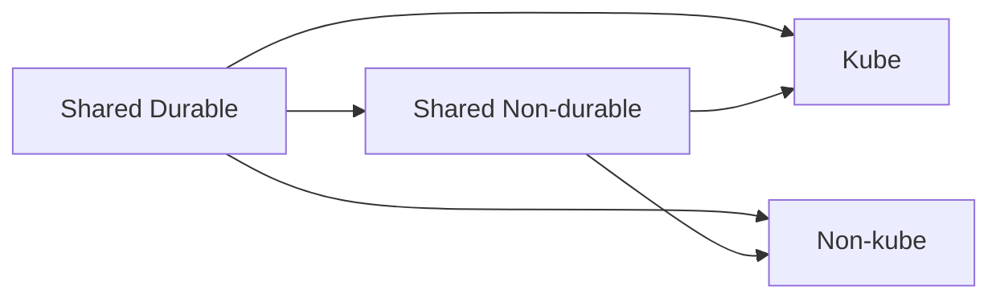

# README_REFACTOR_LEARNED

## Table of Contents
1. Durable vs Non-durable vs Ownership
2. Teardown Scope Rules
3. State Drift, Re-import, and Nuclear Cleanup
4. Spark + Delta: Why We Rejected Managed Spark Services

## 1. Durable vs Non-durable vs Ownership
Durability (how often we destroy) and ownership (who uses) are **orthogonal** axes.

- **Durable**: rarely destroyed, explicit intent required (e.g., secrets, base networking)
- **Non-durable**: frequently destroyed (clusters, services, schedulers)

Ownership is separate:
- shared
- kube-specific
- nonkube-specific

## 2. Teardown Scope Rules
If kube and nonkube both exist, tearing down one must not break the other.

Rules:
1. Durable stacks are **never destroyed implicitly**
2. Non-durable stacks may depend on durable stacks
3. Durable stacks may not depend on non-durable stacks
4. Kube teardown only destroys kube-owned state (plus optional shared-nondurable when safe)
5. Nonkube teardown only destroys nonkube-owned state (plus optional shared-nondurable when safe)

## 3. State Drift, Re-import, and Nuclear Cleanup
Reality: state and cloud can diverge. Sometimes a brutal cleanup script runs.

We support:
- `tofu import` workflows
- deterministic naming/tagging
- state boundaries per scope

Tools:
- `tools/import-state-aws.py` for manual imports
- `tools/reconcile-state-aws.py` to rebuild state from tagged resources (best-effort)

## 4. Spark + Delta: Why We Rejected Managed Spark Services
Legacy behavior (and preserved here):
- Spark is **containerized** and self-hosted
- No EMR/Dataproc/Glue dependency
- Kube: Spark-on-Kubernetes
- Nonkube: Spark container runs as ECS task
- Delta is stored on object storage (S3/GCS) via `delta-spark`

Scheduling:
- Must run once at bootstrap to avoid "no data" UI
- Then runs on a recurring schedule:
  - kube: Kubernetes CronJob
  - nonkube: EventBridge schedule to ECS RunTask
