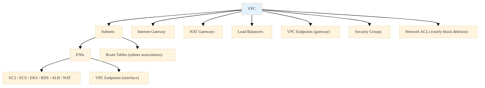
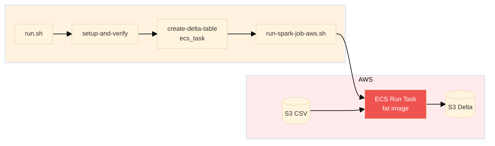
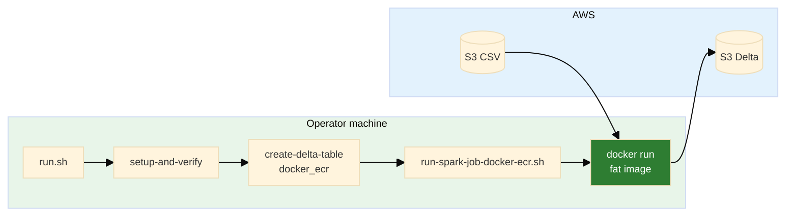
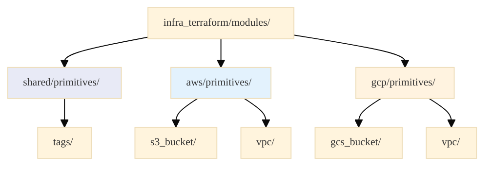
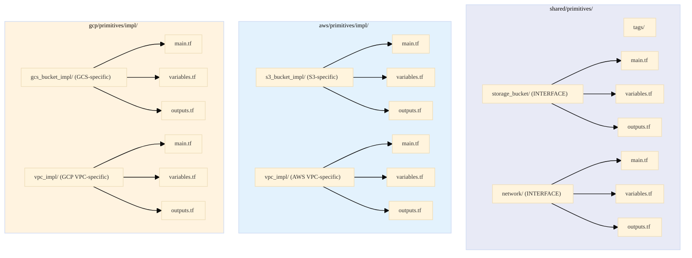
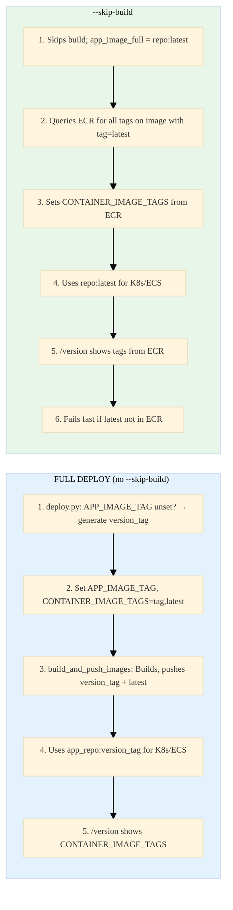
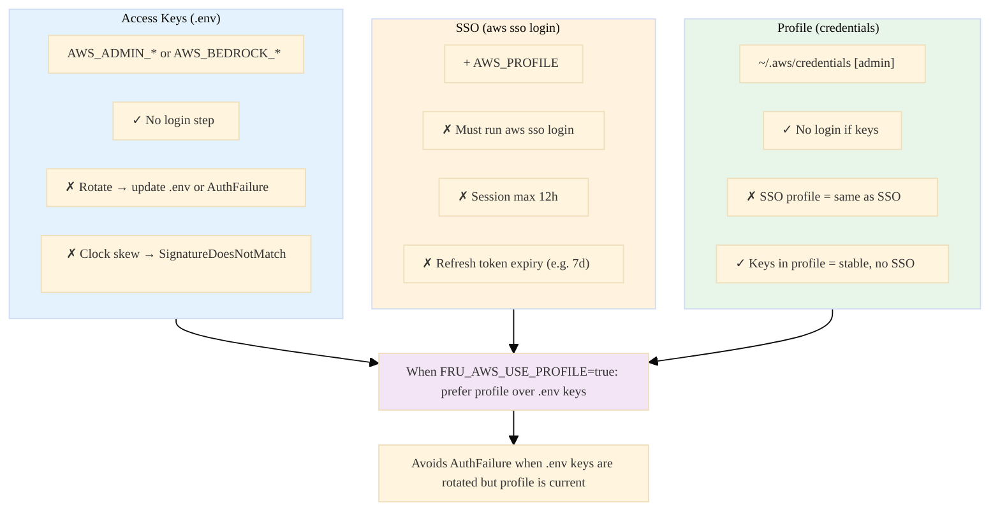

# README_WAR_STORIES

A curated list of **non-trivial technical war stories**, capturing real lessons suitable for **senior-level interviews**.

---

## 1. HTTP Status Code Corruption: Streaming Endpoint Validation with HEAD vs GET

**creation:** `<260127-175946>`
**last_updated:** `<260127-175946>`

**keywords:** HTTP, curl, streaming endpoints, Server-Sent Events (SSE), status code validation, HEAD request
**difficulty:** 6
**significance:** 7

### 1.1 Context

During automated endpoint validation, the `/query/stream` endpoint (a Server-Sent Events streaming endpoint) consistently returned a corrupted HTTP status code: `HTTP 200000` instead of the expected `HTTP 200`. The validation script used `curl -w "%{http_code}"` with a GET request, which worked fine for regular REST endpoints but failed for streaming endpoints.

### 1.2 Root Cause

The `/query/stream` endpoint streams data continuously using Server-Sent Events (SSE). When using `curl -w "%{http_code}"` with a GET request, curl:
1. Sends the GET request
2. Receives the HTTP response headers (including status code)
3. **Starts consuming the streaming response body**
4. Tries to write the status code to stdout

The problem: The streaming data output mixed with the status code output, resulting in a corrupted value like `200000` (the actual `200` status code followed by streaming data characters that were interpreted as part of the status code).

### 1.3 Key Insight

> Streaming endpoints require different validation strategies than regular REST endpoints. GET requests consume the stream, corrupting output parsing. HEAD requests retrieve only headers without consuming the response body.

### 1.4 Resolution

Changed the validation logic for streaming endpoints from GET to HEAD request:
- **Before:** `curl -s -o /dev/null -w "%{http_code}" "$endpoint"`
- **After:** `curl -s -I -o /dev/null -w "%{http_code}" "$endpoint"`

The `-I` flag (HEAD request) retrieves only the HTTP headers without consuming the response body, allowing clean status code extraction. Added robust extraction logic: `query_stream_status=$(echo "$curl_output" | grep -oE '[0-9]{3}' | head -1 || echo "000")` to handle edge cases.

### 1.5 Takeaway

Always use HEAD requests (`curl -I`) for status validation of streaming endpoints. GET requests will consume the stream and corrupt output parsing. For regular REST endpoints, GET is fine, but streaming endpoints (SSE, WebSockets, long-polling) require HEAD requests for validation.

---

## 2. HTTP 000000 Error: HTTPS vs HTTP Protocol Mismatch for EKS Network Load Balancer

**creation:** `<260127-175946>`
**last_updated:** `<260127-175946>`

**keywords:** AWS EKS, Network Load Balancer (NLB), HTTPS, HTTP, SSL certificate, curl, ingress
**difficulty:** 7
**significance:** 8

### 2.1 Context

During endpoint validation, direct API endpoint checks for EKS ingress endpoints (DNS names like `*.elb.us-east-1.amazonaws.com`) consistently returned `HTTP 000000` errors. CloudFront endpoints worked fine, but the direct load balancer endpoint failed validation. The error appeared as a warning: `[WARNING] ⚠ API endpoint returned HTTP 000000`.

### 2.2 Root Cause

The code was attempting HTTPS connections to EKS ingress endpoints, but EKS uses NGINX Ingress Controller which creates an AWS Network Load Balancer (NLB). NLBs don't have SSL certificates by default unless explicitly configured with AWS Certificate Manager (ACM). 

When `curl` attempted an HTTPS connection to an NLB without a valid certificate:
1. SSL handshake failed
2. `curl` returned exit code 60 (SSL certificate problem)
3. The status code extraction returned `000` (indicating no HTTP response was received)
4. The display logic showed this as `000000` (due to formatting)

The `000` status code from curl is not an HTTP status code—it indicates that curl never received an HTTP response because the SSL/TLS handshake failed before any HTTP communication occurred.

### 2.3 Key Insight

> NLBs and ALBs without ACM certificates don't serve HTTPS with valid certificates. The `000` curl status code indicates SSL handshake failure, not an HTTP protocol error. Always use HTTP for AWS load balancer DNS names unless you've explicitly configured ACM certificates.

### 2.4 Resolution

Modified `fetch-deployment-info.sh` to always use `http://` when constructing API URLs for EKS ingress hostnames (which are NLB DNS names ending in `.elb.amazonaws.com`):

```bash
# Before: Conditional HTTPS/HTTP based on hostname pattern
if echo "$K8S_INGRESS_HOST" | grep -qE '\\.elb\\.|\\.amazonaws\\.com'; then
    API_URL="http://$K8S_INGRESS_HOST"
else
    API_URL="https://$K8S_INGRESS_HOST"  # Wrong assumption
fi

# After: Always HTTP for EKS Ingress (NLB)
API_URL="http://$K8S_INGRESS_HOST"
```

Also fixed the same issue in `test/common_sh/test_environment.sh` which had been overlooked during the initial fix.

### 2.5 Takeaway

Always use HTTP for AWS load balancer DNS names (`.elb.amazonaws.com`) unless you've explicitly configured ACM certificates. The `000` curl status code is a red flag for SSL/TLS issues, not HTTP protocol problems. When debugging endpoint failures, check the protocol first—many "HTTP errors" are actually SSL certificate problems.

---

## 3. CloudFront Invalidation Timeout: Stdout/Stderr Capture Corrupting Return Values

**creation:** `<260127-175946>`
**last_updated:** `<260127-175946>`

**keywords:** Bash, command substitution, stdout, stderr, environment variables, CloudFront, invalidation, function return values
**difficulty:** 8
**significance:** 9

### 3.1 Context

CloudFront invalidation consistently timed out with `NoSuchInvalidation` errors, even though invalidations were being created successfully. The deployment script would:
1. Create a CloudFront invalidation (succeeded)
2. Attempt to wait for completion (failed with `NoSuchInvalidation`)
3. Timeout after 15 minutes
4. Deployment continued, but the invalidation never completed verification

**Why CloudFront Invalidation is Needed:** CloudFront caches content at edge locations worldwide. When you deploy new frontend files to S3, CloudFront continues serving the old cached version until the cache expires (which can take hours or days). Invalidation tells CloudFront to immediately purge cached content and fetch fresh files from the origin (S3). Without invalidation, users see stale content after deployments.

### 3.2 Root Cause

The function `create_cloudfront_invalidation()` was designed to return the invalidation ID via stdout for command substitution:

```bash
invalidation_id=$(create_cloudfront_invalidation "$dist_id" "/*")
```

However, the function also logged messages to stdout using `log_info()` and `log_success()`, which write to stdout. When captured with command substitution, the variable captured **both** the log messages and the invalidation ID:

```
invalidation_id='[INFO] Creating CloudFront invalidation...
[INFO]   Distribution ID: E33TA1D0OAYUNR
[INFO]   Paths: /*
[SUCCESS] CloudFront invalidation created: IAS6QGH99WVY9LQVVST4POTQBE
IAS6QGH99WVY9LQVVST4POTQBE'
```

This corrupted string was then passed to `wait_for_invalidation()`, which called `aws cloudfront get-invalidation --id '[INFO] Creating...IAS6QGH99WVY9LQVVST4POTQBE'`. AWS correctly returned `NoSuchInvalidation` because that malformed string is not a valid invalidation ID.

### 3.3 Key Insight

> Functions that return values via stdout must NEVER log to stdout. Command substitution captures ALL stdout, making it impossible to separate logs from return values. Use stderr for logging, or better yet, use environment variables for values that need to be passed between functions.

### 3.4 Resolution

**Initial Fix Attempt:** Redirected log messages to stderr (`>&2`), which worked but was fragile and error-prone. Any future developer adding a log statement without the redirect would reintroduce the bug.

**Final Solution:** Changed to environment variable pattern, consistent with other deployment scripts in the codebase:

```bash
# Function now sets and exports environment variable
create_cloudfront_invalidation() {
    # ... create invalidation ...
    export CLOUDFRONT_INVALIDATION_ID="$invalidation_id"
    log_success "CloudFront invalidation created: $invalidation_id"
    return 0
}

# Usage becomes simpler and more robust
if create_cloudfront_invalidation "$dist_id" "/*"; then
    wait_for_invalidation "$dist_id" "$CLOUDFRONT_INVALIDATION_ID" 15 "true"
fi
```

This approach:
- Eliminates stdout/stderr separation issues
- Makes the return value explicit (environment variable name)
- Is consistent with other deployment scripts (`fetch-deployment-info.sh` pattern)
- Is more robust (no risk of mixing logs with return values)

### 3.5 Takeaway

When a function is meant to return a value, either: (1) log to stderr only, or (2) use environment variables. Command substitution captures ALL stdout, making it impossible to separate logs from return values. Environment variables are more robust, explicit, and follow Unix conventions (stdout for data, stderr for diagnostics, or use environment for function-to-function communication).

### 3.6 Timestamp Portability: `%3N` vs macOS `date`

**creation:** `<260205-000000>`  
**last_updated:** `<260205-000000>`

On macOS, the initial project-wide logger used `date +"%Y-%m-%d %H:%M:%S.%3N %Z"` to render millisecond timestamps in log prefixes. This worked on Linux (GNU coreutils), but macOS ships BSD `date`, which does **not** support `%N`/`%3N`. Instead of real milliseconds, the logger printed the literal format characters, leading to confusing prefixes like:

`[2026-02-05 12:29:42.3N -03] ==> Importing existing frontend-eks resources into Terraform state`

The bug surfaced only when the new logger was wired into all orchestration scripts, making it a cross-cutting logging issue rather than a single-script bug.

**Resolution:**

- Implemented a portable `_log_ts` helper in `lib/logger.sh` that:
  - Prefers `gdate` (GNU date) when available (supports `%3N`)
  - Falls back to GNU-like `date` if `%N` appears to work
  - Otherwise uses a tiny `python3` snippet (`datetime.now()` + `microsecond/1000`) to format `YYYY-MM-DD HH:MM:SS.mmm TZ`
  - As a last resort, prints a second-resolution timestamp without milliseconds (but never prints raw `%3N`)

This preserved the desired `[YYYY-MM-DD HH:MM:SS.mmm TZ]` format on macOS and Linux without requiring every developer to install GNU coreutils, and ensured that logging output never leaks format control sequences into production logs again.

---

## 4. EKS Load Balancer Type Confusion: NLB vs ALB Misunderstanding

**creation:** `<260127-175946>`
**last_updated:** `<260127-175946>`

**keywords:** AWS EKS, AWS Load Balancer Controller, NGINX Ingress Controller, Network Load Balancer (NLB), Application Load Balancer (ALB)
**difficulty:** 5
**significance:** 6

### 4.1 Context

During debugging of the HTTP 000000 error, code comments and analysis incorrectly stated that "EKS uses AWS Load Balancer Controller to create ALBs." However, the project's EKS setup documentation (`docs/README_WORKFLOW_EKS_NOTES.md`) indicated that EKS uses NGINX Ingress Controller, which creates NLBs, not ALBs. This architectural misunderstanding led to incorrect assumptions about SSL certificate configuration.

### 4.2 Root Cause

EKS supports multiple ingress controllers, each creating different types of load balancers:
- **AWS Load Balancer Controller** → Creates Application Load Balancers (ALBs)
- **NGINX Ingress Controller** → Creates Network Load Balancers (NLBs)

The project uses NGINX Ingress Controller, but comments and analysis incorrectly assumed ALB usage. This led to confusion about why SSL certificates weren't working (ALBs can have ACM certificates more easily configured, while NLBs require explicit ACM setup).

### 4.3 Key Insight

> EKS can use different ingress controllers, each creating different load balancer types. Don't assume load balancer types based on platform (EKS vs ECS). Always verify the actual ingress controller and load balancer type in your infrastructure.

### 4.4 Resolution

Updated comments and documentation to correctly reflect NLB usage for EKS:

```bash
# Updated comment in fetch-deployment-info.sh
# EKS Ingress uses NGINX Ingress Controller, which creates an NLB (Network Load Balancer) on AWS.
# NLBs use .elb.amazonaws.com DNS names and don't have SSL certificates by default
# (unless configured with ACM), so always use HTTP.
```

This clarification helped explain why HTTP (not HTTPS) was required for EKS ingress endpoints.

### 4.5 Takeaway

Don't assume load balancer types based on platform (EKS vs ECS). Verify the actual ingress controller and load balancer type in your infrastructure. Different ingress controllers create different load balancer types, and each has different SSL/TLS certificate requirements.

### 4.6 Correction (2025)

**Actual LB type:** The kube API is exposed via `fru-api-svc` (type LoadBalancer), not NGINX Ingress. Without `service.beta.kubernetes.io/aws-load-balancer-type: external`, the **in-tree** cloud provider reconciles it and creates a **Classic ELB**—not NLB. The protocol guidance (use HTTP for LB endpoints) still applies. See [KUBE_INGRESS_LEARNED.md](docs/learned/KUBE_INGRESS_LEARNED.md) Section 0.

---

## 5. Protocol Inconsistency: HTTPS Used Where HTTP Required for NLB Endpoints

**creation:** `<260127-175946>`
**last_updated:** `<260127-175946>`

**keywords:** HTTPS, HTTP, protocol, EKS, NLB, test files, consistency, SSL certificates, CloudFront
**difficulty:** 4
**significance:** 6

### 5.1 Context

After fixing the HTTP 000000 error in `fetch-deployment-info.sh` by changing EKS ingress URLs from HTTPS to HTTP, the same issue persisted in test files. The test script `test/common_sh/test_environment.sh` was still attempting HTTPS connections to EKS ingress endpoints, causing test failures.

### 5.2 Root Cause

During the initial fix, only the main deployment script (`fetch-deployment-info.sh`) was updated. The test file `test/common_sh/test_environment.sh` contained duplicate logic for constructing API URLs from EKS ingress hostnames, but it wasn't updated. This created an inconsistency where:
- Production deployment scripts used HTTP (correct)
- Test scripts used HTTPS (incorrect)

**Certificate Limitation Explanation:** 
- **Local machine:** Cannot test HTTPS connections to NLB endpoints because NLBs don't have SSL certificates by default. The local machine would need to trust a certificate that doesn't exist, causing SSL handshake failures.
- **Remote (CloudFront):** CloudFront distributions are configured with ACM certificates and serve HTTPS properly. Users access the application via CloudFront's HTTPS endpoint, which then proxies to the backend (NLB) over HTTP internally. The SSL/TLS termination happens at CloudFront, not at the NLB.

This is a common pattern: CloudFront handles HTTPS for end users, while the origin (NLB/ALB) uses HTTP internally. The NLB doesn't need certificates because it's not directly exposed to end users—only CloudFront connects to it.

### 5.3 Key Insight

> When fixing protocol issues, search the entire codebase for similar patterns. Test files and utility scripts often duplicate logic that needs the same fix. Also understand the architecture: CloudFront terminates SSL for end users, while internal load balancers (NLB/ALB) typically use HTTP.

### 5.4 Resolution

Updated `test/common_sh/test_environment.sh` to use `http://` for EKS ingress hostnames, matching the main script behavior:

```bash
# Before (lines 124, 135)
API_URL="https://$K8S_INGRESS_HOST"
API_URL="https://$k8s_ingress"

# After
API_URL="http://$K8S_INGRESS_HOST"
API_URL="http://$k8s_ingress"
```

This ensured consistency across all scripts and fixed test failures.

### 5.5 Takeaway

Always search for similar patterns across the entire codebase when fixing protocol/URL construction issues. Test files are often overlooked but contain duplicate logic that needs the same fix. Understand your architecture: if CloudFront is in front, it handles HTTPS for users while internal load balancers use HTTP. Local testing of LB endpoints must use HTTP because LBs (Classic or NLB) typically don't have ACM certificates; CloudFront provides the HTTPS layer for production users.

### 5.6 Correction (2025)

**Actual LB type:** The kube API uses `fru-api-svc` LoadBalancer (Classic ELB via in-tree), not NLB. The HTTP/HTTPS guidance still applies. See [KUBE_INGRESS_LEARNED.md](docs/learned/KUBE_INGRESS_LEARNED.md) Section 0.

---

## 6. VPC Teardown: Dependency Graph and Safe Deletion Order

**creation:** `<260129>`
**last_updated:** `<260129>`

**keywords:** AWS VPC, teardown, dependency order, ENIs, subnets, security groups, load balancers, VPC endpoints, deletion order
**difficulty:** 7
**significance:** 8

### 6.1 Context

During brutal-force AWS resource removal (scripted teardown from a resource-inventory JSON), deletions failed with `DependencyViolation`: subnets could not be deleted ("has dependencies"), security groups could not be deleted ("has a dependent object"), and the VPC could not be deleted ("has dependencies"). The script deleted load balancers, NAT gateways, and internet gateways in an order that seemed logical, but subnet and VPC deletion still failed.

### 6.2 Root Cause

VPC and its resources form a strict dependency graph. Deleting in the wrong order leaves "downstream" resources still referencing "upstream" ones, so AWS correctly refuses to delete. The relevant structure is:



The script had **no step for ENIs** and **no step for VPC endpoints**. ENIs (network interfaces) are created by ALBs, NAT gateways, EC2, RDS, EKS, etc. They live in subnets and reference security groups. Until those ENIs are gone, you cannot delete the subnet or (in many cases) the security groups. Similarly, VPC endpoints (interface or gateway) must be deleted before the VPC. Deletion must follow a **safe order** that respects this graph.

### 6.3 Key Insight

> VPC teardown is not "delete everything in any order." It is a dependency-aware sequence: remove load balancers and NAT first, then VPC endpoints, then ENIs, then subnets, then route tables (non-main), then security groups (non-default), then internet gateway, then VPC. Missing ENIs or VPC endpoints in your teardown script will cause DependencyViolation and leave the VPC stuck.

### 6.4 Resolution

- **Inventory:** Extended the find-all script to collect **network interfaces (ENIs)** and **VPC endpoints** in non-default VPCs, so the removal script has a full picture.
- **Order:** Implemented removal in this order (steps 1–17): CloudFront → EKS → ECS → RDS → Load balancers → EC2 instances → NAT gateways → Elastic IPs → Internet gateways → **ENIs** → Subnets → Security groups → **VPC endpoints** → VPCs → ECR → S3 → IAM.
- **ENIs before subnets:** Added a dedicated "Network interfaces (ENIs)" step that lists ENIs per VPC from the inventory and deletes them (with special handling for ELB-managed attachments) so subnets and security groups can be deleted afterward.
- **VPC endpoints before VPCs:** Added a "VPC Endpoints" step so interface and gateway endpoints are deleted before attempting VPC deletion.

After these changes, teardown could progress past subnets and security groups once ENIs and VPC endpoints were removed.

### 6.5 Takeaway

Model the VPC dependency graph explicitly and implement teardown in a safe order: Load balancers / NAT → VPC Endpoints → ENIs → Subnets → Route Tables (non-main) → Security Groups (non-default) → Internet Gateway → VPC. Include ENIs and VPC endpoints in both inventory and removal; omitting them is a common cause of DependencyViolation during VPC teardown.

---

## 7. ELB Deletion and ENIs: Eventual Consistency, Not a Bug

**creation:** `<260129>`
**last_updated:** `<260129>`

**keywords:** AWS ELB, ALB, ENI, network interface, eventual consistency, asynchronous deletion, ela-attach, teardown, wait state
**difficulty:** 7
**significance:** 8

### 7.1 Context

After deleting Application Load Balancers (ALBs) during teardown, the script tried to delete remaining network interfaces (ENIs) so subnets and the VPC could be removed. Two ENIs remained, each with an attachment ID like `ela-attach-04fc51a5d84c05f6f` and `InstanceOwnerId: amazon-aws`. The script could not detach them (`OperationNotPermitted: You are not allowed to manage 'ela-attach' attachments`) and could not delete the ENIs while they were attached. Subnet and VPC deletion kept failing with DependencyViolation. In the console, the ENI showed an attachment that didn't link to any visible resource—the ALB was already gone.

### 7.2 Root Cause

**A. Why it doesn't disappear immediately (this is key)**  
ELB deletion is **asynchronous**.

When you delete a load balancer:

1. The **LB object is deleted quickly** (it disappears from the console and API).
2. **Backend cleanup happens later:**
   - Deregister targets  
   - Tear down cross-AZ networking  
   - Drain connections  
   - **Release ENIs**  
3. **ENIs are released last.**  
   AWS does this **eventually-consistent**, not transactional. The ENI and its `ela-attach-*` attachment can remain for several minutes (often 10–30+). During that time the attachment points to an ALB that no longer exists, so the console shows an attachment that "doesn't link to anything." That is expected.

**B. What you should NOT do**

- **Don't try to force-delete the ENI** — it won't work; AWS does not allow you to delete an ENI that still has an ELB-managed attachment.
- **Don't try to delete the subnet yet** — the subnet has dependencies (the ENI) until AWS releases it.
- **Don't recreate/delete the VPC repeatedly** — that doesn't speed up ENI release and can make cleanup noisier.

This is a **wait state**, not a mistake. The system is behaving as designed.

### 7.3 Key Insight

> After you delete an ALB/NLB, its ENIs are released asynchronously by AWS. You cannot detach or force-delete them; you must wait. Treat "ENI still attached (ela-attach) with no visible ELB" as normal eventual consistency. Scripts should either wait with a timeout and retry ENI deletion, or mark ENIs as "pending AWS cleanup" and exit; do not treat it as a fatal error or retry VPC/subnet deletion in a tight loop.

### 7.4 Resolution

- **Detection:** The removal script identifies ELB-managed attachments by `AttachmentId` starting with `ela-attach-` or `InstanceOwnerId` of `amazon-aws` / `amazon-elb`. For these, it does **not** attempt detach (which would fail with OperationNotPermitted).
- **Wait-and-retry:** For such ENIs, the script first tries to delete the ENI; if that fails due to attachment still present, it waits up to 5 minutes, polling every 15 seconds to see if the attachment is gone (AWS released it), then retries delete.
- **Graceful skip:** If the ENI is still attached after the timeout, the script records it as **skipped** with reason `pending_aws_elb_cleanup` and a message that AWS will clean it up in ~10–15 minutes, rather than failing the whole run. A later re-run of the script (or a separate run after waiting) can then delete the ENI and proceed with subnets and VPC.

No code change can make AWS release the ENI sooner; the only correct behavior is to wait or to defer and retry.

### 7.5 Takeaway

ELB deletion is asynchronous; ENIs are released last and can linger for 10–30+ minutes. Do not force-delete the ENI, do not delete the subnet while the ENI exists, and do not treat this as a bug—it is eventual consistency. Implement wait-and-retry with a timeout and/or a "pending cleanup" skip so teardown scripts can either succeed after a wait or be re-run later when AWS has finished cleanup.

---

## 8. Project-Wide venv: One Python, One Place, All Scripts

**creation:** `<260130>`
**last_updated:** `<260130>`

**keywords:** Python, venv, virtual environment, PYTHON_CMD, load-env, boto3, run scripts, dependency consistency
**difficulty:** 5
**significance:** 7

### 8.1 Context

I already knew the basics of venv: isolate dependencies, avoid polluting the system Python, pin versions in requirements.txt. What I learned in this project was how to apply that consistently when **dozens of shell scripts** invoke Python—teardown helpers, resource removal, Terraform deploy, Spark job runners, schema init, reference checks—and those scripts are run from different entry points (orchestrator, CI, one-offs). Without a single source of truth for "which Python," some scripts used `python3` and others `python`, and CI or a fresh clone might not have boto3 (or the right version) in the environment the script happened to use. That led to "works on my machine" and occasional ImportError or version skew.

### 8.2 Root Cause

There was no project-wide contract for "use the project venv if it exists." Scripts that needed Python either hardcoded `python3` or called whatever was first in PATH. The project had a `setup-python.sh` that created a venv and installed from requirements.txt, but nothing guaranteed that the **same** Python was used by every script that ran Python code. So one script might use `./venv/bin/python3` (if the author remembered), another used `python3` (system or pyenv), and dependency consistency was accidental.

### 8.3 Key Insight

> venv is not just "create it and activate it in your shell." In a script-heavy repo, you need a single, sourced contract: one variable (e.g. PYTHON_CMD) set once (e.g. by load-env or load-python-env), and every script that runs Python must use that variable. Then "which Python" is decided in one place (venv if present, else python3), and all scripts get the same interpreter and the same installed deps.

### 8.4 Resolution

- **Single source:** Added `load-python-env.sh`, which sets `PYTHON_CMD` to `$REPO_ROOT/venv/bin/python3` if the project venv exists, else `python3`. That script is sourced at the end of `load-env.sh`, which most run scripts already source. So any script that sources load-env gets a consistent `PYTHON_CMD` without changing each script’s logic.
- **Use it everywhere:** Replaced direct `python3` / `python` calls in all scripts that run Python (teardown, remove-all-aws-resources, ensure-release-address-policy, find-all-current-aws-resources, init_schema_aws, reference_check_frontend_bucket, delete-recreatable-resources, stop-ecs-services, kubernetes-manifests, terraform deploy, run-spark-job-aws, setup-and-verify for delta-lake) with `"$PYTHON_CMD"` or `"${PYTHON_CMD:-python3}"` so they all use the same interpreter.
- **Phase 0:** Confirmed the main orchestrator (run.sh) runs `setup-python.sh` in "Phase 0" before any container-type-specific deployment, so the venv is created and populated before any script that needs boto3 runs. Scripts that *define* the venv (e.g. setup-python.sh, check-and-install.sh) correctly keep using `python3` so they don’t depend on a venv that might not exist yet.

With that, one Python (the project venv when present) is used consistently across the repo, and boto3/version consistency is guaranteed for all those call sites.

### 8.5 Takeaway

In a repo where many shell scripts invoke Python, define one contract: a single sourced script that sets PYTHON_CMD (venv if present, else system python3), and have every script that runs Python use that variable. Run venv creation (e.g. setup-python) in a Phase 0 or equivalent so the venv exists before any dependent script runs. Then venv isn’t just "for interactive use"—it’s the project’s single Python runtime for automation.

---

## 9. Teardown: Prefer Python for Logic, Shell for Orchestration

**creation:** `<260130>`
**last_updated:** `<260130>`

**keywords:** Teardown, AWS, boto3, Python, shell, orchestration, sub_proc, cleanup, pre-destroy, Terraform
**difficulty:** 6
**significance:** 8

### 9.1 Context

The teardown flow (pre-destroy → Terraform destroy → orphan cleanup → local Docker cleanup) was originally implemented largely in shell: stop services, empty S3, run Terraform, then a mix of shell and ad-hoc Python for ECR and orphan cleanup. Adding new behaviors (e.g. per–container-type teardown, consistent feedback, timeouts) made the shell scripts long, hard to test, and brittle—lots of subshells, `aws` CLI parsing, and error handling in bash. We needed a clearer split between "what to run and in what order" (orchestration) and "how to do each step" (logic).

### 9.2 Root Cause

Shell is great for sequencing and calling other tools; it is poor for complex control flow, structured data, and APIs. Putting all teardown logic in shell meant: (1) S3/ECR/ECS logic was a mix of `aws` CLI and `jq` or grep, which is fragile; (2) adding heartbeat or timeout required either heavy bash or a separate helper anyway; (3) unit-testing "empty this bucket" or "deregister these task definitions" in shell is impractical. The real need was to keep orchestration in shell (one script that knows the order and passes env/args) and move step logic into something that could use boto3, structured output, and clear functions.

### 9.3 Key Insight

> Use Python for anything that talks to AWS APIs, parses structured data, or needs nontrivial logic (retries, timeouts, filtering). Use shell for orchestration: order of steps, env setup, calling Terraform wrappers, and running the Python scripts with the right arguments. That keeps the shell script short and readable and puts the hard parts in testable, reusable Python.

### 9.4 Resolution

- **sub_proc Python scripts:** Introduced a `sub_proc/` directory under resources_cleanup with Python scripts: `eks_pre_destroy.py`, `ecs_pre_destroy.py`, `shared_pre_destroy.py` (stop services via subprocess to existing shell scripts, empty S3 via boto3), and `cleanup_orphaned.py` (S3, ECR, ECS task definitions, EKS presence check—all boto3). Each script takes clear args (environment, profile, region, container-type where relevant) and does one job.
- **Shell as thin orchestrator:** The main teardown script (`teardown-resources-all.sh`) only: validates args, sets env, sources helpers, and for each step calls the right sub_proc script or Terraform wrapper. It doesn’t implement "how to empty a bucket" or "how to list ECR images"; it just runs `"$PYTHON_CMD" sub_proc/cleanup_orphaned.py ...` with the right flags.
- **Terraform wrappers:** Small shell scripts (`eks_terraform_teardown.sh`, etc.) that call the shared Terraform/Teardown entrypoint with the right layer (eks/ecs/infrastructure) so the orchestrator stays simple and Terraform stays the single place for infra state.

Benefits: (1) Python steps are testable and reusable; (2) boto3 gives reliable APIs instead of parsing CLI output; (3) new behaviors (e.g. heartbeat, timeout) can be added in one place (helpers) and reused; (4) the orchestrator stays short and easy to read.

### 9.5 Takeaway

For teardown (and similar multi-step automation), keep orchestration in shell—order of steps, env, and calling the right tools. Implement step logic (AWS API calls, filtering, retries) in Python with boto3. Expose that logic as small, CLI-invokable scripts (e.g. sub_proc) so the shell script stays thin and the complex parts are testable and maintainable.

---

## 10. Continuous Feedback and Heartbeat: So Long-Running Scripts Don’t Look Stuck

**creation:** `<260130>`
**last_updated:** `<260210>`

**keywords:** UX, feedback, heartbeat, timeout, teardown, remove-all-aws-resources, stderr, long-running, run_with_heartbeat, wait_with_heartbeat, output buffering, PYTHONUNBUFFERED, docker --progress=plain, non-TTY, Cursor IDE
**difficulty:** 6
**significance:** 7

### 10.1 Context

Teardown and brutal-force removal (remove-all-aws-resources) can run for many minutes: Terraform destroy, EKS/ECS/RDS deletion, S3/ECR cleanup. Without feedback, the terminal sits silent for long stretches and users (or CI) assume the process is stuck. We wanted: (1) continuous informative output (what step is running, what succeeded/failed); (2) "heartbeat" output while waiting (e.g. every 60s) so it’s clear the process is still running; (3) optional timeout so a step doesn’t hang forever and the script can exit with a clear message.

### 10.2 Root Cause

Initially, teardown just ran subprocesses (pre-destroy, Terraform, cleanup) and printed one line before and one after each step. If a step took 10 minutes, there was no output in between. Similarly, remove-all-aws-resources had internal waits (e.g. "wait for EKS cluster to be deleted") with no periodic message, so the script appeared frozen. There was no shared pattern for "run a command and print a heartbeat every N seconds" or "wait until condition with timeout and heartbeat," and no single place to define a per-step timeout (e.g. for teardown) so users could cap duration.

### 10.3 Key Insight

> Long-running automation needs two kinds of feedback: (1) progress lines (what’s running, what completed/failed) so users see continuous activity; (2) heartbeat lines (e.g. "Still running: &lt;description&gt; ... N s elapsed") so during long waits users know the process isn’t stuck. Prefer one helper per language (shell for "run command with heartbeat," Python for "wait until condition with heartbeat") and a single, prominent timeout constant (e.g. per-step) so behavior is predictable and easy to tune.

### 10.4 Resolution

- **Python helper (long_running_feedback.py):** Added a shared module used by remove-all-aws-resources: `progress(msg)`, `print_status(resource_id, status, detail)`, `log_timeout(component, resource_id, timeout_min)`, and `wait_with_heartbeat(description, check_fn, timeout_sec, interval_sec=60)`. The wait function polls `check_fn()`, prints a heartbeat every `interval_sec` ("... have waited for &lt;description&gt; - N min"), and returns False on timeout. So CloudFront/EKS/ECS/RDS deletion waits now give continuous feedback and a clear timeout.
- **Shell helper (run-with-heartbeat.sh):** Added `run_with_heartbeat "description" interval_sec [timeout_sec] -- command ...` (runs the command, prints "Still running: description ... N s elapsed" every interval_sec, optionally kills on timeout) and `sleep_with_heartbeat total_sec interval_sec "message"` (sleep with "message - N s remaining" every interval). Teardown sources this and wraps each long step (pre-destroy, Terraform, orphan cleanup) with `_run_with_heartbeat_step`, so each step streams its own output and a heartbeat every 60s (or TEARDOWN_HEARTBEAT_INTERVAL). The optional wait between layers uses `sleep_with_heartbeat` so that pause isn’t silent.
- **Timeout and wording:** Defined `TEARDOWN_STEP_TIMEOUT_SEC` and `HEARTBEAT_INTERVAL_SEC` at the top of the teardown script so they’re visible and overridable. Heartbeat messages use "N s elapsed" (not just "N s") so it’s clear the value is accumulated time. Documented that the initial "Loading AWS image identifiers" phase is not wrapped (can take ~3 min) and that any external timeout (e.g. CI/IDE) can still kill the process; the script’s own timeout is per-step only when set.

With this, both teardown and remove-all give continuous feedback and heartbeat during long operations, and teardown can optionally enforce a per-step timeout for a predictable, graceful exit.

### 10.5 Takeaway

For long-running scripts: (1) emit progress lines (what’s running, what completed/failed); (2) emit heartbeat lines on a fixed interval ("Still running: … N s elapsed") so waits don’t look stuck; (3) use a shared helper per language (shell: run command + heartbeat [+ timeout]; Python: wait until condition + heartbeat + timeout); (4) put timeout and interval constants at the top of the main script and document which phases have no heartbeat (e.g. initial setup). That keeps users and CI confident the process is alive and makes timeouts explicit and configurable.

### 10.6 Output Buffering: Silent "Hang" When Run Under IDE or CI

**creation:** `<260210>`
**last_updated:** `<260210>`

Deploy's build-and-push phase (Docker build + push) ran for 15+ minutes with no terminal output after "OpenTofu has been successfully initialized!" The process was not stuck—Docker build was actively running—but output was buffered. When Python runs in a non-TTY (e.g. Cursor's integrated terminal, CI runners), stdout is block-buffered by default. Docker build's fancy progress display also buffers when not attached to a real TTY. Result: users assume the script hung and kill it, or wait indefinitely with no feedback.

**Resolution:** (1) Set `PYTHONUNBUFFERED=1` in the subprocess env when spawning long-running child scripts (e.g. `build_and_push_images.py`) so Python flushes output immediately. (2) Add `--progress=plain` to `docker build` so Docker emits line-by-line output instead of the interactive progress bar, which buffers or misbehaves in non-TTY environments. (3) Run the top-level deploy with `PYTHONUNBUFFERED=1` when invoking from IDE or CI. Heartbeat helps too, but unbuffered output ensures the child's real progress (Docker layer logs, etc.) streams to the terminal.

**Takeaway:** When long-running subprocesses appear to "freeze" with no output, suspect buffering—not deadlock. Python block-buffers stdout when not a TTY; Docker's progress display buffers in non-TTY. Use `PYTHONUNBUFFERED=1` for Python children and `docker build --progress=plain` for build visibility in IDE/CI.

---

## 11. Terragrunt Dependency Outputs: Partial State and try()

**creation:** `<260131>`
**last_updated:** `<260131>`

**keywords:** Terragrunt, Terraform, dependency, mock_outputs, partial state, try(), refresh, plan
**difficulty:** 6
**significance:** 7

### 11.1 Context

During dry-runs, the ECS and EKS Terragrunt layers failed with `Error: Unsupported attribute` on lines like `dependency.infrastructure.outputs.vpc_id`—"This object does not have an attribute named 'vpc_id'." The same config worked when the infrastructure layer had been fully applied previously; it failed when state was partial (e.g. only `aurora_database_name` present) or when running `terragrunt refresh` before `plan`. The EKS layer had been fixed earlier with `try()`; the ECS layer had not.

### 11.2 Root Cause

Terragrunt resolves dependencies by running the dependency layer and reading its outputs. When the dependency's state is incomplete (e.g. infrastructure was applied in the past but some outputs were removed or state was pruned, or the dependency has never been applied), `terragrunt output` returns only the outputs that exist. Terragrunt then exposes that partial set as `dependency.<name>.outputs`. If the child config references `dependency.infrastructure.outputs.vpc_id` and that key is missing, HCL throws "Unsupported attribute." Similarly, for commands like `refresh`, Terragrunt may run the dependency and get real (partial) outputs instead of using `mock_outputs`, so the child sees missing keys and fails.

### 11.3 Key Insight

> When a Terragrunt layer depends on another and that dependency may have partial or empty state (e.g. before first apply, after selective destroy, or during refresh), reference dependency outputs with try(dependency.<name>.outputs.<key>, "fallback") so missing keys don't fail the config. Add "refresh" (and "init", "state") to mock_outputs_allowed_terraform_commands so that when you run refresh/plan without applying the dependency, Terragrunt uses mock outputs instead of partial real ones.

### 11.4 Resolution

- **ECS dev terragrunt.hcl:** Wrapped every `dependency.infrastructure.outputs.<key>` in `try(..., "fallback")` with sensible mock values (e.g. `try(dependency.infrastructure.outputs.vpc_id, "vpc-xxxxxxxx")`). Added `"refresh"`, `"init"`, `"state"` to `mock_outputs_allowed_terraform_commands` so refresh/plan use mocks when the dependency hasn't been applied.
- **Consistency:** EKS layers already used try() and broader mock_outputs_allowed_terraform_commands; ECS was updated to match. Frontend-ecs/frontend-eks dependency on app (ECS/EKS) also use try() for `alb_dns_name` and include "refresh" in mock_outputs_allowed_terraform_commands.

### 11.5 Takeaway

Design Terragrunt configs for partial dependency state: use try(dependency.*.outputs.<key>, fallback) for every dependency output you read, and allow mock_outputs for init, plan, refresh, and state so dry-runs and first-time runs succeed without applying every dependency first.

---

## 12. deploy-frontend.sh: Terragrunt Warning Text Captured as S3 Bucket Name

**creation:** `<260131>`
**last_updated:** `<260131>`

**keywords:** Terragrunt, Terraform output, S3 bucket name, dry-run, validation, regex, No outputs found
**difficulty:** 5
**significance:** 7

### 12.1 Context

After moving the frontend (S3 + CloudFront) into its own Terragrunt layers (frontend-ecs / frontend-eks), deploy-frontend.sh was updated to read `s3_bucket_id` from the frontend-ecs (or frontend-eks) layer via `terragrunt output -raw s3_bucket_id`. In dry-runs, Phase 6 (frontend deployment) failed with: `Invalid bucket name "Warning: No outputs found..."` and AWS error that the bucket name must match `^[a-zA-Z0-9.\-_]{1,255}$`. The script was using that warning text as the bucket name.

### 12.2 Root Cause

In a dry-run we never run `terragrunt apply`, so the frontend-ecs layer has no applied state and no real outputs. When deploy-frontend.sh ran `terragrunt output -raw s3_bucket_id` in the frontend-ecs directory, Terraform/Terragrunt printed the usual warning to stderr (or in some versions/contexts to stdout): "No outputs found" / "The state file either has no outputs defined...". That text was captured by command substitution (`s3_bucket_name=$(terragrunt output -raw s3_bucket_id 2>/dev/null || echo "")`). Suppressing stderr with `2>/dev/null` doesn't help if the warning goes to stdout; and even with stderr suppressed, some invocations can leave stdout with warning content. The script then passed this string to `aws s3 sync --dryrun ... s3://$S3_BUCKET_NAME`, so AWS received an invalid bucket name.

### 12.3 Key Insight

> Never trust the raw result of `terragrunt output` or `terraform output` as a resource identifier without validating format. When the dependency layer has no applied state, the "output" may be warning text. Validate that the captured value matches the expected format (e.g. S3 bucket name regex); if it doesn't, treat it as empty and apply your existing "no output" logic (placeholder in dry-run, fail with clear message in real run).

### 12.4 Resolution

After reading `s3_bucket_name` from terragrunt output, added a format check: if the value is non-empty but does not match the S3 bucket name regex `^[a-zA-Z0-9.\-_]{1,255}$`, set `s3_bucket_name=""`. The existing logic then applies: in dry-run we use `dry-run-bucket-placeholder` and skip the real sync; in real run we fail with "get S3 bucket from Terraform / apply frontend layer first." No change to real deploys—once frontend-ecs is applied, terragrunt output returns a real bucket name that passes the regex.

### 12.5 Takeaway

When a script gets a "resource identifier" from Terraform/Terragrunt output, validate its format before using it (e.g. bucket name, ARN). If the layer has no state, the command may print warning text that gets captured; treating any non-empty string as valid leads to confusing AWS errors. Validate, then treat invalid values as empty and handle the "no output" case explicitly (placeholder for dry-run, clear failure for real run).

---

## 13. AWS CLI Version Incompatibility: v1 vs v2 and Enforcing 2.x

**creation:** `<260130>`
**last_updated:** `<260130>`

**keywords:** AWS CLI, version incompatibility, v1 vs v2, ECR, get-login, prerequisites, check-and-install
**difficulty:** 5
**significance:** 7

### 13.1 Context

Deployment and teardown scripts (ECR login, S3 sync, CloudFront invalidation, ECS/EKS discovery) all rely on the `aws` CLI. On some machines deployments failed with obscure errors: "Unknown option: --no-include-email", "the get-login command has been replaced", or JSON/behavior differences in scripted calls. CI or a fresh clone would sometimes succeed while a teammate's laptop failed, or the opposite—pointing to a tooling version mismatch rather than application code.

### 13.2 Root Cause

AWS CLI has two major branches with different behavior and interfaces:

- **AWS CLI v1:** Python-based, older. Commands like `aws ecr get-login` (deprecated in v2) and some option names differ. Output format and default behaviors (e.g. JSON, pagination) can vary.
- **AWS CLI v2:** Rewrite; different binaries and feature set. ECR login is done via `aws ecr get-login-password`; many commands have different options or outputs. Scripts written for v2 fail under v1, and vice versa.

The project had no enforced prerequisite for "which AWS CLI." Scripts assumed a modern CLI (e.g. ECR get-login-password, or current S3/CloudFront behavior). If the system had only AWS CLI v1 (e.g. from an old `pip install awscli` or a preinstalled OS package), or if PATH picked up v1 before v2, those scripts failed. There was no single place that checked version and guided users to install or upgrade to 2.x.

### 13.3 Key Insight

> Don't assume "aws" on PATH is a specific major version. AWS CLI v1 and v2 are not fully compatible. Scripts that depend on v2-only behavior (e.g. ECR get-login-password, or current command outputs) must run in an environment where v2 is guaranteed—enforce a minimum version (e.g. 2.x) via a prerequisite check and document it clearly.

### 13.4 Resolution

- **Explicit requirement:** Documented and enforced **AWS CLI 2.x** as the minimum. The main orchestrator (`orchestration/aws/run.sh`) runs the shared prerequisites step, which invokes `orchestration/prerequisites/check-and-install.sh` for the "aws" provider; that in turn runs the AWS CLI–specific check.
- **Version check:** In `orchestration/prerequisites/aws-cli/check-and-install.sh`, added a version check: run `aws --version`, parse the first semantic version (e.g. `2.15.0`), and require major version >= 2. If `aws` is missing or version is < 2.x, the script prompts to install (or auto-installs where supported, e.g. official AWS installer for Linux/macOS). This ensures every AWS deployment path sees the same "need 2.x" message and, when install succeeds, uses 2.x.
- **Single entry point:** All AWS flows go through the same prerequisite phase, so there is one place that defines "we require AWS CLI 2.x" and one script that validates it. No ad hoc "if aws fails, try …" in individual scripts; the contract is "after prerequisites, aws is 2.x."

With that, version incompatibility is caught at the start of a run (or at install time), and failures are clearly attributed to "AWS CLI too old" or "install AWS CLI 2.x," not to cryptic command option or output mismatches.

### 13.5 Takeaway

When automation depends on the AWS CLI, pin a major version (e.g. 2.x) and enforce it: a prerequisite check that parses `aws --version` and requires that version, plus install/upgrade guidance or automation. Document the requirement in the runbook and README. That avoids v1/v2 confusion and ensures ECR, S3, CloudFront, and other scripted calls behave consistently across developers and CI.

---

## 14. Terraform Provider Lock vs Constraint: "does not match configured version constraint ~> 5.0; must use terraform"

**creation:** `<260130>`
**last_updated:** `<260130>`

**keywords:** Terraform, Terragrunt, provider version, lock file, .terraform.lock.hcl, version constraint, ~> 5.0
**difficulty:** 6
**significance:** 7

### 14.1 Context

After adding the shared frontend module and Terragrunt layers (frontend-ecs, frontend-eks), running `terragrunt plan` or `terragrunt apply` failed with:

```
15:56:11.457 ERROR terraform: │ does not match configured version constraint ~> 5.0; must use terraform
```

The error pointed at the AWS provider: something was asking for a provider version that did not satisfy the constraint declared in the root configuration (`~> 5.0`). Other layers (infrastructure, ecs, eks) worked; the failure appeared only for the new frontend layers or when the frontend module was involved.

### 14.2 Root Cause

Terragrunt generates a provider block from `root.hcl`, which sets `required_providers.aws.version = "~> 5.0"`. Terraform then uses a **lock file** (`.terraform.lock.hcl`) in each layer directory (or in a module directory) to pin the exact provider version and checksums.

A lock file had been created—either in the frontend **module** or in the frontend-ecs / frontend-eks **environment** directories—that pinned the AWS provider to a **6.x** version (e.g. `6.28.0`). That can happen if:

- The module was inited elsewhere with a different root that allowed 6.x, or
- A one-off `terraform init` was run with a different constraint, or
- The lock file was copied from another project or branch.

Terraform requires that the **locked** provider version satisfy the **configured** constraint. Here, 6.x does **not** satisfy `~> 5.0` (which allows only 5.x). So Terraform refused to proceed and reported that the locked version "does not match configured version constraint ~> 5.0; must use terraform" (i.e. re-run init so the lock matches the constraint).

### 14.3 Key Insight

> Lock files (`.terraform.lock.hcl`) must be consistent with the provider constraints in the generated root. If a layer or module has a lock that pins a provider version outside the root constraint (e.g. lock has 6.x, root has ~> 5.0), Terraform will fail. Fix by either: (1) remove the stale lock and re-run `terragrunt init` so Terraform locks a version that satisfies the constraint, or (2) update the root constraint to allow the locked version (e.g. ~> 6.0) and then align all layers.

### 14.4 Resolution

- **Identify conflicting locks:** Located `.terraform.lock.hcl` in the frontend module (`module_infra_basic/aws/terra/modules/frontend/`) and in the frontend-ecs / frontend-eks environment directories. Inspected them and confirmed they pinned the AWS provider to 6.x (e.g. `version = "6.28.0"`) while `root.hcl` constrains to `~> 5.0`.
- **Remove stale locks:** Deleted those lock files so they would not override the root constraint. Lock files in **environment** directories (next to `terragrunt.hcl`) are the ones Terragrunt/Terraform use for that layer; lock files inside **modules** can also be used when the module is inited in isolation, so removing both ensured a clean slate.
- **Re-init:** Ran `terragrunt init` (or the usual init path) in the affected layer directories. Terraform re-resolved the AWS provider against the generated provider block and created new `.terraform.lock.hcl` files that lock a **5.x** version (e.g. `5.100.0`) satisfying `~> 5.0`.
- **Commit lock files:** Committed the new lock files so the whole team and CI use the same provider version. Per project policy, lock files next to `terragrunt.hcl` in environment directories are committed; root constraint and locks stay in sync.

After this, plan and apply for frontend-ecs and frontend-eks succeeded without the version constraint error.

### 14.5 Takeaway

When you see "does not match configured version constraint ~> X.Y; must use terraform", the lock file has pinned a provider version that does not satisfy the constraint in your Terraform/root config. Resolve it by deleting the offending `.terraform.lock.hcl` (in the layer or module) and re-running `terragrunt init` so Terraform locks a version that satisfies the constraint; or update the constraint to match the lock and re-init everywhere. Keep root constraint and lock files in sync and commit lock files so everyone uses the same provider version.

---

## 15. Load Balancer Ownership: Terraform vs Kubernetes and Why We Avoid Terraform's kubectl for EKS

**creation:** `<260130>`
**last_updated:** `<260130>`

**keywords:** Terraform, Kubernetes, EKS, ECS, ALB, NLB, load balancer ownership, Terraform Kubernetes provider, infrastructure best practice
**difficulty:** 6
**significance:** 8

### 15.1 Context

This project supports two container runtimes on AWS: **ECS (non-kube)** and **EKS (kube)**. Both need a load balancer in front of the API: ECS uses an Application Load Balancer (ALB); EKS uses a Network Load Balancer (NLB) created when the NGINX Ingress controller is deployed. The question arose: should load balancer creation live in Terraform for both, or only for ECS? And if we use Kubernetes to own the EKS LB, is that just a quirk or does it align with best practice?

### 15.2 Root Cause / Design Choice

We deliberately split ownership:

- **ECS (non-kube):** The ALB is created and managed by **Terraform** (module `module_infra_kubetypes/nonkube/aws/terra/modules/alb/`). Terraform also creates the target group, listeners, and security groups and wires the ECS service to the ALB. There is no Kubernetes here—nothing else in the stack "owns" the LB, so Terraform is the natural owner and keeps VPC, subnets, ALB, and ECS service in one lifecycle.

- **EKS (kube):** The external LB (NLB) is created by **Kubernetes**, not Terraform. Terraform only provisions the EKS cluster (and node groups, OIDC, security groups). The NGINX Ingress controller is deployed via Helm/manifests; its Service is type `LoadBalancer`, so the cloud provider (AWS) creates the NLB when that Service is applied. Terraform does not create or manage this LB.

We use K8s as the owner for the EKS LB because **using Terraform to create and manage it would require Terraform's Kubernetes provider** (e.g. `kubernetes_service`, `kubernetes_ingress`). That approach is slow (Terraform would drive `kubectl`-equivalent API calls, often with more plan/apply cycles and state bloat) and cumbersome (you duplicate what the platform already does: apply a Service/Ingress and the cloud controller creates the LB). It is also unnecessary—Kubernetes and the AWS cloud controller already create and manage the NLB as a first-class outcome of deploying the Ingress. So we let the platform own the LB and only feed the resulting LB DNS (e.g. from `kubectl get svc`) into Terraform where needed (e.g. CloudFront origin for frontend-eks).

### 15.3 Key Insight

> Put load balancer ownership where the runtime that uses it lives. For ECS there is no Ingress abstraction—Terraform owns the ALB and wires the ECS service to it. For EKS, the Ingress/Service is the natural owner; using Terraform's Kubernetes provider to create the LB would be slow, cumbersome, and redundant. Let the platform (K8s + cloud controller) own the LB; use Terraform only for the cluster and for downstream consumers (e.g. CloudFront) that need the LB DNS.

### 15.4 Resolution

- **ECS:** Kept ALB (and target group, listeners, SGs) in Terraform. No change—this is the standard pattern for ECS.
- **EKS:** Kept LB creation out of Terraform. Terraform creates the EKS cluster only. The deploy pipeline (Helm/kubectl) deploys the Ingress controller and its Service; AWS creates the NLB. The canonical path is to update CloudFront’s API origin using `update-cloudfront-loadbalancer.sh` (called by `kube/aws/deploy.sh`) after the Ingress hostname is available. No Terraform Kubernetes provider for the LB.
- **Documentation:** Captured the split and the rationale so future changes don't accidentally push EKS LB into Terraform (Kubernetes provider) or ECS ALB into a non-Terraform path.

### 15.5 Takeaway

Asymmetric ownership is intentional and matches industry practice: Terraform owns long-lived infra that has no other owner (e.g. ECS ALB); the container platform owns resources it natively creates (e.g. EKS NLB via Ingress/Service). Avoid using Terraform's Kubernetes provider to create LBs when the platform can do it natively—it is slow, cumbersome, and unnecessary. Document the split so the design stays consistent and "who owns the LB" is clear for both ECS and EKS.

---

## 16. Phase 2 Infrastructure: RDS Subnet Group VPC Mismatch

**creation:** `<260131>`
**last_updated:** `<260131>`

**keywords:** Terraform, Terragrunt, infrastructure layer, RDS, DB subnet group, VPC, state vs reality, orphan resources
**difficulty:** 6
**significance:** 7

### 16.1 Context

During `./run.sh aws kube dev`, Phase 2 (Deploy infrastructure layer) failed with a Terraform error involving the RDS DB subnet group and VPC—e.g. the subnet group must contain only subnets in the same VPC, or an update to `aws_db_subnet_group.aurora` failed because the new subnets belong to a different VPC. The infrastructure code itself wires VPC → subnets → subnet group → Aurora in one module; a single apply should never produce a mismatch. So the failure pointed to state vs reality: something in AWS or Terraform state was out of sync.

### 16.2 Root Cause

The infrastructure layer creates one VPC, its subnets, the RDS subnet group (using those subnets), and Aurora. In code, everything is tied to `module.vpc`; no mismatch is possible in a fresh apply.

The mismatch appears when:

1. **Two VPCs exist in the account** (e.g. a previous run created VPC A and the RDS subnet group with subnets in VPC A; later, state was lost or a different state was used, and Terraform created a new VPC B and new subnets).
2. The **existing** RDS subnet group in AWS (name e.g. `fru-dev-aurora-subnet-group`) still references subnets from **VPC A**.
3. Terraform (with current state pointing at VPC B) then tries to **update** the subnet group to use subnets from VPC B, or to **create** a new subnet group with the same name (which fails: name already exists).
4. AWS does not allow a DB subnet group to mix subnets from different VPCs or to "move" to another VPC by replacing subnets.

So the error is a **state/reality** issue: Terraform believes it owns a VPC and subnets (e.g. the new one), while the live RDS subnet group is still tied to the old VPC’s subnets.

### 16.3 Key Insight

> When Terraform fails with "subnet group / VPC mismatch" for RDS, the code is usually correct—the same module creates VPC, subnets, and subnet group. The failure means the **live** DB subnet group in AWS was created with subnets from a different VPC than the one Terraform is now managing (e.g. after state loss or multiple VPCs). Fix by aligning state and reality: full teardown and redeploy, or import/cleanup so one VPC and one subnet group are in sync.

### 16.4 Resolution

- **Clean slate (recommended for dev):** Run `./run.sh aws kube dev --preempt` to destroy and redeploy; that ensures one VPC and one subnet group.
- **Import existing infra:** Run `./orchestration/terraform/import_preexist/import-existing-infrastructure.sh dev fru` so Terraform state matches existing resources; only helps if the current config (VPC/subnets) matches what you want to keep.
- **Manual cleanup:** Delete the Aurora cluster and then the DB subnet group (and optionally the old VPC) in AWS; re-run deploy so Terraform creates a fresh subnet group and Aurora.

See War Stories 12, 17, 23, and related entries for deployment errors (S3 bucket empty, frontend invalid bucket, Docker not running, Terraform plugin checksum) with causes and fixes.

### 16.5 Takeaway

RDS DB subnet group errors that mention VPC or "same VPC" are almost always state/reality drift: the resource in AWS was created with one VPC’s subnets, while Terraform is now managing another VPC. Resolve by making state and AWS consistent (teardown + redeploy, or import/cleanup), not by changing the infrastructure module’s VPC/subnet wiring.

---

## 17. Preempt Teardown: State Lock Failure and Teardown Reporting Success on Failure

**creation:** `<260201>`
**last_updated:** `<260201>`

**keywords:** Terraform, Terragrunt, state lock, teardown, preempt, fail-fast, idempotent, force-unlock
**difficulty:** 6
**significance:** 7

### 17.1 Context

During `./run.sh aws kube dev --preempt`, the EKS layer Terraform destroy failed with **"Error acquiring the state lock"** (Lock ID in S3, from a previous interrupted apply). Despite the failure, the teardown script logged **"[SUCCESS] EKS layer destroyed!"** and continued to the next step (ECS destroy). The run did not fail fast: the user only discovered the error by reading logs, and the pipeline proceeded as if teardown had succeeded.

### 17.2 Root Cause

Two separate issues:

1. **State lock:** A prior Terraform/Terragrunt run (apply or destroy) had been interrupted or crashed, leaving a lock on the remote state (e.g. `fru-terraform-state-744139897900/dev/eks/terraform.tfstate`). New destroy runs could not acquire the lock and failed with `PreconditionFailed: At least one of the pre-conditions you specified did not hold`.

2. **Teardown not fail-fast:** In `orchestration/terraform/teardown.sh`, EKS (and ECS) destroy was implemented as:
   - `terragrunt destroy -- -auto-approve || { log_warning "Destroy failed or no resources to destroy (idempotent)" }`
   - followed unconditionally by `log_success "EKS layer destroyed!"`
   So any destroy failure (state lock, API error, etc.) was only warned; the script never exited with a non-zero status and always reported success. The intent had been to treat "no resources to destroy" as idempotent, but the same branch swallowed **all** failures.

### 17.3 Key Insight

> When a destructive step can fail for multiple reasons (state lock vs. "already destroyed"), don’t treat every non-zero exit as idempotent. Fail fast on real errors so the orchestrator stops and the user sees the failure; document recovery (e.g. force-unlock) for the lock case.

### 17.4 Resolution

- **Fail-fast:** In `teardown.sh`, EKS and ECS (and frontend-eks / frontend-ecs) destroy now check the exit code of `terragrunt destroy`. On failure, the script logs an error (including a force-unlock hint), exits with status 1, and does **not** run `log_success`. Teardown stops immediately and the orchestrator reports failure.
- **State lock recovery:** Run `terragrunt force-unlock <LOCK_ID>` in the layer directory (EKS, ECS, or infrastructure). For non-interactive use: `echo yes | terragrunt force-unlock <LOCK_ID>`. See War Story 17.
- **Preempt and shared infra:** Separately, preempt was fixed to use `--container-type all` so shared infrastructure (VPC, Aurora, DB subnet group) is torn down too, avoiding the "subnet group not in same VPC" error after preempt (see war story 16).
- **Import before shared destroy:** If infrastructure Terraform state was empty (e.g. after state loss), `terragrunt destroy` for the shared layer had nothing to destroy; orphaned resources (DB subnet group, etc.) remained in AWS. Deploy then re-imported them and hit the same VPC mismatch. **orchestration/aws/teardown-resources-all.sh** now runs `import-existing-infrastructure.sh` for the shared layer *before* calling shared Terraform destroy when `--container-type all`, so state is populated and destroy can remove those resources.

### 17.5 Takeaway

Orchestration scripts must not report success when a critical step fails. Using `cmd || { log_warning "..." }` and then always running `log_success` hides real errors (state lock, API failures) and breaks fail-fast. Check exit codes and exit 1 on failure; reserve "idempotent" handling for cases you can detect explicitly (e.g. "no state" or "already destroyed"). For Terraform state lock, document force-unlock and non-interactive usage (`echo yes |`) so users can recover and retry.

---

## 18. Import Preexisting Scripts: Before Apply and Before Destroy

**creation:** `<260130>`
**last_updated:** `<260130>`

**keywords:** Terraform, Terragrunt, import, state vs reality, RDS DB subnet group, VPC, InvalidParameterValue, teardown, deploy
**difficulty:** 6
**significance:** 8

### 18.1 Context

We have import-preexisting scripts (e.g. `import-existing-infrastructure.sh`) that run `terraform import` to pull existing AWS resources into Terraform state. Two questions arose: why run them **before** `terragrunt apply`, and why also run them **before** `terragrunt destroy`? The second became critical when, after a full teardown, deploy still failed with: **`api error InvalidParameterValue: The new Subnets are not in the same Vpc as the existing subnet group`**.

### 18.2 Why Import Before Apply

When reality was changed **outside** Terraform (e.g. brutal teardown that deletes resources via AWS API but does not update state, or state was lost and resources were recreated manually), resources exist in AWS but **not** in Terraform state. A normal `terragrunt apply` then tries to **create** those resources again. AWS responds with "already exists"–style errors (e.g. `EntityAlreadyExists`, `ResourceAlreadyExistsException`). Running the import script **before** apply pulls current AWS reality into state so Terraform treats those resources as managed; apply can then refresh/update instead of trying to create, and the flow stays consistent.

### 18.3 Why Import Before Destroy

If Terraform state was **empty** (e.g. state bucket recreated or state lost) but AWS still has resources (e.g. the RDS DB subnet group `fru-dev-aurora-subnet-group` left in an old VPC), `terragrunt destroy` has **nothing in state** to destroy—it no-ops. The orphan (subnet group, etc.) remains in AWS. The next deploy runs import **before** apply (as above) and pulls that subnet group into state; our config, however, wants the subnet group to use subnets from the **new** VPC. Terraform therefore plans to **update** the group to the new subnets. AWS RDS rejects that with:

`api error InvalidParameterValue: The new Subnets are not in the same Vpc as the existing subnet group`

So the error recurs not because import is wrong, but because we never **destroyed** the orphan—destroy had no state to act on. Running the import script **before** destroy (for the same layer) populates state with existing AWS resources so `terragrunt destroy` can actually **remove** them. After that, the next apply creates one VPC, subnets, and subnet group in one consistent run; no "update to different VPC" step, so no InvalidParameterValue.

### 18.4 Is This a Common Scenario?

Yes. State/reality drift is very common with Terraform:

- **State lost** (wrong backend, bucket recreated, local-only state).
- **Resources changed outside Terraform** (console, CLI, other automation, emergency deletes).
- **"Adopting" existing infra** into Terraform.

That's why Terraform has first-class **import** and **refresh**: adoption and drift are expected. Needing to fix state before **destroy** (so destroy actually has something to destroy) is the same idea—less often written down, but the same "state must match reality before you act" principle.

### 18.5 Resolution

- **Before apply:** Deploy already runs each layer’s import script (e.g. `import-existing-infrastructure.sh`) before that layer’s plan/apply so state matches reality and apply does not hit "already exists."
- **Before destroy:** **orchestration/aws/teardown-resources-all.sh** now runs the relevant import script(s) **before** each layer’s `terragrunt destroy`: infrastructure before shared destroy; EKS + frontend-eks before EKS destroy; ECS + frontend-ecs before ECS destroy. State is populated so destroy can remove orphaned resources instead of no-op’ing; the next deploy then creates a clean stack without the VPC/subnet group mismatch.

### 18.6 Takeaway

Import scripts reconcile **state with reality**: they don’t apply external state files—they pull current AWS reality into Terraform state. You need them **before apply** when resources exist in AWS but not in state (so apply doesn’t try to create and hit "already exists"). You also need them **before destroy** when state is empty but AWS still has resources (so destroy can remove orphans instead of no-op’ing and causing the next deploy to re-import and hit errors like `The new Subnets are not in the same Vpc as the existing subnet group`). Same tool, two moments: before apply and before destroy, to keep the whole Terraform flow consistent.

For a focused reference on the per-layer import scripts, their CLI, and teardown-mode behaviors (state locks, “already managed”, “non-existent” patterns), see `docs/learned/terra/TERRA_LEARN_IMPORT_PREEXIST.md`.

---

## 19. Fixing "The new Subnets are not in the same Vpc as the existing subnet group" — What We Did and Option A vs Option B

**creation:** `<260130>`
**last_updated:** `<260130>`

**keywords:** Terraform, RDS DB subnet group, VPC mismatch, InvalidParameterValue, prevent_destroy, state rm, Option A, Option B, long-term layer, Secrets Manager
**difficulty:** 6
**significance:** 8

### 19.1 Context and Goal

The goal is to run **`./run.sh <local|aws> <kube|nonkube> dev --preempt`** problem-free. Preempt tears down all AWS layers (EKS + ECS + shared infrastructure) then redeploys. The recurring failure was:

**`api error InvalidParameterValue: The new Subnets are not in the same Vpc as the existing subnet group`**

This appears during Phase 2 (Deploy infrastructure layer) after a preempt or teardown. War stories 16, 17, and 18 describe the root causes and partial fixes; this story summarizes **what we did already** and the **choice between Option A (fail-back) and Option B (separate long-term layer)**.

### 19.2 Root Cause (Recap)

1. **State vs reality:** The infrastructure layer creates one VPC, subnets, RDS DB subnet group, and Aurora in code. A single apply cannot produce a mismatch. The error occurs when:
   - Terraform state was empty or pointed at a **new** VPC (e.g. after state loss or a new apply that created VPC B).
   - The **existing** DB subnet group in AWS (e.g. `fru-dev-aurora-subnet-group`) still references subnets from an **old** VPC (VPC A).
   - Terraform then tries to **update** the subnet group to use subnets from VPC B; AWS rejects this because a DB subnet group cannot move to another VPC by replacing subnets.

2. **Why teardown didn't remove the subnet group:**
   - **Empty state:** If infrastructure state was empty, `terragrunt destroy` had nothing to destroy (no-op). Orphaned subnet group (and VPC A) remained; next deploy re-imported the subnet group and tried to point it at VPC B → error (War Story 18).
   - **prevent_destroy:** Secrets Manager resources in the same layer have `lifecycle { prevent_destroy = true }`. Terraform **aborts the entire destroy** when any resource has prevent_destroy. So VPC, Aurora, and the DB subnet group were **never** destroyed; they stayed in AWS. Next deploy re-imported and hit the same VPC mismatch.

### 19.3 What We Did Already (Current Fixes)

#### 19.3.1 Import before destroy (all layers)

- **orchestration/aws/teardown-resources-all.sh** runs the relevant import script(s) **before** each layer's `terragrunt destroy`: infrastructure before shared destroy; EKS + frontend-eks before EKS destroy; ECS + frontend-ecs before ECS destroy.
- **Effect:** State is populated with existing AWS resources so destroy can **remove** them instead of no-op'ing. After teardown, the next apply creates one VPC, one subnet group, one Aurora — no "update to different VPC" step.

#### 19.3.2 Preempt uses --container-type all

- **orchestration/aws/run.sh** (preempt step) calls teardown with `--container-type all` so EKS + ECS + **shared infrastructure** (VPC, Aurora, DB subnet group) are torn down, not just the app layer (War Story 17).

#### 19.3.3 prevent_destroy workaround when PREEMPT=true

- In **orchestration/terraform/teardown.sh**, when destroying the infrastructure layer:
  - If `terragrunt destroy` fails and the output indicates **prevent_destroy** (e.g. "cannot be destroyed", "must be removed from state"), and **PREEMPT=true**:
    1. Remove the protected Secrets Manager resources from Terraform state via `terragrunt state rm <address>` (secrets and secret versions).
    2. Re-run `terragrunt destroy -- -auto-approve`.
  - The second destroy then removes VPC, Aurora, DB subnet group, IAM, S3 (everything left in the layer). Secrets remain in AWS (only removed from state) and are re-imported on the next deploy.
- **Effect:** Preempt can complete a full teardown of shared infra without getting stuck on prevent_destroy. Teardown logic is more complex and tied to a fixed list of state addresses.

### 19.4 Option A (Current): Fail-Back with state-rm

| Aspect | Description |
|---

## 20. CONTAINER_IMAGE After Phase 1: Background Job vs Main Shell When Using --skip-build

**creation:** `<260202>`
**last_updated:** `<260202>`

**keywords:** CONTAINER_IMAGE, --skip-build, ECR, latest tag, background process, Delta table, image not found, orchestration
**difficulty:** 7
**significance:** 8

### 20.1 Context

With `./run.sh aws kube dev --skip-build`, Phase 1 (check_or_build_image) correctly set `CONTAINER_IMAGE` to the ECR `latest` image and skipped build/push. Later, Delta table creation (Phase 5) failed with "image not found" for a **different** tag (e.g. `fru_dev_..._dirty_20260202_200059`). The same image identifier must be used for the whole run (Terraform, Delta, k8s); otherwise downstream steps try to pull an image that was never built.

### 20.2 Root Cause

1. **Startup:** At script startup, `load_image_identifiers "aws"` runs and sets `CONTAINER_IMAGE` via `resolve_container_image_for_aws`, which produces a **new** tag (commit + timestamp, e.g. `..._200059`). So the main shell had `CONTAINER_IMAGE` = that new tag from the start.

2. **Phase 1 in background:** Phase 1 runs in a **background** process (`deploy_phase_check_image ... &`). In that process, with `--skip-build`, we set `CONTAINER_IMAGE` to `ECR:latest` and logged it. That only affected the background process; the main shell never saw it.

3. **After Phase 1:** The main script only overwrote `CONTAINER_IMAGE` when it was **empty**. It was not empty (still the startup value), so we kept the **startup** tag and never used the value Phase 1 had actually used.

4. **Phase 5 (Delta):** Data-lake setup and `run-spark-job-docker-ecr.sh` use `CONTAINER_IMAGE` from the environment. They received the main shell’s value—the **startup** tag that was never built—so `docker run` failed with "image not found".

So the bug was not in Delta or in --skip-build logic per se; it was that the **main shell** never adopted the image identifier that Phase 1 (running in the background) had set and logged.

### 20.3 Key Insight

> When a long-running step runs in a **background** process, any variables it sets (e.g. CONTAINER_IMAGE) are not visible in the parent. The parent must either (1) get that value from the child’s output (e.g. extract from logs) and set it in the main shell, or (2) not run that step in background. Prefer extracting the canonical value from the step’s output so the rest of the pipeline uses exactly what that step used (e.g. ECR:latest when --skip-build).

### 20.4 Resolution

- **After Phase 1:** In `orchestration/aws/run.sh`, after the Phase 1 background job completes, we now **always** try to extract `CONTAINER_IMAGE` from the Phase 1 output (lines matching `CONTAINER_IMAGE=`, `Using container image:`, or `Using CONTAINER_IMAGE:`). If we find a match, we set and export that value in the main shell; only if we find nothing do we keep the current value or regenerate. So the rest of the run (Terraform, Delta, k8s) uses the **same** image Phase 1 used (e.g. `ECR:latest` when --skip-build, or the built tag when we built).

- **--skip-build semantics:** We also standardized on: with `--skip-build`, Phase 1 sets `CONTAINER_IMAGE` to `ECR_REPO_URI:latest` and fails fast if the `latest` tag is not present in ECR. The build-push script was updated so that after every successful build it **must** push the `latest` tag (script exits with failure if that push fails), guaranteeing that a successful first run leaves `latest` in ECR for future --skip-build runs.

- **Grep pattern:** The extraction pattern was updated to match the log line emitted in the --skip-build path (`Using CONTAINER_IMAGE: ...`) so that path is captured correctly.

### 20.5 Takeaway

If a step that "sets the canonical value" for the rest of the pipeline (e.g. CONTAINER_IMAGE) runs in a **background** process, the parent must **adopt** that value from the child’s output (e.g. by parsing logs) and set it in the main shell. Do not assume "if CONTAINER_IMAGE is already set, leave it"—the existing value may be from an earlier phase (e.g. startup) and wrong for downstream. Prefer "extract from the step that actually chose the image; use that for the rest of the run." For --skip-build, use a single, well-defined tag (e.g. ECR:latest) and ensure the build path always updates that tag so --skip-build is reliable.

---

## 21. S3A NumberFormatException ("30s" / "60s") — Why It Resurfaced After Refactor

### 21.1 What Happened

During Delta table creation (Phase 5), Spark failed with `NumberFormatException: For input string: "60s"` and later `"30s"`. Hadoop/S3A expects **numeric** values (e.g. milliseconds or seconds) for time-related config; Spark or Hadoop defaults were supplying duration **strings** like `"30s"` / `"60s"`, which the S3A client cannot parse.

### 21.2 Why It Worked Before and Resurfaced

- **Before refactor:** Data-lake setup used `EXECUTION_METHOD=ecs_task` and called **run-spark-job-aws.sh**. That script gets S3A config from the **Python** helper `get_s3a_spark_config()` (in `spark_jobs/utils/spark_config.py`), which sets **all** time-related params to **numeric** values (e.g. `connection.establish.timeout=5000`, `threads.keepalivetime=60`). So the ECS path never hit duration-string defaults.

- **After refactor:** Setup was changed to `EXECUTION_METHOD=docker_ecr` and **run-spark-job-docker-ecr.sh**. The refactor plan said "get S3A config from existing Python helper," but the **implementation** built a **minimal inline** S3A config in shell (impl, credentials provider, connection.timeout only) so it could use `DefaultAWSCredentialsProviderChain` for local Docker. That path **did not** use the Python helper, so it never got the full set of numeric overrides. Spark/Hadoop defaults (with `"30s"` / `"60s"`) were used → NumberFormatException resurfaced.

So the bug was **fixed once** in the Python single source of truth, but a **new code path** (Docker ECR) duplicated config in shell and lost those overrides.

### 21.3 Resolution

1. **Single source of truth:** `run-spark-job-docker-ecr.sh` now gets full S3A config from **Python** `get_s3a_spark_config()`, then overrides only the credentials provider to `DefaultAWSCredentialsProviderChain` for local Docker. All time-related params (and any future ones) stay numeric and come from one place.

2. **Fallback:** If the Python helper is unavailable, the script falls back to an inline config that includes **numeric** overrides for `connection.establish.timeout`, `threads.keepalivetime`, and `connection.timeout`.

3. **Other call sites:** `temp_delta_oneoff_fix.sh` was updated with the same numeric overrides. Any script that builds S3A config without calling the Python helper must use numeric values for every time/interval parameter (see `spark_config.py` docstring).

4. **Documentation:** `spark_config.get_s3a_spark_config()` docstring now states that all time/interval values must be numeric; Hadoop rejects duration strings.

### 21.4 Takeaway

When you introduce a **new code path** that does the same job as an existing one (e.g. Docker ECR vs ECS for Delta), reuse the **same** source of config (e.g. Python helper) instead of reimplementing a minimal version. Reimplementing leads to drift (e.g. missing numeric overrides) and resurfacing of bugs that were already fixed elsewhere. For S3A/Hadoop, **all** time-related config must be numeric (no `"30s"` / `"60s"`); keep that in one place and reference it everywhere.

---

## 22. Spark/Delta Job: From ECS-Dependent to Local Fat Image (EKS/ECS-Independent)

### 22.1 What Happened

The one-off Spark job that creates the Delta table (CSV → Delta in S3) used to run **only on ECS** (ECS Run Task). After a major refactor, it runs **on the operator’s local machine** inside Docker, using the same ECR image. That made Delta creation work for **EKS-only** (no ECS) but introduced a heavy local dependency: pull and run a fat image (Spark, Java, Hadoop, app) on your laptop.

### 22.2 Before the Refactor

- **Where it ran:** ECS. `EXECUTION_METHOD=ecs_task` → `run-spark-job-aws.sh` → **ECS Run Task** with the app image. The Spark job ran **in AWS** as a one-off ECS task.
- **Dependency:** You **had to have an ECS cluster**. For **ECS** deploys (`aws nonkube`), that was fine. For **EKS-only** (`aws kube`), there was no ECS cluster to run the task, so **Delta table creation failed** unless you also stood up ECS just for this step.
- **Image:** Same app image (API + Spark) ran in ECS for the task; no local Docker needed.



### 22.3 After the Refactor

- **Where it runs:** **Local Docker.** `EXECUTION_METHOD=docker_ecr` → `run-spark-job-docker-ecr.sh` → `docker run ... $CONTAINER_IMAGE /bin/sh -c "spark-submit ... ingest_delta.py <s3a-in> <s3a-out>"`. The job runs **once** on the operator’s machine; CSV and Delta live in S3, so only compute is local.
- **Dependency:** **Independent of EKS and ECS.** One code path for both `aws kube` and `aws nonkube`. No ECS cluster required for EKS-only.
- **Tradeoff:** The image is **fat** (Java, Spark, Hadoop, Python, backend, spark_jobs). You must **pull** it from ECR and **run** it locally. If the raw CSV changes and you want to refresh the Delta table, you re-run the same step (or later, a scheduled job in AWS); you don’t need the VM or Docker running 24/7, only when you actually run the job.



### 22.4 Takeaway

To support EKS-only without requiring ECS, we moved the Delta-creation job from “run in ECS” to “run in local Docker with the ECR image.” That removed the ECS dependency but tied the step to a **local fat image** run. For future improvement: separate a thin API image from a Spark/Delta image, and optionally run the Spark job in AWS again (e.g. EKS Job or ECS task) so the operator doesn’t need to pull/run the heavy image locally.

---

## 23. EKS API/Frontend URL Not Available: Missing NGINX Ingress Controller in Deploy Pipeline

**creation:** `<260203>`
**last_updated:** `<260203>`

**keywords:** EKS, Kubernetes Ingress, NGINX Ingress Controller, NLB, API URL not available, Frontend URL not available, run12.log, deploy pipeline
**difficulty:** 7
**significance:** 8

### 23.1 Context (what we saw in tmp/logs/run12.log)

After a full EKS deploy, Phase 5.2 reported success ("Kubernetes manifests deployed") but Phase 7 validation failed:

- **API URL not available for validation**
- **Frontend URL not available for validation**
- **Skipping query stream endpoint validation (API health check did not pass)**

The log also showed a non-fatal shell error right after the deploy step:

```text
kubernetes-manifests.sh: line 771: pids[@]: unbound variable
```

So we had two issues: (1) validation could not get API/Frontend URLs, and (2) a `set -u` unbound variable when cleaning up the deployment-wait loop.

### 23.2 Root Cause

**Why API/Frontend URL were "not available"**

The verification scripts get the EKS API URL from the **Ingress** object's status:

```bash
K8S_INGRESS_HOST=$(kubectl get ingress fru-api-ingress -n "$namespace" -o jsonpath='{.status.loadBalancer.ingress[0].hostname}' ...)
```

That `.status.loadBalancer.ingress[0].hostname` is **only filled by the Ingress Controller** (in our case, NGINX). NGINX's Service is `type: LoadBalancer`; AWS creates an NLB for it. NGINX then copies that NLB hostname into every Ingress it **adopts** (those with `ingressClassName: fru-nginx-cls`).

We were applying the app Ingress (from our template) but **we never installed the NGINX Ingress Controller** as part of the automated deploy. So:

- No NGINX → no NLB for ingress traffic.
- No controller adopting the Ingress → Ingress `.status.loadBalancer.ingress` stayed empty.
- `K8S_INGRESS_HOST` was empty → API URL and CloudFront origin (NLB) were unavailable → "API URL not available" and "Frontend URL not available."

**Why `pids[@]: unbound variable`**

The deploy script runs with `set -u`. After the parallel deployment-wait loop, we unset each `pids[$i]` as deployments complete. In some shells/paths, the array can end up effectively unset; then `${#pids[@]}` or `${pids[@]}` in the cleanup block triggers "unbound variable."

### 23.3 Key Insight

> The Ingress resource only gets a hostname in `.status.loadBalancer.ingress` when an **Ingress Controller** is running and has adopted it. Installing the controller (NGINX via Helm) must be a step in the EKS deploy pipeline, **before** applying application manifests that reference `ingressClassName: fru-nginx-cls`.

### 23.4 Resolution

1. **Add NGINX Ingress Controller to the deploy pipeline**
   - New Helm values: `ingress-nginx-values-eks.yaml` (NLB, `ingressClassResource.name: fru-nginx-cls`).
   - New helper: `install-ingress-nginx-eks.sh` (Helm install using that values file).
   - Integrated as **Substep 4.5** in `module_infra_kubetypes/kube/aws/deploy.sh`, so NGINX is installed **before** app manifests (and thus before the app Ingress).

2. **Use a single ingress class name**
   - Ingress template and Helm values both use `fru-nginx-cls` so the app Ingress is adopted by the NGINX controller we install.

3. **Harden the deployment-wait cleanup**
   - In `kubernetes-manifests.sh`, the cleanup block now uses `((${#pids[@]:-0} > 0))` and `"${pids[@]+"${pids[@]}"}"` (and the same pattern for `temp_files`) so we never reference an unset array under `set -u`.

4. **CloudFront**
   - The script that updates CloudFront origin reads the NLB hostname from the same Ingress status; once NGINX is installed and adopts the Ingress, that hostname is set and CloudFront can be updated.

### 23.5 Minimum steps to apply and retest (without full run.sh)

- Ensure EKS cluster and `kubectl` context are ready.
- Run the EKS deploy script (this installs NGINX, applies manifests, updates CloudFront):

  ```bash
  export REPO_ROOT=/path/to/fru-genai-analytics-all
  export ENVIRONMENT=dev
  export CONTAINER_TYPE=eks
  "$REPO_ROOT/module_infra_kubetypes/kube/aws/deploy.sh"
  ```

- Run verification:

  ```bash
  "$REPO_ROOT/orchestration/aws/verification/validate-endpoints.sh"
  ```

(If you use `orchestration/aws/run.sh`, you can resume from Phase 5.2 and then run Phase 7, assuming earlier phases are already done.)

### 23.6 Takeaway

"API/Frontend URL not available" after applying an Ingress usually means **no Ingress Controller is running** to provision the load balancer and fill Ingress `.status`. For EKS with NGINX, install the controller in the deploy pipeline before applying Ingresses that reference its class. Fix shell cleanup under `set -u` by using default-empty for array length and elements (`${arr[@]:-}`, `((${#arr[@]:-0} > 0))`) so empty/unset arrays don't trigger unbound variable.

---

## 24. EKS Analytics Scheduler: "No analytics data available" — Scheduler Validation, S3A Credentials, and Admin vs Bedrock

**creation:** `<260203>`
**last_updated:** `<260203>`

**keywords:** EKS, analytics scheduler, Spark, Delta Lake, S3A, CONTAINER_TYPE, DELTA_TABLE_PATH, credentials provider, bedrock-admin, admin
**difficulty:** 7
**significance:** 8

### 24.1 Context

The analytics panel in the UI showed "No analytics data available yet. Analytics will be available after the first batch run." The Spark batch analytics job runs inside the API pod (via `run_scheduler.py`) when `ENABLE_ANALYTICS_SCHEDULER=true`, but it was not producing data. Clicking "Retry" didn't help.

### 24.2 Root Cause (Multiple Fixes)

1. **Scheduler validation rejected EKS:** The scheduler checked `is_ecs_deployment` for S3 path validation. EKS uses `CONTAINER_TYPE=eks`, so `is_ecs_deployment` was false, and the code raised: "DELTA_TABLE_PATH is an S3 path, but CONTAINER_TYPE=eks does not indicate ECS deployment." The fix: use `is_aws_deployment = is_ecs_deployment or is_eks_deployment` for validation and S3A config.

2. **Missing env vars in K8s:** `DELTA_TABLE_PATH`, `CONTAINER_TYPE`, and `DELTA_LAKE_PACKAGE` were not in the ConfigMap or Deployment. The scheduler and Spark jobs need these. Added them to `configmap.template.yaml`, `deployment.template.yaml`, and `kubernetes-manifests.sh` (fetching `s3_delta_table_path` from Terraform, converting `s3://` to `s3a://.../fru_sales`).

3. **S3 access denied (bedrock-admin):** EKS pods used bedrock-admin credentials (from the K8s secret). That IAM user has Bedrock permissions but not S3. The Spark job and Delta verification failed with `AccessDenied` on `s3:ListBucket` for the analytics bucket. Fix: use **admin** credentials for the K8s secret (EKS pods need both Bedrock and S3). Updated `kubernetes-manifests.sh` to export `AWS_ACCESS_KEY_ID="${AWS_ADMIN_ACCESS_KEY_ID:-...}"` and `AWS_SECRET_ACCESS_KEY="${AWS_ADMIN_SECRET_ACCESS_KEY:-...}"` when generating the Secret.

4. **S3A credentials provider:** Spark uses Hadoop S3A. We had `IAMInstanceCredentialsProvider` (instance metadata). EKS pods use **static env credentials**, not instance metadata. The JVM didn't pick up `AWS_ACCESS_KEY_ID`/`AWS_SECRET_ACCESS_KEY` from the pod. Fix: use a **chain** of providers: `EnvironmentVariableCredentialsProvider,IAMInstanceCredentialsProvider` in `spark_config.py`, so env vars are tried first (EKS), then instance metadata (ECS).

### 24.3 Key Insight

> EKS pods with static credentials need env-based S3A providers. Use a credential chain (env first, then instance metadata) so both EKS (env) and ECS (task role) work. For EKS pods that need both Bedrock and S3, use admin credentials in the K8s secret; bedrock-admin alone lacks S3.

### 24.4 Resolution

- **Scheduler:** `scheduler.py` now uses `is_aws_deployment` for path validation and S3A config.
- **ConfigMap/Deployment:** Added `delta-table-path`, `container-type`, `delta-lake-package`; manifest generation fetches `s3_delta_table_path` from Terraform and converts to `s3a://`.
- **Secret:** K8s secret now uses admin credentials for EKS (both Bedrock and S3 access).
- **S3A config:** `get_s3a_spark_config()` uses `EnvironmentVariableCredentialsProvider,IAMInstanceCredentialsProvider`.

### 24.5 Takeaway

For EKS analytics: (1) treat EKS as an AWS deployment (`is_aws_deployment`); (2) pass `DELTA_TABLE_PATH`, `CONTAINER_TYPE`, `DELTA_LAKE_PACKAGE` into pods; (3) use admin credentials if pods need both Bedrock and S3; (4) use S3A credential chain with env provider first for static credentials in EKS.

---

## 25. Making Kube Work with Cloud-Provider Agnostic NLB: Why It Worked Before but Not After Refactor

**creation:** `<260203>`
**last_updated:** `<260203>`

**keywords:** EKS, Kubernetes, NGINX Ingress Controller, NLB, cloud-provider agnostic, LoadBalancer Service, teardown, helm uninstall
**difficulty:** 8
**significance:** 9

### 25.1 Context and the Struggle

We struggled to figure out why the EKS NLB worked before but no longer worked after a refactor. Deployments reported success, but the API URL and Frontend URL were "not available," and `/analytics` returned 502. The refactor had reorganized deploy steps and Terraform layers; the NLB used to appear, then it didn't.

### 25.2 How Kube Gets an NLB (Cloud-Provider Agnostic)

We use a **cloud-provider agnostic** approach: Kubernetes abstractions, not AWS-specific Terraform for the load balancer.

| Component | What it is | Who creates it |
|-----------|------------|----------------|
| **Ingress** | K8s resource that routes HTTP traffic | Our deploy applies manifest (`ingress.template.yaml`) |
| **Ingress Controller** | Watches Ingresses and configures a proxy | NGINX Ingress Controller (Helm) |
| **Service (LoadBalancer)** | K8s object; when `type: LoadBalancer`, the **cloud** creates a real LB | NGINX chart creates `ingress-nginx-controller` Service; AWS creates NLB |
| **NLB hostname** | DNS of the load balancer | Appears in `Service.status.loadBalancer.ingress` and in each adopted **Ingress** `.status.loadBalancer.ingress` |

The NLB is **not** in Terraform. It is created by AWS when the NGINX controller's Service (`type: LoadBalancer`) is applied. NGINX adopts Ingresses with `ingressClassName: fru-nginx-cls` and copies the NLB hostname into their `.status`. CloudFront and verification scripts read that hostname to reach the API.

### 25.3 Why It Worked Before and Broke After Refactor

- **Before:** NGINX Ingress Controller was installed manually or by an earlier pipeline step. When we applied the app Ingress, NGINX was already running, adopted it, and filled `.status.loadBalancer.ingress` with the NLB hostname.
- **After refactor:** The deploy pipeline was reordered. We applied the app Ingress **before** installing NGINX (or NGINX install was removed from the automated flow). No controller → no NLB → Ingress `.status` stayed empty → API/Frontend URLs unavailable, CloudFront 502.

So the "refactor" didn't break the Ingress manifest; it **dropped or reordered** the step that installs the Ingress Controller. See War Story 23 for the fix (add NGINX install as Substep 4.5 before app manifests).

### 25.4 Teardown: Releasing the NLB

The NLB is created by the NGINX controller's Service. When we teardown EKS:

1. **Option A (current):** Terraform destroys the EKS cluster → all K8s resources (including NGINX, its Service, and the NLB) are removed. AWS releases the NLB asynchronously (ENIs can linger 10–30 min; see War Story 7).
2. **Option B (cleaner):** Explicitly uninstall the NGINX Ingress Controller **before** Terraform destroy. That deletes the LoadBalancer Service, so AWS releases the NLB sooner. We add `helm uninstall ingress-nginx -n ingress-nginx` to the EKS pre-destroy flow (`stop-eks-services.sh` or `eks_pre_destroy.py`).

We use Option B: `stop-eks-services.sh` now uninstalls the NGINX Helm release first, then scales down deployments and deletes app services. This ensures the NLB (and its ENIs) are released in a predictable order during teardown.

### 25.5 Where Teardown Lives

- **EKS pre-destroy:** `module_infra_kubetypes/kube/aws/teardown/eks_pre_destroy.py` calls `stop-eks-services.sh`.
- **NGINX uninstall:** Inside `stop-eks-services.sh`, before scaling deployments, we run `helm uninstall ingress-nginx -n ingress-nginx` (if Helm and the release exist). This is the correct place because: (1) it runs before Terraform destroy; (2) it runs while the cluster is still up and kubectl works; (3) it explicitly releases the NLB so we don't rely solely on cluster deletion.

### 25.6 Takeaway

The kube NLB is created by Kubernetes (NGINX Ingress Controller's LoadBalancer Service), not Terraform. Install NGINX in the deploy pipeline **before** app Ingresses. For teardown, uninstall NGINX explicitly so the NLB is released before cluster destroy; otherwise ENIs can linger. The "cloud-provider agnostic" design means we use standard K8s abstractions; the cloud (AWS) creates the actual NLB when it sees the LoadBalancer Service.

---

## 26. CloudFront 502 for EKS: Why Post-Deploy Origin Update is Kube-Only

**creation:** `<260203>`
**last_updated:** `<260222>`

**keywords:** CloudFront, 502 Bad Gateway, EKS, NLB, API origin, frontend-eks, update-cloudfront-loadbalancer, kube-only
**difficulty:** 6
**significance:** 8

### 26.1 Context

After EKS deploy, the frontend (CloudFront) showed **502 Bad Gateway** for `/query`, `/analytics`, and other API paths. The API was healthy when hit directly via the NLB, but CloudFront could not reach it.

### 26.2 Root Cause

CloudFront's **API origin** (the backend URL for `/query`, `/analytics`, etc.) was never updated to the real EKS NLB hostname.

- **ECS (nonkube):** Terraform has `alb_dns_name` from the ECS stack at apply time. The frontend-ecs layer applies with that value, so CloudFront's API origin is correct from the start. **No post-deploy script needed.**
- **EKS (kube):** The NLB hostname appears only **after** the NGINX Ingress Controller and app Ingress exist (see War Story 25). Terraform (frontend-eks) is applied earlier with a placeholder. So we need a **post-deploy** step that: (1) reads the real NLB hostname from the Ingress, (2) updates CloudFront's API origin to that hostname.

The script `update-cloudfront-loadbalancer.sh` does that. But it was reading `cloudfront_distribution_id` from the **EKS** Terraform layer (`.../kube/aws/terra/environments/dev/eks`), which does **not** define that output. The output lives in the **frontend** module, used by the **frontend-eks** layer. So the script got no ID, **skipped** the update, and CloudFront kept pointing at a placeholder or stale origin → 502.

### 26.3 Why This Is Kube-Only

| Backend | Who creates LB | When LB hostname exists | CloudFront origin |
|---------|----------------|-------------------------|-------------------|
| **ECS** | Terraform (ALB) | At Terraform apply | Set at apply time by frontend-ecs |
| **EKS** | Kubernetes (NGINX → NLB) | After Ingress and NGINX are up | **Must** be updated post-deploy |

ECS uses Terraform-owned infrastructure; EKS uses the cloud-provider agnostic NLB (War Story 25). For EKS, the NLB is created by Kubernetes, so its hostname is not available at Terraform apply time. Hence the post-deploy CloudFront update is **only needed for kube (EKS)**.

### 26.4 The Fix

- **update-cloudfront-loadbalancer.sh** now reads `cloudfront_distribution_id` from the **frontend-eks** layer:  
  `module_infra_basic/aws/terra/environments/<env>/frontend-eks`

- It waits for the Ingress NLB hostname, then updates that CloudFront distribution's API origin to the NLB. CloudFront can reach the EKS API → 502 goes away.

See War Stories 26, 38, 43 for CloudFront origin and script details.

### 26.5 Two-Phase CloudFront Origin Flow (Kube Deploy)

The kube deploy uses a **two-phase apply** for CloudFront:

| Phase | When | ingress_hostname | CloudFront origins |
|-------|------|------------------|--------------------|
| **1** | First tofu apply (before kubectl) | null | S3 only; API paths route to S3 (wrong) |
| **2** | After kubectl apply (Ingress + NLB exist) | NLB hostname | S3 + ALB; API paths route to NLB (correct) |

**Phase 1:** Terraform applies the kube stack. At this moment, the NLB does not exist—it is created by Kubernetes when the Ingress and NGINX Ingress Controller are applied. So `ingress_hostname` is null, and the frontend module creates CloudFront with only the S3 origin. Cache behaviors for `/query`, `/analytics`, etc. point at S3 (or a placeholder), which is wrong.

**Phase 2:** `kubectl apply` creates the Ingress and NGINX provisions the NLB. A post-deploy step (or second tofu apply) reads the NLB hostname, sets `ingress_hostname`, and re-applies the frontend. CloudFront gets the ALB origin and cache behaviors are updated to route API paths to the NLB.

This "chicken and egg"—CloudFront needs the NLB hostname, but the NLB only exists after k8s apply—is why kube requires the two-phase flow. ECS does not: Terraform creates the ALB at apply time, so `alb_dns_name` is available from the start.

### 26.6 Takeaway

502 for API paths through CloudFront on EKS usually means CloudFront's API origin was never updated to the EKS NLB. The post-deploy script must read `cloudfront_distribution_id` from the **frontend-eks** layer (where it's defined), not the EKS layer. This step is kube-only because EKS uses a Kubernetes-created NLB whose hostname appears only after deploy. The two-phase flow (apply without origin → kubectl → apply with origin) is inherent to this design.

---

## 27. ECR Prune: Manifest List and Why "Oldest First" Fails for Some Images

**creation:** `<260205>`
**last_updated:** `<260205>`

**keywords:** AWS ECR, manifest list, multi-arch, batch-delete-image, ImageReferencedByManifestList, Docker
**difficulty:** 6
**significance:** 7

### 27.1 Context

A prune script deleted most old ECR images but left a few behind with `ImageReferencedByManifestList` errors. Deleting "oldest first" (to keep the N most recent) meant the script tried to delete child images (e.g. amd64/arm64 manifests) before the parent; ECR refuses to delete a child while a manifest list still references it.

### 27.2 Root Cause

Multi-arch builds (e.g. Docker buildx with `--platform linux/amd64,linux/arm64`) produce a **manifest list** (one digest that points to multiple platform images). The tag (e.g. `latest`) lives on the manifest list; the per-platform images have no tag in the UI. ECR's `batch-delete-image` returns `ImageReferencedByManifestList` when you try to delete a digest that is still referenced by another digest (the manifest list). Deletion order matters: you must delete the **manifest list digest first**, then the child digests become orphaned and can be deleted.

### 27.3 Key Insight

> When pruning ECR, delete **newest first** (by `imagePushedAt` desc) so the manifest list (usually the "tag" / newest) is removed before its children. Deleting oldest first leaves manifest-list children undeletable until the parent is gone.

### 27.4 Resolution

- Prune script: sort images by push date and delete in **newest-first** order (or when doing "keep N", the "to delete" set is the oldest, but send them to the API in an order that processes manifest lists before children—e.g. still newest-first for the batch so the list is in the same batch and deleted first).
- To clear everything: delete the manifest list digest explicitly first (identify it as the one that had the tag), then run prune again so the now-orphaned children can be deleted.

### 27.5 Takeaway

ECR manifest lists create a parent-child relationship. Always delete the parent (manifest list) before its children; newest-first ordering usually achieves this. The "untagged" / `<none>` images in the console are often those child manifests.

---

## 28. Teardown and ECR: No Tags, No Deletion — Why Teardown Left All Images and How We Fixed It

**creation:** `<260205>`
**last_updated:** `<260205>`

**keywords:** ECR, teardown, container-type, image tags, eks, ecs, build-push
**difficulty:** 5
**significance:** 7

### 28.1 Context

Running `./teardown.sh aws all dev` (or eks/ecs only) never deleted ECR images; the repo kept accumulating builds. We also wanted teardown with `--container-type eks` to delete only EKS-related images and leave ECS images intact (and vice versa), but there was no way to tell which images belonged to which target.

### 28.2 Root Cause

Two separate issues:

1. **Teardown never touched ECR.** The teardown path only runs Terraform destroy and optional orphan cleanup. The ECR repository is not managed by Terraform in this repo, and the only script that deletes ECR (`delete-recreatable-resources.sh`) is never invoked by teardown. So images were simply never deleted.

2. **No tag to identify deployment target.** Images were pushed with only a version tag and `latest`. To delete "only EKS" or "only ECS" images we need a tag that identifies the target (e.g. literal tags `eks` and `ecs`). Without that, we could only delete all or none.

### 28.3 Key Insight

> Teardown must run an explicit ECR cleanup step. To scope deletion by container-type, tag images at build time with the deployment target (`eks` and/or `ecs`); then teardown can delete only images that have the matching tag.

### 28.4 Resolution

- **Build-push:** After pushing the version tag and `latest`, push one or both of the literal tags `eks` and `ecs` based on `CONTAINER_TYPE` (eks, ecs, or all). Same digest, extra tags; no change to version or `latest` semantics.
- **Teardown:** Added a step that runs `ecr-delete-by-container-type.sh`: for `--container-type eks` delete only images with tag `eks`; for `ecs` only tag `ecs`; for `all` delete all images. Newest-first deletion order to respect manifest lists.

### 28.5 Takeaway

If teardown should clean ECR, it must call ECR deletion explicitly—Terraform won't do it if the repo isn't in state. For teardown-by-container-type, tag at push time (e.g. `eks`, `ecs`) so you can filter at delete time. Tag at push time (e.g. `eks`, `ecs`) so you can filter at delete time.

---

## 29. Shell Scripts "Permission Denied" After a Major Refactor: Git Mode 100755 → 100644

**creation:** `<260205>`
**last_updated:** `<260205>`

**keywords:** Git, file mode, execute bit, chmod, 100644, 100755, shell scripts, refactor
**difficulty:** 4
**significance:** 6

### 29.1 Context

After a large refactor commit (logger migration, ECR scripts, many file touches), orchestration and deploy started failing with "Permission denied" when invoking scripts—e.g. `orchestration/local/setup-python.sh`, `orchestration/terraform/setup-s3-bucket.sh`, and others. The same scripts had worked before the refactor.

### 29.2 Root Cause

Git records each file's **mode** (e.g. 100644 = regular file, 100755 = executable). The refactor commit had many "mode change 100755 => 100644" entries: shell scripts that were previously committed as executable were committed again as **non-executable**. Once that's in history, every checkout (and every clone) gets those files without the execute bit, so the shell refuses to run them and returns "Permission denied".

Common causes for the mode drop during a refactor:
- **Staging from an environment that didn't have execute bit set** (e.g. editor or IDE that doesn't preserve it, or files copied/touched in a way that cleared it).
- **Checkout on a filesystem or Git config** where `core.fileMode` is false or execute bits aren't preserved, then add/commit from that state.
- **Bulk operations** (find/replace, move, or tooling) that rewrote or re-added files without preserving mode.

### 29.3 Key Insight

> After a big refactor, if many scripts suddenly report "Permission denied", check Git mode: they may have been committed as 100644. Fix with `chmod +x` and **re-commit the mode** so the fix is permanent for everyone.

### 29.4 Resolution

- **Immediate fix:** Restore execute bit on all shell scripts:  
  `find . -name '*.sh' -type f ! -path './.git/*' -exec chmod +x {} \;`
- **Permanent fix:** Stage and commit the permission change so the index has 100755 for those files:  
  `git add -u '*.sh'` (or add the specific scripts), then commit e.g. "fix: restore execute bit on shell scripts (were committed as 100644)".
- **Prevention:** When doing large refactors, avoid re-adding or rewriting scripts in a way that drops the execute bit; after bulk changes, run `chmod +x` on `*.sh` and include that in the commit. Optionally add a CI or pre-commit check that verifies known entrypoint scripts are executable.

### 29.5 Takeaway

Git does not enforce "this file should be executable"; it only stores the mode that was committed. If scripts are committed as 100644, they will be checked out non-executable everywhere. After a refactor that touches many scripts, verify they still run—and if not, fix mode and commit the fix so the repo stays runnable.

---

## 30. Calling Child Shell Scripts: exec vs Run-Then-Exit, and Not Swallowing Output

**creation:** `<260205>`
**last_updated:** `<260205>`

**keywords:** Bash, exec, child script, exit code, command substitution, stdout, stderr, logging, dispatcher
**difficulty:** 5
**significance:** 7

### 30.1 Context

We added simple start/end log lines to entrypoint scripts (`run.sh`, `teardown.sh`, `orchestration/run.sh`, `orchestration/teardown.sh`) so logs would show e.g. `### start of orchestration/run.sh ###` and `### end of orchestration/run.sh ###`. On successful runs we never saw the "end" lines. Separately, when a phase failed (e.g. ECS Phase 1 container image check), the log showed only a generic "Phase failed (fail-fast)" with no underlying error (ECR/git/resolve)—the real error was missing from the log.

### 30.2 Root Cause (Two Different Issues)

**Why "end" never appeared:** The dispatchers used **exec** to run the next script (e.g. `exec "$REPO_ROOT/orchestration/aws/run.sh" ...`). **exec** replaces the current process with the child; the parent script never returns. So any code after the exec (including `log_info "### end of ... ###"`) is never executed. The "end" line only ran on error/help paths that exited before the exec.

**Why phase errors were invisible:** The ECS workflow used `step_num=$(run_phase_and_capture deploy_phase_check_image ...)`. Inside `run_phase_and_capture`, the phase ran as `"$@" 2>&1 | tee "$tmpf"`. All phase stdout/stderr went through the pipe; **tee** wrote to the temp file and to its stdout. That stdout was the only stdout of the function, and it was **consumed by the command substitution** (`step_num=$(...)`). So the phase’s log output (including `log_error` and the real failure reason) was captured into the substitution result and then discarded—never printed. Only the final "Phase failed (fail-fast)" from the caller was visible.

### 30.3 Key Insight

> **exec** is "run and never return": use it when you want the child to fully replace the parent (e.g. save one process slot). If the parent must run code after the child finishes (e.g. log "end", cleanup, or aggregate exit code), **do not use exec**—run the child as a normal command, capture its exit code, then do the post-work and exit with that code.
>
> **Command substitution** `var=$(cmd)` captures all stdout of `cmd`. If `cmd` is a pipeline (e.g. `phase 2>&1 | tee file`), then the pipeline’s stdout (everything tee writes to stdout) becomes the substitution result. So the user never sees that output—it’s swallowed. If the user must see phase output (especially errors), either don’t put it in a substitution, or duplicate it to stderr (e.g. `tee "$file" >&2`) so it’s visible while still writing to the file.

### 30.4 Resolution

- **"End" logging:** Replaced **exec** with run-then-exit in all four entrypoints. The parent runs the child script (no exec), captures exit code with `set +e` / `_rc=$?` / `set -e`, logs `### end of ... ###`, then `exit $_rc`. Exit codes are preserved; "end" is always logged when the dispatcher finishes.
- **Phase output visibility (ECS):** In `run_phase_and_capture`, changed the pipeline to `"$@" 2>&1 | tee "$tmpf" >&2` so tee’s output is duplicated to stderr. The user (and any `2>&1 | tee log` around the run) now sees the phase output including the real error; the temp file is still used to parse the step number.

### 30.5 Calling Child Scripts: General Guidelines

- **When to use exec:** When the parent is a thin launcher and you want the child to replace it completely (same PID, no code after the child). Good for "exec the real binary" or "exec the next stage and never return."
- **When not to use exec:** When the parent must run after the child (logging, cleanup, aggregating exit codes, or running multiple children). Run the child as a normal command, capture `$?`, then do the rest and `exit $rc`.
- **Propagating exit codes:** With `set -e`, a failing child will make the parent exit before you can capture `$?`. Use `set +e` around the child call, then `rc=$?`, then `set -e`, then your cleanup/logging, then `exit $rc`.
- **Don’t swallow important output:** If you run `result=$(some_script 2>&1 | tee file)`, the user sees nothing from `some_script`—it’s all in `result`. For phases or scripts that log errors to stdout/stderr, either run them without capturing (so output goes to the terminal) or tee to stderr: `some_script 2>&1 | tee file >&2` so output is visible and still in `file`.
- **exit vs return in called functions:** If a **sourced** function uses `exit 1`, the whole process exits—the caller never gets control to log or record failure. For functions that are called (not exec’d) and where the caller should handle failure, use `return 1` so the caller can run `perf_step_end`, log, then exit. Reserve `exit` for "this process should stop here."

### 30.6 Takeaway

Use **exec** only when the parent must not run after the child. For dispatchers that need to log "end" or handle exit codes, run the child, capture `$?`, log/cleanup, then exit with that code. Avoid command substitution that captures the only copy of phase output—duplicate to stderr (e.g. `tee file >&2`) so errors stay visible. Prefer **return** over **exit** in shared functions so callers can record and log before exiting.

---

## 31. Verification Script Stops With No Feedback: set -e and Command Substitution

**creation:** `<260205>`
**last_updated:** `<260205>`

**keywords:** Bash, set -e, command substitution, terragrunt, Terraform outputs, ECS, verification, exit code, silent failure
**difficulty:** 7
**significance:** 8

### 31.1 Context

Running the ECS verification script (`CONTAINER_TYPE=ecs ./orchestration/aws/verification/auto_verify_and_manual_hint.sh "" dev false`) caused the script to exit after printing "Fetching Terraform output: ecs_cluster_id" with **no error message and no further output**. Exit code was 1. Users had no indication of *why* it stopped.

### 31.2 Root Cause

The script uses **set -e** (exit on first non-zero). In the ECS fetch logic we had:

```bash
tg_output="$(terragrunt output -raw ecs_cluster_id 2>&1)"; tg_status=$?
if [ $tg_status -ne 0 ] || ...; then
    log_warning "Could not read ..."
```

When **terragrunt** failed (e.g. output `ecs_cluster_id` not in Terraform state), the **command substitution** `$(...)` returned non-zero. In Bash, the exit status of an assignment `var="$(cmd)"` is the exit status of `cmd`. So the whole line was considered a failing command; the shell exited immediately due to **set -e** and never ran `tg_status=$?` or the `if` block that would have logged the warning. The script died silently before any error handling could run.

Separately, the ECS Terraform module had outputs named `cluster_id` and `service_name`, but the verification script expected `ecs_cluster_id` and `ecs_service_name`. Those names weren’t in state yet, so terragrunt failed—and the script had no fallback to the existing output names.

### 31.3 Key Insight

> With **set -e**, any command that returns non-zero exits the script. Command substitution **var="$(cmd)"** inherits **cmd**’s exit status—so a failing **cmd** makes the assignment itself "fail" and the script exits before the next statement. For non-fatal captures (e.g. optional Terraform outputs), use **set +e** around the capture block, or design so failure doesn’t propagate (e.g. capture and then check status explicitly before using the value).

### 31.4 Resolution

- **Make terragrunt capture non-fatal:** In `fetch-deployment-info-ecs.sh`, wrapped all terragrunt output captures in **set +e** … **set -e**. Failed terragrunt calls no longer exit the script; the existing `if [ $tg_status -ne 0 ]` logic runs and logs a warning.
- **Fallback to existing output names:** Try `ecs_cluster_id` first, then **cluster_id**; try `ecs_service_name` first, then **service_name**. Verification works with current Terraform state (no need to add new outputs or run apply) and with future state once the aliases exist.
- **Sanitize terragrunt output:** Terragrunt sometimes mixes log/ANSI lines into the same stream as the value. Added a small helper that keeps only the last "value" line (drops empty and log-like lines) so **ALB_DNS**, **ECS_CLUSTER_ID**, **ECS_SERVICE_NAME**, and **CLOUDFRONT_DOMAIN** are not polluted—URLs and hints stay correct.

### 31.5 Takeaway

With **set -e**, a failing command substitution in an assignment will exit the script before you can check `$?` or log. Use **set +e** around non-fatal external calls (terragrunt, optional AWS/Terraform reads) so you can handle failure and log. When scripting against Terraform outputs, support both "new" and "legacy" output names so the same script works before and after adding outputs. Sanitize captured output (e.g. last line only) when the tool may mix logs with the value.

---

## 32. API Validation HTTP 000000: Retry Logic Bailing on Ambiguous Status

**creation:** `<260205>`
**last_updated:** `<260205>`

**keywords:** HTTP status, curl, 000, 000000, retry logic, validation, API health, set -e, normalize
**difficulty:** 6
**significance:** 7

### 32.1 Context

During endpoint validation (e.g. ECS or EKS API health), the script sometimes reported **HTTP 000000** and then **stopped or failed** instead of retrying. The API might have been temporarily unreachable (e.g. ALB still provisioning, connection reset), but the validator treated the run as a definitive failure and exited.

### 32.2 Root Cause

The retry logic treated only a small set of status strings as "known": e.g. exactly `200`, `502`, `503`, `504`, `000`. The code used strict string checks: if status is `000` then retry; if `200` then success; **else** (any other value) treat as failure and **return 1** immediately.

Curl (or the pipeline) can produce **000000** instead of **000**—e.g. streaming output mixed with the status code, or formatting that appended extra digits. The string `000000` did **not** match `000`, so it fell into the **else** branch and the script exited with failure instead of retrying. So a transient "no response yet" (effectively 000) was misclassified as a permanent error.

### 32.3 Key Insight

> When parsing HTTP status codes from curl or other tools, **normalize** to a fixed length (e.g. first three digits) before branching. Treat **000** as "no response / transient"—retry, don’t fail. Reserve immediate failure only for **definitive** client errors (e.g. 404, 401, 403); for 5xx and ambiguous values (including 000 and any unexpected string), keep retrying until timeout.

### 32.4 Resolution

- **Normalize status:** In `validate-endpoints.sh`, normalize the HTTP code to the **first three characters** (e.g. `000000` → `000`, `200` → `200`) before any comparison.
- **000 = retry:** Treat normalized `000` as "no response yet" and continue retrying; do not treat it as success or as a definitive failure.
- **Immediate fail only for definitive 4xx:** Return 1 (fail) only for statuses that clearly indicate "not available" (e.g. 404, 401, 403). For other 4xx, 5xx, and ambiguous responses (including 000), keep retrying until the configured timeout.

This prevented transient connectivity or "HTTP 000" / "000000" cases from bailing out early and gave the API time to become ready (e.g. ALB propagation).

### 32.5 Takeaway

Don’t use strict string equality (e.g. `"$status" = "000"`) when the tool might output extra digits or padding. Normalize status to three digits first. Treat 000 as retry; only fail fast on definitive 4xx that mean "endpoint not found or forbidden." For 5xx and 000, retry until timeout so temporary unavailability (ALB still coming up, ERR_HTTP2, etc.) doesn’t cause a false failure.

---
## 33. Terraform State Lock Ambiguity: "Acquiring" vs "Releasing" and the S3 PreconditionFailed (412) Trap

**creation:** `<260206-215835>`
**last_updated:** `<260206-215835>`

**keywords:** Terraform, Terragrunt, state lock, S3, PreconditionFailed, 412, force-unlock, teardown, fail-fast, mock_outputs
**difficulty:** 7
**significance:** 8

### 33.1 Context

During automated infrastructure teardown using Terragrunt, the system hit a recurring "silent failure" pattern. Some layers (like `frontend-ecs`) were successfully repairing stale state locks, but others (like the shared `infrastructure` layer) reported `[SUCCESS]` even when they actually failed due to a lock. Furthermore, the **EKS layer reconstruction (import)** phase was crashing during teardown because it couldn't resolve its parent dependency's outputs.

### 33.2 Root Cause

1.  **Semantic Lock Blindness:** The teardown script's lock-detection regex was strictly looking for `Error acquiring the state lock`. However, Terraform often fails the check-in process at the end of a destroy, resulting in `Error releasing the state lock`. Because the script didn't recognize "releasing," it didn't trigger the automatic `force-unlock` fallback, and the exit code 1 was eaten by a loop that assumed success.
2.  **The S3 412 (PreconditionFailed) Trap:** In certain race conditions with the S3 backend, AWS returns a low-level `HTTP 412` error. This "PreconditionFailed" occurs before the high-level Terraform error is rendered, meaning a clean **Lock ID** is never printed to stdout. This broke the automated `force-unlock <LOCK_ID>` parsing, causing the script to guide the user into a dead end.
3.  **Circular Dependency Crash during Import:** To ensure a clean teardown, we run `import` scripts to reconcile state before `destroy`. Terragrunt's dependency resolution crashes during `import` if the parent layer (e.g., VPC/Infrastructure) has already been destroyed or has no outputs. 

### 33.3 Key Insight

> State lock management is bidirectional (ACQUIRE vs RELEASE). Automation must handle the "check-in" failure as seriously as the "check-out" failure. Additionally, low-level AWS errors (412) can obscure the Lock ID, necessitating a "fail-fast and notify" strategy over a "continue blindly" one.

### 33.4 Resolution

- **Bidirectional Lock Detection:** Updated the teardown and import libraries to use a generalized regex: `Error (acquiring|releasing) the state lock`.
- **Enforced Fail-Fast:** Converted internal warnings into fatal `exit 1` errors. If a lock repair fails (e.g., because no Lock ID could be parsed from a 412 error), the script now terminates immediately for safety instead of proceeding with an inconsistent state.
- **Mock Output Expansion:** Updated 8+ `terragrunt.hcl` files to explicitly allow `import`, `state`, and `destroy` commands to use `mock_outputs`:
  ```hcl
  mock_outputs_allowed_terraform_commands = ["validate", "plan", "init", "state", "destroy", "import"]
  ```
  This allowed EKS/ECS layers to reconcile their state using mock VPC IDs even if the physical VPC was already gone.

### 33.5 Takeaway

Automated teardown scripts must be as robust as deployment scripts. Don't just look for "acquiring" locks—detect "release" failures too. Treat low-level AWS S3 errors (412) as deterministic lock failures and never proceed if state reconciliation (`import`) fails. Use `mock_outputs_allowed_terraform_commands` broadly to prevent child layers from crashing when their parents are already deleted during a partial teardown.

---

## 34. Breaking the Dependency Deadlock: Mocking Attributes for Multi-Phase Lifecycle

**creation:** `<260206-220111>`
**last_updated:** `<260206-220111>`

**keywords:** Terragrunt, mock_outputs, dependency, try(), lifecycle, teardown, import, circular dependency
**difficulty:** 6
**significance:** 8

### 34.1 Context

In a complex multi-layered infrastructure (VPC → App Cluster → Frontend), Terragrunt scripts often hit a "Deadlock":
*   **During Deploy**: You can't `plan` the App Cluster because the VPC (VPC ID, Subnets) doesn't exist yet.
*   **During Teardown**: You can't `destroy` the App Cluster if the VPC was already accidentally deleted or partially torn down, because the App Cluster's config crashes while looking for the VPC's outputs.
*   **During Reconciliation**: Our `import` scripts, run before destruction to ensure a clean slate, would crash if the parent infrastructure had no state.

### 34.2 Root Cause

Terragrunt’s `dependency` block is "fail-fast" by default. If the `config_path` points to a module with no `terraform.tfstate` or no `outputs {}` block, Terragrunt terminates with an error. This prevents developers from even *seeing* a plan (Phase 1) or *cleaning up* orphans (Teardown) without the parent being fully standing and "Applied."

### 34.3 Key Insight

> Infrastructure-as-Code must be "Runtime-Optional." The configuration should be able to resolve itself using "Best Effort" data: real outputs when they exist, and "Mocks" when they don't. This decoupling is essential for CI/CD dry-runs and disaster recovery.

### 34.4 Resolution

We implemented a three-tier "Mocking Strategy" to ensure the lifecycle never gets stuck:

1.  **The `mock_outputs` Block**: Provides dummy data (e.g., `vpc-xxxxxxxx`) for Terragrunt to pass to the HCL parser when the real dependency is missing.
2.  **The Command Whitelist**: Explicitly tells Terragrunt **when** it is allowed to use these mocks. Crucially, we discovered that adding `"import"` to this list is mandatory for automated teardown reconciliation:
    ```hcl
    dependency "infrastructure" {
      config_path = ".../infrastructure"
      mock_outputs = { vpc_id = "vpc-xxxxxxxx" }
      mock_outputs_allowed_terraform_commands = ["init", "plan", "destroy", "import"]
    ```
3.  **The HCL `try()` Pattern**: In the `inputs` block, we use `try()` to gracefully handle partial states. This prevents "Unsupported attribute" errors if the parent exists but has only *some* outputs:
    ```hcl
    vpc_id = try(dependency.infrastructure.outputs.vpc_id, "vpc-xxxxxxxx")
    ```

### 34.5 Takeaway

Mocking isn't just for testing; it's a structural requirement for complex infrastructure lifecycles. By whitelisting commands like `import` and `destroy` for mock usage, you transform your codebase from a "fragile chain" into a "robust stack" that can be partially destroyed, re-imported, or planned in any order without crashing. Always use the `try()` + `mock_outputs` + `allowed_commands` trio for any cross-module dependency.

---

## 35. Kubernetes Manifests: Where Should Cloud-Agnostic Assets Live?

**creation:** `<260210-030400>`
**last_updated:** `<260210-030400>`

**keywords:** Infrastructure-as-Code organization, Kubernetes, cloud-agnostic resources, module structure, multi-cloud readiness
**difficulty:** 4
**significance:** 6

### 35.1 Context

During infrastructure reorganization, we had Kubernetes manifests (`api-service.yaml`, `api-deployment.yaml`, etc.) nested under `deploy-aws/kube/k8s/`. The problem: these manifests are **completely cloud-agnostic**—they contain only Kubernetes-native YAML and work identically on EKS, GKE, AKS, or local k3s.

Nesting them under `deploy-aws/` carried a false implication that these were AWS-specific assets, when in reality they belonged in a "truly shared" location usable by both AWS and GCP deployments.

### 35.2 The Question

> Should `deploy-aws/kube/k8s/` contain these manifests, or should they move to a "shared" location that both cloud providers can reference?

**Initial hypothesis:** Move them somewhere truly shared and cloud-agnostic.

### 35.3 Key Insight

> **Cloud-agnostic assets (Kubernetes YAML, generic Docker configs, language-agnostic tools) should live physically separate from cloud-provider-specific code.** This prevents three antipatterns:
> 1. New team members assume k8s manifests are AWS-specific 
> 2. GCP deployment can't easily reuse the same manifests without copy-paste
> 3. Future cloud providers (Azure, IBM) hit the same friction

### 35.4 Resolution

Moved `deploy-aws/kube/k8s/` → `infra_terraform/modules/cloud_shared/k8s/` alongside other cloud-agnostic components. Updated references in `tools/aws/kube_apply.py`.

### 35.5 Takeaway

**Organize by asset type, not by cloud provider.** If an asset works identically on multiple cloud providers, it should live in `shared/`. If it's provider-specific, it belongs in `aws/` or `gcp/`. This rule prevents organizational confusion and unblocks multi-cloud adoption.

---

## 36. AWS vs GCP Primitives: When to Separate Cloud-Specific Modules

**creation:** `<260210-030400>`
**last_updated:** `<260210-030400>`

**keywords:** Infrastructure-as-Code architecture, module organization, cloud-provider abstraction, multi-cloud strategy, complexity management
**difficulty:** 7
**significance:** 8

### 36.1 Context

After moving Kubernetes manifests to `shared/`, we faced the question: Should `s3_bucket` and `vpc` live in `shared/primitives/` or move to `aws/primitives/`?

These modules are **AWS-specific** (S3 is not Azure Blob or GCP Cloud Storage). Yet they sat in `shared/primitives/`, falsely implying cloud-agnosticism.

### 36.2 Three Architectural Approaches

**Option A: Leave in `shared/primitives/` (Legacy)**
- Con: Confuses readers; modules aren't actually cloud-agnostic
- Con: Doesn't prepare for multi-cloud

**Option B: Phase 1 (Recommended) — Separate into provider folders**



- Pro: Clear semantic separation (aws/primitives = AWS resources)
- Pro: Scales naturally for GCP
- Cost: 3 terraform source updates + 1 move

**Option C: Phase 2 (Not Recommended) — True multi-cloud abstraction**

### 36.3 Decision: Phase 1 Now, Phase 2 Never (Unless Needed)

We chose **Phase 1** because:

1. **Clarity wins.** Junior developer reads: "aws/primitives = AWS resources"
2. **Minimal cost.** One refactor = 3 source updates + 1 directory move
3. **Phase 2 deferred.** If Azure is added later, Phase 2 happens then with real requirements
4. **Complexity debt is real.** Phase 2 introduces:
   - Interface versioning challenges
   - Abstraction leakage (S3 features ≠ GCS features)
   - Testing burden (test every implementation against every interface)
   - Onboarding friction (learn two levels: interface + implementation)

### 36.4 The Anti-Pattern We Avoided

> Building Phase 2 abstraction with one cloud is **YAGNI violation on steroids.** You're not solving a problem; you're creating one.

Many teams fall here: "We *might* use Azure someday, so abstract now." Result: 3x codebase, 2x maintenance, same single-cloud deployment. When Azure arrives, they find the abstraction insufficient and rewrite it anyway.

### 36.5 Key Insight

> **Start concrete, abstract later.** Write AWS modules clearly. If GCP comes, organize identically (`gcp/primitives/gcs_bucket/`, `gcp/primitives/vpc/`). Only after supporting 2-3 cloud providers with proven patterns, consider Phase 2.

### 36.6 Takeaway

Organize infrastructure modules by **cloud provider → resource type** until abstraction is proven necessary. Clear concrete code is better than confusing abstract code. Deferring Phase 2 doesn't eliminate it; it just ensures you build it with real requirements, not speculation.
**Option C: Phase 2 (Not Recommended) — True multi-cloud abstraction**

At first glance, Phase 2 seems justified: "We have AWS and GCP. Why duplicate? Let's abstract once and deploy either."

The reality: **Terraform's lack of polymorphism makes this far more complex than it appears in typed languages.**

**Phase 2 File Structure (What It Would Look Like):**



**The Core Problem: Terraform Has No Polymorphism**

In typed languages (Java, Go, Python), you write an interface and multiple implementations. The compiler verifies they match. At runtime, you pass an implementation and the code works.

In Terraform, **there is no type system, no interface enforcement, and no polymorphic dispatch.**

Instead, you must manually route each call in the interface module:

```hcl
# shared/primitives/storage_bucket/main.tf
# PROBLEM: How do we route to aws/s3_bucket or gcp/gcs_bucket?

variable "cloud_provider" {
  type = string  # "aws" or "gcp"
}

# Option 1: Call both, use one
module "aws_impl" {
  count  = var.cloud_provider == "aws" ? 1 : 0
  source = "../../aws/primitives/impl/s3_bucket_impl"
  # ... pass variables
}

module "gcp_impl" {
  count  = var.cloud_provider == "gcp" ? 1 : 0
  source = "../../gcp/primitives/impl/gcs_bucket_impl"
  # ... pass variables (but different schema!)
}

# Option 2: Merge outputs conditionally
output "bucket_name" {
  value = var.cloud_provider == "aws" ? module.aws_impl[0].bucket_name : module.gcp_impl[0].bucket_name
}
```

**Three Problems With This Approach:**

1. **Variable Mapping Nightmare:** S3 and GCS have different inputs and outputs.
   - S3 needs `acl`, `versioning`, `server_side_encryption_configuration`
   - GCS needs `storage_class`, `uniform_bucket_level_access`, `project_id`
   - The interface must accept **all** inputs for **all** implementations
   - Callers must know which inputs apply to their cloud → couples them to implementation details

   ```hcl
   # shared/primitives/storage_bucket/variables.tf
   variable "s3_acl" { type = string; default = null }                    # AWS-only
   variable "gcs_storage_class" { type = string; default = "STANDARD" }  # GCP-only
   variable "gcs_project_id" { type = string; default = null }           # GCP-only
   # ... 20+ variables, most unused per cloud
   ```

2. **Output Mismatch is Silent:** Even if you agree on a common set of outputs (e.g. `bucket_id`, `bucket_arn`), implementations can diverge.
   - S3 ARN: `arn:aws:s3:::my-bucket`
   - GCS has no direct ARN equivalent; you must synthesize one or parse upstream
   - Callers expect both outputs to be present, but they're fundamentally different
   - You find this at **runtime** (during apply), not at design time

3. **Testing Explodes:** You now have N implementations × M root modules × 2 test scenarios (successful, failure) = 2×N×M test cases.
   - Test s3 + deploy-aws + success
   - Test s3 + deploy-aws + failure
   - Test gcs + deploy-gcp + success
   - Test gcs + deploy-gcp + failure
   - And every combination of root modules × implementations
   - One bug in the conditional logic breaks entire "alternate cloud" paths (discovered only in production)

**The Reality of "Interface + Implementation" in Terraform:**

| Aspect | Typed Language | Terraform |
|--------|---|---|
| Interface enforcement | Compiler verifies at compile time | Manual field-by-field documentation; no enforcement |
| Implementation swapping | Polymorphic dispatch (1 line changes behavior) | Conditional logic + module count/for_each scattered through code |
| Output safety | Type system ensures caller gets expected type | Caller must know which cloud they're on to use correct output |
| Debugging | Stack trace points to implementation | Conditional path is opaque; must trace through count/for_each logic |
| Testing | Test interface + each implementation separately | Must test each implementation × each caller combination |

**The Real Cost: Distributed Coupling**

Phase 1 scatters modules by **cloud provider** (clear, separates concerns):
```
deploy-aws/shared/durable/main.tf
  → source = ../../infra_terraform/modules/aws/primitives/s3_bucket
```

Phase 2 scatters logic by **conditional routing** (couples everything):
```
infra_terraform/modules/cloud_shared/primitives/storage_bucket/main.tf
  → module "aws_impl" { count = var.cloud_provider == "aws" ? 1 : 0 }
  → module "gcp_impl" { count = var.cloud_provider == "gcp" ? 1 : 0 }

deploy-aws/shared/durable/main.tf
  → source = ../../infra_terraform/modules/cloud_shared/primitives/storage_bucket
  → cloud_provider = "aws"

deploy-gcp/shared/durable/main.tf
  → source = ../../infra_terraform/modules/cloud_shared/primitives/storage_bucket
  → cloud_provider = "gcp"
```

Now every call site **must know** it's passing cloud-specific inputs and choosing the right outputs. The "abstraction" doesn't hide the implementation—it **exposes it everywhere**.

### 36.3 Decision: Phase 1 Now, We Will Do Phase 2 Later When We Truly Understand The Pattern

We chose **Phase 1** for now, but we acknowledge: **we DO have multi-cloud (AWS and GCP).** So why not Phase 2?

Because Phase 2 requires understanding **what to abstract.** Here's what we'd learn:

1. **With one real AWS deployment**, we know S3's behavior (versioning, encryption, ACLs, output ARN format). We can document it.
2. **With one real GCP deployment**, we know GCS's behavior (storage classes, uniform access, no ACL equivalent). We can document it.
3. **Only after running both in production** do we find: "Oh, they differ in X, Y, Z. Here's the abstraction that hides those differences."

If we build Phase 2 now, we're guessing. If we build it after AWS and GCP both run smoothly, we're solving real pain.

4. **Complexity debt is real.** Phase 2 introduces:
   - **Routing logic:** conditional module calls, count/for_each everywhere
   - **Variable explosion:** accept all inputs for all clouds; most are unused per call
   - **Output divergence:** outputs exist but mean different things per cloud
   - **Testing burden:** N implementations × M callers × 2 scenarios = exponential test cases
   - **Onboarding friction:** new developers must learn "the interface pattern and which implementations do what"

### 36.4 The Gamble We Avoided

> Building Phase 2 abstraction without multiple successful deployments is **betting that we understand the problem.** We don't, yet.

Many teams fall here: "We *might* use Azure someday, so abstract now." Result: 3x codebase, 2x maintenance, same single-cloud deployment. When Azure arrives, they find the abstraction insufficient and rewrite it anyway.

**The Hidden Risk:** You ship Phase 2, it works for AWS, then GCP deployment reveals: "Oh, the abstraction doesn't fit. We need to parameterize X differently." Now you're debugging in production and retrofitting the abstraction.

### 36.5 The Real Takeaway: Proven Patterns Over Speculation

> **Don't abstract multi-cloud support until you've deployed to multiple clouds and found the patterns.** Phase 1 (separate folders) is clear, maintainable, and ready for Phase 2 IF the pattern becomes obvious.

With Phase 1:
- AWS folder is crystal clear: these are AWS resources, this is how we deploy them
- GCP folder is equally clear: these are GCP resources, this is how we deploy them
- If we discover "both clouds need X," we extract it to `shared/`
- If we discover "both implementations have common structure," we refactor upward

With Phase 2 (premature):
- Logic is scattered; conditional routing obscures intent
- Every change must test N implementations
- Abstractions leak (callers see implementation details)
- Refactoring is harder (removing a cloud-specific conditional is risky)

### 36.6 Key Insight

> **Start concrete, abstract later.** Write AWS modules clearly. Once GCP runs in production and we've solved real multi-cloud problems, *then* Phase 2 (if needed) will be obvious and safe to implement.

### 36.7 Takeaway

Organize infrastructure modules by **cloud provider → resource type** until abstraction is proven necessary. Clear concrete code is better than confusing abstract code with hidden routing logic and divergent outputs. Deferring Phase 2 doesn't defer the possibility—it ensures that when we build it, we build it with real requirements and proven patterns, not speculation.

## 37. Terraform: "Backend state config changed" — why it happens and how we fixed it

**creation:** `<260210>`
**last_updated:** `<260210>`

### 37.1 What happened

We hit this during `terraform init -upgrade`:

```
Error: Backend configuration changed

A change in the backend configuration has been detected, which may require
migrating existing state.
```

Terraform stopped because it detected a mismatch between the backend declared in the HCL and the cached backend metadata in the working directory.

### 37.2 Why it happens

- Terraform declares its backend (S3, etc.) in HCL. It also stores metadata in `.terraform/` in the working directory.
- If `.terraform/` metadata disagrees with the current backend block (different bucket, prefix, or config), Terraform refuses to proceed to avoid corrupting or losing the canonical state.
- Common triggers: moving modules, refactoring directories, checking out branches with different backend config, or stale `.terraform/` from another machine.

### 37.3 How we fixed it

**Manual init:**
- When we moved the ecr module and refreshed modules, we ran:

```bash
cd deploy-aws/shared/nondurable
terraform init -upgrade -reconfigure
```

- `-reconfigure` updates the local backend metadata to match the HCL without moving state. Use `-migrate-state` only when you intentionally want to move the authoritative state between backends.

**Python tools that run tofu init (ensure_secrets, build_and_push):**
- **ensure_secrets.py** — Uses `tofu init` to read durable outputs before setting secret values. It previously ran `init -upgrade` without `-reconfigure`, so when backend metadata disagreed (e.g. after deploy had already initted with different config), init failed with "Backend configuration changed". Fix: add `-reconfigure` and `check=True` so init fails loudly instead of silently; add safe handling for missing output keys (`o.get("openai_api_key_secret_arn", {}).get("value")`) with a clear error if durable wasn't applied.
- **build_and_push_images.py** — Reads nondurable outputs (ECR URLs). It passed `os.path.basename(stack_dir)` (e.g. `"nondurable"`) to `backend_config()`, producing the wrong state key (`fru/dev/nondurable.tfstate`) instead of the canonical `fru/dev/aws-shared-nondurable.tfstate`. That mismatch triggered "Backend configuration changed" and caused output to fail or return empty, leading to `KeyError: 'ecr_app_url'`. Fix: pass the full `stack_dir` to `backend_config()` (e.g. `"deploy-aws/shared/nondurable"`); add `-reconfigure` and `check=True` to init.

### 37.4 Takeaway

Treat backend changes as an operational event. After refactors run `terraform init -upgrade -reconfigure` in the affected directories to refresh module caches and avoid the backend mismatch error. Coordinate and use `-migrate-state` only when you mean to relocate the canonical state. **Any script that runs tofu init** must use the same backend config as the main deploy (full stack path for `backend_config`, `-reconfigure`), or it will hit the same error.

---

## 38. CloudFront 403 Access Denied: Treating Real Failures as "Retriable" and the Missing Frontend Deploy

**creation:** `<260211>`
**last_updated:** `<260211>`

**keywords:** CloudFront, S3, 403 Access Denied, OAC, verification retry logic, deploy-frontend, frontend deploy
**difficulty:** 6
**significance:** 8

### 38.1 Context

Post-deploy verification of the nonkube stack (ECS + CloudFront) ran for 15+ minutes, polling endpoints that returned `HTTP 403 Access Denied`. We had added 403 to a "retriable" list under the assumption that CloudFront propagation could cause transient 403s. Verification kept retrying instead of failing fast. The raw error was:

```xml
<Error>
<Code>AccessDenied</Code>
<Message>Access Denied</Message>
</Error>
```

### 38.2 Root Cause

Two separate issues:

1. **403 is a real failure, not a transient state.** CloudFront 403 Access Denied indicates misconfiguration (OAC, bucket policy, wrong origin) or missing content (empty S3 bucket). It does *not* indicate "still propagating." Treating 403 as retriable masked the real problem and wasted 15 minutes.

2. **The new deploy flow never deployed frontend to S3.** The legacy project runs `deploy-frontend.sh`, which builds the frontend and syncs `dist/` to the S3 bucket. The new project created the CloudFront distribution and S3 bucket via Terraform but **never uploaded frontend assets**. The bucket was empty. When CloudFront tried to fetch `/`, `index.html`, or `/health`, S3 returned 403 (or 404). Additionally, CloudFront lacked a path pattern for `/health`, so `/health` went to the default behavior (S3) instead of the ALB.

### 38.3 Key Insight

> Distinguish "transient not-ready-yet" (502/503 from ECS/ALB startup) from "real failure" (403 from permissions or missing content). 403 should never be retried; it signals a configuration or deploy-gap problem.

### 38.4 Resolution

1. **Removed 403 from retriable.** Only 502 and 503 remain retriable; 403 now fails immediately so we surface real config errors.

2. **Added frontend deploy step.** Created `tools/aws/deploy_frontend.py` and wired it into the nonkube deploy flow: after applying the ECS stack, we build the frontend (`npm run build`) and sync `core_app/frontend/dist` to the S3 bucket via `aws s3 sync --delete`.

3. **Added `/health` to CloudFront path patterns.** The legacy frontend module routes `/health` to the ALB. Our CloudFront module was missing this; we added an `ordered_cache_behavior` for `/health` targeting the API origin.

### 38.5 Takeaway

When designing verification retry logic, only tolerate status codes that indicate *transient* unavailability (502/503 during startup). 403 Access Denied is a configuration or content problem—retrying it forever hides the real bug. When migrating from a legacy deploy flow, ensure every deploy step (including frontend build + sync) is present in the new flow; missing steps cause "mysterious" failures that look like propagation delays.

---

## 39. Live Config vs Modules: Making Deploy Stacks Pure Composition (Gruntwork-Style "Live")

**creation:** `<260210>`
**last_updated:** `<260210>`

**keywords:** Infrastructure-as-Code, Terraform, modules vs live config, Gruntwork, Terragrunt, deployment composition, inline resources
**difficulty:** 5
**significance:** 7

### 39.1 Context

Our project separates **infra_terraform/modules** (A: reusable Terraform modules) from **deploy** (B: composition of modules for deployment). Industry best practice (Gruntwork, Terragrunt) dictates that "live" config should be *thin*—purely module composition and variable passing—with no inline `resource` blocks. We discovered that `deploy-aws/nonkube` had ~15 inline resources (Spark EventBridge, IAM roles, CloudWatch), while `deploy-gcp` stacks had inline resources in durable, nondurable, and kube. This violated the "live = config only" principle.

### 39.2 Root Cause

Resources were defined directly in deploy stacks instead of being encapsulated in reusable modules. The same pattern appeared on both AWS and GCP: `resource "aws_*"` and `resource "google_*"` blocks lived in deploy directories rather than in `infra_terraform/modules/`.

### 39.3 Key Insight

> **Live config should be pure composition.** If a deploy stack contains `resource` blocks, those belong in a module. The deploy stack's job is to wire modules together with variables and pass outputs—nothing more. This aligns with Gruntwork's "modules" (reusable) vs "live" (environment-specific composition) split.

### 39.4 Resolution

1. **AWS:** Extracted Spark EventBridge wiring into `infra_terraform/modules/aws/ecs_spark_schedule/`. Replaced 15 inline resources in `nonkube/main.tf` with a single `module "ecs_spark_schedule"` call.

2. **GCP:** Refactored `deploy-gcp` durable, nondurable, and kube to use existing modules (`infra_terraform/modules/gcp/primitives/vpc`, `gcs_bucket`) and a new `infra_terraform/modules/gcp/gke` module. Replaced inline `resource` blocks with module composition.

3. **Rename:** Renamed `deploy-aws/` → `infra_terraform/live_deploy/aws/` and `deploy-gcp/` → `infra_terraform/live_deploy/gcp/` to explicitly signal the "live" role. Updated `backend.py` and `init_terra_upgrade_reconfigure.sh` to map `live-deploy-*` to the same state keys (`aws-*`, `gcp-*`) for backward compatibility.

### 39.5 Takeaway

Keep deploy stacks thin: module composition only. Extract any `resource` block into a reusable module. Name your deploy directories to reflect their role (e.g. `infra_terraform/live_deploy/aws`) so the architecture is self-documenting. When renaming, preserve state key semantics so existing Terraform state remains valid.

---

## 40. K8s Pre-Destroy: Why We Keep kubectl Instead of Moving K8s Resources into Terraform

**creation:** `<260215>`
**last_updated:** `<260215>`

**keywords:** Terraform, Kubernetes, EKS, teardown, pre-destroy, kubectl, kubernetes provider, infrastructure lifecycle
**difficulty:** 5
**significance:** 7

### 40.1 Context

Kube teardown requires pre-destroy: we run `kubectl` to scale deployments, delete the LoadBalancer service, CronJob, Job, and namespace before Terraform can destroy the EKS cluster. Without this, AWS blocks cluster deletion (LoadBalancer holds ENIs; pods block removal). The question arose: could we eliminate pre-destroy by moving K8s resources (Namespace, Deployment, Service, CronJob, Job) into Terraform using the `kubernetes` provider? Terraform would then destroy them in the right order before the cluster.

### 40.2 Evaluation

**Pros of Terraform-managed K8s:** Single source of truth, no pre-destroy, declarative, proper dependency ordering, idempotent teardown.

**Cons (why we kept kubectl):**
- **Templating:** `kube_apply.py` injects ECR URLs, secret ARNs, PGHOST, etc. Terraform would need `templatefile()` and data sources; more wiring.
- **Provider config:** kubernetes provider needs cluster endpoint/CA/token from EKS; brittle during first apply.
- **Secret handling:** Bootstrap needs DB/OpenAI secrets from AWS Secrets Manager. Terraform would need `kubernetes_secret` + `aws_secretsmanager_get_secret_value`; more complexity.
- **Migration:** Existing clusters have resources created by kubectl; would need `terraform import` or clean redeploy.
- **Slower iteration:** Changing a Deployment means `tofu apply` instead of `kubectl apply -f`; heavier for K8s-only tweaks.

### 40.3 Decision

We kept the pre-destroy approach. The cons outweighed the pros: templating, provider config, and secret handling add significant complexity; kubectl + pre-destroy is simpler and works. See `tools/aws/bootstrap_helpers.py` and `tools/aws/teardown.py` for the implementation.

### 40.4 Takeaway

Moving K8s resources into Terraform is possible but not always worth it. When templating, provider config, and secret wiring add substantial complexity, keeping kubectl + pre-destroy is a pragmatic choice. Document the decision so future maintainers understand why pre-destroy exists and when a Terraform migration might be reconsidered.

---

## 41. EKS Security Groups: AWS-Created Side Effects, Not Terraform Resources

**creation:** `<260215>`
**last_updated:** `<260215>`

**keywords:** EKS, security groups, Terraform, AWS side effects, orphan cleanup, teardown
**difficulty:** 5
**significance:** 7

### 41.1 Context

When we tear down the kube stack, EKS cluster and node security groups (`{cluster}-cluster-sg`, `{cluster}-nodes-sg`) sometimes remain orphaned after the cluster is deleted. Terraform does not remove them. Why?

### 41.2 Root Cause

These SGs are **not Terraform resources**. They are created by **AWS** as a side effect when:
- `aws_eks_cluster` is applied → AWS CreateCluster API → AWS creates the cluster SG
- `aws_eks_node_group` is applied → AWS CreateNodegroup API → AWS creates the node SG

Terraform's `aws_eks_cluster` and `aws_eks_node_group` do not declare `aws_security_group` blocks. The SGs are created by the EKS service, not by Terraform. When Terraform destroys the cluster, it deletes the cluster via the AWS API; AWS does not always delete the associated SGs. They are unique in that sense: created by AWS, not managed by Terraform, and often orphaned on cluster deletion.

### 41.3 Industry Practice

The common approach is **post-destroy cleanup**: run a script after `terraform destroy` to delete orphaned SGs. Alternatives include accepting orphaned SGs (low cost) or using custom SGs in Terraform (more complex, changes default EKS setup). We use `remove_orphaned_eks_security_groups` in pre_destroy—idempotent, runs when cluster is gone, cleans via AWS CLI.

### 41.4 Takeaway

EKS cluster and node SGs are AWS-created side effects, not Terraform resources. Terraform cannot manage their lifecycle. Post-destroy CLI cleanup is the common industry practice. Document this so future maintainers understand why `remove_orphaned_eks_security_groups` exists and that it is not a workaround for missing Terraform—the SGs were never in Terraform.

---

## 42. SPA 404→index.html, Stale CDN Cache, and the "Expected JavaScript but got text/html" MIME Error

**creation:** `<260216>`
**last_updated:** `<260216>` (added 42.5 Code You Must Use; invalidation + wait parity with legacy)

**keywords:** CloudFront, CDN, invalidation, SPA, 404, index.html, MIME type, cache, deploy
**difficulty:** 6
**significance:** 8

### 42.1 Context

After deploying a new frontend to S3 (with CloudFront in front), users saw:

```
Failed to load module script: Expected a JavaScript-or-Wasm module script but the server responded with a MIME type of "text/html".
```

The app failed to load. The deploy had succeeded—new files were in S3. Why was the browser receiving HTML when it expected JavaScript?

### 42.2 The 404→200 Custom Error: SPA Routing Rationale

CloudFront (and many SPA setups) use a custom error response:

```hcl
custom_error_response {
  error_code         = 404
  response_code      = 200
  response_page_path = "/index.html"
}
```

**Rationale:** Single Page Applications use client-side routing. Routes like `/dashboard` or `/settings` don't exist as files on the origin—they're handled by the app's JavaScript router. When a user bookmarks or refreshes `/dashboard`, the server would return 404 (no file at that path). The custom error says: for any 404, serve `index.html` with 200 instead. The app loads, the router reads the URL, and shows the correct view. This is standard SPA practice.

**The downside:** When the request is for a real asset (e.g. `/assets/index-abc123.js`) and that file is missing (404), we also return `index.html`. The browser expected JavaScript; it got HTML. MIME type error.

### 42.3 Root Cause: Stale CDN Cache + Deleted Assets

The failure chain:

1. Deploy uploads new `index.html` (references `index-C2htoP48.js`) and new `index-C2htoP48.js` to S3.
2. Deploy deletes old `index-DzZtn0sV.js` from S3 (Vite uses content-hashed filenames; old hashes are removed).
3. **CloudFront still has the old `index.html` cached** (references `index-DzZtn0sV.js`).
4. User visits site → CloudFront serves cached old `index.html`.
5. Browser requests `/assets/index-DzZtn0sV.js` (from that old HTML).
6. That file no longer exists in S3 → 404.
7. CloudFront's 404→index.html rule returns HTML for that request.
8. Browser expected JS, got HTML → MIME type error.

The new project's `tools/aws/deploy_frontend.py` now runs CloudFront invalidation and waits for completion (parity with legacy `deploy-frontend.sh` and `cloudfront-invalidation.sh`). See §42.5 for the code you must use.

### 42.4 The Fix: CDN Invalidation After Deploy

`aws cloudfront create-invalidation --paths "/*"` tells CloudFront to purge its cache for those paths. After invalidation, CloudFront fetches fresh content from S3. The next request for `/` gets the new `index.html`, which references `index-C2htoP48.js`. The browser requests that file—it exists—200 with correct JS. No 404, no MIME error.

**Summary:** Invalidation clears the cached `index.html`. Without it, CloudFront keeps serving old HTML that points at deleted asset filenames. The 404 happens because we're requesting the *old* file name. Invalidation forces CloudFront to fetch the *new* index.html, which has the correct (new) file names.

### 42.5 Code You Must Use: Invalidation + Wait (Legacy Parity)

The fix is not just to create an invalidation—you must also **wait for it to complete** before considering the deploy done. Otherwise, users may hit the site while invalidation is still in progress and see stale content. The legacy project (`module_infra_frontend/aws/helpers/cloudfront-invalidation.sh`) does both: `create_cloudfront_invalidation` and `wait_for_invalidation`. The new project mirrors this in `tools/aws/deploy_frontend.py`.

**Two functions, used together:**

1. **`invalidate_cloudfront(distribution_id, region=None)`** — Creates the invalidation. Returns `(success: bool, invalidation_id: str | None)`.
2. **`wait_for_invalidation(distribution_id, invalidation_id, timeout_minutes=15, non_blocking=True, region=None)`** — Polls `aws cloudfront get-invalidation` until status is `Completed` or timeout. Returns `True` if completed, `False` on failure/timeout. With `non_blocking=True`, deploy continues even if wait fails (recommended).

**Deploy flow (from `tools/aws/deploy.py`):**

```python
from tools.aws.deploy_frontend import deploy_frontend_to_s3, invalidate_cloudfront, wait_for_invalidation

# After S3 sync...
cf_dist_id = stack_out.get("cloudfront_distribution_id", {}).get("value")
if cf_dist_id:
    ok, inv_id = invalidate_cloudfront(cf_dist_id, region)
    if ok and inv_id:
        if not wait_for_invalidation(cf_dist_id, inv_id, timeout_minutes=15, non_blocking=True, region=region):
            logger.warning("[CloudFront Invalidation] Did not complete within timeout; deployment continues.")
```

**Why wait?** Creating an invalidation is asynchronous. CloudFront propagates the purge to edge locations over minutes. If you don't wait, the deploy script finishes while invalidation is still `InProgress`. Users visiting immediately may still get cached content. Waiting (with a timeout) gives confidence that fresh content is live before you declare the deploy complete.

**Why non_blocking=True?** If the wait times out or status checks fail (e.g. network issues, AWS throttling), the deploy should not fail. The invalidation will complete in the background. `non_blocking=True` ensures we log a warning and continue—same behavior as legacy.

**Legacy equivalent (Bash):**

```bash
# From module_infra_frontend/aws/deploy-frontend.sh
source "$SCRIPT_DIR/helpers/cloudfront-invalidation.sh"
if create_cloudfront_invalidation "$cloudfront_dist_id" "/*"; then
    wait_for_invalidation "$cloudfront_dist_id" "$CLOUDFRONT_INVALIDATION_ID" 15 "true"
fi
```

**Manual invalidation (if deploy skips it or you need to fix a bad deploy):**

```bash
aws cloudfront create-invalidation --distribution-id <DIST_ID> --paths "/*"
# Check status:
aws cloudfront get-invalidation --distribution-id <DIST_ID> --id <INVALIDATION_ID>
```

### 42.6 Is This CloudFront-Specific?

No. The need is **CDN-specific**. Any layer that caches responses can cause this:

| Layer | Invalidation / purge needed? |
|-------|------------------------------|
| CloudFront (AWS) | Yes — `create-invalidation` |
| Cloudflare | Yes — Purge Cache API |
| GCP Cloud CDN | Yes — cache invalidation API |
| Fastly, Akamai, etc. | Yes — each has its own purge API |
| Nginx / reverse proxy | Only if you enable caching |
| Direct file server (no CDN) | No — files overwritten, next request gets new content |

**Self-hosting or other clouds:** Without a CDN, files are replaced on deploy; the next request hits the new files. No invalidation. With a CDN in front (e.g. Cloudflare), you need to purge the CDN cache after deploy.

### 42.7 Industry Best Practice

1. **Invalidate after deploy** — Run a purge step in CI/CD after uploading new assets. Standard for CDN-backed frontends.
2. **Don't cache index.html** — Set `index.html` to no cache or very short TTL. It's the entry point; it should always be fresh. Hashed assets can be cached long-term.
3. **Content-hashed filenames** — Use hashes in asset URLs (e.g. `index-abc123.js`). Each deploy gets new URLs. This avoids stale assets *if* index.html is fresh. The bug we hit was cached index.html still pointing at old asset URLs.
4. **Hybrid** — Long cache for hashed assets, no/short cache for index.html, plus invalidation after deploy for belt-and-suspenders.

### 42.8 Takeaway

The 404→index.html custom error is correct for SPA deep links. It breaks when the missing resource is an asset (JS/CSS) that the browser expects to be that type. The fix is to avoid 404s on assets: run CDN invalidation after deploy so users get fresh index.html with correct asset URLs. Invalidation is not CloudFront-specific—any CDN requires it. Self-hosting without a CDN typically does not.

---

## 43. CloudFront 502 on API Paths: NLB Internal, Probe Timeouts, and the Need for Fail-Fast Pod Verification

**creation:** `<260216>`
**last_updated:** `<260216>`

**keywords:** CloudFront, 502, NLB, EKS, LoadBalancer, CrashLoopBackOff, readiness probe, liveness probe, fail-fast
**difficulty:** 7
**significance:** 8

### 43.1 Context

After deploying the kube stack, users saw 502 Bad Gateway on `/version`, `/analytics`, and `/health` through CloudFront. The frontend loaded (S3), but API paths failed. The deploy script completed successfully—why were the API endpoints broken?

### 43.2 Root Cause Chain (Multiple Layers)

502 from CloudFront can mean several things. In this case, **two** issues compounded:

1. **NLB was internal** — The `fru-api-svc` LoadBalancer (type LoadBalancer) created an NLB in private subnets by default. CloudFront edge locations are on the internet; they cannot reach an internal NLB. CloudFront tried to connect, got connection errors, and returned 502.

2. **API pods in CrashLoopBackOff** — Even if the NLB had been internet-facing, the pods were crashing. The NLB had no healthy targets, so it would return 502 anyway. The pods failed because:
   - **Readiness/liveness probes** used `timeoutSeconds: 1` (default). The `/health` request sometimes took longer (agent init, cold start), so probes timed out.
   - After 3 consecutive probe failures, Kubernetes marked the pod unhealthy and restarted it. Restart loop → CrashLoopBackOff → no ready pods → NLB has no targets.

### 43.3 Lessons Learned

1. **502 has multiple causes** — Don't assume one fix. Check the full chain: CloudFront → NLB (internet-facing?) → Service → Pods (ready?). Any break causes 502.

2. **NLB in private subnets is internal** — For CloudFront to reach an EKS API, the NLB must be internet-facing. Add `service.beta.kubernetes.io/aws-load-balancer-scheme: internet-facing` to the Service. Public subnets need `kubernetes.io/role/elb: 1` for the controller to place the NLB there.

3. **Probe timeouts matter** — Default 1s can be too short for apps with cold starts or slow first requests. Use `timeoutSeconds: 10`, longer `initialDelaySeconds`, and `failureThreshold: 3` so transient slowness doesn't kill pods.

4. **Deploy "success" ≠ API working** — The deploy script applied manifests and moved on. It never verified that pods came up. We declared success while pods were in CrashLoopBackOff. **Fail-fast**: after applying K8s manifests, wait for the API deployment to have ready replicas; if not within timeout, fail the deploy.

### 43.4 Fixes Applied

- **api-service.yaml:** `service.beta.kubernetes.io/aws-load-balancer-scheme: internet-facing`
- **kube/main.tf:** Tag public subnets with `kubernetes.io/role/elb` and `kubernetes.io/cluster/<name>` so the controller can place internet-facing NLBs there.
- **api-deployment.yaml:** Increased probe `timeoutSeconds`, `initialDelaySeconds`, `periodSeconds` so pods aren't killed by transient slowness.
- **deploy.py:** Added `wait_for_fru_api_ready()` after bootstrap—fail the deploy if pods don't become ready within timeout.

### 43.5 Takeaway

CloudFront 502 on API paths can stem from NLB unreachability (internal vs internet-facing) or from unhealthy origins (pods crashing). Fix both. And don't trust deploy success without verifying the critical path: wait for pods to be ready before declaring the deploy done.

---

## 44. Analytics "Database not configured" and Query Stream "Agent disabled" — Aurora, Secrets Manager, and AWS Credentials

**creation:** `<260210>`
**last_updated:** `<260216>`

**keywords:** Aurora, PostgreSQL, Secrets Manager, db_password_plain, PGPASSWORD, password authentication failed, analytics, agent query, Bedrock, AWS credentials, Unable to locate credentials
**difficulty:** 7
**significance:** 8

### 44.1 Context

After a successful kube deploy, two API endpoints failed:

1. **`/analytics`** returned `{"error": "Analytics requires a database. Database not configured or unreachable.", "request_id": "..."}`
2. **`/query/stream`** returned `MessageEvent { data: '{"message": "Agent-based query processing is disabled"}' }`

The frontend loaded, `/version` and `/health` worked (502 was fixed per War Story 43), but analytics and agent-based query were broken.

After fixing the DB connection, a **second error** appeared for `/query/stream`:

```
MessageEvent { data: '{"message": "Agent processing failed: AWS service error: Unable to locate credentials"}' }
```

### 44.2 Root Cause (Part 1: Database)

The API container connects to Aurora PostgreSQL using `PGHOST`, `PGPORT`, `PGDATABASE`, `PGUSER`, and `PGPASSWORD`. When the connection fails with `password authentication failed for user "postgres"`, the app:

- Sets `status["database"] = "disconnected"` in `/health`
- Disables the agent (agent init requires a working DB connection pool)
- Returns "Database not configured or unreachable" for `/analytics`
- Returns "Agent-based query processing is disabled" for `/query/stream` and `/query-v2`

**The real bug:** Aurora's master password and the value in AWS Secrets Manager (`db_password_plain`) did not match. The API pods get `PGPASSWORD` from a K8s secret `db-credentials`, which is populated at bootstrap by fetching from `db_password_plain_secret_arn`. If that secret has the wrong password, Aurora rejects the connection.

### 44.3 Root Cause (Part 2: AWS Credentials for Bedrock)

The agent uses **AWS Bedrock** (via boto3) for SQL generation. When the DB is fixed, the agent runs but Bedrock calls fail with "Unable to locate credentials" because the API pods had **no AWS credentials**.

EKS pods do not automatically inherit credentials. The node IAM role (AmazonEKSWorkerNodePolicy, CNI, ECR) does not include Bedrock permissions. The agent needs explicit credentials as environment variables.

boto3 (and the AWS SDK) use the standard credential pair: `AWS_ACCESS_KEY_ID` (public identifier) and `AWS_SECRET_ACCESS_KEY` (secret used for signing). If either is missing, you get "Unable to locate credentials". They must be set together—boto3 picks them up from the default credential chain when both are present.

**Fix:** Create an `aws-credentials` K8s secret with `AWS_ACCESS_KEY_ID` and `AWS_SECRET_ACCESS_KEY` from `.env` (`AWS_ADMIN_ACCESS_KEY_ID`/`AWS_ADMIN_SECRET_ACCESS_KEY` or `AWS_BEDROCK_ACCESS_KEY_ID`/`AWS_BEDROCK_SECRET_ACCESS_KEY`), and add env vars to the API deployment to read from that secret. Per War Story 24, use admin credentials (which have both Bedrock and S3) so the analytics scheduler can also access S3.

### 44.4 Password Flow (Kube and Nonkube)

We know exactly how Aurora is created: Phase 3 (durable apply) passes `aurora_master_password` from `PGPASSWORD` in `.env`. Phase 5 (ensure_secrets) reads the same `PGPASSWORD` and writes to Secrets Manager. So in a single deploy run, Aurora and `db_password_plain` use the **same source**—they match by design.

| Step | What happens |
|------|--------------|
| 1. Durable apply | Aurora is created with `aurora_master_password` (from `PGPASSWORD` in `.env`) |
| 2. ensure_secrets | Reads `PGPASSWORD` from `.env`, writes to `db_password` (JSON) and `db_password_plain` (plain) in Secrets Manager |
| 3. Kube bootstrap | `kube_apply.py` fetches from `db_password_plain_secret_arn`, creates K8s secret `db-credentials` with `PGPASSWORD` |
| 4. Nonkube ECS | ECS task definition references `db_password_plain_secret_arn`; ECS injects the value as `PGPASSWORD` at runtime |

**Note:** We use only `PGPASSWORD` (not `DB_PASSWORD`). The latter was removed; all code reads from `PGPASSWORD`.

**Mismatch scenarios:**

- Aurora was created with password A (e.g. from a previous deploy or manual Terraform run)
- `ensure_secrets` was never run, or was run with password B in `.env`
- `.env` was changed after Aurora creation but before `ensure_secrets` ran
- Terraform does not update RDS master password on subsequent applies; Aurora keeps its original password

### 44.5 How Nonkube and Legacy Kube Handle This

- **Nonkube:** ECS tasks read `PGPASSWORD` directly from Secrets Manager at task start. If you fix `db_password_plain` and force a new deployment, the next ECS task gets the updated value.
- **Legacy Kube:** Same pattern—`db_password_plain_secret_arn` → K8s secret or ECS secret injection. The password must match Aurora.
- **New Kube:** `kube_apply.py` fetches from `db_password_plain_secret_arn` at bootstrap and creates the K8s secret. Pods do not auto-refresh when the AWS secret changes; you must update the K8s secret and restart pods.

### 44.6 Resolution (Manual)

**For DB (password mismatch):**

1. **Align Aurora and Secrets Manager:**
   - Ensure `PGPASSWORD` in `.env` matches the password Aurora was created with.
   - If unsure, run `python tools/aws/verify_db_password.py --env $FRU_ENV`—it tries a direct connection (if reachable from your machine) or compares `db_password_plain` in Secrets Manager with `.env`.
   - Run: `python tools/aws/ensure_secrets.py --env $FRU_ENV`

2. **Update K8s secret (kube only):**
   - Quick fix (no full deploy): `python tools/aws/standalone/temp_one_off/fix_kube_db_credentials.py --env $FRU_ENV`
   - Or re-run bootstrap: `python tools/aws/kube_apply.py --env $FRU_ENV --phase bootstrap ...` (with same args deploy uses, including `--db-secret-arn`)
   - Or manually update the secret and restart the deployment:
     ```bash
     kubectl delete secret db-credentials -n fru-kube
     # Then re-run bootstrap, or create secret manually from AWS
     kubectl rollout restart deployment/fru-api -n fru-kube
     ```

3. **Restart pods** so they pick up the new `PGPASSWORD` (K8s does not hot-reload secret changes).

**For AWS credentials (Bedrock "Unable to locate credentials"):**

1. Ensure `AWS_ADMIN_ACCESS_KEY_ID` and `AWS_ADMIN_SECRET_ACCESS_KEY` (or `AWS_BEDROCK_ACCESS_KEY_ID`/`AWS_BEDROCK_SECRET_ACCESS_KEY`) are set in `.env`.
2. Re-run bootstrap so `kube_apply.py` creates the `aws-credentials` secret and the deployment picks it up.
3. Or run `python tools/aws/standalone/temp_one_off/fix_kube_db_credentials.py --env $FRU_ENV` (it refreshes both db-credentials and aws-credentials).

### 44.7 Diagnosis

Use the diagnose script:

```bash
python tools/aws/standalone/temp_one_off/diagnose_api_db.py --base-url https://your-cloudfront-domain
```

It checks `/health` for `database` status and `database_error`, and explains whether the issue is PGHOST, credentials, or something else.

To verify that `PGPASSWORD` in `.env` can connect to Aurora (or that `db_password_plain` matches `.env`):

```bash
PYTHONPATH=. python tools/aws/verify_db_password.py --env dev
```

### 44.8 Deploy Refactors (Prevention)

To reduce recurrence, the deploy flow was updated:

1. **Fail early** — Deploy now requires `PGPASSWORD` in `.env` when scope is kube or nonkube. If missing, deploy fails before Phase 5 with a clear message.
2. **Rollout restart after bootstrap** — After kube bootstrap, `kubectl rollout restart deployment/fru-api` runs so pods pick up any updated `db-credentials`, `app-credentials`, and `aws-credentials` secrets (K8s does not hot-reload secret changes).
3. **Post-deploy DB verification** — After pods are ready and the NLB hostname is available, deploy calls `/health` and checks `database=connected`. If disconnected, deploy fails with guidance pointing to this war story.
4. **AWS credentials for agent** — `kube_apply.py` creates an `aws-credentials` secret from `AWS_ADMIN_*` or `AWS_BEDROCK_*` in `.env`, and the API deployment reads `AWS_ACCESS_KEY_ID` and `AWS_SECRET_ACCESS_KEY` from it. Both env vars are required for boto3 to call Bedrock.

### 44.9 K8s Secrets Summary (Kube API Pods)

| Secret | Keys | Source |
|--------|------|--------|
| db-credentials | PGPASSWORD | `db_password_plain` in Secrets Manager (from ensure_secrets) |
| app-credentials | OPENAI_API_KEY | `openai_api_key` in Secrets Manager |
| aws-credentials | AWS_ACCESS_KEY_ID, AWS_SECRET_ACCESS_KEY | `AWS_ADMIN_*` or `AWS_BEDROCK_*` from `.env` at bootstrap time |

### 44.10 Takeaway

`/analytics` and "Agent-based query processing is disabled" often share one root cause: DB connection failure. When Aurora returns `password authentication failed for user "postgres"`, the fix is to align three places: (1) Aurora master password, (2) `db_password_plain` in Secrets Manager, (3) K8s secret `db-credentials` (for kube). Use `ensure_secrets` with the correct `.env`, then refresh the K8s secret and restart pods.

After fixing the DB, if `/query/stream` returns "Agent processing failed: Unable to locate credentials", the API pods need AWS credentials for Bedrock. Add the `aws-credentials` secret with `AWS_ACCESS_KEY_ID` and `AWS_SECRET_ACCESS_KEY` (both required), and ensure the deployment reads them. Run `fix_kube_db_credentials.py` to refresh all secrets and restart pods.

---

## 45. Bedrock ValidationException: Inference Profile vs Model ID — How to Deploy and Why Both Matter

**creation:** `<260216>`
**last_updated:** `<260216>`

**keywords:** AWS Bedrock, inference profile, model ID, Claude 3.5, ValidationException, on-demand throughput, kube, nonkube, ECS, EKS
**difficulty:** 6
**significance:** 7

### 45.1 Context

After fixing DB and AWS credentials, `/query/stream` returned:

```
Agent processing failed: Bedrock API error: ValidationException - Invocation of model ID anthropic.claude-3-5-haiku-20241022-v1:0 with on-demand throughput isn't supported. Retry your request with the ID or ARN of an inference profile that contains this model.
```

The agent uses Bedrock for SQL generation. The error indicated we were passing the **model ID** where Bedrock expected an **inference profile ID**.

### 45.2 Inference Profile vs Model ID

| Term | Example | Purpose |
|------|---------|--------|
| **Model ID** | `anthropic.claude-3-5-haiku-20241022-v1:0` | The underlying model identifier. For Claude 3.5 and newer models, **direct invocation with this ID is not supported** for on-demand throughput. |
| **Inference profile ID** | `us.anthropic.claude-3-5-haiku-20241022-v1:0` | An AWS Bedrock construct that references the model with specific provisioning. For on-demand usage, you must pass this as the `modelId` parameter to `invoke_model`. |

The Bedrock API accepts the inference profile ID in the `modelId` field. The error occurs when you pass the raw model ID instead.

### 45.3 Why Both Are in .env

The app uses a priority chain:

1. **If `AWS_BEDROCK_INFERENCE_PROFILE_ID` is set** → use it (required for Claude 3.5 on-demand).
2. **Else if `AWS_BEDROCK_MODEL_ID` is set** → use it (fallback for older models or different provisioning).

So both exist: inference profile for the supported path, model ID as fallback. At least one must be set. For Claude 3.5 on-demand, the inference profile is required.

**Recommended .env:**
```bash
AWS_BEDROCK_INFERENCE_PROFILE_ID=us.anthropic.claude-3-5-haiku-20241022-v1:0
AWS_BEDROCK_MODEL_ID=anthropic.claude-3-5-haiku-20241022-v1:0
```

### 45.4 App Code Flow

The agent calls Bedrock via `claude_complete()` from `backend.llm.client_factory`, which creates `AWSBedrockClient` from `backend.env_utils.aws.bedrock_client`. The client:

1. Reads `AWS_BEDROCK_INFERENCE_PROFILE_ID` and `AWS_BEDROCK_MODEL_ID` from the environment.
2. If inference profile is set → passes it as `modelId` to `invoke_model`.
3. Else → passes model ID as `modelId`.

Relevant files:
- `core_app/backend/llm/client_factory.py` — `create_llm_client()`, `claude_complete()`
- `core_app/backend/env_utils/aws/bedrock_client.py` — `AWSBedrockClient.complete()`
- `core_app/backend/agents/tools/sql_generator_tool.py` — calls `claude_complete()` for SQL generation

### 45.5 Kube Route: How Bedrock Vars Reach Pods

| Step | What happens |
|------|--------------|
| 1. `.env` | `AWS_BEDROCK_INFERENCE_PROFILE_ID` and `AWS_BEDROCK_MODEL_ID` |
| 2. `deploy.py` | Reads from `.env`, passes `--bedrock-inference-profile-id` and `--bedrock-model-id` to `kube_apply.py` |
| 3. `fix_kube_db_credentials.py` | Same: passes these args when set in `.env` |
| 4. `kube_apply.py` | Renders `infra_terraform/modules/cloud_shared/k8s/api-deployment.yaml` with `${AWS_BEDROCK_INFERENCE_PROFILE_ID}` and `${AWS_BEDROCK_MODEL_ID}` in `api_subs`. Values come from args **or** `os.getenv()` fallback when args are empty |
| 5. Deployment | Pods get these as env vars in the container spec |

**Key files:**
- `tools/aws/kube_apply.py` — `--bedrock-inference-profile-id`, `--bedrock-model-id`; fallback: `args.X or os.getenv("AWS_BEDROCK_X")`
- `infra_terraform/modules/cloud_shared/k8s/api-deployment.yaml` — env vars `AWS_BEDROCK_INFERENCE_PROFILE_ID`, `AWS_BEDROCK_MODEL_ID` with value `${...}`

**Permanent fix in kube_apply:** When callers omit the args, `kube_apply` uses `os.getenv()` so values from `.env` are still applied. This ensures `fix_kube_db_credentials` and any other caller that inherits `.env` get the correct Bedrock config.

### 45.6 Nonkube Route: How Bedrock Vars Reach ECS Tasks

| Step | What happens |
|------|--------------|
| 1. `.env` | `AWS_BEDROCK_INFERENCE_PROFILE_ID` and `AWS_BEDROCK_MODEL_ID` |
| 2. `get_base_vars()` | Maps `.env` to Terraform vars: `AWS_BEDROCK_INFERENCE_PROFILE_ID` → `TF_VAR_bedrock_inference_profile_id`, `AWS_BEDROCK_MODEL_ID` → `TF_VAR_bedrock_model_id` |
| 3. Terraform apply | `infra_terraform/live_deploy/aws/nonkube/main.tf` passes `var.bedrock_inference_profile_id` and `var.bedrock_model_id` into the ECS module |
| 4. ECS task definition | Container env includes `AWS_BEDROCK_INFERENCE_PROFILE_ID` and `AWS_BEDROCK_MODEL_ID` |

**Key files:**
- `tools/aws/scope_shared/core/terra_var_handling.py` — MAP: `AWS_BEDROCK_INFERENCE_PROFILE_ID` → `bedrock_inference_profile_id`, `AWS_BEDROCK_MODEL_ID` → `bedrock_model_id`
- `infra_terraform/live_deploy/aws/nonkube/main.tf` — `AWS_BEDROCK_INFERENCE_PROFILE_ID = var.bedrock_inference_profile_id`, etc.
- `infra_terraform/live_deploy/aws/nonkube/variables.tf` — `bedrock_inference_profile_id` (default `""`), `bedrock_model_id` (default `anthropic.claude-3-5-haiku-20241022-v1:0`)

### 45.7 Summary Table

| Route | Mechanism | Where values originate |
|-------|------------|------------------------|
| **Kube** | `kube_apply` substitutes into `api-deployment.yaml` | Args from deploy/fix script, or `os.getenv()` fallback |
| **Nonkube** | Terraform passes `var.bedrock_*` into ECS task definition | `TF_VAR_*` from `get_base_vars()` (reads `.env`) |

### 45.8 Resolution

1. Set both in `.env`:
   ```bash
   AWS_BEDROCK_INFERENCE_PROFILE_ID=us.anthropic.claude-3-5-haiku-20241022-v1:0
   AWS_BEDROCK_MODEL_ID=anthropic.claude-3-5-haiku-20241022-v1:0
   ```
2. **Kube:** Re-run bootstrap so the deployment gets the vars. Either:
   - Full deploy: `python tools/aws/deploy.py --scope kube --env dev`
   - Quick fix: `python tools/aws/standalone/temp_one_off/fix_kube_db_credentials.py --env dev`
3. **Nonkube:** Re-apply the nonkube stack so ECS task definition picks up the Terraform vars from `get_base_vars()`.

### 45.9 Takeaway

For Claude 3.5 on-demand, use the **inference profile ID** (e.g. `us.anthropic.claude-3-5-haiku-20241022-v1:0`), not the raw model ID. Set `AWS_BEDROCK_INFERENCE_PROFILE_ID` in `.env`. Kube gets it via `kube_apply` (args or `os.getenv` fallback); nonkube gets it via Terraform vars from `get_base_vars()`. Ensure both deploy paths pass these values into the container environment.

---

## 46. Orphan Resources: ECR and VPC Surviving Teardown Because They're Not in State

**creation:** `<260217>`
**last_updated:** `<260217>`

**keywords:** Terraform state, S3, DynamoDB lock, orphan, ECR, VPC, teardown, empty state, "No changes"
**difficulty:** 5
**significance:** 7

### 46.1 Context

After running `teardown --scope all`, some AWS resources remained: an ECR repo `fru-api`, a VPC `fru-dev-vpc`, and legacy Secrets Manager secrets. Teardown reported "No changes. No objects need to be destroyed" for nonkube, kube, and shared-nondurable. The resources were never deleted.

### 46.2 Root Cause

**Terraform only destroys what it manages.** State (in S3) records which resources Terraform created. If state is empty (`resources: []`) for a stack, `tofu destroy` has nothing to destroy—it exits with "No changes." Resources that exist in AWS but are **not** in state are **orphans**: Terraform never created them (or state was lost), so Terraform will never destroy them.

- **fru-api ECR:** Created by a different stack, manual creation, or legacy config. Our nondurable stack would create `fru-dev-api` (from `ECR_REPO_APP`). The `fru-api` repo was never in our Terraform state.
- **fru-dev-vpc:** A second VPC with different CIDRs (10.0.10/11 vs 10.0.1/2/101/102). The active durable VPC is `fru-dev` (with Aurora). `fru-dev-vpc` had a security group for VPC endpoints but no endpoints—orphaned from an older stack.
- **Legacy secrets:** Duplicate/legacy naming (`aurora-db-password-plain`, `openai-api-key`, etc.) from Aurora auto-integration or older Terraform. Our stack uses `db_password_plain`, `openai_api_key`.

### 46.3 S3 State + DynamoDB Lock (Quick Reference)

| Resource | Role |
|----------|------|
| **S3** | Stores state JSON per stack. Each key = one state file. |
| **DynamoDB** | Lock table. Acquire before apply/destroy; release after. Prevents concurrent runs from corrupting state. |

Flow: acquire lock → read state from S3 → plan/apply → write state to S3 → release lock. See `docs/learned/terra/TERRA_LEARNED_TOTAL.md` §0.6.

### 46.4 Resolution

- **Orphan cleanup:** Delete orphans manually via AWS CLI when confirmed safe:
  - Secrets: `aws secretsmanager delete-secret --secret-id <name> --force-delete-without-recovery`
  - ECR: `aws ecr delete-repository --repository-name <name> --force`
  - VPC: Detach IGW, delete subnets, delete non-default SGs, delete route tables, then `aws ec2 delete-vpc`.
- **Verify before delete:** For VPCs, confirm no dependencies (Aurora, NAT, VPC endpoints). `fru-dev-vpc` had no IGW, no VPC endpoints, no Aurora—safe to remove.

### 46.5 Takeaway

Teardown destroys only what's in Terraform state. Orphan resources (created outside our stacks or from lost state) survive. To clean them: identify orphans (AWS console or CLI), verify they're unused, then delete manually. S3 holds state; DynamoDB provides locking. Both are durable and never destroyed by teardown.

---

## 47. Image Version Tags: `latest` vs Version Tag, When Each Is Used, and the load_dotenv Overwrite Bug

**creation:** `<260218>`
**last_updated:** `<260218>`

**keywords:** Docker, ECR, image tag, latest, version tag, APP_IMAGE_TAG, load_dotenv, override, --skip-build, ImagePullBackOff
**difficulty:** 6
**significance:** 8

### 47.1 Context

We build and push two Docker images (app + spark) to ECR. Each image can have multiple tags. Deploy uses one tag to pull the image; the frontend `/version` endpoint displays tags for debugging. Confusion arose around: (1) when to use `latest` vs a version tag like `fru_dev_20260218_aa244e9_dirty_...`, (2) why `load_dotenv` was overwriting deploy-set values and causing ImagePullBackOff, and (3) how `--skip-build` should behave.

### 47.2 The Two Tags

| Tag | Format | Purpose |
|-----|--------|---------|
| **Version tag** | `fru_<env>_<date>_<sha>_<slug>` or `fru_<env>_<date>_<sha>_dirty_<ts>` | Unique per build; used for deployment so K8s/ECS pull the exact image we just pushed. Displayed on `/version`. |
| **latest** | Literal `latest` | Convenience tag; always points to the most recently pushed image. Used by `--skip-build` when no build runs. |

**Version tag format** (from `image_tag.generate_image_tag()`):
- Clean: `fru_dev_20260218_aa244e9_refactor-image-tagging`
- Dirty (uncommitted changes): `fru_dev_20260218_aa244e9_dirty_20260218_072510`

### 47.3 Deployment Flow: Which Tag Is Used When



### 47.4 .env Behavior: APP_IMAGE_TAG and SPARK_IMAGE_TAG

| .env state | Behavior |
|------------|----------|
| `APP_IMAGE_TAG=v1` | Use `v1` everywhere (pin version). No auto-generation. |
| `APP_IMAGE_TAG=latest` or commented out | Auto-generate version tag. Full deploy: build pushes both version_tag and latest. |
| `SPARK_IMAGE_TAG` commented out | Defaults to `latest`; deploy sets it before build. |

**Important:** `load_dotenv(override=False)` in `tools/cloud_shared/env.py` means **existing env vars are not overwritten**. When deploy sets `APP_IMAGE_TAG` and invokes build as a subprocess with that env, the build script's `load_dotenv()` will not overwrite it with `.env`'s value. This fixes the overwrite bug.

### 47.5 Root Cause: ImagePullBackOff from load_dotenv Overwrite

**Symptom:** Deploy ran with `app_image_full = repo:fru_dev_20260218_aa244e9_dirty_...`, but pods showed ImagePullBackOff. ECR only had `latest`; the version tag was never pushed.

**Cause:** `build_and_push_images.py` called `load_dotenv()` at the top. With the old `override=True` (or python-dotenv default), loading `.env` **overwrote** `APP_IMAGE_TAG` that deploy had set. So:
1. Deploy set `APP_IMAGE_TAG=fru_dev_...` (from `generate_image_tag()`)
2. Deploy invoked build subprocess with `env={**os.environ, ...}` (includes `APP_IMAGE_TAG`)
3. Build script ran `load_dotenv()` → `.env` had `APP_IMAGE_TAG=latest` → overwrote to `latest`
4. Build pushed `repo:latest` only (no version tag)
5. Deploy used `repo:fru_dev_...` for K8s → K8s tried to pull a tag that didn't exist → ImagePullBackOff

**Fix:** `load_dotenv(override=False)` so `.env` does not overwrite vars already set by deploy.

### 47.6 Summary Table

| Scenario | Image used for deploy | Tags for /version |
|----------|------------------------|-------------------|
| Full deploy, APP_IMAGE_TAG unset | `repo:version_tag` | `version_tag,latest` (from build) |
| Full deploy, APP_IMAGE_TAG=v1 | `repo:v1` | `v1` |
| Full deploy, APP_IMAGE_TAG=latest | `repo:version_tag` (generated) | `version_tag,latest` |
| --skip-build | `repo:latest` | From ECR `describe-images` for that image |

### 47.7 Takeaway

Use two tags: a **version tag** for deployment (unique per build) and **latest** for fast re-deploys without building (`--skip-build`). Always push both when building. Use `load_dotenv(override=False)` so parent scripts (deploy) can set env vars that child scripts (build) will keep. When `APP_IMAGE_TAG` and `SPARK_IMAGE_TAG` are commented out in `.env`, deploy auto-generates the version tag and everything works.

---

## 48. Import vs Terraform Refresh: State Reconciliation and the Cross-Region Orphan

**creation:** `<260210>`
**last_updated:** `<260210>`

**keywords:** Terraform, import, state, refresh, orphan resources, S3 bucket, cross-region
**difficulty:** 6
**significance:** 7

### 48.1 Context

We changed the frontend S3 bucket naming to include region (`fru-dev-frontend-nonkube-us-east-1-{account_id}`) so each `--cloud-region` gets its own bucket. An old bucket (`fru-dev-frontend-nonkube-{account_id}`) existed in a different region (us-east-2). The import step tried to import the new bucket name, which didn't exist. Should import fail and block deploy, or skip and let apply create it?

### 48.2 Key Insight: Import Does Not Affect Terraform's Refresh Behavior

> Terraform's built-in refresh (during plan/apply) determines what Terraform will do. Import runs *before* apply and only **adds** resources to state—it does not change how Terraform plans to destroy, update, or create resources.

| Old resource in state? | Terraform behavior (with or without import) |
|------------------------|---------------------------------------------|
| Yes | Destroy old, create new (when config changes resource identity) |
| No | Create new only; old resource becomes orphan in AWS |

Import looks for resources that **exist in AWS but not in state**. It adopts them so apply doesn't fail with "EntityAlreadyExists". Import does *not* add the old bucket to state when we're looking for the *new* bucket name. So the old bucket's fate is determined solely by whether it was ever in state.

### 48.3 Import as an Extra Layer of Protection

Import adds another layer of protection: it reconciles state with reality *before* apply. When resources exist in AWS (e.g. IAM roles, OAC) but were never in state (e.g. after partial teardown, state loss), import adopts them. Without import, apply would try to create them and fail with "EntityAlreadyExists". Import prevents that.

### 48.4 The Cross-Region Orphan: Special Case

When we change resource naming (e.g. add region to bucket name), the *new* resource doesn't exist yet. Import tries to find it, doesn't, and with `allow_skip_nonexistent=True` we skip and proceed. Apply creates the new bucket. The old bucket (different name, possibly different region) is never in state—Terraform doesn't know about it. It becomes an **orphan**: exists in AWS, not managed by Terraform.

**Approach:** Treat cross-region (or naming-change) orphans as a special case. Use `allow_skip_nonexistent=True` so deploy succeeds. After deploy, manually delete the orphan once CloudFront and other references have been updated to the new bucket. Verify no references before deletion.

### 48.5 Pattern: Change TF → Import (skip if not found) → Deploy → Delete Orphan

1. Change TF config (e.g. bucket naming)
2. Import runs; skips resources that don't exist
3. Apply creates new resources, updates references (e.g. CloudFront origin)
4. Old resource is orphaned
5. Manual cleanup: delete orphan after verifying no references

### 48.6 Takeaway

Terraform naturally handles refresh; import adds another layer of protection by adopting existing resources into state. Import does not change Terraform's plan for resources it doesn't touch. For naming changes that create new resource identities, use `allow_skip_nonexistent=True` and treat the resulting orphan as a one-time manual cleanup.

---

## 49. ResourceAlreadyExistsException: Broader Pre-Deploy Import vs. Ideal Minimal Import

**creation:** `<260210>`
**last_updated:** `<260210>`

**keywords:** Terraform, import, ResourceAlreadyExistsException, state reconciliation, ECS, CloudWatch, ALB
**difficulty:** 5
**significance:** 7

### 49.1 Context

After brutal removal or partial teardown, deploy failed with `ResourceAlreadyExistsException` for CloudWatch log groups, ALB, target group, and security groups. These existed in AWS but not in Terraform state; apply tried to create them and AWS rejected.

### 49.2 Two Approaches

| Approach | Import | Other "already exists" |
|----------|--------|------------------------|
| **Ideal** | IAM roles only | Treat as surprise → destroy in AWS, recreate via apply |
| **Current** | All resources that commonly cause "already exists" | Import them before apply |

We use the **broader import** for convenience and simplicity: one deploy command works without manual destroy/recreate. Trade-off: we may adopt resources created outside Terraform; plan will show drift if config changed.

### 49.3 Takeaway

Prefer Terraform-based teardown so state stays in sync. When state/reality drift occurs, broader pre-deploy import unblocks deploy quickly. See **docs/learned/terra/TERRA_LEARN_IMPORT_PREEXIST.md** for the ideal approach and implementation details.

---

## 50. OriginAccessControlAlreadyExists: CloudFront API Is us-east-1 Only

**creation:** `<260210>`
**last_updated:** `<260222>`

**keywords:** CloudFront, OAC, Origin Access Control, us-east-1, multi-region, Terraform import, AWS API, region-scoped OAC
**difficulty:** 6
**significance:** 7

### 50.1 Context

During deploy to **us-east-2**, apply failed with:

```
Error: creating CloudFront Origin Access Control (fru-dev-frontend-nonkube-oac): 
OriginAccessControlAlreadyExists: An origin access control with the same name already exists.
```

The OAC existed in AWS (created by a prior us-east-1 deploy) but was not in us-east-2's Terraform state. The import phase should have adopted it before apply; instead, the import failed to find it, so apply tried to create it and AWS rejected.

### 50.2 Root Cause

**CloudFront OAC is global**—one per account, shared across regions. The OAC name `fru-dev-frontend-nonkube-oac` is the same regardless of deploy region.

**CloudFront's control-plane API is only in us-east-1.** [AWS documents this](https://docs.aws.amazon.com/general/latest/gr/cf_region.html): the CloudFront service endpoints table lists only `us-east-1` (US East N. Virginia) for `cloudfront.amazonaws.com`. There is no us-east-2 endpoint.

When deploying to us-east-2, our import script used `get_terra_env(region)` which set `AWS_REGION=us-east-2`. The AWS CLI then called `aws cloudfront list-origin-access-controls` with that region. The CloudFront API may not respond correctly from non–us-east-1 endpoints, so the lookup returned empty. The import skipped the OAC, and apply tried to create it → `OriginAccessControlAlreadyExists`.

### 50.3 Resolution

Use `--region us-east-1` explicitly when calling CloudFront APIs in the import script:

```python
# tools/aws/scope_shared/import_preexist/nonkube.py (and kube.py)
data = _aws_json(cmd, "us-east-1", env)  # CloudFront API is us-east-1 only
```

Added pagination support for `list-origin-access-controls` in case the account has many OACs. Added clear logging when OAC is not found and when apply fails with `OriginAccessControlAlreadyExists`.

### 50.4 Region-Scoped OAC (260222)

OAC is now **region-scoped**: name includes `{aws_region}` (e.g. `fru-dev-frontend-nonkube-us-east-1-oac`). Each region has its own OAC. This avoids `OriginAccessControlInUse` on teardown when tearing down one region while another region's distribution still references the OAC.

### 50.5 Takeaway

CloudFront resources (OAC, distributions) are global, but the **API endpoint** is regional—us-east-1 only. When scripting AWS CLI calls for CloudFront, always pass `--region us-east-1` regardless of the deploy region. For Terraform, the AWS provider handles this; for custom scripts (e.g. import lookup), you must specify it explicitly. OAC names are region-scoped to avoid cross-region teardown conflicts. See [Amazon CloudFront endpoints and quotas](https://docs.aws.amazon.com/general/latest/gr/cf_region.html).

---

## 51. Terraform Import Idempotency: "Resource already managed" as Success

**creation:** `<260222>`
**last_updated:** `<260222>`

**keywords:** Terraform, OpenTofu, import, idempotency, Resource already managed, state
**difficulty:** 4
**significance:** 6

### 51.1 Context

When running `tofu import` for a resource that is **already in Terraform state**, the command fails (exit 1) with:

```
Error: Resource already managed by OpenTofu
OpenTofu is already managing a remote object for module.frontend.aws_s3_bucket.frontend.
To import to this address you must first remove the existing object from the state.
```

This is expected when import runs idempotently (e.g. deploy scope=all, where kube and nonkube both import the same global resource; or re-running deploy after a partial run).

### 51.2 Root Cause

Terraform/OpenTofu import is **not** idempotent by default. If the resource is already in state, import fails. Our import script runs before every apply to reconcile state with AWS. When we import a resource that was already imported (by the same deploy or a prior run), we hit this error.

### 51.3 Resolution

Treat "Resource already managed" as **success**, not failure. Pattern-match on stderr for `Resource already managed` (or `already managed by Terraform`). When matched, log and return success. The script is idempotent: import succeeds if the resource is adopted, and also succeeds if it was already in state.

Distinguish three outcomes: (1) **Imported**—resource adopted into state; (2) **Already in state**—import skipped, harmless; (3) **Does not exist**—skip if `allow_skip_nonexistent`; (4) **Real failure**—log and fail.

### 51.4 Takeaway

Import scripts can be idempotent by recognizing "already in state" as OK. Use pattern matching on import output; do not treat non-zero exit as failure when the message indicates the resource is already managed. Log clearly: "OK (already in state—import skipped; harmless, not an error)" so operators know it is not a problem.

---

## 52. Multi-Region S3 Bucket Naming: Global Uniqueness Requires Region in Name

**creation:** `<260222>`
**last_updated:** `<260222>`

**keywords:** S3, bucket naming, multi-region, global uniqueness, Terraform
**difficulty:** 4
**significance:** 6

### 52.1 Context

When deploying to **us-east-2** after a prior us-east-1 deploy, the frontend S3 bucket changed from `fru-dev-frontend-kube-744139897900` to `fru-dev-frontend-kube-us-east-2-744139897900`. Terraform planned to replace the bucket (destroy + create).

### 52.2 Root Cause

**S3 bucket names are globally unique** across all AWS accounts and regions. A single bucket name cannot be reused in another region. The original bucket name did not include the region; when we added multi-region support, the same logical name would have collided if we tried to create a bucket in us-east-2 with the same name.

The module was updated to include `aws_region` in the bucket name: `fru-dev-frontend-${suffix}-${aws_region}-${account_id}`. Each region gets its own bucket.

### 52.3 Resolution

Include the region in the bucket name for resources that must be region-specific. For frontend, the bucket holds static assets; each region gets its own bucket and CloudFront origin. The Terraform plan showed replacement because the bucket identity changed.

### 52.4 Takeaway

S3 bucket names are globally unique. For multi-region deployments, include the region in the name to avoid collisions. Expect Terraform to plan replacement when the naming convention changes.

---

## 53. Deploy scope=all and Shared Global Resources: Import Idempotency Across Scopes

**creation:** `<260222>`
**last_updated:** `<260222>`

**keywords:** Terraform import, scope=all, kube, nonkube, CloudFront OAC, global resources
**difficulty:** 5
**significance:** 6

### 53.1 Context

When running `deploy --scope all` (kube + nonkube), both scopes run import before apply. CloudFront OAC is **global**—one per account. The kube and nonkube frontends both use the same OAC (e.g. `fru-dev-frontend-kube-oac` and `fru-dev-frontend-nonkube-oac` are distinct, but each scope imports its own).

When deploying to **us-east-1** with scope=all, kube might import first and adopt the OAC. When nonkube runs import for the same resource (or when the same scope runs import twice due to orchestration), the second import fails with "Resource already managed by OpenTofu."

### 53.2 Root Cause

Import runs per-scope. Global resources (OAC, some IAM) can be imported by one scope and then "already in state" from another scope's perspective—or the same scope re-running. If we treat "Resource already managed" as failure, deploy would fail unnecessarily.

### 53.3 Resolution

Treat "Resource already managed" as success (War Story 51). The import script is idempotent: the first import adopts the resource; subsequent imports (same or different scope) see "already in state" and succeed. No manual state removal needed.

### 53.4 Takeaway

When deploying multiple scopes (e.g. all = kube + nonkube), global resources may be imported by one scope and then "already managed" for another. Import idempotency makes this harmless. Ensure the import script recognizes "Resource already managed" as OK.

---

## 54. OpenTofu vs Terraform: Provider-Agnostic Error Pattern Matching

**creation:** `<260222>`
**last_updated:** `<260222>`

**keywords:** OpenTofu, Terraform, import, error handling, pattern matching
**difficulty:** 3
**significance:** 5

### 54.1 Context

Our import script pattern-matches on stderr to detect "Resource already managed." Terraform says "Resource already managed by Terraform"; OpenTofu says "Resource already managed by OpenTofu." We use a single regex.

### 54.2 Root Cause

We migrated from Terraform to OpenTofu. Error messages changed slightly (vendor name in the string). A regex that matched only "Terraform" would miss OpenTofu's message.

### 54.3 Resolution

Match on the **common substring** `Resource already managed` instead of the full phrase. That matches both Terraform and OpenTofu. Same for "already managed by Terraform"—both work. Prefer provider-agnostic patterns when the semantic meaning is the same.

### 54.4 Takeaway

When supporting both Terraform and OpenTofu (or multiple providers), use error patterns that match the shared semantic content, not vendor-specific wording. `Resource already managed` works for both.

---

## 55. AWS Orphan Scan and Removal: Pattern-Based Detection, Phased Deletion, and ENI Wait

**creation:** `<260223>`
**last_updated:** `<260223>`

**keywords:** AWS orphan, resources scan, Terraform state, pattern-based classification, phased deletion, ELB ENI, DependencyViolation, security group, Classic ELB, CloudFront OAC, heartbeat
**difficulty:** 7
**significance:** 8

### 55.1 Context

After teardown, some AWS resources survived: Classic ELBs, security groups (`k8s-elb-*`), target groups (`k8s-ingressn-*`), CloudFront OACs (legacy format), and IAM roles (e.g. AWS Load Balancer Controller). These are **orphans**—not in Terraform state, so `tofu destroy` never touches them. War Story 46 describes the problem; here we built a **scan-and-remove** pipeline to detect and delete them systematically.

**Note:** The Classic ELB + `k8s-elb-*` SG pairs are created by `fru-api-svc` (type LoadBalancer) during kube deploy. Without `aws-load-balancer-type: external`, the in-tree cloud provider creates Classic ELBs. These pairs are **in use** while the cluster runs; only run orphan removal after teardown. To switch to NLB and avoid creating new Classic ELBs, add the annotation to `api-service.yaml`. See [KUBE_INGRESS_LEARNED.md](docs/learned/KUBE_INGRESS_LEARNED.md) Section 0.

### 55.2 How We Scan and Detect Orphans

**Step 1: Scan all resources (no prefix filter)**  
`scan_aws_remaining.py` lists resources across regions: ECS, EKS, load balancers (ALB, NLB, Classic), target groups, security groups, log groups, secrets, EBS, EventBridge, VPC, RDS, ECR, S3, IAM roles, CloudFront distributions and OACs. It uses AWS CLI with pagination.

**Step 2: Classify into buckets**  
Each resource is classified into one of:
- **Orphans (definitely)** — pattern-based rules say "never in our Terraform"
- **Orphans (likely)** — pattern suggests orphan, not 100% certain
- **Project resources** — belong to this project (prefix/env)
- **Other projects** — may incur cost
- **AWS built-in** — AWS-managed, typically no cost

**Step 3: Pattern-based orphan rules (no hardcoding)**  
`orphan_rules.py` uses dynamic `prefix` and `env` to classify:

| Resource Type | Definitely Orphan When |
|---------------|-------------------------|
| CloudFront OAC | Name is `{prefix}-{env}-frontend-oac` (legacy; Terraform creates `*-{suffix}-{region}-oac`) |
| IAM role | Name contains `-aws-load-balancer-controller` or `-csi-driver-role` (external controllers) |
| Load balancer | Type is Classic (we use ALB/NLB only) |
| Security group | Name starts with `k8s-elb-` and has our EKS cluster tag |
| Target group | Name starts with `k8s-` (created by K8s Ingress, not Terraform) |

**Step 4: Write orphans JSON**  
The scan writes `orphan_data/orphans_<YYMMDD-hhmmss>.json` with structured records (resource_type, name, region, extra IDs) and recovery hints. This serves as both input for removal and an audit trail.

### 55.3 How We Remove Orphans (Phased Deletion)

**Problem:** Deleting a Classic ELB triggers async ENI release. The security group `k8s-elb-{lb_name}` cannot be deleted until AWS releases those ENIs (10–30 min). If we delete the SG first, we get `DependencyViolation: resource has a dependent object`. See War Story 7.

**Solution: Phased deletion with dependency inference**

1. **Dependency inference (dynamic)**  
   `orphan_deps.py` infers: if we have `security_group` with name `k8s-elb-{X}` and `load_balancer` with name `{X}`, then the SG depends on the LB.

2. **Phase 1 (roots):** Delete resources that nothing else depends on, **with load_balancer first** to start the ENI release clock:
   - load_balancer (Classic ELB)
   - target_group, cloudfront_oac, iam_role
   - security_groups with no LB dependency

3. **Phase 2 (after wait):** Delete security groups that depend on LBs we just deleted. For each such SG, **poll delete with retry** until success or timeout (default 30 min), with heartbeat every 30s so the user sees progress.

4. **Recovery record**  
   On successful removal, write `removed_<ts>.json` with what was deleted and when—audit trail in case something was needed.

### 55.4 Usage (Clear and Easy to Follow)

```bash
# 1. Scan (creates orphan_data/orphans_<ts>.json)
PYTHONPATH=. python tools/aws/standalone/temp_one_off/resources_scan/scan_aws_remaining.py \
  --cloud-regions us-east-1,us-east-2 --env dev --prefix fru

# 2. Remove — dry-run first
PYTHONPATH=. python tools/aws/standalone/temp_one_off/resources_scan/remove_for_orphans_data.py --dry-run

# 3. Remove for real (uses latest orphans file by default)
PYTHONPATH=. python tools/aws/standalone/temp_one_off/resources_scan/remove_for_orphans_data.py

# 4. Or specify a data file
PYTHONPATH=. python tools/aws/standalone/temp_one_off/resources_scan/remove_for_orphans_data.py \
  --data-file orphan_data/orphans_250210-143022.json
```

**Config (optional):**  
- `ORPHAN_REMOVAL_WAIT_TIMEOUT_SEC` — max wait for SG to become deletable (default 1800)  
- `ORPHAN_REMOVAL_POLL_INTERVAL_SEC` — poll interval (default 30)

### 55.5 Key Insights

> **No hardcoding.** Orphan rules use `prefix` and `env` from args/env. Recovery hints live in a registry; new resource types add one entry. Deletion order is inferred from the orphan set, not hardcoded.

> **Phased deletion mirrors teardown.** Delete roots first (ELB), wait for async cleanup (ENI release), then delete dependents (SG). Same pattern as CloudFront pre-destroy (War Story 7, cloudfront_pre_destroy.py).

> **Heartbeat for long ops.** AWS CLI calls use `run_with_heartbeat`; SG wait loop uses `update_heartbeat`. Users see progress instead of a silent hang.

### 55.6 Takeaway

Orphan resources survive teardown because they're not in Terraform state. Build a scan (list all, classify by pattern) and a removal script with **phased deletion** and **dependency inference**. Delete roots first; for dependents that need async cleanup (e.g. SG after ELB), poll with timeout and heartbeat. Store structured JSON for removal input and audit. Avoid hardcoding—use prefix/env and pattern-based rules so the same logic works across projects and environments.

---

## 56. AWS Authentication: Access Keys vs SSO vs Profile — Expiry, Session Limits, and When Each Fails

**creation:** `<260210>`
**last_updated:** `<260210>`

**keywords:** AWS credentials, access key, SSO, profile, SignatureDoesNotMatch, AuthFailure, session expiry, refresh token, FRU_AWS_USE_PROFILE
**difficulty:** 6
**significance:** 8

### 56.1 Context

Deploy and Terraform runs failed with `SignatureDoesNotMatch` or `AuthFailure` at seemingly random times. The same `.env` and commands worked yesterday. Credentials were set in `.env` (access keys) or via `aws sso login` (SSO). The errors were opaque and led to confusion about whether the problem was keys, SSO, or something else.

### 56.2 The Three Credential Paths

| Method | Source | Typical expiry / limits | Common failure modes |
|--------|--------|-------------------------|----------------------|
| **Access keys** (`.env`: `AWS_ADMIN_ACCESS_KEY_ID`, `AWS_ADMIN_SECRET_ACCESS_KEY`) | Long-lived IAM user keys | Keys don't expire by default; **session tokens** (if using STS) have max 12h. Rotated keys in `.env` but not updated → `AuthFailure`. | Keys rotated in console; `.env` still has old keys. Clock skew → `SignatureDoesNotMatch`. |
| **SSO** (`aws sso login` + `AWS_PROFILE`) | Temporary credentials from IAM Identity Center | **Session max 12h** (configurable). Refresh token can expire (e.g. 7 days unused). | `aws sso login` not run; session expired. "Unable to locate credentials" or `AuthFailure`. |
| **Profile** (`~/.aws/credentials` via `AWS_PROFILE`) | Long-lived keys or SSO-cached creds | Same as above depending on what the profile uses. Profile itself doesn't expire. | Profile uses SSO → same as SSO. Profile uses keys → same as keys. |

### 56.3 Visual Summary: Credential Chain and Failure Points



### 56.4 Error Messages and What They Mean

| Error | Likely cause | Fix |
|-------|--------------|-----|
| `SignatureDoesNotMatch` | Clock skew (local time vs AWS); expired session token | Sync clock (NTP); re-run `aws sso login`; or use fresh keys |
| `AuthFailure: AWS was not able to validate the provided access credentials` | Stale/rotated keys; expired SSO session | Update `.env` keys; run `aws sso login`; or set `FRU_AWS_USE_PROFILE=true` to use profile |
| `Unable to locate credentials` | No keys, no profile, or SSO session expired | Set keys in `.env`; run `aws sso login`; or configure `AWS_PROFILE` |

### 56.5 Session Max Expiry (SSO and STS)

- **SSO session:** Configurable in IAM Identity Center; default max 12 hours. After expiry, `aws sso login` required.
- **STS AssumeRole:** Max 12 hours for `AssumeRole`; 1 hour for `GetSessionToken` (unless MFA extends it).
- **Refresh token:** If you don't use SSO for 7+ days (configurable), the refresh token may expire; you must log in again via browser.

### 56.6 Resolution: Prefer Profile When Keys Are Stale

We added `FRU_AWS_USE_PROFILE=true` so deploy uses `AWS_PROFILE` (from `~/.aws/credentials`) instead of `AWS_ADMIN_*` from `.env`. When `.env` keys are rotated but the profile (e.g. populated by `setup-aws-profiles.sh` or SSO) is current, deploy succeeds. See `tools/aws/scope_shared/core/terra_runner.py` and `tools/aws/diagnose_auth.py`.

### 56.7 Takeaway

| Method | Best for | Caveat |
|--------|----------|--------|
| **Access keys in .env** | CI, scripts, automation | Rotate keys → update `.env` or use profile |
| **SSO** | Human devs, short sessions | Run `aws sso login` before deploy; watch session expiry |
| **Profile (long-lived keys)** | Stable automation | No expiry issues; keep keys secure |
| **Profile (SSO-backed)** | Human devs | Same as SSO; profile is just the pointer |

Use `FRU_AWS_USE_PROFILE=true` when `.env` keys may be stale but your profile is current. Run `python tools/aws/diagnose_auth.py` to inspect which credential source deploy will use.

---

## 57. AI-Generated Logic Can Still Have Major Errors — Inverted Condition and Variable Reuse

**creation:** `<260210>`
**last_updated:** `<260210>`

**keywords:** AI-generated code, pseudocode, logic bug, inverted condition, variable reuse, state transition, conditional logic, code review
**difficulty:** 5
**significance:** 8

### 57.1 Context

While documenting a refactor plan for "Kube Apply Ran Twice" (see `docs/learned/DEPLOYMENT_OPTIMIZATION_LEARNED.md` §2.2), AI-generated pseudocode was proposed for a two-phase deploy flow: first Terraform apply (possibly without NLB hostname), then kube_apply + poll for hostname, then a second Terraform apply to set CloudFront's API origin to the NLB DNS. The pseudocode looked plausible but contained a major logic bug.

### 57.2 The Buggy Pseudocode

```python
lb_host = _try_get_lb_hostname(env, region)  # kubectl or tofu output
ingress_var = ["-var", f"ingress_hostname={lb_host}"] if lb_host else []

# First apply (with hostname if available)
apply_stack(..., extra_vars=ingress_var)

# After kube_apply + wait:
lb_host = lb_host or _poll_lb_hostname(...)
if not lb_host:  # ← BUG: runs when we DON'T have hostname
    apply_stack(..., extra_vars=["-var", f"ingress_hostname={lb_host}"])  # passes empty!
```

### 57.3 Root Cause

The bug had two parts:

1. **Inverted condition:** The comment said "Second apply only when we didn't have it before." The code used `if not lb_host`, which checks "we don't have it now." Those are different. "Didn't have before" = we didn't have before the first apply; "don't have now" = we still don't have after polling. The second apply should run when we *got* it from polling (i.e., we didn't have it before but we have it now). The condition was backwards: we ran when we had nothing, and skipped when we had something.

2. **Variable reuse:** `lb_host` was reused for both "before first apply" and "after poll." After `lb_host = lb_host or _poll_lb_hostname(...)`, it only represents the "after" state. The condition `if not lb_host` then checks the wrong thing—we can't distinguish "didn't have before" from "don't have now" with a single variable.

**Concrete trace (fresh deploy):** Before first apply: `lb_host` is `None`. After poll: `lb_host` becomes the real hostname. `if not lb_host` is `False`, so we skip the second apply. We would never update CloudFront when we needed to.

### 57.4 Corrected Version

```python
hostname_before_first_apply = _try_get_lb_hostname(env, region)
ingress_var = ["-var", f"ingress_hostname={hostname_before_first_apply}"] if hostname_before_first_apply else []

apply_stack(..., extra_vars=ingress_var)

hostname_after_poll = hostname_before_first_apply or _poll_lb_hostname(...)
need_second_apply = not hostname_before_first_apply and hostname_after_poll  # got it from poll, must update CloudFront
if need_second_apply:
    apply_stack(..., extra_vars=["-var", f"ingress_hostname={hostname_after_poll}"])
```

### 57.5 Why the Bug Happened

| Factor | Explanation |
|--------|-------------|
| **Comment vs. condition mismatch** | "Didn't have before" was interpreted as "don't have now" when scanning quickly. |
| **Variable reuse** | One variable for two phases made it impossible to express "didn't have before" and "have now" correctly. |
| **Negative condition** | `if not lb_host` is a negative condition; easier to misread than "when do we need to run?" |
| **No execution/trace** | Pseudocode wasn't traced through with concrete values; a fresh-deploy trace would have exposed the bug. |

### 57.6 Takeaway

AI-generated logic and pseudocode can contain major errors. Treat it as a draft, not production-ready. **Watch out for:**

1. **Variable reuse across state transitions** — Use distinct names for distinct phases (e.g., `hostname_before_first_apply` vs `hostname_after_poll`).
2. **"When we didn't have X before"** — Requires two checks: (a) didn't have before, (b) have now. A single variable for "current value" can't express both.
3. **Negative conditions** — Prefer explicit booleans (`need_second_apply`) over `if not x`.
4. **Trace with concrete scenarios** — For each branch: "What values are passed? Is that correct?" If the second apply runs when hostname is empty, that would pass an empty value—obviously wrong.
5. **Review AI-generated control flow carefully** — State transitions and "when to run" logic are easy to get wrong without execution or tracing.

---

## 58. VPC Subnet Tag Drift: Durable vs Kube and lifecycle ignore_changes

**creation:** `<260210>`
**last_updated:** `<260210>`

**keywords:** Terraform, VPC, subnet tags, kubernetes.io/role/elb, aws_ec2_tag, lifecycle ignore_changes, tag drift, durable vs kube
**difficulty:** 6
**significance:** 7

### 58.1 Context

Durable creates VPC and subnets; kube adds `kubernetes.io/role/elb` and `kubernetes.io/cluster/<name>` tags via `aws_ec2_tag` so the AWS Load Balancer Controller can place internet-facing NLBs in public subnets. Without these tags, CloudFront gets 502 (War Story 43). Durable's `aws_subnet` desired state did not include these tags. On durable's next apply, Terraform planned to remove them; kube's next apply re-added them. Endless drift cycle.

### 58.2 Root Cause

Terraform enforces desired state. Durable's desired state = `tags = merge(var.tags, { Name = ... })` only. Kube adds tags via `aws_ec2_tag` to the same subnets. Durable's `aws_subnet` sees "extra" tags in AWS and plans to remove them. Apply removes them; kube re-adds; repeat.

### 58.3 Resolution

Add `lifecycle { ignore_changes = [tags] }` to all subnet resources in `infra_terraform/modules/aws/primitives/vpc/main.tf`. Durable sets initial tags on create; subsequent applies do not touch tags. Kube's `aws_ec2_tag` can add k8s tags without durable removing them. Trade-off: durable cannot change its own tags later; acceptable if tags are stable.

### 58.4 Savings

| | Estimated | Actual (2026-02-23 full-scope re-deploy) |
|---|-----------|------------------------------------------|
| **Typical** | ~30–60 s | Avoids durable apply touching subnets; kube no longer re-adds tags. |
| **This run** | — | Preventive; not directly measurable. Durable showed "No changes." |

### 58.5 Takeaway

When two stacks manage the same resource (durable owns subnets; kube adds tags), use `lifecycle { ignore_changes = [tags] }` on the owning resource so the other stack's `aws_ec2_tag` additions are not reverted. See `docs/learned/DEPLOYMENT_OPTIMIZATION_LEARNED.md` §2.1.

**Deep dive:** [docs/learned/terra/TERRA_STACK_OWNERSHIP_AND_SHARED_RESOURCES.md](docs/learned/terra/TERRA_STACK_OWNERSHIP_AND_SHARED_RESOURCES.md) — stack ownership model, `aws_ec2_tag`, and lifecycle patterns.

---

## 59. Kube Apply Ran Twice: Single Apply When NLB Hostname Known

**creation:** `<260210>`
**last_updated:** `<260210>`

**keywords:** EKS, kube deploy, ingress_hostname, CloudFront, NLB, two-phase apply, re-deploy optimization
**difficulty:** 6
**significance:** 8

### 59.1 Context

Kube deploy required two Terraform applies: (1) first apply without `ingress_hostname` (NLB doesn't exist yet); (2) after kube_apply creates the NLB, poll for hostname, then second apply with `ingress_hostname` to wire CloudFront's API origin. On re-deploys, the NLB hostname is usually stable—we could get it before the first apply and skip the second.

### 59.2 Root Cause

The NLB hostname is not known until Kubernetes creates the Service and AWS provisions the NLB. Terraform needs that hostname for the CloudFront module. Original flow: first apply (no hostname) → kube_apply → poll → second apply (with hostname). On re-deploy, we never tried to get the hostname first.

### 59.3 Resolution

Before the first apply, try `kubectl get svc fru-api-svc ... -o jsonpath={.status.loadBalancer.ingress[0].hostname}`. If non-empty, pass `ingress_hostname` in the first (and only) apply. After kube_apply + poll, run the second apply only when we got the hostname from poll (didn't have it before). See `tools/aws/kube/deploy_kube.py` and War Story 57 for the correct logic (avoid inverted condition).

### 59.4 Savings

| | Estimated | Actual (2026-02-23 full-scope re-deploy) |
|---|-----------|------------------------------------------|
| **Typical** | ~1–5 min | Re-deploy: hostname known → skip second apply. |
| **This run** | — | Second kube apply skipped (kube tofu apply: 0.0s). Nonkube apply was 24.9s; kube similar. **~1 min saved.** |

### 59.5 Takeaway

When a Terraform var depends on async output (e.g. NLB hostname from k8s), try to fetch it before the first apply on re-deploys. Use distinct variables for "before" and "after" states to avoid logic bugs (War Story 57).

---

## 60. Import and Apply Skip When Plan Shows No Changes

**creation:** `<260210>`
**last_updated:** `<260210>`

**keywords:** Terraform, import, plan, detailed-exitcode, state clean, deploy optimization
**difficulty:** 5
**significance:** 8

### 60.1 Context

Before each kube/nonkube apply, we run a broad import to reconcile state with AWS. When infrastructure is already in sync (plan shows "No changes"), import adds no value—we won't create anything, so we won't hit "already exists." Running import and apply anyway wastes time.

### 60.2 Root Cause

Import was always run before apply. No check for whether plan would show changes. On re-deploys when nothing changed, we still ran import (many `tofu import` calls) and apply (no-op but still runs).

### 60.3 Resolution

Before import for a stack, run `tofu plan -detailed-exitcode` with the same vars as apply. Exit 0 = no changes → skip import and skip apply for that stack. Exit 2 = changes → run import, then apply. Implemented in `tools/aws/scope_shared/deploy/deploy_common.py` (`plan_shows_no_changes`) and wired into `deploy_kube.py` and `deploy_nonkube.py`.

### 60.4 Savings

| | Estimated | Actual (2026-02-23 full-scope re-deploy) |
|---|-----------|------------------------------------------|
| **Typical** | ~2–8 min per stack | Plan clean → skip import + apply. |
| **This run** | — | Kube import + apply skipped. Nonkube import 161.9s; kube import ~60–90s. Kube apply ~25–60s. **~2.5 min saved.** |

### 60.5 Takeaway

When import is "just in case" (reconcile state before apply), run `plan -detailed-exitcode` first. If no changes, skip import and apply. Saves time on re-deploys when infrastructure is already in sync. See `docs/learned/DEPLOYMENT_OPTIMIZATION_LEARNED.md` §2.3.

---

## 61. Content-Based Build Skip: Hash vs Stored Hash

**creation:** `<260210>`
**last_updated:** `<260210>`

**keywords:** Docker build, deploy, content hash, build skip, --skip-build, --force-build, ECR
**difficulty:** 5
**significance:** 8

### 61.1 Context

Deploy's build phase (Docker build + push) takes 5–15 minutes. On re-deploys where only Terraform or config changed (not app/spark code), we were building anyway. Using `repo:latest` without verification could deploy stale code if the last build was from different code.

### 61.2 Root Cause

No content-aware skip. Options were: always build (slow) or `--skip-build` (use `repo:latest` blindly—risky if code changed). Git SHA alone is insufficient: uncommitted changes would not change the hash.

### 61.3 Resolution

Compute a hash of the build context (files in `core_app/` + Dockerfile path). Store it in S3 after each successful build. Before build, compare current hash to stored hash. If both app and spark match, skip build and use `repo:latest`. `--force-build` bypasses. Uncommitted changes change the hash. See `docs/learned/BUILD_CONTENT_SKIP.md` and `tools/aws/scope_shared/deploy/build_context_hash.py`.

### 61.4 Overhead: Hash Check Cost Is Negligible

The time to compute the hash and check it against S3 must be insignificant compared to the build time we save. Measured (2026-02-23, us-east-2):

| Step | Time |
|------|------|
| Hash compute (app + spark) + S3 fetch (2 JSON files) + compare | **~2–3 s** |
| Full Docker build + push (Phase 7 when building) | **~95–106 s** |
| **Overhead ratio** | **~2–3%** of time saved |

Phase 7 when skipping: 11 s total (includes ~8 s `tofu_output_json` for `artifacts_bucket`; the hash+S3+compare is ~2–3 s). The hash check overhead is negligible—we spend ~2–3 s to avoid ~95 s of build. The optimization pays for itself many times over.

### 61.5 Savings

| | Estimated | Actual (2026-02-23 full-scope re-deploy, us-east-2) |
|---|-----------|------------------------------------------------------|
| **Typical** | ~3–10 min | Hash matches → skip Docker build and push. |
| **Measured** | — | Run 1 (no stored hash): built, 594s total. Run 2 (hash match): skipped, 327s total. **~4.5 min saved.** Phase 7: 106s → 11s. |

### 61.6 Takeaway

Use content-based hashing (not Git SHA) for build skip so uncommitted changes trigger rebuild. Store hash in S3; skip when current hash matches. `--force-build` for explicit override. The hash check overhead (~2–3 s) is negligible vs. build time saved (~95 s). See `docs/learned/BUILD_CONTENT_SKIP.md`. Related: War Story 20 (CONTAINER_IMAGE and --skip-build in background process).

---

## 62. Analytics Panel Stale Data: Browser HTTP Cache for /analytics API Response

**creation:** `<260210>`
**last_updated:** `<260210>`

**keywords:** analytics, /analytics, browser cache, Cache-Control, HTTP cache, DevTools, CloudFront
**difficulty:** 4
**significance:** 6

### 62.1 Context

The analytics panel in the UI showed wrong or stale data. The API was healthy (200 OK when hit directly), and CloudFront was serving correctly. The problem went away when "Disable cache" was enabled in Chrome DevTools.

### 62.2 Root Cause

The browser was serving a **cached** response for `GET /analytics` instead of fetching fresh data. The `/analytics` endpoint does not set `Cache-Control` headers, so the browser uses its default caching heuristics. A previously cached response (e.g. from when the API returned an error like "No analytics data available yet", or from before a batch run completed) was reused. With cache disabled, the browser bypassed its local cache and fetched fresh JSON from CloudFront—the panel then showed correct data.

### 62.3 Distinction from War Story 42

War Story 42 covers **CloudFront** (CDN edge) cache for frontend assets (index.html, JS). This war story is about the **browser's** HTTP cache for an API response. Different layer, different fix.

### 62.4 Workaround (Immediate)

Chrome DevTools → Network tab → check "Disable cache". While DevTools is open, the browser bypasses cache. Closing DevTools or using a normal window restores default caching.

### 62.5 Proper Fix: Cache-Control on /analytics

Set `Cache-Control: no-store` or `Cache-Control: max-age=0` on the `/analytics` response so the browser does not cache it. Analytics data changes after each batch run; it should not be cached. Add to the Flask response in `core_app/backend/api/app.py`:

```python
# In get_analytics(), when returning jsonify(result):
response = jsonify(result)
response.headers['Cache-Control'] = 'no-store'
return response
```

(And for error responses: same header so a cached error does not persist.)

### 62.6 Takeaway

API endpoints that return frequently changing data (analytics, dashboards) should set `Cache-Control: no-store` or `max-age=0` to prevent the browser from serving stale cached responses. If the UI shows wrong data but the API returns correct data when hit directly, suspect browser cache first.

---

## 63. Kube CronJob Missing AWS Credentials: Shared Analytics Data and Why We Keep It Centralized

**creation:** `<260210>`
**last_updated:** `<260210>`

**keywords:** EKS, CronJob, Spark, analytics, EventBridge, batch_analytics, Delta Lake, aws-credentials, S3A, kube vs nonkube
**difficulty:** 6
**significance:** 7

### 63.1 Context

The analytics panel in the UI showed "Updated 3 minutes ago" for both Kube and Nonkube scopes, and the data appeared in sync. Investigating the Kube CronJob (`fru-analytics-periodic-kube*`) revealed pods in **Error** with restarts. Logs showed `NoAuthWithAWSException: No AWS Credentials provided` — Spark could not access S3 for the Delta table.

### 63.2 Root Cause: CronJob Missing AWS Credentials

The **bootstrap job** (`bootstrap-job.yaml`) gets `AWS_ACCESS_KEY_ID`, `AWS_SECRET_ACCESS_KEY`, and `CLOUD_REGION` from `kube_apply.py` and runs once during deploy — so it succeeded. The **CronJob** (`spark-cronjob.yaml`) did **not** have these env vars. EKS pods don't use instance metadata (unlike ECS task role); they need static credentials from env. The CronJob only had `db-credentials` for PGPASSWORD; no AWS credentials.

**Fix:** Add `AWS_ACCESS_KEY_ID` and `AWS_SECRET_ACCESS_KEY` from the `aws-credentials` secret (created at bootstrap) via `secretKeyRef`, plus `CLOUD_REGION` from kube_apply subs. See `spark-cronjob.yaml` and `kube_apply.py` schedule phase.

### 63.3 Why Kube and Nonkube Panels Showed the Same Data

Both scopes share the same data:

| Layer | Shared? |
|-------|---------|
| **PostgreSQL `batch_analytics`** | Yes — both Spark jobs write to the same table in the shared Aurora DB |
| **S3 Delta table** | Yes — both read from the same Delta Lake path (e.g. `s3a://.../delta/fru_sales`) |

The `/analytics` API reads from `batch_analytics` and returns the latest row. Kube and Nonkube APIs both connect to the same Aurora instance. So both UIs show the same data. The "Updated X ago" timestamp reflects the most recent successful Spark run from **either** environment — if the CronJob was failing, the timestamp came from Nonkube's EventBridge-triggered ECS Spark task.

### 63.4 Decision: Keep Data Centralized

We considered separating analytics (e.g. `batch_analytics_kube` vs `batch_analytics_nonkube`) so each scope writes to its own table. We decided **not** to do that because:

- **PROD:** In production, we deploy **either** Kube **or** Nonkube, not both. Having both scopes would be meaningless in PROD.
- **DEV:** In dev, both scopes are useful for learning and as templates for each deployment target. Having both run analytics (CronJob + EventBridge) into the same table is acceptable — they both read from the same Delta source and write to the same `batch_analytics` table. The "last writer wins" behavior is fine for dev; the UI shows the most recent update regardless of which scope produced it.

### 63.5 Takeaway

EKS CronJob pods need AWS credentials for S3 access (unlike ECS, which uses task role). Use the same `aws-credentials` secret from bootstrap for both API and CronJob. Kube and Nonkube share Delta and `batch_analytics`; in PROD only one scope will be deployed. See `docs/learned/ANALYTICS_KUBE_NONKUBE_SHARED_DATA.md`.

---

## 64. Kube Load Balancer Choice: Classic ELB vs NLB and the --elb Flag

**creation:** `<260210>`
**last_updated:** `<260210>`

**keywords:** EKS, Kubernetes, LoadBalancer Service, Classic ELB, NLB, AWS Load Balancer Controller, in-tree cloud provider, --elb flag, api-service.yaml, api-service-elb.yaml
**difficulty:** 6
**significance:** 8

### 64.1 Context

Our kube API is exposed via `fru-api-svc` (type LoadBalancer). Kubernetes does not create the load balancer itself—the **cloud provider** does. On AWS, two different reconcilers can handle a LoadBalancer Service:

1. **In-tree cloud provider** (legacy, built into K8s) → creates **Classic ELB** and `k8s-elb-*` security groups.
2. **AWS Load Balancer Controller** (out-of-tree, installed via Helm) → creates **NLB** when the Service has `service.beta.kubernetes.io/aws-load-balancer-type: external`.

We needed to support both: NLB as the default (modern, better performance) and Classic ELB as a fallback (no eksctl/helm, pre-migration behavior). The `--elb` flag and dual manifests (`api-service.yaml` vs `api-service-elb.yaml`) implement this choice.

### 64.2 The Two Tracks

| Track | Deploy flag | Manifest | Who reconciles | LB type |
|-------|-------------|----------|----------------|---------|
| **NLB** (default) | *no* `--elb` | `api-service.yaml` | AWS Load Balancer Controller | Network Load Balancer |
| **Classic ELB** | `--elb` | `api-service-elb.yaml` | In-tree cloud provider | Classic ELB |

**What NLB and Classic ELB are:** Classic ELB is AWS's original load balancer (pre-2016)—Layer 4/7, one product for TCP/HTTP/HTTPS. Still supported but legacy. Creates `k8s-elb-{hex}` security groups. NLB (Network Load Balancer, 2017+) is newer—Layer 4 only, lower latency, higher throughput, static IPs. Both use `*.elb.amazonaws.com` DNS. NLB is preferred for API traffic.

**In-tree vs out-of-tree:** When you create a Service with `type: LoadBalancer`, something must call AWS APIs to create the real LB. The **in-tree cloud provider** is code inside the main Kubernetes repo (`kube-controller-manager`); it's built-in and always present on EKS. It creates Classic ELBs. The **AWS Load Balancer Controller** is out-of-tree—a separate controller running as pods, installed via Helm. It creates NLBs/ALBs. "In-tree" = in the Kubernetes tree; "out-of-tree" = separate project that watches K8s resources and talks to AWS.

**How the annotations wire things together:** The annotations decide which reconciler handles the Service and how the LB is configured. `service.beta.kubernetes.io/aws-load-balancer-type: external` is the critical switch—it hands the Service to the AWS Load Balancer Controller. The in-tree *ignores* Services with this annotation. Without it, the in-tree handles the Service and creates a Classic ELB. `aws-load-balancer-scheme: internet-facing` means the LB is reachable from the internet (CloudFront must reach the API origin). `aws-load-balancer-nlb-target-type: instance` (NLB only) routes traffic to node IPs. The manifest difference is that `api-service.yaml` has `aws-load-balancer-type: external`; `api-service-elb.yaml` does not.

**Setup requirements:** Classic ELB track needs no extra setup—the in-tree is built into EKS; apply `api-service-elb.yaml` and the LB appears. NLB track requires the AWS Load Balancer Controller to be installed first (Phase 9.5). Without it, a Service with `aws-load-balancer-type: external` would have no reconciler and would stay in `Pending`.

### 64.3 How the Choice Flows Through Deploy

```
deploy.py --scope kube [--elb]
    │
    ├── doctor.py [--elb]  →  NLB track: requires eksctl, helm (for controller install)
    │
    └── deploy_kube.py
            │
            ├── Phase 9.5: Install AWS Load Balancer Controller  (skipped when --elb)
            │
            └── kube_apply.py [--elb]
                    │
                    └── api_svc_manifest = "api-service-elb.yaml" if args.elb else "api-service.yaml"
```

- **With `--elb`:** No controller install. `kube_apply` uses `api-service-elb.yaml` → in-tree creates Classic ELB.
- **Without `--elb`:** Phase 9.5 runs `install_aws_load_balancer_controller.py` (eksctl IAM, Helm chart). `kube_apply` uses `api-service.yaml` → controller creates NLB.

### 64.4 Why We Have Both Options

- **NLB (default):** Modern, better performance, recommended. Requires eksctl and helm for controller install; deploy handles this automatically.
- **Classic ELB (`--elb`):** Fallback when eksctl/helm are unavailable or when reverting to pre-migration behavior. No controller; in-tree only. Useful for quick local or CI runs without extra tooling.

### 64.5 Orphan Cleanup After Migration

When switching from Classic ELB to NLB, the old Classic ELB and its `k8s-elb-*` security group become orphans (no longer in Terraform or K8s state). Run `remove_for_orphans_data.py` after verifying the NLB works. See [KUBE_INGRESS_LEARNED.md](docs/learned/KUBE_INGRESS_LEARNED.md) Section 0.6.

### 64.6 Takeaway

The `--elb` flag selects the load balancer track: Classic ELB (in-tree) vs NLB (AWS Load Balancer Controller). Two manifests, one annotation difference, one flag. Document this choice clearly—it affects deploy prerequisites (eksctl/helm for NLB), orphan cleanup, and CloudFront origin wiring. See `docs/learned/KUBE_INGRESS_LEARNED.md` Section 0.

---

## 65. Path-Style Naming Convention: When to Use Slashes vs Hyphens for AWS Resource Names

**creation:** `<260210>`
**last_updated:** `<260210>`

**keywords:** AWS naming convention, path-style names, Secrets Manager, CloudWatch Log Groups, hierarchical naming, hyphen vs slash, resource naming best practices
**difficulty:** 5
**significance:** 7

### 65.1 Context

During the dynamic naming refactor (see `docs/FINAL_REFACTOR_PLAN_DYNAMIC_NAMING.md`), we considered whether to use **path-style** names (forward slashes, e.g. `/fru/spark/dev/us-east-1`) or **hyphen-style** names (e.g. `fru-spark-dev-us-east-1`) for AWS resources. We needed to understand: (1) which components support path format, (2) what industry best practice recommends, (3) whether parsing optional segments would be a problem, and (4) how small we could keep the set of path-style components.

### 65.2 Path vs Hyphen: Not a File Path

Path-style names are **naming conventions**, not actual file paths. Secrets Manager and CloudWatch Log Groups store data in their own services—not as files on S3. The slash is just a character in the resource name string, used for organizational hierarchy. AWS does not interpret slashes as directory structure; it is purely for human and IAM pattern matching.

### 65.3 AWS Documentation and Industry Best Practice

**Secrets Manager — Hierarchical naming explicitly recommended:**

- **AWS Prescriptive Guidance:** [Using a hierarchical naming convention for secrets](https://docs.aws.amazon.com/prescriptive-guidance/latest/secure-sensitive-data-secrets-manager-terraform/naming-convention.html)
- AWS recommends: `org-name/dev-env/project-name` (or similar)
- **Rationale:** Separate access to different secrets; fine-grained IAM based on secret names; manage secrets at scale in centralized accounts
- **Note:** Secrets Manager does not have functional hierarchy (unlike SSM Parameter Store). The hierarchy is organizational for access control and management, not for retrieval mechanics.

**CloudWatch Log Groups — Path format is standard:**

- **CreateLogGroup API:** [CreateLogGroup - Amazon CloudWatch Logs](https://docs.aws.amazon.com/AmazonCloudWatchLogs/latest/APIReference/API_CreateLogGroup.html) — allowed characters include forward slash (`/`)
- **Restriction:** Log group names cannot start with `aws/` (reserved for AWS-managed log groups)
- **AWS convention:** AWS uses path format for its own log groups: `/aws/lambda/<function-name>`, `/aws/ecs/containerinsights/...`, `/aws/rds/cluster/...`, `/aws/eks/...`
- **Rationale:** Prefix-based filtering (`describe-log-groups --log-group-name-prefix /fru/dev`); console grouping; IAM policies by prefix

**SSM Parameter Store:**

- [Working with parameter hierarchies in Parameter Store](https://docs.aws.amazon.com/systems-manager/latest/userguide/sysman-paramstore-hierarchies.html) — uses path format by design. We do not use Parameter Store in this project; we use Secrets Manager.

**S3 bucket names — Slashes NOT allowed:**

- [General purpose bucket naming rules](https://docs.aws.amazon.com/AmazonS3/latest/userguide/bucketnamingrules.html)
- **Bucket names:** lowercase letters, numbers, periods, hyphens only. No slashes, no underscores.

**ECR repository names:**

- Supports slashes for hierarchical namespacing (e.g. `team-a/web-app`). Less strongly documented as "best practice" than Secrets or Log Groups.

### 65.4 Which Components Suit Path-Style Names? (Keep the Group Small)

| Component | Path format supported? | Industry best practice? | Our decision |
|-----------|------------------------|-------------------------|---------------|
| **Secrets Manager** | Yes | Yes — AWS recommends | **Use path** |
| **CloudWatch Log Groups** | Yes | Yes — AWS uses it | **Use path** |
| **SSM Parameter Store** | Yes | Yes — designed for it | N/A (not used) |
| **ECR** | Yes | Weaker | No — keep hyphen |
| **S3 buckets** | No | N/A | Hyphen only |

**Conclusion:** Limit path-style names to **Secrets Manager** and **CloudWatch Log Groups**. That keeps the set small and aligned with AWS guidance. Use hyphen-style for all other components (S3, ECR, EKS, ECS, VPC, Aurora, etc.).

### 65.5 Our Enhanced Convention with Path Format

For path-style components, we use the enhanced convention with slashes:

`<prefix>/<component>/<other component info>/<env>/<region>/<scope>/<random ID>`

Optional segments (region if shared, scope if shared) are omitted when not applicable.

**Examples (the two canonical path-style names we use):**

| Component | Example |
|-----------|---------|
| **Log group** | `/fru/spark/dev/us-east-1` |
| **Secret** | `/fru/secret/openai_api_key/dev/us-east-1` |

Current (legacy) format for comparison:
- Log group: `/fru/dev/spark` (prefix/env/component)
- Secret: `fru/dev/openai_api_key-us-east-1` (prefix/env/component-region)

### 65.6 Optional Segments and Parsing: Do We Need to Worry?

We initially considered whether **optional segments** (e.g. omitting region when shared, omitting scope when shared) would cause parsing ambiguity when the segment count varies.

**Finding:** In our project, we **never parse** resource names to extract segments. We always:
- **Construct** names from known prefix, env, region, scope.
- **Match** names against patterns we build (e.g. `startswith(pe)`, `pe in name`).
- **Pass** full names to AWS APIs (secret-id, log-group-name, etc.).

We do not reverse-engineer "what env is this resource from?" by parsing its name. The optional-segment concern is theoretical for our project. We only need to update **pattern matching** in scan config (`is_project_resource`, `classify_orphan`) when names change—not parsing logic.

### 65.7 Path Format vs Hyphen — When Would We Use Slashes Elsewhere?

If we hypothetically replaced all hyphens with slashes in our convention:

`<prefix>/<component>/<other component info>/<env>/<region>/<scope>/<random ID>`

**Problems:**
1. **S3 buckets:** Cannot use slashes. Delta, artifacts, frontend, TF state buckets must stay hyphen-style.
2. **Most other resources:** VPC, Aurora, ALB, EKS, ECS, etc. typically do not support slashes in names. Hyphen-style is standard.
3. **Optional segments:** Would cause variable segment count; parsing by position would break if we ever needed it. But we don't need it—so this is a non-issue for our use case.

### 65.8 Takeaway

Limit path-style names to **Secrets Manager** and **CloudWatch Log Groups**—the two components where AWS explicitly recommends or uses hierarchical path format. Use hyphen-style for everything else. Path format is a naming convention; it is not a file path. We construct and match names; we do not parse them. Reference: `docs/FINAL_REFACTOR_PLAN_DYNAMIC_NAMING.md` for the full naming convention and migration plan.