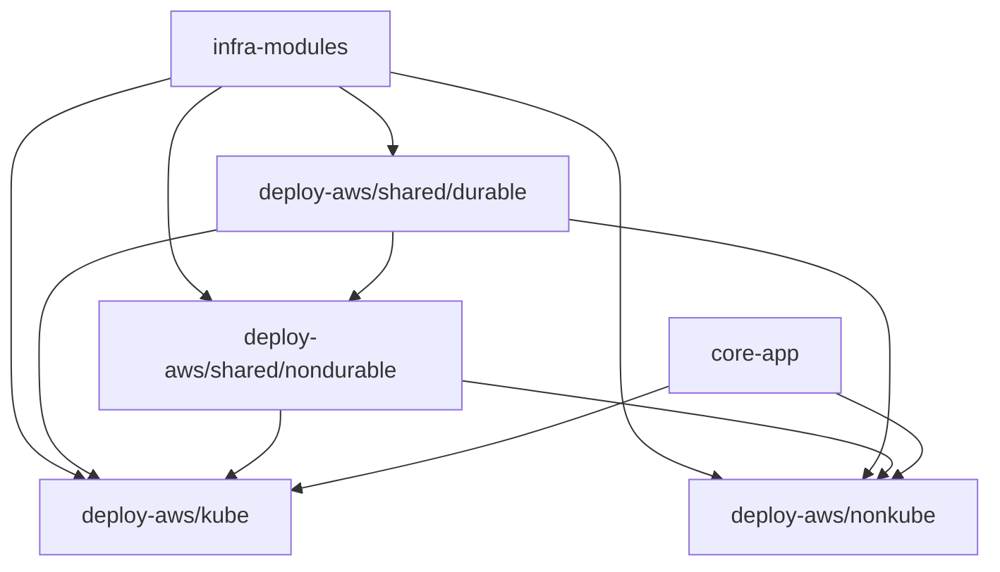

# REFACTOR_PLAN

## Table of Contents
1. Goals
2. Architecture
3. Projects
4. Deployment Flow
5. Recovery Flow

## 1. Goals
- Behavior-preserving vs legacy (EKS + ECS deployments)
- IaC-first with OpenTofu/Terraform
- Safe teardown with scope isolation
- Extensible to more regions and clouds

## 2. Architecture

## 3. Projects
- `deploy-aws/shared/durable`: VPC + base IAM + KMS + Secrets Manager, protected
- `deploy-aws/shared/nondurable`: buckets, ECR, logs
- `deploy-aws/kube`: EKS + nginx ingress (NLB) + Spark CronJob scaffolding
- `deploy-aws/nonkube`: ECS + ALB + scheduled Spark task scaffolding
- `deploy-gcp-*`: GCP parity projects (minimal but real)

## 4. Deployment Flow
- Deploy shared durable (ensure)
- Deploy shared non-durable
- Deploy kube OR nonkube
- Bootstrap analytics job once
- Enable schedule

## 5. Recovery Flow
- If state is lost or cloud was nuked: re-init + import using tools.
