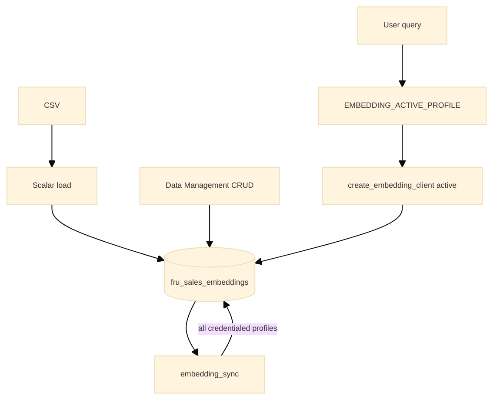

# BytePlus ModelArk + embedding profiles (FRU reference)

**Status:** Active path for chat + embeddings; vectors stay in **PostgreSQL pgvector**. VikingDB deferred (AU account).

## Four axes

| Axis | Env / config | FRU rule |
|------|----------------|----------|
| Compute | `CLOUD_PROVIDER` = `local`, `aws`, `gcp` | kube + nonkube share one Postgres per cloud |
| Search lane | `EMBEDDING_ACTIVE_PROFILE` | **Query-time only** — which pgvector column ANN search reads |
| Storage lanes | `embedding_profiles.yaml` | **Write-time** — all credentialed profile columns populated per row |
| **Chat inference** | `LLM_INFERENCE_PROVIDER` | **Agent /query LLM only** — default `claude`; `modelark` for BytePlus chat |
| Vector store | pgvector; VikingDB Phase D | One column per profile name |

## Profiles (`config/embedding_profiles.yaml`)

| Profile | Provider | Column | Dimension |
|---------|----------|--------|-----------|
| `openai_1536` | OpenAI | `embedding_openai_1536` | 1536 |
| `skylark_2048` | ModelArk | `embedding_skylark_2048` | 2048 |

Column naming: `embedding_{model_slug}_{dimension}`.

## Environment

| Variable | Role |
|----------|------|
| `EMBEDDING_ACTIVE_PROFILE` | **Search only** — ANN column + query embedding (default `openai_1536`) |
| `EMBEDDING_PROFILES_CONFIG` | Optional YAML path override |
| `OPENAI_API_KEY` / `OPENAI_EMBED_MODEL` | OpenAI storage + search when active |
| `ARK_API_KEY`, `ARK_BASE_URL`, `ARK_CHAT_MODEL_ID`, `ARK_EMBEDDING_MODEL_ID` | ModelArk storage (and search when active) |
| `ADMIN_API_KEY` | Optional; enables `POST /admin/embeddings/sync` |
| `LLM_INFERENCE_PROVIDER` | Chat backend: **`claude`** (default) or **`modelark`** — orthogonal to search lane |

### Chat inference (`LLM_INFERENCE_PROVIDER`)

| Value | Default? | Chat client | Model env |
|-------|----------|-------------|-----------|
| `claude` | **Yes** | `CLOUD_PROVIDER` dispatch | local/gcp: `CLAUDE_MODEL`; aws: Bedrock ids |
| `modelark` | Opt-in | `ModelArkClient` | `ARK_CHAT_MODEL_ID` (+ `ARK_API_KEY`, `ARK_BASE_URL`) |

Extend: add allowlist entry in `llm_inference_config.py` + factory branch + envex row.

## Data flow



## Storage vs search

| Concern | Mechanism |
|---------|-----------|
| **Storage (steady state)** | Every row: populate all profile columns with credentials via `embedding_sync` on CRUD, bootstrap, or admin sync |
| **Search (runtime)** | `EMBEDDING_ACTIVE_PROFILE` → `get_active_pgvector_column()` for ANN only |

kube and nonkube within the same cloud **share one Postgres** — embedding profiles are logical columns in one table.

## Operator commands

```bash
# Bootstrap scalars + vectors (local)
python core_app/backend/etl/load_openai_embeddings_to_pgvector.py --sync-embeddings

# Repair missing vectors from DB (not CSV)
PYTHONPATH=core_app python tools/cloud_shared/embed/sync_embeddings_cli.py --all --missing-only

# Admin bulk sync (requires ADMIN_API_KEY)
curl -X POST http://localhost:5001/admin/embeddings/sync \
  -H "X-Admin-Api-Key: $ADMIN_API_KEY" \
  -H "Content-Type: application/json" \
  -d '{"scope":"all","missing_only":true}'
```

## Hybrid (AWS/GCP compute + ModelArk embeddings)

`CLOUD_PROVIDER=aws|gcp` with `EMBEDDING_ACTIVE_PROFILE=skylark_2048` requires HTTPS egress to ModelArk and `ARK_API_KEY` in secrets. **Storage** still needs both `OPENAI_API_KEY` and `ARK_*` to populate both columns.

Set `EMBEDDING_ACTIVE_PROFILE` in `.env` for **search lane only**; YAML deploy configs do not define the profile.

## AWS bootstrap vs steady state

| Phase | Transport | Sync module | When |
|-------|-----------|-------------|------|
| **Bootstrap** (deploy laptop/CI) | RDS Data API | `embedding_sync_rds` via `load_openai_embeddings_to_pgvector_rds_api.py` | `tools/aws/scope_shared/deploy/setup_database.py` Phase 6 |
| **Steady state** (ECS nonkube API) | psycopg2 `PGHOST` | `embedding_sync` on `/rawdata` CRUD | After deploy |

Bootstrap needs `OPENAI_API_KEY` and `ARK_*` in operator `.env` (passed to ETL subprocess). ECS nonkube task needs `ARK_API_KEY` in Secrets Manager (`ark_api_key` secret) plus `ARK_EMBEDDING_MODEL_ID` / `ARK_BASE_URL` env vars for runtime dual-column CRUD.

```bash
# Invoked by deploy (not usually run standalone)
python tools/aws/scope_shared/deploy/setup_database.py --env dev --region us-east-1
```

## Schema

`core_app/sql/migrations/001_embedding_profiles.sql` renames `embedding` → `embedding_openai_1536` and adds `embedding_skylark_2048`.

## Local kube (Docker Desktop)

After `docker build -t fru-api:local`, import into k8s containerd or rollout may keep a stale digest:

```bash
docker save fru-api:local | docker exec -i desktop-control-plane ctr -n k8s.io images import -
```

## VikingDB (deferred)

When AU whitelist grants access, see `cursor_gen/refactor_plans/completed/REFACTOR_MODELARK_VIKINGDB.md` Phase D.
