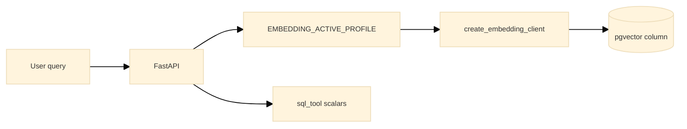

# BytePlus ModelArk + embedding profiles (FRU reference)

**Status:** Active path for chat + embeddings; vectors stay in **PostgreSQL pgvector**. VikingDB deferred (AU account).

## Three axes

| Axis | Env / config | FRU rule |
|------|----------------|----------|
| Compute | `CLOUD_PROVIDER` = `local`, `aws`, `gcp` | kube + nonkube share one Postgres per cloud |
| Embedding profile | `EMBEDDING_ACTIVE_PROFILE` | One active profile per env → one pgvector column |
| Vector store | pgvector (active); VikingDB Phase D | One column per profile name |

## Profiles (`config/embedding_profiles.yaml`)

| Profile | Provider | Column | Dimension |
|---------|----------|--------|-----------|
| `openai_1536` | OpenAI | `embedding_openai_1536` | 1536 |
| `skylark_2048` | ModelArk | `embedding_skylark_2048` | 2048 |

Column naming: `embedding_{model_slug}_{dimension}`.

## Environment

| Variable | Role |
|----------|------|
| `EMBEDDING_ACTIVE_PROFILE` | Selects profile (default `openai_1536`) |
| `EMBEDDING_PROFILES_CONFIG` | Optional YAML path override |
| `OPENAI_API_KEY` / `OPENAI_EMBED_MODEL` | OpenAI profile |
| `ARK_API_KEY`, `ARK_BASE_URL`, `ARK_CHAT_MODEL_ID`, `ARK_EMBEDDING_MODEL_ID` | ModelArk |
| `LLM_INFERENCE_PROVIDER=modelark` | Route chat via ModelArk (optional) |

## Data flow



## Steady state vs migration

| Mode | Columns populated | Search path |
|------|-------------------|-------------|
| **Steady state** | One active profile column only | ANN on `get_active_pgvector_column()` |
| **Migration / eval** | Backfill a second column temporarily | Switch `EMBEDDING_ACTIVE_PROFILE` to compare; drop loser after cutover |

kube and nonkube within the same cloud **share one Postgres** — embedding profiles are logical lanes (columns), not separate databases.

| Environment | Postgres | kube + nonkube |
|-------------|----------|----------------|
| Local | Docker `fru-postgres` | Same DB |
| AWS | Aurora | Same DB |
| GCP | Cloud SQL | Same DB |

## Hybrid (AWS/GCP compute + ModelArk embeddings)

`CLOUD_PROVIDER=aws|gcp` with `EMBEDDING_ACTIVE_PROFILE=skylark_2048` requires HTTPS egress to ModelArk and `ARK_API_KEY` in secrets manager / `.env`. Chat may stay on Bedrock/Gemini unless `LLM_INFERENCE_PROVIDER=modelark`.

| Environment | Recommended profile | Notes |
|-------------|----------------------|-------|
| Local demo (BytePlus keys) | `skylark_2048` | See `docs/BYTEPLUS_LOCAL_DEV.md` |
| Local / CI default | `openai_1536` | No `ARK_*` required |
| AWS / GCP prod default | `openai_1536` | Until operator migrates lane |

Set `EMBEDDING_ACTIVE_PROFILE` in `.env` (or cloud secrets / container env at deploy). That is the only operator knob; YAML deploy configs do not define the profile.

## Migration

Existing DBs: `core_app/sql/migrations/001_embedding_profiles.sql` renames `embedding` → `embedding_openai_1536` and adds nullable `embedding_skylark_2048`. Applied automatically after schema in deploy db_setup.

## Local kube (Docker Desktop)

After `docker build -t fru-api:local`, import into the k8s node containerd or rollout may keep a **stale** image digest:

```bash
docker save fru-api:local | docker exec -i desktop-control-plane ctr -n k8s.io images import -
```

## VikingDB (deferred)

When AU whitelist grants access, see `cursor_gen/refactor_plans/completed/REFACTOR_MODELARK_VIKINGDB.md` Phase D.
