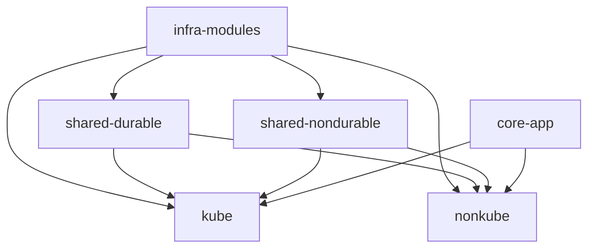
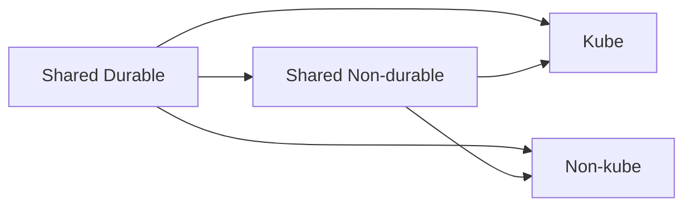

# FRU GenAI Analytics: Final Refactor Plan

**Status**: Plan (implementation pending)  
**Created**: 2026-02-10  
**Purpose**: Single consolidated refactor plan for the new project (`fru-genai-analytics-new`), combining architecture principles, Aurora/DB wiring, and implementation tasks.

---

## Table of Contents

1. [Executive Summary](#1-executive-summary)
2. [Goals & Principles](#2-goals--principles)
3. [Target Architecture](#3-target-architecture)
4. [Multi-Env, Multi-Region, Multi-Cloud + Kube Parity](#4-multi-env-multi-region-multi-cloud--kube-parity)
5. [Durable vs Non-durable & Teardown Rules](#5-durable-vs-non-durable--teardown-rules)
6. [AWS Placement: Aurora, CloudFront, DynamoDB](#6-aws-placement-aurora-cloudfront-dynamodb)
7. [Aurora & DB Wiring (Functionality Gap)](#7-aurora--db-wiring-functionality-gap)
8. [Implementation Tasks](#8-implementation-tasks)
9. [Deploy Phase Order](#9-deploy-phase-order)
10. [Completeness Check: Legacy vs Plan](#10-completeness-check-legacy-vs-plan)
11. [Tooling & Success Criteria](#11-tooling--success-criteria)
12. [References](#12-references)

---

## 1. Executive Summary

The new project (`fru-genai-analytics-new`) refactors the legacy monolithic deployment into a modular, IaC-first architecture. This plan consolidates:

- **Architecture principles** – Durable vs nondurable, teardown scope, state management
- **Target structure** – core-app, infra-modules, live-deploy-aws (shared durable, shared nondurable, kube, nonkube)
- **Functionality gap** – Aurora PostgreSQL (pgvector), DB setup flow, PG* env vars for ECS/EKS, kube parity with shared_nondurable
- **Implementation checklist** – Ordered tasks to complete the refactor

### Current Gaps vs Legacy

| Gap | Legacy | New (current) |
|-----|--------|---------------|
| **Aurora** | Aurora Serverless v2 in root_infrastructure | No Aurora; durable has VPC + Secrets only |
| **DB setup** | setup-database.sh → ensure-pgvector → init_schema → load_data | No schema, no init, no load flow |
| **PG* env vars** | PGHOST, PGDATABASE, PGUSER, PGPASSWORD from infra to ECS/EKS | ECS: PGPASSWORD only; no PGHOST, PGDATABASE, PGUSER |
| **Kube parity** | Uses shared_nondurable for ECR, delta_bucket | Kube does not use shared_nondurable |
| **ETL** | load_openai_embeddings with DB_CLUSTER_ARN, DB_SECRET_ARN | ETL exists but no DB; no env vars passed |

---

## 2. Goals & Principles

### Primary Goals

1. **Behavior-preserving refactor** – No functional changes to core application
2. **Reduce complexity** – Less script glue, clearer boundaries
3. **Improve safety** – Scope-based teardown, state reconciliation
4. **IaC-first** – Terraform/OpenTofu manages infra; scripts only for what IaC can't do
5. **Preserve lessons learned** – Retain hard-won knowledge from legacy

### Guiding Principles

- **IaC-First**: Terraform/Terragrunt manages infrastructure; scripts only for what IaC can't do
- **Deployment-Agnostic Core**: Application code knows nothing about deployment
- **Python Over Shell**: When scripting is needed, prefer Python for testability
- **Explicit Over Implicit**: Clear dependencies, no hidden orchestration
- **Progressive Enhancement**: Start with AWS, design for multi-cloud later

### Non-Goals (Phase 1)

- No forced multi-cloud support
- No optimization for minimal infra cost

---

## 3. Target Architecture

### Stack Layout



### Full Architecture (with Aurora)

```
┌─────────────────────────────────────────────────────────────────────────────┐
│                         live-deploy-aws/shared/durable                       │
│  VPC + Aurora (pgvector) + Secrets (openai_api_key, db_password)             │
│  Outputs: vpc_id, subnets, aurora_endpoint, aurora_port, aurora_database_name│
│           aurora_security_group_id, db_cluster_arn, db_password_secret_arn  │
└─────────────────────────────────────────────────────────────────────────────┘
                    │                                    │
                    ▼                                    ▼
┌───────────────────────────────────┐    ┌───────────────────────────────────┐
│  live-deploy-aws/shared/nondurable │    │  DB Setup (tools/aws/setup_database) │
│  ECR, S3 (delta, artifacts)       │    │  ensure_pgvector → init_schema →    │
│  Outputs: ecr_app_url, ecr_spark_   │    │  load_data (RDS Data API)           │
│  url, delta_bucket                 │    │  Uses: durable outputs               │
└───────────────────────────────────┘    └───────────────────────────────────┘
                    │                                    │
                    ▼                                    ▼
┌───────────────────────────────────┐    ┌───────────────────────────────────┐
│  live-deploy-aws/kube              │    │  live-deploy-aws/nonkube           │
│  EKS + frontend                    │    │  ECS + ALB + frontend              │
│  Uses: durable + nondurable        │    │  Uses: durable + nondurable        │
│  PG* from durable                  │    │  PG* from durable                  │
└───────────────────────────────────┘    └───────────────────────────────────┘
```

### Phased Execution (Original Plan)

| Phase | Scope | Status |
|-------|-------|--------|
| **Phase 1** | Structure – umbrella layout, extract core-app, define module boundaries | Done |
| **Phase 2** | Shared Infra – shared-durable, shared-nondurable, importability | Partial (Aurora missing) |
| **Phase 3** | Deployment Targets – kube (EKS), nonkube (ECS) | Done |
| **Phase 4** | Orchestration – Python orchestrators, scope-based teardown | Done |
| **Phase 5** | Aurora + DB wiring – close functionality gap | Pending |
| **Phase 6** | Multi-Region – add us-west-2, validate cross-region | Future |
| **Phase 7** | Multi-Cloud – GCP, Oracle, Azure (when needed) | Future |

---

## 4. Multi-Env, Multi-Region, Multi-Cloud + Kube Parity

This section consolidates the **Refactor Plan: Multi-Env, Multi-Region, Multi-Cloud + Kube Parity** – the design for scaling across environments, regions, clouds, and ensuring kube matches nonkube.

### 4.1 Multi-Environment (dev / prod)

- **Current**: `--env dev` or `--env prod` passed to deploy/teardown; `.env` and Terraform vars keyed by env
- **Pattern**: Per-environment config (e.g. `env.hcl`, `region.hcl`) with DRY inheritance
- **State**: Separate state keys per env: `aws-shared-durable.tfstate`, `aws-shared-nondurable.tfstate`, etc.
- **Secrets**: `{prefix}/{env}/openai_api_key`, `{prefix}/{env}/db_password` in Secrets Manager

### 4.2 Multi-Region

- **Current**: Single region (e.g. `us-east-1`) via `AWS_REGION` / `var.aws_region`
- **Future**: Add `us-west-2/` (or similar) under `live-deploy-aws/`; region-specific stacks
- **Pattern**: `live-deploy-aws/{region}/shared/durable`, `live-deploy-aws/{region}/kube`, etc., or `live-deploy-aws/shared/durable` with `region` var
- **State**: Region in state key or path to avoid collisions
- **Tasks**: Add region to deploy CLI; document cross-region patterns
- **Follow-on**: [FINAL_REFACTOR_PLAN_2.md](./FINAL_REFACTOR_PLAN_2.md) – `--region` support, state migration, `TF_DEFAULT_REGION`

### 4.3 Multi-Cloud

- **Current**: AWS only; `live-deploy-gcp/` exists but is minimal
- **Future**: GCP, Oracle, Azure when needed; structure supports `live-deploy-{cloud}/`
- **Pattern**: Shared `core-app`, shared `infra-modules` where possible; cloud-specific primitives in `infra-modules/{aws,gcp,...}/`
- **Principle**: Don't abstract multi-cloud until patterns are clear from real deployments

### 4.4 Kube Parity

Kube must have **functional parity** with nonkube:

| Capability | Nonkube (ECS) | Kube (EKS) | Status |
|------------|---------------|------------|--------|
| Uses shared_durable | ✅ | ✅ | Done |
| Uses shared_nondurable | ✅ | ❌ | **Gap** |
| ecr_app_url, ecr_spark_url | From shared_nondurable | Placeholder / hardcoded | **Gap** |
| delta_bucket | From shared_nondurable | Missing | **Gap** |
| PGHOST, PGDATABASE, PGUSER | From durable (after Aurora) | Placeholder (fru-db, postgres) | **Gap** |
| PGPASSWORD | From durable secret | Placeholder | **Gap** |
| Aurora SG rule (tasks → DB) | In ECS module | Missing | **Gap** |

**Kube parity tasks** (already in Implementation Tasks):

- Add `terraform_remote_state.shared_nondurable` to kube stack
- Pass `ecr_app_url`, `ecr_spark_url`, `delta_bucket` to kube_apply
- Pass `PGHOST`, `PGDATABASE`, `PGUSER` (and PGPASSWORD via K8s Secret) to api-deployment
- Add `aurora_from_eks` security group rule

---

## 5. Durable vs Non-durable & Teardown Rules

### 5.1 Durability and Ownership

Durability (how often we destroy) and ownership (who uses) are **orthogonal** axes.

- **Durable**: rarely destroyed, explicit intent required (e.g., secrets, VPC, Aurora)
- **Non-durable**: frequently destroyed (clusters, services, schedulers)

Ownership is separate: shared, kube-specific, nonkube-specific.

### 5.2 Teardown Scope Rules

If kube and nonkube both exist, tearing down one must not break the other.



**Rules:**

1. Durable stacks are **never destroyed implicitly**
2. Non-durable stacks may depend on durable stacks
3. Durable stacks may not depend on non-durable stacks
4. Kube teardown only destroys kube-owned state (plus optional shared-nondurable when safe)
5. Nonkube teardown only destroys nonkube-owned state (plus optional shared-nondurable when safe)

### 5.3 State Drift, Re-import, Nuclear Cleanup

- `tofu import` workflows
- Deterministic naming/tagging
- State boundaries per scope
- Tools: `tools/import-state-aws.py`, `tools/reconcile-state-aws.py`

### 5.4 Spark + Delta

- Spark is **containerized** and self-hosted (no EMR/Dataproc/Glue)
- Kube: Spark-on-Kubernetes; Nonkube: Spark as ECS task
- Delta on S3/GCS via delta-spark
- Bootstrap once, then recurring schedule (CronJob / EventBridge)

---

## 6. AWS Placement: Aurora, CloudFront, DynamoDB

### DynamoDB

Used only for **Terraform state locking** (`TF_LOCK_TABLE` in `tools/aws/_backend.py`). Not for application data.

### Aurora (PostgreSQL + pgvector)

- **Module**: `infra-modules/aws/primitives/aurora/`
- **Stack**: `live-deploy-aws/shared/durable` (long-lived, depends on VPC)
- Aurora is durable; not in nondurable.

### CloudFront

Legacy has **two frontend stacks** (nonkube ALB vs kube NLB). Options:

- **Option A**: Two stacks – `frontend-nonkube/`, `frontend-kube/`
- **Option B**: One stack, two distributions
- **Option C**: One distribution, two origins (more complex)

**Recommendation**: Option A or B. Primitives in `infra-modules/aws/primitives/`.

---

## 7. Aurora & DB Wiring (Functionality Gap)

### 7.1 Aurora Module

**Path**: `infra-modules/aws/primitives/aurora/`

**Source**: Port from legacy `module_infra_basic/aws/terra/modules/aurora/`

**Files**: `main.tf`, `variables.tf`, `outputs.tf`

**Notes**: Aurora PostgreSQL Serverless v2, pgvector via SQL after creation, `enable_http_endpoint = true` for RDS Data API.

### 7.2 Durable Stack: Add Aurora

**Path**: `live-deploy-aws/shared/durable/main.tf`

- Add `module "aurora"` with VPC wiring
- Wire `db_password` from Secrets Manager (or RDS-managed secret)
- **Outputs**: aurora_endpoint, aurora_port, aurora_database_name, aurora_security_group_id, db_cluster_arn, db_secret_arn

### 7.3 Schema and DB Setup

- **Schema**: `core-app/sql/schema_pgvector.sql` (copy from legacy)
- **Tool**: `tools/aws/setup_database.py` – ensure_pgvector → init_schema → load_data via RDS Data API
- **ETL**: `load_openai_embeddings_to_pgvector_rds_api.py` expects DB_CLUSTER_ARN, DB_SECRET_ARN

### 7.4 ECS Wiring

- Pass Aurora outputs to ECS module
- Add `PGHOST`, `PGPORT`, `PGDATABASE`, `PGUSER` to env_vars
- Add `aws_security_group_rule.aurora_from_ecs`

### 7.5 Kube Wiring

- Add `terraform_remote_state.shared_nondurable` for ecr_app_url, ecr_spark_url, delta_bucket
- Pass PG* to api-deployment.yaml via kube_apply templating
- Add aurora_from_eks security group rule

---

## 8. Implementation Tasks

| # | Task | Path / Scope |
|---|------|--------------|
| 1 | Create Aurora module | `infra-modules/aws/primitives/aurora/` |
| 2 | Add Aurora to durable stack | `live-deploy-aws/shared/durable/main.tf` |
| 3 | Add durable outputs | aurora_endpoint, aurora_port, aurora_database_name, aurora_security_group_id, db_cluster_arn, db_secret_arn |
| 4 | Copy schema file | `core-app/sql/schema_pgvector.sql` |
| 5 | Create setup_database.py | `tools/aws/setup_database.py` |
| 6 | Add parse_sql_statements.py (if missing) | `core-app/sql/` or `tools/` |
| 7 | Insert DB setup phase in deploy.py | After phase 5, before build |
| 8 | Update deploy_phases in phases.py | Add "Database setup" |
| 9 | ECS: Add Aurora outputs + env vars | nonkube/main.tf, infra-modules/aws/ecs |
| 10 | ECS: Add aurora_from_ecs SG rule | infra-modules/aws/ecs/main.tf |
| 11 | Kube: Add shared_nondurable remote state | live-deploy-aws/kube/main.tf |
| 12 | Kube: Pass ecr_app_url, ecr_spark_url, delta_bucket to kube_apply | kube/main.tf, kube_apply.py |
| 13 | Kube: Pass PG* to api-deployment | kube_apply.py, api-deployment.yaml |
| 14 | Kube: Add aurora_from_eks SG rule | EKS module or kube stack |
| 15 | Ensure ensure_secrets sets db_password | tools/aws/ensure_secrets.py (verify) |
| 16 | **Kube: Deploy frontend to S3** | deploy.py kube branch – call deploy_frontend_to_s3 with kube frontend_s3_bucket_id |

### Dependency Order

```
1. Aurora module (standalone)
2. Durable: Add Aurora + outputs
3. Schema file + setup_database.py
4. Deploy: DB setup phase
5. ECS: Aurora env vars + SG rule
6. Kube: shared_nondurable + PG* + SG rule
```

---

## 9. Deploy Phase Order

| Phase | Name |
|-------|------|
| 1 | Doctor checks |
| 2 | State backend bootstrap |
| 3 | Shared durable (VPC + Aurora + Secrets) |
| 4 | Shared nondurable (ECR + S3) |
| 5 | Secrets in Secrets Manager |
| 6 | **Database setup** (setup_database.py) ← NEW |
| 7 | Build and push images |
| 8 | ECR image URLs |
| 9 | Apply stack (kube/nonkube) |
| 10 | Bootstrap (K8s/ECS) |

---

## 10. Completeness Check: Legacy vs Plan

This section verifies the plan covers all legacy functionality. Items not in the Implementation Tasks are called out.

| Legacy Capability | Plan Coverage | Notes |
|-------------------|---------------|-------|
| Aurora PostgreSQL (pgvector) | ✅ Task 1–3 | Module, durable, outputs |
| DB setup (ensure_pgvector, init_schema, load_data) | ✅ Task 4–6, 7–8 | Schema, setup_database.py, deploy phase |
| PG* env vars (PGHOST, PGPORT, PGDATABASE, PGUSER, PGPASSWORD) | ✅ Task 9, 13 | ECS + Kube; PGUSER from Aurora master_username or plain var |
| ECS aurora_from_ecs SG rule | ✅ Task 10 | |
| Kube shared_nondurable, ecr_app_url, ecr_spark_url, delta_bucket | ✅ Task 11–12 | |
| Kube PG* + aurora_from_eks | ✅ Task 13–14 | |
| ensure_secrets (db_password, openai_api_key) | ✅ Task 15 | |
| Delta table creation | ⚠️ Implicit | Legacy: setup-and-verify.sh (CSV→Delta). New: bootstrap Job runs bootstrap.py. Plan assumes bootstrap creates Delta; verify bootstrap.py creates required tables (e.g. gold/bootstrap_metrics or fru_sales). |
| **Kube frontend deploy to S3** | ❌ **Gap** | Nonkube calls deploy_frontend_to_s3; **kube does not**. Kube has CloudFront+S3 but S3 bucket is never populated. **Add**: Deploy frontend to kube S3 bucket after kube stack apply. |
| validate-infra-outputs | ⚠️ Optional | Legacy runs after DB setup. Can be folded into setup_database.py (fail if outputs missing). |
| db_username secret | ⚠️ Optional | Legacy has separate secret. Plan uses PGUSER from Aurora master_username (plain env). Acceptable if master_username is fixed. |
| Frontend build + sync (nonkube) | ✅ Existing | deploy_frontend_to_s3 in deploy.py |

---

## 11. Tooling & Success Criteria

### Tooling

- **OpenTofu**-compatible Terraform
- **Python** for orchestration (deploy.py, teardown.py, setup_database.py)
- Minimal Bash for local glue
- `.env` as single source of configuration truth

### Success Criteria

- One-command deploy per target (`python tools/aws/deploy.py --scope kube|nonkube --env dev`)
- Safe partial teardown (kube vs nonkube vs all)
- Recoverable state after nuclear cleanup
- Clear mental model for new contributors
- Aurora + DB setup integrated into deploy flow
- PG* env vars passed to ECS and EKS workloads

---

## 12. References

### 11.1 In-Repo Docs

- [AWS_AURORA_CLOUDFRONT_PLACEMENT.md](./AWS_AURORA_CLOUDFRONT_PLACEMENT.md) – Aurora and CloudFront placement
- [MIGRATION_ECS_COMBINED.md](./MIGRATION_ECS_COMBINED.md) – ECS module state migration
- [README_REFACTOR_LEARNED.md](../README_REFACTOR_LEARNED.md) – Durable vs nondurable, teardown rules

### 11.2 Follow-on Plan

- [FINAL_REFACTOR_PLAN_2.md](./FINAL_REFACTOR_PLAN_2.md) – Multi-region: `--region`, `migrate_state_to_region_key.py`, `TF_DEFAULT_REGION`

### 11.3 Legacy References

- `module_infra_basic/aws/terra/modules/aurora/` – Aurora Terraform module
- `module_infra_db/aws/setup-database.sh`, `init_schema_aws.sh`, `load_data_aws.sh` – DB setup flow
- `module_infra_kubetypes/nonkube/aws/terra/modules/root_ecs/main.tf` – PGHOST, PGPORT, PGDATABASE in task def
