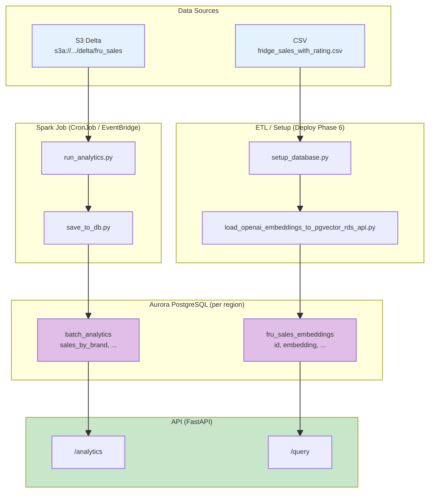
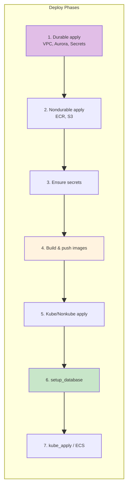

# Core App Structure: Architecture, Data Flow, and Workflow

A unified view of how the **API image**, **Spark image**, **Aurora PostgreSQL**, and **deploy tooling** work together. Includes code composition, data flow, and where Aurora is created per region.

**Related docs:** [FULL_ARCH_KUBE_LEARN.md](learned/FULL_ARCH_KUBE_LEARN.md), [FULL_ARCH_NONKUBE_LEARN.md](learned/FULL_ARCH_NONKUBE_LEARN.md), [ANALYTICS_KUBE_NONKUBE_SHARED_DATA.md](learned/ANALYTICS_KUBE_NONKUBE_SHARED_DATA.md), [CODE_STRUCTURE_WITH_AWS.md](CODE_STRUCTURE_WITH_AWS.md), [README_WAR_STORIES.md](../README_WAR_STORIES.md).

---

## 1. Two Images, Two ECR Repos per Region

| Image | Dockerfile | ECR Repo (per region) | Purpose |
|------|------------|----------------------|---------|
| **API** | `core_app/Dockerfile` | `{proj}-api-{env}-{region}` | FastAPI app: `/health`, `/query`, `/analytics`, agent |
| **Spark** | `core_app/analytics/docker/Dockerfile` | `{proj}-spark-{env}-{region}` | Batch analytics: Spark job → `batch_analytics` table |

Both images are built from the same context root (`core_app/`) but use different Dockerfiles. ECR repos are **per region** (e.g. `fru-api-dev-us-east-1`, `fru-api-dev-us-east-2`).

---

## 2. Where Aurora PostgreSQL Is Created (Per Region)

Aurora is created by **Terraform** in the durable stack, **per region**:

```
infra_terraform/live_deploy/aws/scope_shared/durable/
├── main.tf          # module.aurora
└── (variables from terra_var_handling.py, region suffix)
```

**Code path:** `infra_terraform/modules/aws/primitives/aurora/main.tf` → `aws_rds_cluster.aurora` + `aws_rds_cluster_instance.aurora`.

**Region handling:** `terra_var_handling.py` passes `aws_region` (e.g. `us-east-1`, `us-east-2`) to the durable stack. Each region gets its own:
- VPC
- Aurora cluster (`{prefix}-{env}-aurora-cluster`)
- DB subnet group
- Secrets Manager secrets (`fru/dev/db_password-us-east-1`, etc.)

**Schema and data** are applied **after** Aurora creation via `setup_database.py` (Phase 6 of deploy):
1. `ensure_pgvector` — `CREATE EXTENSION IF NOT EXISTS vector`
2. `init_schema` — runs `core_app/sql/schema_pgvector.sql`
3. `load_data` — runs ETL to populate `fru_sales_embeddings`

---

## 3. Data Flow: Who Writes to Which Table



| Table | Written By | Read By | Purpose |
|-------|------------|---------|---------|
| **fru_sales_embeddings** | `load_openai_embeddings_to_pgvector_rds_api.py` (deploy) | API `/query` (semantic search) | Embeddings for fridge sales feedback |
| **batch_analytics** | `save_to_db.py` (Spark job) | API `/analytics` | Aggregated analytics (sales by brand, etc.) |

**Both tables live in the same Aurora instance per region.** Kube and Nonkube Spark jobs both write to `batch_analytics`; last writer wins in DEV.

---

## 4. Two ETL Scripts: When Each Is Used

| Script | Connection | When Used |
|--------|------------|-----------|
| `load_openai_embeddings_to_pgvector.py` | **psycopg2** (PGHOST, PGPORT, PGUSER, PGPASSWORD, PGDATABASE) | Local dev, or when direct TCP to DB is available |
| `load_openai_embeddings_to_pgvector_rds_api.py` | **RDS Data API** (DB_CLUSTER_ARN, DB_SECRET_ARN, CLOUD_REGION) | AWS deploy: `setup_database.py` invokes this |

**Why two?** RDS Data API works over HTTPS—no VPC or direct network to Aurora. Deploy runs from a laptop or CI; Aurora is in a private subnet. psycopg2 requires a reachable host:port. For AWS, we use the RDS API.

**Production path:** Only `load_openai_embeddings_to_pgvector_rds_api.py` is used by deploy. The psycopg2 version is for local/testing.

---

## 5. Aurora pgvector and Schema Verification

**pgvector** is enabled by `setup_database.py` before schema init:

1. `CREATE EXTENSION IF NOT EXISTS vector`
2. Wait for readiness: `SELECT 1 FROM (SELECT '[1,2,3]'::vector) t;`
3. Run `schema_pgvector.sql` (creates `fru_sales_embeddings` with `embedding VECTOR(1536)`)
4. Verify: `SELECT EXISTS(... column_name='embedding')` — fail if missing
5. Load data via RDS Data API ETL

**Caveat:** The `embedding` column and pgvector extension must exist before `load_data`. If schema init fails partway, the ETL will fail with "column embedding does not exist". Always run full `setup_database` (or ensure pgvector + schema) before load.

---

## 6. End-to-End Workflow (Deploy)



| Phase | What Happens |
|-------|--------------|
| 1 | Terraform: VPC, Aurora, Secrets Manager containers (per region) |
| 2 | Terraform: ECR repos, S3 buckets (per region) |
| 3 | `ensure_secrets.py`: Write PGPASSWORD, OPENAI_API_KEY to Secrets Manager |
| 4 | `build_and_push_images.py`: Build app + spark, push to region ECR |
| 5 | Terraform: EKS/ECS, ALB/NLB, CloudFront, EventBridge |
| 6 | `setup_database.py`: pgvector, schema, load `fru_sales_embeddings` |
| 7 | `kube_apply.py` or ECS: bootstrap, CronJob, API deployment |

---

## 7. Code Composition (Where Things Live)

```
core_app/
├── Dockerfile                    # API image
├── app.py                        # FastAPI entry
├── backend/
│   ├── etl/
│   │   ├── load_openai_embeddings_to_pgvector.py      # psycopg2 (local)
│   │   └── load_openai_embeddings_to_pgvector_rds_api.py  # RDS API (AWS)
│   └── ...
├── analytics/
│   ├── docker/Dockerfile         # Spark image
│   ├── jobs/
│   │   └── utils/save_to_db.py   # Writes to batch_analytics (psycopg2)
│   └── run_analytics.py          # Spark entry
└── sql/
    └── schema_pgvector.sql       # DDL for both tables

tools/aws/
├── deploy.py                     # Orchestrates phases
├── scope_shared/deploy/
│   ├── setup_database.py        # pgvector, schema, load_data
│   ├── build_and_push_images.py
│   └── ensure_secrets.py
└── kube/kube_apply.py            # Bootstrap, CronJob, deployment
```

---

## 8. Parallelism: API vs Spark

| Component | Runs | Connects to Aurora |
|-----------|------|--------------------|
| **API** | EKS Deployment (kube) or ECS Service (nonkube) | psycopg2 via PGHOST/PGPASSWORD from Secrets Manager |
| **Spark** | CronJob (kube) or EventBridge→ECS (nonkube) | psycopg2 via env (PGHOST, etc.) at task start |

Both use the **same Aurora instance** in that region. API reads `fru_sales_embeddings` and `batch_analytics`; Spark writes `batch_analytics`. No direct API↔Spark communication—they share the DB.

---

## 9. Where This Is Covered Elsewhere

| Topic | Doc |
|-------|-----|
| Kube architecture (VPC, EKS, Aurora, CloudFront) | [FULL_ARCH_KUBE_LEARN.md](learned/FULL_ARCH_KUBE_LEARN.md) |
| Nonkube architecture (ECS, ALB, Aurora) | [FULL_ARCH_NONKUBE_LEARN.md](learned/FULL_ARCH_NONKUBE_LEARN.md) |
| Shared data (batch_analytics, Delta) | [ANALYTICS_KUBE_NONKUBE_SHARED_DATA.md](learned/ANALYTICS_KUBE_NONKUBE_SHARED_DATA.md) |
| Terraform stack ownership | [TERRA_STACK_OWNERSHIP_AND_SHARED_RESOURCES.md](learned/terra/TERRA_STACK_OWNERSHIP_AND_SHARED_RESOURCES.md) |
| Aurora, Secrets, DB password flow | [README_WAR_STORIES.md](../README_WAR_STORIES.md) §44 |
| Code structure by cloud/scope | [CODE_STRUCTURE_WITH_AWS.md](CODE_STRUCTURE_WITH_AWS.md) |
