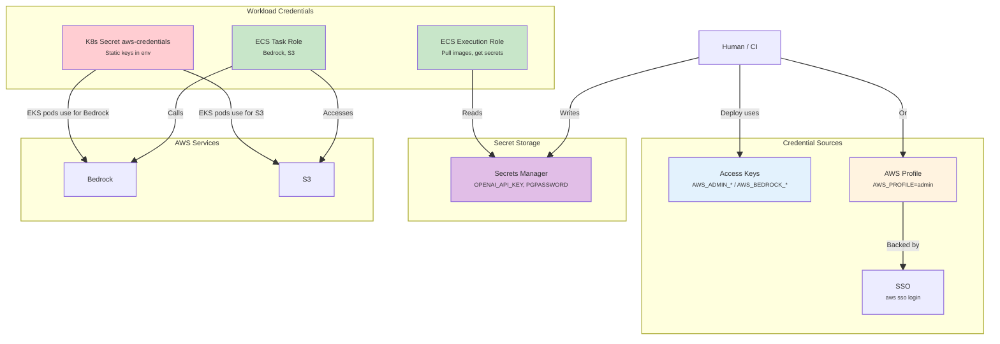
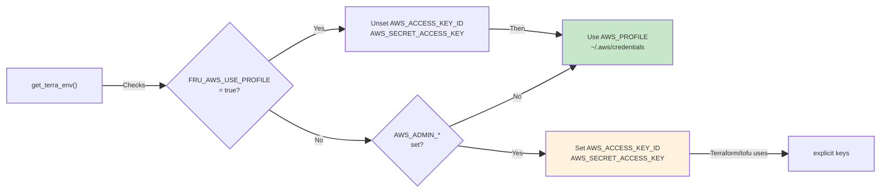
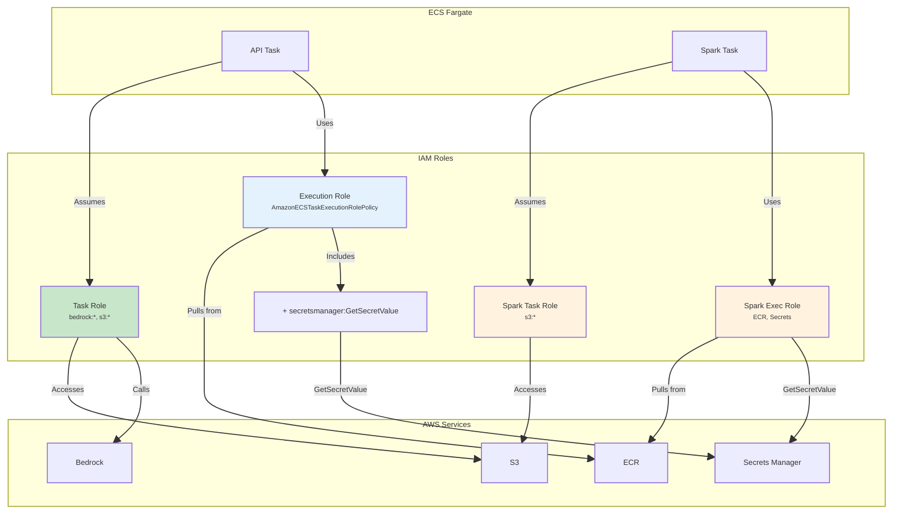
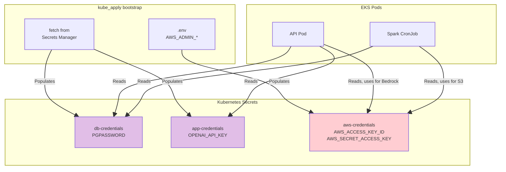
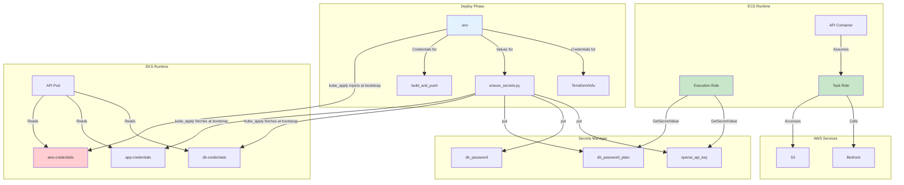

# AWS Authentication: A Systematic Guide for This Project

This document organizes all AWS authentication and access components we encounter—secrets, IAM roles, keys, profiles—and how each part of our system uses them. **It assumes very little prior AWS knowledge**; we explain each concept as we go.

---

## 1. The Big Picture: Two Worlds of Auth

<table>
<tr style="background:#e3f2fd"><th>World</th><th>Who/What</th><th>Credential Type</th><th>Used For</th></tr>
<tr><td><b>Human / CI</b></td><td>You, deploy scripts, Terraform, AWS CLI</td><td>Access keys <i>or</i> SSO profile</td><td>Deploy, teardown, ensure_secrets, doctor</td></tr>
<tr style="background:#f1f8e9"><td><b>Workload</b></td><td>ECS tasks, EKS pods, Spark jobs</td><td>IAM roles <i>or</i> static keys</td><td>Bedrock, S3, RDS Data API, Secrets Manager</td></tr>
</table>

**Why not just one choice in each row?**

- **Human / CI:** We’d like to use only SSO (safer, no long-lived keys), but CI pipelines and EKS bootstrap can’t run `aws sso login` interactively—they need access keys. So we support both: profile for local dev, keys for CI and headless scripts.
- **Workload:** We’d like to use only IAM roles (no keys to manage). But EKS pods don’t get automatic IAM credentials like ECS. We must inject credentials ourselves, and the only thing we can inject is **static keys** (the same access keys from `.env`). So: ECS uses roles; EKS uses static keys.

---

## 1.5 Core Concepts: IAM, Policies, Roles, SSO

Before diving into credentials, here are the building blocks.

### IAM (Identity and Access Management)

**IAM** is AWS’s system for controlling *who* can do *what* with your resources. Think of it as the security layer: every API call is checked against IAM rules before it’s allowed.

### IAM Policy

An **IAM policy** is a JSON document that defines permissions. It answers: *“Allow or deny which actions on which resources?”*

| Field | Meaning | Example |
|:------|:--------|:--------|
| **Effect** | Allow or Deny | `Allow` |
| **Action** | Which API operations | `s3:GetObject`, `secretsmanager:GetSecretValue` |
| **Resource** | Which resources (often ARNs) | `arn:aws:s3:::my-bucket/*` or `*` for all |

**Example policy** (simplified):

```json
{
  "Version": "2012-10-17",
  "Statement": [{
    "Effect": "Allow",
    "Action": ["secretsmanager:GetSecretValue"],
    "Resource": "arn:aws:secretsmanager:us-east-1:123456789012:secret:fru/dev/*"
  }]
}
```

**How it’s used:** Policies are attached to **IAM users** or **IAM roles**. When you (or a workload) make an API call, AWS checks: “Does this identity have a policy that allows this action on this resource?” If yes → allowed. If no → AccessDenied.

**In our project:** The ECS **execution role** has an inline policy (we call it `exec_secrets`) that allows `secretsmanager:GetSecretValue` on our three secret ARNs. Terraform attaches this policy to the role. Without it, the ECS agent would get AccessDenied when trying to fetch secrets before starting the container.

### IAM Role

An **IAM role** is an identity that can be *assumed* by someone or something. Unlike an IAM user (a person or service account), a role doesn’t have long‑lived passwords or keys. Instead, you *assume* the role and get **temporary credentials** (valid for minutes to hours).

| Identity | Has permanent credentials? | Typical use |
|:---------|:---------------------------|:------------|
| **IAM User** | Yes (access keys, password) | Humans, CI, scripts |
| **IAM Role** | No; assumed to get temp creds | ECS tasks, Lambda, EC2, SSO |

**In our project:** ECS tasks assume a **task role**. AWS injects temporary credentials into the container (via the `AWS_CONTAINER_CREDENTIALS_RELATIVE_URI` env var). The role has IAM policies for Bedrock and S3. The container never sees access keys—it just uses the injected credentials. Boto3 and the AWS SDK automatically pick them up.

### SSO (Single Sign-On)

**SSO** in AWS usually means **IAM Identity Center** (formerly AWS SSO). You sign in once (e.g. via a browser or `aws sso login`), and AWS gives you **temporary credentials** instead of long‑lived access keys.

| Step | What happens |
|:-----|:-------------|
| 1 | You run `aws sso login` (or click a link). |
| 2 | Browser opens; you sign in with your org’s IdP (e.g. Okta, Azure AD). |
| 3 | AWS issues temporary credentials (often ~12 hours). |
| 4 | Your `~/.aws/credentials` profile is updated with those temp creds. |
| 5 | When you use `AWS_PROFILE=admin`, the CLI uses those temp creds. |

**Why use SSO?** No long‑lived keys to rotate or leak. Credentials expire automatically. Centralized access control (your org manages who can access AWS).

---

## 2. Credential Types at a Glance



---

## 3. Human / CI Credentials (Deploy, Terraform, Scripts)

### 3.1 Credential Sources (Priority Order)

| Source | What it is | Env Vars | Expiry | Use Case |
|:-------|:-----------|:---------|:-------|:---------|
| **Profile** | A named entry in `~/.aws/credentials` that points to credentials (keys or SSO). You select it with `AWS_PROFILE=admin`. | `AWS_PROFILE=admin` | Depends (SSO: ~12h) | Preferred when `FRU_AWS_USE_PROFILE=true` |
| **Access Keys** | A pair of strings (Access Key ID + Secret Access Key) created for an IAM user. Used for programmatic access (CLI, SDK, scripts). | `AWS_ADMIN_ACCESS_KEY_ID`, `AWS_ADMIN_SECRET_ACCESS_KEY` | Never (until rotated) | Default; from `.env` |
| **SSO** | IAM Identity Center: you log in once, get temporary credentials. Your profile is configured to use those temp creds after `aws sso login`. | `aws sso login` + profile | ~12h session | When your org uses IAM Identity Center |

### 3.2 How `terra_runner` Chooses Credentials



### 3.3 Who Uses Human Credentials

| Component | Credential | Purpose |
|:----------|:-----------|:--------|
| **Terraform/OpenTofu** | `get_terra_env()` | Create/update/destroy infra |
| **ensure_secrets.py** | Default chain (profile or keys) | `put-secret-value` to Secrets Manager |
| **AWS CLI** (doctor, deploy) | `AWS_PROFILE` or default chain | `sts get-caller-identity`, S3, ECR, etc. |
| **kube_apply.py** | `aws secretsmanager get-secret-value` | Fetch DB/OpenAI for K8s secrets |
| **build_and_push_images.py** | Default chain | `ecr get-login-password`, `docker push` |

### 3.4 Why Not Just One Choice? (Human/CI and Workload)

#### The Two Questions

1. **Human / CI:** Why not just access keys *or* just SSO profile?
2. **Workload:** Why not just IAM roles *or* just static keys?

*(“Static keys” = the same access keys from `.env`—`AWS_ACCESS_KEY_ID`, `AWS_SECRET_ACCESS_KEY`—that we inject into EKS pods as Kubernetes secrets. They’re “static” because they don’t change until you rotate them, unlike IAM role credentials which are temporary.)*

---

#### Human / CI: Why We Support Both Access Keys and Profile

**In an ideal world:** Everyone would use SSO (profile). No long-lived keys, no keys in `.env`, automatic expiry. Safer.

**In practice:** Some things can’t use a profile:

| Situation | Why profile doesn’t work | What we use instead |
|:----------|:-------------------------|:---------------------|
| **CI pipeline** (e.g. GitHub Actions) | Runs in the cloud; no interactive `aws sso login` | Access keys in env vars (or OIDC, if configured) |
| **EKS aws-credentials** | Pods need `AWS_ACCESS_KEY_ID` and `AWS_SECRET_ACCESS_KEY` as env vars. A profile is a file path + config—you can’t “inject” a profile into a pod. | We copy keys from `.env` into a K8s secret at bootstrap |
| **Headless scripts** | No human to run `aws sso login` | Access keys |

So we **need** keys for CI and EKS. We **prefer** profile for local dev (safer, no keys in `.env`). So we support both and let you choose via `FRU_AWS_USE_PROFILE`.

---

#### Workload: Why We Use IAM Roles for ECS but Static Keys for EKS

**In an ideal world:** Everyone would use IAM roles. No keys to manage, no keys to leak, automatic rotation.

**In practice:** It depends on *where* the workload runs.

| Where | Does AWS inject credentials automatically? | What we use |
|:------|:-------------------------------------------|:------------|
| **ECS** | Yes. ECS gives each task an IAM role; AWS injects temporary credentials into the container. | IAM roles |
| **EKS** | No. EKS pods don’t get instance metadata by default. We have to provide credentials ourselves. | Static keys (from `.env`), stored in a K8s secret and mounted as env vars |

**Why can’t EKS use IAM roles?** It *can*—via IRSA (IAM Roles for Service Accounts). We could add that later. For now, we use the simpler approach: inject the same keys we use for deploy. That’s why we have both “IAM roles” (ECS) and “static keys” (EKS) in the workload row.

---

#### Summary Table

<table>
<tr style="background:#e3f2fd"><th>Choice</th><th>Ideal?</th><th>Blocker</th><th>Reality</th></tr>
<tr><td><b>Human: Profile only</b></td><td>Yes (safer)</td><td>CI and EKS can’t use profile</td><td>We need keys for those</td></tr>
<tr><td><b>Human: Keys only</b></td><td>No (keys can leak, go stale)</td><td>—</td><td>Works everywhere; we prefer profile for local dev</td></tr>
<tr><td><b>Workload: IAM roles only</b></td><td>Yes (safer)</td><td>EKS doesn’t auto-inject; we’d need IRSA</td><td>ECS uses roles; EKS uses static keys for now</td></tr>
<tr><td><b>Workload: Static keys only</b></td><td>No (keys can leak)</td><td>—</td><td>Works for EKS; ECS uses roles (better)</td></tr>
</table>

---

#### Quick Reference: Constraints

<table>
<tr style="background:#ffebee"><th>Constraint</th><th>Profile</th><th>Keys</th></tr>
<tr><td>CI (GitHub Actions, etc.)</td><td>Needs OIDC or configured profile; often harder</td><td style="background:#c8e6c9">✅ Set env vars</td></tr>
<tr><td>EKS aws-credentials K8s secret</td><td>Profile not injectable as env</td><td style="background:#c8e6c9">✅ Must use keys</td></tr>
<tr><td>Stale/rotated credentials</td><td style="background:#c8e6c9">✅ SSO refresh</td><td>AuthFailure until .env updated</td></tr>
<tr><td>Interactive login</td><td>Requires <code>aws sso login</code></td><td style="background:#c8e6c9">✅ None</td></tr>
</table>

**Advice:**
- Prefer **profile** for local dev: set `FRU_AWS_USE_PROFILE=true`, use `aws sso login`.
- Use **keys** for CI and for populating EKS `aws-credentials` (no alternative today).
- Consider **IRSA** for EKS later so pods can use IAM roles instead of static keys.

---

## 4. Workload Credentials (ECS vs EKS)

Workloads (containers, pods) need credentials to call AWS APIs. **ECS** uses IAM roles (no keys). **EKS** pods don’t get AWS metadata by default, so we inject credentials via Kubernetes secrets.

### 4.1 ECS: IAM Roles (No Static Keys)

ECS tasks assume **IAM roles**. AWS injects temporary credentials into the container automatically. The task never sees access keys—it just uses the role’s permissions (defined by IAM policies).



| ECS Role | What it is | Assumed By | Permissions |
|:---------|:------------|:-----------|:------------|
| **Execution role** | Used by the ECS agent *before* the container starts (pull image, fetch secrets). Has IAM policies for ECR, Secrets Manager, CloudWatch. | ECS agent (before task runs) | ECR pull, CloudWatch logs, **GetSecretValue** on our 3 secrets |
| **Task role** | Used by the container *at runtime* when it calls AWS APIs. Has IAM policies for Bedrock, S3. | Container at runtime | Bedrock, S3 (API + agent) |
| **Spark exec** | Same idea as execution role, but for the Spark task. | ECS agent for Spark task | ECR, **GetSecretValue** (PGPASSWORD) |
| **Spark task** | Same idea as task role, but for the Spark container. | Spark container | S3 (Delta) |

### 4.2 EKS: K8s Secrets (Static Keys)

EKS pods **do not** get instance metadata like EC2/ECS (no automatic IAM role injection). So we must inject AWS credentials ourselves. We store them as **Kubernetes secrets** (key‑value pairs), and the pods read them as environment variables. For AWS, we use **access keys** (from `.env`) because a profile can’t be passed as env vars.



| K8s Secret | Source | Consumed By |
|:-----------|:-------|:------------|
| **db-credentials** | AWS Secrets Manager (db_password_plain) | API, Spark CronJob |
| **app-credentials** | AWS Secrets Manager (openai_api_key) | API |
| **aws-credentials** | `.env` (AWS_ADMIN_* or AWS_BEDROCK_*) | API (Bedrock), Spark (S3) |

---

## 5. ARNs: What, How, and Why

**ARN (Amazon Resource Name)** is a unique identifier for every AWS resource—like a full path. Format: `arn:aws:service:region:account-id:resource-type/resource-id`. Example: `arn:aws:secretsmanager:us-east-1:123456789012:secret:fru/dev/db_password_plain-abc123`.

### 5.1 What We Use ARNs For

| Use Case | ARN Type | Example |
|:---------|:---------|:--------|
| **Secrets Manager** | Secret ARN | `arn:aws:secretsmanager:us-east-1:123456789012:secret:fru/dev/db_password_plain-abc123` |
| **IAM policy** | Grant `secretsmanager:GetSecretValue` on specific secrets | Execution role policy lists secret ARNs |
| **RDS Data API** | `db_secret_arn` for connection | `setup_database.py` uses secret ARN to fetch credentials |
| **Terraform outputs** | Pass secret ARNs between stacks | `durable_with_cooloff` outputs ARNs; `durable` re-exports; kube/nonkube consume |

### 5.2 Why ARNs (Not Names)?

| Reason | Explanation |
|:-------|:------------|
| **Uniqueness** | ARNs are globally unique; names can collide across accounts/regions |
| **IAM** | Policies require ARNs (or `*`) for resource-level permissions |
| **Cross-stack wiring** | Terraform outputs ARNs so other stacks can reference resources without hardcoding |
| **API calls** | `GetSecretValue`, `DescribeSecret`, etc. accept ARN or name; ARN is unambiguous |

---

## 6. Secrets Manager: What vs Who

**Secrets Manager** is an AWS service that stores sensitive values (passwords, API keys) securely. You create a secret, put a value in it, and other services (or IAM roles) can read it by ARN. We use it so we don’t hardcode secrets in code or config.

### 6.1 What We Store

| Secret Name | Format | Value |
|:------------|:-------|:------|
| `fru/dev/openai_api_key-{region}` | Plain string | OpenAI API key |
| `fru/dev/db_password-{region}` | JSON `{"username":"postgres","password":"..."}` | RDS Data API |
| `fru/dev/db_password_plain-{region}` | Plain string | ECS/EKS env (PGPASSWORD) |

### 6.2 Who Writes vs Who Reads

| Action | Who | Credential |
|:-------|:----|:-----------|
| **Create** | Terraform (durable_with_cooloff) | Human (tofu) |
| **Put value** | `ensure_secrets.py` | Human (AWS CLI) |
| **Read (ECS)** | ECS execution role | IAM role (no keys) |
| **Read (EKS)** | `kube_apply` at bootstrap | Human (AWS CLI) |
| **Read (RDS Data API)** | setup_database.py, ETL scripts | Human (boto3) |

---

## 7. Component Access Matrix

<table style="font-size:0.9em">
<tr style="background:#e3f2fd"><th>Component</th><th>S3</th><th>ECR</th><th>Secrets Manager</th><th>Bedrock</th><th>RDS Data API</th><th>Aurora (5432)</th></tr>
<tr><td>Deploy (human)</td><td style="background:#c8e6c9">✅ keys/profile</td><td style="background:#c8e6c9">✅ keys/profile</td><td style="background:#c8e6c9">✅ put</td><td>—</td><td>—</td><td>—</td></tr>
<tr><td>ECR login</td><td>—</td><td style="background:#c8e6c9">✅ keys/profile</td><td>—</td><td>—</td><td>—</td><td>—</td></tr>
<tr style="background:#f1f8e9"><td>ECS API task</td><td>task role</td><td>—</td><td>exec role</td><td>task role</td><td>—</td><td>PGPASSWORD</td></tr>
<tr style="background:#f1f8e9"><td>ECS Spark task</td><td>task role</td><td>—</td><td>exec role</td><td>—</td><td>—</td><td>PGPASSWORD</td></tr>
<tr style="background:#fff3e0"><td>EKS API pod</td><td>aws-credentials</td><td>—</td><td>—</td><td>aws-credentials</td><td>—</td><td>db-credentials</td></tr>
<tr style="background:#fff3e0"><td>EKS Spark pod</td><td>aws-credentials</td><td>—</td><td>—</td><td>—</td><td>—</td><td>db-credentials</td></tr>
<tr><td>setup_database</td><td>—</td><td>—</td><td style="background:#c8e6c9">✅ get</td><td>—</td><td style="background:#c8e6c9">✅ secret ARN</td><td>—</td></tr>
</table>

<small>Green = human credentials; Light green = ECS IAM roles; Orange = EKS static keys</small>

---

## 8. Credential Flow: End-to-End



---

## 9. Common Auth Issues and Fixes

<table>
<tr style="background:#ffebee"><th>Symptom</th><th>Cause</th><th>Fix</th></tr>
<tr><td><code>Unable to locate credentials</code></td><td>No keys, no profile, or SSO expired</td><td>Set <code>AWS_PROFILE=admin</code>; run <code>aws sso login</code></td></tr>
<tr><td><code>AuthFailure</code> / <code>SignatureDoesNotMatch</code></td><td>Stale keys in .env</td><td>Set <code>FRU_AWS_USE_PROFILE=true</code> to prefer profile</td></tr>
<tr><td>EKS: "Agent processing failed: Unable to locate credentials"</td><td>aws-credentials secret missing or empty</td><td>Run bootstrap with <code>AWS_ADMIN_*</code> in .env</td></tr>
<tr><td>EKS Spark: S3 AccessDenied</td><td>aws-credentials has Bedrock-only user</td><td>Use <b>admin</b> credentials (Bedrock + S3)</td></tr>
<tr><td>ECS: ImagePullBackOff</td><td>Execution role can't pull ECR</td><td>Execution role has AmazonECSTaskExecutionRolePolicy</td></tr>
<tr><td>ECS: Secret not found</td><td>Execution role lacks GetSecretValue</td><td>Attach policy with <code>secretsmanager:GetSecretValue</code> on secret ARNs</td></tr>
</table>

---

## 10. Quick Reference: Env Vars for Auth

| Variable | Purpose |
|:---------|:--------|
| `AWS_PROFILE` | Use named profile from `~/.aws/credentials` |
| `AWS_ADMIN_ACCESS_KEY_ID` | Long-lived IAM user key (deploy, K8s aws-credentials) |
| `AWS_ADMIN_SECRET_ACCESS_KEY` | Matching secret |
| `AWS_BEDROCK_ACCESS_KEY_ID` | Alternative for Bedrock-only user (not recommended: needs S3 too) |
| `FRU_AWS_USE_PROFILE` | When `true`, deploy uses profile over `AWS_ADMIN_*` |
| `OPENAI_API_KEY` | Written to Secrets Manager by ensure_secrets |
| `PGPASSWORD` | Written to Secrets Manager by ensure_secrets |

---

## 11. Glossary (Quick Reference)

| Term | Meaning |
|:-----|:--------|
| **IAM** | Identity and Access Management—AWS’s system for controlling who can do what |
| **IAM Policy** | JSON document that grants or denies specific actions on specific resources |
| **IAM Role** | Identity that can be assumed; grants temporary credentials (no long-lived keys) |
| **IAM User** | Identity with long-lived credentials (access keys, password) |
| **Access Keys** | Access Key ID + Secret Access Key—used for programmatic AWS access |
| **AWS Profile** | Named config in `~/.aws/credentials`; can hold keys or SSO temp creds |
| **SSO** | Single Sign-On (IAM Identity Center)—log in once, get temporary credentials |
| **ARN** | Amazon Resource Name—unique ID for an AWS resource |
| **Execution role** | IAM role used by ECS *before* the container starts (pull image, get secrets) |
| **Task role** | IAM role used by the container *at runtime* (Bedrock, S3, etc.) |
| **Static keys** | Long-lived access keys (from `.env`) injected into EKS pods—as opposed to temporary IAM role creds |
| **IRSA** | IAM Roles for Service Accounts—lets EKS pods assume IAM roles (alternative to static keys) |

---

## 12. Diagnostic Commands

```bash
# What credentials am I using?
python tools/aws/diagnose_auth.py

# Verify AWS identity
AWS_PROFILE=admin aws sts get-caller-identity

# Test Terraform env (what tofu sees)
python -c "from tools.aws.scope_shared.core.terra_runner import get_terra_env; e=get_terra_env('us-east-1'); print('AWS_ACCESS_KEY_ID' in e, 'AWS_PROFILE' in e)"
```
