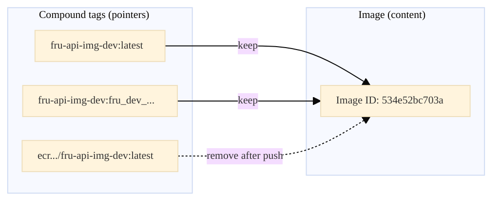
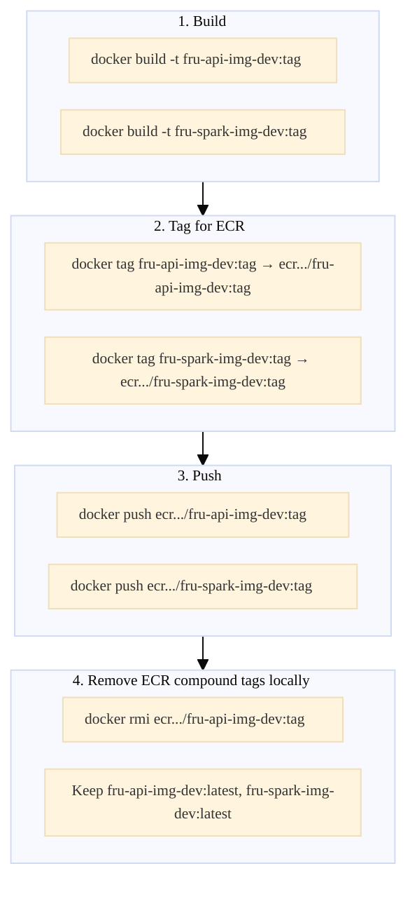
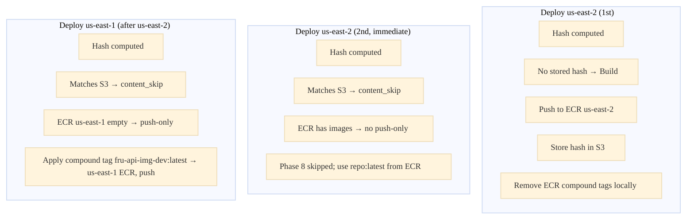

# Docker Images, Build & Push: Complete Guide

This document explains how Docker images and compound tags work in this project—concepts, build/push flow, content-skip, multi-region deploy, and cleanup. **Assumes very little prior Docker knowledge.**

---

## 1. The Big Picture: Image vs. Compound Tag

<table>
<tr style="background:#e3f2fd"><th>Concept</th><th>What It Is</th><th>Example</th></tr>
<tr><td><b>Image</b></td><td>A content-addressable object on disk. The actual layers and filesystem. Identified by an <b>Image ID</b>.</td><td><code>534e52bc703a</code></td></tr>
<tr style="background:#f1f8e9"><td><b>Compound tag</b></td><td>The full <code>name:tag</code> reference that <i>points to</i> an image. Like a bookmark.</td><td><code>fru-api-img-dev:latest</code></td></tr>
</table>

**Key idea:** An **image** is the thing. A **compound tag** (the full `name:tag`) is a reference you use to point to it. One image can have many compound tags; each compound tag points to exactly one image.

**Canonical compound tag:** In this project, a compound tag *without* the registry URL—e.g. `fru-api-img-dev:latest` or `fru-spark-img-dev:latest`. It's our single local reference for an image; we reuse it when pushing to any region by applying it to each region's registry URL. Contrast with `744139897900.dkr.ecr.us-east-2.amazonaws.com/fru-api-img-dev:latest`, which includes the registry and is region-specific.

---

## 2. One Image, Many Compound Tags

Multiple compound tags can point to the **same** image (same Image ID). No extra disk usage—compound tags are just pointers.

| Compound tag | Image ID | Notes |
|:-------------|:---------|:------|
| `fru-api-img-dev:latest` | `534e52bc703a` | Canonical—we keep this locally |
| `fru-api-img-dev:fru_dev_20260227_abc123` | `534e52bc703a` | Build-info (tag: fru_dev_...) |
| `744139897900.dkr.ecr.us-east-2.amazonaws.com/fru-api-img-dev:latest` | `534e52bc703a` | ECR path—created for push, then removed locally |



---

## 3. Same Name, Different Tags → Different Images

The same **name** with different **tags** usually refers to different images (versioning).

| Reference | Image ID | Meaning |
|:----------|:---------|:--------|
| `fru-api-img-dev:latest` | `abc123` | Current default |
| `fru-api-img-dev:fru_dev_20260226_xyz` | `def456` | Yesterday's build |

---

## 4. Same Name, Same Tag → Exactly One Image

A given compound tag (`name:tag`) can point to **only one** image at a time. Applying the same compound tag to a **new** image moves it from the old image; the old image becomes **dangling**. `docker image prune` removes dangling images.

---

## 5. Why Split Name and Tag?

| Aspect | Name | Tag |
|:-------|:-----|:----|
| **Answers** | *What* or *where* (repository, registry path) | *Which* version or variant |
| **Example** | `744139897900.dkr.ecr.us-east-2.amazonaws.com/fru-api-img-dev` | `latest`, `fru_dev_20260227_abc123` |

---

## 6. Project-Specific: Our Two Images

We build and push two images. **Repo names are regionless** (same in all regions):

| Image | Repo Name | Purpose |
|:------|:----------|:--------|
| **App** | `fru-api-img-dev` | FastAPI backend |
| **Spark** | `fru-spark-img-dev` | Analytics / Spark jobs |

### 6.1 Tagging: Max 2 Compound Tags per Image

| Tag (right-hand part) | Purpose |
|:----|:--------|
| `latest` | Default; used by content-skip and `--skip-build` |
| Build-info (e.g. `fru_dev_20260227_746aa6d_dirty_...`) | Traceability; version pinning |

### 6.2 Build & Push Flow

**Why the full registry path for push?** `docker push` requires a compound tag in the form `registry/repository:tag` (e.g. `744139897900.dkr.ecr.us-east-2.amazonaws.com/fru-api-img-dev:latest`). <span style="background-color:#e3f2fd; padding:2px 6px;">This is dictated by the **Docker/OCI image spec**—any registry (ECR, GCR, Docker Hub) uses this format.</span> The registry URL tells Docker where to send the image. Our canonical compound tags omit the registry, so we create the full form at push time: `docker tag fru-api-img-dev:latest {ecr_url}/fru-api-img-dev:latest`, then push.



**Why regionless names?** ECR allows the same repo name in different regions. One canonical local compound tag (`fru-api-img-dev:latest`) works for all regions—we re-tag for the target registry at push time.

**Multi-cloud:** GCP uses the same concepts with Artifact Registry (not ECR); build-context hash lives in `tools/cloud_shared/docker/build_context_hash.py` (GCS storage). AWS wrapper: `tools/aws/scope_shared/deploy/build_context_hash.py` (S3).

### 6.3 Content-Based Build Skip

Deploy skips the Docker build when the build context (source + Dockerfile) hasn't changed.

| Step | Action |
|:-----|:-------|
| Before build | Compute hash of `core_app/` (excludes `.git`, `node_modules`, etc.) |
| Compare | Fetch stored hash from S3 (from last successful build) |
| If match | Skip build; use `repo:latest` from ECR |
| If no match | Build, push, store hash in S3 |

**Storage:** `s3://{artifacts_bucket}/build-metadata/{env}/app-build-hash.json` (and spark). Hash is global per env, not per region. See `docs/learned/BUILD_CONTENT_SKIP.md` for details.

### 6.4 Deploy Scenarios

| Scenario | Build? | Push? | Notes |
|:---------|:-------|:------|:------|
| **First deploy to region** | Yes | Yes | No stored hash or ECR empty |
| **Same region, no code change** | No | No | Content-skip; ECR already has images; Phase 8 skipped entirely |
| **Different region, no code change** | No | Push-only | Content-skip; target ECR empty; apply local canonical compound tag → target ECR, push |
| **Code changed** | Yes | Yes | Hash mismatch; full build + push |



### 6.5 ECR Compound Tag Cleanup After Push

After each successful push, we remove ECR registry compound tags locally and keep only canonical names.

<table>
<tr style="background:#fff3e0"><th>Aspect</th><th>Detail</th></tr>
<tr><td><b>What</b></td><td><code>docker rmi</code> on compound tags like <code>744139897900.dkr.ecr.us-east-2.amazonaws.com/fru-api-img-dev:latest</code>; canonical compound tags stay</td></tr>
<tr><td><b>Why</b></td><td>ECR compound tags clutter Docker Desktop; they exist only for <code>docker push</code>. Once pushed, they serve no purpose.</td></tr>
<tr><td><b>Effect</b></td><td>Local state differs from ECR: we have <code>fru-api-img-dev:latest</code> locally; ECR has the same image under the full registry path. <i>Intentional.</i></td></tr>
<tr><td><b>Multi-region</b></td><td>We do <b>not</b> remove images (that would force a rebuild per region—wasteful). We remove only ephemeral ECR compound tags; canonical compound tags stay so one build can push-only to many regions.</td></tr>
<tr><td><b>Override</b></td><td>Use <code>--skip-untag-ecr</code> to keep ECR compound tags for debugging.</td></tr>
</table>

### 6.6 Push-Only Across Regions

With regionless names, push-only works across regions:

```bash
# Deploy to us-east-1 (build + push)
python tools/aws/deploy.py --scope all --env dev --region us-east-1

# Deploy to us-west-2 (content-skip; push-only fills empty ECR)
python tools/aws/deploy.py --scope all --env dev --region us-west-2
```

Local compound tags `fru-api-img-dev:latest` and `fru-spark-img-dev:latest` are re-tagged for the target region's registry and pushed. No rebuild.

### 6.7 Verification & Cleanup

**After deploy:**

```bash
# ECR repos exist with new names
aws ecr describe-repositories --region us-east-1 --query 'repositories[?contains(repositoryName, `fru`)].repositoryName'

# Local images: canonical compound tags only (no ECR URL compound tags)
docker images | grep fru-
# Expect: fru-api-img-dev, fru-spark-img-dev
```

**Stale items to remove:**

| Where | Item | Action |
|:------|:-----|:-------|
| **Local** | Old images (`fru-api-dev`, `fru-spark-dev`) | `docker rmi fru-api-dev:latest fru-spark-dev:latest` |
| **Local** | Dangling images | `docker image prune -f` |
| **ECR** | Old region-prefixed repos | Terraform destroys when applying nondurable; or `aws ecr delete-repository --repository-name fru-api-dev-us-east-1 --force` |
| **.env** | Component names | `ECR_APP_COMPONENT=api-img`, `ECR_SPARK_COMPONENT=spark-img` |

### 6.10 Full Test & Stale Cleanup Runbook

Tests the smart Docker strategy end-to-end and provides steps to detect and remove stale images.

#### Test the Smart Strategy

| Step | Command | Expected |
|:-----|:--------|:---------|
| 1 | `python tools/aws/deploy.py --scope all --env dev --region us-east-2` | Build runs; push to ECR; ECR compound tags removed locally; canonical `fru-api-img-dev`, `fru-spark-img-dev` remain |
| 2 | `docker images \| grep fru-` | Only canonical names (no `744139897900.dkr.ecr...` URLs). Max 4 rows: app + spark, each with `latest` and maybe build-info tag |
| 3 | `python tools/aws/deploy.py --scope all --env dev --region us-east-2` (immediate) | Phase 8 skipped; no build, no push—content-skip |
| 4 | `python tools/aws/deploy.py --scope all --env dev --region us-east-1` (no code change) | Push-only; no build; local images tagged for us-east-1 ECR and pushed |
| 5 | `docker images \| grep fru-` | Same as step 2; canonical compound tags still present |

#### Detect Stale Local Images

```bash
# List all fru-* images with repo, tag, image ID
docker images --format '{{.Repository}}\t{{.Tag}}\t{{.ID}}\t{{.Size}}' | grep -E '^fru-'

# Keep (current): fru-api-img-dev, fru-spark-img-dev
# Stale (old naming): fru-api-dev, fru-spark-dev, or any ECR URL compound tags (e.g. 744139897900.dkr.ecr...)
# Dangling: images with no tag (use docker image prune after)
```

**Stale local patterns:** Any repo name that does *not* match `fru-api-img-dev` or `fru-spark-img-dev` (e.g. `fru-api-dev`, `fru-spark-dev`). Or ECR URL compound tags if `--skip-untag-ecr` was used.

#### Remove Stale Local Images

```bash
# 1. Remove old-naming images (adjust tag if not latest)
docker rmi fru-api-dev:latest fru-api-dev:fru_dev_20260227_746aa6d_dirty_20260227_043314 2>/dev/null || true
docker rmi fru-spark-dev:latest 2>/dev/null || true

# 2. Remove ECR URL compound tags (if any left)
docker images --format '{{.Repository}}:{{.Tag}}' | grep '\.dkr\.ecr\.' | while read ref; do docker rmi "$ref" 2>/dev/null || true; done

# 3. Prune dangling images (from previous builds)
docker image prune -f
```

#### Detect Stale ECR Repos (AWS)

```bash
# Run AWS resource scan (includes ECR)
PYTHONPATH=. python tools/aws/standalone/temp_one_off/resources_scan/scan_aws_remaining.py \
  --cloud-regions us-east-1,us-east-2 --env dev --prefix fru
```

**Current ECR repos (regionless):** `fru-api-img-dev`, `fru-spark-img-dev` in each region.

**Stale ECR repos:** Old region-prefixed repos such as `fru-api-dev-us-east-1`, `fru-spark-dev-us-east-1`, `fru-api-dev-us-east-2`, etc. Or any repo matching `fru-*-dev-*-*-*` (region in name).

**Per-region check:**

```bash
# List ECR repos in a region
aws ecr describe-repositories --region us-east-2 --query 'repositories[?contains(repositoryName, `fru`)].repositoryName' --output text
```

#### Remove Stale ECR Repos (AWS)

```bash
# Delete old repo (replace REGION and REPO_NAME)
aws ecr delete-repository --repository-name fru-api-dev-us-east-2 --region us-east-2 --force
aws ecr delete-repository --repository-name fru-spark-dev-us-east-2 --region us-east-2 --force

# Repeat for each region and each stale repo
```

**Caution:** Terraform nondurable will destroy old repos when it applies (if the repo name changed in Terraform). Manual deletion is only needed if Terraform hasn't been applied or if the repo was created outside Terraform.

### 6.8 Migration (Preserving Old Images)

If you must keep images from old repos before destroying them:

```bash
# Example: copy from fru-api-dev-us-east-1 to fru-api-img-dev
aws ecr get-login-password --region us-east-1 | docker login --username AWS --password-stdin 744139897900.dkr.ecr.us-east-1.amazonaws.com
docker pull 744139897900.dkr.ecr.us-east-1.amazonaws.com/fru-api-dev-us-east-1:latest
docker tag 744139897900.dkr.ecr.us-east-1.amazonaws.com/fru-api-dev-us-east-1:latest \
  744139897900.dkr.ecr.us-east-1.amazonaws.com/fru-api-img-dev:latest
docker push 744139897900.dkr.ecr.us-east-1.amazonaws.com/fru-api-img-dev:latest
```

Then apply Terraform; destroy old repos when ready.

### 6.9 Relevant Code

| Location | What It Does |
|:---------|:-------------|
| `resource_names.py` | `ecr_repo_app`, `ecr_repo_spark` — regionless names |
| `build_and_push_images.py` | Build with local compound tags; push re-tags for target ECR |
| `build_and_push_images.py` | `_untag_ecr_refs_after_push` — removes ECR registry compound tags after push |
| `build_and_push_images.py` | `_remove_old_local_images_after_successful_build` — prunes dangling |
| `build_and_push_images.py` | `_cleanup_local_images_after_push` — opt-in `--cleanup-local` |
| `build_context_hash.py` | `compute_build_context_hash`, `get_stored_build_hash`, `store_build_hash` |
| `deploy.py` | Content-skip check; `_maybe_push_only_for_region` when target ECR empty |

---

## 7. Quick Reference

| Scenario | Result |
|:---------|:-------|
| Many compound tags → one image | Same Image ID; no extra disk |
| Same name, different tags | Usually different images (versioning) |
| Same name, same tag | Exactly one image; retagging moves the compound tag |
| Apply compound tag to new image | Old image becomes dangling |
| Deploy same region twice, no code change | No build, no push; Phase 8 skipped |
| Deploy new region, no code change | Push-only; no rebuild |
| After push | ECR compound tags removed locally; canonical names kept |

---

## 8. Glossary

| Term | Meaning |
|:-----|:--------|
| **Image** | Content-addressable object (layers + filesystem), identified by Image ID |
| **Compound tag** | The full `name:tag` reference (e.g. `fru-api-img-dev:latest`) pointing to an image |
| **Tag** | The right-hand part of a compound tag (e.g. `latest`, `fru_dev_20260227_abc123`) |
| **Canonical compound tag** | Compound tag without registry URL (e.g. `fru-api-img-dev:latest`); our single local reference, reused when pushing to any region |
| **Canonical name** | Regionless repo name (e.g. `fru-api-img-dev`) used locally for all regions |
| **ECR** | Elastic Container Registry — AWS's Docker registry |
| **Regionless repo** | Same repo name in all regions; enables push-only across regions |
| **Content-skip** | Deploy skips build when build-context hash matches stored value in S3 |
| **Push-only** | Apply local canonical compound tags to target ECR and push; no build |
| **Dangling image** | Image with no compound tag (e.g. after compound tag was moved to a new image) |
