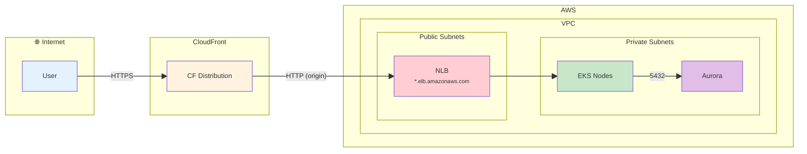
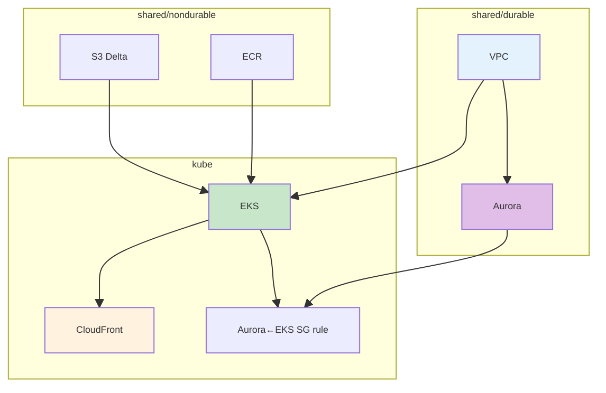
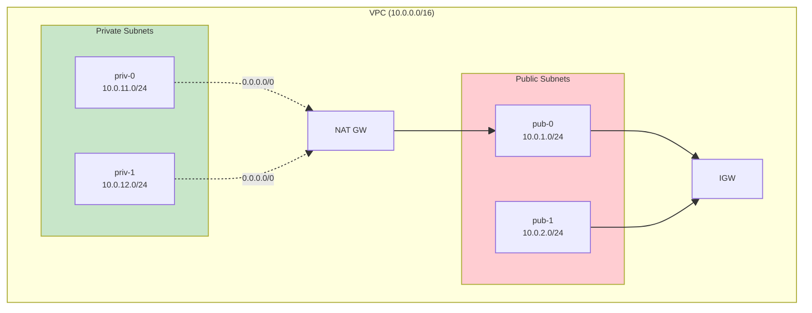
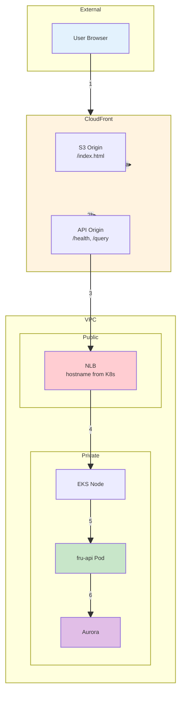
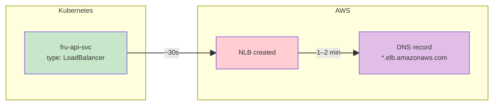

# Full Kube Architecture Crash Course

A visual crash course on how **VPC, LB, DNS, CloudFront, EKS, and Aurora** are wired together to create a fully working kube-based infrastructure.

> **Load balancer type:** See [KUBE_INGRESS_LEARNED.md](KUBE_INGRESS_LEARNED.md) Section 0 for Classic ELB vs NLB, `--elb` flag, and manifest selection.

**See also:** [VPC_LEARNED.md](VPC_LEARNED.md), [TERRA_LEARNED.md](terra/TERRA_LEARNED.md), [TERRA_STACK_OWNERSHIP_AND_SHARED_RESOURCES.md](terra/TERRA_STACK_OWNERSHIP_AND_SHARED_RESOURCES.md), [ANALYTICS_KUBE_NONKUBE_SHARED_DATA.md](ANALYTICS_KUBE_NONKUBE_SHARED_DATA.md), [war_stories/README.md](../war_stories/README.md).

---

## 1. High-Level Request Flow



| Step | Component | Protocol | Purpose |
|------|-----------|----------|---------|
| 1 | User → CloudFront | HTTPS | SSL termination at edge |
| 2 | CloudFront → NLB | HTTP | Origin fetch (NLB has no ACM cert) |
| 3 | NLB → API pods | TCP:80 | Load balance to fru-api |
| 4 | API pods → Aurora | TCP:5432 | DB queries |

---

## 2. Terraform Stack Dependency Order



| Stack | Creates | Depends On |
|-------|---------|------------|
| **shared/durable** | VPC, subnets, NAT, Aurora, DB subnet group | — |
| **shared/nondurable** | ECR, S3 buckets | — |
| **kube** | EKS, CloudFront, frontend S3, subnet tags | durable, nondurable |

---

## 3. VPC & Subnet Layout



| Subnet Type | Used By | Route to Internet |
|-------------|---------|-------------------|
| **Public** | LB (fru-api-svc; currently Classic ELB), NAT GW | IGW (direct) |
| **Private** | EKS nodes, Aurora | NAT GW (outbound only) |

**LB placement:** K8s Service `fru-api-svc` has `type: LoadBalancer` + `service.beta.kubernetes.io/aws-load-balancer-scheme: internet-facing`. **Current:** In-tree creates Classic ELB in public subnets. **With `aws-load-balancer-type: external`:** AWS Load Balancer Controller creates NLB. Subnets tagged `kubernetes.io/role/elb=1` by the kube stack.

### 3.1 Shared Resource Ownership: Durable vs Kube (Subnet Tags)

**Who owns what:** Durable **creates** VPC and subnets. Kube **uses** them (EKS in private subnets) and **adds tags** to public subnets via `aws_ec2_tag` so load balancers (Classic or NLB) can be placed in public subnets. Without these tags → LB in private subnets → CloudFront 502 ([War Story 43](../war_stories/WAR_STORIES_AWS.md#25-cloudfront-502-on-api-paths-nlb-internal-probe-timeouts-and-the-need-for-fail-fast-pod-verification)).

**Tag drift risk:** Durable's desired state did not include `kubernetes.io/*` tags. On durable apply, Terraform planned to remove them; kube re-added them → endless cycle. **Fix:** `lifecycle { ignore_changes = [tags] }` on subnet resources in the VPC module ([War Story 58](../war_stories/WAR_STORIES_AWS.md#35-vpc-subnet-tag-drift-durable-vs-kube-and-lifecycle-ignore_changes)).

**Deep dive:** [TERRA_STACK_OWNERSHIP_AND_SHARED_RESOURCES.md](terra/TERRA_STACK_OWNERSHIP_AND_SHARED_RESOURCES.md).

---

## 4. End-to-End Data Path (Detailed)



| # | Path | Notes |
|---|------|-------|
| 1 | User → CloudFront | `https://d123.cloudfront.net` |
| 2a | CF → S3 | Static frontend (index.html, assets) |
| 2b | CF → API origin | `/health`, `/query`, `/analytics` |
| 3 | CF → NLB | `http://k8s-xxx.elb.us-east-1.amazonaws.com` |
| 4 | NLB → EKS node | NodePort / kube-proxy |
| 5 | Node → Pod | fru-api container :5001 |
| 6 | Pod → Aurora | PGHOST from Secrets Manager |

---

## 5. DNS & Timing (Critical for Deploy)



| Phase | What Happens | Typical Time |
|-------|--------------|--------------|
| K8s Service created | AWS provisions LB (Classic or NLB) | ~30s |
| LB hostname in K8s | `status.loadBalancer.ingress[0].hostname` populated | Immediate |
| **DNS propagation** | Hostname resolvable from your machine | **1–2 minutes** |

**Deploy flow:** We wait for LB hostname → `wait_for_dns_resolvable(lb_host)` → `verify_api_db_connected()` → re-apply kube stack with `ingress_hostname` for CloudFront.

---

## 6. File Structure

```
fru-genai-analytics-new/
├── infra_terraform/live_deploy/aws/
│   ├── shared/
│   │   ├── durable/          # VPC, Aurora (apply first)
│   │   │   ├── main.tf
│   │   │   └── outputs: vpc_id, private_subnet_ids, aurora_endpoint, aurora_security_group_id
│   │   └── nondurable/       # ECR, S3 (apply second)
│   │       ├── main.tf
│   │       └── outputs: ecr_app_url, ecr_spark_url, delta_bucket
│   └── kube/                 # EKS, CloudFront (apply third)
│       ├── main.tf
│       ├── variables.tf      # ingress_hostname (null initially)
│       └── outputs: cloudfront_domain_name, frontend_s3_bucket_id
│
├── infra_terraform/modules/
│   ├── aws/
│   │   ├── primitives/
│   │   │   ├── vpc/          # VPC, subnets, NAT, IGW
│   │   │   ├── aurora/       # Aurora Serverless v2, DB subnet group
│   │   │   └── cloudfront/   # CF dist, S3 frontend, API origin
│   │   └── eks/              # EKS cluster, node group
│   └── shared/
│       └── k8s/
│           ├── api-service.yaml    # fru-api-svc, type: LoadBalancer
│           ├── api-deployment.yaml # fru-api pods
│           ├── bootstrap-job.yaml
│           └── spark-cronjob.yaml
│
└── tools/aws/
    ├── deploy.py            # Orchestrates: tofu apply → kube_apply → wait → re-apply
    ├── kube_apply.py        # kubectl apply of K8s manifests
    ├── bootstrap_helpers.py # wait_for_dns_resolvable, verify_api_db_connected
    └── teardown.py          # Pre-destroy: remove LB svc, CronJob, Job, namespace
```

---

## 7. Deploy Sequence (Kube)

| Phase | Action | Tool / Resource |
|-------|--------|-----------------|
| 1 | Apply shared/durable | `tofu apply` |
| 2 | Apply shared/nondurable | `tofu apply` |
| 3 | Ensure secrets (PGPASSWORD, etc.) | `ensure_secrets.py` |
| 4 | Build & push images | `build_and_push_images.py` |
| 5 | Apply kube stack (ingress_hostname=null) | `tofu apply` |
| 6 | Create namespace, secrets (incl. aws-credentials), bootstrap Job, schedule CronJob | `kube_apply.py` |
| 7 | Rollout restart API (pick up secrets) | `k8s_rollout_restart_api` |
| 8 | Wait for fru-api pods ready | `wait_for_fru_api_ready` |
| 9 | Poll for LB hostname | `kubectl get svc fru-api-svc -o jsonpath=...` |
| 10 | Wait for DNS resolvable | `wait_for_dns_resolvable(lb_host)` |
| 11 | Verify /health + DB connected | `verify_api_db_connected` |
| 12 | Re-apply kube with ingress_hostname | `tofu apply -var ingress_hostname=...` |
| 13 | Deploy frontend to S3, invalidate CF | `deploy_frontend_to_s3` |

---

## 8. Teardown Sequence (Kube)

| Step | Action | Why |
|------|--------|-----|
| 1 | Scale fru-api to 0 | Faster pod termination |
| 2 | Delete fru-api-svc (LoadBalancer) | Releases LB/ENIs; EKS destroy blocked otherwise |
| 3 | Delete CronJob, Job | Workloads block cluster delete |
| 4 | Delete namespace | Cascades remaining resources |
| 5 | Wait for namespace gone | LB release can take 1–2 min |
| 6 | Remove orphan EKS SGs | AWS may leave SGs after cluster delete |
| 7 | `tofu destroy` kube stack | EKS, CloudFront, frontend S3 |

---

## 9. Security Groups

| SG | Source | Target | Port | Purpose |
|----|--------|--------|------|---------|
| Aurora SG | EKS cluster SG | Aurora | 5432 | API pods → DB |
| EKS cluster SG | — | — | — | Created by EKS; referenced for Aurora ingress |
| LB | Internet (0.0.0.0/0) | EKS nodes | 80 | CloudFront → API |

---

## 10. Quick Reference Table

| Concept | Summary |
|--------|---------|
| **VPC** | One VPC; public + private subnets; NAT for private outbound |
| **LB** | Created by K8s `LoadBalancer` svc (currently Classic ELB via in-tree; NLB with `aws-load-balancer-type`); placed in public subnets; DNS 1–2 min |
| **CloudFront** | S3 + API origin; API origin = LB hostname; HTTP to origin |
| **EKS** | Nodes in private subnets; fru-api pods; connects to Aurora |
| **Aurora** | Private subnets; ingress from EKS cluster SG only |
| **ingress_hostname** | Set after LB hostname known; re-apply kube wires CF → LB |

---

## 11. Common Pitfalls

| Pitfall | Symptom | Fix |
|---------|---------|-----|
| DNS not ready | `nodename nor servname provided` | `wait_for_dns_resolvable` before /health |
| HTTPS to LB | HTTP 000 / SSL handshake fail | Use `http://` for LB (no ACM cert) |
| VPC mismatch | "subnet group not in same VPC" | Preempt with `--container-type all` |
| EKS destroy blocked | DependencyViolation | Delete LB svc before destroy |
| DB password mismatch | /health returns disconnected | `ensure_secrets` + rollout restart |

---

*Doc: `docs/learned/FULL_ARCH_KUBE_LEARN.md`. Related: [FULL_ARCH_NONKUBE_LEARN.md](FULL_ARCH_NONKUBE_LEARN.md), [VPC_LEARNED.md](VPC_LEARNED.md), [TERRA_LEARNED.md](terra/TERRA_LEARNED.md), [war_stories/README.md](../war_stories/README.md).*
