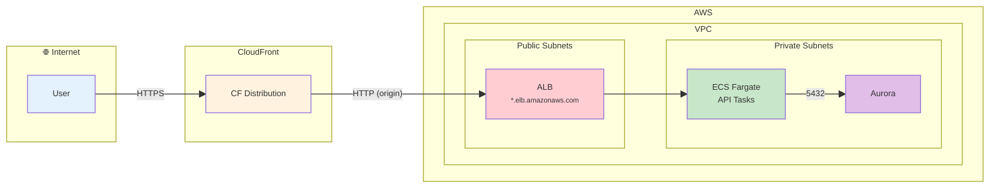
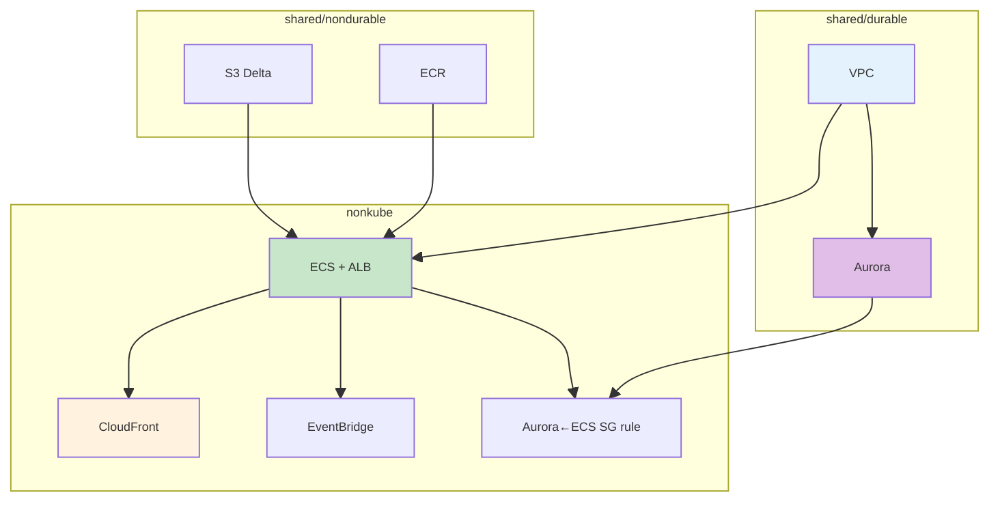
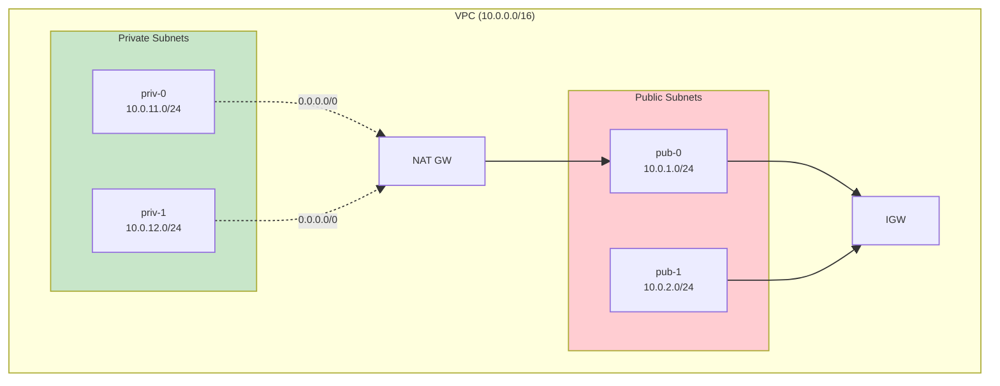
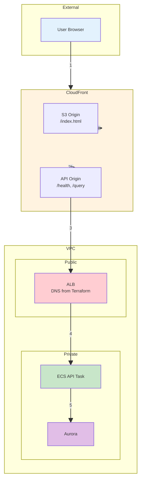
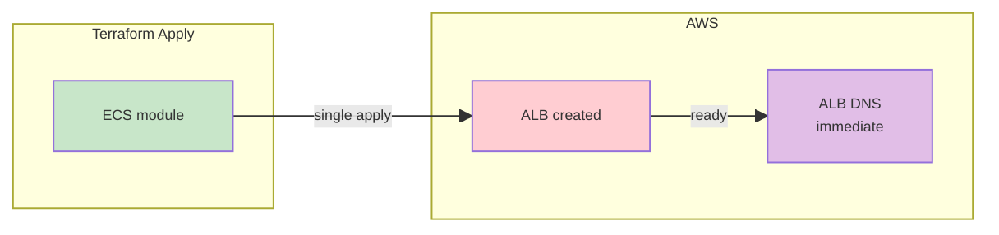
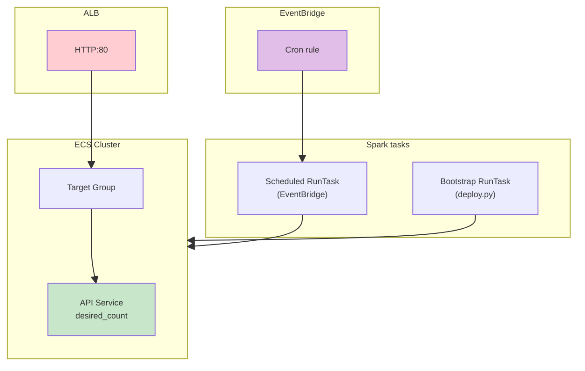

# Full Nonkube Architecture Crash Course

A visual crash course on how **VPC, ALB, CloudFront, ECS Fargate, and Aurora** are wired together to create a fully working nonkube (ECS-based) infrastructure.

**See also:** [FULL_ARCH_KUBE_LEARN.md](FULL_ARCH_KUBE_LEARN.md), [VPC_LEARNED.md](VPC_LEARNED.md), [README_WAR_STORIES.md](../../README_WAR_STORIES.md).

---

## 1. High-Level Request Flow



| Step | Component | Protocol | Purpose |
|------|-----------|----------|---------|
| 1 | User → CloudFront | HTTPS | SSL termination at edge |
| 2 | CloudFront → ALB | HTTP | Origin fetch (ALB listens on 80) |
| 3 | ALB → API tasks | HTTP:80 | Load balance to fru-api containers |
| 4 | API tasks → Aurora | TCP:5432 | DB queries |

---

## 2. Terraform Stack Dependency Order



| Stack | Creates | Depends On |
|-------|---------|------------|
| **shared/durable** | VPC, subnets, NAT, Aurora, DB subnet group | — |
| **shared/nondurable** | ECR, S3 buckets | — |
| **nonkube** | ECS cluster, ALB, API service, EventBridge, CloudFront | durable, nondurable |

---

## 3. VPC & Subnet Layout



| Subnet Type | Used By | Route to Internet |
|-------------|---------|-------------------|
| **Public** | ALB | IGW (direct) |
| **Private** | ECS Fargate tasks (API + Spark), Aurora | NAT GW (outbound only) |

**ALB placement:** ALB is created by Terraform in **public subnets** (`var.public_subnet_ids`). No K8s; DNS is available immediately after apply.

---

## 4. End-to-End Data Path (Detailed)



| # | Path | Notes |
|---|------|-------|
| 1 | User → CloudFront | `https://d123.cloudfront.net` |
| 2a | CF → S3 | Static frontend (index.html, assets) |
| 2b | CF → API origin | `/health`, `/query`, `/analytics` |
| 3 | CF → ALB | `http://fru-dev-alb-xxx.elb.us-east-1.amazonaws.com` |
| 4 | ALB → ECS task | Target group → Fargate task IP |
| 5 | Task → Aurora | PGHOST from task env (Secrets Manager) |

---

## 5. No DNS Propagation Delay (vs Kube)



| Aspect | Nonkube (ECS) | Kube (EKS) |
|--------|---------------|------------|
| **Load balancer** | ALB (Terraform) | NLB (K8s Service) |
| **DNS availability** | Immediate | 1–2 min propagation |
| **CloudFront wiring** | Single apply (alb_dns_name from output) | Two-phase (ingress_hostname null → re-apply) |
| **Extra wait** | None | `wait_for_dns_resolvable` |

---

## 6. File Structure

```
fru-genai-analytics-new/
├── live_deploy_aws/
│   ├── shared/
│   │   ├── durable/          # VPC, Aurora (apply first)
│   │   │   ├── main.tf
│   │   │   └── outputs: vpc_id, private_subnet_ids, aurora_endpoint
│   │   └── nondurable/       # ECR, S3 (apply second)
│   │       ├── main.tf
│   │       └── outputs: ecr_app_url, ecr_spark_url, delta_bucket
│   └── nonkube/              # ECS, ALB, CloudFront (apply third)
│       ├── main.tf
│       └── outputs: alb_dns_name, cloudfront_domain_name, frontend_s3_bucket_id
│
├── infra_modules/
│   └── aws/
│       ├── primitives/
│       │   ├── vpc/          # VPC, subnets, NAT, IGW
│       │   ├── aurora/       # Aurora Serverless v2
│       │   └── cloudfront/   # CF dist, S3 frontend, API origin
│       └── ecs/              # ECS cluster, ALB, API service, Spark schedule
│           ├── main.tf       # ALB, target group, ECS service, EventBridge
│           └── outputs.tf    # alb_dns_name, ecs_cluster_name, spark_task_definition_arn
│
└── tools/aws/
    ├── deploy.py            # run_ecs_bootstrap (one-off Spark task)
    ├── bootstrap_helpers.py  # check_ecs_bootstrap_succeeded
    └── teardown.py          # Pre-destroy: EventBridge, scale to 0, drain tasks
```

---

## 7. Deploy Sequence (Nonkube)

| Phase | Action | Tool / Resource |
|-------|--------|-----------------|
| 1 | Apply shared/durable | `tofu apply` |
| 2 | Apply shared/nondurable | `tofu apply` |
| 3 | Ensure secrets (PGPASSWORD, etc.) | `ensure_secrets.py` |
| 4 | Build & push images | `build_and_push_images.py` |
| 5 | Apply nonkube stack | `tofu apply` (ALB + ECS + CF in one pass) |
| 6 | Deploy frontend to S3, invalidate CF | `deploy_frontend_to_s3` |
| 7 | Run ECS bootstrap (one-off Spark task) | `run_ecs_bootstrap` |

**Bootstrap:** ECS RunTask with Spark image, command override to `run_analytics.py`. Idempotent: skips if `check_ecs_bootstrap_succeeded` finds success pattern in logs.

---

## 8. Teardown Sequence (Nonkube)

| Step | Action | Why |
|------|--------|-----|
| 1 | Disable EventBridge rule | Stop Spark schedule from firing |
| 2 | Remove EventBridge targets | Required before delete |
| 3 | Delete EventBridge rule | Orphan safety if state empty |
| 4 | Scale ECS service to 0 | Stop API tasks |
| 5 | Stop remaining tasks | Drain EventBridge-triggered Spark tasks |
| 6 | Wait for cluster empty | ClusterContainsTasksException otherwise |
| 7 | `tofu destroy` nonkube stack | ECS, ALB, EventBridge, CloudFront |

---

## 9. ECS Components



| Component | Type | Purpose |
|-----------|------|---------|
| **API service** | ECS service | Long-running fru-api containers |
| **ALB + target group** | Application LB | Route HTTP to API tasks |
| **Bootstrap** | ECS RunTask | One-off Spark `run_analytics.py` |
| **Spark schedule** | EventBridge → RunTask | Cron-triggered Spark jobs |

---

## 10. Security Groups

| SG | Source | Target | Port | Purpose |
|----|--------|--------|------|---------|
| ALB SG | 0.0.0.0/0 | ALB | 80 | Internet → ALB |
| ECS tasks SG | ALB SG | Tasks | 5001 | ALB → API containers |
| Aurora SG | ECS tasks SG | Aurora | 5432 | API tasks → DB |

---

## 11. Quick Reference Table

| Concept | Summary |
|--------|---------|
| **VPC** | Same as kube: one VPC; public + private subnets; NAT for private |
| **ALB** | Terraform-created in public subnets; DNS ready immediately |
| **CloudFront** | S3 + API origin; API origin = alb_dns_name from ECS module |
| **ECS** | Fargate tasks in private subnets; API service + RunTask for Spark |
| **Aurora** | Private subnets; ingress from ECS tasks SG only |
| **Bootstrap** | ECS RunTask (Spark run_analytics); idempotent via log check |
| **Spark schedule** | EventBridge cron → ECS RunTask (not ECS service) |

---

## 12. Kube vs Nonkube Comparison

| Aspect | Kube | Nonkube |
|--------|------|---------|
| **Compute** | EKS + nodes + pods | ECS Fargate |
| **Load balancer** | NLB (K8s Service) | ALB (Terraform) |
| **DNS timing** | 1–2 min propagation | Immediate |
| **Bootstrap** | K8s Job | ECS RunTask |
| **Spark schedule** | K8s CronJob | EventBridge → RunTask |
| **Apply phases** | Two (ingress_hostname) | One |
| **Pre-destroy** | Delete LB svc, CronJob, Job, namespace | EventBridge, scale to 0, drain |

---

## 13. Common Pitfalls

| Pitfall | Symptom | Fix |
|---------|---------|-----|
| ClusterContainsTasksException | EKS/ECS destroy fails | Pre-destroy: drain tasks first |
| EventBridge fires during teardown | New Spark tasks block destroy | Disable rule before scale/drain |
| DB password mismatch | /health returns disconnected | `ensure_secrets` + redeploy |
| Bootstrap not idempotent | Re-runs every deploy | `check_ecs_bootstrap_succeeded` skips if done |

---

*Doc: `docs/learned/FULL_ARCH_NONKUBE_LEARN.md`. Related: [FULL_ARCH_KUBE_LEARN.md](FULL_ARCH_KUBE_LEARN.md), [VPC_LEARNED.md](VPC_LEARNED.md), [README_WAR_STORIES.md](../../README_WAR_STORIES.md).*
