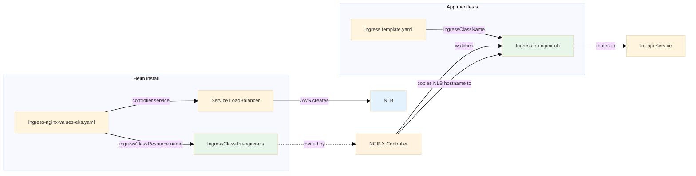

# Kubernetes Ingress & Load Balancer Crash Course

A short, project-anchored guide to Ingress, IngressClass, controllers, and how the LB appears for EKS.

> **Note:** This doc describes an NGINX Ingress–based flow. Our current kube deploy uses `fru-api-svc` (type LoadBalancer) directly, which the in-tree creates as a **Classic ELB**—not NLB. See [KUBE_LOAD_BALANCER_CLARIFICATION.md](../KUBE_LOAD_BALANCER_CLARIFICATION.md).

---

## 1. Objects and What They Do

| Object | What it is | In our project |
|--------|------------|----------------|
| **Service** (type: LoadBalancer) | K8s object that exposes pods. When `type: LoadBalancer`, the **cloud** (e.g. AWS) creates a real load balancer (NLB/ALB) and puts its DNS in the Service’s `.status.loadBalancer.ingress`. | NGINX controller’s Service: `ingress-nginx-controller` in namespace `ingress-nginx`. We set it to `LoadBalancer` + NLB annotations → AWS creates **one NLB**. |
| **Ingress** | K8s object that describes **routing rules** (paths → backend Service). It does **not** create a load balancer by itself. | Our app Ingress: paths `/query`, `/analytics`, `/health`, `/version` → Service `fru-api`. |
| **IngressClass** | K8s object that names a **class** (e.g. `fru-nginx-cls`) and points to the **controller** that implements it (e.g. NGINX). | We use class name `fru-nginx-cls`; the NGINX Helm chart creates this IngressClass and registers itself. |
| **Ingress Controller** | A **process** (running as pods) that watches Ingress and IngressClass resources and configures a **proxy** (e.g. NGINX). It also **fills** Ingress `.status.loadBalancer` with the LB hostname (from its own Service). | NGINX Ingress Controller: installed via Helm; one controller, one NLB; all Ingresses with `ingressClassName: fru-nginx-cls` use it. |

---

## 2. How They Connect (the “link” is the class name)



- **Controller side:** Helm values set `controller.ingressClassResource.name: fru-nginx-cls`. The chart creates an **IngressClass** with that name and the NGINX controller **owns** it.
- **App side:** Ingress template sets `spec.ingressClassName: fru-nginx-cls`. That Ingress is **handled by** the controller that owns the IngressClass `fru-nginx-cls`.
- **No direct reference** between the two YAMLs; the **same string** (`fru-nginx-cls`) is the only link.

---

## 3. Request Path (EKS with CloudFront)

```mermaid
%%{init: {'theme':'base', 'themeVariables': {'fontSize':'11px'}}}%%
sequenceDiagram
  participant U as User
  participant CF as CloudFront
  participant NLB as NLB
  participant NGINX as NGINX Controller
  participant ING as App Ingress
  participant SVC as fru-api Service
  participant P as Pods

  U->>CF: HTTPS /query
  CF->>NLB: HTTP (origin)
  NLB->>NGINX: HTTP
  NGINX->>ING: match path /query
  ING->>SVC: route to fru-api:80
  SVC->>P: to backend pods
  P-->>U: response
  style NLB fill:#e3f2fd
  style NGINX fill:#fff3e0
  style ING fill:#e8f5e9
```

- **NLB** is created by AWS for the NGINX controller’s **Service** (type LoadBalancer).
- **NGINX** is the only thing that receives traffic from the NLB; it uses **Ingress** rules to send requests to the right Service (e.g. `fru-api`).

---

## 4. Where Things Are Defined (our repo)

| What | Where |
|------|--------|
| Controller class name | `module_infra_kubetypes/kube/common/ingress-nginx-values-eks.yaml` (and `-local.yaml`): `controller.ingressClassResource.name: fru-nginx-cls` |
| App Ingress class | `module_infra_kubetypes/kube/common/templates/ingress.template.yaml`: `spec.ingressClassName: fru-nginx-cls` |
| Controller install | `module_infra_kubetypes/kube/aws/helpers/install-ingress-nginx-eks.sh` (Helm with EKS values) |
| App Ingress apply | Generated from template → `generated/ingress-generated.yaml`; applied by `apply_kubernetes_manifests()` in deploy flow |

---

## 5. One Controller, One NLB

- We install **one** NGINX Ingress Controller; it has **one** LoadBalancer Service → **one** NLB.
- **All** Ingresses with `ingressClassName: fru-nginx-cls` are satisfied by that controller and share that NLB.
- For a given class name, there should be **one** controller; otherwise behavior is undefined.

---

## 6. Order of Operations (EKS deploy)

1. **Install NGINX** (Helm + `ingress-nginx-values-eks.yaml`) → controller runs, its Service gets NLB, IngressClass `fru-nginx-cls` exists.
2. **Apply app manifests** (including generated Ingress) → Ingress has `ingressClassName: fru-nginx-cls`; NGINX adopts it and copies NLB hostname to Ingress `.status`.
3. **Update CloudFront** (script reads Ingress `.status.loadBalancer.ingress[0].hostname`) → origin set to NLB DNS.

The app Ingress does **not** reference the NLB directly; the **controller** fills `.status` after it adopts the Ingress.

---

## 7. Troubleshooting: ErrImagePull / ImagePullBackOff

If the fru-api deployment shows `ErrImagePull` or `ImagePullBackOff`, the nodes cannot pull the image from ECR.

**Common cause:** The deployment image tag was **never pushed** to ECR. This happens if you re-run deploy with `--skip-build` after a failure: the script generates a **new** tag (timestamp-based), so the deployment points to a tag that doesn’t exist in ECR.

**Verify:**
- `kubectl describe pod -n fru-api-dev -l app=fru-api` — see exact pull error.
- `aws ecr list-images --repository-name fru-api --region us-east-1 --profile admin` — list tags in ECR.

**Fix:**
- **Option A:** Run full deploy (no `--skip-build`) so the same tag is built, pushed, and applied.
- **Option B:** With `--skip-build`, the script now defaults to `IMAGE_TAG=latest` (build-push-ecr pushes both the git tag and `latest`). If you see ErrImagePull, ensure a full deploy has run at least once so `latest` exists in ECR, or set `IMAGE_TAG=<existing-tag>` (or `CONTAINER_IMAGE`) before running deploy with `--skip-build`.
