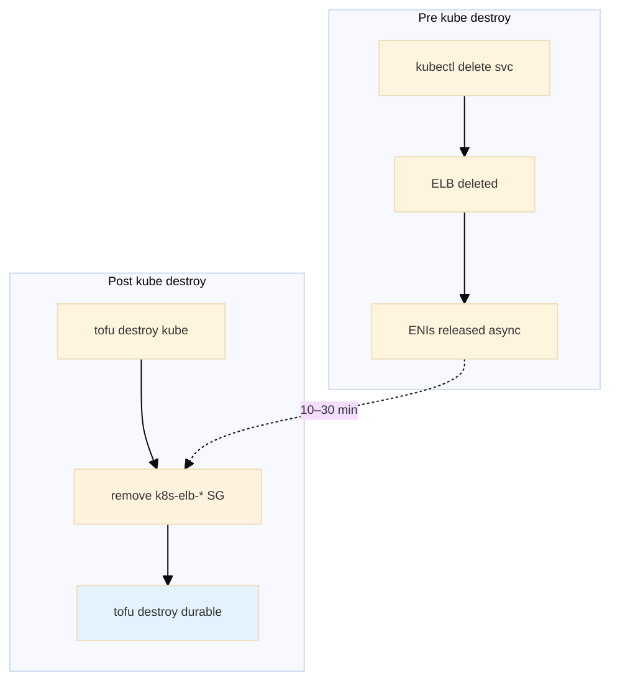
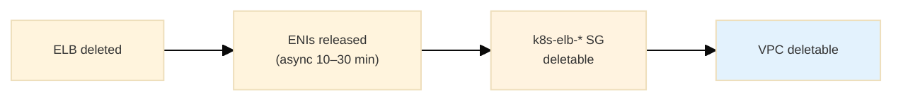
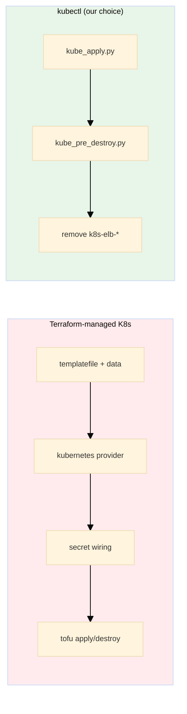
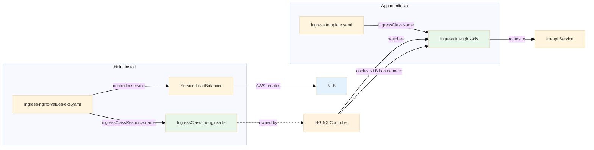
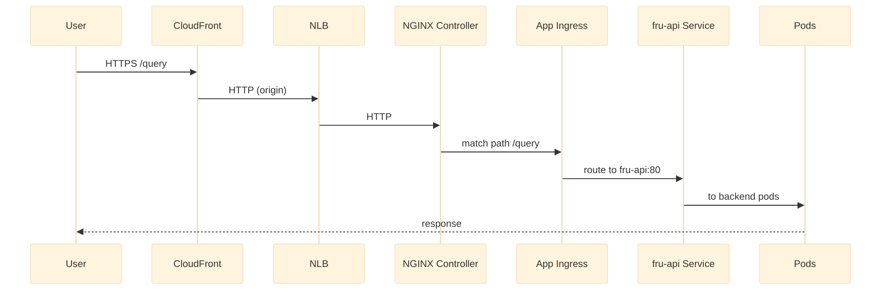

# Kubernetes Ingress & Load Balancer Crash Course

A short, project-anchored guide to Ingress, IngressClass, controllers, and how the LB appears for EKS.

> **Note:** This doc describes both (1) our **current** kube deploy using `fru-api-svc` (type LoadBalancer) directly, and (2) an NGINX Ingress–based flow for reference.

---

## 0. Kube Load Balancer Choice: Classic ELB vs NLB (Project Reality)

Our kube API is exposed via `fru-api-svc` (type LoadBalancer), **not** NGINX Ingress. We support two load balancer tracks, selected by the `--elb` flag at deploy time.

### 0.1 The Two Tracks

| Track | Flag | Manifest | Who creates LB | LB type |
|-------|------|----------|----------------|---------|
| **NLB** (default) | *no* `--elb` | `api-service.yaml` | AWS Load Balancer Controller | Network Load Balancer |
| **Classic ELB** | `--elb` | `api-service-elb.yaml` | In-tree cloud provider | Classic ELB (legacy) |

#### What NLB and Classic ELB Are

- **Classic ELB** — AWS’s original load balancer (pre-2016). Layer 4/7, one product for TCP/HTTP/HTTPS. Still supported but legacy. Creates `k8s-elb-{hex}` security groups. DNS: `*.elb.amazonaws.com`.
- **NLB (Network Load Balancer)** — Newer AWS LB (2017+). Layer 4 only, lower latency, higher throughput, static IPs, better for TCP. Also uses `*.elb.amazonaws.com` DNS. Preferred for API traffic.

#### What “In-Tree” vs “Out-of-Tree” Means

When you create a Kubernetes Service with `type: LoadBalancer`, *something* must call AWS APIs to create the real load balancer. There are two possible reconcilers:

| Reconciler | Where it lives | What it creates |
|------------|----------------|-----------------|
| **In-tree cloud provider** | Code inside the main Kubernetes repo (`kube-controller-manager`). Built-in, always present on EKS. | Classic ELB + `k8s-elb-*` security groups |
| **AWS Load Balancer Controller** (out-of-tree) | Separate controller running as pods in the cluster. Installed via Helm. | NLB, ALB (depending on annotations) |

- **In-tree** = “in the Kubernetes tree” — part of core K8s.
- **Out-of-tree** = “outside the tree” — a separate project that watches K8s resources and talks to AWS.

#### How the Annotations Wire Things Together

The annotations on the Service decide:

1. **Which reconciler handles the Service** — This is the main wiring.
2. **How the LB is configured** — Scheme, target type, etc.

| Annotation | Meaning for wiring |
|------------|--------------------|
| `service.beta.kubernetes.io/aws-load-balancer-type: external` | **Hand this Service to the AWS Load Balancer Controller.** The in-tree provider *ignores* Services with this annotation. Without it, the in-tree handles the Service and creates a Classic ELB. |
| `service.beta.kubernetes.io/aws-load-balancer-scheme: internet-facing` | LB is reachable from the internet (vs `internal` for private subnets). CloudFront must reach the API origin from the internet. |
| `service.beta.kubernetes.io/aws-load-balancer-nlb-target-type: instance` | (NLB only.) Route traffic to node IPs (instance mode) vs pod IPs (ip mode). We use `instance` for compatibility. |

**The critical wiring:** `aws-load-balancer-type: external` is the switch. Present → AWS Load Balancer Controller reconciles → NLB. Absent → in-tree reconciles → Classic ELB.

**Setup requirements:**

- **Classic ELB track:** No extra setup. The in-tree provider is built into EKS. Apply `api-service-elb.yaml` and the LB appears.
- **NLB track:** The AWS Load Balancer Controller must be installed in the cluster first (Phase 9.5). Without it, a Service with `aws-load-balancer-type: external` would have no reconciler and would stay in `Pending`.

### 0.2 How the Choice Flows Through Deploy

```
deploy.py --scope kube [--elb]
    │
    ├── doctor.py [--elb]  →  NLB track: requires eksctl, helm (for controller install)
    │
    └── deploy_kube.py
            │
            ├── Phase 9.5: Install AWS Load Balancer Controller  (skipped when --elb)
            │
            └── kube_apply.py [--elb]
                    │
                    └── api_svc_manifest = "api-service-elb.yaml" if args.elb else "api-service.yaml"
```

- **With `--elb`:** Uses `api-service-elb.yaml`. No `aws-load-balancer-type: external` → in-tree cloud provider reconciles it → creates **Classic ELB**. No controller install needed.
- **Without `--elb`:** Uses `api-service.yaml`. Has `aws-load-balancer-type: external` → AWS Load Balancer Controller reconciles it → creates **NLB**. Phase 9.5 installs the controller before kube_apply.

### 0.3 Manifest Differences

**`api-service.yaml` (NLB track):**
```yaml
annotations:
  service.beta.kubernetes.io/aws-load-balancer-scheme: internet-facing
  service.beta.kubernetes.io/aws-load-balancer-type: external
  service.beta.kubernetes.io/aws-load-balancer-nlb-target-type: instance
```

**`api-service-elb.yaml` (Classic ELB track):**
```yaml
annotations:
  service.beta.kubernetes.io/aws-load-balancer-scheme: internet-facing
# No aws-load-balancer-type → in-tree creates Classic ELB
```

### 0.4 When to Use Each

| Use case | Track |
|----------|-------|
| **Default, recommended** | NLB (no `--elb`) — modern, better performance, controller installed automatically |
| **Fallback / pre-migration** | Classic ELB (`--elb`) — no eksctl/helm, in-tree only; reverts to pre-migration behavior |
| **Orphan cleanup after migration** | After switching to NLB, old Classic ELBs + `k8s-elb-*` SGs become orphans; run `remove_for_orphans_data.py` |

### 0.5 Key Files

| File | Purpose |
|------|---------|
| `infra_terraform/modules/cloud_shared/k8s/api-service.yaml` | NLB manifest (default) |
| `infra_terraform/modules/cloud_shared/k8s/api-service-elb.yaml` | Classic ELB manifest (used with `--elb`) |
| `tools/aws/kube/kube_apply.py` | Apply: selects manifest, applies via kubectl |
| `tools/aws/kube/kube_pre_destroy.py` | Teardown: kubectl delete (mirrors kube_apply) |
| `tools/aws/kube/deploy_kube.py` | Phase 9.5: installs AWS Load Balancer Controller when not `--elb` |
| `tools/aws/kube/install_aws_load_balancer_controller.py` | Python script that installs the controller (eksctl IAM, helm chart) |

**NLB controller install:** Runs automatically during deploy (Phase 9.5) when not using `--elb`. Implemented 2026-02.

### 0.6 NLB Migration Steps (Classic ELB → NLB)

1. **Deploy kube (NLB track):** `python tools/aws/deploy.py --scope kube --env dev` — controller installs automatically.
2. **Verify:** `python tools/aws/scope_shared/verify/verify_all_deploy.py --scope kube --env dev`
3. **Orphan scan:** `PYTHONPATH=$(pwd) python tools/aws/standalone/temp_one_off/resources_scan/scan_aws_remaining.py --cloud-regions us-east-1 --env dev --prefix fru` (omit `--elb` for NLB track)
4. **Orphan removal:** Dry-run then `remove_for_orphans_data.py` for Classic ELBs and `k8s-elb-*` SGs
5. **Re-verify:** Same verify command

### 0.7 VPC Teardown: k8s-elb-* SG and Dependency Order (Classic ELB Track)

When using Classic ELB (`api-service-elb.yaml`), teardown must remove the `k8s-elb-*` security group **after** kube destroy and **before** durable (VPC) destroy. Otherwise the VPC stays stuck in "Still destroying."

| Resource | Who creates | When deleted | Blocks |
|---------|------------|--------------|--------|
| Classic ELB | In-tree (when Service applied) | `kubectl delete svc fru-api-svc` | — |
| `k8s-elb-{hex}` SG | In-tree (with ELB) | **Not** auto-deleted when ELB gone | VPC delete |
| ENIs (from ELB) | AWS | Async release 10–30 min after ELB delete | SG delete until released |



**Teardown order (built-in):**

1. **Pre kube:** `k8s_pre_destroy_cleanup` → kubectl delete svc, cronjob, job, namespace
2. **Destroy kube:** `tofu destroy` kube stack (EKS cluster gone)
3. **Post kube, pre durable:** `remove_orphaned_k8s_elb_security_groups` → delete `k8s-elb-*` SGs (retries on DependencyViolation until ENIs released)
4. **Destroy durable:** `tofu destroy` durable (VPC, Aurora, etc.)

**Key insight:** The `k8s-elb-*` SG is orphaned when the ELB is deleted—in-tree does not remove it. **It has to be gone before we can destroy the VPC (durable stack).**

#### VPC Dependency Order (Why Order Matters)

VPC and its resources form a strict dependency graph. Deleting in the wrong order leaves downstream resources referencing upstream ones; AWS refuses to delete. The `k8s-elb-*` SG lives in the VPC and blocks VPC deletion until removed.



**Safe order:** LB delete → ENIs released (async 10–30 min) → SG delete → VPC delete. The `k8s-elb-*` SG cannot be deleted until ENIs from the ELB are released. See War Stories 6 (VPC dependency order), 7 (ELB ENI eventual consistency).

| File | Purpose |
|------|---------|
| `tools/aws/kube/kube_pre_destroy.py` | Pre-destroy: kubectl delete (mirrors kube_apply.py) |
| `tools/aws/kube/teardown_orphan_cleanup.py` | `remove_orphaned_k8s_elb_security_groups` (post kube) |
| `tools/aws/teardown.py` | Orchestrates order: pre → destroy → post kube → destroy durable |

### 0.8 Lifecycle Management: Terraform vs kubectl

We could let Terraform manage the K8s resources (Namespace, Deployment, Service, CronJob, Job) via the `kubernetes` provider—or we can keep kubectl for apply/delete. This section documents the trade-off and why we chose kubectl.

#### What Terraform Would Involve

| Aspect | Terraform kubernetes provider | Complexity |
|--------|-------------------------------|------------|
| **Templating** | `kube_apply.py` injects ECR URLs, secret ARNs, PGHOST, etc. Terraform would need `templatefile()` and data sources; more wiring. | High |
| **Provider config** | `kubernetes` provider needs cluster endpoint, CA cert, token from EKS. Brittle during first apply (cluster bootstrap). | Medium |
| **Secret handling** | Bootstrap needs DB/OpenAI secrets from AWS Secrets Manager. Terraform would need `kubernetes_secret` + `aws_secretsmanager_get_secret_value`. | Medium |
| **Migration** | Existing clusters have resources created by kubectl; would need `terraform import` or clean redeploy. | High |
| **Iteration** | Changing a Deployment means `tofu apply` instead of `kubectl apply -f`; heavier for K8s-only tweaks. | Low |

**Pros of Terraform:** Single source of truth, no pre-destroy, declarative, proper dependency ordering, idempotent teardown.

**Cons:** The above complexity, plus Terraform would drive kubectl-equivalent API calls with more plan/apply cycles and state bloat. It duplicates what the platform already does—apply a Service and the cloud controller creates the LB.

#### What kubectl Involves (Our Choice)

| Aspect | kubectl apply / pre-destroy | Caveat |
|--------|-----------------------------|--------|
| **Apply** | `kube_apply.py` runs `kubectl apply` with templated manifests. Simple, fast. | — |
| **Teardown** | `kube_pre_destroy.py` runs `kubectl delete` before tofu destroy. | Must run before cluster destroy; cluster must be reachable. |
| **In-tree Classic ELB** | `kubectl delete svc` removes the LB. | **`k8s-elb-*` SG is orphaned**—in-tree does not delete it. Must remove post kube, pre durable. See 0.7. |
| **NLB track** | No extra SG; AWS Load Balancer Controller cleans up. | — |



#### Summary

| Approach | Pros | Cons |
|----------|------|------|
| **Terraform kubernetes provider** | Single source of truth, no pre-destroy, declarative | Templating, provider config, secret wiring, migration, slower iteration |
| **kubectl + pre/post-destroy** | Simpler, faster iteration, platform-native | Pre-destroy required; **in-tree ELB: must remove k8s-elb-* SG** post kube, pre durable |

We kept kubectl. The cons of Terraform outweighed the pros. The one caveat: when using in-tree Classic ELB, we must explicitly remove `k8s-elb-*` SGs after kube destroy and before durable—otherwise the VPC stays stuck. See [Section 0.7](#07-vpc-teardown-k8s-elb-sg-and-dependency-order-classic-elb-track) and War Stories 6, 7, 40, 41.

---

## 1. Objects and What They Do

> **Our API:** We use `fru-api-svc` (type LoadBalancer) directly—no Ingress. See **Section 0** for the Classic ELB vs NLB choice. The table below describes the NGINX Ingress flow for reference.

| Object | What it is | In our project |
|--------|------------|----------------|
| **Service** (type: LoadBalancer) | K8s object that exposes pods. When `type: LoadBalancer`, the **cloud** (e.g. AWS) creates a real load balancer (NLB/ALB/Classic ELB) and puts its DNS in the Service’s `.status.loadBalancer.ingress`. | **API:** `fru-api-svc` in `fru-kube` (see Section 0). **NGINX flow:** `ingress-nginx-controller` Service → NLB. |
| **Ingress** | K8s object that describes **routing rules** (paths → backend Service). It does **not** create a load balancer by itself. | Our app Ingress: paths `/query`, `/analytics`, `/health`, `/version` → Service `fru-api`. |
| **IngressClass** | K8s object that names a **class** (e.g. `fru-nginx-cls`) and points to the **controller** that implements it (e.g. NGINX). | We use class name `fru-nginx-cls`; the NGINX Helm chart creates this IngressClass and registers itself. |
| **Ingress Controller** | A **process** (running as pods) that watches Ingress and IngressClass resources and configures a **proxy** (e.g. NGINX). It also **fills** Ingress `.status.loadBalancer` with the LB hostname (from its own Service). | NGINX Ingress Controller: installed via Helm; one controller, one NLB; all Ingresses with `ingressClassName: fru-nginx-cls` use it. |

---

## 2. How They Connect (the “link” is the class name)



- **Controller side:** Helm values set `controller.ingressClassResource.name: fru-nginx-cls`. The chart creates an **IngressClass** with that name and the NGINX controller **owns** it.
- **App side:** Ingress template sets `spec.ingressClassName: fru-nginx-cls`. That Ingress is **handled by** the controller that owns the IngressClass `fru-nginx-cls`.
- **No direct reference** between the two YAMLs; the **same string** (`fru-nginx-cls`) is the only link.

---

## 3. Request Path (EKS with CloudFront)



- **NLB** is created by AWS for the NGINX controller’s **Service** (type LoadBalancer).
- **NGINX** is the only thing that receives traffic from the NLB; it uses **Ingress** rules to send requests to the right Service (e.g. `fru-api`).

---

## 4. Where Things Are Defined (our repo)

| What | Where |
|------|--------|
| Controller class name | `module_infra_kubetypes/kube/common/ingress-nginx-values-eks.yaml` (and `-local.yaml`): `controller.ingressClassResource.name: fru-nginx-cls` |
| App Ingress class | `module_infra_kubetypes/kube/common/templates/ingress.template.yaml`: `spec.ingressClassName: fru-nginx-cls` |
| Controller install | `module_infra_kubetypes/kube/aws/helpers/install-ingress-nginx-eks.sh` (Helm with EKS values) |
| App Ingress apply | Generated from template → `generated/ingress-generated.yaml`; applied by `apply_kubernetes_manifests()` in deploy flow |

---

## 5. One Controller, One NLB

- We install **one** NGINX Ingress Controller; it has **one** LoadBalancer Service → **one** NLB.
- **All** Ingresses with `ingressClassName: fru-nginx-cls` are satisfied by that controller and share that NLB.
- For a given class name, there should be **one** controller; otherwise behavior is undefined.

---

## 6. Order of Operations (EKS deploy)

1. **Install NGINX** (Helm + `ingress-nginx-values-eks.yaml`) → controller runs, its Service gets NLB, IngressClass `fru-nginx-cls` exists.
2. **Apply app manifests** (including generated Ingress) → Ingress has `ingressClassName: fru-nginx-cls`; NGINX adopts it and copies NLB hostname to Ingress `.status`.
3. **Update CloudFront** (script reads Ingress `.status.loadBalancer.ingress[0].hostname`) → origin set to NLB DNS.

The app Ingress does **not** reference the NLB directly; the **controller** fills `.status` after it adopts the Ingress.

---

## 7. Troubleshooting: ErrImagePull / ImagePullBackOff

If the fru-api deployment shows `ErrImagePull` or `ImagePullBackOff`, the nodes cannot pull the image from ECR.

**Common cause:** The deployment image tag was **never pushed** to ECR. This happens if you re-run deploy with `--skip-build` after a failure: the script generates a **new** tag (timestamp-based), so the deployment points to a tag that doesn’t exist in ECR.

**Verify:**
- `kubectl describe pod -n fru-api-dev -l app=fru-api` — see exact pull error.
- `aws ecr list-images --repository-name fru-api --region us-east-1 --profile admin` — list tags in ECR.

**Fix:**
- **Option A:** Run full deploy (no `--skip-build`) so the same tag is built, pushed, and applied.
- **Option B:** With `--skip-build`, the script now defaults to `IMAGE_TAG=latest` (build-push-ecr pushes both the git tag and `latest`). If you see ErrImagePull, ensure a full deploy has run at least once so `latest` exists in ECR, or set `IMAGE_TAG=<existing-tag>` (or `CONTAINER_IMAGE`) before running deploy with `--skip-build`.
