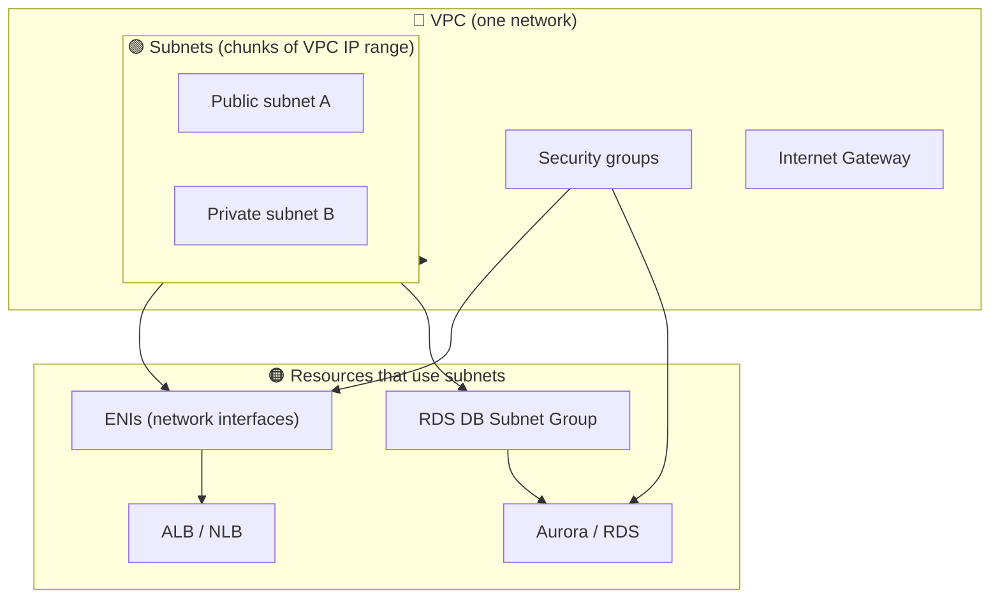
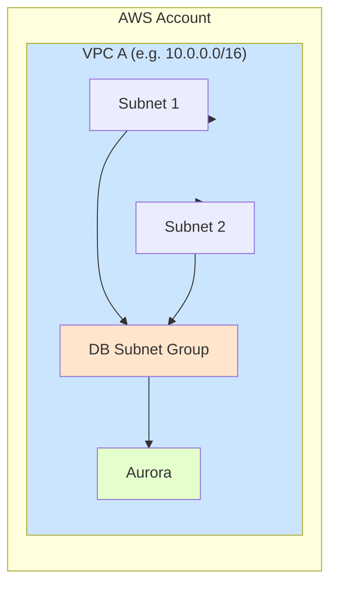
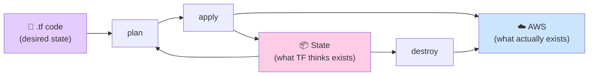
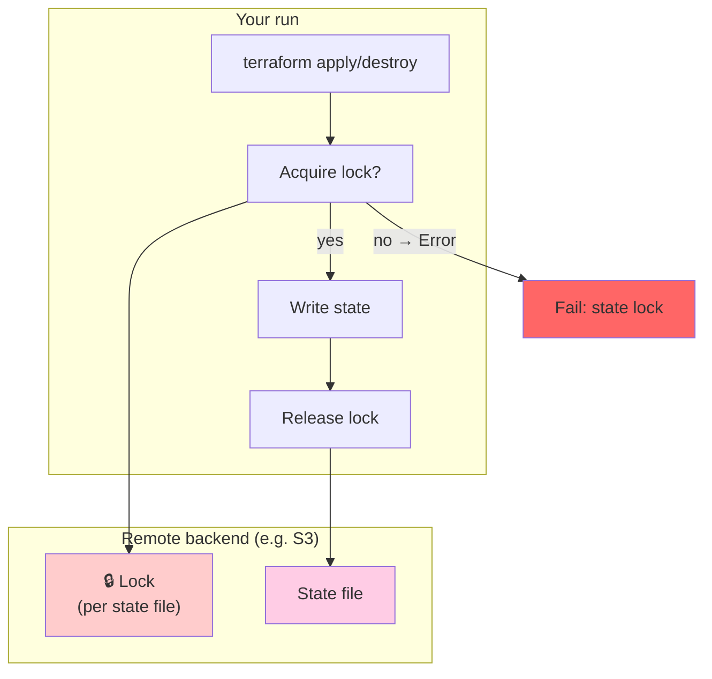
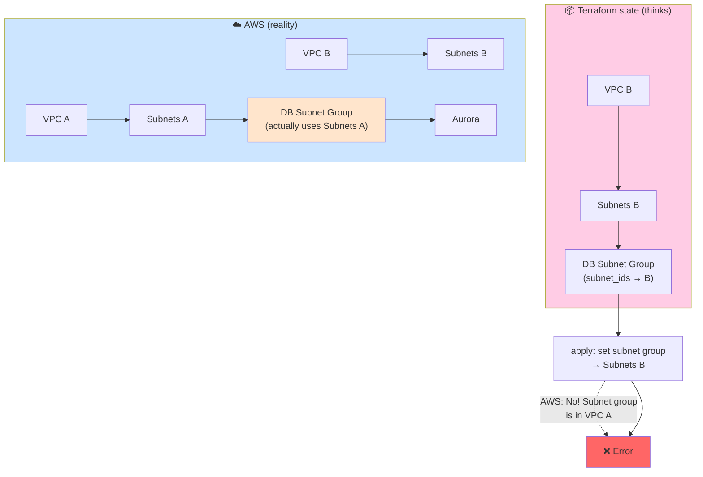
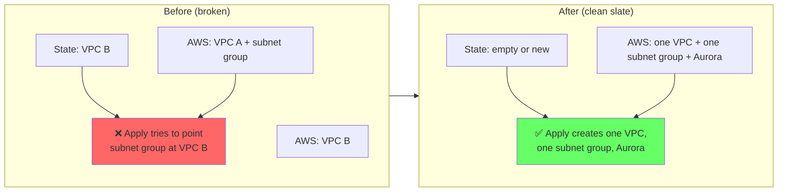

# VPC & Terraform Crash Course (Dummy-Style)

A short, visual crash course that bridges two gaps: **cloud (AWS VPC)** and **Terraform/Terragrunt (state, locks, plan/apply/destroy)**. Ends with how our **RDS subnet group / VPC mismatch** ties them together.

**Context:** Useful for AWS Certified ML Engineer – Associate and Google Professional ML Engineer (concepts transfer to GCP VPC + Terraform).

**See also:** [TERRA_LEARNED.md](terra/TERRA_LEARNED.md) (Terraform layers), [war_stories/WAR_STORIES_AWS.md](../../war_stories/WAR_STORIES_AWS.md).

---

## Part 1: AWS VPC — The Cloud Side

### 1.1 What is a VPC?

A **VPC (Virtual Private Cloud)** is your own isolated slice of the AWS (or GCP) network. Nothing in another customer's VPC can talk to yours unless you explicitly allow it (peering, etc.).

- **One VPC** = one logical network (IP range, e.g. `10.0.0.0/16`).
- **Region-scoped:** Each VPC lives in one region; you can have multiple VPCs per region per account.

### 1.2 VPC → Subnets → Resources (Dependency Order)

Resources live **inside** a VPC. Many of them live in **subnets**, which are chunks of the VPC's IP range (e.g. `10.0.1.0/24`, `10.0.2.0/24`). Subnets are often split into **public** (internet-facing) and **private** (no direct internet; e.g. DBs, app servers).

**Rule:** A subnet belongs to **exactly one VPC**. A resource (RDS, EKS, ENI) that uses subnets must use subnets from **the same VPC**. You cannot "move" a DB subnet group to another VPC by changing its subnet IDs.

Dependency order (who depends on whom) looks like this:

**Takeaway:**  
VPC → Subnets → things that live in subnets (ENIs, **DB subnet group**, etc.) → higher-level resources (ALB, **RDS/Aurora**). RDS needs a **DB subnet group**; that group can only list subnets from **one VPC**. So: one VPC → one set of subnets → one DB subnet group → one Aurora cluster, all tied together.

### 1.3 Why Teardown Order Matters

You can't delete a VPC while something still depends on it (subnets, ENIs, security groups, etc.). So **teardown order** is the reverse of creation:

1. Delete resources that use subnets (Aurora, then DB subnet group; ALBs; EKS; etc.).
2. Release ENIs (often after ALB/EKS deletion; AWS may take 10–30 min — see [War Story 6: ELB ENIs](../../war_stories/WAR_STORIES_AWS.md#6-elb-deletion-and-enis-eventual-consistency-not-a-bug)).
3. Delete VPC endpoints, then subnets, then security groups, then the VPC.

See [War Story 5: VPC teardown dependency order](../../war_stories/WAR_STORIES_AWS.md#5-vpc-teardown-dependency-order-enis-and-vpc-endpoints) for the full graph and script order.

### 1.4 One Picture: "Healthy" Single-VPC Setup

All in one VPC → no mismatch.

---

## Part 2: Terraform & Terragrunt — The IaC Side

### 2.1 Plan, Apply, Destroy (One-Way Flow)

Terraform manages **desired state** in code (`.tf` files). It compares that to **actual state** and makes AWS match the code.

| Command   | What it does |
|----------|----------------|
| **plan** | "What would change?" — reads state + code, prints diff. Does **not** change AWS or state. |
| **apply** | "Make it so." — runs plan, then applies changes to AWS and **writes new state**. |
| **destroy** | "Delete everything in state." — removes resources in AWS and **removes them from state**. |

**Takeaway:**  
State is Terraform's **memory** of what it created. If state and AWS get out of sync (e.g. something deleted outside Terraform, or a new VPC created with different state), the next plan/apply can do surprising things (e.g. try to "update" a resource that actually lives in another VPC).

### 2.2 Where State Lives (Remote + Lock)

State is usually stored **remotely** (e.g. S3 bucket) so the team shares one source of truth. Terragrunt configures this (e.g. `remote_state` in `root.hcl`).

**Problem:** Two people (or two runs) must not write state at the same time. So Terraform uses a **lock**:

1. Before **apply** or **destroy**, Terraform tries to **acquire a lock** on the state (e.g. in S3/DynamoDB).
2. If someone else holds the lock (or a previous run crashed and never released it), you get **"Error acquiring the state lock"**.
3. You must **force-unlock** (after confirming no other run is active) or wait for the lock to expire.

**Recovery:**  
`terragrunt force-unlock <LOCK_ID>` (and type `yes`, or `echo yes | terragrunt force-unlock <LOCK_ID>`). See [War Story 7: State lock and fail-fast](../../war_stories/WAR_STORIES_CLOUD_SHARED.md#7-preempt-teardown-state-lock-failure-and-teardown-reporting-success-on-failure).

### 2.3 Terragrunt in One Sentence

**Terragrunt** wraps Terraform: it keeps **per-layer** config (e.g. `dev/eks`, `dev/infrastructure`), pulls shared config (backend, account ID), and runs `terraform` in the right order. So "teardown EKS" = run `terragrunt destroy` in the EKS layer directory; state and lock are **per layer** (one state file per layer). See [TERRA_LEARNED.md](terra/TERRA_LEARNED.md) for what a "layer" is.

---

## Part 3: The Mismatch — Tying VPC and Terraform Together

### 3.1 What Went Wrong (Two VPCs, One Subnet Group)

In code, **one** Terraform module creates: VPC → subnets → DB subnet group → Aurora. So in a single apply, everything is in one VPC. The mismatch happens when **reality** and **state** diverge:

1. **Past:** A run created **VPC A** and the **DB subnet group** (using VPC A's subnets) and Aurora. State recorded: "I own VPC A, these subnets, this subnet group, this Aurora."
2. **Later:** State was lost or a different state was used (e.g. new state bucket, or state reset). Terraform ran again and created **VPC B** and **new subnets**.
3. **Now:** In AWS you still have the **old DB subnet group** (and maybe Aurora) tied to **VPC A**. In **state** Terraform thinks it owns **VPC B** and subnets in VPC B.
4. **Apply:** Terraform tries to **update** the DB subnet group (same resource name in state) to use **VPC B's subnets**. AWS says: "The new subnets are not in the same VPC as the existing subnet group." **Error.**

So: **cloud rule** (subnet group must stay in one VPC) + **Terraform behavior** (update resource from state using new subnet IDs) = error when state points at a different VPC than the one the live resource uses.

### 3.2 How We Fix It (Align State and Reality)

- **Option A — Clean slate:** Tear down **everything** Terraform manages for that env (including **shared** infra: VPC, Aurora, DB subnet group), then apply again. That removes the old subnet group and creates one new VPC + new subnet group + new Aurora. So state and AWS match again. (Our preempt now uses `--container-type all` so shared is destroyed too; see [War Story 16](../../war_stories/WAR_STORIES_AWS.md#10-phase-2-infrastructure-rds-subnet-group-vpc-mismatch).)
- **Option B — Import:** If you want to **keep** the existing VPC/subnet group in AWS, import them into Terraform state so Terraform "owns" that VPC and those subnets; then it won't try to create a second VPC or change the subnet group to another VPC.

### 3.3 One Diagram: Before vs After Fix (Clean Slate)

---

## Part 4: Multi-Stack Tag Management (Durable vs Kube)

### 4.1 Two Stacks, One Resource

**Durable** owns VPC and subnets. **Kube** needs public subnets tagged with `kubernetes.io/role/elb=1` and `kubernetes.io/cluster/<name>=shared` so load balancers (Classic or NLB) can be placed in public subnets. Kube adds these tags via `aws_ec2_tag`—a separate resource that tags an existing resource by ID. Kube does **not** own the subnets; it only manages the tags.

### 4.2 Tag Drift and lifecycle ignore_changes

Without coordination, Durable's apply would **remove** kube's tags (Terraform sees "extra" tags in AWS and plans to match desired state). Kube's apply would then **re-add** them. Fix: add `lifecycle { ignore_changes = [tags] }` to subnet resources in the VPC module ([War Story 58](../../war_stories/WAR_STORIES_AWS.md#35-vpc-subnet-tag-drift-durable-vs-kube-and-lifecycle-ignore_changes)).

**Deep dive:** [TERRA_STACK_OWNERSHIP_AND_SHARED_RESOURCES.md](terra/TERRA_STACK_OWNERSHIP_AND_SHARED_RESOURCES.md).

---

## Quick Reference

| Topic | Idea |
|-------|------|
| **VPC** | Isolated network; subnets are chunks of it; resources (e.g. RDS subnet group) must use subnets from **one** VPC. |
| **Teardown order** | Reverse of creation: delete DB/subnet group, ENIs, then subnets/VPC; ENIs can lag after ALB/EKS delete ([War Story 5](../../war_stories/WAR_STORIES_AWS.md#5-vpc-teardown-dependency-order-enis-and-vpc-endpoints), [6](../../war_stories/WAR_STORIES_AWS.md#6-elb-deletion-and-enis-eventual-consistency-not-a-bug)). |
| **State** | Terraform's list of what it manages; stored remotely (e.g. S3); must stay in sync with AWS. |
| **Lock** | Prevents two applies/destroys from writing state at once; stale lock → "Error acquiring the state lock" → `force-unlock <ID>` ([War Story 7](../../war_stories/WAR_STORIES_CLOUD_SHARED.md#7-preempt-teardown-state-lock-failure-and-teardown-reporting-success-on-failure)). |
| **Mismatch** | State says "VPC B"; live DB subnet group is in VPC A → apply fails. Fix: align state and reality (full teardown or import) ([War Story 16](../../war_stories/WAR_STORIES_AWS.md#10-phase-2-infrastructure-rds-subnet-group-vpc-mismatch)). |
| **Multi-stack tags** | Durable owns subnets; kube adds `kubernetes.io/*` tags via `aws_ec2_tag`. Use `lifecycle { ignore_changes = [tags] }` on subnets to avoid drift ([War Story 58](../../war_stories/WAR_STORIES_AWS.md#35-vpc-subnet-tag-drift-durable-vs-kube-and-lifecycle-ignore_changes)). |

---

*This doc: `docs/learned/VPC_LEARNED.md`. Layers: [TERRA_LEARNED.md](terra/TERRA_LEARNED.md). Stack ownership: [TERRA_STACK_OWNERSHIP_AND_SHARED_RESOURCES.md](terra/TERRA_STACK_OWNERSHIP_AND_SHARED_RESOURCES.md). War stories: [war_stories/WAR_STORIES_AWS.md](../../war_stories/WAR_STORIES_AWS.md).*
