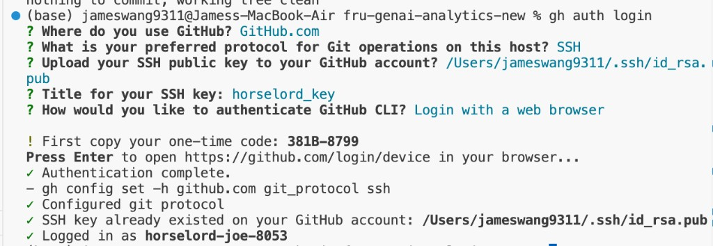
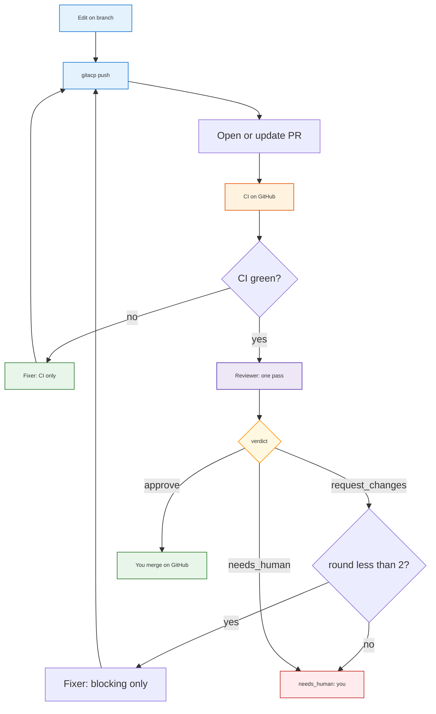
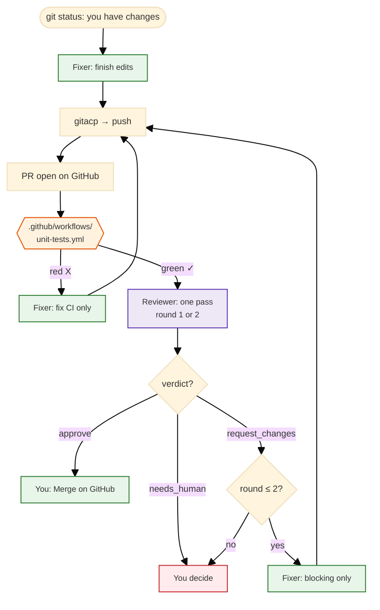
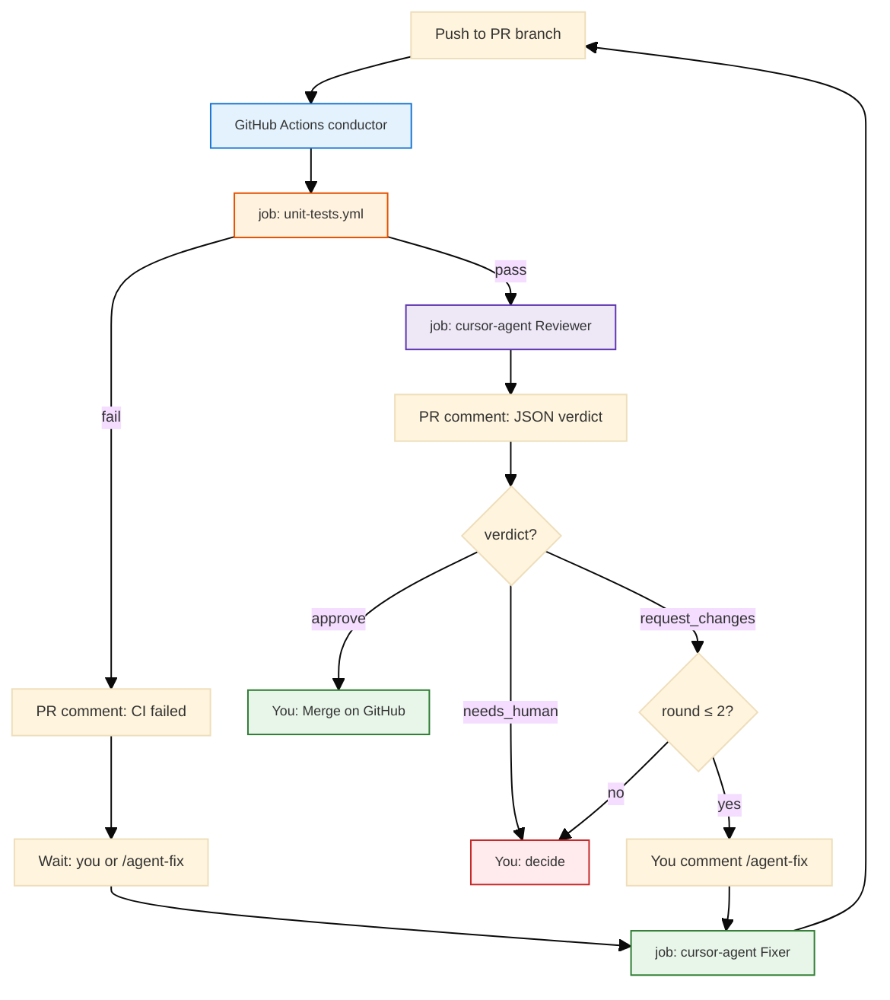
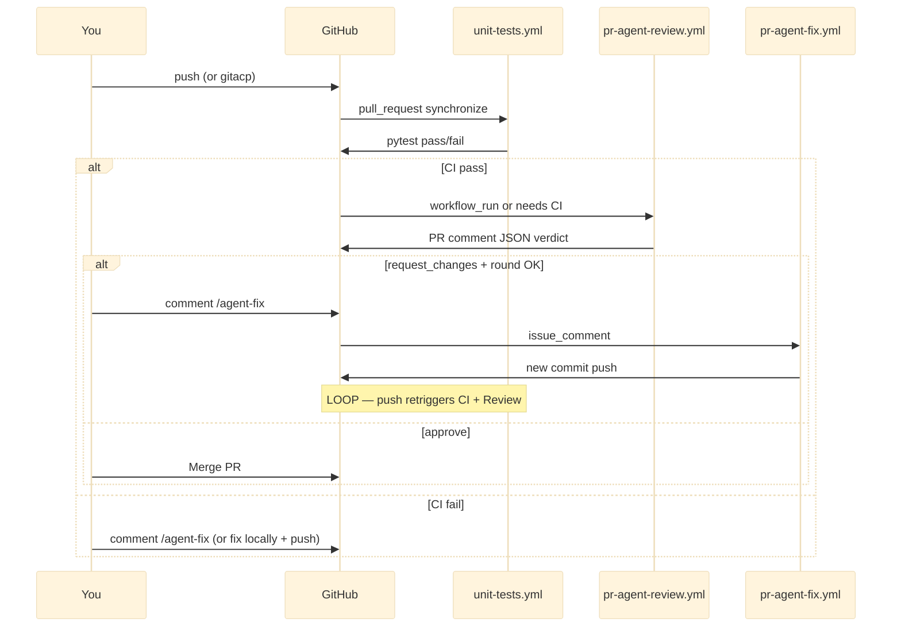

<h1 id="pr-workflow-title" style="color:#0d47a1;font-size:1.5em;font-weight:700;border-bottom:2px solid #90caf9;padding-bottom:0.25em;margin-top:0">PR workflow — two-agent model (low volume)</h1>

**Status:** living doc · **Scope:** `fru-genai-analytics-new`

Use when we have **one PR at a time**. Goal: **simple, cheap, safe** — two Cursor roles (Fixer + Reviewer), CI as the hard gate, you merge at the end.

**Start here if you are new:** [§8 Process in simplified words](#8-simplified-words)

---

## Table of Contents

- [0. Prerequisites — GitHub CLI (`gh`)](#0-prerequisites-gh)
- [1. Principles](#1-principles)
- [2. Two roles — Fixer and Reviewer](#2-two-roles)
  - [2.1 Fixer (Agent A)](#21-fixer)
  - [2.2 Reviewer (Agent B)](#22-reviewer)
- [3. Loop bounds and escalation](#3-loop-bounds)
- [4. Handoff contract](#4-handoff)
- [5. End-to-end flow](#5-flow)
- [6. CI and quality gates (`.github/workflows/`)](#6-ci-gates)
- [7. Cursor setup (v1 — manual)](#7-cursor-setup)
  - [7.1 Built-in chat modes (Cursor 2.1+)](#71-builtin-modes)
  - [7.1b Switch Fixer ↔ Reviewer in Cursor](#71b-switch-modes)
  - [7.4 Optional: Skills, Subagents, Rules](#74-optional-bootstrap)
- [8. Process in simplified words](#8-simplified-words)
  - [8.2 The loop (read first)](#82-the-loop)
  - [8.3 Step by step from `git status`](#83-step-by-step)
- [9. Using `gitacp` in this workflow](#9-gitacp)
- [10. Later automation — manual vs agents](#10-later-automation)
  - [10.1 One conductor, not parallel agents](#101-not-parallel)
  - [10.4 Automated loop diagram](#104-automated-loop)
  - [10.6 What `/agent-fix` means](#106-agent-fix)
  - [10.7 How the loop runs again (events)](#107-loop-events)
  - [10.8 Config: max rounds (`2`)](#108-config-max-rounds)
- [11. When to add a third agent](#11-third-agent)
- [12. Changelog](#12-changelog)

---

<h2 id="0-prerequisites-gh" style="color:#1565c0;font-size:1.22em;font-weight:650;border-left:4px solid #42a5f5;padding-left:10px;margin-top:1.1em">0. Prerequisites — GitHub CLI (`gh`)</h2>

Agents and humans use **`gh`** for PR create/view/checks/merge. Install and authenticate **before** running the workflow.

<h3 id="01-install" style="color:#00695c;font-size:1.05em;font-weight:600;margin-top:0.85em">0.1 Install</h3>

**macOS (Homebrew):**

```bash
brew install gh
```

Verify: `gh --version`

<h3 id="02-login" style="color:#00695c;font-size:1.05em;font-weight:600;margin-top:0.85em">0.2 Log in (repo owner account)</h3>

Run `gh auth login` and choose:

| Prompt | Choice | Why |
|--------|--------|-----|
| Where do you use GitHub? | **GitHub.com** | Standard GitHub |
| Preferred protocol | **SSH** | Matches `git@github.com:…` remotes; avoids read-only HTTPS creds |
| Upload SSH public key | **`~/.ssh/id_rsa.pub`** (or your default `github.com` key) | Must be the key tied to the account with **push** access |
| Key title | e.g. `horselord_key` | Label in GitHub SSH settings |
| Authenticate CLI | **Login with a web browser** | Paste one-time code at [github.com/login/device](https://github.com/login/device) |



Confirm the session is the **repo owner** (write access), not a read-only collaborator:

```bash
gh auth status
ssh -T git@github.com
```

If `gh pr create` fails with **must be a collaborator**, re-run `gh auth login` with the owning account’s SSH key.

---

<h2 id="1-principles" style="color:#1565c0;font-size:1.22em;font-weight:650;border-left:4px solid #42a5f5;padding-left:10px;margin-top:1.1em">1. Principles</h2>

1. **CI is truth; agents advise.** GitHub Actions (`.github/workflows/unit-tests.yml`) must pass before merge.
2. **Two named roles, not two vague chats.** **Fixer** edits; **Reviewer** reads only.
3. **Bounded loops.** Max **2** review/fix rounds, then **you** decide (`needs_human`).
4. **Fix CI before review comments.** When both fail, Fixer handles tests first, then reviewer blockers.
5. **You merge.** Agents never auto-merge in v1.
6. **This doc is canonical.** Cursor rules/skills only **point here** — no duplicate rubrics.

---

<h2 id="2-two-roles" style="color:#1565c0;font-size:1.22em;font-weight:650;border-left:4px solid #42a5f5;padding-left:10px;margin-top:1.1em">2. Two roles — Fixer and Reviewer</h2>

<table>
<thead>
<tr style="background:#1565c0;color:white"><th>Aspect</th><th>Fixer (Agent A)</th><th>Reviewer (Agent B)</th></tr>
</thead>
<tbody>
<tr><td style="background:#e3f2fd">Cursor v1</td><td style="background:#e8f5e9"><strong>Agent</strong> mode (∞ Agent in chat dropdown)</td><td style="background:#e8f5e9"><strong>Ask</strong> mode, readonly <strong>Subagent</strong>, or <strong>Plan</strong> then Build</td></tr>
<tr><td style="background:#e3f2fd">Writes code?</td><td style="background:#e8f5e9">yes</td><td style="background:#ffebee">no</td></tr>
<tr><td style="background:#e3f2fd">When</td><td style="background:#e8f5e9">Build feature, fix CI, apply review fixes</td><td style="background:#fff3e0">After local/remote CI is green (one pass per round)</td></tr>
<tr><td style="background:#e3f2fd">Output</td><td style="background:#e8f5e9">Commits + push (<code>gitacp</code>)</td><td style="background:#e8f5e9">JSON verdict (see §2.2)</td></tr>
</tbody>
</table>

<h3 id="21-fixer" style="color:#00695c;font-size:1.05em;font-weight:600;margin-top:0.85em">2.1 Fixer (Agent A)</h3>

**Mission:** Ship the change; get CI green; apply **blocking** review items only.

| # | Rubric | Pass criteria |
|---|--------|---------------|
| A1 | **Scope** | Diff matches PR goal; no drive-by refactors |
| A2 | **CI** | Same command as GitHub (§6) passes locally before handoff |
| A3 | **Tests** | Non-trivial Python changes have tests or justified skip |
| A4 | **Secrets** | No `.env`, keys, or credentials in diff |
| A5 | **Docs** | README / `docs/` / `.env.example` updated when behavior changes |
| A6 | **Fix order** | CI failures first → then reviewer `blocking_issues` only |

**Does not:** Self-approve merge; broaden tests to greenwash failures; change CI config unless asked.

<h3 id="22-reviewer" style="color:#00695c;font-size:1.05em;font-weight:600;margin-top:0.85em">2.2 Reviewer (Agent B)</h3>

**Mission:** One review pass per round; structured verdict.

| # | Rubric | Mark **blocking** if… |
|---|--------|----------------------|
| B1 | **Correctness** | Logic bug, wrong env names, broken imports |
| B2 | **Regression** | Missing tests for non-trivial Python changes |
| B3 | **Security** | Credentials, unsafe defaults, bad gitignore |
| B4 | **PR hygiene** | Unrelated files, misleading commits |
| B5 | **Docs** | `.env.example` / docs contradict code |

**Verdicts:** `approve` · `request_changes` · `needs_human` (architecture, migration risk, ambiguous product, CI failed twice, agent unsure).

**Output (JSON only):**

```json
{
  "verdict": "approve | request_changes | needs_human",
  "confidence": "high | medium | low",
  "risk_level": "low | medium | high",
  "blocking_issues": [
    {
      "file": "path/to/file.py",
      "line": 42,
      "severity": "high",
      "reason": "short explanation",
      "suggested_fix": "one line"
    }
  ],
  "non_blocking_notes": [],
  "tests_to_run": ["pytest -m \"not integration\""]
}
```

**Out of scope:** Style nits, huge architecture debates, future phases not in this PR.

---

<h2 id="3-loop-bounds" style="color:#1565c0;font-size:1.22em;font-weight:650;border-left:4px solid #42a5f5;padding-left:10px;margin-top:1.1em">3. Loop bounds and escalation</h2>

```text
max_review_fix_rounds = 2
```

| After round | CI | Reviewer verdict | Action |
|-------------|-----|------------------|--------|
| any | red | (skip review) | Fixer fixes CI only → push → wait for GitHub CI |
| 1–2 | green | `request_changes` | Fixer applies **blocking_issues** only → `gitacp` → new round |
| 1–2 | green | `approve` | You review on GitHub → merge |
| any | any | `needs_human` | **Stop loop** — you decide |
| 3 | any | any | **Stop loop** — max rounds reached; you decide |

---

<h2 id="4-handoff" style="color:#1565c0;font-size:1.22em;font-weight:650;border-left:4px solid #42a5f5;padding-left:10px;margin-top:1.1em">4. Handoff contract</h2>

**Fixer → Reviewer** (paste or agent runs):

```bash
gh pr view <n> --json title,body,baseRefName,headRefName,url
gh pr checks <n>
git diff main...HEAD --stat
```

**Reviewer → Fixer:** JSON from [§2.2](#22-reviewer).

**Fixer prompts by failure type:**

```text
CI failed:
  Fix test/lint failures only. Run §6 quality gates before stopping.

Review request_changes:
  Fix only blocking_issues from reviewer JSON. One focused pass.

Both:
  Fix CI first, then blocking review items.
```

---

<h2 id="5-flow" style="color:#1565c0;font-size:1.22em;font-weight:650;border-left:4px solid #42a5f5;padding-left:10px;margin-top:1.1em">5. End-to-end flow</h2>



---

<h2 id="6-ci-gates" style="color:#1565c0;font-size:1.22em;font-weight:650;border-left:4px solid #42a5f5;padding-left:10px;margin-top:1.1em">6. CI and quality gates (`.github/workflows/`)</h2>

**Yes — files under `.github/workflows/` are central to this process.** They are **GitHub Actions** recipes: when you push or open a PR, GitHub reads these YAML files and runs the jobs they describe. Agents do **not** replace this; they help you pass it.

<h3 id="61-workflow-files" style="color:#00695c;font-size:1.05em;font-weight:600;margin-top:0.85em">6.1 Workflow files in this repo</h3>

| File | Runs when | Part of PR loop? |
|------|-----------|------------------|
| **`.github/workflows/unit-tests.yml`** | Every **pull_request**; every **push** to `main`, `develop`, or `feature/**` | **yes** — required gate |
| **`.github/workflows/integration-tests.yml`** | Only when you click **Run workflow** (`workflow_dispatch`) | **no** — manual, needs Docker stack |

The PR loop cares about **`unit-tests.yml`**: it installs Python deps and runs the same pytest command you should run locally (§6.2). On the PR page this appears as **Checks → Unit tests / pytest**.

<h3 id="62-local-command" style="color:#00695c;font-size:1.05em;font-weight:600;margin-top:0.85em">6.2 Local command (match CI)</h3>

```bash
pip install -r requirements-dev.txt
python -m pytest -p pytest_cov --cov --cov-report=term-missing -m "not integration"
```

If `--cov` is unrecognized, run `unset PYTEST_DISABLE_PLUGIN_AUTOLOAD` or keep `-p pytest_cov` (see `tests/README.md`).

<h3 id="63-merge-gates" style="color:#00695c;font-size:1.05em;font-weight:600;margin-top:0.85em">6.3 Merge gates</h3>

| Gate | Source | Required to merge |
|------|--------|-------------------|
| Unit tests | `.github/workflows/unit-tests.yml` | **yes** |
| Reviewer `approve` (or your human review) | Cursor Reviewer (§2.2) | **yes** (v1 policy) |
| Integration tests | `.github/workflows/integration-tests.yml` | **no** |

**v1:** No new workflow files required — `unit-tests.yml` already exists. **Optional later:** branch protection on `main` that **requires** the pytest check to pass before merge.

---

<h2 id="7-cursor-setup" style="color:#1565c0;font-size:1.22em;font-weight:650;border-left:4px solid #42a5f5;padding-left:10px;margin-top:1.1em">7. Cursor setup (v1 — manual)</h2>

Nothing in the repo **must** change to start. You only need Cursor’s **built-in chat modes** — no special Settings page to create “custom modes.”

<h3 id="71-builtin-modes" style="color:#00695c;font-size:1.05em;font-weight:600;margin-top:0.85em">7.1 Built-in chat modes (Cursor 2.1+)</h3>

**Important:** Cursor **removed Custom Modes** in version **2.1**. There is **no** **Settings → Chat → Custom modes** in current builds. Settings shows **General**, **Agents**, **Rules, Skills, Subagents**, **Hooks**, etc. — that is expected.

Use the **built-in mode picker** in the chat input bar (pill labeled **∞ Agent ▾** next to **Auto**):

| Built-in mode | Maps to | Can edit files? |
|---------------|---------|-----------------|
| **Agent** | **Fixer** | yes — edit, terminal, `gitacp` |
| **Ask** | **Reviewer** | no — read/search only |
| **Plan** | Optional pre-step | plans first; **Build** executes after you approve |
| **Debug** | Optional | debug with runtime evidence |

**Shortcuts:** `Shift+Tab` cycles modes in the chat panel. Slash: `/ask`, `/plan` ([Cursor docs](https://cursor.com/docs)).

| Our role | Select in dropdown |
|----------|-------------------|
| Fixer | **Agent** |
| Reviewer | **Ask** (or subagent — §7.5) |

Optional later: save prompts as **Skills** or **Subagents** under **Settings → Rules, Skills, Subagents** (§7.4) — not required for v1.

<h3 id="71b-switch-modes" style="color:#00695c;font-size:1.05em;font-weight:600;margin-top:0.85em">7.1b How to switch Fixer ↔ Reviewer in Cursor (manual v1)</h3>

Fixer and Reviewer are **not two chats running at once**. You use **one chat at a time**, in **sequence** — same loop as [§5](#5-flow), round by round.

**Where to switch:** bottom of the **Chat panel** (right side) — click the pill that says **Agent** (or **Ask**, etc.) **▾** next to the model dropdown (**Auto**).

| You need | Do this in Cursor |
|----------|-------------------|
| **Fixer** (edit, terminal, `gitacp`) | Dropdown → **Agent** |
| **Reviewer** (read-only, JSON) | Dropdown → **Ask** |

**You will not see** “PR Fixer” or “PR Reviewer” in the list — those names are **roles in this doc**, implemented via **Agent** and **Ask**.

**Recommended habits:**

1. **Same chat, change mode** — finish Fixer work → dropdown **Ask** → paste §7.2 prompt → read JSON → dropdown **Agent** for fixes. One thread keeps context.
2. **New chat for Reviewer (optional)** — **+** new chat → **Ask** → paste PR number + §7.2 prompt → copy JSON back to Fixer chat.
3. **No switch (subagent)** — stay on **Agent** and use §7.5. Primary = Fixer/conductor; Reviewer = child task.

```mermaid
%%{init: {'theme': 'base', 'themeVariables': { 'fontSize': '10px', 'fontFamily': 'sans-serif' }, 'flowchart': { 'padding': 8, 'nodeSpacing': 25, 'rankSpacing': 30 }}}%%
flowchart LR
  U[You] -->|"mode: Agent"| F[Fixer chat]
  F -->|"gitacp push"| GH[GitHub CI]
  GH -->|"green"| U2[You]
  U2 -->|"mode: Ask OR subagent"| R[Reviewer]
  R -->|"JSON verdict"| U3[You]
  U3 -->|"mode: Agent"| F2[Fixer chat]
  F2 -->|"loop max 2"| GH

  style F fill:#e8f5e9,stroke:#2e7d32,stroke-width:1px,font-size:9px
  style R fill:#ede7f6,stroke:#5e35b1,stroke-width:1px,font-size:9px
  style GH fill:#fff3e0,stroke:#e65100,stroke-width:1px,font-size:9px
  style U fill:#e3f2fd,stroke:#1976d2,stroke-width:1px,font-size:9px
  style U2 fill:#e3f2fd,stroke:#1976d2,stroke-width:1px,font-size:9px
  style U3 fill:#e3f2fd,stroke:#1976d2,stroke-width:1px,font-size:9px
  style F2 fill:#e8f5e9,stroke:#2e7d32,stroke-width:1px,font-size:9px
```



**You do not need** a second Cursor window. **You do not** run Fixer and Reviewer in parallel in v1.

<h3 id="72-reviewer-prompt" style="color:#00695c;font-size:1.05em;font-weight:600;margin-top:0.85em">7.2 Reviewer prompt (copy-paste)</h3>

```text
Review this PR diff as a senior engineer. Follow rubrics B1–B5 in
docs/learned/agents/PR_WORKFLOW_MULTI_AGENT.md §2.2.

Return JSON only (no prose). Do not edit files.
Only mark blocking if correctness, security, data loss, API contract, or maintainability.
```

<h3 id="73-fixer-prompt" style="color:#00695c;font-size:1.05em;font-weight:600;margin-top:0.85em">7.3 Fixer prompt (copy-paste)</h3>

```text
Fix only the blocking_issues from the reviewer JSON (or CI failures if CI is red).

Rules: no unrelated refactors; do not change CI config; run pytest per §6 before stopping.
If uncertain, say NEEDS_HUMAN and stop.
```

<h3 id="74-optional-bootstrap" style="color:#00695c;font-size:1.05em;font-weight:600;margin-top:0.85em">7.4 Optional: Skills, Subagents, Rules</h3>

If you repeat the same prompts, persist them without Custom Modes (removed in 2.1):

| Mechanism | Where | Use for |
|-----------|-------|---------|
| **Skills** | `.cursor/skills/<name>/SKILL.md` or **Settings → Rules, Skills, Subagents** | `/review-pr` slash invoke with §7.2 body |
| **Subagents** | `.cursor/agents/<name>.md` | Readonly reviewer persona; invoke via `/name` or “use pr-reviewer subagent” |
| **Rules** | `.cursor/rules/prflow.mdc` | Keyword `prflow` → pointer to this doc (`alwaysApply: false`) |

**`.cursor/` is gitignored** in this repo — these files stay local unless you un-ignore selectively. **This markdown doc stays canonical**; Skills/Subagents should link here, not duplicate rubrics.

<h3 id="75-subagent" style="color:#00695c;font-size:1.05em;font-weight:600;margin-top:0.85em">7.5 Subagent option (no mode switch)</h3>

Stay on **Agent** mode:

```text
PR #<n> — CI is green. Spawn a readonly subagent to review per §2.2.
Return JSON only. Then wait for my instruction before editing.
```

The **primary chat = Fixer/conductor**; the subagent = **Reviewer child** ([Subagents docs](https://cursor.com/docs/subagents)). **Sequential**, not parallel.

---

<h2 id="8-simplified-words" style="color:#1565c0;font-size:1.22em;font-weight:650;border-left:4px solid #42a5f5;padding-left:10px;margin-top:1.1em">8. Process in simplified words</h2>

This section assumes you edited files on a **feature branch** and `git status` shows new or changed files.

<h3 id="81-what-the-pieces-are" style="color:#00695c;font-size:1.05em;font-weight:600;margin-top:0.85em">8.1 What the pieces are</h3>

| Place | What it does |
|-------|----------------|
| **Your laptop** | You edit code; Cursor agents help fix or review |
| **Git** | Saves snapshots (commits) on a **branch** |
| **GitHub** | Stores the branch online; runs **CI** from `.github/workflows/` on each push |
| **Pull Request (PR)** | A request to merge your branch into `main` |
| **Fixer** | Cursor **Agent** mode — changes code and runs tests |
| **Reviewer** | Cursor **Ask** mode (or subagent) — only reads; returns JSON |

<h3 id="82-the-loop" style="color:#00695c;font-size:1.05em;font-weight:600;margin-top:0.85em">8.2 The loop (same as §5 — read this first)</h3>

Every PR goes through this cycle. **Round** = one Reviewer pass + optional Fixer fix. **Max 2 rounds**, then you take over.



**Loop shortcuts:**

- **CI red** → only the **Fixer** arm (left) — skip Reviewer.
- **CI green** → **Reviewer** → if `request_changes` and round ≤ 2 → **Fixer** → **push** → **CI** again (new round).
- **`approve`** → exit loop → you merge.

<h3 id="83-step-by-step" style="color:#00695c;font-size:1.05em;font-weight:600;margin-top:0.85em">8.3 Step by step from `git status`</h3>

**Step 1 — You have local changes**

```bash
git status
```

You see modified or new files. That means work is **not saved to git** yet.

**Step 2 — Finish the work in Cursor (Fixer)**

- In the **Chat panel** (right side), click the bottom mode pill **∞ Agent ▾** and keep **Agent** selected.
- Ask it to complete the task, e.g. “add the study doc section” or “fix the failing test.”
- It edits files on your machine. Run `git status` again — more files may show up.

**Step 3 — Save and upload with `gitacp`**

In Cursor chat, type **`gitacp`** (see [§9](#9-gitacp)). The agent will:

1. `git add` (stage files; skips secrets like `.env`)
2. `git commit -m "..."` (save a snapshot with a clear message)
3. `git push` (upload the branch to GitHub)

You do **not** need to memorize git commands if you use `gitacp` — but you should glance at what it committed.

**Step 4 — Open a PR (first time on this branch only)**

If there is no PR yet, in Cursor say:

```text
create a pull request to merge this branch into main
```

Or run `gh pr create --base main` yourself. GitHub now shows a **PR page** with your changes.

**Step 5 — Wait for GitHub CI**

GitHub runs **`.github/workflows/unit-tests.yml`** automatically. On the PR page, open **Checks**:

- **Red X** → **loop: CI arm** → Step 6a (Fixer only).
- **Green ✓** → Step 7 (Reviewer).

**Step 6a — CI failed (Fixer — stay on Agent mode)**

1. Mode pill → **Agent**.
2. Say:

```text
PR #<n> CI failed — fix tests only, then gitacp
```

3. Push retriggers CI → back to **Step 5**. **Do not run Reviewer while CI is red.**

**Step 7 — Reviewer pass (switch mode or subagent)**

**Option A — switch mode (recommended first time):**

1. In the **same chat** or a **new chat (+)**, change the mode pill from **Agent** to **Ask** (`Shift+Tab` also works).
2. Say:

```text
Review PR #<n> per docs/learned/agents/PR_WORKFLOW_MULTI_AGENT.md §2.2 — JSON only
```

**Option B — stay on Agent, use subagent:** see [§7.5](#75-subagent).

Read the JSON:

| verdict | What you do |
|---------|-------------|
| `approve` | Go to Step 9 — **loop ends** |
| `request_changes` | Go to Step 8 if round ≤ 2 — **loop continues** |
| `needs_human` | **You** decide — **loop stops** |

**Step 8 — Apply review fixes (switch back to Fixer)**

1. Mode pill → **Agent** (same or original chat).
2. Paste reviewer JSON or say:

```text
Fix only blocking_issues from the reviewer JSON, then gitacp
```

3. Push → **`.github/workflows/unit-tests.yml`** runs again → **back to Step 5** (next **round**). Max **2** review/fix rounds ([§8.2](#82-the-loop)).

**Step 9 — Merge on GitHub (you)**

Open the PR in the browser. When:

- CI is green ✓
- You are happy with the diff (and Reviewer said `approve` if you used it)

Click **Merge pull request**. Done — `main` now has your changes.

<h3 id="84-what-you-touch-where" style="color:#00695c;font-size:1.05em;font-weight:600;margin-top:0.85em">8.4 What you touch where</h3>

| Where | You do |
|-------|--------|
| **Cursor Chat** | **Agent** = Fixer; **Ask** = Reviewer; switch via **∞ Agent ▾** pill (or `Shift+Tab`); `gitacp` to push |
| **`.github/workflows/`** | **You rarely edit** in v1 — already defines CI. Fixer should not change it unless you ask. |
| **Other code** | Normal feature edits only |
| **github.com** | Open PR, watch **Checks** (from `unit-tests.yml`), read diff, click **Merge** |
| **Terminal (optional)** | `git status`, `gh pr checks <n>`, local pytest from §6 |

---

<h2 id="9-gitacp" style="color:#1565c0;font-size:1.22em;font-weight:650;border-left:4px solid #42a5f5;padding-left:10px;margin-top:1.1em">9. Using `gitacp` in this workflow</h2>

**`gitacp`** = **git add + commit + push** (rule: `.cursor/rules/gitacp.mdc`).

| When | Say in Cursor |
|------|----------------|
| Feature done for this slice | `gitacp` |
| After Fixer applied review fixes | `gitacp` |
| After CI fix | `gitacp` |

**Combine with PR workflow in one message:**

```text
fix the pytest failure from PR #1 CI, then gitacp
```

```text
apply blocking_issues from the reviewer JSON, run pytest, then gitacp
```

**`gitacp` does not:** open a PR, run Reviewer, or merge. Those are separate steps ([§8](#8-simplified-words)).

**Commit messages:** Concrete, human-readable; no “AI generated” wording (per `gitacp` rule).

---

<h2 id="10-later-automation" style="color:#1565c0;font-size:1.22em;font-weight:650;border-left:4px solid #42a5f5;padding-left:10px;margin-top:1.1em">10. Later automation — manual vs agents</h2>

Manual v1 works but repeats the same steps. Automation **keeps the same loop** ([§5](#5-flow), [§8.2](#82-the-loop)) — it changes **who clicks** and **who switches modes**, not the rules.

<h3 id="101-not-parallel" style="color:#00695c;font-size:1.05em;font-weight:600;margin-top:0.85em">10.1 One conductor, two roles — not two parallel agents</h3>

| Model | Who conducts | Fixer | Reviewer | Parallel? |
|-------|----------------|-------|----------|-----------|
| **Manual v1 (now)** | **You** | You select **Agent** mode | You select **Ask** mode or subagent | **No** — one chat role at a time |
| **Subagent v1** | **Primary Agent** chat | Primary edits | **Child** readonly subagent | **No** — subagent finishes, then primary continues |
| **Automated v2** | **GitHub Actions** workflow | `cursor-agent` job step (Fixer prompt) | `cursor-agent` job step (Reviewer prompt) | **No** — jobs run **in order** on GHA runners |

Fixer and Reviewer are **different hats**, not two coworkers working simultaneously. The **loop is always sequential:** CI → Review → (maybe) Fix → push → CI again.

<h3 id="102-manual-vs-auto" style="color:#00695c;font-size:1.05em;font-weight:600;margin-top:0.85em">10.2 What stays manual vs what automation does</h3>

<table>
<thead>
<tr style="background:#1565c0;color:white"><th>Step</th><th>Manual v1 (now)</th><th>Automated v2 (target)</th></tr>
</thead>
<tbody>
<tr><td style="background:#e3f2fd">Edit feature code</td><td style="background:#fff3e0">You + Fixer in Cursor</td><td style="background:#fff3e0">You + Fixer (or Background Agent)</td></tr>
<tr><td style="background:#e3f2fd"><code>gitacp</code> / push</td><td style="background:#fff3e0">You type <code>gitacp</code></td><td style="background:#e8f5e9">Fixer agent commits in GHA or Cursor Cloud</td></tr>
<tr><td style="background:#e3f2fd">CI pytest</td><td style="background:#e8f5e9"><strong>Automatic</strong> — <code>.github/workflows/unit-tests.yml</code></td><td style="background:#e8f5e9">Same — already automatic</td></tr>
<tr><td style="background:#e3f2fd">Switch Fixer ↔ Reviewer</td><td style="background:#fff3e0"><strong>You</strong> — mode dropdown (§7.1b)</td><td style="background:#e8f5e9"><strong>GHA workflow</strong> — separate job steps</td></tr>
<tr><td style="background:#e3f2fd">Reviewer JSON</td><td style="background:#fff3e0">You read in chat</td><td style="background:#e8f5e9">Agent posts PR comment or workflow artifact</td></tr>
<tr><td style="background:#e3f2fd">Apply review fixes</td><td style="background:#fff3e0">You invoke Fixer + <code>gitacp</code></td><td style="background:#fff3e0"><strong>Recommended:</strong> you post PR comment <code>/agent-fix</code> → Fixer workflow runs (§10.6). <strong>Optional:</strong> workflow auto-runs Fixer when Reviewer says <code>request_changes</code> (§10.6)</td></tr>
<tr><td style="background:#e3f2fd">Max 2 rounds / <code>needs_human</code></td><td style="background:#fff3e0">You enforce</td><td style="background:#e8f5e9"><code>MAX_REVIEW_FIX_ROUNDS</code> in workflow <code>.yml</code> (§10.8) — not <code>.env</code></td></tr>
<tr><td style="background:#e3f2fd">Merge to <code>main</code></td><td style="background:#fff3e0"><strong>You</strong> click Merge</td><td style="background:#fff3e0"><strong>You</strong> click Merge (no auto-merge in v2)</td></tr>
</tbody>
</table>

<h3 id="103-automation-phases" style="color:#00695c;font-size:1.05em;font-weight:600;margin-top:0.85em">10.3 Automation phases</h3>

**Phase A — already done**

- `.github/workflows/unit-tests.yml` runs on every PR push.

**Phase B — auto Reviewer on PR update (add one workflow file)**

Trigger: `pull_request` types `[opened, synchronize, reopened]`.

After `unit-tests` job passes, a second job runs **`cursor-agent`** (needs repo secret `CURSOR_API_KEY`) with the §7.2 Reviewer prompt. It posts JSON as a **PR comment**. **You still merge manually.**

**Phase C — Fixer on demand (safer than auto-fix every push)**

Trigger: you post a **PR comment** containing `/agent-fix` (see [§10.6](#106-agent-fix)).

The Fixer workflow runs **`cursor-agent`**, may **push** a commit → that push retriggers Phase A + B (see [§10.7](#107-loop-events)). Round cap from [§10.8](#108-config-max-rounds).

**Phase D — optional Background Agent**

For long fixes, a [Cursor Background Agent](https://cursor.com/docs) runs in an isolated environment while you monitor — still **one agent run at a time**, not parallel Fixer+Reviewer.

<h3 id="104-automated-loop" style="color:#00695c;font-size:1.05em;font-weight:600;margin-top:0.85em">10.4 Automated loop (same diagram as §5, different conductor)</h3>



**What runs in the background:** GitHub’s servers run **pytest** and (Phase B/C) **`cursor-agent`** CLI in a clean Linux runner — not on your laptop. You get PR comments and check status; you are notified when input is needed (`/agent-fix` or merge).

<h3 id="105-repo-changes-for-automation" style="color:#00695c;font-size:1.05em;font-weight:600;margin-top:0.85em">10.5 Repo changes when you automate (later)</h3>

| Add | Purpose |
|-----|---------|
| `.github/workflows/pr-agent-review.yml` | Phase B — Reviewer after green CI |
| `.github/workflows/pr-agent-fix.yml` | Phase C — Fixer on `/agent-fix` |
| GitHub secret `CURSOR_API_KEY` | Authenticate `cursor-agent` in Actions |
| Optional: branch protection on `main` | Require `unit-tests` check |

**Do not start Phase B/C until manual v1 feels reliable** — otherwise you automate a loop you have not debugged yet.

<h3 id="106-agent-fix" style="color:#00695c;font-size:1.05em;font-weight:600;margin-top:0.85em">10.6 What `/agent-fix` means</h3>

`/agent-fix` is **not** a built-in GitHub feature. It is a **convention we define**: a short string you type in a **PR comment** so a workflow knows you want the **Fixer** to run.

**Recommended flow (human gate before auto-edit):**

1. Reviewer workflow posts JSON on the PR, e.g. `verdict: request_changes`.
2. **You** read it on github.com.
3. You comment on the PR:

```text
/agent-fix
```

4. `.github/workflows/pr-agent-fix.yml` (Phase C — not in repo yet) listens for that comment and starts the Fixer job.

**How the workflow listens (sketch):**

```yaml
# .github/workflows/pr-agent-fix.yml (future)
on:
  issue_comment:
    types: [created]

jobs:
  agent-fix:
    if: |
      github.event.issue.pull_request &&
      contains(github.event.comment.body, '/agent-fix')
    runs-on: ubuntu-latest
    steps:
      # checkout PR branch, run cursor-agent with §7.3 prompt,
      # read latest reviewer JSON from PR comments, commit + push
```

**“Auto if policy allows” (optional, off by default):**

Instead of waiting for your comment, the **same** Reviewer workflow could **chain** directly into a Fixer job when `verdict == request_changes`. Controlled by a workflow flag:

```yaml
env:
  AUTO_FIX_ON_REQUEST_CHANGES: "false"   # keep false until you trust the loop
```

| Mode | Who starts Fixer | Risk |
|------|------------------|------|
| **`/agent-fix` (recommended)** | **You** comment on PR | Low — you approve each fix pass |
| **Auto on `request_changes`** | Workflow immediately after Reviewer | Higher — agent may push without you looking |

We recommend **`/agent-fix`** until the Reviewer JSON quality is proven.

<h3 id="107-loop-events" style="color:#00695c;font-size:1.05em;font-weight:600;margin-top:0.85em">10.7 How the loop runs again (events)</h3>

There is **no single long-running “while loop”** on GitHub. The loop is **event-driven** — each push or comment starts a **new** workflow run. That is how it “loops again.”



**One full “round” in automation:**

| Step | Event | What runs |
|------|-------|-----------|
| 1 | `git push` to PR branch | `unit-tests.yml` |
| 2 | CI green | `pr-agent-review.yml` → JSON comment |
| 3 | You type `/agent-fix` | `pr-agent-fix.yml` → commit + **push** |
| 4 | **New push** (step 1 again) | CI → Reviewer → … |

Step 4 is the **loop back**. The Fixer does not “call” Reviewer directly — the **push** retriggers the PR workflows.

**Manual v1 equivalent:** your `gitacp` push = step 4; switching Agent ↔ Ask = steps 2–3.

<h3 id="108-config-max-rounds" style="color:#00695c;font-size:1.05em;font-weight:600;margin-top:0.85em">10.8 Config: max rounds (`2`)</h3>

**Put the limit in `.github/workflows/*.yml` — not `.env`.**

| Location | Use for max rounds? | Why |
|----------|---------------------|-----|
| **`.github/workflows/pr-agent-*.yml`** | **yes (recommended)** | GHA reads this; versioned in git; same value for all PRs |
| **GitHub repo variable** (`Settings → Actions → Variables`) | optional override | Change without code edit, e.g. `MAX_PR_AGENT_ROUNDS=2` |
| **`.env`** | **no** | Local app secrets only; gitignored; GHA never sees it |

**Suggested pattern** at the top of agent workflow files:

```yaml
env:
  MAX_REVIEW_FIX_ROUNDS: "2"
```

Workflow logic before running Fixer or Reviewer (pseudocode):

```text
round = count PR labels "agent-round-*" OR count bot "request_changes" comments
if round >= MAX_REVIEW_FIX_ROUNDS:
  post comment "needs_human: max rounds reached"
  exit workflow
else:
  run job; after successful fix push, add label agent-round-{round+1}
```

**Align with §3:** `max_review_fix_rounds = 2` in the doc matches `MAX_REVIEW_FIX_ROUNDS: "2"` in YAML. Single source: **workflow env**; the markdown doc describes the policy.

**Optional shared config file** (only if you add many workflows): e.g. `config/ci/pr_agent.yaml` committed to repo, read by a composite action — still **not** `.env`. For one repo, **inline `env:` in the workflow is enough**.

---

<h2 id="11-third-agent" style="color:#1565c0;font-size:1.22em;font-weight:650;border-left:4px solid #42a5f5;padding-left:10px;margin-top:1.1em">11. When to add a third agent</h2>

Stay at **two roles** while PR count is low. Add **`ci-investigator`** only when:

- Multiple PRs are open, or
- CI logs need triage without burning Fixer context, or
- Security/infra PRs routinely slip past B1–B5.

---

<h2 id="12-changelog" style="color:#1565c0;font-size:1.22em;font-weight:650;border-left:4px solid #42a5f5;padding-left:10px;margin-top:1.1em">12. Changelog</h2>

| Date | Change |
|------|--------|
| 2026-05-21 | Initial two-agent model; CI `pytest-cov` fix; PR #1 context |
| 2026-06-12 | §0 `gh` prerequisites + screenshot |
| 2026-06-12 | Reconcile external review: Custom Modes, `needs_human`, max 2 rounds, JSON verdict, §8 simplified walkthrough, §9 `gitacp` |
| 2026-06-12 | §6 `.github/workflows/` detail; §7.1b mode switching; §8 loop diagram; §10 automation phases + conductor model |
| 2026-06-12 | §7: remove obsolete Custom Modes; document Cursor 2.1+ **Agent** / **Ask** / **Plan** / **Debug**; Skills/Subagents optional |
| 2026-06-12 | §10.6–10.8: `/agent-fix` trigger, event-driven loop, `MAX_REVIEW_FIX_ROUNDS` in workflow `.yml` not `.env` |
