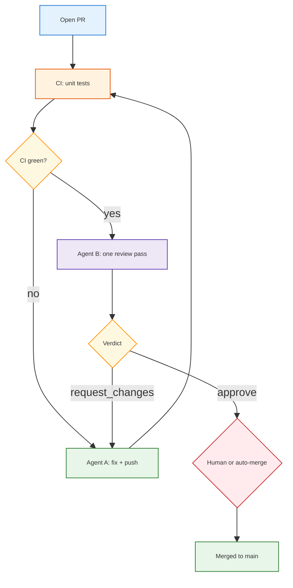

<h1 id="pr-workflow-title" style="color:#0d47a1;font-size:1.5em;font-weight:700;border-bottom:2px solid #90caf9;padding-bottom:0.25em;margin-top:0">PR workflow — two-agent model (low volume)</h1>

**Status:** living doc · **Scope:** `fru-genai-analytics-new` · **Last context:** PR #1 (`feature/add-seed` → `main`)

Use this when we have **one PR at a time** (not a review queue). Goal: **simple, cheap, safe** — two agents total, CI as the hard gate, human merge optional.

---

## Table of Contents

- [1. Principles](#1-principles)
- [2. Two-agent roles and rubrics](#2-two-agent-roles)
  - [2.1 Agent A — Implementer (primary)](#21-agent-a-implementer)
  - [2.2 Agent B — PR reviewer](#22-agent-b-pr-reviewer)
- [3. Handoff contract](#3-handoff-contract)
- [4. End-to-end flow](#4-end-to-end-flow)
- [5. CI and merge gates](#5-ci-merge-gates)
- [6. When to add a third agent](#6-when-to-add-third)
- [7. Cursor invocation patterns](#7-cursor-invocation)
- [8. Changelog](#8-changelog)

---

<h2 id="1-principles" style="color:#1565c0;font-size:1.22em;font-weight:650;border-left:4px solid #42a5f5;padding-left:10px;margin-top:1.1em">1. Principles</h2>

1. **CI is truth; agents advise.** Required checks (e.g. `Unit tests / pytest`) must pass before merge. Agents do not override red CI.
2. **Review is read-only by default.** Only Agent A edits the branch; Agent B comments or returns a structured verdict.
3. **One PR, two agents.** No fan-out of parallel reviewers until PR volume justifies it (see [§6](#6-when-to-add-third)).
4. **Explicit handoffs.** Pass `PR URL`, `base`/`head` branches, and `gh pr checks` output — not long chat history.
5. **Merge stays gated.** Auto-merge only when CI green + Agent B `approve` + no conflicts. Human click-merge is fine for early rollout.

---

<h2 id="2-two-agent-roles" style="color:#1565c0;font-size:1.22em;font-weight:650;border-left:4px solid #42a5f5;padding-left:10px;margin-top:1.1em">2. Two-agent roles and rubrics</h2>

<table>
<thead>
<tr style="background:#1565c0;color:white"><th>Aspect</th><th>Agent A — Implementer</th><th>Agent B — PR reviewer</th></tr>
</thead>
<tbody>
<tr><td style="background:#e3f2fd">Who</td><td style="background:#e8f5e9">Primary Cursor agent (you + coordinator)</td><td style="background:#e8f5e9">One subagent per PR (<code>explore</code> or <code>generalPurpose</code>, <code>readonly: true</code>)</td></tr>
<tr><td style="background:#e3f2fd">Writes code?</td><td style="background:#e8f5e9"><span style="background:#c8e6c9;padding:2px 4px">yes</span></td><td style="background:#ffebee"><span style="background:#ffcdd2;padding:2px 4px">no</span> (review only)</td></tr>
<tr><td style="background:#e3f2fd">Cost</td><td style="background:#e8f5e9">Higher (full context, fixes, push)</td><td style="background:#fff3e0">Lower (diff + rubric, one pass)</td></tr>
<tr><td style="background:#e3f2fd">Output</td><td style="background:#e8f5e9">Commits, green CI, PR body updates</td><td style="background:#e8f5e9">Verdict + bullet findings (max ~10)</td></tr>
</tbody>
</table>

<h3 id="21-agent-a-implementer" style="color:#00695c;font-size:1.05em;font-weight:600;margin-top:0.85em">2.1 Agent A — Implementer (primary)</h3>

**Mission:** Ship the change and get CI green on the PR branch.

| # | Rubric item | Pass criteria |
|---|-------------|---------------|
| A1 | **Scope** | Diff matches stated PR goal; no drive-by refactors |
| A2 | **CI** | All required checks pass (`gh pr checks`) |
| A3 | **Tests** | New/changed behavior covered or justified skip; `pytest -m "not integration"` locally if touching backend/tools |
| A4 | **Secrets** | No `.env`, keys, or credentials in diff |
| A5 | **Docs** | User-facing or ops changes reflected in README / `docs/` / `.env.example` as needed |
| A6 | **Handoff** | Post short PR comment or summary for Agent B: what changed, what to focus on |

**Does not:** Approve its own PR for merge without Agent B verdict (or human).

<h3 id="22-agent-b-pr-reviewer" style="color:#00695c;font-size:1.05em;font-weight:600;margin-top:0.85em">2.2 Agent B — PR reviewer</h3>

**Mission:** One focused review pass; return **approve** | **request_changes** | **blocked**.

| # | Rubric item | Block merge if… |
|---|-------------|-----------------|
| B1 | **Correctness** | Logic bug, wrong env var names, broken imports |
| B2 | **Regression risk** | Missing tests for non-trivial Python changes |
| B3 | **Security / secrets** | Credentials, unsafe defaults, overly broad gitignore hiding needed files |
| B4 | **PR hygiene** | Unrelated files, huge binaries without reason, misleading commit message |
| B5 | **Docs accuracy** | `.env.example` / docs contradict code or omit required vars |

**Out of scope for Agent B:** Style nits, full-repo architecture debates, VikingDB/BytePlus future phases not in this PR.

**Output format (required):**

```text
VERDICT: approve | request_changes | blocked
BLOCKERS: (0–3 bullets, or "none")
NITS: (optional, non-blocking)
```

---

<h2 id="3-handoff-contract" style="color:#1565c0;font-size:1.22em;font-weight:650;border-left:4px solid #42a5f5;padding-left:10px;margin-top:1.1em">3. Handoff contract</h2>

Agent A → Agent B (minimal payload):

```bash
gh pr view <n> --json title,body,baseRefName,headRefName,url
gh pr checks <n>
git diff main...HEAD --stat
```

Agent B → Agent A: structured verdict (see [§2.2](#22-agent-b-pr-reviewer)).

Agent A → merge: only if `VERDICT: approve` **and** CI green.

---

<h2 id="4-end-to-end-flow" style="color:#1565c0;font-size:1.22em;font-weight:650;border-left:4px solid #42a5f5;padding-left:10px;margin-top:1.1em">4. End-to-end flow</h2>



---

<h2 id="5-ci-merge-gates" style="color:#1565c0;font-size:1.22em;font-weight:650;border-left:4px solid #42a5f5;padding-left:10px;margin-top:1.1em">5. CI and merge gates</h2>

| Gate | Source | Required for merge |
|------|--------|-------------------|
| Unit tests | `.github/workflows/unit-tests.yml` | <span style="background:#c8e6c9;padding:2px 4px">yes</span> |
| Agent B verdict | Subagent review | <span style="background:#c8e6c9;padding:2px 4px">yes</span> (or human review) |
| Integration tests | Manual workflow | <span style="background:#ffcdd2;padding:2px 4px">no</span> (not on every PR) |

**Known CI gotcha:** If `pytest` fails with `unrecognized arguments: --cov`, `PYTEST_DISABLE_PLUGIN_AUTOLOAD` is set in the environment. Unset it locally; CI uses `python -m pytest -p pytest_cov ...` so coverage works even when autoload is disabled.

---

<h2 id="6-when-to-add-third" style="color:#1565c0;font-size:1.22em;font-weight:650;border-left:4px solid #42a5f5;padding-left:10px;margin-top:1.1em">6. When to add a third agent</h2>

Stay at **two agents** while PR count is low. Add **`ci-investigator`** (or a dedicated security pass) only when:

- Multiple PRs open at once, or
- Repeated CI failures need log triage without burning Implementer context, or
- PRs touch infra/secrets and B1–B5 routinely miss issues.

---

<h2 id="7-cursor-invocation" style="color:#1565c0;font-size:1.22em;font-weight:650;border-left:4px solid #42a5f5;padding-left:10px;margin-top:1.1em">7. Cursor invocation patterns</h2>

**Agent A (you):** Implement, `git push`, watch `gh pr checks`, fix failures.

**Agent B (spawn once per PR):**

```text
Task tool: subagent_type=explore, readonly=true
Review PR #<n> against rubrics B1–B5 in docs/learned/agents/pr_workflow_multi_agent.md.
Return VERDICT / BLOCKERS / NITS only. Do not edit files.
```

Optional after green CI + approve: `gh pr merge <n> --squash` (human confirmation recommended until auto-merge policy is explicit).

---

<h2 id="8-changelog" style="color:#1565c0;font-size:1.22em;font-weight:650;border-left:4px solid #42a5f5;padding-left:10px;margin-top:1.1em">8. Changelog</h2>

| Date | Change |
|------|--------|
| 2026-05-21 | Initial two-agent model; CI fix for `pytest-cov` + `PYTEST_DISABLE_PLUGIN_AUTOLOAD`; PR #1 context |
