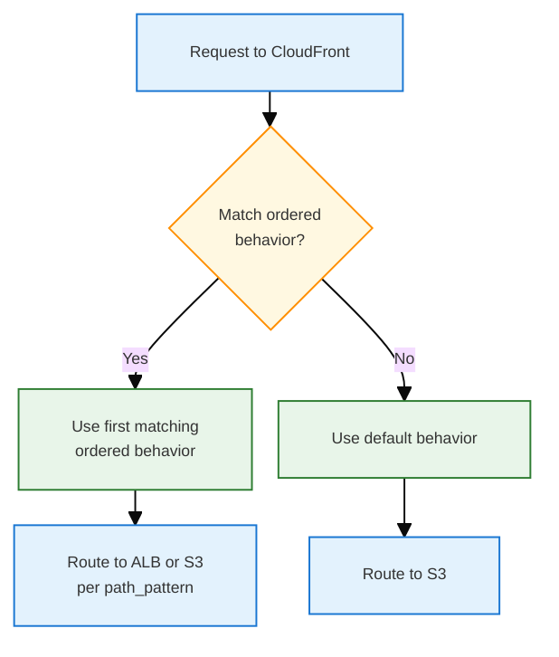
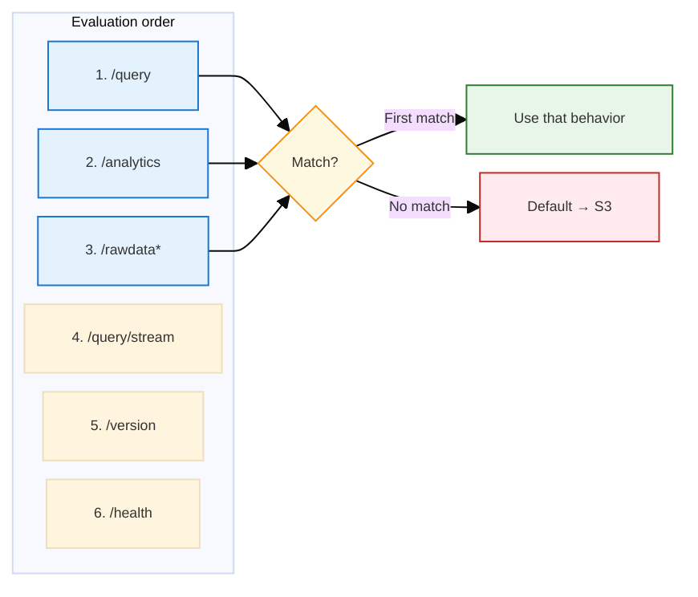
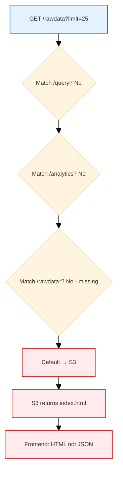

# AWS CloudFront: Cache Behaviors, Path Routing, and Data Management

CloudFront configuration for frontend + API (S3 + ALB origins). Covers ordered cache behaviors, path matching, the Data Management `/rawdata` fix, and comparison with GCP.

**See also:** [infra_terraform/modules/aws/primitives/cloudfront/main.tf](../../infra_terraform/modules/aws/primitives/cloudfront/main.tf), [docs/styles/DOCS_TABLE_STYLE.md](../styles/DOCS_TABLE_STYLE.md), [docs/styles/DOCS_MERMAID_DIAGRAM_STYLE.md](../styles/DOCS_MERMAID_DIAGRAM_STYLE.md).

---

## 1. Origins and Default Behavior

CloudFront has two origins when the API is configured:

| Origin | ID | Serves |
|--------|-----|--------|
| <span style="background:#e3f2fd;padding:1px 3px">**S3**</span> | `S3-{bucket}` | Frontend static assets (index.html, JS, CSS) |
| <span style="background:#e3f2fd;padding:1px 3px">**ALB**</span> | `ALB-{prefix}-{env}-{suffix}` | API backend (/query, /analytics, /rawdata, etc.) |

The **default cache behavior** routes to S3. All requests that do not match any ordered behavior (e.g. `/`, `/index.html`, static assets) fall through to the default.



---

## 2. Ordered Cache Behaviors

An **ordered cache behavior** is a routing + caching rule. Each behavior has:

- **path_pattern** — which URLs it applies to (e.g. `/query`, `/rawdata*`)
- **target_origin_id** — S3 or ALB
- **allowed_methods** — GET/HEAD only vs full CRUD
- **forwarded_values** — query string, cookies
- **Caching** — min_ttl, default_ttl, max_ttl
- **compress** — on or off

CloudFront evaluates behaviors **in order**. The **first** behavior whose `path_pattern` matches the request path is used. No other behaviors are considered.



### 2.1 Key Points

| Question | Answer |
|----------|--------|
| Can one path_pattern have multiple blocks? | No. Each block has one path_pattern. |
| If multiple patterns could match, which wins? | The first matching behavior in the list. |
| Why many blocks? | Because we have many path patterns, each with different methods, TTL, compression. |

---

## 3. API Paths and Per-Path Config

<table>
<tr style="background:#1565c0;color:white"><th>path_pattern</th><th>Allowed methods</th><th>Compress</th><th>Purpose</th></tr>
<tr><td style="background:#e3f2fd">/query</td><td>GET, HEAD, OPTIONS, PUT, POST, PATCH, DELETE</td><td>true</td><td>Query/LLM API</td></tr>
<tr><td style="background:#e3f2fd">/analytics</td><td>GET, HEAD, OPTIONS</td><td>true</td><td>Batch analytics</td></tr>
<tr><td style="background:#e3f2fd">/rawdata*</td><td>GET, HEAD, OPTIONS, PUT, POST, PATCH, DELETE</td><td>true</td><td>Data Management CRUD</td></tr>
<tr><td style="background:#e3f2fd">/query/stream</td><td>GET, HEAD, OPTIONS</td><td>false</td><td>Streaming SSE</td></tr>
<tr><td style="background:#e3f2fd">/version</td><td>GET, HEAD, OPTIONS</td><td>true</td><td>Version info</td></tr>
<tr><td style="background:#e3f2fd">/health</td><td>GET, HEAD, OPTIONS</td><td>true</td><td>Health check</td></tr>
</table>

**Why per-path blocks?** CloudFront combines routing and caching. Different paths need different `allowed_methods` (e.g. `/query` and `/rawdata` need PUT/POST/DELETE; `/analytics` is GET-only) and `compress` (e.g. `/query/stream` must be false for streaming). Each path cannot be collapsed into one block without losing per-path semantics.

---

## 4. Data Management Tab: /rawdata Missing → HTML Instead of JSON

### 4.1 Symptom

The Data Management tab showed **"Unexpected token '<', "<!doctype "... is not valid JSON"**. The frontend expected JSON from `/rawdata` but received HTML.

### 4.2 Root Cause

`/rawdata` was **not** in the ordered cache behaviors. Requests to `/rawdata?limit=25` matched the **default** behavior and went to S3, which returned `index.html` (or the SPA fallback). The frontend received HTML instead of API JSON.



### 4.3 Fix

Add an ordered cache behavior for `/rawdata*` that routes to the API origin. Applied in `infra_terraform/modules/aws/primitives/cloudfront/main.tf`.

```yaml
ordered_cache_behavior {
  path_pattern     = "/rawdata*"
  allowed_methods  = ["GET", "HEAD", "OPTIONS", "PUT", "POST", "PATCH", "DELETE"]
  target_origin_id = local.use_api ? local.api_origin_id : local.s3_origin_id
  # ... forwarded_values, TTL, compress
}
```

---

## 5. CloudFront vs GCP Cloud CDN

<table>
<tr style="background:#1565c0;color:white"><th>Aspect</th><th>AWS CloudFront</th><th>GCP URL map + Cloud CDN</th></tr>
<tr><td style="background:#e3f2fd"><strong>Model</strong></td><td>Each path pattern = one cache behavior block</td><td>One path rule with a list of paths</td></tr>
<tr><td style="background:#e3f2fd"><strong>Config size</strong></td><td>~20 lines per API path (6 blocks)</td><td>One line: <code>paths = ["/query", "/query/*", "/analytics", ...]</code></td></tr>
<tr><td style="background:#e3f2fd"><strong>Routing vs caching</strong></td><td>Combined: each behavior = routing + caching</td><td>Separate: URL map routes, backend defines caching</td></tr>
<tr><td style="background:#e3f2fd"><strong>Per-path options</strong></td><td>Each path can have its own methods, TTL, compression</td><td>All listed paths share same backend; no per-path options in path rule</td></tr>
<tr><td style="background:#e3f2fd"><strong>path_pattern</strong></td><td>One pattern per block; <code>*</code> wildcard</td><td>Array of paths; <code>/rawdata</code> and <code>/rawdata/*</code> separately</td></tr>
</table>

### 5.1 Why CloudFront Is More Complex

1. **Cache-first design** — CloudFront is a CDN. Every request is matched against cache behaviors to determine origin + cache settings. Routing and caching are defined together in each behavior.

2. **Per-path semantics** — We need different `allowed_methods` (query/rawdata = full CRUD; analytics/health = GET-only) and `compress` (query/stream = false). CloudFront requires separate blocks for each.

3. **One pattern per block** — `path_pattern` is a single pattern. You cannot list multiple paths in one block.

### 5.2 Why GCP Is Simpler

GCP's URL map is a **load balancer** that does path-based routing. A path rule is just "these paths → this backend":

```hcl
path_rule {
  paths   = ["/query", "/query/*", "/analytics", "/analytics/*", "/rawdata", "/rawdata/*", "/version", "/health"]
  service = local.api_backend_id
}
```

Caching is configured at the backend level (backend bucket for static, backend service for API), not per path. No per-path method or compression settings in the path rule, so one rule covers all API paths.

### 5.3 Comparison Diagram

```mermaid
%%{init: {'theme': 'base', 'themeVariables': { 'fontSize': '9px' }, 'flowchart': { 'nodeSpacing': 15, 'rankSpacing': 20 }}}%%
graph TD
  subgraph AWS["AWS CloudFront"]
    A1[Request] --> A2[Match ordered behaviors\nin order]
    A2 --> A3[First match: origin + cache + methods]
    A3 --> A4[6 blocks for 6 path patterns]
  end

  subgraph GCP["GCP URL map"]
    B1[Request] --> B2[Match path_rule paths]
    B2 --> B3[One path_rule: all API paths\n→ one backend]
    B3 --> B4[Routing only; caching at backend]
  end

  style A1 fill:#e3f2fd,stroke:#1976d2,stroke-width:1px,font-size:9px
  style A4 fill:#fff3e0,stroke:#e65100,stroke-width:1px,font-size:9px
  style B1 fill:#e3f2fd,stroke:#1976d2,stroke-width:1px,font-size:9px
  style B4 fill:#e8f5e9,stroke:#2e7d32,stroke-width:1px,font-size:9px
```



---

## 6. Quick Reference

| Scenario | Action |
|----------|--------|
| Add new API path (e.g. `/metrics`) | Add new `ordered_cache_behavior` block with `path_pattern`, `allowed_methods`, `target_origin_id`, etc. |
| Data Management returns HTML | Ensure `/rawdata*` has an ordered cache behavior routing to API origin |
| CloudFront update propagation | 5–15 minutes after Terraform apply |
