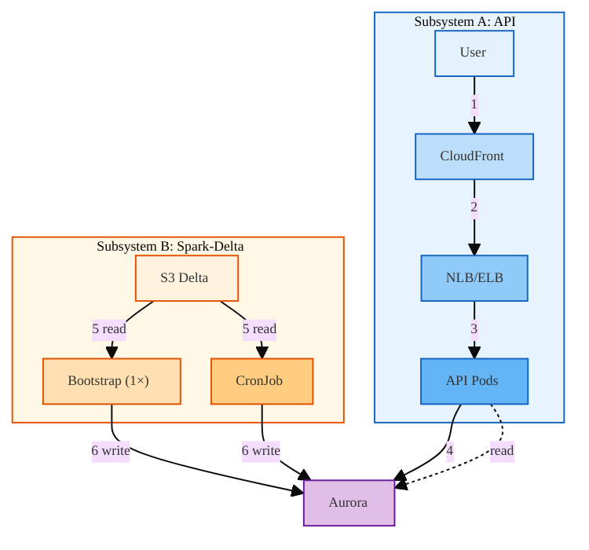
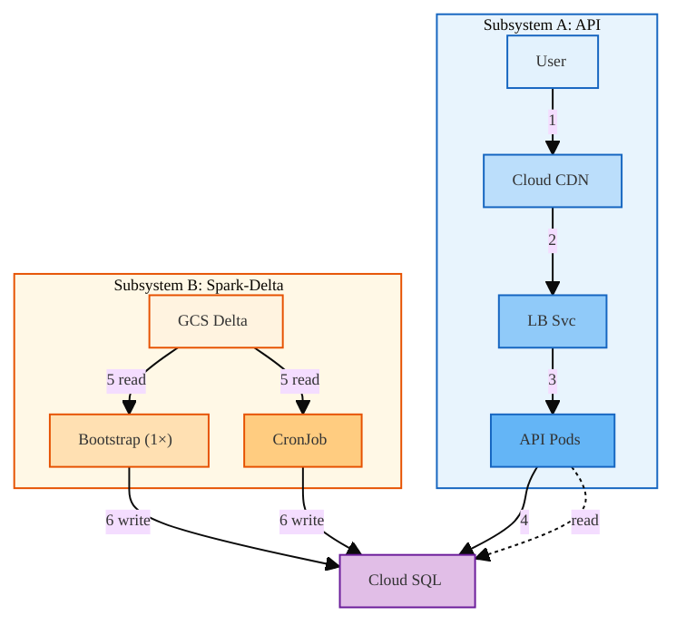
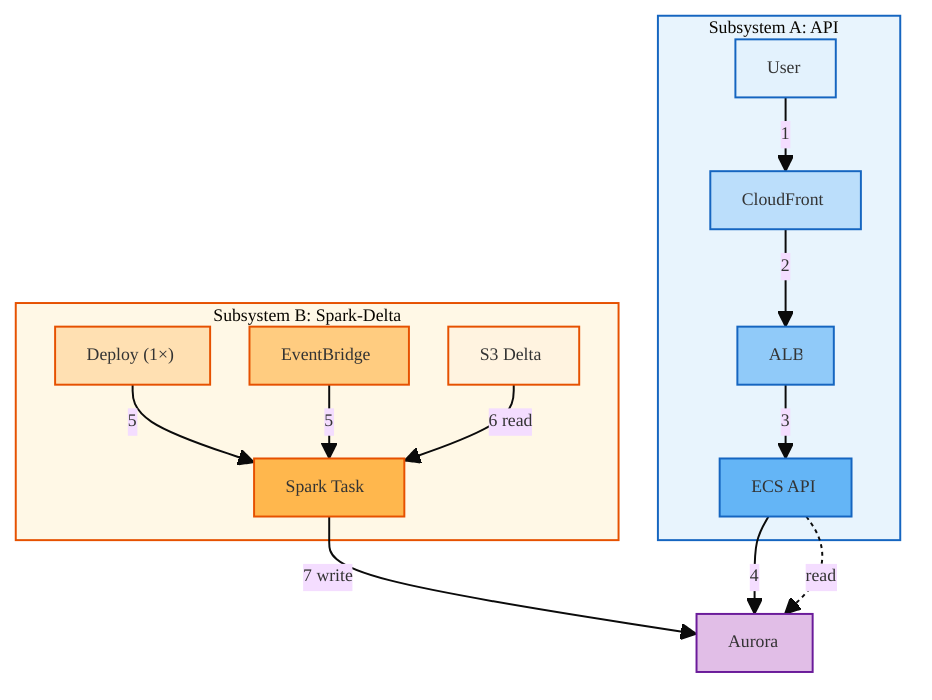
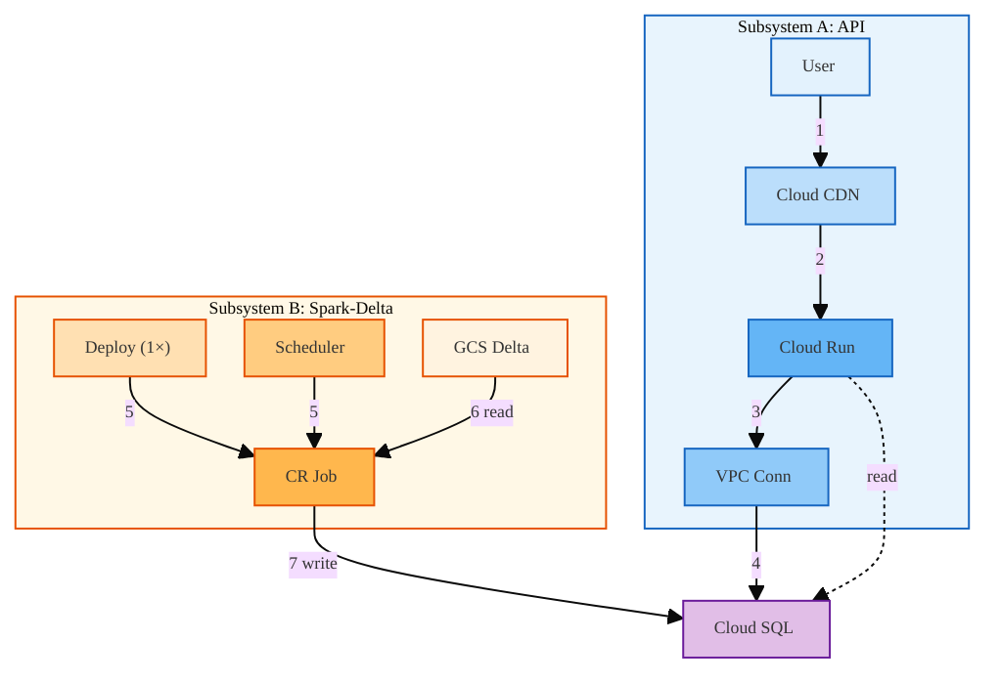

# Architecture: AWS & GCP — General Reference

Colored, detailed architecture diagrams for all four deployment modes. Covers **Subsystem A: API** (CDN → API → DB) and **Subsystem B: Spark-Delta** (bootstrap + periodic → Spark → Delta → `batch_analytics`). Based on deployment scripts and `infra_terraform/live_deploy/{aws,gcp}/` stacks. **Entrypoint:** `orchestrator.py deploy --provider {aws,gcp} --scope {kube,nonkube,all} [--cloud-region REGION]`.

**Stacks:** `infra_terraform/live_deploy/{aws,gcp}/scope_shared/{durable,durable_with_cooloff,nondurable}`, `{aws,gcp}/{kube,nonkube}`.

**Color legend:** Subsystem A (API) — blue tones. Subsystem B (Spark-Delta) — amber/orange tones. Shared — DB.

---

## 1. Kube-based (EKS vs GKE)

### AWS (EKS)

### GCP (GKE)

#### Kube: textual comparison

| Aspect | AWS (EKS) | GCP (GKE) |
|--------|-----------|-----------|
| **Subsystem A flow** | 1. User → CloudFront (HTTPS, SSL at edge). 2. CloudFront → NLB/ELB (HTTP). 3. LB → EKS nodes → fru-api pods. 4. Pods → Aurora. | 1. User → Cloud CDN (HTTPS). 2. Cloud CDN → GKE LB Svc or Ingress (HTTP). 3. LB → fru-api pods. 4. Pods → Cloud SQL via VPC. |
| **Subsystem B flow** | 5. Bootstrap Job + CronJob read Delta from S3 (`s3a://fru-dev-delta-{region}/delta/fru_sales`). 6. Both write to `batch_analytics` in Aurora. | 5. Bootstrap Job + CronJob read Delta from GCS (`gs://fru-dev-delta-{region}/delta/fru_sales`). 6. Both write to `batch_analytics` in Cloud SQL. |
| **CDN** | CloudFront | Cloud CDN |
| **LB** | NLB/ELB | GKE LoadBalancer Service |
| **Compute** | EKS pods | GKE pods |
| **DB** | Aurora | Cloud SQL |
| **Delta storage** | S3 | GCS |
| **Stack order** | durable → durable_with_cooloff → nondurable → kube | Same |

*Extensible: add columns for Azure (AKS), Oracle (OKE), etc.*

---

## 2. Nonkube-based (ECS vs Cloud Run)

### AWS (ECS)

### GCP (Cloud Run)

#### Nonkube: textual comparison

| Aspect | AWS (ECS) | GCP (Cloud Run) |
|--------|-----------|-----------------|
| **Subsystem A flow** | 1. User → CloudFront (HTTPS). 2. CloudFront → ALB (HTTP). 3. ALB → ECS Fargate API tasks. 4. Tasks → Aurora. | 1. User → Cloud CDN (HTTPS). 2. Cloud CDN → Cloud Run API (`*.run.app`). 3. API → VPC connector. 4. VPC connector → Cloud SQL. |
| **Subsystem B flow** | 5. Deploy runs one-off `run-task`; EventBridge triggers Spark on schedule. 6. Spark reads Delta from S3. 7. Spark writes to Aurora. | 5. Deploy runs `gcloud run jobs execute` once; Cloud Scheduler invokes same Job on schedule. 6. Spark reads Delta from GCS. 7. Job writes to Cloud SQL via VPC connector. |
| **CDN** | CloudFront | Cloud CDN |
| **API compute** | ECS Fargate + ALB | Cloud Run (built-in LB) |
| **DB** | Aurora | Cloud SQL |
| **Delta storage** | S3 | GCS |
| **Spark scheduler** | EventBridge → ECS RunTask | Cloud Scheduler → Cloud Run Job |
| **Stack order** | durable → durable_with_cooloff → nondurable → nonkube | Same |

*Extensible: add columns for Azure (Container Apps), Oracle (OCI Functions), etc.*

---

## 3. Pattern: API + Frontend + Spark-Delta on Cloud

| Aspect | AWS | GCP |
|--------|:----:|:----:|
| **Frontend** | S3 + CloudFront | GCS + Cloud CDN |
| **API (nonkube)** | ECS Fargate + ALB | Cloud Run |
| **API (kube)** | EKS + NLB/ELB | GKE + LB Svc |
| **DB** | Aurora | Cloud SQL |
| **Delta** | S3 (`s3a://`) | GCS (`gs://`) |
| **Spark (kube)** | EKS CronJob | GKE CronJob |
| **Spark (nonkube)** | EventBridge → ECS RunTask | Cloud Scheduler → Cloud Run Job |
| **Shared table** | `batch_analytics` (API reads, Spark writes) | Same |

*Add columns for Azure, Oracle, etc. when extending to more providers.*

**Two subsystems per deployment:**
1. **Subsystem A: API** — CDN → API origin (LB or serverless) → compute (containers) → DB. Serves `/analytics` (reads `batch_analytics`), `/query`, etc.
2. **Subsystem B: Spark-Delta** — One-off bootstrap at deploy + periodic scheduler → Spark compute → reads Delta (object storage) → writes `batch_analytics` (DB). No direct API↔Spark; they share the DB. See [ANALYTICS_AND_DATA.md](ANALYTICS_AND_DATA.md) and [TWO_SUB_SYSTEMS_WITH_SPARK.md](../spark_delta/TWO_SUB_SYSTEMS_WITH_SPARK.md).

---

## 4. Extensibility to Other Providers

When adding Oracle, Azure, Huawei, or another provider:

1. **Mirror stack layout:** `live_deploy/<provider>/scope_shared/{durable,durable_with_cooloff,nondurable}`, `{provider}/{kube,nonkube}`.
2. **Map components:** VPC, managed DB, object storage, container runtime, LB, CDN, secrets. See [COMMON_CLOUD_COMPONENTS.md](COMMON_CLOUD_COMPONENTS.md).
3. **DB access:** Decide if deploy host can reach DB directly (AWS-style) or needs in-VPC/serverless helper (GCP-style).
4. **Spark-Delta:** Map Delta storage (S3/GCS → Azure Blob, OCI Object Storage, etc.), Spark scheduler (EventBridge/Cloud Scheduler → Azure Logic Apps, OCI Events, etc.), and Spark compute (CronJob vs serverless job). Spark job needs credentials for object storage and DB.
5. **Orchestrator:** Add provider branch in `orchestrator.py`; route to `tools/<provider>/deploy.py`, `teardown.py`, etc.

---

## 5. Optimization Opportunities

| Opportunity | Description |
|-------------|-------------|
| **Content-based build skip** | Hash build context; skip Docker build when unchanged. See [DEPLOY_BUILD_DOCKER.md](DEPLOY_BUILD_DOCKER.md). |
| **Single kube apply** | When LB hostname known before first apply, skip second Terraform apply. |
| **Skip import + apply** | When plan shows no changes, skip import and apply for that stack. |
| **VPC tag lifecycle** | `lifecycle { ignore_changes = [tags] }` on subnets to avoid durable/kube tag drift. |
| **IRSA for EKS** | Replace static keys in EKS pods with IAM Roles for Service Accounts. |

---

## 6. Related Docs

- [KUBE_LB.md](KUBE_LB.md) — NLB vs Classic ELB for AWS kube
- [VPC_AND_NETWORK.md](VPC_AND_NETWORK.md) — VPC concepts
- [ANALYTICS_AND_DATA.md](ANALYTICS_AND_DATA.md) — Shared Delta + batch_analytics
- [TWO_SUB_SYSTEMS_WITH_SPARK.md](../spark_delta/TWO_SUB_SYSTEMS_WITH_SPARK.md) — Analytics vs Query/LLM subsystems, data flow
