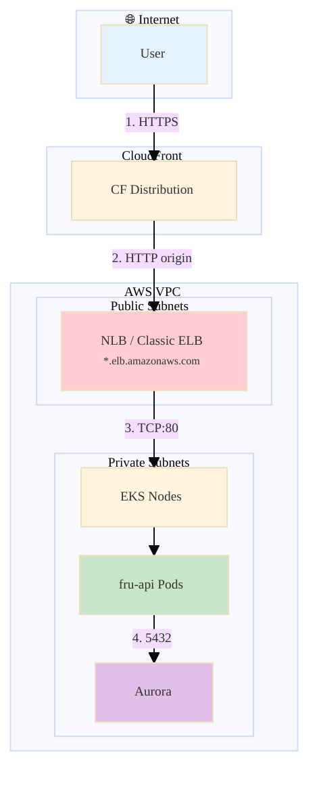
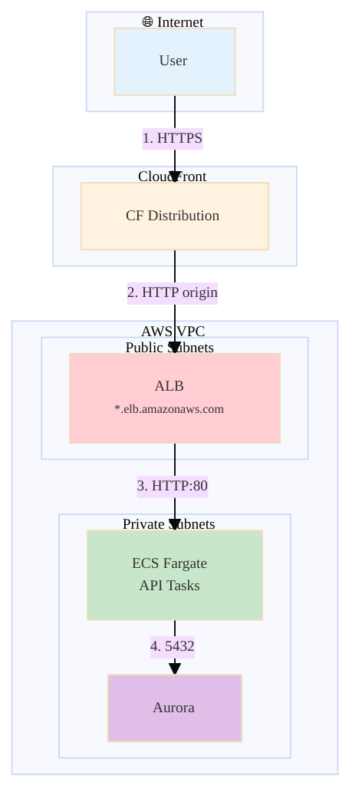
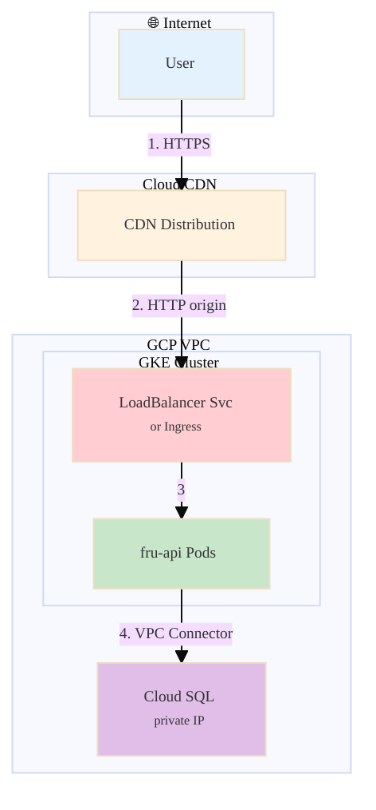
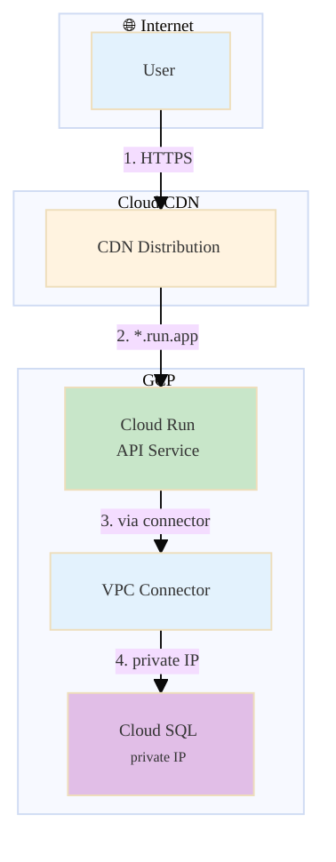

# Architecture: AWS & GCP — General Reference

Colored, detailed architecture diagrams for all four deployment modes. Based on deployment scripts and `infra_terraform/live_deploy/{aws,gcp}/` stacks. **Entrypoint:** `orchestrator.py deploy --provider {aws,gcp} --scope {kube,nonkube,all} [--cloud-region REGION]`.

**Stacks:** `infra_terraform/live_deploy/{aws,gcp}/scope_shared/{durable,durable_with_cooloff,nondurable}`, `{aws,gcp}/{kube,nonkube}`.

---

## 1. AWS Kube (EKS)

**Numerated flow:**
1. User → CloudFront (HTTPS, SSL termination at edge).
2. CloudFront → NLB/ELB (HTTP; LB has no ACM cert).
3. LB → EKS nodes (NodePort / kube-proxy) → fru-api pods.
4. Pods → Aurora (PGHOST from Secrets Manager).

**Stack order:** durable → durable_with_cooloff → nondurable → kube. Kube creates EKS, CloudFront, frontend S3; subnet tags for LB placement. See [KUBE_LB.md](KUBE_LB.md).

---

## 2. AWS Nonkube (ECS)

**Numerated flow:**
1. User → CloudFront (HTTPS).
2. CloudFront → ALB (HTTP; Terraform-created in public subnets).
3. ALB → ECS Fargate API tasks (target group).
4. Tasks → Aurora (PGHOST from task env via Secrets Manager).

**Stack order:** durable → durable_with_cooloff → nondurable → nonkube. Nonkube creates ECS cluster, ALB, EventBridge (Spark schedule), CloudFront. **DNS:** ALB hostname available immediately (no LB propagation delay).

---

## 3. GCP Kube (GKE)

**Numerated flow:**
1. User → Cloud CDN (HTTPS).
2. Cloud CDN → GKE LoadBalancer Service or Ingress (HTTP).
3. LB → fru-api pods.
4. Pods → Cloud SQL via VPC connector (private IP).

**Stack order:** durable → durable_with_cooloff → nondurable → kube. GKE uses `api-service-gke.yaml`; Cloud SQL via VPC connector. Delta in GCS.

---

## 4. GCP Nonkube (Cloud Run)

**Numerated flow:**
1. User → Cloud CDN (HTTPS).
2. Cloud CDN → Cloud Run API service (`*.run.app`; built-in LB).
3. API → VPC connector (bridges Cloud Run to VPC).
4. VPC connector → Cloud SQL (private IP).

**Stack order:** durable → durable_with_cooloff → nondurable → nonkube. Cloud Run runs outside VPC; VPC connector bridges to Cloud SQL. See [GCP_API_CLOUD_SQL_WIRING.md](GCP_API_CLOUD_SQL_WIRING.md).

---

## 5. Pattern: API + Frontend on Cloud

| Aspect | AWS | GCP |
|--------|-----|-----|
| **Frontend** | S3 + CloudFront | GCS + Cloud CDN |
| **API (nonkube)** | ECS Fargate + ALB | Cloud Run |
| **API (kube)** | EKS + NLB/ELB | GKE + LB Svc |
| **DB** | Aurora | Cloud SQL |
| **Delta** | S3 | GCS |
| **Spark schedule** | EventBridge (nonkube) / CronJob (kube) | Cloud Scheduler (nonkube) / CronJob (kube) |

**Common pattern:** CDN → API origin (LB or serverless) → compute (containers) → DB. Secrets from provider secret store (Secrets Manager / Secret Manager).

---

## 6. Extensibility to Other Providers

When adding Oracle, Azure, Huawei, or another provider:

1. **Mirror stack layout:** `live_deploy/<provider>/scope_shared/{durable,durable_with_cooloff,nondurable}`, `{provider}/{kube,nonkube}`.
2. **Map components:** VPC, managed DB, object storage, container runtime, LB, CDN, secrets. See [COMMON_CLOUD_COMPONENTS.md](COMMON_CLOUD_COMPONENTS.md).
3. **DB access:** Decide if deploy host can reach DB directly (AWS-style) or needs in-VPC/serverless helper (GCP-style).
4. **Orchestrator:** Add provider branch in `orchestrator.py`; route to `tools/<provider>/deploy.py`, `teardown.py`, etc.

---

## 7. Optimization Opportunities

| Opportunity | Description |
|-------------|-------------|
| **Content-based build skip** | Hash build context; skip Docker build when unchanged. See [DEPLOY_BUILD_DOCKER.md](DEPLOY_BUILD_DOCKER.md). |
| **Single kube apply** | When LB hostname known before first apply, skip second Terraform apply. |
| **Skip import + apply** | When plan shows no changes, skip import and apply for that stack. |
| **VPC tag lifecycle** | `lifecycle { ignore_changes = [tags] }` on subnets to avoid durable/kube tag drift. |
| **IRSA for EKS** | Replace static keys in EKS pods with IAM Roles for Service Accounts. |

---

## 8. Related Docs

- [KUBE_LB.md](KUBE_LB.md) — NLB vs Classic ELB for AWS kube
- [VPC_AND_NETWORK.md](VPC_AND_NETWORK.md) — VPC concepts
- [ANALYTICS_AND_DATA.md](ANALYTICS_AND_DATA.md) — Shared Delta + batch_analytics
