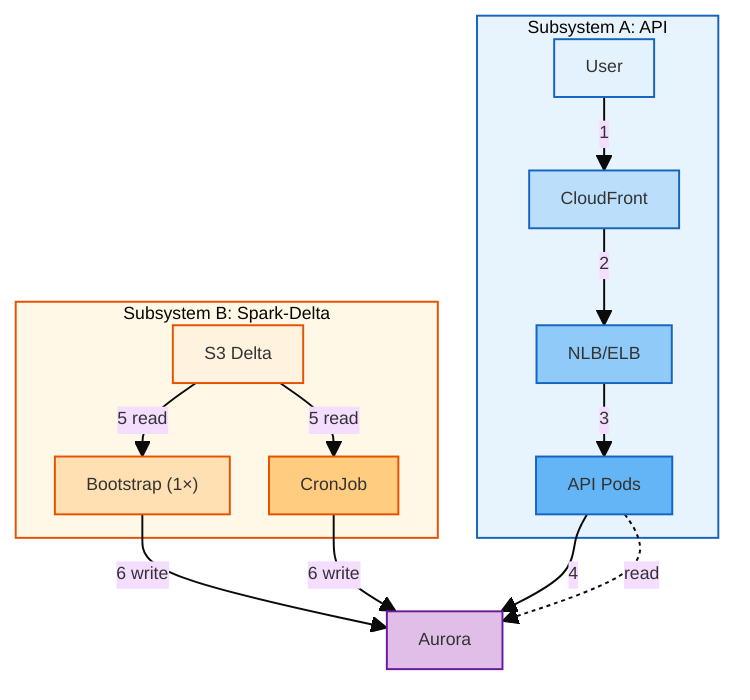
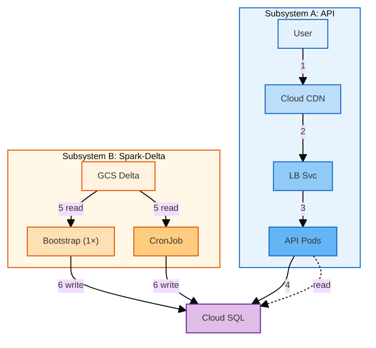
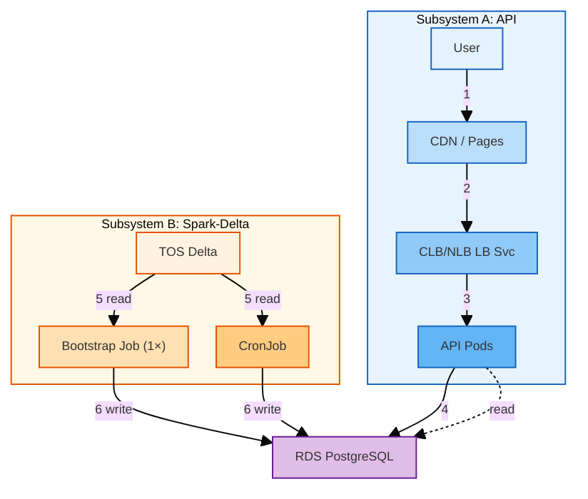
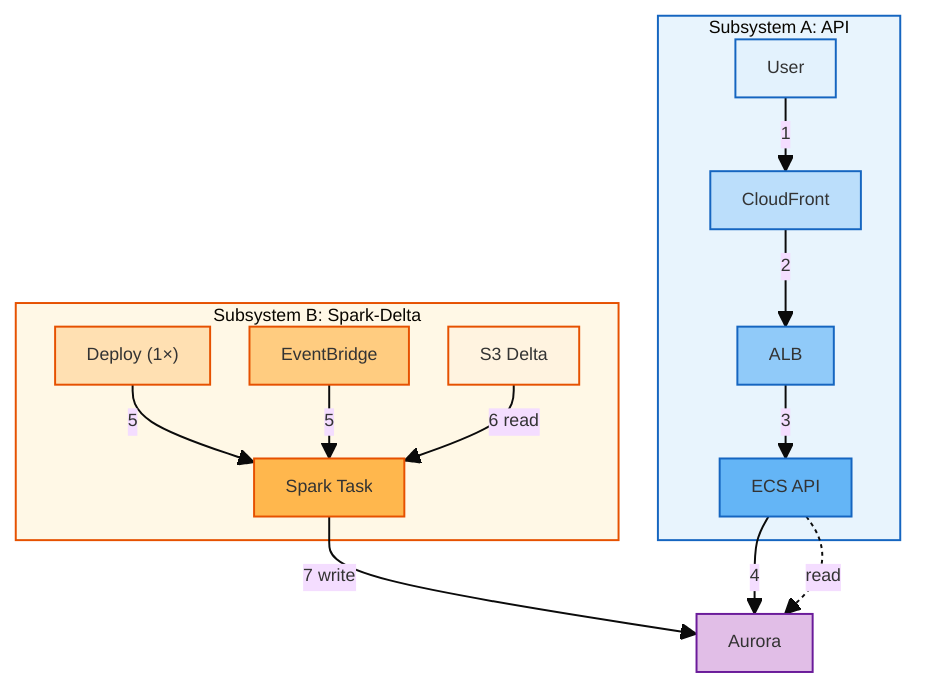
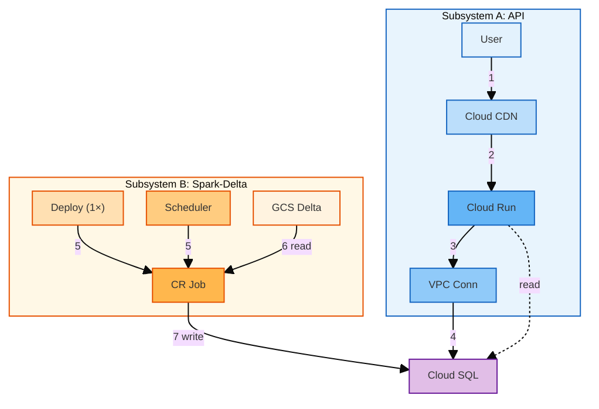

# Architecture: AWS, GCP & BytePlus (VKE) — General Reference

Colored, detailed architecture diagrams for deployment modes. Covers **Subsystem A: API** (CDN → API → DB) and **Subsystem B: Spark-Delta** (bootstrap + periodic → Spark → Delta → `batch_analytics`). Based on deployment scripts and `infra_terraform/live_deploy/{aws,gcp}/` stacks for **AWS and GCP** (implemented). **BytePlus (VKE)** column reflects the **planned** kube path in [REFACTOR_VKE_BYTEPLUS.md](../../cursor_gen/refactor_plans/REFACTOR_VKE_BYTEPLUS.md) mapped to [BytePlus VKE docs](https://docs.byteplus.com/en/docs/vke/What-is-Vital-Kubernetes-Engine) — not yet in `orchestrator.py` / `live_deploy/byteplus/`.

**Entrypoint (implemented):** `orchestrator.py deploy --provider {aws,gcp} --scope {kube,nonkube,all} [--cloud-region REGION]`. **Planned:** `--provider byteplus --scope kube` (VKE only; nonkube deferred to VCI).

**Stacks (implemented):** `infra_terraform/live_deploy/{aws,gcp}/scope_shared/{durable,durable_with_cooloff,nondurable}`, `{aws,gcp}/{kube,nonkube}`.

**Color legend:** Subsystem A (API) — blue tones. Subsystem B (Spark-Delta) — amber/orange tones. Shared — DB. All three kube diagrams (AWS, GCP, BytePlus) use the same palette; BytePlus is **planned** — see sources in §1.

---

## 1. Kube-based (EKS vs GKE vs VKE)

### AWS (EKS)

```mermaid
%%{init: {'theme':'base', 'themeVariables': {'fontSize':'9px', 'fontFamily':'sans-serif'}, 'flowchart': {'nodeSpacing':20, 'rankSpacing':24, 'padding':8, 'useMaxWidth':true}}}%%
flowchart TB
    subgraph subA["Subsystem A: API"]
        direction TB
        U1["User"]
        CF1["CloudFront"]
        LB1["NLB/ELB"]
        POD1["API Pods"]
        U1 -->|"1"| CF1
        CF1 -->|"2"| LB1
        LB1 -->|"3"| POD1
    end

    subgraph subB["Subsystem B: Spark-Delta"]
        direction TB
        BOOT1["Bootstrap (1×)"]
        CRON1["CronJob"]
        S31["S3 Delta"]
        S31 -->|"5 read"| BOOT1
        S31 -->|"5 read"| CRON1
    end

    AUR1["Aurora"]

    POD1 -->|"4"| AUR1
    BOOT1 -->|"6 write"| AUR1
    CRON1 -->|"6 write"| AUR1
    POD1 -.->|"read"| AUR1

    style U1 fill:#e3f2fd,stroke:#1565c0
    style CF1 fill:#bbdefb,stroke:#1565c0
    style LB1 fill:#90caf9,stroke:#1565c0
    style POD1 fill:#64b5f6,stroke:#1565c0
    style subA fill:#e8f4fd,stroke:#1565c0
    style subB fill:#fff8e6,stroke:#e65100
    style BOOT1 fill:#ffe0b2,stroke:#e65100
    style CRON1 fill:#ffcc80,stroke:#e65100
    style S31 fill:#fff3e0,stroke:#e65100
    style AUR1 fill:#e1bee7,stroke:#6a1b9a
```

### GCP (GKE)

```mermaid
%%{init: {'theme':'base', 'themeVariables': {'fontSize':'9px', 'fontFamily':'sans-serif'}, 'flowchart': {'nodeSpacing':20, 'rankSpacing':24, 'padding':8, 'useMaxWidth':true}}}%%
flowchart TB
    subgraph subA3["Subsystem A: API"]
        direction TB
        U3["User"]
        CDN3["Cloud CDN"]
        LB3["LB Svc"]
        POD3["API Pods"]
        U3 -->|"1"| CDN3
        CDN3 -->|"2"| LB3
        LB3 -->|"3"| POD3
    end

    subgraph subB3["Subsystem B: Spark-Delta"]
        direction TB
        BOOT3["Bootstrap (1×)"]
        CRON3["CronJob"]
        GCS3["GCS Delta"]
        GCS3 -->|"5 read"| BOOT3
        GCS3 -->|"5 read"| CRON3
    end

    SQL3["Cloud SQL"]

    POD3 -->|"4"| SQL3
    BOOT3 -->|"6 write"| SQL3
    CRON3 -->|"6 write"| SQL3
    POD3 -.->|"read"| SQL3

    style U3 fill:#e3f2fd,stroke:#1565c0
    style CDN3 fill:#bbdefb,stroke:#1565c0
    style LB3 fill:#90caf9,stroke:#1565c0
    style POD3 fill:#64b5f6,stroke:#1565c0
    style subA3 fill:#e8f4fd,stroke:#1565c0
    style subB3 fill:#fff8e6,stroke:#e65100
    style BOOT3 fill:#ffe0b2,stroke:#e65100
    style CRON3 fill:#ffcc80,stroke:#e65100
    style GCS3 fill:#fff3e0,stroke:#e65100
    style SQL3 fill:#e1bee7,stroke:#6a1b9a
```

### BytePlus (VKE) — planned

Same two-subsystem shape as EKS/GKE. **VKE** = [Vital Kubernetes Engine](https://docs.byteplus.com/en/docs/vke/What-is-Vital-Kubernetes-Engine): managed Kubernetes on BytePlus (nodes on **ECS** in **VPC**; **containerd** runtime per VKE docs). External exposure uses Kubernetes **LoadBalancer** Services backed by **CLB** or **NLB** ([LoadBalancer Service overview](https://docs.byteplus.com/api/docs/vke/LoadBalancer_service_overview)). Delta on **TOS** ([csi-tos](https://docs.byteplus.com/en/docs/vke/Using-static-TOS-Volumes) / refactor plan). DB target: **RDS for PostgreSQL** (refactor plan `bytepluscc`; [product overview](https://docs.byteplus.com/en/docs/RDS_for_PG/about_rds_for_postgresql)). Frontend: **TOS** static hosting + **BytePlus CDN / Pages** (refactor Phase 8; [Pages overview](https://docs.byteplus.com/en/docs/byteplus-cdn/host_static_pages_console_en)).

```mermaid
%%{init: {'theme':'base', 'themeVariables': {'fontSize':'9px', 'fontFamily':'sans-serif'}, 'flowchart': {'nodeSpacing':20, 'rankSpacing':24, 'padding':8, 'useMaxWidth':true}}}%%
flowchart TB
    subgraph subA5["Subsystem A: API"]
        direction TB
        U5["User"]
        CDN5["CDN / Pages"]
        LB5["CLB/NLB LB Svc"]
        POD5["API Pods"]
        U5 -->|"1"| CDN5
        CDN5 -->|"2"| LB5
        LB5 -->|"3"| POD5
    end

    subgraph subB5["Subsystem B: Spark-Delta"]
        direction TB
        BOOT5["Bootstrap Job (1×)"]
        CRON5["CronJob"]
        TOS5["TOS Delta"]
        TOS5 -->|"5 read"| BOOT5
        TOS5 -->|"5 read"| CRON5
    end

    RDS5["RDS PostgreSQL"]

    POD5 -->|"4"| RDS5
    BOOT5 -->|"6 write"| RDS5
    CRON5 -->|"6 write"| RDS5
    POD5 -.->|"read"| RDS5

    style U5 fill:#e3f2fd,stroke:#1565c0
    style CDN5 fill:#bbdefb,stroke:#1565c0
    style LB5 fill:#90caf9,stroke:#1565c0
    style POD5 fill:#64b5f6,stroke:#1565c0
    style subA5 fill:#e8f4fd,stroke:#1565c0
    style subB5 fill:#fff8e6,stroke:#e65100
    style BOOT5 fill:#ffe0b2,stroke:#e65100
    style CRON5 fill:#ffcc80,stroke:#e65100
    style TOS5 fill:#fff3e0,stroke:#e65100
    style RDS5 fill:#e1bee7,stroke:#6a1b9a
```

#### Kube: textual comparison

| Aspect | AWS (EKS) | GCP (GKE) | BytePlus (VKE) — planned |
|--------|-----------|-----------|--------------------------|
| **Repo status** | Implemented (`--provider aws --scope kube`) | Implemented (`--provider gcp --scope kube`) | **Planned** — [REFACTOR_VKE_BYTEPLUS.md](../../cursor_gen/refactor_plans/REFACTOR_VKE_BYTEPLUS.md); `--scope nonkube` deferred to **VCI** |
| **Managed K8s** | Amazon EKS | Google GKE | **Vital Kubernetes Engine (VKE)** — managed cluster service; worker nodes on **ECS** in **VPC** ([What is VKE](https://docs.byteplus.com/en/docs/vke/What-is-Vital-Kubernetes-Engine), [dependencies](https://docs.byteplus.com/en/docs/vke/Dependencies-between-VKE-and-other-cloud-services)) |
| **Subsystem A flow** | 1. User → CloudFront (HTTPS, SSL at edge). 2. CloudFront → NLB/ELB (HTTP). 3. LB → EKS nodes → fru-api pods. 4. Pods → Aurora. | 1. User → Cloud CDN (HTTPS). 2. Cloud CDN → GKE LB Svc or Ingress (HTTP). 3. LB → fru-api pods. 4. Pods → Cloud SQL via VPC. | 1. User → **BytePlus CDN / Pages** or TOS static site (HTTPS; Phase 8). 2. Edge → **CLB/NLB** via VKE **LoadBalancer Service** ([overview](https://docs.byteplus.com/api/docs/vke/LoadBalancer_service_overview)). 3. LB → **VKE** fru-api pods (images from **CR**). 4. Pods → **RDS for PostgreSQL** in VPC. |
| **Subsystem B flow** | 5. Bootstrap Job + CronJob read Delta from S3 (`s3a://fru-dev-delta-{region}/delta/fru_sales`). 6. Both write to `batch_analytics` in Aurora. | 5. Bootstrap Job + CronJob read Delta from GCS (`gs://fru-dev-delta-{region}/delta/fru_sales`). 6. Both write to `batch_analytics` in Cloud SQL. | 5. **Bootstrap Job** + **CronJob** on VKE read Delta from **TOS** (refactor plan: TOS paths in J2 templates; VKE supports Jobs/CronJobs per product docs). 6. Both write to `batch_analytics` in **RDS PostgreSQL** (pgvector column per MODELARK + VKE plan). |
| **CDN / static UI** | CloudFront + S3 | Cloud CDN + GCS | **TOS** static website ([TOS static site](https://docs.byteplus.com/en/docs/tos/Set-up-a-static-website)) + **BytePlus CDN / Pages** global delivery ([Pages overview](https://docs.byteplus.com/en/docs/byteplus-cdn/host_static_pages_console_en)) — exact FRU wiring in Phase 8 |
| **LB** | NLB/ELB | GKE LoadBalancer Service | VKE **LoadBalancer Service** → **CLB** or **NLB** (Layer-4; annotation-configured) |
| **Compute** | EKS pods | GKE pods | VKE pods (on ECS worker nodes; optional **VCI** virtual nodes — not FRU nonkube MVP) |
| **Container registry** | ECR | Artifact Registry | **Container Registry (CR)** + `cr-credential-controller` add-on ([CR ↔ VKE](https://docs.byteplus.com/en/docs/cr/pull-images-over-the-internal-network-without-providing-credentials)) |
| **DB** | Aurora | Cloud SQL | **RDS for PostgreSQL** — managed PostgreSQL ([about](https://docs.byteplus.com/en/docs/RDS_for_PG/about_rds_for_postgresql)) |
| **Delta storage** | S3 | GCS | **TOS** (Torch Object Storage; VKE **csi-tos** add-on) |
| **Spark scheduler (kube)** | Kubernetes CronJob | Kubernetes CronJob | Kubernetes **CronJob** on VKE (same pattern as AWS/GKE in shared J2 templates) |
| **Stack order** | durable → durable_with_cooloff → nondurable → kube | Same | **Planned:** durable → durable_with_cooloff → **kube (VKE) only** — no `live_deploy/byteplus/nonkube` in MVP |
| **Regions (plan)** | e.g. `us-east-2` | e.g. `us-central1` | **Primary:** `ap-southeast-1` (Johor); **secondary:** `cn-beijing` ([refactor plan](../../cursor_gen/refactor_plans/REFACTOR_VKE_BYTEPLUS.md#phase-2-region-config)) |

**EKS ↔ GKE ↔ VKE mapping (verified product names only):**

| Layer | AWS | GCP | BytePlus |
|-------|-----|-----|----------|
| Managed Kubernetes | EKS | GKE | **VKE** |
| VPC | VPC | VPC | **VPC** |
| Worker nodes | EC2 (EKS) | GCE (GKE) | **ECS** (VKE nodes) |
| L4 load balancing | NLB/ELB | GKE LB Service | **CLB / NLB** via LoadBalancer Service |
| L7 ingress (optional) | ALB Ingress / CF | GKE Ingress | **ALB Ingress**, **CLB Ingress**, **NGINX Ingress** (VKE docs) |
| Object storage | S3 | GCS | **TOS** |
| Managed RDBMS | Aurora | Cloud SQL | **RDS for PostgreSQL** |
| Container registry | ECR | Artifact Registry | **CR** |
| Serverless containers (nonkube) | ECS Fargate | Cloud Run | **VCI** — deferred for FRU |

*Sources: BytePlus [What is VKE](https://docs.byteplus.com/en/docs/vke/What-is-Vital-Kubernetes-Engine), [VKE cloud dependencies](https://docs.byteplus.com/en/docs/vke/Dependencies-between-VKE-and-other-cloud-services), [LoadBalancer Service overview](https://docs.byteplus.com/api/docs/vke/LoadBalancer_service_overview), [RDS for PostgreSQL](https://docs.byteplus.com/en/docs/RDS_for_PG/about_rds_for_postgresql); repo [REFACTOR_VKE_BYTEPLUS.md](../../cursor_gen/refactor_plans/REFACTOR_VKE_BYTEPLUS.md).*

*Extensible: add columns for Azure (AKS), Oracle (OKE), etc.*

---

## 2. Nonkube-based (ECS vs Cloud Run)

### AWS (ECS)

```mermaid
%%{init: {'theme':'base', 'themeVariables': {'fontSize':'9px', 'fontFamily':'sans-serif'}, 'flowchart': {'nodeSpacing':20, 'rankSpacing':24, 'padding':8, 'useMaxWidth':true}}}%%
flowchart TB
    subgraph subA2["Subsystem A: API"]
        direction TB
        U2["User"]
        CF2["CloudFront"]
        ALB2["ALB"]
        ECS2["ECS API"]
        U2 -->|"1"| CF2
        CF2 -->|"2"| ALB2
        ALB2 -->|"3"| ECS2
    end

    subgraph subB2["Subsystem B: Spark-Delta"]
        direction TB
        BOOT2["Deploy (1×)"]
        EB2["EventBridge"]
        SPARK2["Spark Task"]
        S32["S3 Delta"]
        BOOT2 -->|"5"| SPARK2
        EB2 -->|"5"| SPARK2
        S32 -->|"6 read"| SPARK2
    end

    AUR2["Aurora"]

    ECS2 -->|"4"| AUR2
    SPARK2 -->|"7 write"| AUR2
    ECS2 -.->|"read"| AUR2

    style U2 fill:#e3f2fd,stroke:#1565c0
    style CF2 fill:#bbdefb,stroke:#1565c0
    style ALB2 fill:#90caf9,stroke:#1565c0
    style ECS2 fill:#64b5f6,stroke:#1565c0
    style subA2 fill:#e8f4fd,stroke:#1565c0
    style subB2 fill:#fff8e6,stroke:#e65100
    style BOOT2 fill:#ffe0b2,stroke:#e65100
    style EB2 fill:#ffcc80,stroke:#e65100
    style SPARK2 fill:#ffb74d,stroke:#e65100
    style S32 fill:#fff3e0,stroke:#e65100
    style AUR2 fill:#e1bee7,stroke:#6a1b9a
```

### GCP (Cloud Run)

```mermaid
%%{init: {'theme':'base', 'themeVariables': {'fontSize':'9px', 'fontFamily':'sans-serif'}, 'flowchart': {'nodeSpacing':20, 'rankSpacing':24, 'padding':8, 'useMaxWidth':true}}}%%
flowchart TB
    subgraph subA4["Subsystem A: API"]
        direction TB
        U4["User"]
        CDN4["Cloud CDN"]
        CR4["Cloud Run"]
        VPC4["VPC Conn"]
        U4 -->|"1"| CDN4
        CDN4 -->|"2"| CR4
        CR4 -->|"3"| VPC4
    end

    subgraph subB4["Subsystem B: Spark-Delta"]
        direction TB
        BOOT4["Deploy (1×)"]
        CS4["Scheduler"]
        CRJ4["CR Job"]
        GCS4["GCS Delta"]
        BOOT4 -->|"5"| CRJ4
        CS4 -->|"5"| CRJ4
        GCS4 -->|"6 read"| CRJ4
    end

    SQL4["Cloud SQL"]

    VPC4 -->|"4"| SQL4
    CRJ4 -->|"7 write"| SQL4
    CR4 -.->|"read"| SQL4

    style U4 fill:#e3f2fd,stroke:#1565c0
    style CDN4 fill:#bbdefb,stroke:#1565c0
    style CR4 fill:#64b5f6,stroke:#1565c0
    style VPC4 fill:#90caf9,stroke:#1565c0
    style subA4 fill:#e8f4fd,stroke:#1565c0
    style subB4 fill:#fff8e6,stroke:#e65100
    style BOOT4 fill:#ffe0b2,stroke:#e65100
    style CS4 fill:#ffcc80,stroke:#e65100
    style CRJ4 fill:#ffb74d,stroke:#e65100
    style GCS4 fill:#fff3e0,stroke:#e65100
    style SQL4 fill:#e1bee7,stroke:#6a1b9a
```

#### Nonkube: textual comparison

| Aspect | AWS (ECS) | GCP (Cloud Run) |
|--------|-----------|-----------------|
| **Subsystem A flow** | 1. User → CloudFront (HTTPS). 2. CloudFront → ALB (HTTP). 3. ALB → ECS Fargate API tasks. 4. Tasks → Aurora. | 1. User → Cloud CDN (HTTPS). 2. Cloud CDN → Cloud Run API (`*.run.app`). 3. API → VPC connector. 4. VPC connector → Cloud SQL. |
| **Subsystem B flow** | 5. Deploy runs one-off `run-task`; EventBridge triggers Spark on schedule. 6. Spark reads Delta from S3. 7. Spark writes to Aurora. | 5. Deploy runs `gcloud run jobs execute` once; Cloud Scheduler invokes same Job on schedule. 6. Spark reads Delta from GCS. 7. Job writes to Cloud SQL via VPC connector. |
| **CDN** | CloudFront | Cloud CDN |
| **API compute** | ECS Fargate + ALB | Cloud Run (built-in LB) |
| **DB** | Aurora | Cloud SQL |
| **Delta storage** | S3 | GCS |
| **Spark scheduler** | EventBridge → ECS RunTask | Cloud Scheduler → Cloud Run Job |
| **Stack order** | durable → durable_with_cooloff → nondurable → nonkube | Same |

*Extensible: add columns for Azure (Container Apps), Oracle (OCI Functions), etc.*

---

## 3. Pattern: API + Frontend + Spark-Delta on Cloud

| Aspect | AWS | GCP |
|--------|:----:|:----:|
| **Frontend** | S3 + CloudFront | GCS + Cloud CDN |
| **API (nonkube)** | ECS Fargate + ALB | Cloud Run |
| **API (kube)** | EKS + NLB/ELB | GKE + LB Svc |
| **DB** | Aurora | Cloud SQL |
| **Delta** | S3 (`s3a://`) | GCS (`gs://`) |
| **Spark (kube)** | EKS CronJob | GKE CronJob |
| **Spark (nonkube)** | EventBridge → ECS RunTask | Cloud Scheduler → Cloud Run Job |
| **Shared table** | `batch_analytics` (API reads, Spark writes) | Same |

*Add columns for Azure, Oracle, etc. when extending to more providers.*

**Two subsystems per deployment:**
1. **Subsystem A: API** — CDN → API origin (LB or serverless) → compute (containers) → DB. Serves `/analytics` (reads `batch_analytics`), `/query`, etc.
2. **Subsystem B: Spark-Delta** — One-off bootstrap at deploy + periodic scheduler → Spark compute → reads Delta (object storage) → writes `batch_analytics` (DB). No direct API↔Spark; they share the DB. See [ANALYTICS_AND_DATA.md](ANALYTICS_AND_DATA.md) and [TWO_SUB_SYSTEMS_WITH_SPARK.md](../spark_delta/TWO_SUB_SYSTEMS_WITH_SPARK.md).

---

## 4. Extensibility to Other Providers

When adding Oracle, Azure, Huawei, or another provider:

1. **Mirror stack layout:** `live_deploy/<provider>/scope_shared/{durable,durable_with_cooloff,nondurable}`, `{provider}/{kube,nonkube}`.
2. **Map components:** VPC, managed DB, object storage, container runtime, LB, CDN, secrets. See [COMMON_CLOUD_COMPONENTS.md](COMMON_CLOUD_COMPONENTS.md).
3. **DB access:** Decide if deploy host can reach DB directly (AWS-style) or needs in-VPC/serverless helper (GCP-style).
4. **Spark-Delta:** Map Delta storage (S3/GCS → Azure Blob, OCI Object Storage, etc.), Spark scheduler (EventBridge/Cloud Scheduler → Azure Logic Apps, OCI Events, etc.), and Spark compute (CronJob vs serverless job). Spark job needs credentials for object storage and DB.
5. **Orchestrator:** Add provider branch in `orchestrator.py`; route to `tools/<provider>/deploy.py`, `teardown.py`, etc.

---

## 5. Optimization Opportunities

| Opportunity | Description |
|-------------|-------------|
| **Content-based build skip** | Hash build context; skip Docker build when unchanged. See [DEPLOY_BUILD_DOCKER.md](DEPLOY_BUILD_DOCKER.md). |
| **Single kube apply** | When LB hostname known before first apply, skip second Terraform apply. |
| **Skip import + apply** | When plan shows no changes, skip import and apply for that stack. |
| **VPC tag lifecycle** | `lifecycle { ignore_changes = [tags] }` on subnets to avoid durable/kube tag drift. |
| **IRSA for EKS** | Replace static keys in EKS pods with IAM Roles for Service Accounts. |

---

## 6. Related Docs

- [REFACTOR_VKE_BYTEPLUS.md](../../cursor_gen/refactor_plans/REFACTOR_VKE_BYTEPLUS.md) — planned BytePlus VKE deploy (kube only; VCI nonkube deferred)
- [KUBE_LB.md](KUBE_LB.md) — NLB vs Classic ELB for AWS kube
- [VPC_AND_NETWORK.md](VPC_AND_NETWORK.md) — VPC concepts
- [ANALYTICS_AND_DATA.md](ANALYTICS_AND_DATA.md) — Shared Delta + batch_analytics
- [TWO_SUB_SYSTEMS_WITH_SPARK.md](../spark_delta/TWO_SUB_SYSTEMS_WITH_SPARK.md) — Analytics vs Query/LLM subsystems, data flow
