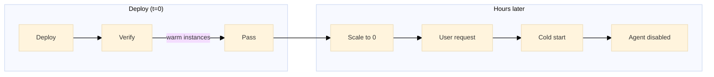
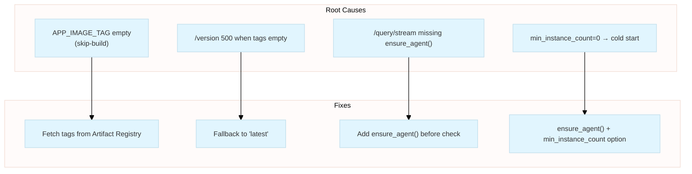
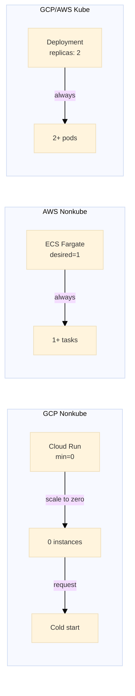
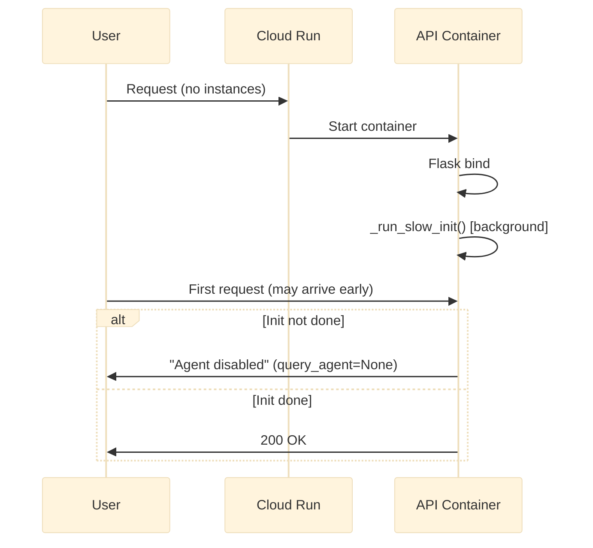
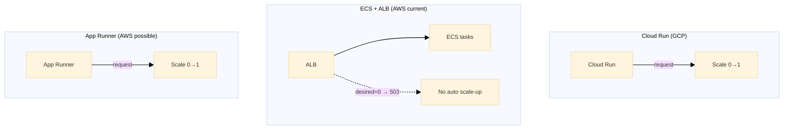

# Backend Scaling for Non-Kubernetes Stacks (Multi-Cloud)

How to set up and operate nonkube infra so the API stays healthy under scale-to-zero, cold starts, and lazy agent init. Extensible for Oracle, Azure, Huawei, etc.

**Related incident:** Verification passed but UI failed hours later (war story #38).

---

## Table of Contents

1. [Background: The Incident](#1-background-the-incident)
2. [Root Causes](#2-root-causes)
3. [Scaling Architecture by Platform](#3-scaling-architecture-by-platform)
4. [Cold vs Warm Instances](#4-cold-vs-warm-instances)
5. [Fixes and Best Practices](#5-fixes-and-best-practices)
6. [Nonkube Backend Comparison (Multi-Cloud)](#6-nonkube-backend-comparison-multi-cloud)
7. [URL Stability](#7-url-stability)
8. [Quick Reference](#8-quick-reference)
9. [Extending to New Providers](#9-extending-to-new-providers)

---

## 1. Background: The Incident

**Symptom:** Nonkube UI showed errors despite verification passing:

| Error | Meaning |
|-------|---------|
| Build: No Version Info Found | `/version` returned 500 |
| Agent-based query processing is disabled | `query_agent` was `None` |
| Backend API not reachable | Frontend couldn't reach `/analytics` |

**Timeline:** Verification passed 10h ago → UI failed 1h ago → Redeploy fixed it.

**Why verification passed but UI failed later:** Verification runs immediately after deploy (warm instances, retries). Hours later, user hit a **cold-started** instance where agent init had failed or not completed.



---

## 2. Root Causes



| Root Cause | Impact | Fix |
|------------|--------|-----|
| **APP_IMAGE_TAG** empty when `--skip-build` | Cloud Run gets `""` → `/version` 500 | GCP deploy: resolve via `get_deploy_image_uris`; nonkube: pass `app_image_tag` (default `"latest"`) |
| **/version** no fallback | 500 when tags empty | Fallback to `CONTAINER_IMAGE` tag or `"latest"` |
| **/query/stream** never calls `ensure_agent()` | UI hits this endpoint; agent stays `None` on cold start | Call `ensure_agent()` before `query_agent is None` check |
| **Scale-to-zero** + lazy agent init | Cold instance may receive traffic before `_run_slow_init()` completes; init can fail | `ensure_agent()` on first request; optionally `min_instance_count=1` |

---

## 3. Scaling Architecture by Platform



| Target | Platform | Scaling Config | Scale-to-Zero | Cold Start Risk |
|--------|----------|----------------|---------------|-----------------|
| **GCP nonkube** | Cloud Run | `min_instance_count=0` | Yes | <span style="color:#c62828">High</span> |
| **AWS nonkube (current)** | ECS Fargate | `desired_count=1` | No | <span style="color:#2e7d32">Low</span> |
| **AWS nonkube (possible)** | App Runner | min provisioned=0 | Yes | <span style="color:#c62828">High</span> |
| **Oracle nonkube** | OCI Container Instances | Custom (Alarms + Functions) | Yes (custom) | <span style="color:#c62828">High</span> |
| **Azure nonkube** | Container Apps / Azure Functions | TBD | TBD | TBD |
| **Huawei nonkube** | CCE / FunctionGraph | TBD | TBD | TBD |
| **GCP kube** | GKE | `replicas: 2` | No | <span style="color:#2e7d32">Low</span> |
| **AWS kube** | EKS | `replicas: 2` | No | <span style="color:#2e7d32">Low</span> |

**Config locations:**

| Provider | Path |
|----------|------|
| GCP | `live_deploy/gcp/nonkube/variables.tf` → `min_instance_count` |
| AWS | `live_deploy/aws/nonkube/variables.tf` → `desired_count` |
| Oracle | `live_deploy/oracle/nonkube/variables.tf` → `min_container_instances` (custom autoscale) |
| Azure | `live_deploy/azure/nonkube/variables.tf` → TBD |
| Huawei | `live_deploy/huawei/nonkube/variables.tf` → TBD |
| Kube (all) | `modules/cloud_shared/k8s/api-deployment*.yaml` → `replicas` |

---

## 4. Cold vs Warm Instances

| Term | Meaning |
|------|---------|
| **Warm** | Instance running; DB pool and agent init done. Requests served quickly. |
| **Cold** | New instance starting. Container boots, Flask starts, `_run_slow_init()` runs in background. Traffic can arrive before init completes. |



**Agent init flow:** `init_agent()` runs lazily (on first request via `get_db_conn()` or `ensure_agent()`). If it fails, `query_agent` stays `None` for that instance's lifetime. **`/query/stream` did not call `ensure_agent()`** — fixed by adding it before the check.

---

## 5. Fixes and Best Practices

### 5.1 Ensure Agent on Primary UI Endpoint

The frontend uses **`/query/stream`** (SSE), not POST `/query`. Ensure agent init is attempted there:

```python
# In /query/stream handler, BEFORE the query_agent is None check:
if USE_AGENT_QUERY and query_agent is None:
    ensure_agent()
```

### 5.2 GCP Skip-Build: Resolve APP_IMAGE_TAG

When using `--skip-build`, resolve tag from Artifact Registry via `get_deploy_image_uris` (mirrors AWS ECR logic):

```python
# tools/gcp/deploy.py - when skip_build and APP_IMAGE_TAG empty
from tools.cloud_shared.deploy_image_resolver import get_deploy_image_uris
app_full, _ = get_deploy_image_uris("gcp", env, region)
os.environ["APP_IMAGE_TAG"] = app_full.split(":")[-1]
```

### 5.3 Nonkube Deploy: Always Pass app_image_tag

```python
# tools/gcp/nonkube/deploy_nonkube.py
plan_vars.append(f"-var=app_image_tag={img_tag or 'latest'}")
```

### 5.4 Version Endpoint Fallback

When `APP_IMAGE_TAG` is empty, derive from `CONTAINER_IMAGE` or use `"unknown"` instead of returning 500.

### 5.5 Optional: Keep One Instance Warm (GCP)

To avoid cold starts entirely:

```hcl
# infra_terraform/live_deploy/gcp/nonkube/variables.tf
variable "min_instance_count" {
  type    = number
  default = 1  # was 0
}
```

Trade-off: ~\$15–25/mo extra vs. no cold-start risk.

---

## 6. Nonkube Backend Comparison (Multi-Cloud)

> **Note:** GCP Cloud Run and AWS App Runner are integrated platforms where the request itself triggers container start. Oracle has no native equivalent; OCI Container Instances require custom autoscale orchestration.

### 6.1 Side-by-Side Comparison

| Aspect | **GCP** Cloud Run | **AWS** ECS + ALB | **AWS** App Runner | **Oracle** OCI | **Azure** | **Huawei** |
|--------|------------------|-------------------|--------------------|--------------|----------|------------|
| **Status** | Current | Current | Possible | Reference arch | TBD | TBD |
| **Compute** | Built-in | ECS Fargate | Built-in | Container Instances | Container Apps? | CCE / FunctionGraph? |
| **Routing** | Built-in | ALB + CloudFront | Built-in | LB + custom backend mgmt | TBD | TBD |
| **Scale trigger** | <span style="color:#2e7d32">Request</span> | <span style="color:#c62828">No</span> | <span style="color:#2e7d32">Request</span> | <span style="color:#c62828">Alarm (CPU/Mem)</span> | TBD | TBD |
| **Scale 0→1** | <span style="color:#2e7d32">Auto</span> | Manual only | <span style="color:#2e7d32">Auto</span> | <span style="color:#c62828">Custom (Alarms→Functions)</span> | TBD | TBD |
| **Scale-to-zero** | Yes | No | Yes | Yes (custom) | TBD | TBD |
| **Cold start risk** | <span style="color:#c62828">High</span> | <span style="color:#2e7d32">Low</span> | <span style="color:#c62828">High</span> | <span style="color:#c62828">High</span> | TBD | TBD |
| **URL** | `*.run.app` | CloudFront/ALB | `*.awsapprunner.com` | LB hostname | TBD | TBD |
| **CDN needed?** | Yes | Yes | Yes | Yes | TBD | TBD |
| **VPC / DB access** | VPC connector | Tasks in VPC | VPC connector | Private subnet | TBD | TBD |
| **Est. cost (dev)** | ~$15 | ~$40 | ~$15 | ~$0–15 (free tier) | TBD | TBD |

### 6.2 Architecture Summary



### 6.3 Key Insight

**Load balancers (CloudFront, ALB, etc.)** are routers only — they do not start compute. ECS with `desired_count=0` returns 503 until you manually scale up. **Cloud Run** and **App Runner** are integrated platforms: the request itself triggers instance start.

**Migration path (AWS):** Replace ECS service with [AWS App Runner](https://aws.amazon.com/apprunner/) for Cloud Run–like behavior. CloudFront still needed for frontend (S3) + API unification.

**Oracle (OCI):** Oracle has **no native equivalent to Cloud Run or App Runner**. OCI Container Instances run containers without managing VMs, but there is no integrated service where a request triggers container start. Scaling requires custom orchestration (Alarms → Notifications → Functions → Resource Manager). Use the [reference architecture](https://docs.oracle.com/en/solutions/autoscale-oracle-container-instances/) for CPU/Memory-based scaling. **Caveat:** CPU/Mem alarms require running instances; scaling from 0 needs a custom trigger (e.g. schedule, LB request-count, or keep min=1). Stop = no billing. Free tier: 3,000 OCPU hr + 18,000 GB hr/month (Ampere A1).

---

## 7. URL Stability

**Does the URL change when scaling 0→1?**

| Provider | Platform | URL Source | Changes on 0→1? |
|----------|----------|-------------|-----------------|
| **GCP** | Cloud Run | `*.run.app` | No |
| **AWS** | ECS + ALB | CloudFront / ALB | No |
| **AWS** | App Runner | `*.awsapprunner.com` | No |
| **Oracle** | Container Instances + LB | LB hostname | No |
| **Azure** | TBD | TBD | TBD |
| **Huawei** | TBD | TBD | TBD |

The URL is tied to the service/load balancer, not to instances. Frontend bookmarks and links remain valid.

---

## 8. Quick Reference

| Check | GCP | AWS (ECS) | AWS (App Runner) | Oracle | Azure | Huawei |
|-------|-----|-----------|------------------|--------|------|--------|
| Scale-to-zero | Yes | No | Yes | Yes (custom) | TBD | TBD |
| Request-driven scale-up | Yes | No | Yes | No (alarm-based) | TBD | TBD |
| Primary UI endpoint | `/query/stream` | Same | Same | Same | Same | Same |
| Agent init on `/query/stream` | `ensure_agent()` required | Same | Same | Same | Same | Same |
| Image tags (skip-build) | Artifact Registry | ECR | ECR | OCI Container Registry | TBD | TBD |
| URL stability | Stable | Stable | Stable | Stable | TBD | TBD |

---

## 9. Extending to New Providers

When adding Oracle, Azure, Huawei, or another provider:

1. **Identify nonkube compute service** — e.g. OCI Container Instances, Azure Container Apps, Huawei CCE/FunctionGraph.
2. **Verify scale behavior** — Does it support scale-to-zero? Does the first request trigger 0→1 scale-up, or is compute always-on?
3. **Update Section 3** (Scaling Architecture): Add row with Platform, Scaling Config, Scale-to-Zero, Cold Start Risk.
4. **Update Section 5** (Config locations): Add path to nonkube `variables.tf` and the key variable name.
5. **Update Section 6** (Comparison): Add column; fill Status, Compute, Routing, Scale trigger, Scale 0→1, Scale-to-zero, Cold start risk, URL, CDN, VPC/DB access, Cost.
6. **Update Section 7** (URL Stability): Add row.
7. **Update Section 8** (Quick Reference): Add column.
8. **Create stack** at `infra_terraform/live_deploy/<provider>/nonkube/` (mirror GCP/AWS structure).

---

## Related

- [WAR_STORIES_CLOUD_SHARED.md](../../war_stories/WAR_STORIES_CLOUD_SHARED.md) — War Story #38: Nonkube Verification Passed, UI Failed Later
- [KUBE_REQUEST_ARCHITECTURE.md](./KUBE_REQUEST_ARCHITECTURE.md) — Kube request flow (GKE/EKS)

**Oracle data sources:** [OCI Container Instances Overview](https://docs.oracle.com/en-us/iaas/Content/container-instances/overview-of-container-instances.htm), [Autoscale Container Instances](https://docs.oracle.com/en/solutions/autoscale-oracle-container-instances/), [Container Instances Pricing](https://www.oracle.com/cloud/cloud-native/container-instances/pricing/)
