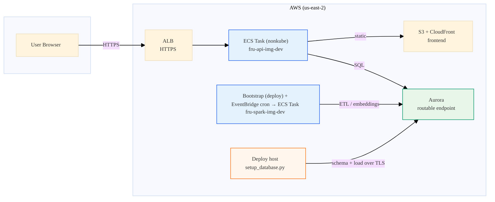
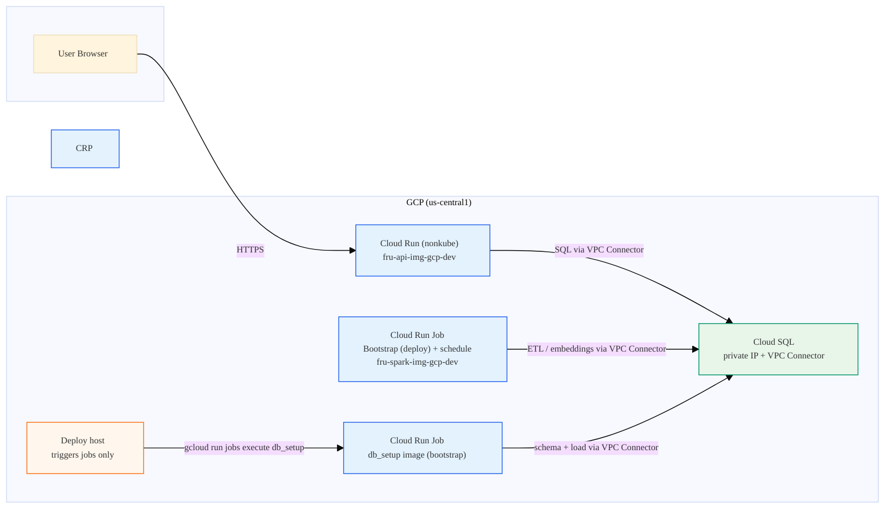
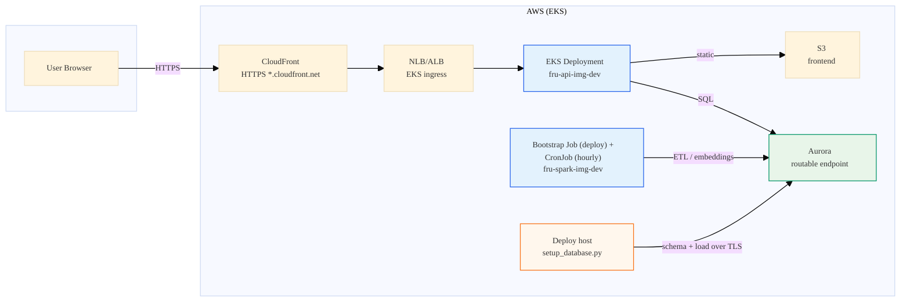
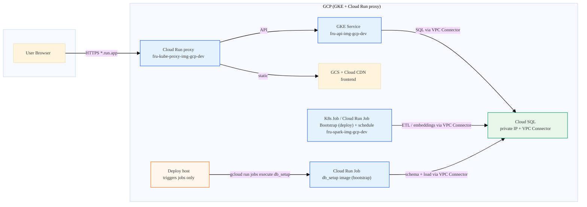

# Common Cloud Components: Enterprise AI Project Reference

A holistic reference of cloud components across AWS, GCP, Azure, Oracle, Alibaba, and Huawei—for typical enterprise projects with AI workloads. Use this to understand what exists, what we use, and what we might add.

---

## How to Read This Table

- **Our project** column: What we use today, or "Not used" with a concise suggestion if we were to adopt it.
- **Color legend:** <span style="color:#059669">Green</span> = we use it; <span style="color:#6b7280">Gray</span> = not used; <span style="color:#2563eb">Blue</span> = header/emphasis.

---

## Component Comparison Table

| Category | **Our project** | AWS | GCP | Azure | Oracle | Alibaba | Huawei |
|----------|-----------------|-----|-----|-------|--------|---------|--------|
| <span style="color:#2563eb">*Compute*</span> | | | | | | | |
| Serverless containers | <span style="color:#059669">AWS: ECS Fargate. GCP: Cloud Run.</span> | ECS Fargate | Cloud Run | Container Apps | OCI Container Instances | Serverless App Engine | FunctionGraph |
| Serverless functions | <span style="color:#6b7280">Not used. (If to use: event-driven triggers, webhooks, lightweight async tasks without full container.)</span> | Lambda | Cloud Functions | Azure Functions | OCI Functions | Function Compute | FunctionGraph |
| Managed Kubernetes | <span style="color:#059669">AWS: EKS. GCP: GKE. (kube scope: deploy --scope kube or all.) API=Deployment; Spark bootstrap=one-off Job; Spark periodic=CronJob. Alternative to nonkube (ECS/Cloud Run) when more control is needed.</span> | EKS | GKE | AKS | OKE | ACK | CCE |
| VMs | <span style="color:#6b7280">Not used. (If to use: legacy apps, custom runtimes, or cost optimization for steady workloads.)</span> | EC2 | Compute Engine | VMs | OCI Compute | ECS (VM) | ECS |
| <span style="color:#2563eb">*Storage*</span> | | | | | | | |
| Object storage | <span style="color:#059669">AWS: S3 (Delta). GCP: GCS (Delta).</span> | S3 | GCS | Blob Storage | Object Storage | OSS | OBS |
| Block storage | <span style="color:#6b7280">Not used. (If to use: persistent disks for VMs or stateful containers.)</span> | EBS | Persistent Disk | Managed Disks | Block Volumes | ESSD | EVS |
| Managed relational DB | <span style="color:#059669">AWS: Aurora. GCP: Cloud SQL.</span> | Aurora / RDS | Cloud SQL | Azure Database | Oracle DB / MySQL | ApsaraDB | RDS |
| Serverless / NoSQL DB | <span style="color:#6b7280">Not used. (If to use: DynamoDB/Firestore for session, cache, or high-throughput key-value.)</span> | DynamoDB | Firestore | Cosmos DB | NoSQL | Table Store | GeminiDB |
| <span style="color:#2563eb">*Networking*</span> | | | | | | | |
| VPC | <span style="color:#059669">Both use VPC for private networking.</span> | VPC | VPC | VNet | VCN | VPC | VPC |
| Load balancer | <span style="color:#059669">AWS: ALB. GCP: Cloud Run built-in.</span> | ALB / NLB | Cloud Load Balancing | Load Balancer | Load Balancer | SLB | ELB |
| CDN | <span style="color:#059669">AWS: CloudFront. GCP: Cloud CDN.</span> | CloudFront | Cloud CDN | Azure CDN | FastConnect / CDN | CDN | CDN |
| VPC connector | <span style="color:#059669">GCP only: Cloud Run → Cloud SQL.</span> | N/A (Fargate in VPC) | Serverless VPC Access | N/A | N/A | N/A | N/A |
| Private Link / Service Connect | <span style="color:#6b7280">Not used. (If to use: private access to third-party SaaS without public internet.)</span> | PrivateLink | Private Service Connect | Private Link | Service Gateway | PrivateLink | VPC Endpoint |
| API Gateway | <span style="color:#6b7280">Not used. (If to use: rate limiting, auth, API versioning, B2B APIs.)</span> | API Gateway | API Gateway / Apigee | API Management | API Gateway | API Gateway | APIG |
| <span style="color:#2563eb">*Security & Identity*</span> | | | | | | | |
| Secrets | <span style="color:#059669">AWS: Secrets Manager. GCP: Secret Manager.</span> | Secrets Manager | Secret Manager | Key Vault | Vault | KMS / Secrets | KMS |
| IAM | <span style="color:#059669">Both use IAM for roles and policies.</span> | IAM | IAM | Entra ID / RBAC | IAM | RAM | IAM |
| KMS / encryption keys | <span style="color:#6b7280">Not used. (If to use: customer-managed keys for compliance, envelope encryption.)</span> | KMS | Cloud KMS | Key Vault | Vault | KMS | KMS |
| WAF | <span style="color:#6b7280">Not used. (If to use: protect API from OWASP, DDoS, bot traffic.)</span> | WAF | Cloud Armor | Front Door WAF | WAF | WAF | WAF |
| <span style="color:#2563eb">*AI / ML*</span> | | | | | | | |
| LLM / GenAI | <span style="color:#059669">AWS: Bedrock (Claude). GCP: Gemini API.</span> | Bedrock | Gemini / Vertex AI | Azure OpenAI / AI Studio | OCI GenAI | Tongyi (Qwen) | Pangu |
| Embeddings | <span style="color:#059669">Both: OpenAI API.</span> | Bedrock Titan / OpenAI | Vertex AI / OpenAI | Azure OpenAI | OCI | DashScope | ModelArts |
| Model hosting / MLOps | <span style="color:#6b7280">Not used. (If to use: SageMaker/Vertex for custom model training, batch inference, A/B tests.)</span> | SageMaker | Vertex AI | Azure ML | OCI Data Science | PAI | ModelArts |
| Vector DB | <span style="color:#6b7280">Not used. (If to use: pgvector in Aurora/Cloud SQL; or dedicated vector DB for large-scale RAG.)</span> | OpenSearch / MemoryDB | Vertex AI Vector Search | Cognitive Search | OCI | OpenSearch | GaussDB |
| <span style="color:#2563eb">*DevOps & Observability*</span> | | | | | | | |
| Container registry | <span style="color:#059669">AWS: ECR. GCP: Artifact Registry.</span> | ECR | Artifact Registry | ACR | OCIR | ACR | SWR |
| CI/CD | <span style="color:#6b7280">Not used. (If to use: CodePipeline/Cloud Build for automated deploy, tests, rollbacks.)</span> | CodePipeline | Cloud Build | DevOps Pipelines | DevOps | Flow | CodeArts |
| Logging | <span style="color:#059669">AWS: CloudWatch. GCP: Cloud Logging.</span> | CloudWatch Logs | Cloud Logging | Monitor | Logging | SLS | LTS |
| Metrics / monitoring | <span style="color:#6b7280">Not used. (If to use: dashboards, alerts, SLOs for latency and errors.)</span> | CloudWatch Metrics | Cloud Monitoring | Monitor | Monitoring | ARMS | APM |
| Tracing | <span style="color:#6b7280">Not used. (If to use: distributed tracing for request flow across API, DB, LLM.)</span> | X-Ray | Cloud Trace | Application Insights | APM | ARMS | APM |
| <span style="color:#2563eb">*Messaging & Scheduling*</span> | | | | | | | |
| Scheduler / cron | <span style="color:#059669">AWS: EventBridge. GCP: Cloud Scheduler.</span> | EventBridge | Cloud Scheduler | Logic Apps / Timer | Events | SchedulerX | EG |
| Message queue | <span style="color:#6b7280">Not used. (If to use: async jobs, decoupling, retries; SQS/Pub/Sub for event-driven.)</span> | SQS | Pub/Sub | Service Bus | Queue | MNS | DMS |
| Event bus | <span style="color:#6b7280">Not used. (If to use: EventBridge/Eventarc for event-driven, multi-service workflows.)</span> | EventBridge | Eventarc | Event Grid | Events | EventBridge | EG |
| <span style="color:#2563eb">*Caching & Search*</span> | | | | | | | |
| Managed cache | <span style="color:#6b7280">Not used. (If to use: ElastiCache/Memorystore for session, query cache, reduce DB load.)</span> | ElastiCache | Memorystore | Cache for Redis | Cache | ApsaraDB Redis | GaussDB Redis |
| Search | <span style="color:#6b7280">Not used. (If to use: OpenSearch/Vertex for full-text, semantic search at scale.)</span> | OpenSearch | Vertex AI Search | Cognitive Search | OpenSearch | OpenSearch | CSS |

---

## Our Container Image Layout (per provider)

| Provider | <span style="color:#2563eb">Core images</span> | <span style="color:#2563eb">Extra images</span> | <span style="color:#2563eb">Why</span> |
|----------|-----------------------------------------------|-----------------------------------------------|-----------------------------------------|
| **AWS** | <span style="color:#059669">1) `fru-api-img-dev` (API + frontend). 2) `fru-spark-img-dev` (Spark + Delta ETL).</span> Each gets tags like `fru_dev_...`, `latest`.</span> | <span style="color:#6b7280">None.</span> | 1) <span style="color:#059669">DB access:</span> Aurora exposes a routable endpoint; deploy host and app tasks can connect over TLS using credentials + SG rules, so schema + ETL run directly from the host and Spark container. 2) <span style="color:#059669">Ingress:</span> ALB + ECS provide HTTPS + routing to API and S3/CloudFront frontend; no dedicated proxy container is required. |
| **GCP** | <span style="color:#059669">1) `fru-api-img-gcp-dev` (API + frontend). 2) `fru-spark-img-gcp-dev` (Spark + Delta ETL).</span> | <span style="color:#059669">3) `fru-kube-proxy-img-gcp-dev` (Cloud Run proxy for GKE + GCS). 4) `db_setup` image (Cloud Run Job for schema + load).</span> | 1) <span style="color:#059669">Cloud SQL access options:</span> (a) public IP + firewall, (b) Cloud SQL Auth Proxy on the deploy host, (c) serverless job inside the VPC (Cloud Run Job). We intentionally use <span style="color:#059669">option (c)</span> so db setup runs next to Cloud SQL over private IP, with no public DB surface or host proxy. 2) <span style="color:#059669">Ingress:</span> For kube, Cloud Run proxy exposes HTTPS `*.run.app` and routes to both GKE LB (API) and GCS (frontend); Cloud Run’s managed TLS replaces the ALB role on AWS, hence the extra kube-proxy image. |

<span style="color:#6b7280">When adding another provider (e.g. Oracle), decide early whether its DB and ingress can be driven from the deploy host like AWS, or require in-VPC/serverless helper images like GCP. This often determines whether you need 2 images (app + Spark) or additional proxy/db-setup images.</span>

---

## Architecture snapshots: AWS vs GCP images and DB access

### 1. Nonkube (no Kubernetes)

#### AWS nonkube: 2 images (app + Spark), host-driven DB setup



##### AWS nonkube bootstrap details

- <span style="color:#059669">What runs once on deploy?</span>  
  - Deploy script runs a **one-off ECS Task** using the same Spark task definition (`fru-spark-img-dev`) that EventBridge uses for the hourly schedule.
- <span style="color:#059669">How it is triggered?</span>  
  - `tools/aws/nonkube/deploy_nonkube.py` calls `run_ecs_bootstrap`, which shells out to `aws ecs run-task`:

```python
# tools/aws/nonkube/deploy_nonkube.py
def _ecs_bootstrap():
    run_ecs_bootstrap(env, region)
_timed("ECS bootstrap", "run_analytics one-off", _ecs_bootstrap)

# tools/aws/scope_shared/deploy/deploy_common.py
def run_ecs_bootstrap(env: str, region: str | None = None, force: bool = False) -> None:
    spark_task_def = out.get("spark_task_definition_arn", {}).get("value")
    result = subprocess.run(
        [
            "aws", "ecs", "run-task",
            "--cluster", cluster,
            "--task-definition", spark_task_def,
            # ...
        ],
        check=True,
    )
```

#### GCP nonkube: 2 images (app + Spark) + db_setup job, in-VPC DB setup



##### GCP nonkube bootstrap details

- <span style="color:#059669">What runs once on deploy?</span>  
  - **Analytics bootstrap**: a single execution of the Cloud Run Job (`fru-spark-img-gcp-dev`) that Cloud Scheduler later runs on a schedule.  
  - **DB bootstrap**: a Cloud Run Job using the `db_setup` image for schema + initial load (no schedule).
- <span style="color:#059669">How analytics bootstrap is triggered?</span>  
  - `tools/gcp/nonkube/deploy_nonkube.py` calls `run_analytics_bootstrap`, which runs `gcloud run jobs execute` on the shared Spark job:

```python
# tools/gcp/nonkube/deploy_nonkube.py
if ok and args.apply:
    from tools.gcp.scope_shared.deploy.analytics_bootstrap import run_analytics_bootstrap
    run_analytics_bootstrap(env, region, force=getattr(args, "force_refresh_data", False))

# tools/gcp/scope_shared/deploy/analytics_bootstrap.py
def run_analytics_bootstrap(env: str, region: str, force: bool = False) -> None:
    job_name = nonkube_out.get("spark_job_name", {}).get("value") or spark_job_name(env, region)
    execution_name = execute_job(project_id, region, job_name)
```

### 2. Kube (Kubernetes)

#### AWS Kube: 2 images (app + Spark), host-driven DB setup



##### AWS Kube bootstrap details

- <span style="color:#059669">What runs once on deploy?</span>  
  - A **K8s Job** in EKS using the same Spark image (`fru-spark-img-dev`) as the recurring **CronJob**.
- <span style="color:#059669">How it is triggered?</span>  
  - `tools/aws/kube/deploy_kube.py` invokes `kube_apply.py` with `--phase bootstrap` and then `--phase schedule`, passing the Spark image once for both:

```python
# tools/aws/kube/deploy_kube.py
kube_apply_args = [
    "python", "tools/aws/kube/kube_apply.py",
    "--env", env, "--region", region,
    "--phase", "bootstrap",
    "--spark-image", spark_image_full,
    "--app-image", app_image_full,
]
subprocess.run(kube_apply_args, check=True)
# later: same args but --phase schedule for the CronJob
```

#### GCP Kube: 3 images (app + Spark + kube-proxy) + db_setup job, in-VPC DB setup



##### GCP Kube bootstrap details

- <span style="color:#059669">What runs once on deploy?</span>  
  - A **K8s Job / Cloud Run Job** using the same Spark image (`fru-spark-img-gcp-dev`) as the scheduled CronJob, plus a **db_setup** Cloud Run Job (bootstrap-only) for schema + initial load.
- <span style="color:#059669">How it is triggered?</span>  
  - `tools/gcp/kube/deploy_kube.py` calls `kube_apply.py` with `--phase bootstrap` and then `--phase schedule`, passing Spark and app images once:

```python
# tools/gcp/kube/deploy_kube.py
kube_apply_args = [
    sys.executable, "tools/gcp/kube/kube_apply.py",
    "--env", env, "--region", region,
    "--phase", "bootstrap",
    "--spark-image", spark_img,
    "--app-image", app_img,
    # ...
]
subprocess.run(kube_apply_args, check=True)
# later: same args but --phase schedule for the CronJob
```

## Brief Explanation

### What This Covers

This table maps **common enterprise cloud components** across six major providers. It is organized by function (compute, storage, networking, security, AI, DevOps, messaging, caching) so you can:

1. **Compare** equivalent services across clouds.
2. **See** what our project uses today.
3. **Explore** extensions or alternatives for new features or migrations.

### Our Project's Scope

We use a **minimal but complete** stack: serverless containers, managed DB, object storage, secrets, CDN, VPC, scheduler, LLM, and embeddings. Components marked "Not used" include suggestions for when they might be useful—e.g., Lambda for lightweight triggers, API Gateway for B2B, WAF for security, or a message queue for async processing.

### Typical Enterprise AI Additions

For a more enterprise-grade AI project, common additions include:

- **API Gateway** for rate limiting and auth.
- **WAF** for security.
- **CI/CD** for automated deployments.
- **Metrics + tracing** for observability.
- **Message queue** for async and retries.
- **Vector DB** or **pgvector** for larger RAG workloads.
- **Model hosting** (SageMaker/Vertex) for custom models or batch inference.

---

*Last updated: Feb 2026. Provider offerings change; verify with official docs.*
