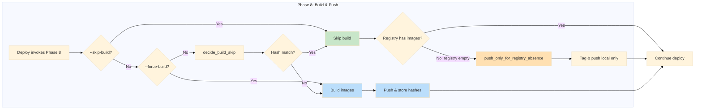
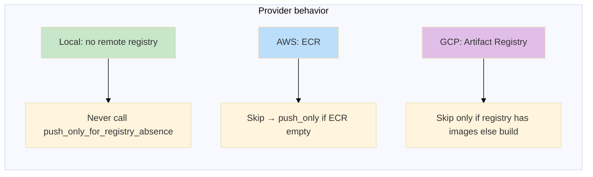
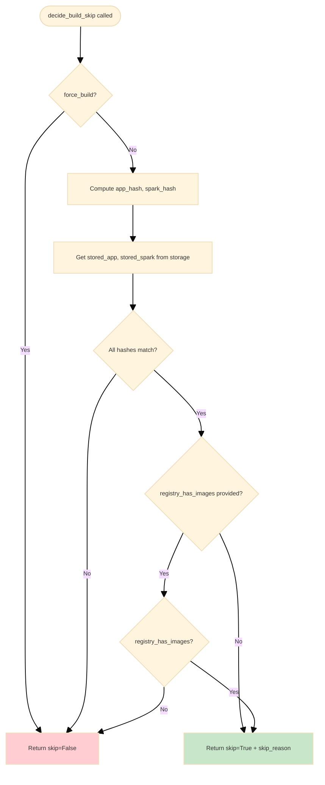
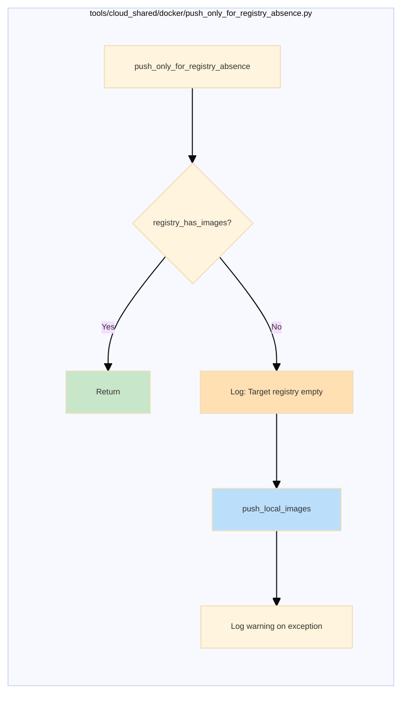
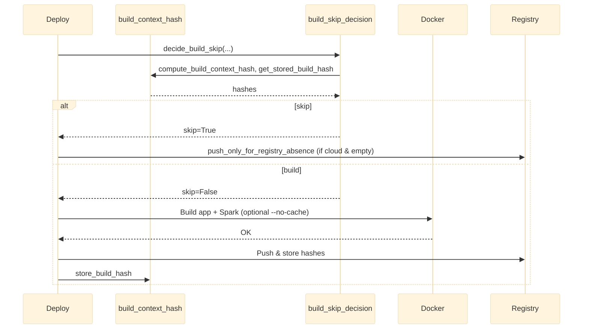

# Deploy, Build & Docker: Consolidated Guide

Unified build strategy across **Local**, **AWS**, and **GCP**: content-based build skip, push-only for registry absence, and shared implementation in `tools/cloud_shared/docker/`.

---

## 1. High-Level Build Phase Flow

Phase 8 (build & push) follows this flow for all providers. **Local** has no remote registry, so the “push-only when registry empty” step is not used.

---

## 2. Content-Based Build Skip

Build is **skipped** when the build context (source + Dockerfile) hash matches the stored hash and (for cloud) the registry already has images or we will push-only.

### 2.1 Why content hash (not Git SHA)?

| Approach | Limitation |
|----------|------------|
| **Git SHA** | Only reflects committed state; uncommitted changes would deploy stale code. |
| **Content hash** | Captures any change in `core_app/` (and Dockerfile path); uncommitted edits trigger rebuild. |

### 2.2 How it works (unified)

1. **Compute:** Hash of `core_app/` (excludes `.git`, `node_modules`, `__pycache__`, `.venv`, `venv`, `dist`, `*.pyc`). Dockerfile path included → app vs Spark get different hashes.
2. **Compare:** Fetch stored hash from provider storage (S3, GCS, or local `memo/`).
3. **Decide:** Shared `decide_build_skip()` returns skip + hashes + skip_reason. Optionally a **registry_has_images** callback (GCP uses it; Local/AWS do not for the skip decision).
4. **Act:** If skip → no build; then AWS/GCP may run **push_only_for_registry_absence** if registry is empty.

### 2.3 Decision flow (decide_build_skip)

---

## 3. Provider Comparison

### 3.1 Storage, registry check, and push-only

| | **Local** | **AWS** | **GCP** |
|--|----------|--------|--------|
| **Hash storage** | **memo/** under project root | **S3** `s3://{artifacts_bucket}/build-metadata/{env}/*.json` | **GCS** `gs://{delta_bucket}/build-metadata/{env}/*.json` |
| **Storage key (concept)** | `build-metadata/default-region/` | per env, global across regions | per env |
| **Skip when hash matches** | Yes (no registry) | Yes | Yes **only if** registry already has app + spark + kube-proxy |
| **Push-only when registry empty** | **N/A** (no remote registry) | **Yes** via `_push_only_for_ecr_absence` → `push_only_for_registry_absence` | Can be aligned (call push_only after skip when registry empty) |
| **Calls push_only_for_registry_absence** | **No** | **Yes** | Can use same pattern |

### 3.2 Why only GCP passes `registry_has_images`?

| Provider | Behavior | Reason |
|----------|----------|--------|
| **Local** | No remote registry. Skip = hash match only. | Nothing to “push-only” to. |
| **AWS** | Skip when hash matches; **then** if ECR is empty, run push-only (tag local images, push). | Skip decision does not require “registry has images”; absence is handled afterward. |
| **GCP** | Skip **only when** hash matches **and** Artifact Registry already has images. | Current design: avoid skipping when registry is empty (then we build). Alternatively, GCP could match AWS: skip when hash matches + push-only when registry empty. |

---

## 4. Flags (Local, AWS, GCP)

| Flag | Effect |
|------|--------|
| *(none)* | Content-based skip when hash matches (and for GCP, registry has images). Build on first deploy or when code changed. |
| **`--skip-build`** | Always skip build; use existing `repo:latest` / tags. No hash check. |
| **`--force-build`** | Bypass content-based skip; always build (and push where applicable). |
| **`--no-cache`** | Pass `--no-cache` to `docker build` (app + Spark; GCP also kube-proxy). Cache-free build. |

---

## 5. Push-Only for Registry Absence

When build was **skipped** (content-hash or `--skip-build`), the target registry might still be **empty** (e.g. first deploy to a new region). We then push local canonical images only when the registry does **not** already have them.

### 5.1 Flow

- **AWS:** `_push_only_for_ecr_absence(env, region, snd)` builds `registry_has_images` (ECR describe-images) and `push_local_images` (run `build_and_push_images.py --push-only`), then calls `push_only_for_registry_absence(...)`.
- **GCP:** Can use the same pattern: after skip, call `push_only_for_registry_absence` with Artifact Registry check and GCP push-only script.
- **Local:** Does **not** call this (no remote registry).

---

## 6. Docker Images: Concepts & Flow

### 6.1 Image vs compound tag

| Concept | Meaning | Example |
|---------|---------|--------|
| **Image** | Content-addressable object (layers + filesystem) | Image ID `534e52bc703a` |
| **Compound tag** | `name:tag` reference to an image | `fru-api-img-dev:latest` |
| **Canonical tag** | Local name without registry URL; reused when pushing to any region | `fru-api-img-dev:latest` |

### 6.2 Images we build

| Image | Repo name (example) | Purpose |
|-------|---------------------|--------|
| **App** | `fru-api-img-dev` (AWS) / `fru-api-img-gcp-dev` (GCP) | FastAPI backend |
| **Spark** | `fru-spark-img-dev` | Analytics / Spark jobs |
| **Kube-proxy** | (GCP only) | Cloud Run proxy for kube |

### 6.3 Build & push flow

---

## 7. Deploy Scenarios (side-by-side)

| Scenario | Build? | Push? | Notes |
|----------|:------:|:----:|-------|
| First deploy to region | ✅ Yes | ✅ Yes | No stored hash or registry empty |
| Same region, no code change | ❌ No | ❌ No | Content-skip; Phase 8 skipped |
| Different region, no code change | ❌ No | ✅ Push-only | Content-skip; then push_only_for_registry_absence if registry empty (AWS; GCP can match) |
| Code changed | ✅ Yes | ✅ Yes | Hash mismatch |
| `--force-build` | ✅ Yes | ✅ Yes | Bypass skip |
| `--skip-build` | ❌ No | ✅ Push-only if needed | No hash check; use existing tags |

---

## 8. Deployment Optimizations (Implemented)

| Optimization | Typical savings | When it applies |
|--------------|-----------------|------------------|
| **VPC tag lifecycle** | ~30–60 s | `lifecycle { ignore_changes = [tags] }` on subnets |
| **Single kube apply** | ~1–5 min | Skip second apply when LB hostname known |
| **Skip import + apply** | ~2–8 min per stack | Plan clean → skip apply |
| **Content-based build skip** | ~3–10 min | Hash matches → skip Docker build |

**Rough total for clean full-scope re-deploy:** ~5–20 minutes saved.

---

## 9. Implementation References

| Layer | Location | Purpose |
|-------|----------|--------|
| **Shared** | `tools/cloud_shared/docker/build_context_hash.py` | `compute_build_context_hash()`, `get_stored_build_hash()`, `store_build_hash()`; provider = S3 \| GCS \| local |
| **Shared** | `tools/cloud_shared/docker/build_skip_decision.py` | `decide_build_skip()` → `BuildSkipResult` (skip, hashes, skip_reason) |
| **Shared** | `tools/cloud_shared/docker/push_only_for_registry_absence.py` | `push_only_for_registry_absence(registry_has_images, push_local_images)`; Local does not call |
| **AWS** | `tools/aws/deploy.py` | Phase 8: content-skip, `--force-build`, `--no-cache`, `_push_only_for_ecr_absence` |
| **AWS** | `tools/aws/scope_shared/deploy/build_and_push_images.py` | Build (with `--no-cache`), push, store hash; supports `--push-only` |
| **GCP** | `tools/gcp/deploy.py` | Phase 8: content-hash check, `registry_has_images`, `--force-build`, `--no-cache` |
| **GCP** | `tools/gcp/scope_shared/deploy/build_and_push_images.py` | Build, push, store hash in GCS; supports `--push-only` |
| **Local** | `tools/local/deploy.py` | Content-hash skip via `memo/`; `--force-build`, `--no-cache`; does not call push_only |

---

## 10. Quick Reference

| Scenario | Result |
|----------|--------|
| Deploy same region twice, no code change | No build, no push; Phase 8 skipped |
| Deploy new region, no code change | Push-only when registry empty (AWS; GCP can match) |
| After push | Registry tags removed locally; canonical names kept |
| Uncommitted changes | Hash changes → build runs |
| Local deploy | No call to `push_only_for_registry_absence` |
