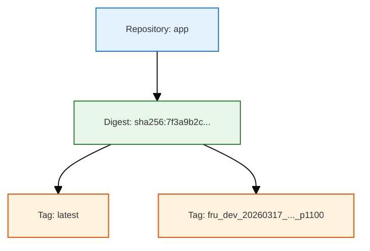
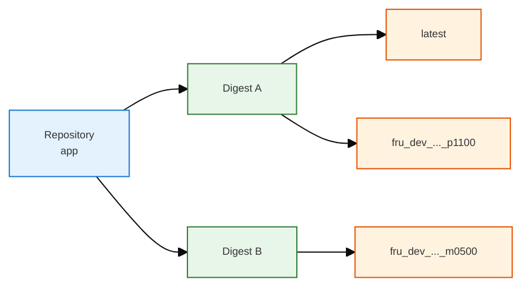

# Deploy, Build: Image, Digest, Tag & Version

Consolidated knowledge on container image concepts, digest-based tag lookup, and the refactor work from 2026-03-16/17. Complements `DEPLOY_BUILD_DOCKER.md` and `docs/todos/REFACTOR_IMAGE_TAG_PLAN.md`.

---

## 1. Concepts: Image, Digest, Tag, Version

**Key relationships:**
- **Repository** (image package, e.g. `app`) — <span style="background:#c8e6c9;padding:2px 4px">1:N</span> → **Digests** (each digest = one image version)
- **Digest** — <span style="background:#c8e6c9;padding:2px 4px">1:N</span> → **Tags** (many tags can point to same digest)
- **Version** — <span style="background:#ffcdd2;padding:2px 4px">Not a registry concept</span>; informal term only. No concrete entity in the registry.

### 1.1 Registry concepts (concrete)

| Concept | Definition | Registry role |
|---------|------------|---------------|
| <span style="background:#e3f2fd;padding:2px 6px">**Repository**</span> | A named container for image versions (e.g. `app` in `us-central1-docker.pkg.dev/proj/repo/app`) | Holds many image versions (digests) |
| <span style="background:#e8f5e9;padding:2px 6px">**Digest**</span> | Unique hash of the image manifest (e.g. `sha256:7f3a9b2c1d4e5f6...`) | Uniquely identifies one image version |
| <span style="background:#fff3e0;padding:2px 6px">**Tag**</span> | Human-readable label (e.g. `latest`, `fru_dev_..._p1100`) | Points to a digest; many tags can point to same digest |

### 1.2 Relationships

- **Repository → Digests:** <span style="background:#c8e6c9;padding:2px 4px">1:N</span> — One repository has many digests (one per image version).
- **Digest → Tags:** <span style="background:#c8e6c9;padding:2px 4px">1:N</span> — One digest can have multiple tags pointing to it.
- **Version:** <span style="background:#ffcdd2;padding:2px 4px">Not a registry concept</span> — Informal term for "which build"; no concrete registry entity. Our tag format (e.g. `fru_dev_20260317_...`) encodes version-like info.

### 1.3 Summary diagram

**One digest, multiple tags** (typical after build push):



**Repository has many digests** (1:N); **each digest has many tags** (1:N):



### 1.4 Example: Build pushes two tags, one digest

When we build and push:

```bash
docker build -t app:fru_dev_20260317_0112676_dirty_20260317_152415_p1100 .
docker tag app:fru_dev_... us-central1-docker.pkg.dev/proj/repo/app:fru_dev_...
docker push .../app:fru_dev_...
docker tag app:fru_dev_... .../app:latest
docker push .../app:latest
```

Both tags point to the **same digest**. The registry stores:

| Tag | Digest |
|-----|--------|
| `fru_dev_20260317_0112676_dirty_20260317_152415_p1100` | `sha256:7f3a9b2c...` |
| `latest` | `sha256:7f3a9b2c...` |

---

## 2. Digest-based tag lookup (Phase 8)

### 2.1 Goal

Show only tags for the **current running image** (its digest) in the UI Build display — typically 1–2 tags, e.g. `['latest', fru_dev_..._p1100]`, not all repo tags.

### 2.2 Flow

```mermaid
%%{init: {'theme':'base', 'themeVariables': {'fontSize':'9px'}}}%%
flowchart LR
    A[CONTAINER_IMAGE\napp:fru_dev_...] --> B[Resolve digest\nOCI manifest GET]
    B --> C[v1 dockerImages.list\nor describe_images]
    C --> D[Filter by digest\nmerge tags]
    D --> E[Fallback: latest\nif same digest]
    E --> F[Return tags\nfor this digest only]
    style A fill:#e3f2fd,stroke:#1976d2,stroke-width:1px,font-size:9px
    style B fill:#fff3e0,stroke:#e65100,stroke-width:1px,font-size:9px
    style C fill:#fff3e0,stroke:#e65100,stroke-width:1px,font-size:9px
    style D fill:#e8f5e9,stroke:#2e7d32,stroke-width:1px,font-size:9px
    style E fill:#e8f5e9,stroke:#2e7d32,stroke-width:1px,font-size:9px
    style F fill:#e8f5e9,stroke:#2e7d32,stroke-width:1px,font-size:9px
```



### 2.3 Provider behavior

| Provider | Implementation | Notes |
|----------|----------------|-------|
| <span style="background:#e3f2fd;padding:1px 3px">GCP</span> | OCI manifest GET → digest; v1 `dockerImages.list` → filter by digest; merge tags; fallback add `latest` if digest matches | Single REST path (no gcloud); ADC works in container and deploy host |
| <span style="background:#e3f2fd;padding:1px 3px">AWS</span> | `describe_images(imageIds=[{imageTag}])` → returns tags for that image in one call | Already per-digest |
| <span style="background:#e3f2fd;padding:1px 3px">Local</span> | `docker image inspect` → `RepoTags` for that image | Already per-image |

### 2.4 Merge tags and latest fallback

- **Merge:** GCP v1 API may return one `DockerImage` per tag or one with all tags. We merge tags from all images matching our digest.
- **Latest fallback:** If `latest` is not in the merged set, resolve `app:latest` to its digest. If it matches our digest, add `latest` to the result (build pushes both tags to same digest).

---

## 3. Timezone consistency in tags (Phase 9)

### 3.1 Problem

- `commit_date`: from `git log --format=%cd` → uses committer's timezone.
- `timestamp`: from `datetime.utcnow()` → UTC.

Mixing timezones caused `commit_date` to appear "after" `timestamp` when author was ahead of UTC.

### 3.2 Solution

- Use `git log -1 --format=%ci` to get timezone offset.
- Use that timezone for `timestamp` (align with `commit_date`).
- Include timezone in tag: <span style="background:#fff9c4;padding:2px 4px">Docker-safe</span> format — `p0800` (positive), `m0500` (negative), `UTC` (zero). Avoid `+` in tags (invalid for Docker).

### 3.3 Tag format

| Type | Format | Example |
|------|--------|---------|
| Clean | `fru_{env}_{commit_date}_{sha}_{slug}` | `fru_dev_20260317_0112676_commit` |
| Dirty | `fru_{env}_{commit_date}_{sha}_dirty_{timestamp}_{tz}` | `fru_dev_20260317_0112676_dirty_20260317_152415_p1100` |

---

## 4. Module responsibilities (DRY)

| Module | Responsibility | Used by |
|--------|----------------|--------|
| <span style="background:#e3f2fd;padding:1px 3px">`image_registry_tags`</span> | `get_image_tags(container_image, provider, region)` → tags for that image's digest | `deploy_image_resolver`, `app.py` `/version` |
| <span style="background:#e3f2fd;padding:1px 3px">`deploy_image_resolver`</span> | Tag resolution (env override + registry), URI building: `get_deploy_image_uris`, `resolve_app_tag` | Deploy scripts, scope deployers |
| <span style="background:#e3f2fd;padding:1px 3px">`image_tag`</span> | `generate_image_tag()` for build | Deploy (build phase) |

---

## 5. Refactor plan summary (from REFACTOR_IMAGE_TAG_PLAN.md)

### 5.1 Phases implemented (2026-03-16/17)

| Phase | Description | Files |
|-------|-------------|-------|
| Phase 8 | Digest-based tag filtering | `tools/cloud_shared/image_registry_tags.py` |
| Phase 9 | Timezone consistency, Docker-safe tag format | `tools/cloud_shared/image_tag.py` |

### 5.2 Key principles

- **Deploy uses concrete tag** (never `latest`) so we know exactly what is running.
- **Build pushes both** `version_tag` and `latest` — same digest, two tags.
- **`/version`** shows tags for the running image's digest (1–2 tags).

---

## 6. References

- `docs/todos/REFACTOR_IMAGE_TAG_PLAN.md` — Full refactor plan (Phases 1–9)
- `docs/learned/cloud_shared/DEPLOY_BUILD_DOCKER.md` — Build phase flow, content hash, push strategy
- `tools/cloud_shared/image_registry_tags.py` — Tag lookup implementation
- `tools/cloud_shared/image_tag.py` — Tag generation
- `tools/cloud_shared/deploy_image_resolver.py` — Tag resolution and URI building
