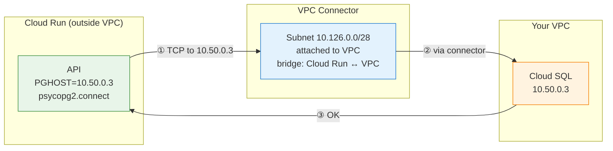
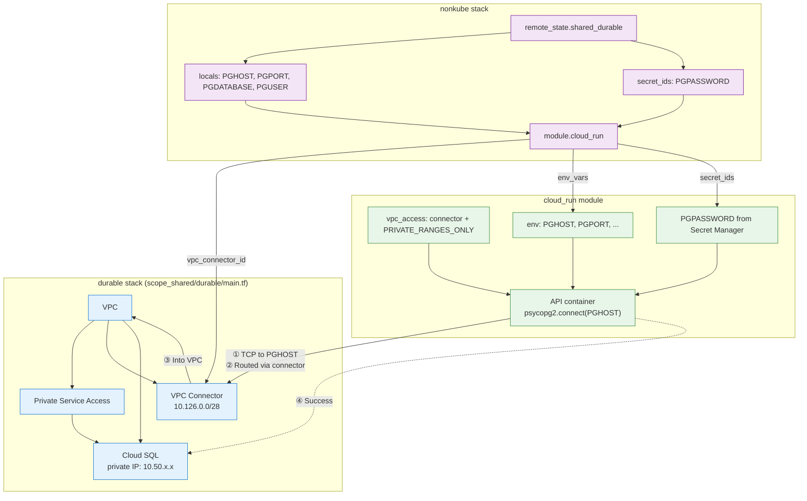

# GCP: How API Service Reaches Cloud SQL (Terraform Wiring)

Plain explanation of how the Cloud Run API service connects to Cloud SQL, with Terraform code references and a Mermaid diagram.

---

## Summary

Cloud Run runs **outside** your VPC. Cloud SQL has a **private IP** inside your VPC. To connect them:

1. A **VPC connector** bridges Cloud Run to the VPC. (A Serverless VPC Access connector is a small subnet—e.g. 10.126.0.0/28 means 28 bits fixed, 4 bits vary = 16 IPs (10.126.0.0–10.126.0.15). GCP reserves this for the connector. It acts as a bridge between Cloud Run and your VPC.)
2. The API gets **PGHOST** (Cloud SQL private IP), **PGPORT**, **PGDATABASE**, **PGUSER** as env vars.
3. **PGPASSWORD** comes from Secret Manager (injected at runtime).
4. Traffic to the private IP goes: API → VPC connector → VPC → Cloud SQL.

---

## Mermaid Diagrams

**Start with Diagram 1** to see why the connection works. Diagrams 2 and 3 show the Terraform wiring.

### Diagram 1: Why the connection works (runtime path)

Shows the hop-by-hop path when the API calls `psycopg2.connect()`. The key: **vpc_access** tells Cloud Run to send private-IP traffic through the connector.

**VPC connector:** A Serverless VPC Access connector is a small subnet (e.g. 10.126.0.0/28) attached to your VPC. The /28 means 28 bits are fixed, 4 bits vary → 2⁴ = 16 addresses (10.126.0.0–10.126.0.15). GCP reserves this range for the connector; no other resources use it. It acts as a bridge between Cloud Run and your VPC—traffic to private IPs is routed through it.



**Why it works:** Without `vpc_access`, Cloud Run would try to reach 10.50.0.3 over the public internet and fail. With `vpc_access` + connector, traffic goes through the connector (bridge) into your VPC, where Cloud SQL is reachable.

---

### Diagram 2: Terraform wiring (config flow)

```
┌─────────────────────────────────────────────────────────────────────────────────┐
│ DURABLE (creates infra)                                                          │
│                                                                                  │
│  VPC ──► Private Service Access ──► Cloud SQL (10.50.0.3)                        │
│  │                                                                               │
│  └──► VPC Connector (10.126.0.0/28) ──► outputs: vpc_connector_id, cloud_sql_*  │
└─────────────────────────────────────────────────────────────────────────────────┘
                                        │
                                        │ remote_state
                                        ▼
┌─────────────────────────────────────────────────────────────────────────────────┐
│ NONKUBE (wires API + Spark)                                                       │
│                                                                                  │
│  Reads durable outputs ──► locals.cloud_sql_connection = {PGHOST, PGPORT, ...}   │
│                         ──► secret_ids = {PGPASSWORD → Secret Manager}           │
│                                                                                  │
│  module.cloud_run(vpc_connector_id = ..., env_vars, secret_ids)  ←─ API          │
│  module.spark_job(vpc_connector_id = ...)                        ←─ Spark (same) │
└─────────────────────────────────────────────────────────────────────────────────┘
                                        │
                                        ▼
┌─────────────────────────────────────────────────────────────────────────────────┐
│ CLOUD_RUN MODULE (creates service)                                                │
│                                                                                  │
│  vpc_access { connector = vpc_connector_id, egress = PRIVATE_RANGES_ONLY }      │
│      → Any egress to 10.x.x.x goes through connector into VPC                     │
│                                                                                  │
│  env: PGHOST=10.50.0.3, PGPORT=5432, PGDATABASE=..., PGUSER=...                  │
│  secret: PGPASSWORD (from Secret Manager)                                         │
│                                                                                  │
│  → API container has everything to connect; traffic path is via connector        │
└─────────────────────────────────────────────────────────────────────────────────┘
```

---

### Diagram 3: Full Mermaid (Terraform + runtime)



---

## Terraform Code Flow

### 1. Durable stack creates the pieces

| Resource | File | Purpose |
|----------|------|---------|
| `module.vpc` | `durable/main.tf` | VPC network |
| `google_service_networking_connection` | `durable/main.tf` | Peering so Cloud SQL gets a private IP in the VPC |
| `module.cloud_sql` | `durable/main.tf` | Cloud SQL instance with private IP (e.g. 10.50.0.3) |
| `google_vpc_access_connector.cloud_run` | `durable/main.tf` | Connector in VPC (10.126.0.0/28) for Cloud Run |
| `output "vpc_connector_id"` | `durable/main.tf` | Connector ID for other stacks |
| `output "cloud_sql_private_ip"` | `durable/main.tf` | Private IP for PGHOST |
| `output "cloud_sql_database_name"` | `durable/main.tf` | Database name for PGDATABASE |

### 2. Nonkube stack wires the API

| Code | File | What it does |
|------|------|--------------|
| `data "terraform_remote_state" "shared_durable"` | `nonkube/main.tf` | Reads durable outputs |
| `local.cloud_sql_connection` | `nonkube/main.tf` | Builds `{ PGHOST, PGPORT, PGDATABASE, PGUSER }` from durable |
| `local.secret_ids` | `nonkube/main.tf` | Maps `PGPASSWORD` → Secret Manager secret ID |
| `vpc_connector_id = ... shared_durable.outputs.vpc_connector_id` | `nonkube/main.tf` | Passes connector to Cloud Run |
| `env_vars = merge(..., local.cloud_sql_connection)` | `nonkube/main.tf` | Injects DB connection env vars |
| `secret_ids = { PGPASSWORD = ... }` | `nonkube/main.tf` | Injects PGPASSWORD from Secret Manager |

### 3. Cloud Run module configures the service

| Code | File | What it does |
|------|------|--------------|
| `dynamic "vpc_access"` | `cloud_run/main.tf` | Attaches the connector so egress to private IPs goes through the VPC |
| `containers { env { ... } }` | `cloud_run/main.tf` | Sets PGHOST, PGPORT, PGDATABASE, PGUSER |
| `value_source { secret_key_ref { ... } }` | `cloud_run/main.tf` | Injects PGPASSWORD from Secret Manager at runtime |

---

## Data flow at runtime

1. Request hits the Cloud Run API.
2. API calls `psycopg2.connect(host=PGHOST, port=PGPORT, ...)`.
3. PGHOST is the Cloud SQL private IP (e.g. 10.50.0.3).
4. Traffic to that IP is routed via the VPC connector into the VPC.
5. From the VPC, Cloud SQL is reachable via Private Service Access.
6. Connection succeeds; API reads/writes the DB.

---

## Refactor plan: Reuse VPC connector for Spark job

**Goal:** Spark job (Cloud Run Job) must reach Cloud SQL to write `batch_analytics`. Same connector as API—no new connector.

| Step | Change |
|------|--------|
| 1 | Add `vpc_connector_id` variable to `modules/gcp/cloud_run_job/variables.tf` |
| 2 | Add `dynamic "vpc_access"` block to `modules/gcp/cloud_run_job/main.tf` (same pattern as `cloud_run` module) |
| 3 | In `nonkube/main.tf`, pass `vpc_connector_id = shared_durable.outputs.vpc_connector_id` to `module.spark_job` |
| 4 | Done. API and Spark job share the same connector. |

**Status:** Implemented. Spark job now has `vpc_connector_id` and can reach Cloud SQL.

---

*See also: [COMMON_CLOUD_COMPONENTS.md](./COMMON_CLOUD_COMPONENTS.md) for cross-cloud comparison.*
