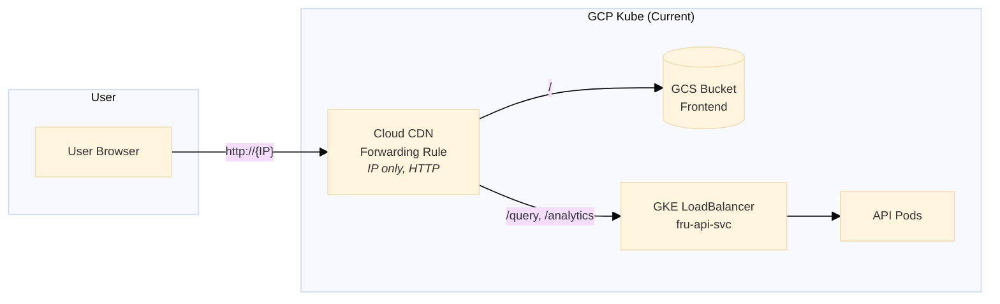
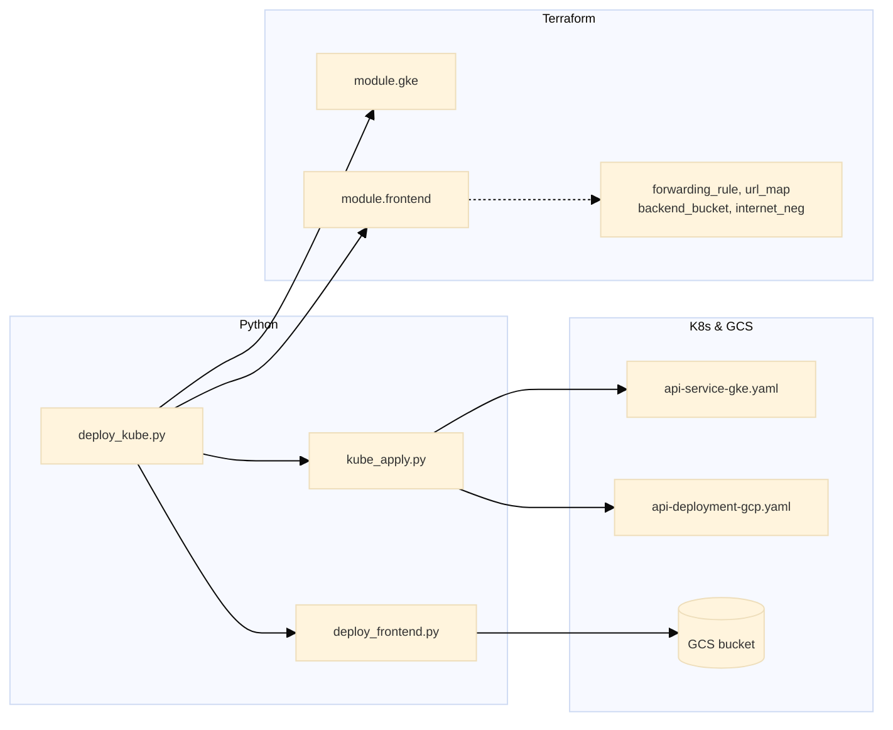
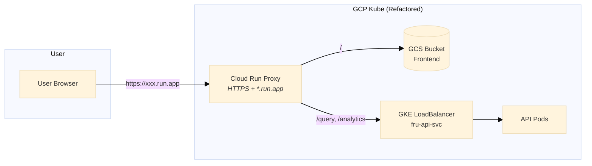
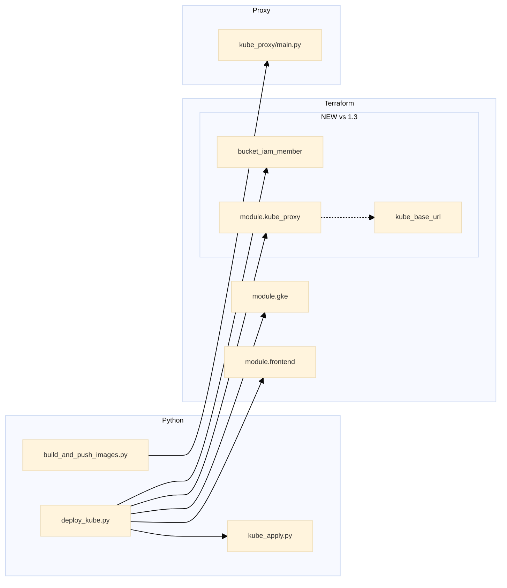
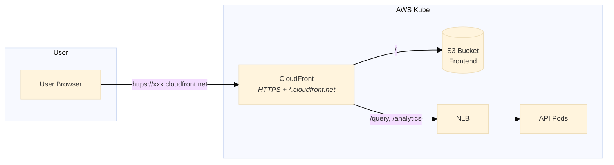
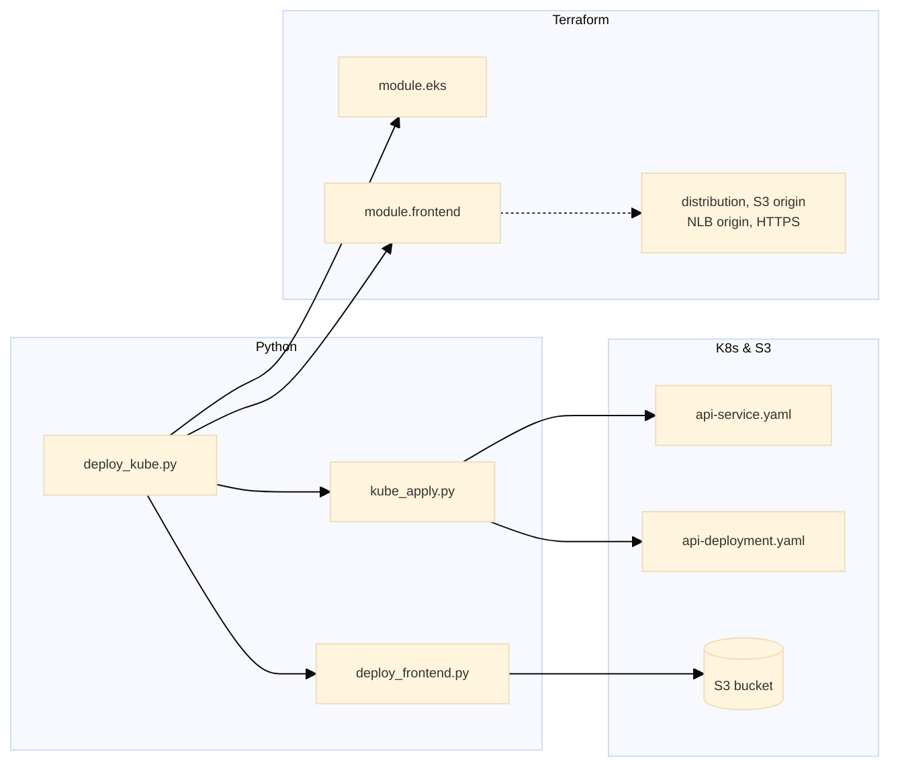

# GCP Kube Request Architecture: Cloud CDN vs Cloud Run Proxy

This doc records what we learned about GCP kube's user-facing entry point, why Cloud CDN cannot match CloudFront's HTTPS+domain out-of-the-box, and the refactor to use Cloud Run as a proxy.

---

## Table of Contents

1. [Architecture 1: GCP Kube (Current) — Cloud CDN](#1-architecture-1-gcp-kube-current--cloud-cdn)
2. [Architecture 2: GCP Kube (Refactored) — Cloud Run Proxy](#2-architecture-2-gcp-kube-refactored--cloud-run-proxy)
3. [Architecture 3: AWS Kube — CloudFront](#3-architecture-3-aws-kube--cloudfront)
4. [Why Cloud CDN Cannot Match CloudFront](#4-why-cloud-cdn-cannot-match-cloudfront)
5. [Implementation Notes](#5-implementation-notes)
6. [Next Steps to Test](#6-next-steps-to-test)

---

## 1. Architecture 1: GCP Kube (Current) — Cloud CDN

### 1.1 Components

| Component | Role |
|-----------|------|
| **Cloud CDN** | The "front desk" — receives all traffic, routes by path. Uses a global forwarding rule that gets an **IP address** (no hostname). |
| **GKE LB** | The load balancer in front of your API pods (fru-api-svc). |
| **GCS** | Where the static frontend (HTML, JS, CSS) is stored. |

**Flow:** User → Cloud CDN (IP) → GCS (for app UI) or GKE LB (for API calls).

### 1.2 Traffic Flow Diagram



### 1.3 Code Layer Mapping



**Explanation (1.3):**

- **Terraform:** Only `module.gke` and `module.frontend` (Cloud CDN). The CDN module creates: `google_compute_global_forwarding_rule` (IP only), `google_compute_url_map`, `google_compute_backend_bucket` (GCS), and Internet NEG + backend for GKE LB. **No `module.kube_proxy`** — user hits `http://{IP}`.
- **Python:** `deploy_kube.py` runs tofu apply, `kube_apply.py` (bootstrap + schedule), polls for LB hostname, re-applies with `ingress_hostname`, and `deploy_frontend.py` syncs frontend to GCS.
- **K8s:** `api-service-gke.yaml` and `api-deployment-gcp.yaml` applied by `kube_apply.py`.

---

## 2. Architecture 2: GCP Kube (Refactored) — Cloud Run Proxy

### 2.1 Problem

Cloud CDN gives `http://{IP}` only — no hostname, no HTTPS. To fix this with CDN alone would require: reserved static IP, custom domain, SSL certificate, and DNS configuration.

### 2.2 Proposed Refactor

Use **Cloud Run as a proxy** in front of GKE and GCS. Cloud Run provides `https://xxx.run.app` out of the box (no domain purchase).

### 2.3 Components

| Component | Role |
|-----------|------|
| **Cloud Run proxy** | Single service that receives all traffic and forwards to the right place. Provides HTTPS + `*.run.app` domain. |
| **GKE LB** | The load balancer in front of your API pods. |
| **GCS** | Where the static frontend is stored. |

**Flow:** User → Cloud Run proxy → GCS (for app UI) or GKE LB (for API calls).

### 2.4 Traffic Flow Diagram



### 2.5 Code Layer Mapping



**Explanation (2.5):**

- **Terraform (additions over 1.3):** `module.kube_proxy` (Cloud Run) — created when `ingress_hostname` is set; `google_storage_bucket_iam_member.kube_proxy_read_frontend` — grants default compute SA `roles/storage.objectViewer` on the frontend bucket so the proxy can fetch static files; `output kube_base_url` — the Cloud Run URL. Cloud CDN (`module.frontend`) remains for optional `http://{IP}` access.
- **Python:** `build_and_push_images.py` builds and pushes the `kube-proxy` image. `deploy_kube.py` runs tofu apply twice (second apply creates the proxy when LB hostname is known).
- **Proxy:** `core_app/kube_proxy/main.py` routes API paths to GKE LB and static paths to GCS.

**Terraform: 1.3 vs 2.5**

| 1.3 (Current) | 2.5 (Refactored) |
|---------------|------------------|
| `module.gke` | `module.gke` |
| `module.frontend` (Cloud CDN) | `module.frontend` (Cloud CDN) |
| — | `google_storage_bucket_iam_member.kube_proxy_read_frontend` |
| — | `module.kube_proxy` (Cloud Run) |
| — | `output kube_base_url` |
| User → `http://{IP}` | User → `https://xxx.run.app` |

### 2.6 Pros and Cons

**Pros**

- HTTPS + domain (`*.run.app`) without custom domain or cert setup
- Matches nonkube pattern (Cloud Run as entry)
- Provider-agnostic kube manifests unchanged; infra-only change

**Cons**

- Extra hop (Cloud Run → GKE LB) adds latency
- No edge caching (Cloud Run is not a CDN)
- Additional Cloud Run cost for proxy traffic

---

## 3. Architecture 3: AWS Kube — CloudFront

### 3.1 Components

| Component | Role |
|-----------|------|
| **CloudFront** | AWS's CDN: the global "front desk" that receives all traffic and decides where to send it. Provides HTTPS + `*.cloudfront.net` domain and edge caching. |
| **S3** | Where the static frontend (HTML, JS, CSS) is stored. |
| **NLB** | The load balancer in front of your API servers. |

**Flow:** User → CloudFront → S3 (for app UI) or NLB (for API calls).

### 3.2 Traffic Flow Diagram



### 3.3 Code Layer Mapping



**Explanation (3.3):**

- **Terraform:** `module.eks` (EKS cluster) and `module.frontend` (CloudFront). The CloudFront module creates a distribution with S3 origin (frontend) and custom origin (NLB) for API paths. CloudFront provides `*.cloudfront.net` hostname and HTTPS by default — no proxy needed.
- **Python:** `deploy_kube.py` runs tofu apply, `kube_apply.py` (bootstrap + schedule), polls for LB hostname, re-applies with `ingress_hostname`, and `deploy_frontend.py` syncs frontend to S3 and invalidates CloudFront.
- **K8s:** `api-service.yaml` (NLB) or `api-service-elb.yaml` (Classic ELB); `api-deployment.yaml` runs the API pods.

### 3.4 Side-by-Side Comparison

| | AWS kube | GCP kube (refactored) |
|---|---|---|
| **Entry point** | CloudFront (CDN) | Cloud Run (proxy) |
| **HTTPS + domain** | Yes (`*.cloudfront.net`) | Yes (`*.run.app`) |
| **Caching** | Yes (edge) | No |
| **Architecture** | CDN → S3 + NLB | Proxy → GCS + GKE LB |

---

## 4. Why Cloud CDN Cannot Match CloudFront

Both are CDNs (proxy + edge caching), but they differ in how the entry point is exposed:

| | CloudFront (AWS) | Cloud CDN (GCP) |
|---|---|---|
| **Entry point** | CloudFront distribution | Global forwarding rule |
| **Default identity** | `*.cloudfront.net` hostname + HTTPS | IP address only |
| **HTTPS** | Built-in (AWS-managed cert) | Requires target HTTPS proxy + SSL cert |
| **Domain** | Provided by AWS | Not provided; you must bring your own |

**Summary:** Cloud CDN is a feature on top of HTTP(S) Load Balancing. The forwarding rule gets an IP by default. GCP does not assign a default hostname or bundled certificate. To get HTTPS + domain, you must add a target HTTPS proxy, attach an SSL certificate (which requires a domain you own), and configure DNS. CloudFront, by contrast, is a standalone product that gives each distribution a default `*.cloudfront.net` domain and HTTPS automatically.

---

## 5. Implementation Notes

### 5.1 Cloud Run Proxy

- Runs a minimal container (`core_app/kube_proxy/`) that receives HTTP requests
- For `/`, `/index.html`, `/assets/*`, etc.: fetches from GCS and returns
- For `/query`, `/analytics`, `/health`, `/version`: proxies to GKE LB
- Uses env vars `GKE_LB_URL` and `GCS_BUCKET` (set by Terraform)
- Created in the kube stack; URL output as `kube_base_url` for verify

### 5.2 Verify

- `tools/gcp/scope_shared/verify/verify_all_deploy.py` prefers `kube_base_url` (Cloud Run proxy) when present; falls back to CDN IP (`cloudfront_domain_name`).

---

## 6. Next Steps to Test

1. **Full deploy via orchestrator:**
   ```bash
   orchestrator deploy --provider gcp --scope kube --env dev --apply
   ```
   Or, if using the project's deploy script:
   ```bash
   python tools/gcp/deploy.py --scope kube --env dev --apply
   ```

2. **Verify kube endpoints:**
   ```bash
   orchestrator verify --provider gcp --scope kube --env dev
   ```
   Or:
   ```bash
   python tools/gcp/scope_shared/verify/verify_all_deploy.py --scope kube --env dev
   ```

3. **Check the Cloud Run URL:** After deploy, tofu output `kube_base_url` should show `https://xxx.run.app`. Use that URL in a browser to confirm frontend loads and API calls work.

4. **If deploy fails:** Ensure `ingress_hostname` (GKE LB) is set before the proxy is created — the deploy flow polls for the LB and re-applies with it. The proxy needs `GKE_LB_URL` to route API traffic.
