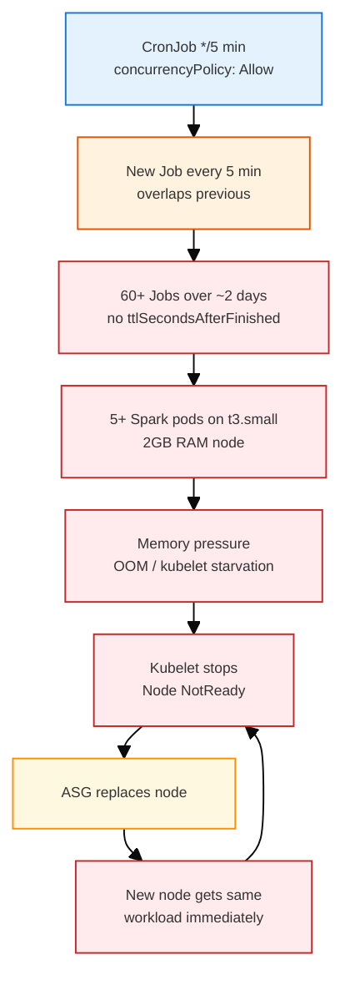
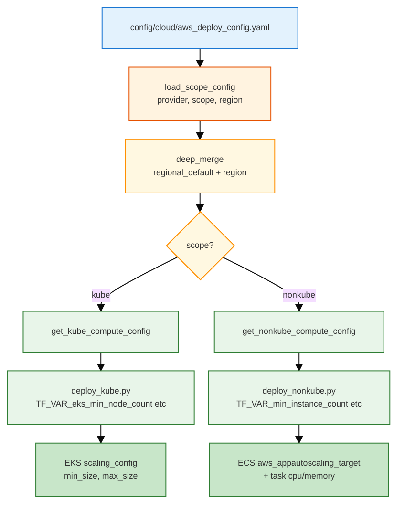

# Resource Allocation Config YAML: From CronJob Exhaustion to Deterministic Control

**Keywords:** resource exhaustion, t3.small, CronJob, EKS, config YAML, min_node_count, max_node_count, tasks.api, tasks.spark, single source of truth

---

## 1. The Problem: Resource Exhaustion on t3.small

### 1.1 Symptoms

- EKS nodes transition to **NotReady** with "Kubelet stopped posting node status"
- **fru-api** pods stay **Pending** indefinitely
- Replacement nodes fail again within ~3 minutes
- EC2 instances appear healthy; the issue is at the kubelet/application layer

### 1.2 The Cascade



### 1.3 Root Cause Factors

<table>
<tr style="background:#1565c0;color:white"><th>Factor</th><th>Effect</th></tr>
<tr><td style="background:#e3f2fd"><span style="background:#e3f2fd;padding:1px 3px"><strong>t3.small</strong></span></td><td>2 vCPU, 2GB RAM — minimal headroom for system + workload</td></tr>
<tr><td style="background:#fff3e0"><span style="background:#e3f2fd;padding:1px 3px"><strong>concurrencyPolicy: Allow</strong></span></td><td>Default; new Job every 5 min even if previous still running</td></tr>
<tr><td style="background:#fff3e0"><span style="background:#e3f2fd;padding:1px 3px"><strong>No ttlSecondsAfterFinished</strong></span></td><td>Completed/failed Jobs and pods persist indefinitely</td></tr>
<tr><td style="background:#ffebee"><span style="background:#e3f2fd;padding:1px 3px"><strong>Spark analytics pods</strong></span></td><td>JVM + driver + local executors; ~512MB–1GB+ per pod, no limits</td></tr>
<tr><td style="background:#ffebee"><span style="background:#e3f2fd;padding:1px 3px"><strong>1× node (desired_size=1)</strong></span></td><td>All pods on single t3.small → 5+ Spark + 2 fru-api + daemonsets → node at capacity</td></tr>
<tr><td style="background:#ffebee"><span style="background:#e3f2fd;padding:1px 3px"><strong>Memory pressure</strong></span></td><td>Multiple Spark pods on 2GB node → kubelet stops responding</td></tr>
</table>

### 1.4 Deploy-Trigger Hypothesis

<span style="background:#ffebee;padding:2px 6px;border-radius:4px"><strong>Do not blindly replace the node.</strong></span> The failure often occurs *during* or *shortly after* a deploy:

<table>
<tr style="background:#1565c0;color:white"><th>Deploy Phase</th><th>Concurrent Load on 1× t3.small (2GB)</th></tr>
<tr><td style="background:#e3f2fd">helm upgrade LB controller</td><td>2 old (Terminating) + 2 new (Starting) ≈ 600MB spike</td></tr>
<tr><td style="background:#fff3e0">kube_apply + rollout restart fru-api</td><td>2 old (Terminating) + 2 new (Starting) ≈ 1GB</td></tr>
<tr><td style="background:#fff3e0">CronJob Spark (if schedule fired)</td><td>1 Spark pod ≈ 512MB–1GB</td></tr>
<tr><td style="background:#ffebee"><strong>Total</strong></td><td><strong>2.3GB+ on 2GB node → OOM → kubelet stops</strong></td></tr>
</table>

---

## 2. The Fix: Two Parts

### 2.1 Part A: CronJob Manifest Changes

| Change | Purpose |
|:-------|:--------|
| <span style="background:#e3f2fd;padding:1px 3px"><strong>concurrencyPolicy: Forbid</strong></span> | Only one Job at a time; skip new run if previous still running |
| <span style="background:#e3f2fd;padding:1px 3px"><strong>ttlSecondsAfterFinished: 240</strong></span> | Auto-delete Job and pods 4 min after completion |

Applied in `infra_terraform/modules/cloud_shared/k8s/spark-cronjob.yaml.j2`.

### 2.2 Part B: YAML-Based Resource Allocation

Instead of hardcoding `desired_size=1` or scattering compute values across Terraform vars and live configs, we use a **single source of truth** in `config/cloud/*_deploy_config.yaml`:

- **Bounded everywhere:** `min_*` and `max_*` (no `desired`/`initial` as the only knob)
- **Deterministic:** Deploy reads from YAML; Terraform receives explicit vars; no implicit defaults
- **Scope-based:** `kube` vs `nonkube`; each has `regional_default` + region overrides

For the t3.small exhaustion case, the fix is **`min_node_count: 2`** — two nodes spread the load (fru-api, LB controller, Spark CronJob) so no single node is overloaded.

### 2.3 Part C: Soft Pod Anti-Affinity (2026-03)

**Scope:** <span style="background:#e3f2fd;padding:2px 4px">**kube only**</span> (EKS/GKE). Nonkube uses ECS Fargate — each task runs in its own instance; there is no shared node, so pod anti-affinity does not apply.

**Discovery:** Even with `min_node_count: 2` and workload spread, one node can still fail. Observed: both fru-api replicas, 2× aws-load-balancer-controller, 2× coredns, and the Spark CronJob pod landed on the same node → memory pressure → kubelet stopped → node NotReady and tainted.

**Enhancement:** Add soft pod anti-affinity so the scheduler *prefers* to:
- Spread fru-api replicas across nodes (1 per node)
- Schedule Spark CronJob on a node without fru-api

Applied in `api-deployment.yaml.j2` and `spark-cronjob.yaml.j2` using `preferredDuringSchedulingIgnoredDuringExecution` (soft). With 2 nodes, hard anti-affinity would leave Spark Pending when both nodes have fru-api; soft allows scheduling when needed.

**No guarantee:** Anti-affinity improves placement but does not guarantee node stability. With 2× t3.small (2GB each), Spark + fru-api + system pods can still overload a node if the scheduler must colocate (e.g. during recovery, rolling updates, or when one node is NotReady). For stronger guarantees: use 3+ nodes, larger instance types (t3.medium), or memory limits/requests on pods.

---

## 3. YAML Config Structure

### 3.1 Hierarchy

```
scope (scope_default | kube | nonkube)
  └── regional_default     ← shared values
  └── us-east-1            ← region overrides (merge with regional_default)
  └── us-east-2
  └── ...
```

**Region must exist in `scope_default`** (for network). For `kube` and `nonkube`, if a region block is missing, only `regional_default` is used.

### 3.2 Config Flow: YAML → Deploy → Terraform/K8s



### 3.3 Scope Roles

<table>
<tr style="background:#1565c0;color:white"><th>Scope</th><th>Purpose</th><th>Consumers</th></tr>
<tr><td style="background:#e3f2fd"><span style="background:#e3f2fd;padding:1px 3px"><strong>scope_default</strong></span></td><td>Network (VPC, subnets), database (multi_az)</td><td>durable stack, teardown, destroy_durable</td></tr>
<tr><td style="background:#e8f5e9"><span style="background:#e3f2fd;padding:1px 3px"><strong>kube</strong></span></td><td>EKS/GKE compute: min/max node count, instance types, machine_type, zone</td><td>deploy_kube, teardown, reapply_kube_with_lb</td></tr>
<tr><td style="background:#e8f5e9"><span style="background:#e3f2fd;padding:1px 3px"><strong>nonkube</strong></span></td><td>ECS/Cloud Run compute: min/max instance count, tasks.api, tasks.spark</td><td>deploy_nonkube</td></tr>
</table>

---

## 4. Config Keys Reference

### 4.1 Kube (EKS / GKE)

<table>
<tr style="background:#1565c0;color:white"><th>Key</th><th>AWS</th><th>GCP</th><th>Terraform / Infra</th></tr>
<tr><td style="background:#e3f2fd">min_node_count</td><td>✓</td><td>✓</td><td>EKS scaling_config min_size; GKE node pool autoscaling min_node_count</td></tr>
<tr><td style="background:#e3f2fd">max_node_count</td><td>✓</td><td>✓</td><td>EKS scaling_config max_size; GKE node pool autoscaling max_node_count</td></tr>
<tr><td style="background:#fff3e0">node_instance_types</td><td>✓ (e.g. [t3.small])</td><td>—</td><td>EKS node group instance_types</td></tr>
<tr><td style="background:#fff3e0">machine_type</td><td>—</td><td>✓ (e.g. e2-small)</td><td>GKE node_config machine_type</td></tr>
<tr><td style="background:#fff3e0">zone / region</td><td>—</td><td>✓</td><td>GKE location (zonal or regional)</td></tr>
</table>

**Instance vs task (no contradiction):**

- <span style="background:#e3f2fd;padding:1px 3px"><strong>min/max_node_count</strong></span> = number of worker nodes in the cluster
- <span style="background:#fff3e0;padding:1px 3px"><strong>tasks.api / tasks.spark</strong></span> = resources per container (nonkube only; kube uses K8s manifests for pod resources)

### 4.2 Nonkube (ECS / Cloud Run)

<table>
<tr style="background:#1565c0;color:white"><th>Key</th><th>AWS</th><th>GCP</th><th>Terraform / Infra</th></tr>
<tr><td style="background:#e3f2fd">min_instance_count</td><td>✓</td><td>✓</td><td>ECS desired_count; aws_appautoscaling_target min_capacity; Cloud Run min_instance_count</td></tr>
<tr><td style="background:#e3f2fd">max_instance_count</td><td>✓</td><td>✓</td><td>aws_appautoscaling_target max_capacity; Cloud Run max_instance_count</td></tr>
<tr><td style="background:#e8f5e9">tasks.api.cpu</td><td>✓ (512)</td><td>✓ ("1")</td><td>ECS task definition; Cloud Run container resources</td></tr>
<tr><td style="background:#e8f5e9">tasks.api.memory</td><td>✓ (1024)</td><td>✓ ("512Mi")</td><td>ECS task definition; Cloud Run container resources</td></tr>
<tr><td style="background:#e8f5e9">tasks.spark.cpu</td><td>✓</td><td>✓</td><td>ECS Spark task definition; Cloud Run Job</td></tr>
<tr><td style="background:#e8f5e9">tasks.spark.memory</td><td>✓</td><td>✓</td><td>ECS Spark task definition; Cloud Run Job</td></tr>
</table>

**Instance vs task:**

- <span style="background:#e3f2fd;padding:1px 3px"><strong>min/max_instance_count</strong></span> = replica count (how many API containers)
- <span style="background:#fff3e0;padding:1px 3px"><strong>tasks.api</strong></span> = resources per API container
- Example: `min_instance_count: 2`, `tasks.api.cpu: 512` → 2 API tasks, each 512 CPU; load balancer distributes traffic

---

## 5. AWS Kube: The CronJob Exhaustion Fix in YAML

### 5.1 Before vs After

<table>
<tr style="background:#1565c0;color:white"><th>Aspect</th><th>Before</th><th>After</th></tr>
<tr><td style="background:#e3f2fd">Node count</td><td>desired_size=1 (or implicit)</td><td>min_node_count: 2, max_node_count: 2</td></tr>
<tr><td style="background:#fff3e0">Rationale</td><td>Single node; cost-saving</td><td>2 nodes spread load; avoids OOM on t3.small during deploy + CronJob</td></tr>
<tr><td style="background:#e8f5e9">Source</td><td>Scattered in Terraform vars, live config</td><td><code>config/cloud/aws_deploy_config.yaml</code> kube.regional_default</td></tr>
</table>

### 5.2 Soft Pod Anti-Affinity (api-deployment, spark-cronjob) — Kube Only

In addition to `min_node_count: 2`, we use **soft pod anti-affinity** to improve spread on **kube** (EKS/GKE). Nonkube (ECS Fargate) does not use shared nodes, so anti-affinity is not applicable.

| Manifest | Anti-affinity rule |
|:---------|:-------------------|
| fru-api | Prefer not to schedule 2 fru-api pods on the same node |
| Spark CronJob | Prefer to schedule on a node without fru-api |

Uses `preferredDuringSchedulingIgnoredDuringExecution` (soft) so pods still schedule when no ideal node exists. See §2.3 for the discovery and caveat.

### 5.3 Inline Comment in Config

The AWS config documents the rationale:

```yaml
kube:
  # min=2: Fix CronJob resource exhaustion. 1× t3.small (2GB) overloaded by Spark+fru-api+LB
  # → memory pressure → node unreachable. 2 nodes spread load. See EKS_NODE_KUBELET_CRONJOB.md
  regional_default:
    compute:
      min_node_count: 2
      max_node_count: 2
      node_instance_types: [t3.small]
```

---

## 6. Scheduler Comparison: Kube vs Nonkube

The resource-exhaustion problem applies differently across schedulers:

<table>
<tr style="background:#1565c0;color:white"><th>Scheduler</th><th>Provider</th><th>Overlap?</th><th>TTL?</th><th>Failure mode</th></tr>
<tr><td style="background:#e3f2fd"><span style="background:#e3f2fd;padding:1px 3px"><strong>K8s CronJob</strong></span></td><td>AWS EKS, GCP GKE</td><td>Yes (default Allow)</td><td><span style="background:#c8e6c9;padding:2px 4px">ttlSecondsAfterFinished: 240</span></td><td>Shared node → pods accumulate → node overload</td></tr>
<tr><td style="background:#fff3e0"><span style="background:#e3f2fd;padding:1px 3px"><strong>EventBridge → ECS</strong></span></td><td>AWS nonkube</td><td>Yes — each tick starts new task</td><td><span style="background:#ffcdd2;padding:2px 4px">No</span></td><td>Isolated Fargate — no shared node; no crash (but $ waste)</td></tr>
<tr><td style="background:#e8f5e9"><span style="background:#e3f2fd;padding:1px 3px"><strong>Cloud Scheduler → Cloud Run Job</strong></span></td><td>GCP nonkube</td><td>Independent</td><td>N/A</td><td>Different semantics; no K8s-style TTL</td></tr>
</table>

**Kube vs nonkube (AWS):** Node failure happened on kube because all CronJob pods share a single node (t3.small). Nonkube uses ECS Fargate — each Spark task runs in its own Fargate instance, so there is no shared node to overload. Anti-affinity (§2.3, §5.2) is a **kube-only** mitigation; nonkube does not need it.

---

## 7. Loader and Fail-Fast

### 7.1 load_scope_config

```python
# tools/cloud_shared/provider_config_utils.py
load_scope_config(provider, scope, region) -> dict
```

- Merges `scope.regional_default` with `scope[region]` (region overrides win)
- Region must exist in `scope_default`; else `ValueError`
- Cached per `(provider, scope, region)`

### 7.2 Handlers

| Handler | Returns | Used by |
|:--------|:--------|:--------|
| <span style="background:#e3f2fd;padding:1px 3px"><strong>get_kube_compute_config(region)</strong></span> | min_node_count, max_node_count, node_instance_types (AWS) or machine_type, zone (GCP) | deploy_kube, teardown, reapply_kube_with_lb |
| <span style="background:#e3f2fd;padding:1px 3px"><strong>get_nonkube_compute_config(region)</strong></span> | min_instance_count, max_instance_count, tasks.api, tasks.spark | deploy_nonkube |

Handlers use `_require(cfg, path, key)` for fail-fast; no silent defaults for config-sourced values.

---

## 8. References

- [EKS_NODE_KUBELET_CRONJOB.md](./EKS_NODE_KUBELET_CRONJOB.md) — Symptoms, recovery playbook, diagnostic commands
- [WAR_STORIES_CLOUD_SHARED.md](../war_stories/WAR_STORIES_CLOUD_SHARED.md) §40–41 — CronJob overload cascade, recovery, prevention; §44 — nonkube REPO_ROOT path fix
- [TODO_REFACTOR_YAML.md](../../TODO_REFACTOR_YAML.md) — Full refactor plan and wiring verification

---

## 9. Caveat: No Guarantee of Node Stability (Kube)

Even with `min_node_count: 2`, soft anti-affinity, and CronJob fixes (Forbid, ttlSecondsAfterFinished), **there is no guarantee that nodes will always remain stable** on 2× t3.small. *(This applies to kube only; nonkube ECS Fargate has no shared-node overload risk.)*

- The scheduler may still colocate fru-api and Spark when both nodes already have fru-api (2 replicas → 1 per node; Spark must pick one).
- During rolling updates, node replacement, or recovery, temporary colocation can overload a node.
- Soft anti-affinity is a preference, not a requirement; the scheduler can ignore it when necessary.

For stronger guarantees: increase to 3+ nodes, use larger instance types (e.g. t3.medium), or add memory requests/limits so the scheduler can avoid overcommit.
