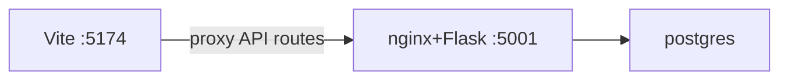

<h1 id="local-ports-title" style="color:#0d47a1;font-size:1.5em;font-weight:700;border-bottom:2px solid #90caf9;padding-bottom:0.25em;margin-top:0">Local ports and UI entry points</h1>

**Repo:** `fru-genai-analytics-new`  
**Config source:** `config/local/local_deploy_config.yaml` (override path via `LOCAL_DEPLOY_CONFIG` in `.env`)  
**Related plan:** `cursor_gen/refactor_plans/wip/REFACTOR_LOCAL_UI_DEPLOY_UX.md`

---

<h2 id="outline" style="color:#1565c0;font-size:1.22em;font-weight:650;border-left:4px solid #42a5f5;padding-left:10px;margin-top:1.1em">Document outline</h2>

1. [Port table (kube vs nonkube)](#port-table)
2. [Why localhost:5001 renders the full UI](#why-5001-serves-ui)
3. [When to use which URL](#when-to-use-which)
4. [Deploy and start_local logging](#deploy-logging)
5. [Verification](#verification)

---

<h2 id="port-table" style="color:#1565c0;font-size:1.22em;font-weight:650;border-left:4px solid #42a5f5;padding-left:10px;margin-top:1.1em">1. Port table (kube vs nonkube)</h2>

| Scope | API (container) | Dev frontend (Vite) | Notes |
|-------|-----------------|----------------------|-------|
| **nonkube** | **5001** | **5174** | API = nginx + Flask in `fru-api:local` Compose service |
| **kube** | **30080** (NodePort) | **5173** | API in Docker Desktop Kubernetes |

Both scopes can run side-by-side; ports are intentionally different.

---

<h2 id="why-5001-serves-ui" style="color:#1565c0;font-size:1.22em;font-weight:650;border-left:4px solid #42a5f5;padding-left:10px;margin-top:1.1em">2. Why localhost:5001 renders the full UI</h2>

Local nonkube mirrors cloud “single container UI + API”:

| Process | Port | Role |
|---------|------|------|
| nginx | 5001 (published) | Serves baked SPA from `/usr/share/nginx/html`; proxies `/query`, `/analytics`, `/version`, … to Flask |
| Flask | 5000 (internal) | JSON API only — not published to the host |

See `core_app/nginx.conf` and `core_app/docker-entrypoint.sh`.

This is **not** a misconfiguration. Hitting `http://localhost:5001/` is the production-style bundle. Local dev with hot reload uses Vite on **5174**, which proxies API calls to **5001**.



---

<h2 id="when-to-use-which" style="color:#1565c0;font-size:1.22em;font-weight:650;border-left:4px solid #42a5f5;padding-left:10px;margin-top:1.1em">3. When to use which URL</h2>

| Goal | URL |
|------|-----|
| **UI development** (hot reload, latest TSX) | `http://localhost:5174` (nonkube) or `http://localhost:5173` (kube) |
| **curl / integration tests** against API | `http://localhost:5001` (nonkube) or `http://localhost:30080` (kube) |
| **Smoke bundled UI** (same as cloud container) | `http://localhost:5001` after API image build |
| **Check build tag and models** | `GET /version` from either entry point |

The Chat header shows an amber banner when the UI is served from the **bundled** nginx path (`import.meta.env.DEV === false` on local nonkube). `/version` may include `dev_frontend_port` so the banner points at the correct Vite port.

**Scope label:** Both 5174 and 5001 (nonkube) correctly report `Scope: nonkube` because both talk to the same nonkube API. Kube UI is **5173**, not 5001.

---

<h2 id="deploy-logging" style="color:#1565c0;font-size:1.22em;font-weight:650;border-left:4px solid #42a5f5;padding-left:10px;margin-top:1.1em">4. Deploy and start_local logging</h2>

| Script | What it logs |
|--------|----------------|
| `tools/local/deploy.py` | Semantic `APP_IMAGE_TAG`; nonkube API vs dev frontend URLs separately |
| `tools/local/nonkube/deploy_nonkube.py` | `API (nginx+Flask)` vs `Dev frontend (Vite)` |
| `tools/local/start_local.py` | Vite URL; optional hint that bundled UI is at API port if container is up |

Local deploy sets `APP_IMAGE_TAG` via `generate_image_tag("local")` so the config strip `Build:` line matches cloud-style tags (not `[unknown]`).

---

<h2 id="verification" style="color:#1565c0;font-size:1.22em;font-weight:650;border-left:4px solid #42a5f5;padding-left:10px;margin-top:1.1em">5. Verification</h2>

```bash
# Scope routing from Vite dev servers
python tools/local/standalone/verify_frontend_proxy.py

# Build tag and model fields
curl -s http://localhost:5001/version | python3 -m json.tool

# Health
curl -s http://localhost:5001/health
```

After code changes to the API or bundled frontend, rebuild and recreate the API container:

```bash
python tools/local/deploy.py --scope nonkube
# or orchestrator equivalent
```

Vite on 5174 picks up frontend TSX changes without an image rebuild.
