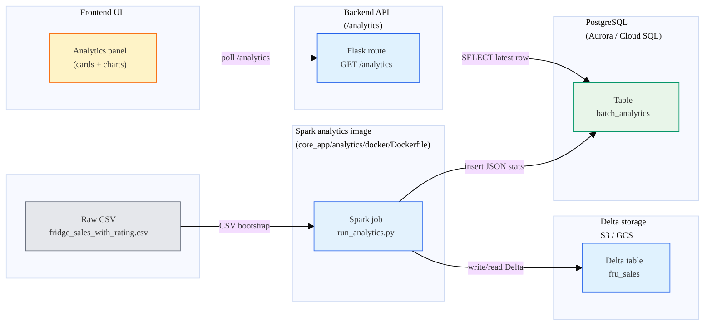
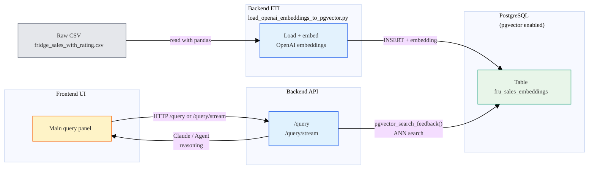

## 1. Overview: Two Subsystems Using Spark and Delta

This document explains the two main subsystems in our project that use **Spark**, **Delta**, and **PostgreSQL**:

1. **Analytics subsystem** – Turns the raw CSV into a **Delta table** and then into **pre‑aggregated analytics** stored in `batch_analytics` (PostgreSQL). The frontend `/analytics` UI reads from this.
2. **Query + LLM subsystem** – Loads the raw CSV into **`fru_sales_embeddings`** with **pgvector**. The `/query` and `/query/stream` endpoints use semantic search + Claude (via Bedrock) or an agent to answer user questions.

Both subsystems:

- Share the **same raw CSV**: `core_app/data/raw/fridge_sales_with_rating.csv`.
- Share the **same Postgres database** (Aurora on AWS, Cloud SQL on GCP).
- Write to **different tables** for different purposes:
  - `fru_sales` (Delta, on S3/GCS) → analytics source.
  - `batch_analytics` (Postgres) → analytics API output.
  - `fru_sales_embeddings` (Postgres + pgvector) → semantic search source for the LLM.

Color legend used in diagrams:  
- <span style="color:#2563eb">Blue</span> = compute / services  
- <span style="color:#059669">Green</span> = storage / databases  
- <span style="color:#f97316">Orange</span> = jobs / background tasks  
- <span style="color:#0f766e">Teal</span> = LLM / agent

---

## 2. Analytics Subsystem (Spark + Delta + `batch_analytics`)

### 2.1 High‑level data flow



### 2.2 What the analytics subsystem does

1. **Bootstrap / keep `fru_sales` Delta table up to date**
   - Entry point: `core_app/analytics/jobs/run_analytics.py`.
   - On each run:
     - Tries to read Delta path `.../fru_sales`.  
     - If missing or too few rows, it **re‑creates** `fru_sales` by reading the CSV and writing it in Delta format.

2. **Compute analytics with Spark**
   - Reads `fru_sales` into a Spark DataFrame.
   - Computes:
     - `sales_by_brand` (total sales, revenue, price stats),
     - `store_performance` (revenue, feedback rates),
     - `feedback_by_brand`,
     - `top_models`,
     - `price_stats` (min/mean/max),
     - `total_records`, `total_revenue`.

3. **Persist analytics to Postgres (`batch_analytics`)**
   - Converts Spark aggregations to Python lists/dicts.
   - Calls `save_analytics_to_db` to insert a **single row** into `batch_analytics` with:
     - All the JSON fields (arrays of objects),
     - `total_records`,
     - `total_revenue`.
   - Runs `verify_saved_total_records(expected_total)` as a self‑check.

4. **Serve analytics via `/analytics`**
   - `GET /analytics`:
     - Connects to Postgres.
     - Selects the **latest** row from `batch_analytics` ordered by `created_at`.
     - Returns the JSON fields and basic metadata.
   - Frontend polls or refreshes to display the **latest batch snapshot**; it does **not** re‑run Spark.

### 2.3 Key code paths (for reference)

> Note: these are **summaries**; see the source for full details.

- **Create/read `fru_sales` Delta table from CSV (bootstrap path)** – `run_analytics.py`

```python
def _ensure_fru_sales_exists(spark: SparkSession, delta_path: str) -> str:
    path = _to_spark_path(delta_path)
    try:
        df = spark.read.format("delta").load(path)
        existing_count = df.count()
        if existing_count > 10:
            return path
    except Exception:
        print("No Delta table found; will create from CSV")

    csv_paths = [
        "/opt/fru/data/fridge_sales_with_rating.csv",
        os.path.join(_jobs_dir, "..", "..", "data", "raw", "fridge_sales_with_rating.csv"),
    ]
    for csv_path in csv_paths:
        if os.path.exists(csv_path):
            df = (
                spark.read.option("header", "true")
                .option("inferSchema", "true")
                .csv("file://" + csv_path)
            )
            if "ID" in df.columns:
                df = df.withColumnRenamed("ID", "id")
            df.write.format("delta").mode("overwrite").save(path)
            return path
```

- **Run aggregations on `fru_sales`** – `run_analytics.py`

```python
path = _ensure_fru_sales_exists(spark, delta_path)
df = spark.read.format("delta").load(path)

sales_by_brand = (
    df.groupBy("BRAND")
      .agg(
          count("*").alias("total_sales"),
          sum("PRICE").alias("total_revenue"),
          avg("PRICE").alias("avg_price"),
      )
)

store_performance = (
    df.groupBy("STORE_NAME")
      .agg(
          count("*").alias("total_sales"),
          sum("PRICE").alias("total_revenue"),
          avg("PRICE").alias("avg_sale_price"),
      )
)
```

- **Convert to Python structures + save to Postgres** – `run_analytics.py` + `save_to_db.py`

```python
sales_by_brand_list = [
    {
        "brand": row["BRAND"],
        "total_sales": int(row["total_sales"]),
        "total_revenue": float(row["total_revenue"] or 0.0),
    }
    for row in sales_by_brand.collect()
]

if save_analytics_to_db:
    ok = save_analytics_to_db(
        sales_by_brand=sales_by_brand_list,
        store_performance=store_performance_list,
        feedback_analysis=feedback_analysis_list,
        top_models=top_models_list,
        price_stats=price_stats_dict,
        total_records=total_records,
        total_revenue=total_revenue,
    )
    if ok and verify_saved_total_records:
        verify_saved_total_records(total_records)
```

```python
# core_app/analytics/jobs/utils/save_to_db.py
def save_analytics_to_db(..., total_records: int, total_revenue: float, db_config: Optional[Dict[str, Any]] = None) -> bool:
    conn = psycopg2.connect(**db_config)
    cur = conn.cursor()
    cur.execute(
        """
        INSERT INTO batch_analytics
        (sales_by_brand, store_performance, feedback_analysis, top_models,
         price_stats, total_records, total_revenue)
        VALUES (%s, %s, %s, %s, %s, %s, %s)
        """,
        (
            json.dumps(sales_by_brand),
            json.dumps(store_performance),
            json.dumps(feedback_analysis),
            json.dumps(top_models),
            json.dumps(price_stats),
            total_records,
            total_revenue,
        ),
    )
```

---

## 3. Query + LLM Subsystem (pgvector + `fru_sales_embeddings`)

### 3.1 High‑level data flow



### 3.2 What the query + LLM subsystem does

1. **Load raw CSV into `fru_sales_embeddings` with pgvector**
   - Script: `core_app/backend/etl/load_openai_embeddings_to_pgvector.py`.
   - Steps:
     - Reads the CSV with pandas.
     - For each batch of rows, calls OpenAI embeddings API on the `CUSTOMER_FEEDBACK` text.
     - Upserts into `fru_sales_embeddings` with:
       - All key columns (id, brand, price, dates, store, feedback, labels).
       - A pgvector `embedding` column.

2. **Semantic search over embeddings**
   - Function: `pgvector_search_feedback(query_text, limit)`:
     - Embeds the user question.
     - Runs an ANN query: `ORDER BY embedding <-> %s::vector LIMIT %s`.
     - Returns a list of matching rows as dicts.

3. **LLM reasoning**
   - **Agent mode** (if enabled): `/query` and `/query/stream` hand the question to `query_agent.process_query`, which can use tools (including SQL/pgvector) and Claude to produce an answer + tool call traces.
   - **Simple mode** (fallback):
     - Calls `pgvector_search_feedback` to get top records.
     - Builds a JSON payload (question + sample records).
     - Sends it to Claude via Bedrock.
     - Returns Claude’s answer and some metadata to the frontend.

### 3.3 Key code paths (for reference)

- **Load embeddings into `fru_sales_embeddings`** – `load_openai_embeddings_to_pgvector.py`

```python
df = pd.read_csv(csv_path)
rows = df.to_dict(orient="records")

for i in range(0, len(rows), batch_size):
    batch = rows[i:i+batch_size]
    texts = [r.get("CUSTOMER_FEEDBACK") or "" for r in batch]
    embeddings = embed_texts(client, texts)
    payload = []
    for r, emb in zip(batch, embeddings):
        payload.append((
            str(r["ID"]),
            str(r.get("CUSTOMER_ID", "")),
            str(r["BRAND"]),
            str(r["FRIDGE_MODEL"]),
            float(r["PRICE"]),
            r["SALES_DATE"],
            str(r["STORE_NAME"]),
            str(r.get("CUSTOMER_FEEDBACK","")),
            emb,
        ))

    sql = """
    INSERT INTO fru_sales_embeddings
    (id, customer_id, brand, fridge_model, price, sales_date, store_name,
     customer_feedback, embedding)
    VALUES (%s,%s,%s,%s,%s,%s,%s,%s,%s)
    ON CONFLICT (id) DO UPDATE SET embedding = EXCLUDED.embedding;
    """
```

- **pgvector search over embeddings** – `core_app/backend/api/app.py`

```python
def pgvector_search_feedback(query_text: str, limit: int = 30) -> List[Dict[str, Any]]:
    vec = embed_text(query_text)
    sql = (
        "SELECT id, brand, fridge_model, price, sales_date, store_name, "
        "customer_feedback, feedback_rating, feedback_sentiment_category "
        "FROM fru_sales_embeddings "
        "ORDER BY embedding <-> %s::vector "
        "LIMIT %s;"
    )
    conn = get_db_conn()
    with conn.cursor(cursor_factory=RealDictCursor) as cur:
        cur.execute(sql, (vec, limit))
        rows = cur.fetchall()
        return [dict(r) for r in rows]
```

- **/query simple path (no agent)** – `core_app/backend/api/app.py`

```python
@app.route("/query", methods=["POST"])
def query():
    body = request.get_json(silent=True) or {}
    question = body.get("query") or body.get("q") or ""

    qualitative = is_qualitative(question)

    # 1) Retrieve rows via pgvector
    rows = pgvector_search_feedback(question, limit=50)

    # 2) Build payload for Claude
    system_prompt = build_claude_system_prompt()
    user_payload = build_claude_user_payload(question, rows)

    # 3) Call Claude via Bedrock
    answer_result = claude_complete(system_prompt, user_payload)
    answer_text = answer_result["text"] if isinstance(answer_result, dict) else answer_result

    return jsonify({
        "question": question,
        "mode": "qualitative" if qualitative else "mixed",
        "answer": answer_text,
    })
```

---

## 4. How the Two Subsystems Relate

1. **Shared raw data**  
   - Both subsystems ultimately start from the **same CSV**.
   - Analytics: CSV → `fru_sales` (Delta) → `batch_analytics`.  
   - Query/LLM: CSV → `fru_sales_embeddings` (pgvector).

2. **Shared database, separate tables**
   - Same Postgres instance:
     - `batch_analytics` – pre‑aggregated stats for `/analytics`.
     - `fru_sales_embeddings` – row‑level embeddings for `/query`.

3. **Different workloads, complementary use cases**
   - Analytics: **fixed dashboards** and top‑N summaries, optimized via Spark + Delta → single JSON snapshot in Postgres.
   - Query/LLM: **ad‑hoc natural‑language questions**, optimized via pgvector + Claude/agent over `fru_sales_embeddings`.

4. **Bootstrap vs. steady state**
   - Analytics bootstrap:
     - First Spark run must succeed (creates `fru_sales` and populates `batch_analytics`).
   - Embeddings bootstrap:
     - ETL job must load the CSV and build `fru_sales_embeddings` (and can be re‑run idempotently).
   - After that, both subsystems can be re‑run independently (e.g., new analytics batch, re‑embedding with a new model) without changing the other.

---

## 5. Why We Rejected Managed Spark Services (EMR, Dataproc, Glue)

We use **containerized, self-hosted Spark** instead of managed services:

- **No EMR/Dataproc/Glue dependency** — Spark runs in our own containers (ECS task or K8s Job/CronJob).
- **Delta** is stored on object storage (S3/GCS) via `delta-spark`.
- **Kube**: Spark-on-Kubernetes (K8s Job for bootstrap, CronJob for recurring).
- **Nonkube**: Spark container runs as ECS task (EventBridge schedule to RunTask).

Scheduling:
- Must run **once at bootstrap** to avoid "no data" UI.
- Then runs on a **recurring schedule**:
  - kube: Kubernetes CronJob
  - nonkube: EventBridge schedule to ECS RunTask

