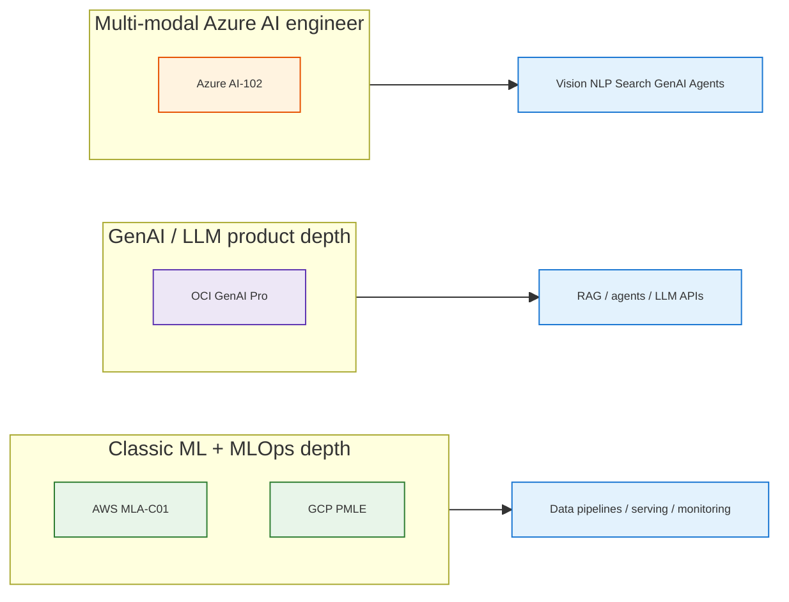

# AI / ML Certification Comparison — Four Clouds

> **Purpose:** Compare **GCP PMLE**, **AWS MLA-C01**, **OCI GenAI Professional (1Z0-1127-25)**, and **Microsoft Azure AI Engineer (AI-102)** on popularity, depth, difficulty, prep time, and fit for **fru-genai-analytics-new**.  
> **Style:** Tables follow [docs/styles/DOCS_TABLE_STYLE.md](../../styles/DOCS_TABLE_STYLE.md). Diagrams follow [docs/styles/DOCS_MERMAID_DIAGRAM_STYLE.md](../../styles/DOCS_MERMAID_DIAGRAM_STYLE.md).

**Legend**

- High / Med / Lower = relative tier (not a precise market statistic).
- **Popularity** = job postings, LinkedIn mentions, and general hiring mindshare (qualitative).
- **Repo plans:** [ai_cert_aws_gcp_oci_1_2mo.md](../plans/ai_cert_aws_gcp_oci_1_2mo.md), [ai_cert_aws_gcp_oci_3week_fast.md](../plans/ai_cert_aws_gcp_oci_3week_fast.md), [study_shared_fundamentals.md](../plans/study_shared_fundamentals.md).

**Note on local PDFs:** If you keep exam guides under `docs/learned/study/certificate_guide/*.pdf`, add them here; this folder may currently be empty—use official PDFs from each vendor’s certification page.

---

## 1. Official links

| Cert | Official page |
|------|----------------|
| **GCP PMLE** | [Professional Machine Learning Engineer](https://cloud.google.com/learn/certification/machine-learning-engineer) |
| **AWS MLA-C01** | [AWS Certified Machine Learning Engineer – Associate](https://aws.amazon.com/certification/certified-machine-learning-engineer-associate/) |
| **OCI GenAI Pro** | [Oracle OCI 2025 Generative AI Professional (1Z0-1127-25)](https://education.oracle.com/oracle-cloud-infrastructure-2025-generative-ai-professional/pexam_1Z0-1127-25) |
| **Azure AI-102** | [Microsoft Certified: Azure AI Engineer Associate](https://learn.microsoft.com/en-us/credentials/certifications/azure-ai-engineer/) |

---

## 2. Exam facts (verify fees & retirement on official sites)

<table style="width:100%; border-collapse:collapse; font-size:14px;">
<thead>
<tr>
<th style="border:1px solid #BFCAD6; padding:8px; background:#1565c0; color:white; text-align:left;">Aspect</th>
<th style="border:1px solid #BFCAD6; padding:8px; background:#1565c0; color:white; text-align:left;">GCP PMLE</th>
<th style="border:1px solid #BFCAD6; padding:8px; background:#1565c0; color:white; text-align:left;">AWS MLA-C01</th>
<th style="border:1px solid #BFCAD6; padding:8px; background:#1565c0; color:white; text-align:left;">OCI 1Z0-1127-25</th>
<th style="border:1px solid #BFCAD6; padding:8px; background:#1565c0; color:white; text-align:left;">Azure AI-102</th>
</tr>
</thead>
<tbody>
<tr>
<td style="border:1px solid #D7E0EA; padding:8px; background:#e3f2fd;"><b>Level</b></td>
<td style="border:1px solid #D7E0EA; padding:8px; background:#F8FBFF;">Professional</td>
<td style="border:1px solid #D7E0EA; padding:8px; background:#F4FFF6;">Associate</td>
<td style="border:1px solid #D7E0EA; padding:8px; background:#F8FBFF;">Professional (product)</td>
<td style="border:1px solid #D7E0EA; padding:8px; background:#fff3e0;">Associate</td>
</tr>
<tr>
<td style="border:1px solid #D7E0EA; padding:8px; background:#e3f2fd;"><b>Typical format</b></td>
<td style="border:1px solid #D7E0EA; padding:8px; background:#F8FBFF;">~50–60 Q, MC / multi-select; ~120 min; scaled pass <small>(see <a href="https://cloud.google.com/learn/certification/machine-learning-engineer">Google exam guide</a>)</small></td>
<td style="border:1px solid #D7E0EA; padding:8px; background:#F4FFF6;">65 Q (50 scored + 15 unscored); ordering/matching; pass <b>720</b>/1000</td>
<td style="border:1px solid #D7E0EA; padding:8px; background:#F8FBFF;"><b>50</b> Q, MC, <b>90 min</b>, pass <b>68%</b> per <a href="https://education.oracle.com/oracle-cloud-infrastructure-2025-generative-ai-professional/pexam_1Z0-1127-25">Oracle exam page</a></td>
<td style="border:1px solid #D7E0EA; padding:8px; background:#fff3e0;"><b>100 min</b>; interactive components possible; pass <b>700</b>/1000</td>
</tr>
<tr>
<td style="border:1px solid #D7E0EA; padding:8px; background:#e3f2fd;"><b>Renewal / lifecycle</b></td>
<td style="border:1px solid #D7E0EA; padding:8px; background:#F8FBFF;">Google recert policy (check site)</td>
<td style="border:1px solid #D7E0EA; padding:8px; background:#F4FFF6;">3-year validity typical for AWS Associate</td>
<td style="border:1px solid #D7E0EA; padding:8px; background:#ffebee; color:#7f1d1d;">⚠ <b>This exam retires on May 29, 2026.</b> A new exam will be available in <b>June 2026</b>—per <a href="https://education.oracle.com/oracle-cloud-infrastructure-2025-generative-ai-professional/pexam_1Z0-1127-25" style="color:#0d47a1">Oracle University (1Z0-1127-25)</a>.  <small>See §2.1 for replacement research (exam code/title not yet on that page).</small></td>
<td style="border:1px solid #D7E0EA; padding:8px; background:#ffebee;">⚠ Cert + exam + renewals retire <b>June 30, 2026</b> per <a href="https://learn.microsoft.com/en-us/credentials/certifications/azure-ai-engineer/">Microsoft Learn</a></td>
</tr>
</tbody>
</table>

*AWS question counts from [AWS MLA-C01 exam guide](https://aws.amazon.com/certification/certified-machine-learning-engineer-associate/). Azure retirement from [Microsoft Learn](https://learn.microsoft.com/en-us/credentials/certifications/azure-ai-engineer/). OCI retirement wording and format from [Oracle exam 1Z0-1127-25](https://education.oracle.com/oracle-cloud-infrastructure-2025-generative-ai-professional/pexam_1Z0-1127-25).*

### 2.1 OCI 1Z0-1127-25 — successor after retirement (research)

**What Oracle publishes today:** The official exam page states: *“This exam retires on May 29, 2026. A new exam will be available in June 2026.”* ([1Z0-1127-25](https://education.oracle.com/oracle-cloud-infrastructure-2025-generative-ai-professional/pexam_1Z0-1127-25))

**What is *not* published there yet (as of doc update):** Oracle does **not** list on that page the **new exam number** (e.g. next `1Z0-…` code), **exact title** (e.g. “OCI **2026** Generative AI Professional”), or **skills blueprint** for the June 2026 exam. Third-party prep sites may guess—treat as **unofficial** until Oracle adds them.

**Likely direction (inference only):** Historically Oracle aligns a new exam with the **next year** in the name (this credential is *OCI **2025** Generative AI Professional* / track [OCI25GAIOCP](https://education.oracle.com/products/trackp_OCI25GAIOCP)); the successor will probably target the same role (LLM, OCI GenAI, RAG, agents) updated for **current OCI Generative AI** features. **Confirm on [Oracle certification exams](https://education.oracle.com/oracle-certification-exams-list?regularExams) and the exam page above once June 2026 approaches.**

| Source | Says |
|--------|------|
| [Oracle 1Z0-1127-25 exam page](https://education.oracle.com/oracle-cloud-infrastructure-2025-generative-ai-professional/pexam_1Z0-1127-25) | Retires **May 29, 2026**; **new exam June 2026** |
| Same page (objectives) | Four domains: LLMs 20%, OCI GenAI service 40%, RAG 20%, RAG Agents 20%—useful baseline for what may carry forward |
| Replacement exam identity | **Not named** on official page yet—recheck Oracle University |

---

## 3. Depth: general knowledge vs professional ML engineering

<table style="width:100%; border-collapse:collapse; font-size:14px;">
<thead>
<tr>
<th style="border:1px solid #BFCAD6; padding:8px; background:#1565c0; color:white; text-align:left;">Cert</th>
<th style="border:1px solid #BFCAD6; padding:8px; background:#1565c0; color:white; text-align:left;">Emphasis</th>
<th style="border:1px solid #BFCAD6; padding:8px; background:#1565c0; color:white; text-align:left;">Depth vs “AI literacy”</th>
</tr>
</thead>
<tbody>
<tr>
<td style="border:1px solid #D7E0EA; padding:8px; background:#e3f2fd;"><b>GCP PMLE</b></td>
<td style="border:1px solid #D7E0EA; padding:8px; background:#F8FBFF;">End-to-end ML on GCP: BigQuery ML, Vertex AI, pipelines, serving, monitoring, GenAI/Model Garden <small>(per <a href="https://cloud.google.com/learn/certification/machine-learning-engineer">exam guide</a>)</small></td>
<td style="border:1px solid #D7E0EA; padding:8px; background:#F8FBFF;">Deep ML engineering + MLOps; not “slide deck” level</td>
</tr>
<tr>
<td style="border:1px solid #D7E0EA; padding:8px; background:#e3f2fd;"><b>AWS MLA-C01</b></td>
<td style="border:1px solid #D7E0EA; padding:8px; background:#F4FFF6;">Data prep → SageMaker → deploy/CI/CD → monitor/security; Bedrock + AI services in scope</td>
<td style="border:1px solid #D7E0EA; padding:8px; background:#F4FFF6;">Strong operational ML; Associate = slightly less architecture than old MLS Specialty</td>
</tr>
<tr>
<td style="border:1px solid #D7E0EA; padding:8px; background:#e3f2fd;"><b>OCI GenAI Pro</b></td>
<td style="border:1px solid #D7E0EA; padding:8px; background:#F8FBFF;">LLMs, OCI GenAI service, RAG, agents, LangChain-style apps <small>(per Oracle blueprint)</small></td>
<td style="border:1px solid #D7E0EA; padding:8px; background:#F8FBFF;">Narrower but <b>deep on GenAI</b>; less classic tabular MLOps than PMLE/MLA</td>
</tr>
<tr>
<td style="border:1px solid #D7E0EA; padding:8px; background:#e3f2fd;"><b>Azure AI-102</b></td>
<td style="border:1px solid #D7E0EA; padding:8px; background:#fff3e0;">Azure AI portfolio: vision, NLP, knowledge mining, GenAI, <b>agentic</b> solutions <small>(skills on <a href="https://learn.microsoft.com/en-us/credentials/certifications/azure-ai-engineer/">Learn</a>)</small></td>
<td style="border:1px solid #D7E0EA; padding:8px; background:#fff3e0;">Broad “AI engineer on Azure”; breadth &gt; deep ML theory</td>
</tr>
</tbody>
</table>

---

## 4. Popularity & industry recognizability (qualitative)

<table style="width:100%; border-collapse:collapse; font-size:14px;">
<thead>
<tr>
<th style="border:1px solid #BFCAD6; padding:8px; background:#1565c0; color:white; text-align:left;">Cert</th>
<th style="border:1px solid #BFCAD6; padding:8px; background:#1565c0; color:white; text-align:left;">Job market / mindshare</th>
<th style="border:1px solid #BFCAD6; padding:8px; background:#1565c0; color:white; text-align:left;">Recognizability</th>
</tr>
</thead>
<tbody>
<tr>
<td style="border:1px solid #D7E0EA; padding:8px; background:#e3f2fd;"><b>GCP PMLE</b></td>
<td style="border:1px solid #D7E0EA; padding:8px; background:#F8FBFF;">High in data/ML-heavy teams using GCP; strong in startups &amp; “cloud-native” analytics</td>
<td style="border:1px solid #D7E0EA; padding:8px; background:#F8FBFF;">Well known among engineers; HR may list “GCP ML” less often than AWS/Azure by volume</td>
</tr>
<tr>
<td style="border:1px solid #D7E0EA; padding:8px; background:#e3f2fd;"><b>AWS MLA-C01</b></td>
<td style="border:1px solid #D7E0EA; padding:8px; background:#F4FFF6;">Very high AWS footprint → cert often recognized; **newer** exam vs SAA—fewer years of LinkedIn saturation</td>
<td style="border:1px solid #D7E0EA; padding:8px; background:#F4FFF6;">Strong brand; good for “ML on AWS” roles</td>
</tr>
<tr>
<td style="border:1px solid #D7E0EA; padding:8px; background:#e3f2fd;"><b>OCI GenAI Pro</b></td>
<td style="border:1px solid #D7E0EA; padding:8px; background:#F8FBFF;">Lower overall cloud share; High value inside Oracle/OCI customers &amp; partners</td>
<td style="border:1px solid #D7E0EA; padding:8px; background:#F8FBFF;">Niche but credible for GenAI + Oracle stack</td>
</tr>
<tr>
<td style="border:1px solid #D7E0EA; padding:8px; background:#e3f2fd;"><b>Azure AI-102</b></td>
<td style="border:1px solid #D7E0EA; padding:8px; background:#fff3e0;">High where Microsoft enterprise is dominant</td>
<td style="border:1px solid #D7E0EA; padding:8px; background:#fff3e0;">Widely recognized; ⚠ retiring mid-2026—plan successor certs on Learn</td>
</tr>
</tbody>
</table>

---

## 5. Difficulty & prep time (typical ranges)

<table style="width:100%; border-collapse:collapse; font-size:14px;">
<thead>
<tr>
<th style="border:1px solid #BFCAD6; padding:8px; background:#1565c0; color:white; text-align:left;">Cert</th>
<th style="border:1px solid #BFCAD6; padding:8px; background:#1565c0; color:white; text-align:left;">Difficulty <small>(subjective)</small></th>
<th style="border:1px solid #BFCAD6; padding:8px; background:#1565c0; color:white; text-align:left;">Prep time <small>(if already mid-level)</small></th>
</tr>
</thead>
<tbody>
<tr>
<td style="border:1px solid #D7E0EA; padding:8px; background:#e3f2fd;"><b>GCP PMLE</b></td>
<td style="border:1px solid #D7E0EA; padding:8px; background:#F8FBFF;">Hard — wide surface (Vertex, BQ ML, pipelines, serving, monitoring, GenAI)</td>
<td style="border:1px solid #D7E0EA; padding:8px; background:#F8FBFF;">6–10 weeks part-time; 3–5 weeks intensive <small>(aligns with repo <a href="../plans/ai_cert_aws_gcp_oci_1_2mo.md">1–2 mo plan</a>)</small></td>
</tr>
<tr>
<td style="border:1px solid #D7E0EA; padding:8px; background:#e3f2fd;"><b>AWS MLA-C01</b></td>
<td style="border:1px solid #D7E0EA; padding:8px; background:#F4FFF6;">Medium–hard — large service list + scenario questions</td>
<td style="border:1px solid #D7E0EA; padding:8px; background:#F4FFF6;">4–8 weeks part-time; 2–3 weeks intensive</td>
</tr>
<tr>
<td style="border:1px solid #D7E0EA; padding:8px; background:#e3f2fd;"><b>OCI GenAI Pro</b></td>
<td style="border:1px solid #D7E0EA; padding:8px; background:#F8FBFF;">Medium — fewer domains, GenAI-focused</td>
<td style="border:1px solid #D7E0EA; padding:8px; background:#F8FBFF;">2–4 weeks if strong LLM/RAG already</td>
</tr>
<tr>
<td style="border:1px solid #D7E0EA; padding:8px; background:#e3f2fd;"><b>Azure AI-102</b></td>
<td style="border:1px solid #D7E0EA; padding:8px; background:#fff3e0;">Medium — breadth (vision, speech, search, GenAI, agents)</td>
<td style="border:1px solid #D7E0EA; padding:8px; background:#fff3e0;">3–6 weeks; only if finishing <b>before</b> June 2026 retirement</td>
</tr>
</tbody>
</table>

**Boosters:** Complete [study_shared_fundamentals.md](../plans/study_shared_fundamentals.md) once; use [interview docs](../interviews/) for verbal depth.

---

## 6. Practicality vs **fru-genai-analytics-new**

**Repo snapshot:** AWS-first deploy (EKS/ECS), GCP kube parity, Terraform/OpenTofu, Flask API, agents/embeddings, OpenAI/Claude, **Gemini via API** (`core_app/backend/env_utils/gcp/gemini_api_client.py` — Google AI Studio style, not necessarily Vertex), Spark analytics (`core_app/analytics/`), PostgreSQL.

<table style="width:100%; border-collapse:collapse; font-size:14px;">
<thead>
<tr>
<th style="border:1px solid #BFCAD6; padding:8px; background:#1565c0; color:white; text-align:left;">Cert</th>
<th style="border:1px solid #BFCAD6; padding:8px; background:#1565c0; color:white; text-align:left;">Fit for this repo</th>
<th style="border:1px solid #BFCAD6; padding:8px; background:#1565c0; color:white; text-align:left;">Notes</th>
</tr>
</thead>
<tbody>
<tr>
<td style="border:1px solid #D7E0EA; padding:8px; background:#e3f2fd;"><b>AWS MLA-C01</b></td>
<td style="border:1px solid #D7E0EA; padding:8px; background:#F4FFF6;">recommended for infra match</td>
<td style="border:1px solid #D7E0EA; padding:8px; background:#F4FFF6;">Maps to primary deploy path, SageMaker/Glue/Kinesis concepts vs Spark &amp; data pipelines; Bedrock ↔ LLM patterns in app</td>
</tr>
<tr>
<td style="border:1px solid #D7E0EA; padding:8px; background:#e3f2fd;"><b>GCP PMLE</b></td>
<td style="border:1px solid #D7E0EA; padding:8px; background:#F8FBFF;">✓ Strong for GKE + future Vertex</td>
<td style="border:1px solid #D7E0EA; padding:8px; background:#F8FBFF;">Vertex/BQ ML ≠ current Gemini API-only path; still high value if you extend to Vertex AI &amp; pipelines on GCP</td>
</tr>
<tr>
<td style="border:1px solid #D7E0EA; padding:8px; background:#e3f2fd;"><b>OCI GenAI Pro</b></td>
<td style="border:1px solid #D7E0EA; padding:8px; background:#F8FBFF;">Med</td>
<td style="border:1px solid #D7E0EA; padding:8px; background:#F8FBFF;">RAG/agents align with QueryAgent; OCI not in repo today—add as optional provider to maximize payoff</td>
</tr>
<tr>
<td style="border:1px solid #D7E0EA; padding:8px; background:#e3f2fd;"><b>Azure AI-102</b></td>
<td style="border:1px solid #D7E0EA; padding:8px; background:#fff3e0;">Lower for this repo</td>
<td style="border:1px solid #D7E0EA; padding:8px; background:#fff3e0;">Concepts (Azure OpenAI, AI Search) transfer; no Azure deploy in README—plus <b>retirement June 2026</b></td>
</tr>
</tbody>
</table>

---

## 7. Skill focus spectrum (MLOps vs GenAI vs Azure AI breadth)

---

## 8. Summary recommendation matrix

<table style="width:100%; border-collapse:collapse; font-size:14px;">
<thead>
<tr>
<th style="border:1px solid #BFCAD6; padding:8px; background:#1565c0; color:white; text-align:left;">Goal</th>
<th style="border:1px solid #BFCAD6; padding:8px; background:#1565c0; color:white; text-align:left;">First cert</th>
</tr>
</thead>
<tbody>
<tr><td style="border:1px solid #D7E0EA; padding:8px; background:#e3f2fd;"><b>Maximize fit with current fru-genai repo</b></td><td style="border:1px solid #D7E0EA; padding:8px; background:#F4FFF6;"><b>AWS MLA-C01</b> then <b>GCP PMLE</b></td></tr>
<tr><td style="border:1px solid #D7E0EA; padding:8px; background:#e3f2fd;"><b>Broadest ML engineering + GCP career</b></td><td style="border:1px solid #D7E0EA; padding:8px; background:#F8FBFF;"><b>GCP PMLE</b> <small>(+ Skills Boost path 17)</small></td></tr>
<tr><td style="border:1px solid #D7E0EA; padding:8px; background:#e3f2fd;"><b>Fastest GenAI credential</b></td><td style="border:1px solid #D7E0EA; padding:8px; background:#F8FBFF;"><b>OCI GenAI Pro</b> <small>(1Z0-1127-25 retires May 29, 2026—plan successor exam §2.1)</small></td></tr>
<tr><td style="border:1px solid #D7E0EA; padding:8px; background:#e3f2fd;"><b>Microsoft shop / Azure OpenAI roles</b></td><td style="border:1px solid #D7E0EA; padding:8px; background:#fff3e0;"><b>AI-102</b> only if completing before <b>June 30, 2026</b>; then migrate to replacement credential on Learn</td></tr>
</tbody>
</table>

---

## 9. References (in-repo)

| Resource | Path |
|----------|------|
| 1–2 month cert plan | [../plans/ai_cert_aws_gcp_oci_1_2mo.md](../plans/ai_cert_aws_gcp_oci_1_2mo.md) |
| 3-week fast track | [../plans/ai_cert_aws_gcp_oci_3week_fast.md](../plans/ai_cert_aws_gcp_oci_3week_fast.md) |
| Shared fundamentals + free links | [../plans/study_shared_fundamentals.md](../plans/study_shared_fundamentals.md) |
| Interview prep | [../interviews/](../interviews/) |
| Table / Mermaid style | [../../styles/DOCS_TABLE_STYLE.md](../../styles/DOCS_TABLE_STYLE.md), [../../styles/DOCS_MERMAID_DIAGRAM_STYLE.md](../../styles/DOCS_MERMAID_DIAGRAM_STYLE.md) |

---

*Disclaimer: Exam formats, fees, and retirement dates change. Always confirm on the **official** certification pages linked in §1.*
