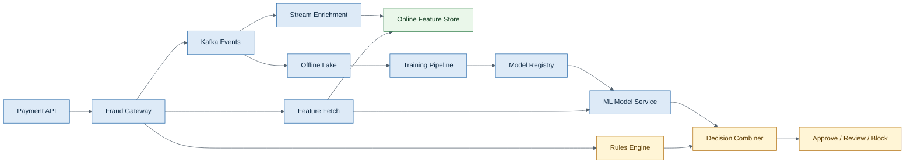
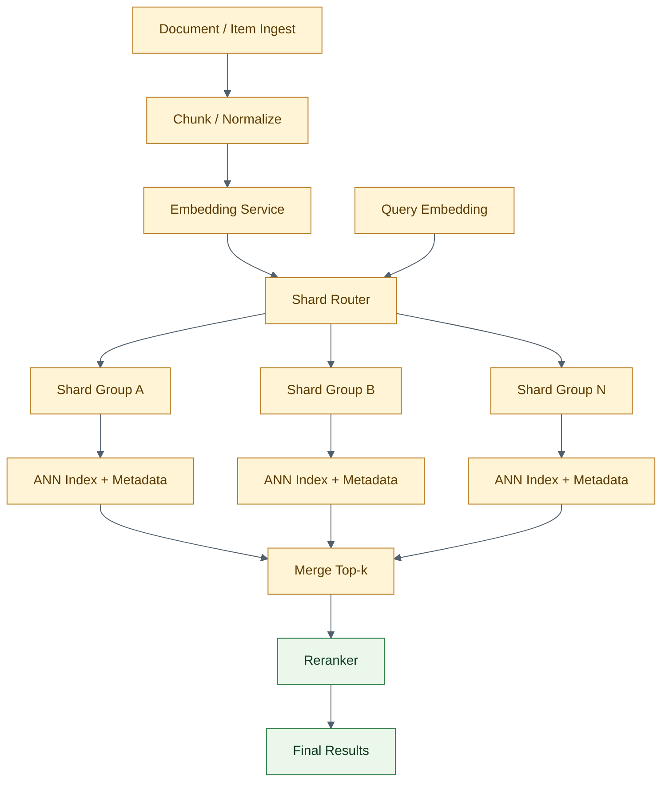
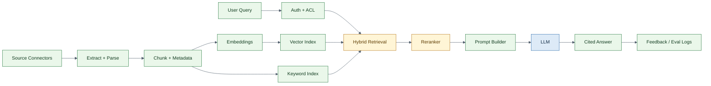
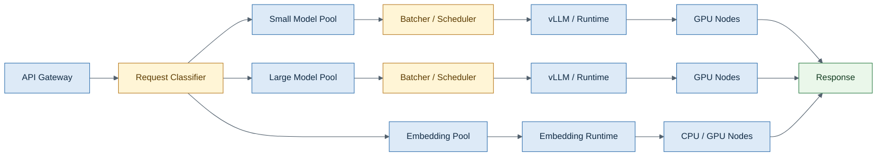
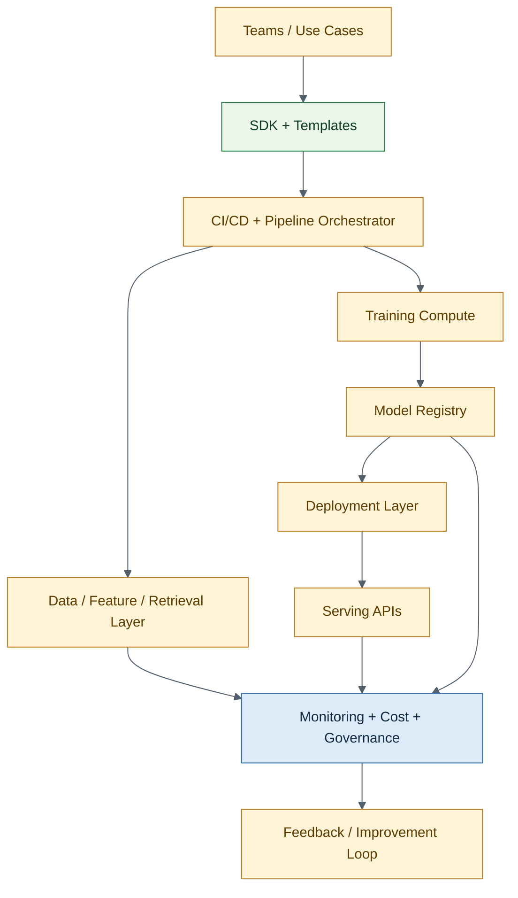

# Senior AI Engineer — Fully Solved System Design Pack (Top 5)

> Expanded designs with colored Mermaid diagrams and colored HTML tables.
> Focus: production-grade trade-offs, failure modes, and interview-friendly structure.

## Contents
- [1. Real-Time Fraud Detection System (50k QPS)](#real-time-fraud-detection-system-50k-qps)
- [2. Vector Database for 10B Embeddings](#vector-database-for-10b-embeddings)
- [3. Enterprise RAG System](#enterprise-rag-system)
- [4. GPU Inference Cluster for LLM Serving](#gpu-inference-cluster-for-llm-serving)
- [5. Multi-Tenant ML Platform for 100+ Teams](#multi-tenant-ml-platform-for-100-teams)

## 1. Real-Time Fraud Detection System (50k QPS)

<table style="width:100%; border-collapse:collapse; font-size:14px;">
<thead><tr><th style="border:1px solid #BFCAD6; padding:8px; background:#2F6FAD; color:#FFFFFF; text-align:left;">Dimension</th><th style="border:1px solid #BFCAD6; padding:8px; background:#2D7D46; color:#FFFFFF; text-align:left;">Target / Assumption</th></tr></thead><tbody>
<tr><td style="border:1px solid #D7E0EA; padding:8px; background:#F8FBFF; width:28%;"><b>Traffic</b></td><td style="border:1px solid #D7E0EA; padding:8px; background:#F8FBFF;">50k requests/sec peak, bursty during campaigns</td></tr>
<tr><td style="border:1px solid #D7E0EA; padding:8px; background:#F4FFF6; width:28%;"><b>Latency SLO</b></td><td style="border:1px solid #D7E0EA; padding:8px; background:#F4FFF6;">p95 < 80 ms, hard timeout at 120 ms</td></tr>
<tr><td style="border:1px solid #D7E0EA; padding:8px; background:#F8FBFF; width:28%;"><b>Availability</b></td><td style="border:1px solid #D7E0EA; padding:8px; background:#F8FBFF;">99.95%</td></tr>
<tr><td style="border:1px solid #D7E0EA; padding:8px; background:#F4FFF6; width:28%;"><b>Freshness</b></td><td style="border:1px solid #D7E0EA; padding:8px; background:#F4FFF6;">Feature freshness < 5 seconds for streaming features</td></tr>
<tr><td style="border:1px solid #D7E0EA; padding:8px; background:#F8FBFF; width:28%;"><b>Quality</b></td><td style="border:1px solid #D7E0EA; padding:8px; background:#F8FBFF;">High recall at controlled false-positive rate</td></tr>
<tr><td style="border:1px solid #D7E0EA; padding:8px; background:#F4FFF6; width:28%;"><b>Fallback</b></td><td style="border:1px solid #D7E0EA; padding:8px; background:#F4FFF6;">Rules-only path if ML path degrades</td></tr>
</tbody></table>

### Structured answer
1. **Start with requirements.** Clarify scale, latency, quality, cost, and compliance before drawing components.
2. **Draw the critical path.** Show how a request flows through the online path and where the offline path improves it.
3. **Call out the highest-risk bottleneck first.** In strong interviews, this matters more than naming every tool.
4. **Explain trade-offs explicitly.** Senior answers compare alternatives, not just stack components.
5. **End with failure handling and rollout strategy.** That is what separates a usable design from a nice diagram.

### Key components
<table style="width:100%; border-collapse:collapse; font-size:14px;">
<thead><tr><th style="border:1px solid #BFCAD6; padding:8px; background:#F2B134; color:#FFFFFF; text-align:left;">#</th><th style="border:1px solid #BFCAD6; padding:8px; background:#7A4DA3; color:#FFFFFF; text-align:left;">Component</th><th style="border:1px solid #BFCAD6; padding:8px; background:#2F6FAD; color:#FFFFFF; text-align:left;">Why it exists</th><th style="border:1px solid #BFCAD6; padding:8px; background:#2D7D46; color:#FFFFFF; text-align:left;">Notes</th></tr></thead><tbody>
<tr><td style="border:1px solid #D7E0EA; padding:8px; background:#FFFDF5; width:5%;"><b>1</b></td><td style="border:1px solid #D7E0EA; padding:8px; background:#FFFDF5; width:20%;"><b>Ingress</b></td><td style="border:1px solid #D7E0EA; padding:8px; background:#FFFDF5; width:28%;">Fraud Gateway behind load balancer</td><td style="border:1px solid #D7E0EA; padding:8px; background:#FFFDF5;">Validates request, assigns request ID, enforces timeout budget</td></tr>
<tr><td style="border:1px solid #D7E0EA; padding:8px; background:#F8FBFF; width:5%;"><b>2</b></td><td style="border:1px solid #D7E0EA; padding:8px; background:#F8FBFF; width:20%;"><b>Online features</b></td><td style="border:1px solid #D7E0EA; padding:8px; background:#F8FBFF; width:28%;">Redis / online feature store</td><td style="border:1px solid #D7E0EA; padding:8px; background:#F8FBFF;">Latest card velocity, device reputation, merchant anomaly stats</td></tr>
<tr><td style="border:1px solid #D7E0EA; padding:8px; background:#FFFDF5; width:5%;"><b>3</b></td><td style="border:1px solid #D7E0EA; padding:8px; background:#FFFDF5; width:20%;"><b>Streaming</b></td><td style="border:1px solid #D7E0EA; padding:8px; background:#FFFDF5; width:28%;">Kafka + stream processor</td><td style="border:1px solid #D7E0EA; padding:8px; background:#FFFDF5;">Continuously updates counters and short-window aggregates</td></tr>
<tr><td style="border:1px solid #D7E0EA; padding:8px; background:#F8FBFF; width:5%;"><b>4</b></td><td style="border:1px solid #D7E0EA; padding:8px; background:#F8FBFF; width:20%;"><b>Model serving</b></td><td style="border:1px solid #D7E0EA; padding:8px; background:#F8FBFF; width:28%;">Low-latency model service</td><td style="border:1px solid #D7E0EA; padding:8px; background:#F8FBFF;">Gradient boosting or small neural net, optimized for p95</td></tr>
<tr><td style="border:1px solid #D7E0EA; padding:8px; background:#FFFDF5; width:5%;"><b>5</b></td><td style="border:1px solid #D7E0EA; padding:8px; background:#FFFDF5; width:20%;"><b>Decision layer</b></td><td style="border:1px solid #D7E0EA; padding:8px; background:#FFFDF5; width:28%;">Rules + ML combiner</td><td style="border:1px solid #D7E0EA; padding:8px; background:#FFFDF5;">Supports manual review band and business overrides</td></tr>
<tr><td style="border:1px solid #D7E0EA; padding:8px; background:#F8FBFF; width:5%;"><b>6</b></td><td style="border:1px solid #D7E0EA; padding:8px; background:#F8FBFF; width:20%;"><b>Offline training</b></td><td style="border:1px solid #D7E0EA; padding:8px; background:#F8FBFF; width:28%;">Lakehouse + scheduled training</td><td style="border:1px solid #D7E0EA; padding:8px; background:#F8FBFF;">Joins delayed labels, trains, validates, registers</td></tr>
<tr><td style="border:1px solid #D7E0EA; padding:8px; background:#FFFDF5; width:5%;"><b>7</b></td><td style="border:1px solid #D7E0EA; padding:8px; background:#FFFDF5; width:20%;"><b>Monitoring</b></td><td style="border:1px solid #D7E0EA; padding:8px; background:#FFFDF5; width:28%;">Metrics + tracing + drift checks</td><td style="border:1px solid #D7E0EA; padding:8px; background:#FFFDF5;">Latency, approval rate, false-positive proxies, feature freshness</td></tr>
</tbody></table>

### Main trade-offs
<table style="width:100%; border-collapse:collapse; font-size:14px;">
<thead><tr><th style="border:1px solid #BFCAD6; padding:8px; background:#B7791F; color:#FFFFFF; text-align:left;">Trade-off</th><th style="border:1px solid #BFCAD6; padding:8px; background:#2F6FAD; color:#FFFFFF; text-align:left;">How to explain it in interview</th></tr></thead><tbody>
<tr><td style="border:1px solid #D7E0EA; padding:8px; background:#FFFDF5; width:32%;"><b>Rules vs ML</b></td><td style="border:1px solid #D7E0EA; padding:8px; background:#FFFDF5;">Rules give precision and explainability; ML captures non-obvious fraud patterns</td></tr>
<tr><td style="border:1px solid #D7E0EA; padding:8px; background:#F8FBFF; width:32%;"><b>More online features vs latency</b></td><td style="border:1px solid #D7E0EA; padding:8px; background:#F8FBFF;">Each network call raises predictive power but also p95 tail risk</td></tr>
<tr><td style="border:1px solid #D7E0EA; padding:8px; background:#FFFDF5; width:32%;"><b>Aggressive blocking vs customer friction</b></td><td style="border:1px solid #D7E0EA; padding:8px; background:#FFFDF5;">Higher recall may hurt approval rate and revenue</td></tr>
<tr><td style="border:1px solid #D7E0EA; padding:8px; background:#F8FBFF; width:32%;"><b>Streaming freshness vs cost</b></td><td style="border:1px solid #D7E0EA; padding:8px; background:#F8FBFF;">Sub-second freshness is powerful but expensive operationally</td></tr>
</tbody></table>

### Failure modes and mitigations
<table style="width:100%; border-collapse:collapse; font-size:14px;">
<thead><tr><th style="border:1px solid #BFCAD6; padding:8px; background:#C0392B; color:#FFFFFF; text-align:left;">Failure mode</th><th style="border:1px solid #BFCAD6; padding:8px; background:#2D7D46; color:#FFFFFF; text-align:left;">Mitigation</th></tr></thead><tbody>
<tr><td style="border:1px solid #D7E0EA; padding:8px; background:#FFF8F7; width:32%;"><b>Feature store timeout</b></td><td style="border:1px solid #D7E0EA; padding:8px; background:#FFF8F7;">Use cached defaults and degrade to rules-only path</td></tr>
<tr><td style="border:1px solid #D7E0EA; padding:8px; background:#F4FFF6; width:32%;"><b>Model latency spike</b></td><td style="border:1px solid #D7E0EA; padding:8px; background:#F4FFF6;">Trip circuit breaker and route to simpler fallback model</td></tr>
<tr><td style="border:1px solid #D7E0EA; padding:8px; background:#FFF8F7; width:32%;"><b>Label delay or corruption</b></td><td style="border:1px solid #D7E0EA; padding:8px; background:#FFF8F7;">Freeze retraining and keep prior approved model alias</td></tr>
<tr><td style="border:1px solid #D7E0EA; padding:8px; background:#F4FFF6; width:32%;"><b>Campaign traffic burst</b></td><td style="border:1px solid #D7E0EA; padding:8px; background:#F4FFF6;">Autoscale gateway and pre-warm model pods</td></tr>
</tbody></table>

### What to say out loud
1. I would not rely on ML alone; I would combine rules and ML because fraud systems need both precision and adaptability.
2. My first bottleneck is usually feature freshness versus latency, not raw model complexity.
3. I would explicitly define a rules-only fallback so payment flow does not collapse when the model path degrades.

### References
- https://kafka.apache.org/documentation/
- https://docs.feast.dev/
- https://prometheus.io/docs/introduction/overview/
- https://mlflow.org/docs/latest/ml/model-registry/

---

## 2. Vector Database for 10B Embeddings

<table style="width:100%; border-collapse:collapse; font-size:14px;">
<thead><tr><th style="border:1px solid #BFCAD6; padding:8px; background:#2F6FAD; color:#FFFFFF; text-align:left;">Dimension</th><th style="border:1px solid #BFCAD6; padding:8px; background:#2D7D46; color:#FFFFFF; text-align:left;">Target / Assumption</th></tr></thead><tbody>
<tr><td style="border:1px solid #D7E0EA; padding:8px; background:#F8FBFF; width:28%;"><b>Corpus size</b></td><td style="border:1px solid #D7E0EA; padding:8px; background:#F8FBFF;">10 billion vectors</td></tr>
<tr><td style="border:1px solid #D7E0EA; padding:8px; background:#F4FFF6; width:28%;"><b>Query type</b></td><td style="border:1px solid #D7E0EA; padding:8px; background:#F4FFF6;">Top-k ANN retrieval with metadata filters</td></tr>
<tr><td style="border:1px solid #D7E0EA; padding:8px; background:#F8FBFF; width:28%;"><b>Latency SLO</b></td><td style="border:1px solid #D7E0EA; padding:8px; background:#F8FBFF;">p95 < 250 ms</td></tr>
<tr><td style="border:1px solid #D7E0EA; padding:8px; background:#F4FFF6; width:28%;"><b>Recall target</b></td><td style="border:1px solid #D7E0EA; padding:8px; background:#F4FFF6;">High enough for downstream reranker to recover final quality</td></tr>
<tr><td style="border:1px solid #D7E0EA; padding:8px; background:#F8FBFF; width:28%;"><b>Updates</b></td><td style="border:1px solid #D7E0EA; padding:8px; background:#F8FBFF;">Daily bulk ingest + selective near-real-time inserts</td></tr>
<tr><td style="border:1px solid #D7E0EA; padding:8px; background:#F4FFF6; width:28%;"><b>Isolation</b></td><td style="border:1px solid #D7E0EA; padding:8px; background:#F4FFF6;">Multi-tenant filtering and quota control</td></tr>
</tbody></table>

### Structured answer
1. **Start with requirements.** Clarify scale, latency, quality, cost, and compliance before drawing components.
2. **Draw the critical path.** Show how a request flows through the online path and where the offline path improves it.
3. **Call out the highest-risk bottleneck first.** In strong interviews, this matters more than naming every tool.
4. **Explain trade-offs explicitly.** Senior answers compare alternatives, not just stack components.
5. **End with failure handling and rollout strategy.** That is what separates a usable design from a nice diagram.

### Key components
<table style="width:100%; border-collapse:collapse; font-size:14px;">
<thead><tr><th style="border:1px solid #BFCAD6; padding:8px; background:#F2B134; color:#FFFFFF; text-align:left;">#</th><th style="border:1px solid #BFCAD6; padding:8px; background:#7A4DA3; color:#FFFFFF; text-align:left;">Component</th><th style="border:1px solid #BFCAD6; padding:8px; background:#2F6FAD; color:#FFFFFF; text-align:left;">Why it exists</th><th style="border:1px solid #BFCAD6; padding:8px; background:#2D7D46; color:#FFFFFF; text-align:left;">Notes</th></tr></thead><tbody>
<tr><td style="border:1px solid #D7E0EA; padding:8px; background:#FFFDF5; width:5%;"><b>1</b></td><td style="border:1px solid #D7E0EA; padding:8px; background:#FFFDF5; width:20%;"><b>Partitioning</b></td><td style="border:1px solid #D7E0EA; padding:8px; background:#FFFDF5; width:28%;">Shard by tenant + semantic/hash partition</td><td style="border:1px solid #D7E0EA; padding:8px; background:#FFFDF5;">Reduces per-node memory and isolates heavy tenants</td></tr>
<tr><td style="border:1px solid #D7E0EA; padding:8px; background:#F8FBFF; width:5%;"><b>2</b></td><td style="border:1px solid #D7E0EA; padding:8px; background:#F8FBFF; width:20%;"><b>ANN index</b></td><td style="border:1px solid #D7E0EA; padding:8px; background:#F8FBFF; width:28%;">FAISS / HNSW / IVF-PQ</td><td style="border:1px solid #D7E0EA; padding:8px; background:#F8FBFF;">Balance recall, memory, rebuild cost, and update complexity</td></tr>
<tr><td style="border:1px solid #D7E0EA; padding:8px; background:#FFFDF5; width:5%;"><b>3</b></td><td style="border:1px solid #D7E0EA; padding:8px; background:#FFFDF5; width:20%;"><b>Metadata store</b></td><td style="border:1px solid #D7E0EA; padding:8px; background:#FFFDF5; width:28%;">Co-located filters or sidecar store</td><td style="border:1px solid #D7E0EA; padding:8px; background:#FFFDF5;">Supports language, region, ACL, time-range filters</td></tr>
<tr><td style="border:1px solid #D7E0EA; padding:8px; background:#F8FBFF; width:5%;"><b>4</b></td><td style="border:1px solid #D7E0EA; padding:8px; background:#F8FBFF; width:20%;"><b>Query router</b></td><td style="border:1px solid #D7E0EA; padding:8px; background:#F8FBFF; width:28%;">Fan-out coordinator</td><td style="border:1px solid #D7E0EA; padding:8px; background:#F8FBFF;">Sends query to relevant shards, merges top-k</td></tr>
<tr><td style="border:1px solid #D7E0EA; padding:8px; background:#FFFDF5; width:5%;"><b>5</b></td><td style="border:1px solid #D7E0EA; padding:8px; background:#FFFDF5; width:20%;"><b>Reranking</b></td><td style="border:1px solid #D7E0EA; padding:8px; background:#FFFDF5; width:28%;">Cross-encoder or stronger reranker</td><td style="border:1px solid #D7E0EA; padding:8px; background:#FFFDF5;">Allows ANN stage to optimize speed over exact quality</td></tr>
<tr><td style="border:1px solid #D7E0EA; padding:8px; background:#F8FBFF; width:5%;"><b>6</b></td><td style="border:1px solid #D7E0EA; padding:8px; background:#F8FBFF; width:20%;"><b>Ingestion</b></td><td style="border:1px solid #D7E0EA; padding:8px; background:#F8FBFF; width:28%;">Batch build + incremental append</td><td style="border:1px solid #D7E0EA; padding:8px; background:#F8FBFF;">Large nightly rebuilds plus small streaming overlay index</td></tr>
<tr><td style="border:1px solid #D7E0EA; padding:8px; background:#FFFDF5; width:5%;"><b>7</b></td><td style="border:1px solid #D7E0EA; padding:8px; background:#FFFDF5; width:20%;"><b>Observability</b></td><td style="border:1px solid #D7E0EA; padding:8px; background:#FFFDF5; width:28%;">Latency, recall probes, hot shard detection</td><td style="border:1px solid #D7E0EA; padding:8px; background:#FFFDF5;">Prevents silent quality erosion</td></tr>
</tbody></table>

### Main trade-offs
<table style="width:100%; border-collapse:collapse; font-size:14px;">
<thead><tr><th style="border:1px solid #BFCAD6; padding:8px; background:#B7791F; color:#FFFFFF; text-align:left;">Trade-off</th><th style="border:1px solid #BFCAD6; padding:8px; background:#2F6FAD; color:#FFFFFF; text-align:left;">How to explain it in interview</th></tr></thead><tbody>
<tr><td style="border:1px solid #D7E0EA; padding:8px; background:#FFFDF5; width:32%;"><b>HNSW vs IVF/PQ</b></td><td style="border:1px solid #D7E0EA; padding:8px; background:#FFFDF5;">HNSW gives strong recall but higher memory; IVF/PQ compresses better at massive scale</td></tr>
<tr><td style="border:1px solid #D7E0EA; padding:8px; background:#F8FBFF; width:32%;"><b>Single global index vs tenant isolation</b></td><td style="border:1px solid #D7E0EA; padding:8px; background:#F8FBFF;">Global improves utilization; tenant isolation improves security and tail latency</td></tr>
<tr><td style="border:1px solid #D7E0EA; padding:8px; background:#FFFDF5; width:32%;"><b>Realtime updates vs query stability</b></td><td style="border:1px solid #D7E0EA; padding:8px; background:#FFFDF5;">Frequent inserts help freshness but fragment memory and complicate compaction</td></tr>
<tr><td style="border:1px solid #D7E0EA; padding:8px; background:#F8FBFF; width:32%;"><b>More shards vs merge cost</b></td><td style="border:1px solid #D7E0EA; padding:8px; background:#F8FBFF;">Sharding reduces memory pressure but increases fan-out and merge overhead</td></tr>
</tbody></table>

### Failure modes and mitigations
<table style="width:100%; border-collapse:collapse; font-size:14px;">
<thead><tr><th style="border:1px solid #BFCAD6; padding:8px; background:#C0392B; color:#FFFFFF; text-align:left;">Failure mode</th><th style="border:1px solid #BFCAD6; padding:8px; background:#2D7D46; color:#FFFFFF; text-align:left;">Mitigation</th></tr></thead><tbody>
<tr><td style="border:1px solid #D7E0EA; padding:8px; background:#FFF8F7; width:32%;"><b>Hot shard</b></td><td style="border:1px solid #D7E0EA; padding:8px; background:#FFF8F7;">Rebalance partitions and apply tenant-aware routing</td></tr>
<tr><td style="border:1px solid #D7E0EA; padding:8px; background:#F4FFF6; width:32%;"><b>Recall drop after embedding model change</b></td><td style="border:1px solid #D7E0EA; padding:8px; background:#F4FFF6;">Dual-index rollout and offline+online relevance checks</td></tr>
<tr><td style="border:1px solid #D7E0EA; padding:8px; background:#FFF8F7; width:32%;"><b>Metadata filter mismatch</b></td><td style="border:1px solid #D7E0EA; padding:8px; background:#FFF8F7;">Strong schema validation and ACL tests in ingest</td></tr>
<tr><td style="border:1px solid #D7E0EA; padding:8px; background:#F4FFF6; width:32%;"><b>Index rebuild lag</b></td><td style="border:1px solid #D7E0EA; padding:8px; background:#F4FFF6;">Serve mixed base index + delta overlay until compaction completes</td></tr>
</tbody></table>

### What to say out loud
1. At 10B scale, the interview is about partitioning and memory economics more than about cosine similarity itself.
2. I would separate fast ANN retrieval from higher-quality reranking, because forcing the first stage to be perfect is too expensive.
3. I would dual-run index changes when the embedding model changes, because recall regressions are easy to miss.

### References
- https://github.com/facebookresearch/faiss
- https://github.com/pgvector/pgvector
- https://platform.openai.com/docs/guides/evals

---

## 3. Enterprise RAG System

<table style="width:100%; border-collapse:collapse; font-size:14px;">
<thead><tr><th style="border:1px solid #BFCAD6; padding:8px; background:#2F6FAD; color:#FFFFFF; text-align:left;">Dimension</th><th style="border:1px solid #BFCAD6; padding:8px; background:#2D7D46; color:#FFFFFF; text-align:left;">Target / Assumption</th></tr></thead><tbody>
<tr><td style="border:1px solid #D7E0EA; padding:8px; background:#F8FBFF; width:28%;"><b>Users</b></td><td style="border:1px solid #D7E0EA; padding:8px; background:#F8FBFF;">Internal staff across multiple departments</td></tr>
<tr><td style="border:1px solid #D7E0EA; padding:8px; background:#F4FFF6; width:28%;"><b>Content</b></td><td style="border:1px solid #D7E0EA; padding:8px; background:#F4FFF6;">Docs, PDFs, wikis, tickets, policies, code snippets</td></tr>
<tr><td style="border:1px solid #D7E0EA; padding:8px; background:#F8FBFF; width:28%;"><b>Latency SLO</b></td><td style="border:1px solid #D7E0EA; padding:8px; background:#F8FBFF;">p95 < 4 s end-to-end</td></tr>
<tr><td style="border:1px solid #D7E0EA; padding:8px; background:#F4FFF6; width:28%;"><b>Quality</b></td><td style="border:1px solid #D7E0EA; padding:8px; background:#F4FFF6;">Cited answers with high faithfulness</td></tr>
<tr><td style="border:1px solid #D7E0EA; padding:8px; background:#F8FBFF; width:28%;"><b>Security</b></td><td style="border:1px solid #D7E0EA; padding:8px; background:#F8FBFF;">Per-document ACL enforcement</td></tr>
<tr><td style="border:1px solid #D7E0EA; padding:8px; background:#F4FFF6; width:28%;"><b>Operations</b></td><td style="border:1px solid #D7E0EA; padding:8px; background:#F4FFF6;">Frequent content updates, auditability required</td></tr>
</tbody></table>

### Structured answer
1. **Start with requirements.** Clarify scale, latency, quality, cost, and compliance before drawing components.
2. **Draw the critical path.** Show how a request flows through the online path and where the offline path improves it.
3. **Call out the highest-risk bottleneck first.** In strong interviews, this matters more than naming every tool.
4. **Explain trade-offs explicitly.** Senior answers compare alternatives, not just stack components.
5. **End with failure handling and rollout strategy.** That is what separates a usable design from a nice diagram.

### Key components
<table style="width:100%; border-collapse:collapse; font-size:14px;">
<thead><tr><th style="border:1px solid #BFCAD6; padding:8px; background:#F2B134; color:#FFFFFF; text-align:left;">#</th><th style="border:1px solid #BFCAD6; padding:8px; background:#7A4DA3; color:#FFFFFF; text-align:left;">Component</th><th style="border:1px solid #BFCAD6; padding:8px; background:#2F6FAD; color:#FFFFFF; text-align:left;">Why it exists</th><th style="border:1px solid #BFCAD6; padding:8px; background:#2D7D46; color:#FFFFFF; text-align:left;">Notes</th></tr></thead><tbody>
<tr><td style="border:1px solid #D7E0EA; padding:8px; background:#FFFDF5; width:5%;"><b>1</b></td><td style="border:1px solid #D7E0EA; padding:8px; background:#FFFDF5; width:20%;"><b>Ingestion</b></td><td style="border:1px solid #D7E0EA; padding:8px; background:#FFFDF5; width:28%;">Connectors + parser</td><td style="border:1px solid #D7E0EA; padding:8px; background:#FFFDF5;">Normalizes source docs, extracts structure, preserves source metadata</td></tr>
<tr><td style="border:1px solid #D7E0EA; padding:8px; background:#F8FBFF; width:5%;"><b>2</b></td><td style="border:1px solid #D7E0EA; padding:8px; background:#F8FBFF; width:20%;"><b>Indexing</b></td><td style="border:1px solid #D7E0EA; padding:8px; background:#F8FBFF; width:28%;">Hybrid search</td><td style="border:1px solid #D7E0EA; padding:8px; background:#F8FBFF;">Combines keyword and vector retrieval for better robustness</td></tr>
<tr><td style="border:1px solid #D7E0EA; padding:8px; background:#FFFDF5; width:5%;"><b>3</b></td><td style="border:1px solid #D7E0EA; padding:8px; background:#FFFDF5; width:20%;"><b>Security</b></td><td style="border:1px solid #D7E0EA; padding:8px; background:#FFFDF5; width:28%;">ACL-aware retrieval</td><td style="border:1px solid #D7E0EA; padding:8px; background:#FFFDF5;">Filters documents before or during retrieval, never after answer generation</td></tr>
<tr><td style="border:1px solid #D7E0EA; padding:8px; background:#F8FBFF; width:5%;"><b>4</b></td><td style="border:1px solid #D7E0EA; padding:8px; background:#F8FBFF; width:20%;"><b>Reranker</b></td><td style="border:1px solid #D7E0EA; padding:8px; background:#F8FBFF; width:28%;">Higher-precision relevance stage</td><td style="border:1px solid #D7E0EA; padding:8px; background:#F8FBFF;">Improves context quality before prompt assembly</td></tr>
<tr><td style="border:1px solid #D7E0EA; padding:8px; background:#FFFDF5; width:5%;"><b>5</b></td><td style="border:1px solid #D7E0EA; padding:8px; background:#FFFDF5; width:20%;"><b>Generation</b></td><td style="border:1px solid #D7E0EA; padding:8px; background:#FFFDF5; width:28%;">LLM with strict answer policy</td><td style="border:1px solid #D7E0EA; padding:8px; background:#FFFDF5;">Uses retrieved evidence, cites sources, abstains when support is weak</td></tr>
<tr><td style="border:1px solid #D7E0EA; padding:8px; background:#F8FBFF; width:5%;"><b>6</b></td><td style="border:1px solid #D7E0EA; padding:8px; background:#F8FBFF; width:20%;"><b>Evaluation</b></td><td style="border:1px solid #D7E0EA; padding:8px; background:#F8FBFF; width:28%;">Golden set + production trace review</td><td style="border:1px solid #D7E0EA; padding:8px; background:#F8FBFF;">Separates retrieval, faithfulness, and answer usefulness</td></tr>
<tr><td style="border:1px solid #D7E0EA; padding:8px; background:#FFFDF5; width:5%;"><b>7</b></td><td style="border:1px solid #D7E0EA; padding:8px; background:#FFFDF5; width:20%;"><b>Feedback loop</b></td><td style="border:1px solid #D7E0EA; padding:8px; background:#FFFDF5; width:28%;">Thumbs-up/down + correction capture</td><td style="border:1px solid #D7E0EA; padding:8px; background:#FFFDF5;">Drives index, prompt, and corpus improvements</td></tr>
</tbody></table>

### Main trade-offs
<table style="width:100%; border-collapse:collapse; font-size:14px;">
<thead><tr><th style="border:1px solid #BFCAD6; padding:8px; background:#B7791F; color:#FFFFFF; text-align:left;">Trade-off</th><th style="border:1px solid #BFCAD6; padding:8px; background:#2F6FAD; color:#FFFFFF; text-align:left;">How to explain it in interview</th></tr></thead><tbody>
<tr><td style="border:1px solid #D7E0EA; padding:8px; background:#FFFDF5; width:32%;"><b>Larger context vs latency/cost</b></td><td style="border:1px solid #D7E0EA; padding:8px; background:#FFFDF5;">More chunks can help recall but often dilute focus and increase hallucination risk</td></tr>
<tr><td style="border:1px solid #D7E0EA; padding:8px; background:#F8FBFF; width:32%;"><b>Vector-only vs hybrid retrieval</b></td><td style="border:1px solid #D7E0EA; padding:8px; background:#F8FBFF;">Vector is semantically flexible; hybrid is more stable for exact terms and IDs</td></tr>
<tr><td style="border:1px solid #D7E0EA; padding:8px; background:#FFFDF5; width:32%;"><b>Centralized answer synthesis vs department-specific agents</b></td><td style="border:1px solid #D7E0EA; padding:8px; background:#FFFDF5;">Centralization simplifies governance; specialization can improve domain quality</td></tr>
<tr><td style="border:1px solid #D7E0EA; padding:8px; background:#F8FBFF; width:32%;"><b>Strict abstention vs broader answers</b></td><td style="border:1px solid #D7E0EA; padding:8px; background:#F8FBFF;">Abstention protects trust but may frustrate users if tuned too aggressively</td></tr>
</tbody></table>

### Failure modes and mitigations
<table style="width:100%; border-collapse:collapse; font-size:14px;">
<thead><tr><th style="border:1px solid #BFCAD6; padding:8px; background:#C0392B; color:#FFFFFF; text-align:left;">Failure mode</th><th style="border:1px solid #BFCAD6; padding:8px; background:#2D7D46; color:#FFFFFF; text-align:left;">Mitigation</th></tr></thead><tbody>
<tr><td style="border:1px solid #D7E0EA; padding:8px; background:#FFF8F7; width:32%;"><b>Prompt injection in source docs</b></td><td style="border:1px solid #D7E0EA; padding:8px; background:#FFF8F7;">Sanitize untrusted text, isolate instructions, reduce tool permissions</td></tr>
<tr><td style="border:1px solid #D7E0EA; padding:8px; background:#F4FFF6; width:32%;"><b>Wrong docs retrieved due to stale index</b></td><td style="border:1px solid #D7E0EA; padding:8px; background:#F4FFF6;">Incremental reindexing and freshness SLOs</td></tr>
<tr><td style="border:1px solid #D7E0EA; padding:8px; background:#FFF8F7; width:32%;"><b>ACL leak</b></td><td style="border:1px solid #D7E0EA; padding:8px; background:#FFF8F7;">Security tests at retrieval layer and red-team validation</td></tr>
<tr><td style="border:1px solid #D7E0EA; padding:8px; background:#F4FFF6; width:32%;"><b>Hallucinated answer despite evidence</b></td><td style="border:1px solid #D7E0EA; padding:8px; background:#F4FFF6;">Citations required, faithfulness evals, stronger refusal policy</td></tr>
</tbody></table>

### What to say out loud
1. I would treat security and ACL enforcement as part of retrieval, not a post-processing add-on.
2. I would evaluate retrieval quality separately from answer faithfulness so I know where failures originate.
3. I would prefer hybrid retrieval over vector-only for enterprise corpora with IDs, exact terms, and messy formatting.

### References
- https://genai.owasp.org/
- https://langchain-ai.github.io/langgraph/
- https://platform.openai.com/docs/guides/evals

---

## 4. GPU Inference Cluster for LLM Serving

<table style="width:100%; border-collapse:collapse; font-size:14px;">
<thead><tr><th style="border:1px solid #BFCAD6; padding:8px; background:#2F6FAD; color:#FFFFFF; text-align:left;">Dimension</th><th style="border:1px solid #BFCAD6; padding:8px; background:#2D7D46; color:#FFFFFF; text-align:left;">Target / Assumption</th></tr></thead><tbody>
<tr><td style="border:1px solid #D7E0EA; padding:8px; background:#F8FBFF; width:28%;"><b>Workload</b></td><td style="border:1px solid #D7E0EA; padding:8px; background:#F8FBFF;">Chat + batch generation + embeddings</td></tr>
<tr><td style="border:1px solid #D7E0EA; padding:8px; background:#F4FFF6; width:28%;"><b>Latency SLO</b></td><td style="border:1px solid #D7E0EA; padding:8px; background:#F4FFF6;">Interactive chat p95 < 2.5 s for first answer token</td></tr>
<tr><td style="border:1px solid #D7E0EA; padding:8px; background:#F8FBFF; width:28%;"><b>Utilization</b></td><td style="border:1px solid #D7E0EA; padding:8px; background:#F8FBFF;">Keep GPUs well-used without destroying tail latency</td></tr>
<tr><td style="border:1px solid #D7E0EA; padding:8px; background:#F4FFF6; width:28%;"><b>Routing</b></td><td style="border:1px solid #D7E0EA; padding:8px; background:#F4FFF6;">Model-tier routing based on task complexity</td></tr>
<tr><td style="border:1px solid #D7E0EA; padding:8px; background:#F8FBFF; width:28%;"><b>Cost</b></td><td style="border:1px solid #D7E0EA; padding:8px; background:#F8FBFF;">Minimize cost per successful task</td></tr>
<tr><td style="border:1px solid #D7E0EA; padding:8px; background:#F4FFF6; width:28%;"><b>Reliability</b></td><td style="border:1px solid #D7E0EA; padding:8px; background:#F4FFF6;">Graceful overload handling</td></tr>
</tbody></table>

### Structured answer
1. **Start with requirements.** Clarify scale, latency, quality, cost, and compliance before drawing components.
2. **Draw the critical path.** Show how a request flows through the online path and where the offline path improves it.
3. **Call out the highest-risk bottleneck first.** In strong interviews, this matters more than naming every tool.
4. **Explain trade-offs explicitly.** Senior answers compare alternatives, not just stack components.
5. **End with failure handling and rollout strategy.** That is what separates a usable design from a nice diagram.

### Key components
<table style="width:100%; border-collapse:collapse; font-size:14px;">
<thead><tr><th style="border:1px solid #BFCAD6; padding:8px; background:#F2B134; color:#FFFFFF; text-align:left;">#</th><th style="border:1px solid #BFCAD6; padding:8px; background:#7A4DA3; color:#FFFFFF; text-align:left;">Component</th><th style="border:1px solid #BFCAD6; padding:8px; background:#2F6FAD; color:#FFFFFF; text-align:left;">Why it exists</th><th style="border:1px solid #BFCAD6; padding:8px; background:#2D7D46; color:#FFFFFF; text-align:left;">Notes</th></tr></thead><tbody>
<tr><td style="border:1px solid #D7E0EA; padding:8px; background:#FFFDF5; width:5%;"><b>1</b></td><td style="border:1px solid #D7E0EA; padding:8px; background:#FFFDF5; width:20%;"><b>Gateway</b></td><td style="border:1px solid #D7E0EA; padding:8px; background:#FFFDF5; width:28%;">Admission control + auth + quotas</td><td style="border:1px solid #D7E0EA; padding:8px; background:#FFFDF5;">Protects expensive GPU layer from overload</td></tr>
<tr><td style="border:1px solid #D7E0EA; padding:8px; background:#F8FBFF; width:5%;"><b>2</b></td><td style="border:1px solid #D7E0EA; padding:8px; background:#F8FBFF; width:20%;"><b>Classifier/router</b></td><td style="border:1px solid #D7E0EA; padding:8px; background:#F8FBFF; width:28%;">Task-to-model mapping</td><td style="border:1px solid #D7E0EA; padding:8px; background:#F8FBFF;">Routes simple tasks to cheaper models and reserves premium GPUs for hard tasks</td></tr>
<tr><td style="border:1px solid #D7E0EA; padding:8px; background:#FFFDF5; width:5%;"><b>3</b></td><td style="border:1px solid #D7E0EA; padding:8px; background:#FFFDF5; width:20%;"><b>Runtime</b></td><td style="border:1px solid #D7E0EA; padding:8px; background:#FFFDF5; width:28%;">vLLM / optimized serving stack</td><td style="border:1px solid #D7E0EA; padding:8px; background:#FFFDF5;">Uses batching, paged KV cache, and memory-efficient scheduling</td></tr>
<tr><td style="border:1px solid #D7E0EA; padding:8px; background:#F8FBFF; width:5%;"><b>4</b></td><td style="border:1px solid #D7E0EA; padding:8px; background:#F8FBFF; width:20%;"><b>Batching</b></td><td style="border:1px solid #D7E0EA; padding:8px; background:#F8FBFF; width:28%;">Separate queues per traffic class</td><td style="border:1px solid #D7E0EA; padding:8px; background:#F8FBFF;">Prevents batch jobs from harming interactive chat latency</td></tr>
<tr><td style="border:1px solid #D7E0EA; padding:8px; background:#FFFDF5; width:5%;"><b>5</b></td><td style="border:1px solid #D7E0EA; padding:8px; background:#FFFDF5; width:20%;"><b>Autoscaling</b></td><td style="border:1px solid #D7E0EA; padding:8px; background:#FFFDF5; width:28%;">GPU pool scaler</td><td style="border:1px solid #D7E0EA; padding:8px; background:#FFFDF5;">Scales by queue depth, token throughput, and latency, not CPU only</td></tr>
<tr><td style="border:1px solid #D7E0EA; padding:8px; background:#F8FBFF; width:5%;"><b>6</b></td><td style="border:1px solid #D7E0EA; padding:8px; background:#F8FBFF; width:20%;"><b>Caching</b></td><td style="border:1px solid #D7E0EA; padding:8px; background:#F8FBFF; width:28%;">Prompt or response cache where safe</td><td style="border:1px solid #D7E0EA; padding:8px; background:#F8FBFF;">Reduces repeated cost for stable prompts and retrieval results</td></tr>
<tr><td style="border:1px solid #D7E0EA; padding:8px; background:#FFFDF5; width:5%;"><b>7</b></td><td style="border:1px solid #D7E0EA; padding:8px; background:#FFFDF5; width:20%;"><b>Observability</b></td><td style="border:1px solid #D7E0EA; padding:8px; background:#FFFDF5; width:28%;">Per-model latency, TTFT, tokens/sec, queue depth</td><td style="border:1px solid #D7E0EA; padding:8px; background:#FFFDF5;">Needed to see whether utilization improvements hurt users</td></tr>
</tbody></table>

### Main trade-offs
<table style="width:100%; border-collapse:collapse; font-size:14px;">
<thead><tr><th style="border:1px solid #BFCAD6; padding:8px; background:#B7791F; color:#FFFFFF; text-align:left;">Trade-off</th><th style="border:1px solid #BFCAD6; padding:8px; background:#2F6FAD; color:#FFFFFF; text-align:left;">How to explain it in interview</th></tr></thead><tbody>
<tr><td style="border:1px solid #D7E0EA; padding:8px; background:#FFFDF5; width:32%;"><b>Higher batching vs TTFT</b></td><td style="border:1px solid #D7E0EA; padding:8px; background:#FFFDF5;">Throughput improves, but time-to-first-token can worsen</td></tr>
<tr><td style="border:1px solid #D7E0EA; padding:8px; background:#F8FBFF; width:32%;"><b>Single giant model vs routed model family</b></td><td style="border:1px solid #D7E0EA; padding:8px; background:#F8FBFF;">Giant model simplifies quality expectations but can be economically wasteful</td></tr>
<tr><td style="border:1px solid #D7E0EA; padding:8px; background:#FFFDF5; width:32%;"><b>GPU concentration vs resilience</b></td><td style="border:1px solid #D7E0EA; padding:8px; background:#FFFDF5;">Dense packing improves efficiency; diversified pools improve failover</td></tr>
<tr><td style="border:1px solid #D7E0EA; padding:8px; background:#F8FBFF; width:32%;"><b>Aggressive caching vs freshness/privacy</b></td><td style="border:1px solid #D7E0EA; padding:8px; background:#F8FBFF;">Caching reduces spend but can create stale or risky reuse</td></tr>
</tbody></table>

### Failure modes and mitigations
<table style="width:100%; border-collapse:collapse; font-size:14px;">
<thead><tr><th style="border:1px solid #BFCAD6; padding:8px; background:#C0392B; color:#FFFFFF; text-align:left;">Failure mode</th><th style="border:1px solid #BFCAD6; padding:8px; background:#2D7D46; color:#FFFFFF; text-align:left;">Mitigation</th></tr></thead><tbody>
<tr><td style="border:1px solid #D7E0EA; padding:8px; background:#FFF8F7; width:32%;"><b>Queue explosion during peak</b></td><td style="border:1px solid #D7E0EA; padding:8px; background:#FFF8F7;">Use admission control, priority queues, and graceful downgrade</td></tr>
<tr><td style="border:1px solid #D7E0EA; padding:8px; background:#F4FFF6; width:32%;"><b>GPU OOM</b></td><td style="border:1px solid #D7E0EA; padding:8px; background:#F4FFF6;">Cap sequence lengths, isolate tenants, tune batcher, and use safer model configs</td></tr>
<tr><td style="border:1px solid #D7E0EA; padding:8px; background:#FFF8F7; width:32%;"><b>Large model unavailable</b></td><td style="border:1px solid #D7E0EA; padding:8px; background:#FFF8F7;">Fallback to smaller model with explicit quality downgrade</td></tr>
<tr><td style="border:1px solid #D7E0EA; padding:8px; background:#F4FFF6; width:32%;"><b>Scheduler optimizes throughput but hurts premium users</b></td><td style="border:1px solid #D7E0EA; padding:8px; background:#F4FFF6;">Segment traffic classes and reserve capacity</td></tr>
</tbody></table>

### What to say out loud
1. My main optimization target is cost per successful task while preserving time-to-first-token for premium traffic.
2. I would separate traffic classes so batch jobs do not starve chat users.
3. I would use model routing aggressively because one giant model for every task is usually financially wrong.

### References
- https://docs.vllm.ai/
- https://kserve.github.io/website/latest/
- https://prometheus.io/docs/introduction/overview/

---

## 5. Multi-Tenant ML Platform for 100+ Teams

<table style="width:100%; border-collapse:collapse; font-size:14px;">
<thead><tr><th style="border:1px solid #BFCAD6; padding:8px; background:#2F6FAD; color:#FFFFFF; text-align:left;">Dimension</th><th style="border:1px solid #BFCAD6; padding:8px; background:#2D7D46; color:#FFFFFF; text-align:left;">Target / Assumption</th></tr></thead><tbody>
<tr><td style="border:1px solid #D7E0EA; padding:8px; background:#F8FBFF; width:28%;"><b>Users</b></td><td style="border:1px solid #D7E0EA; padding:8px; background:#F8FBFF;">100+ internal teams with varying maturity</td></tr>
<tr><td style="border:1px solid #D7E0EA; padding:8px; background:#F4FFF6; width:28%;"><b>Scope</b></td><td style="border:1px solid #D7E0EA; padding:8px; background:#F4FFF6;">Training, registry, deployment, monitoring, GenAI and classical ML</td></tr>
<tr><td style="border:1px solid #D7E0EA; padding:8px; background:#F8FBFF; width:28%;"><b>Governance</b></td><td style="border:1px solid #D7E0EA; padding:8px; background:#F8FBFF;">Strong auditability, RBAC, cost controls</td></tr>
<tr><td style="border:1px solid #D7E0EA; padding:8px; background:#F4FFF6; width:28%;"><b>Developer experience</b></td><td style="border:1px solid #D7E0EA; padding:8px; background:#F4FFF6;">Good defaults, templates, self-service</td></tr>
<tr><td style="border:1px solid #D7E0EA; padding:8px; background:#F8FBFF; width:28%;"><b>Reliability</b></td><td style="border:1px solid #D7E0EA; padding:8px; background:#F8FBFF;">Safe promotions, rollback, tenancy isolation</td></tr>
<tr><td style="border:1px solid #D7E0EA; padding:8px; background:#F4FFF6; width:28%;"><b>Adoption</b></td><td style="border:1px solid #D7E0EA; padding:8px; background:#F4FFF6;">Must support gradual migration from notebooks</td></tr>
</tbody></table>

### Structured answer
1. **Start with requirements.** Clarify scale, latency, quality, cost, and compliance before drawing components.
2. **Draw the critical path.** Show how a request flows through the online path and where the offline path improves it.
3. **Call out the highest-risk bottleneck first.** In strong interviews, this matters more than naming every tool.
4. **Explain trade-offs explicitly.** Senior answers compare alternatives, not just stack components.
5. **End with failure handling and rollout strategy.** That is what separates a usable design from a nice diagram.

### Key components
<table style="width:100%; border-collapse:collapse; font-size:14px;">
<thead><tr><th style="border:1px solid #BFCAD6; padding:8px; background:#F2B134; color:#FFFFFF; text-align:left;">#</th><th style="border:1px solid #BFCAD6; padding:8px; background:#7A4DA3; color:#FFFFFF; text-align:left;">Component</th><th style="border:1px solid #BFCAD6; padding:8px; background:#2F6FAD; color:#FFFFFF; text-align:left;">Why it exists</th><th style="border:1px solid #BFCAD6; padding:8px; background:#2D7D46; color:#FFFFFF; text-align:left;">Notes</th></tr></thead><tbody>
<tr><td style="border:1px solid #D7E0EA; padding:8px; background:#FFFDF5; width:5%;"><b>1</b></td><td style="border:1px solid #D7E0EA; padding:8px; background:#FFFDF5; width:20%;"><b>Entry layer</b></td><td style="border:1px solid #D7E0EA; padding:8px; background:#FFFDF5; width:28%;">SDKs, templates, examples</td><td style="border:1px solid #D7E0EA; padding:8px; background:#FFFDF5;">Makes the paved road easier than custom ad hoc setups</td></tr>
<tr><td style="border:1px solid #D7E0EA; padding:8px; background:#F8FBFF; width:5%;"><b>2</b></td><td style="border:1px solid #D7E0EA; padding:8px; background:#F8FBFF; width:20%;"><b>Execution</b></td><td style="border:1px solid #D7E0EA; padding:8px; background:#F8FBFF; width:28%;">Pipeline orchestrator + compute profiles</td><td style="border:1px solid #D7E0EA; padding:8px; background:#F8FBFF;">Supports batch training, evals, and scheduled retraining</td></tr>
<tr><td style="border:1px solid #D7E0EA; padding:8px; background:#FFFDF5; width:5%;"><b>3</b></td><td style="border:1px solid #D7E0EA; padding:8px; background:#FFFDF5; width:20%;"><b>Registry</b></td><td style="border:1px solid #D7E0EA; padding:8px; background:#FFFDF5; width:28%;">Central lineage and approvals</td><td style="border:1px solid #D7E0EA; padding:8px; background:#FFFDF5;">Connects experiments to promotion decisions</td></tr>
<tr><td style="border:1px solid #D7E0EA; padding:8px; background:#F8FBFF; width:5%;"><b>4</b></td><td style="border:1px solid #D7E0EA; padding:8px; background:#F8FBFF; width:20%;"><b>Serving</b></td><td style="border:1px solid #D7E0EA; padding:8px; background:#F8FBFF; width:28%;">Standard deployment abstractions</td><td style="border:1px solid #D7E0EA; padding:8px; background:#F8FBFF;">Supports batch, online, shadow, canary, and rollback</td></tr>
<tr><td style="border:1px solid #D7E0EA; padding:8px; background:#FFFDF5; width:5%;"><b>5</b></td><td style="border:1px solid #D7E0EA; padding:8px; background:#FFFDF5; width:20%;"><b>Observability</b></td><td style="border:1px solid #D7E0EA; padding:8px; background:#FFFDF5; width:28%;">Metrics, traces, cost, drift, incidents</td><td style="border:1px solid #D7E0EA; padding:8px; background:#FFFDF5;">Unified view so platform and app teams can debug together</td></tr>
<tr><td style="border:1px solid #D7E0EA; padding:8px; background:#F8FBFF; width:5%;"><b>6</b></td><td style="border:1px solid #D7E0EA; padding:8px; background:#F8FBFF; width:20%;"><b>Security/governance</b></td><td style="border:1px solid #D7E0EA; padding:8px; background:#F8FBFF; width:28%;">RBAC, secrets, policy checks, audit logs</td><td style="border:1px solid #D7E0EA; padding:8px; background:#F8FBFF;">Needed for regulated or cross-business usage</td></tr>
<tr><td style="border:1px solid #D7E0EA; padding:8px; background:#FFFDF5; width:5%;"><b>7</b></td><td style="border:1px solid #D7E0EA; padding:8px; background:#FFFDF5; width:20%;"><b>FinOps</b></td><td style="border:1px solid #D7E0EA; padding:8px; background:#FFFDF5; width:28%;">Quota, budgets, model routing policy</td><td style="border:1px solid #D7E0EA; padding:8px; background:#FFFDF5;">Controls runaway spend without blocking every team</td></tr>
</tbody></table>

### Main trade-offs
<table style="width:100%; border-collapse:collapse; font-size:14px;">
<thead><tr><th style="border:1px solid #BFCAD6; padding:8px; background:#B7791F; color:#FFFFFF; text-align:left;">Trade-off</th><th style="border:1px solid #BFCAD6; padding:8px; background:#2F6FAD; color:#FFFFFF; text-align:left;">How to explain it in interview</th></tr></thead><tbody>
<tr><td style="border:1px solid #D7E0EA; padding:8px; background:#FFFDF5; width:32%;"><b>Central platform vs team autonomy</b></td><td style="border:1px solid #D7E0EA; padding:8px; background:#FFFDF5;">More centralization improves safety and consistency but can slow edge-case innovation</td></tr>
<tr><td style="border:1px solid #D7E0EA; padding:8px; background:#F8FBFF; width:32%;"><b>One-size-fits-all abstractions vs flexibility</b></td><td style="border:1px solid #D7E0EA; padding:8px; background:#F8FBFF;">Simple abstractions drive adoption but may not fit advanced workloads</td></tr>
<tr><td style="border:1px solid #D7E0EA; padding:8px; background:#FFFDF5; width:32%;"><b>Fast self-service vs governance gates</b></td><td style="border:1px solid #D7E0EA; padding:8px; background:#FFFDF5;">Reducing friction improves productivity, but unsafe promotion paths create costly incidents</td></tr>
<tr><td style="border:1px solid #D7E0EA; padding:8px; background:#F8FBFF; width:32%;"><b>Managed services vs in-house control</b></td><td style="border:1px solid #D7E0EA; padding:8px; background:#F8FBFF;">Managed speeds delivery; in-house may be required for cost, security, or custom workflows</td></tr>
</tbody></table>

### Failure modes and mitigations
<table style="width:100%; border-collapse:collapse; font-size:14px;">
<thead><tr><th style="border:1px solid #BFCAD6; padding:8px; background:#C0392B; color:#FFFFFF; text-align:left;">Failure mode</th><th style="border:1px solid #BFCAD6; padding:8px; background:#2D7D46; color:#FFFFFF; text-align:left;">Mitigation</th></tr></thead><tbody>
<tr><td style="border:1px solid #D7E0EA; padding:8px; background:#FFF8F7; width:32%;"><b>Low adoption</b></td><td style="border:1px solid #D7E0EA; padding:8px; background:#FFF8F7;">Improve templates, docs, paved-road UX, and remove platform tax</td></tr>
<tr><td style="border:1px solid #D7E0EA; padding:8px; background:#F4FFF6; width:32%;"><b>Platform team becomes bottleneck</b></td><td style="border:1px solid #D7E0EA; padding:8px; background:#F4FFF6;">Shift to self-service with policy-as-code and reusable golden paths</td></tr>
<tr><td style="border:1px solid #D7E0EA; padding:8px; background:#FFF8F7; width:32%;"><b>Cost sprawl</b></td><td style="border:1px solid #D7E0EA; padding:8px; background:#FFF8F7;">Per-team budgets, chargeback visibility, routing policies, and idle cleanup</td></tr>
<tr><td style="border:1px solid #D7E0EA; padding:8px; background:#F4FFF6; width:32%;"><b>Fragmented observability</b></td><td style="border:1px solid #D7E0EA; padding:8px; background:#F4FFF6;">Require standard logging/tracing/metrics contracts across all services</td></tr>
</tbody></table>

### What to say out loud
1. The platform should provide a paved road with strong defaults, because adoption is a product problem as much as a technical one.
2. I would centralize governance and observability, but keep workload-specific flexibility at the edges.
3. Success is not measured by how many platform features exist; it is measured by safe adoption and reduced time-to-production.

### References
- https://mlflow.org/docs/latest/
- https://docs.feast.dev/
- https://www.kubeflow.org/docs/components/pipelines/overview/
- https://opentelemetry.io/docs/

---

