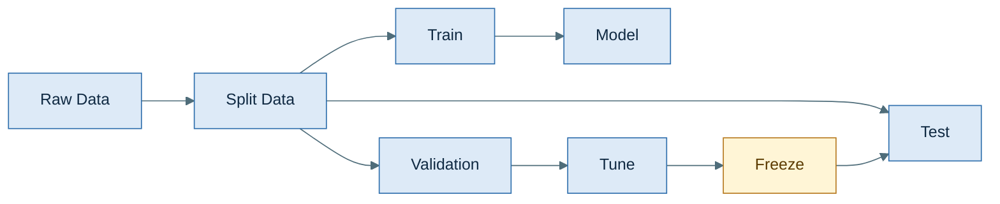
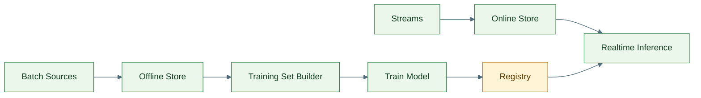
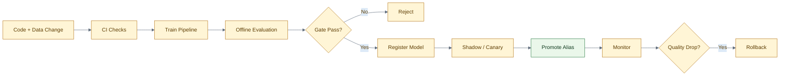
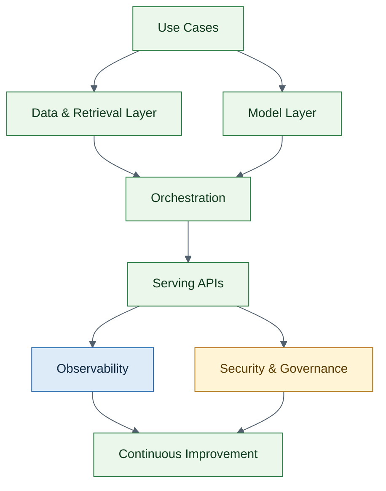

# Senior AI Engineer & MLOps Interview Handbook — 100 Questions
> Ordered from easier foundations to harder system design and platform questions.
> Format: downloadable Markdown with colored HTML tables and colored Mermaid diagrams.

## How to use this file
1. Revise Sections 1–3 for fundamentals and strong verbal explanations.
2. Use Sections 4–5 for MLOps and production/system-design rounds.
3. Use Sections 6–7 for GenAI/RAG/security/platform discussions.

## Table of Contents
- [1. ML Fundamentals (1–15)](#1-ml-fundamentals)
- [2. Evaluation & Model Selection (16–25)](#2-evaluation--model-selection)
- [3. Data, Features & Drift (26–35)](#3-data,-features--drift)
- [4. MLOps Lifecycle (36–50)](#4-mlops-lifecycle)
- [5. Serving & System Design (51–65)](#5-serving--system-design)
- [6. LLM / GenAI (66–85)](#6-llm--genai)
- [7. Platform, Security & Leadership-Level Design (86–100)](#7-platform,-security--leadership-level-design)

## 1. ML Fundamentals

<table style="width:100%; border-collapse:collapse; font-size:14px;">
<thead>
<tr>
<th style="border:1px solid #BFCAD6; padding:8px; background:#F2B134; color:#FFFFFF; text-align:left;">#</th>
<th style="border:1px solid #BFCAD6; padding:8px; background:#2F6FAD; color:#FFFFFF; text-align:left;">Question</th>
<th style="border:1px solid #BFCAD6; padding:8px; background:#2D7D46; color:#FFFFFF; text-align:left;">Answer</th>
<th style="border:1px solid #BFCAD6; padding:8px; background:#7A4DA3; color:#FFFFFF; text-align:left;">Official / Primary References</th>
</tr>
</thead>
<tbody>
<tr>
<td style="border:1px solid #D7E0EA; padding:8px; vertical-align:top; background:#F8FBFF; width:4%;"><b>1</b></td>
<td style="border:1px solid #D7E0EA; padding:8px; vertical-align:top; background:#F8FBFF; width:24%;"><b>What is supervised learning?</b></td>
<td style="border:1px solid #D7E0EA; padding:8px; vertical-align:top; background:#F8FBFF; width:48%;">Learning a mapping from inputs to labeled outputs. In interviews, mention both classification and regression, then connect it to business loss, not just accuracy.</td>
<td style="border:1px solid #D7E0EA; padding:8px; vertical-align:top; background:#F8FBFF; width:24%;"><a href="https://scikit-learn.org/stable/modules/model_evaluation.html">https://scikit-learn.org/stable/modules/model_evaluation.html</a></td>
</tr>
<tr>
<td style="border:1px solid #D7E0EA; padding:8px; vertical-align:top; background:#F4FFF6; width:4%;"><b>2</b></td>
<td style="border:1px solid #D7E0EA; padding:8px; vertical-align:top; background:#F4FFF6; width:24%;"><b>What is the difference between classification and regression?</b></td>
<td style="border:1px solid #D7E0EA; padding:8px; vertical-align:top; background:#F4FFF6; width:48%;">Classification predicts discrete labels or probabilities; regression predicts continuous values. A senior answer also notes that evaluation, calibration, and thresholding differ by problem type.</td>
<td style="border:1px solid #D7E0EA; padding:8px; vertical-align:top; background:#F4FFF6; width:24%;"><a href="https://scikit-learn.org/stable/modules/model_evaluation.html">https://scikit-learn.org/stable/modules/model_evaluation.html</a></td>
</tr>
<tr>
<td style="border:1px solid #D7E0EA; padding:8px; vertical-align:top; background:#F8FBFF; width:4%;"><b>3</b></td>
<td style="border:1px solid #D7E0EA; padding:8px; vertical-align:top; background:#F8FBFF; width:24%;"><b>What is overfitting?</b></td>
<td style="border:1px solid #D7E0EA; padding:8px; vertical-align:top; background:#F8FBFF; width:48%;">A model fits training noise instead of general patterns, so train performance is high while validation performance drops. Discuss regularization, simpler models, more data, and better validation design.</td>
<td style="border:1px solid #D7E0EA; padding:8px; vertical-align:top; background:#F8FBFF; width:24%;"><a href="https://scikit-learn.org/stable/modules/cross_validation.html">https://scikit-learn.org/stable/modules/cross_validation.html</a> <a href="https://scikit-learn.org/stable/modules/model_evaluation.html">https://scikit-learn.org/stable/modules/model_evaluation.html</a></td>
</tr>
<tr>
<td style="border:1px solid #D7E0EA; padding:8px; vertical-align:top; background:#F4FFF6; width:4%;"><b>4</b></td>
<td style="border:1px solid #D7E0EA; padding:8px; vertical-align:top; background:#F4FFF6; width:24%;"><b>What is underfitting?</b></td>
<td style="border:1px solid #D7E0EA; padding:8px; vertical-align:top; background:#F4FFF6; width:48%;">The model is too simple or too constrained to capture signal. Typical fixes are richer features, less regularization, longer training, or a more expressive architecture.</td>
<td style="border:1px solid #D7E0EA; padding:8px; vertical-align:top; background:#F4FFF6; width:24%;"><a href="https://scikit-learn.org/stable/modules/cross_validation.html">https://scikit-learn.org/stable/modules/cross_validation.html</a></td>
</tr>
<tr>
<td style="border:1px solid #D7E0EA; padding:8px; vertical-align:top; background:#F8FBFF; width:4%;"><b>5</b></td>
<td style="border:1px solid #D7E0EA; padding:8px; vertical-align:top; background:#F8FBFF; width:24%;"><b>Explain bias vs variance.</b></td>
<td style="border:1px solid #D7E0EA; padding:8px; vertical-align:top; background:#F8FBFF; width:48%;">Bias is systematic error from overly simple assumptions; variance is sensitivity to training fluctuations. Strong candidates explain the trade-off in terms of model complexity, dataset size, and regularization.</td>
<td style="border:1px solid #D7E0EA; padding:8px; vertical-align:top; background:#F8FBFF; width:24%;"><a href="https://scikit-learn.org/stable/modules/cross_validation.html">https://scikit-learn.org/stable/modules/cross_validation.html</a></td>
</tr>
<tr>
<td style="border:1px solid #D7E0EA; padding:8px; vertical-align:top; background:#F4FFF6; width:4%;"><b>6</b></td>
<td style="border:1px solid #D7E0EA; padding:8px; vertical-align:top; background:#F4FFF6; width:24%;"><b>Why do we split train, validation, and test sets?</b></td>
<td style="border:1px solid #D7E0EA; padding:8px; vertical-align:top; background:#F4FFF6; width:48%;">Training tunes weights, validation guides model selection, and test estimates final generalization. The key senior point is governance: the test set should stay untouched until decisions are frozen.</td>
<td style="border:1px solid #D7E0EA; padding:8px; vertical-align:top; background:#F4FFF6; width:24%;"><a href="https://scikit-learn.org/stable/modules/cross_validation.html">https://scikit-learn.org/stable/modules/cross_validation.html</a></td>
</tr>
<tr>
<td style="border:1px solid #D7E0EA; padding:8px; vertical-align:top; background:#F8FBFF; width:4%;"><b>7</b></td>
<td style="border:1px solid #D7E0EA; padding:8px; vertical-align:top; background:#F8FBFF; width:24%;"><b>What is cross-validation?</b></td>
<td style="border:1px solid #D7E0EA; padding:8px; vertical-align:top; background:#F8FBFF; width:48%;">It estimates model stability by training on multiple folds instead of one split. For senior roles, mention when not to use plain k-fold, such as temporal, grouped, or leakage-prone data.</td>
<td style="border:1px solid #D7E0EA; padding:8px; vertical-align:top; background:#F8FBFF; width:24%;"><a href="https://scikit-learn.org/stable/modules/cross_validation.html">https://scikit-learn.org/stable/modules/cross_validation.html</a></td>
</tr>
<tr>
<td style="border:1px solid #D7E0EA; padding:8px; vertical-align:top; background:#F4FFF6; width:4%;"><b>8</b></td>
<td style="border:1px solid #D7E0EA; padding:8px; vertical-align:top; background:#F4FFF6; width:24%;"><b>When should you use stratified sampling?</b></td>
<td style="border:1px solid #D7E0EA; padding:8px; vertical-align:top; background:#F4FFF6; width:48%;">When class imbalance matters and you want each split to preserve label proportions. This reduces noisy comparisons across folds and is often the default for classification.</td>
<td style="border:1px solid #D7E0EA; padding:8px; vertical-align:top; background:#F4FFF6; width:24%;"><a href="https://scikit-learn.org/stable/modules/cross_validation.html">https://scikit-learn.org/stable/modules/cross_validation.html</a></td>
</tr>
<tr>
<td style="border:1px solid #D7E0EA; padding:8px; vertical-align:top; background:#F8FBFF; width:4%;"><b>9</b></td>
<td style="border:1px solid #D7E0EA; padding:8px; vertical-align:top; background:#F8FBFF; width:24%;"><b>What is regularization?</b></td>
<td style="border:1px solid #D7E0EA; padding:8px; vertical-align:top; background:#F8FBFF; width:48%;">Regularization penalizes complexity to improve generalization. In practice, that includes L1/L2 penalties, dropout, early stopping, and architectural choices that reduce variance.</td>
<td style="border:1px solid #D7E0EA; padding:8px; vertical-align:top; background:#F8FBFF; width:24%;"><a href="https://scikit-learn.org/stable/modules/model_evaluation.html">https://scikit-learn.org/stable/modules/model_evaluation.html</a></td>
</tr>
<tr>
<td style="border:1px solid #D7E0EA; padding:8px; vertical-align:top; background:#F4FFF6; width:4%;"><b>10</b></td>
<td style="border:1px solid #D7E0EA; padding:8px; vertical-align:top; background:#F4FFF6; width:24%;"><b>L1 vs L2: when do you prefer each?</b></td>
<td style="border:1px solid #D7E0EA; padding:8px; vertical-align:top; background:#F4FFF6; width:48%;">L1 can produce sparse weights and implicit feature selection; L2 usually gives smoother, more stable solutions. In production tabular ML, L2 is often the safer default unless sparsity is a goal.</td>
<td style="border:1px solid #D7E0EA; padding:8px; vertical-align:top; background:#F4FFF6; width:24%;"><a href="https://scikit-learn.org/stable/modules/model_evaluation.html">https://scikit-learn.org/stable/modules/model_evaluation.html</a></td>
</tr>
<tr>
<td style="border:1px solid #D7E0EA; padding:8px; vertical-align:top; background:#F8FBFF; width:4%;"><b>11</b></td>
<td style="border:1px solid #D7E0EA; padding:8px; vertical-align:top; background:#F8FBFF; width:24%;"><b>What is gradient descent?</b></td>
<td style="border:1px solid #D7E0EA; padding:8px; vertical-align:top; background:#F8FBFF; width:48%;">An optimization method that updates parameters in the direction that reduces loss. Senior answers distinguish batch, mini-batch, and stochastic variants and note the practical role of learning-rate schedules.</td>
<td style="border:1px solid #D7E0EA; padding:8px; vertical-align:top; background:#F8FBFF; width:24%;"><a href="https://scikit-learn.org/stable/modules/model_evaluation.html">https://scikit-learn.org/stable/modules/model_evaluation.html</a></td>
</tr>
<tr>
<td style="border:1px solid #D7E0EA; padding:8px; vertical-align:top; background:#F4FFF6; width:4%;"><b>12</b></td>
<td style="border:1px solid #D7E0EA; padding:8px; vertical-align:top; background:#F4FFF6; width:24%;"><b>What is a loss function?</b></td>
<td style="border:1px solid #D7E0EA; padding:8px; vertical-align:top; background:#F4FFF6; width:48%;">A loss function quantifies how wrong predictions are during training. A mature answer ties the chosen loss to business asymmetry, such as recall-sensitive fraud detection or ranking quality.</td>
<td style="border:1px solid #D7E0EA; padding:8px; vertical-align:top; background:#F4FFF6; width:24%;"><a href="https://scikit-learn.org/stable/modules/model_evaluation.html">https://scikit-learn.org/stable/modules/model_evaluation.html</a></td>
</tr>
<tr>
<td style="border:1px solid #D7E0EA; padding:8px; vertical-align:top; background:#F8FBFF; width:4%;"><b>13</b></td>
<td style="border:1px solid #D7E0EA; padding:8px; vertical-align:top; background:#F8FBFF; width:24%;"><b>What is feature scaling and why does it matter?</b></td>
<td style="border:1px solid #D7E0EA; padding:8px; vertical-align:top; background:#F8FBFF; width:48%;">Scaling puts numeric features on comparable ranges, which especially helps distance-based models and gradient-based optimization. Tree models often need it less, which is a good interview nuance.</td>
<td style="border:1px solid #D7E0EA; padding:8px; vertical-align:top; background:#F8FBFF; width:24%;"><a href="https://scikit-learn.org/stable/modules/preprocessing.html">https://scikit-learn.org/stable/modules/preprocessing.html</a></td>
</tr>
<tr>
<td style="border:1px solid #D7E0EA; padding:8px; vertical-align:top; background:#F4FFF6; width:4%;"><b>14</b></td>
<td style="border:1px solid #D7E0EA; padding:8px; vertical-align:top; background:#F4FFF6; width:24%;"><b>What is one-hot encoding?</b></td>
<td style="border:1px solid #D7E0EA; padding:8px; vertical-align:top; background:#F4FFF6; width:48%;">It converts categorical levels into binary indicator columns. Senior candidates mention high-cardinality pitfalls and alternatives like target encoding, embeddings, or hashing.</td>
<td style="border:1px solid #D7E0EA; padding:8px; vertical-align:top; background:#F4FFF6; width:24%;"><a href="https://scikit-learn.org/stable/modules/preprocessing.html">https://scikit-learn.org/stable/modules/preprocessing.html</a></td>
</tr>
<tr>
<td style="border:1px solid #D7E0EA; padding:8px; vertical-align:top; background:#F8FBFF; width:4%;"><b>15</b></td>
<td style="border:1px solid #D7E0EA; padding:8px; vertical-align:top; background:#F8FBFF; width:24%;"><b>How do you choose a baseline model?</b></td>
<td style="border:1px solid #D7E0EA; padding:8px; vertical-align:top; background:#F8FBFF; width:48%;">Pick the simplest credible baseline first: rules, linear model, or a small tree ensemble. The senior mindset is to make the baseline hard to beat operationally, not just statistically.</td>
<td style="border:1px solid #D7E0EA; padding:8px; vertical-align:top; background:#F8FBFF; width:24%;"><a href="https://scikit-learn.org/stable/modules/model_evaluation.html">https://scikit-learn.org/stable/modules/model_evaluation.html</a></td>
</tr>
</tbody>
</table>

## 2. Evaluation & Model Selection

<table style="width:100%; border-collapse:collapse; font-size:14px;">
<thead>
<tr>
<th style="border:1px solid #BFCAD6; padding:8px; background:#F2B134; color:#FFFFFF; text-align:left;">#</th>
<th style="border:1px solid #BFCAD6; padding:8px; background:#2F6FAD; color:#FFFFFF; text-align:left;">Question</th>
<th style="border:1px solid #BFCAD6; padding:8px; background:#2D7D46; color:#FFFFFF; text-align:left;">Answer</th>
<th style="border:1px solid #BFCAD6; padding:8px; background:#7A4DA3; color:#FFFFFF; text-align:left;">Official / Primary References</th>
</tr>
</thead>
<tbody>
<tr>
<td style="border:1px solid #D7E0EA; padding:8px; vertical-align:top; background:#F4FFF6; width:4%;"><b>16</b></td>
<td style="border:1px solid #D7E0EA; padding:8px; vertical-align:top; background:#F4FFF6; width:24%;"><b>Accuracy vs precision vs recall: how do you explain them?</b></td>
<td style="border:1px solid #D7E0EA; padding:8px; vertical-align:top; background:#F4FFF6; width:48%;">Accuracy is overall correctness, precision is how many predicted positives were correct, and recall is how many real positives you caught. The senior answer starts with business cost: false positives and false negatives rarely cost the same.</td>
<td style="border:1px solid #D7E0EA; padding:8px; vertical-align:top; background:#F4FFF6; width:24%;"><a href="https://scikit-learn.org/stable/modules/model_evaluation.html">https://scikit-learn.org/stable/modules/model_evaluation.html</a></td>
</tr>
<tr>
<td style="border:1px solid #D7E0EA; padding:8px; vertical-align:top; background:#F8FBFF; width:4%;"><b>17</b></td>
<td style="border:1px solid #D7E0EA; padding:8px; vertical-align:top; background:#F8FBFF; width:24%;"><b>When is F1 useful?</b></td>
<td style="border:1px solid #D7E0EA; padding:8px; vertical-align:top; background:#F8FBFF; width:48%;">F1 is useful when you need a single number balancing precision and recall, especially under imbalance. It is less useful when one side matters much more than the other, where you should optimize a targeted metric instead.</td>
<td style="border:1px solid #D7E0EA; padding:8px; vertical-align:top; background:#F8FBFF; width:24%;"><a href="https://scikit-learn.org/stable/modules/model_evaluation.html">https://scikit-learn.org/stable/modules/model_evaluation.html</a></td>
</tr>
<tr>
<td style="border:1px solid #D7E0EA; padding:8px; vertical-align:top; background:#F4FFF6; width:4%;"><b>18</b></td>
<td style="border:1px solid #D7E0EA; padding:8px; vertical-align:top; background:#F4FFF6; width:24%;"><b>ROC-AUC vs PR-AUC: which is better for imbalanced data?</b></td>
<td style="border:1px solid #D7E0EA; padding:8px; vertical-align:top; background:#F4FFF6; width:48%;">PR-AUC is usually more informative for highly imbalanced problems because it focuses on positive-class quality. ROC-AUC can look deceptively strong when negatives dominate.</td>
<td style="border:1px solid #D7E0EA; padding:8px; vertical-align:top; background:#F4FFF6; width:24%;"><a href="https://scikit-learn.org/stable/modules/generated/sklearn.metrics.precision_recall_curve.html">https://scikit-learn.org/stable/modules/generated/sklearn.metrics.precision_recall_curve.html</a> <a href="https://scikit-learn.org/stable/modules/model_evaluation.html">https://scikit-learn.org/stable/modules/model_evaluation.html</a></td>
</tr>
<tr>
<td style="border:1px solid #D7E0EA; padding:8px; vertical-align:top; background:#F8FBFF; width:4%;"><b>19</b></td>
<td style="border:1px solid #D7E0EA; padding:8px; vertical-align:top; background:#F8FBFF; width:24%;"><b>What is calibration?</b></td>
<td style="border:1px solid #D7E0EA; padding:8px; vertical-align:top; background:#F8FBFF; width:48%;">Calibration means predicted probabilities match real-world frequencies. In product systems, good ranking with poor calibration can still cause bad thresholds, pricing, or alert volumes.</td>
<td style="border:1px solid #D7E0EA; padding:8px; vertical-align:top; background:#F8FBFF; width:24%;"><a href="https://scikit-learn.org/stable/modules/model_evaluation.html">https://scikit-learn.org/stable/modules/model_evaluation.html</a></td>
</tr>
<tr>
<td style="border:1px solid #D7E0EA; padding:8px; vertical-align:top; background:#F4FFF6; width:4%;"><b>20</b></td>
<td style="border:1px solid #D7E0EA; padding:8px; vertical-align:top; background:#F4FFF6; width:24%;"><b>How do you choose a decision threshold?</b></td>
<td style="border:1px solid #D7E0EA; padding:8px; vertical-align:top; background:#F4FFF6; width:48%;">Do not default to 0.5. Choose the threshold by expected business cost, capacity constraints, or required precision/recall at deployment time.</td>
<td style="border:1px solid #D7E0EA; padding:8px; vertical-align:top; background:#F4FFF6; width:24%;"><a href="https://scikit-learn.org/stable/modules/model_evaluation.html">https://scikit-learn.org/stable/modules/model_evaluation.html</a></td>
</tr>
<tr>
<td style="border:1px solid #D7E0EA; padding:8px; vertical-align:top; background:#F8FBFF; width:4%;"><b>21</b></td>
<td style="border:1px solid #D7E0EA; padding:8px; vertical-align:top; background:#F8FBFF; width:24%;"><b>What is a confusion matrix actually good for?</b></td>
<td style="border:1px solid #D7E0EA; padding:8px; vertical-align:top; background:#F8FBFF; width:48%;">It makes error trade-offs tangible by showing TP, FP, TN, and FN counts. Seniors use it to have risk conversations with product, compliance, or operations teams.</td>
<td style="border:1px solid #D7E0EA; padding:8px; vertical-align:top; background:#F8FBFF; width:24%;"><a href="https://scikit-learn.org/stable/modules/model_evaluation.html">https://scikit-learn.org/stable/modules/model_evaluation.html</a></td>
</tr>
<tr>
<td style="border:1px solid #D7E0EA; padding:8px; vertical-align:top; background:#F4FFF6; width:4%;"><b>22</b></td>
<td style="border:1px solid #D7E0EA; padding:8px; vertical-align:top; background:#F4FFF6; width:24%;"><b>How do you evaluate regression models?</b></td>
<td style="border:1px solid #D7E0EA; padding:8px; vertical-align:top; background:#F4FFF6; width:48%;">Use metrics like MAE, RMSE, MAPE, and residual analysis. A strong answer explains why outlier sensitivity and business interpretability differ across these metrics.</td>
<td style="border:1px solid #D7E0EA; padding:8px; vertical-align:top; background:#F4FFF6; width:24%;"><a href="https://scikit-learn.org/stable/modules/model_evaluation.html">https://scikit-learn.org/stable/modules/model_evaluation.html</a></td>
</tr>
<tr>
<td style="border:1px solid #D7E0EA; padding:8px; vertical-align:top; background:#F8FBFF; width:4%;"><b>23</b></td>
<td style="border:1px solid #D7E0EA; padding:8px; vertical-align:top; background:#F8FBFF; width:24%;"><b>What is leakage in model evaluation?</b></td>
<td style="border:1px solid #D7E0EA; padding:8px; vertical-align:top; background:#F8FBFF; width:48%;">Leakage happens when information unavailable at inference sneaks into training or validation. It often hides in preprocessing, target leakage, time leakage, or duplicated entities across splits.</td>
<td style="border:1px solid #D7E0EA; padding:8px; vertical-align:top; background:#F8FBFF; width:24%;"><a href="https://scikit-learn.org/stable/modules/cross_validation.html">https://scikit-learn.org/stable/modules/cross_validation.html</a> <a href="https://scikit-learn.org/stable/modules/compose.html">https://scikit-learn.org/stable/modules/compose.html</a></td>
</tr>
<tr>
<td style="border:1px solid #D7E0EA; padding:8px; vertical-align:top; background:#F4FFF6; width:4%;"><b>24</b></td>
<td style="border:1px solid #D7E0EA; padding:8px; vertical-align:top; background:#F4FFF6; width:24%;"><b>How do you validate time-series models?</b></td>
<td style="border:1px solid #D7E0EA; padding:8px; vertical-align:top; background:#F4FFF6; width:48%;">Use time-aware splits that respect chronology, such as rolling or expanding windows. Plain shuffled k-fold is wrong because it leaks future information.</td>
<td style="border:1px solid #D7E0EA; padding:8px; vertical-align:top; background:#F4FFF6; width:24%;"><a href="https://scikit-learn.org/stable/modules/cross_validation.html">https://scikit-learn.org/stable/modules/cross_validation.html</a></td>
</tr>
<tr>
<td style="border:1px solid #D7E0EA; padding:8px; vertical-align:top; background:#F8FBFF; width:4%;"><b>25</b></td>
<td style="border:1px solid #D7E0EA; padding:8px; vertical-align:top; background:#F8FBFF; width:24%;"><b>Why monitor both offline and online metrics?</b></td>
<td style="border:1px solid #D7E0EA; padding:8px; vertical-align:top; background:#F8FBFF; width:48%;">Offline metrics estimate model quality before launch; online metrics show whether the model still works under real traffic, real latency, and real user behavior. Good MLOps links the two instead of treating them as separate worlds.</td>
<td style="border:1px solid #D7E0EA; padding:8px; vertical-align:top; background:#F8FBFF; width:24%;"><a href="https://docs.evidentlyai.com/">https://docs.evidentlyai.com/</a> <a href="https://prometheus.io/docs/introduction/overview/">https://prometheus.io/docs/introduction/overview/</a></td>
</tr>
</tbody>
</table>

## 3. Data, Features & Drift

<table style="width:100%; border-collapse:collapse; font-size:14px;">
<thead>
<tr>
<th style="border:1px solid #BFCAD6; padding:8px; background:#F2B134; color:#FFFFFF; text-align:left;">#</th>
<th style="border:1px solid #BFCAD6; padding:8px; background:#2F6FAD; color:#FFFFFF; text-align:left;">Question</th>
<th style="border:1px solid #BFCAD6; padding:8px; background:#2D7D46; color:#FFFFFF; text-align:left;">Answer</th>
<th style="border:1px solid #BFCAD6; padding:8px; background:#7A4DA3; color:#FFFFFF; text-align:left;">Official / Primary References</th>
</tr>
</thead>
<tbody>
<tr>
<td style="border:1px solid #D7E0EA; padding:8px; vertical-align:top; background:#F4FFF6; width:4%;"><b>26</b></td>
<td style="border:1px solid #D7E0EA; padding:8px; vertical-align:top; background:#F4FFF6; width:24%;"><b>How do you handle missing values?</b></td>
<td style="border:1px solid #D7E0EA; padding:8px; vertical-align:top; background:#F4FFF6; width:48%;">Start by understanding why values are missing, because the missingness itself may be informative. Then choose dropping, statistical imputation, model-based imputation, or explicit missing indicators depending on risk and scale.</td>
<td style="border:1px solid #D7E0EA; padding:8px; vertical-align:top; background:#F4FFF6; width:24%;"><a href="https://scikit-learn.org/stable/modules/preprocessing.html">https://scikit-learn.org/stable/modules/preprocessing.html</a></td>
</tr>
<tr>
<td style="border:1px solid #D7E0EA; padding:8px; vertical-align:top; background:#F8FBFF; width:4%;"><b>27</b></td>
<td style="border:1px solid #D7E0EA; padding:8px; vertical-align:top; background:#F8FBFF; width:24%;"><b>How do you treat outliers?</b></td>
<td style="border:1px solid #D7E0EA; padding:8px; vertical-align:top; background:#F8FBFF; width:48%;">First decide whether they are errors, rare but valid events, or the very cases the business cares about. Then use clipping, robust transforms, special labels, or separate handling paths rather than blind deletion.</td>
<td style="border:1px solid #D7E0EA; padding:8px; vertical-align:top; background:#F8FBFF; width:24%;"><a href="https://scikit-learn.org/stable/modules/preprocessing.html">https://scikit-learn.org/stable/modules/preprocessing.html</a></td>
</tr>
<tr>
<td style="border:1px solid #D7E0EA; padding:8px; vertical-align:top; background:#F4FFF6; width:4%;"><b>28</b></td>
<td style="border:1px solid #D7E0EA; padding:8px; vertical-align:top; background:#F4FFF6; width:24%;"><b>What is target encoding and what can go wrong?</b></td>
<td style="border:1px solid #D7E0EA; padding:8px; vertical-align:top; background:#F4FFF6; width:48%;">Target encoding replaces categories with target statistics. Done naively, it leaks label information; done safely, it uses fold-aware encoding, smoothing, and strong holdout discipline.</td>
<td style="border:1px solid #D7E0EA; padding:8px; vertical-align:top; background:#F4FFF6; width:24%;"><a href="https://scikit-learn.org/stable/modules/cross_validation.html">https://scikit-learn.org/stable/modules/cross_validation.html</a></td>
</tr>
<tr>
<td style="border:1px solid #D7E0EA; padding:8px; vertical-align:top; background:#F8FBFF; width:4%;"><b>29</b></td>
<td style="border:1px solid #D7E0EA; padding:8px; vertical-align:top; background:#F8FBFF; width:24%;"><b>When do embeddings beat one-hot encoding?</b></td>
<td style="border:1px solid #D7E0EA; padding:8px; vertical-align:top; background:#F8FBFF; width:48%;">Embeddings help when categorical space is large, sparse, or semantically structured. One-hot is often simpler and surprisingly strong for small to medium cardinality with tree models.</td>
<td style="border:1px solid #D7E0EA; padding:8px; vertical-align:top; background:#F8FBFF; width:24%;"><a href="https://huggingface.co/docs/transformers/main/tokenizer_summary">https://huggingface.co/docs/transformers/main/tokenizer_summary</a></td>
</tr>
<tr>
<td style="border:1px solid #D7E0EA; padding:8px; vertical-align:top; background:#F4FFF6; width:4%;"><b>30</b></td>
<td style="border:1px solid #D7E0EA; padding:8px; vertical-align:top; background:#F4FFF6; width:24%;"><b>What is feature drift?</b></td>
<td style="border:1px solid #D7E0EA; padding:8px; vertical-align:top; background:#F4FFF6; width:48%;">Feature drift is a change in the input distribution over time. It may not break the model immediately, but it is often the earliest warning that the environment or user behavior is changing.</td>
<td style="border:1px solid #D7E0EA; padding:8px; vertical-align:top; background:#F4FFF6; width:24%;"><a href="https://docs.evidentlyai.com/">https://docs.evidentlyai.com/</a></td>
</tr>
<tr>
<td style="border:1px solid #D7E0EA; padding:8px; vertical-align:top; background:#F8FBFF; width:4%;"><b>31</b></td>
<td style="border:1px solid #D7E0EA; padding:8px; vertical-align:top; background:#F8FBFF; width:24%;"><b>What is concept drift?</b></td>
<td style="border:1px solid #D7E0EA; padding:8px; vertical-align:top; background:#F8FBFF; width:48%;">Concept drift is when the relationship between features and labels changes, even if the input distribution looks similar. This is more dangerous than pure feature drift because a stable-looking dashboard can still hide model failure.</td>
<td style="border:1px solid #D7E0EA; padding:8px; vertical-align:top; background:#F8FBFF; width:24%;"><a href="https://docs.evidentlyai.com/">https://docs.evidentlyai.com/</a></td>
</tr>
<tr>
<td style="border:1px solid #D7E0EA; padding:8px; vertical-align:top; background:#F4FFF6; width:4%;"><b>32</b></td>
<td style="border:1px solid #D7E0EA; padding:8px; vertical-align:top; background:#F4FFF6; width:24%;"><b>What is training-serving skew?</b></td>
<td style="border:1px solid #D7E0EA; padding:8px; vertical-align:top; background:#F4FFF6; width:48%;">It is a mismatch between how features are computed during training and during inference. Feature stores and shared transformation pipelines exist largely to prevent this.</td>
<td style="border:1px solid #D7E0EA; padding:8px; vertical-align:top; background:#F4FFF6; width:24%;"><a href="https://docs.feast.dev/getting-started/quickstart">https://docs.feast.dev/getting-started/quickstart</a> <a href="https://docs.feast.dev/getting-started/architecture/overview">https://docs.feast.dev/getting-started/architecture/overview</a></td>
</tr>
<tr>
<td style="border:1px solid #D7E0EA; padding:8px; vertical-align:top; background:#F8FBFF; width:4%;"><b>33</b></td>
<td style="border:1px solid #D7E0EA; padding:8px; vertical-align:top; background:#F8FBFF; width:24%;"><b>How do you decide whether a feature belongs online or offline?</b></td>
<td style="border:1px solid #D7E0EA; padding:8px; vertical-align:top; background:#F8FBFF; width:48%;">Put it online only if low-latency inference truly needs it and freshness materially improves outcomes. Everything online increases serving complexity, cache pressure, and operational failure modes.</td>
<td style="border:1px solid #D7E0EA; padding:8px; vertical-align:top; background:#F8FBFF; width:24%;"><a href="https://docs.feast.dev/getting-started/architecture/overview">https://docs.feast.dev/getting-started/architecture/overview</a> <a href="https://docs.feast.dev/">https://docs.feast.dev/</a></td>
</tr>
<tr>
<td style="border:1px solid #D7E0EA; padding:8px; vertical-align:top; background:#F4FFF6; width:4%;"><b>34</b></td>
<td style="border:1px solid #D7E0EA; padding:8px; vertical-align:top; background:#F4FFF6; width:24%;"><b>What makes a good feature store contract?</b></td>
<td style="border:1px solid #D7E0EA; padding:8px; vertical-align:top; background:#F4FFF6; width:48%;">Clear entity keys, time semantics, source-of-truth definitions, backfill rules, freshness SLAs, and ownership. The senior insight is that feature stores are as much organizational contracts as technical systems.</td>
<td style="border:1px solid #D7E0EA; padding:8px; vertical-align:top; background:#F4FFF6; width:24%;"><a href="https://docs.feast.dev/">https://docs.feast.dev/</a> <a href="https://docs.feast.dev/getting-started/architecture/overview">https://docs.feast.dev/getting-started/architecture/overview</a></td>
</tr>
<tr>
<td style="border:1px solid #D7E0EA; padding:8px; vertical-align:top; background:#F8FBFF; width:4%;"><b>35</b></td>
<td style="border:1px solid #D7E0EA; padding:8px; vertical-align:top; background:#F8FBFF; width:24%;"><b>How do you debug a model that is good offline but bad online?</b></td>
<td style="border:1px solid #D7E0EA; padding:8px; vertical-align:top; background:#F8FBFF; width:48%;">Check request logging, training-serving skew, missing feature defaults, distribution shifts, threshold mismatches, and online latency timeouts. Senior engineers trace the full path from raw event to user-visible action.</td>
<td style="border:1px solid #D7E0EA; padding:8px; vertical-align:top; background:#F8FBFF; width:24%;"><a href="https://docs.feast.dev/getting-started/quickstart">https://docs.feast.dev/getting-started/quickstart</a> <a href="https://prometheus.io/docs/introduction/overview/">https://prometheus.io/docs/introduction/overview/</a> <a href="https://opentelemetry.io/docs/">https://opentelemetry.io/docs/</a></td>
</tr>
</tbody>
</table>

## 4. MLOps Lifecycle

<table style="width:100%; border-collapse:collapse; font-size:14px;">
<thead>
<tr>
<th style="border:1px solid #BFCAD6; padding:8px; background:#F2B134; color:#FFFFFF; text-align:left;">#</th>
<th style="border:1px solid #BFCAD6; padding:8px; background:#2F6FAD; color:#FFFFFF; text-align:left;">Question</th>
<th style="border:1px solid #BFCAD6; padding:8px; background:#2D7D46; color:#FFFFFF; text-align:left;">Answer</th>
<th style="border:1px solid #BFCAD6; padding:8px; background:#7A4DA3; color:#FFFFFF; text-align:left;">Official / Primary References</th>
</tr>
</thead>
<tbody>
<tr>
<td style="border:1px solid #D7E0EA; padding:8px; vertical-align:top; background:#F4FFF6; width:4%;"><b>36</b></td>
<td style="border:1px solid #D7E0EA; padding:8px; vertical-align:top; background:#F4FFF6; width:24%;"><b>What is MLOps?</b></td>
<td style="border:1px solid #D7E0EA; padding:8px; vertical-align:top; background:#F4FFF6; width:48%;">MLOps extends software engineering discipline to data and model systems: versioning, reproducibility, deployment, monitoring, and retraining. A senior answer stresses that the hard part is managing change, not training one model.</td>
<td style="border:1px solid #D7E0EA; padding:8px; vertical-align:top; background:#F4FFF6; width:24%;"><a href="https://mlflow.org/docs/latest/">https://mlflow.org/docs/latest/</a> <a href="https://www.kubeflow.org/docs/components/pipelines/overview/">https://www.kubeflow.org/docs/components/pipelines/overview/</a></td>
</tr>
<tr>
<td style="border:1px solid #D7E0EA; padding:8px; vertical-align:top; background:#F8FBFF; width:4%;"><b>37</b></td>
<td style="border:1px solid #D7E0EA; padding:8px; vertical-align:top; background:#F8FBFF; width:24%;"><b>Why is experiment tracking important?</b></td>
<td style="border:1px solid #D7E0EA; padding:8px; vertical-align:top; background:#F8FBFF; width:48%;">Because without tracked code, data, params, metrics, and artifacts, you cannot reliably explain or reproduce results. It also prevents teams from promoting models based on memory or screenshots.</td>
<td style="border:1px solid #D7E0EA; padding:8px; vertical-align:top; background:#F8FBFF; width:24%;"><a href="https://mlflow.org/docs/latest/">https://mlflow.org/docs/latest/</a></td>
</tr>
<tr>
<td style="border:1px solid #D7E0EA; padding:8px; vertical-align:top; background:#F4FFF6; width:4%;"><b>38</b></td>
<td style="border:1px solid #D7E0EA; padding:8px; vertical-align:top; background:#F4FFF6; width:24%;"><b>What should be versioned in ML besides code?</b></td>
<td style="border:1px solid #D7E0EA; padding:8px; vertical-align:top; background:#F4FFF6; width:48%;">Data snapshots, feature definitions, training configs, prompts, evaluation sets, model artifacts, and serving contracts. Senior candidates know that versioning only code is nowhere near enough.</td>
<td style="border:1px solid #D7E0EA; padding:8px; vertical-align:top; background:#F4FFF6; width:24%;"><a href="https://mlflow.org/docs/latest/">https://mlflow.org/docs/latest/</a> <a href="https://mlflow.org/docs/latest/ml/model-registry/">https://mlflow.org/docs/latest/ml/model-registry/</a></td>
</tr>
<tr>
<td style="border:1px solid #D7E0EA; padding:8px; vertical-align:top; background:#F8FBFF; width:4%;"><b>39</b></td>
<td style="border:1px solid #D7E0EA; padding:8px; vertical-align:top; background:#F8FBFF; width:24%;"><b>What is a model registry for?</b></td>
<td style="border:1px solid #D7E0EA; padding:8px; vertical-align:top; background:#F8FBFF; width:48%;">A registry stores model versions, lineage, aliases, metadata, and approval state. It becomes the control plane between experimentation and deployment.</td>
<td style="border:1px solid #D7E0EA; padding:8px; vertical-align:top; background:#F8FBFF; width:24%;"><a href="https://mlflow.org/docs/latest/ml/model-registry/">https://mlflow.org/docs/latest/ml/model-registry/</a> <a href="https://mlflow.org/docs/latest/">https://mlflow.org/docs/latest/</a></td>
</tr>
<tr>
<td style="border:1px solid #D7E0EA; padding:8px; vertical-align:top; background:#F4FFF6; width:4%;"><b>40</b></td>
<td style="border:1px solid #D7E0EA; padding:8px; vertical-align:top; background:#F4FFF6; width:24%;"><b>How do you structure CI/CD for ML?</b></td>
<td style="border:1px solid #D7E0EA; padding:8px; vertical-align:top; background:#F4FFF6; width:48%;">Separate build/test, train/evaluate, and deploy/promote stages. Gates should include data checks, unit tests, integration tests, model quality thresholds, and rollback readiness.</td>
<td style="border:1px solid #D7E0EA; padding:8px; vertical-align:top; background:#F4FFF6; width:24%;"><a href="https://www.kubeflow.org/docs/components/pipelines/overview/">https://www.kubeflow.org/docs/components/pipelines/overview/</a> <a href="https://mlflow.org/docs/latest/ml/deployment/">https://mlflow.org/docs/latest/ml/deployment/</a></td>
</tr>
<tr>
<td style="border:1px solid #D7E0EA; padding:8px; vertical-align:top; background:#F8FBFF; width:4%;"><b>41</b></td>
<td style="border:1px solid #D7E0EA; padding:8px; vertical-align:top; background:#F8FBFF; width:24%;"><b>How do you test data pipelines?</b></td>
<td style="border:1px solid #D7E0EA; padding:8px; vertical-align:top; background:#F8FBFF; width:48%;">Use schema checks, distribution checks, null checks, freshness checks, and sample-based invariants. Mature teams test data contracts with the same seriousness as APIs.</td>
<td style="border:1px solid #D7E0EA; padding:8px; vertical-align:top; background:#F8FBFF; width:24%;"><a href="https://docs.greatexpectations.io/">https://docs.greatexpectations.io/</a> <a href="https://airflow.apache.org/docs/apache-airflow/stable/index.html">https://airflow.apache.org/docs/apache-airflow/stable/index.html</a></td>
</tr>
<tr>
<td style="border:1px solid #D7E0EA; padding:8px; vertical-align:top; background:#F4FFF6; width:4%;"><b>42</b></td>
<td style="border:1px solid #D7E0EA; padding:8px; vertical-align:top; background:#F4FFF6; width:24%;"><b>How do you test ML code?</b></td>
<td style="border:1px solid #D7E0EA; padding:8px; vertical-align:top; background:#F4FFF6; width:48%;">Unit-test pure logic, integration-test feature computation, and evaluate model behavior on locked datasets. For GenAI, add prompt regressions and reference-answer evaluations, not just code tests.</td>
<td style="border:1px solid #D7E0EA; padding:8px; vertical-align:top; background:#F4FFF6; width:24%;"><a href="https://mlflow.org/docs/latest/">https://mlflow.org/docs/latest/</a> <a href="https://platform.openai.com/docs/guides/evals">https://platform.openai.com/docs/guides/evals</a></td>
</tr>
<tr>
<td style="border:1px solid #D7E0EA; padding:8px; vertical-align:top; background:#F8FBFF; width:4%;"><b>43</b></td>
<td style="border:1px solid #D7E0EA; padding:8px; vertical-align:top; background:#F8FBFF; width:24%;"><b>What is shadow deployment?</b></td>
<td style="border:1px solid #D7E0EA; padding:8px; vertical-align:top; background:#F8FBFF; width:48%;">A new model receives live traffic in parallel without affecting user decisions. It is excellent for comparing latency, distributions, and edge-case behavior before trust is earned.</td>
<td style="border:1px solid #D7E0EA; padding:8px; vertical-align:top; background:#F8FBFF; width:24%;"><a href="https://mlflow.org/docs/latest/ml/deployment/">https://mlflow.org/docs/latest/ml/deployment/</a> <a href="https://prometheus.io/docs/introduction/overview/">https://prometheus.io/docs/introduction/overview/</a></td>
</tr>
<tr>
<td style="border:1px solid #D7E0EA; padding:8px; vertical-align:top; background:#F4FFF6; width:4%;"><b>44</b></td>
<td style="border:1px solid #D7E0EA; padding:8px; vertical-align:top; background:#F4FFF6; width:24%;"><b>Canary vs blue-green deployment for ML?</b></td>
<td style="border:1px solid #D7E0EA; padding:8px; vertical-align:top; background:#F4FFF6; width:48%;">Canary gradually shifts traffic and is great for observing model risk; blue-green swaps entire environments and is simpler for infrastructure rollback. ML teams often use canary because quality risk matters as much as system risk.</td>
<td style="border:1px solid #D7E0EA; padding:8px; vertical-align:top; background:#F4FFF6; width:24%;"><a href="https://mlflow.org/docs/latest/ml/deployment/">https://mlflow.org/docs/latest/ml/deployment/</a> <a href="https://kserve.github.io/website/latest/">https://kserve.github.io/website/latest/</a></td>
</tr>
<tr>
<td style="border:1px solid #D7E0EA; padding:8px; vertical-align:top; background:#F8FBFF; width:4%;"><b>45</b></td>
<td style="border:1px solid #D7E0EA; padding:8px; vertical-align:top; background:#F8FBFF; width:24%;"><b>What should trigger retraining?</b></td>
<td style="border:1px solid #D7E0EA; padding:8px; vertical-align:top; background:#F8FBFF; width:48%;">Not a calendar alone. Trigger from drift signals, business KPI degradation, major source changes, seasonality windows, or fresh labels reaching sufficient volume and quality.</td>
<td style="border:1px solid #D7E0EA; padding:8px; vertical-align:top; background:#F8FBFF; width:24%;"><a href="https://docs.evidentlyai.com/">https://docs.evidentlyai.com/</a> <a href="https://mlflow.org/docs/latest/">https://mlflow.org/docs/latest/</a></td>
</tr>
<tr>
<td style="border:1px solid #D7E0EA; padding:8px; vertical-align:top; background:#F4FFF6; width:4%;"><b>46</b></td>
<td style="border:1px solid #D7E0EA; padding:8px; vertical-align:top; background:#F4FFF6; width:24%;"><b>How do you design rollback for model failures?</b></td>
<td style="border:1px solid #D7E0EA; padding:8px; vertical-align:top; background:#F4FFF6; width:48%;">Keep the last known good model, immutable artifacts, clear promotion aliases, and a one-step rollback path. Also define whether rollback means older model, rules-only fallback, or manual review.</td>
<td style="border:1px solid #D7E0EA; padding:8px; vertical-align:top; background:#F4FFF6; width:24%;"><a href="https://mlflow.org/docs/latest/ml/model-registry/">https://mlflow.org/docs/latest/ml/model-registry/</a> <a href="https://kserve.github.io/website/latest/">https://kserve.github.io/website/latest/</a></td>
</tr>
<tr>
<td style="border:1px solid #D7E0EA; padding:8px; vertical-align:top; background:#F8FBFF; width:4%;"><b>47</b></td>
<td style="border:1px solid #D7E0EA; padding:8px; vertical-align:top; background:#F8FBFF; width:24%;"><b>What is lineage and why does it matter?</b></td>
<td style="border:1px solid #D7E0EA; padding:8px; vertical-align:top; background:#F8FBFF; width:48%;">Lineage answers: which data, code, features, prompts, and environment produced this output? It matters for debugging, audits, incident response, and trustworthy promotions.</td>
<td style="border:1px solid #D7E0EA; padding:8px; vertical-align:top; background:#F8FBFF; width:24%;"><a href="https://mlflow.org/docs/latest/">https://mlflow.org/docs/latest/</a> <a href="https://mlflow.org/docs/latest/ml/model-registry/">https://mlflow.org/docs/latest/ml/model-registry/</a></td>
</tr>
<tr>
<td style="border:1px solid #D7E0EA; padding:8px; vertical-align:top; background:#F4FFF6; width:4%;"><b>48</b></td>
<td style="border:1px solid #D7E0EA; padding:8px; vertical-align:top; background:#F4FFF6; width:24%;"><b>What do you monitor in production for classical ML?</b></td>
<td style="border:1px solid #D7E0EA; padding:8px; vertical-align:top; background:#F4FFF6; width:48%;">Prediction volume, latency, errors, input drift, label-delayed quality proxies, business KPIs, and feature freshness. Senior engineers avoid dashboards that only show CPU and p95.</td>
<td style="border:1px solid #D7E0EA; padding:8px; vertical-align:top; background:#F4FFF6; width:24%;"><a href="https://prometheus.io/docs/introduction/overview/">https://prometheus.io/docs/introduction/overview/</a> <a href="https://opentelemetry.io/docs/">https://opentelemetry.io/docs/</a> <a href="https://docs.evidentlyai.com/">https://docs.evidentlyai.com/</a></td>
</tr>
<tr>
<td style="border:1px solid #D7E0EA; padding:8px; vertical-align:top; background:#F8FBFF; width:4%;"><b>49</b></td>
<td style="border:1px solid #D7E0EA; padding:8px; vertical-align:top; background:#F8FBFF; width:24%;"><b>How do you handle delayed labels?</b></td>
<td style="border:1px solid #D7E0EA; padding:8px; vertical-align:top; background:#F8FBFF; width:48%;">Use proxy metrics first, then backfill true quality once labels arrive. This requires event-time joins, frozen eval windows, and disciplined metric versioning so teams do not compare apples to oranges.</td>
<td style="border:1px solid #D7E0EA; padding:8px; vertical-align:top; background:#F8FBFF; width:24%;"><a href="https://airflow.apache.org/docs/apache-airflow/stable/index.html">https://airflow.apache.org/docs/apache-airflow/stable/index.html</a> <a href="https://docs.evidentlyai.com/">https://docs.evidentlyai.com/</a></td>
</tr>
<tr>
<td style="border:1px solid #D7E0EA; padding:8px; vertical-align:top; background:#F4FFF6; width:4%;"><b>50</b></td>
<td style="border:1px solid #D7E0EA; padding:8px; vertical-align:top; background:#F4FFF6; width:24%;"><b>What is the biggest MLOps anti-pattern?</b></td>
<td style="border:1px solid #D7E0EA; padding:8px; vertical-align:top; background:#F4FFF6; width:48%;">Treating training notebooks as production systems. The result is hidden dependencies, unclear lineage, no deployment gates, and impossible incident response.</td>
<td style="border:1px solid #D7E0EA; padding:8px; vertical-align:top; background:#F4FFF6; width:24%;"><a href="https://mlflow.org/docs/latest/">https://mlflow.org/docs/latest/</a> <a href="https://www.kubeflow.org/docs/components/pipelines/overview/">https://www.kubeflow.org/docs/components/pipelines/overview/</a></td>
</tr>
</tbody>
</table>

## 5. Serving & System Design

<table style="width:100%; border-collapse:collapse; font-size:14px;">
<thead>
<tr>
<th style="border:1px solid #BFCAD6; padding:8px; background:#F2B134; color:#FFFFFF; text-align:left;">#</th>
<th style="border:1px solid #BFCAD6; padding:8px; background:#2F6FAD; color:#FFFFFF; text-align:left;">Question</th>
<th style="border:1px solid #BFCAD6; padding:8px; background:#2D7D46; color:#FFFFFF; text-align:left;">Answer</th>
<th style="border:1px solid #BFCAD6; padding:8px; background:#7A4DA3; color:#FFFFFF; text-align:left;">Official / Primary References</th>
</tr>
</thead>
<tbody>
<tr>
<td style="border:1px solid #D7E0EA; padding:8px; vertical-align:top; background:#F8FBFF; width:4%;"><b>51</b></td>
<td style="border:1px solid #D7E0EA; padding:8px; vertical-align:top; background:#F8FBFF; width:24%;"><b>Batch inference vs real-time inference: how do you choose?</b></td>
<td style="border:1px solid #D7E0EA; padding:8px; vertical-align:top; background:#F8FBFF; width:48%;">Choose batch when latency is not user-facing and throughput/cost dominate. Choose real-time when freshness or interactivity changes decisions enough to justify operational complexity.</td>
<td style="border:1px solid #D7E0EA; padding:8px; vertical-align:top; background:#F8FBFF; width:24%;"><a href="https://kserve.github.io/website/latest/">https://kserve.github.io/website/latest/</a> <a href="https://docs.ray.io/en/latest/serve/">https://docs.ray.io/en/latest/serve/</a></td>
</tr>
<tr>
<td style="border:1px solid #D7E0EA; padding:8px; vertical-align:top; background:#F4FFF6; width:4%;"><b>52</b></td>
<td style="border:1px solid #D7E0EA; padding:8px; vertical-align:top; background:#F4FFF6; width:24%;"><b>What belongs in the inference path?</b></td>
<td style="border:1px solid #D7E0EA; padding:8px; vertical-align:top; background:#F4FFF6; width:48%;">Only what is required to answer within the SLA: validated request parsing, minimal feature fetch, model execution, post-processing, and observability. Everything else should be pushed upstream or offline.</td>
<td style="border:1px solid #D7E0EA; padding:8px; vertical-align:top; background:#F4FFF6; width:24%;"><a href="https://fastapi.tiangolo.com/">https://fastapi.tiangolo.com/</a> <a href="https://opentelemetry.io/docs/">https://opentelemetry.io/docs/</a></td>
</tr>
<tr>
<td style="border:1px solid #D7E0EA; padding:8px; vertical-align:top; background:#F8FBFF; width:4%;"><b>53</b></td>
<td style="border:1px solid #D7E0EA; padding:8px; vertical-align:top; background:#F8FBFF; width:24%;"><b>How do you hit a 100 ms SLA?</b></td>
<td style="border:1px solid #D7E0EA; padding:8px; vertical-align:top; background:#F8FBFF; width:48%;">Set a latency budget per step, precompute heavy features, use efficient model formats, warm caches, and enforce timeouts. Seniors also design graceful degradation instead of pretending every dependency will be healthy.</td>
<td style="border:1px solid #D7E0EA; padding:8px; vertical-align:top; background:#F8FBFF; width:24%;"><a href="https://onnxruntime.ai/docs/">https://onnxruntime.ai/docs/</a> <a href="https://docs.ray.io/en/latest/serve/">https://docs.ray.io/en/latest/serve/</a> <a href="https://fastapi.tiangolo.com/">https://fastapi.tiangolo.com/</a></td>
</tr>
<tr>
<td style="border:1px solid #D7E0EA; padding:8px; vertical-align:top; background:#F4FFF6; width:4%;"><b>54</b></td>
<td style="border:1px solid #D7E0EA; padding:8px; vertical-align:top; background:#F4FFF6; width:24%;"><b>When should you use async serving?</b></td>
<td style="border:1px solid #D7E0EA; padding:8px; vertical-align:top; background:#F4FFF6; width:48%;">When work is I/O-bound or fan-out heavy, such as calling feature services or external retrieval systems. It does not magically fix CPU-heavy inference unless you also change execution strategy.</td>
<td style="border:1px solid #D7E0EA; padding:8px; vertical-align:top; background:#F4FFF6; width:24%;"><a href="https://fastapi.tiangolo.com/">https://fastapi.tiangolo.com/</a> <a href="https://docs.ray.io/en/latest/serve/">https://docs.ray.io/en/latest/serve/</a></td>
</tr>
<tr>
<td style="border:1px solid #D7E0EA; padding:8px; vertical-align:top; background:#F8FBFF; width:4%;"><b>55</b></td>
<td style="border:1px solid #D7E0EA; padding:8px; vertical-align:top; background:#F8FBFF; width:24%;"><b>How do you design a fallback path?</b></td>
<td style="border:1px solid #D7E0EA; padding:8px; vertical-align:top; background:#F8FBFF; width:48%;">Define acceptable degraded behavior upfront: a smaller model, cached result, rule-based score, or safe refusal. Fallback design is part of product quality, not an afterthought.</td>
<td style="border:1px solid #D7E0EA; padding:8px; vertical-align:top; background:#F8FBFF; width:24%;"><a href="https://fastapi.tiangolo.com/">https://fastapi.tiangolo.com/</a> <a href="https://prometheus.io/docs/introduction/overview/">https://prometheus.io/docs/introduction/overview/</a></td>
</tr>
<tr>
<td style="border:1px solid #D7E0EA; padding:8px; vertical-align:top; background:#F4FFF6; width:4%;"><b>56</b></td>
<td style="border:1px solid #D7E0EA; padding:8px; vertical-align:top; background:#F4FFF6; width:24%;"><b>How do you handle multi-model routing?</b></td>
<td style="border:1px solid #D7E0EA; padding:8px; vertical-align:top; background:#F4FFF6; width:48%;">Route by tenant, geography, traffic tier, model specialty, or cost budget. The hard part is observability and fairness, because routing errors can look like model errors.</td>
<td style="border:1px solid #D7E0EA; padding:8px; vertical-align:top; background:#F4FFF6; width:24%;"><a href="https://kserve.github.io/website/latest/">https://kserve.github.io/website/latest/</a> <a href="https://docs.ray.io/en/latest/serve/">https://docs.ray.io/en/latest/serve/</a></td>
</tr>
<tr>
<td style="border:1px solid #D7E0EA; padding:8px; vertical-align:top; background:#F8FBFF; width:4%;"><b>57</b></td>
<td style="border:1px solid #D7E0EA; padding:8px; vertical-align:top; background:#F8FBFF; width:24%;"><b>What is ONNX Runtime useful for?</b></td>
<td style="border:1px solid #D7E0EA; padding:8px; vertical-align:top; background:#F8FBFF; width:48%;">It is useful when you want portable, optimized inference across hardware and frameworks. It often improves latency and simplifies packaging, especially for non-training serving stacks.</td>
<td style="border:1px solid #D7E0EA; padding:8px; vertical-align:top; background:#F8FBFF; width:24%;"><a href="https://onnxruntime.ai/docs/">https://onnxruntime.ai/docs/</a></td>
</tr>
<tr>
<td style="border:1px solid #D7E0EA; padding:8px; vertical-align:top; background:#F4FFF6; width:4%;"><b>58</b></td>
<td style="border:1px solid #D7E0EA; padding:8px; vertical-align:top; background:#F4FFF6; width:24%;"><b>How do you decide between CPU and GPU serving?</b></td>
<td style="border:1px solid #D7E0EA; padding:8px; vertical-align:top; background:#F4FFF6; width:48%;">Use GPU when the model is large or batching benefits are strong; use CPU when latency is modest, volumes are moderate, or simpler scaling wins economically. The right answer is cost-per-good-request, not hardware prestige.</td>
<td style="border:1px solid #D7E0EA; padding:8px; vertical-align:top; background:#F4FFF6; width:24%;"><a href="https://onnxruntime.ai/docs/">https://onnxruntime.ai/docs/</a> <a href="https://docs.vllm.ai/">https://docs.vllm.ai/</a></td>
</tr>
<tr>
<td style="border:1px solid #D7E0EA; padding:8px; vertical-align:top; background:#F8FBFF; width:4%;"><b>59</b></td>
<td style="border:1px solid #D7E0EA; padding:8px; vertical-align:top; background:#F8FBFF; width:24%;"><b>What is batching at inference time?</b></td>
<td style="border:1px solid #D7E0EA; padding:8px; vertical-align:top; background:#F8FBFF; width:48%;">Combining multiple requests into one model execution to improve throughput and sometimes unit cost. The trade-off is queueing delay, so it helps only when SLA and traffic shape permit it.</td>
<td style="border:1px solid #D7E0EA; padding:8px; vertical-align:top; background:#F8FBFF; width:24%;"><a href="https://docs.vllm.ai/">https://docs.vllm.ai/</a> <a href="https://docs.ray.io/en/latest/serve/">https://docs.ray.io/en/latest/serve/</a></td>
</tr>
<tr>
<td style="border:1px solid #D7E0EA; padding:8px; vertical-align:top; background:#F4FFF6; width:4%;"><b>60</b></td>
<td style="border:1px solid #D7E0EA; padding:8px; vertical-align:top; background:#F4FFF6; width:24%;"><b>How do you measure serving efficiency?</b></td>
<td style="border:1px solid #D7E0EA; padding:8px; vertical-align:top; background:#F4FFF6; width:48%;">Look at p50/p95 latency, throughput, cost per request, GPU utilization, queue depth, and timeout rate. Senior engineers also segment by traffic class because averages hide pain.</td>
<td style="border:1px solid #D7E0EA; padding:8px; vertical-align:top; background:#F4FFF6; width:24%;"><a href="https://prometheus.io/docs/introduction/overview/">https://prometheus.io/docs/introduction/overview/</a> <a href="https://opentelemetry.io/docs/">https://opentelemetry.io/docs/</a></td>
</tr>
<tr>
<td style="border:1px solid #D7E0EA; padding:8px; vertical-align:top; background:#F8FBFF; width:4%;"><b>61</b></td>
<td style="border:1px solid #D7E0EA; padding:8px; vertical-align:top; background:#F8FBFF; width:24%;"><b>How do you make model APIs backward compatible?</b></td>
<td style="border:1px solid #D7E0EA; padding:8px; vertical-align:top; background:#F8FBFF; width:48%;">Version the schema, keep old fields stable, add rather than break, and validate contracts in CI. In production, the hardest bugs often come from silent schema mismatches rather than bad math.</td>
<td style="border:1px solid #D7E0EA; padding:8px; vertical-align:top; background:#F8FBFF; width:24%;"><a href="https://fastapi.tiangolo.com/">https://fastapi.tiangolo.com/</a> <a href="https://docs.docker.com/develop/dev-best-practices/">https://docs.docker.com/develop/dev-best-practices/</a></td>
</tr>
<tr>
<td style="border:1px solid #D7E0EA; padding:8px; vertical-align:top; background:#F4FFF6; width:4%;"><b>62</b></td>
<td style="border:1px solid #D7E0EA; padding:8px; vertical-align:top; background:#F4FFF6; width:24%;"><b>What is idempotency in inference systems?</b></td>
<td style="border:1px solid #D7E0EA; padding:8px; vertical-align:top; background:#F4FFF6; width:48%;">The same request can be retried safely without changing the business outcome unexpectedly. This matters when callers retry around timeouts and you have side effects like logging, billing, or downstream actions.</td>
<td style="border:1px solid #D7E0EA; padding:8px; vertical-align:top; background:#F4FFF6; width:24%;"><a href="https://fastapi.tiangolo.com/">https://fastapi.tiangolo.com/</a></td>
</tr>
<tr>
<td style="border:1px solid #D7E0EA; padding:8px; vertical-align:top; background:#F8FBFF; width:4%;"><b>63</b></td>
<td style="border:1px solid #D7E0EA; padding:8px; vertical-align:top; background:#F8FBFF; width:24%;"><b>How do you think about multi-region serving?</b></td>
<td style="border:1px solid #D7E0EA; padding:8px; vertical-align:top; background:#F8FBFF; width:48%;">Place inference close to users when latency matters, but keep model and feature consistency under control. Replication, regional fallbacks, and cost of duplicated caches all become first-class concerns.</td>
<td style="border:1px solid #D7E0EA; padding:8px; vertical-align:top; background:#F8FBFF; width:24%;"><a href="https://kserve.github.io/website/latest/">https://kserve.github.io/website/latest/</a> <a href="https://opentelemetry.io/docs/">https://opentelemetry.io/docs/</a></td>
</tr>
<tr>
<td style="border:1px solid #D7E0EA; padding:8px; vertical-align:top; background:#F4FFF6; width:4%;"><b>64</b></td>
<td style="border:1px solid #D7E0EA; padding:8px; vertical-align:top; background:#F4FFF6; width:24%;"><b>What is the most common serving incident?</b></td>
<td style="border:1px solid #D7E0EA; padding:8px; vertical-align:top; background:#F4FFF6; width:48%;">Dependency trouble: stale or slow features, timeouts, partial rollouts, and bad defaults. Many 'model' incidents are really systems incidents with model symptoms.</td>
<td style="border:1px solid #D7E0EA; padding:8px; vertical-align:top; background:#F4FFF6; width:24%;"><a href="https://prometheus.io/docs/introduction/overview/">https://prometheus.io/docs/introduction/overview/</a> <a href="https://opentelemetry.io/docs/">https://opentelemetry.io/docs/</a> <a href="https://docs.feast.dev/getting-started/architecture/overview">https://docs.feast.dev/getting-started/architecture/overview</a></td>
</tr>
<tr>
<td style="border:1px solid #D7E0EA; padding:8px; vertical-align:top; background:#F8FBFF; width:4%;"><b>65</b></td>
<td style="border:1px solid #D7E0EA; padding:8px; vertical-align:top; background:#F8FBFF; width:24%;"><b>How do you capacity-plan an inference service?</b></td>
<td style="border:1px solid #D7E0EA; padding:8px; vertical-align:top; background:#F8FBFF; width:48%;">Model expected QPS, burst shape, concurrency, payload size, batchability, and hardware saturation points. Then reserve headroom for deploys, failovers, and traffic spikes instead of planning to the median.</td>
<td style="border:1px solid #D7E0EA; padding:8px; vertical-align:top; background:#F8FBFF; width:24%;"><a href="https://prometheus.io/docs/introduction/overview/">https://prometheus.io/docs/introduction/overview/</a> <a href="https://docs.ray.io/en/latest/serve/">https://docs.ray.io/en/latest/serve/</a> <a href="https://kserve.github.io/website/latest/">https://kserve.github.io/website/latest/</a></td>
</tr>
</tbody>
</table>

## 6. LLM / GenAI

```mermaid
%%{init: {'theme':'base','themeVariables':{
  'primaryColor':'#DDEAF7','primaryTextColor':'#102A43','primaryBorderColor':'#2F6FAD',
  'secondaryColor':'#FFF5D6','tertiaryColor':'#EAF7EA','lineColor':'#52606D','fontSize':'15px'
}}}%%
flowchart LR
    A[User Query] --> B[Retriever]
    B --> C[Top-k Chunks]
    C --> D[Reranker]
    D --> E[Prompt Builder]
    E --> F[LLM]
    F --> G[Cited Answer]
    classDef blue fill:#DDEAF7,stroke:#2F6FAD,color:#102A43;
    classDef gold fill:#FFF5D6,stroke:#B7791F,color:#5C3B00;
    classDef green fill:#EAF7EA,stroke:#2D7D46,color:#113B1F;
    class A,B,C,D,E,F,G blue;
    class G green;
    class D gold;
```

<table style="width:100%; border-collapse:collapse; font-size:14px;">
<thead>
<tr>
<th style="border:1px solid #BFCAD6; padding:8px; background:#F2B134; color:#FFFFFF; text-align:left;">#</th>
<th style="border:1px solid #BFCAD6; padding:8px; background:#2F6FAD; color:#FFFFFF; text-align:left;">Question</th>
<th style="border:1px solid #BFCAD6; padding:8px; background:#2D7D46; color:#FFFFFF; text-align:left;">Answer</th>
<th style="border:1px solid #BFCAD6; padding:8px; background:#7A4DA3; color:#FFFFFF; text-align:left;">Official / Primary References</th>
</tr>
</thead>
<tbody>
<tr>
<td style="border:1px solid #D7E0EA; padding:8px; vertical-align:top; background:#F4FFF6; width:4%;"><b>66</b></td>
<td style="border:1px solid #D7E0EA; padding:8px; vertical-align:top; background:#F4FFF6; width:24%;"><b>What is an embedding?</b></td>
<td style="border:1px solid #D7E0EA; padding:8px; vertical-align:top; background:#F4FFF6; width:48%;">A dense vector representation that places semantically related items near each other. In interviews, connect embeddings to retrieval, clustering, ranking, and recommendation, not just 'vector databases'.</td>
<td style="border:1px solid #D7E0EA; padding:8px; vertical-align:top; background:#F4FFF6; width:24%;"><a href="https://huggingface.co/docs/transformers/main/tokenizer_summary">https://huggingface.co/docs/transformers/main/tokenizer_summary</a> <a href="https://github.com/pgvector/pgvector">https://github.com/pgvector/pgvector</a></td>
</tr>
<tr>
<td style="border:1px solid #D7E0EA; padding:8px; vertical-align:top; background:#F8FBFF; width:4%;"><b>67</b></td>
<td style="border:1px solid #D7E0EA; padding:8px; vertical-align:top; background:#F8FBFF; width:24%;"><b>What is RAG?</b></td>
<td style="border:1px solid #D7E0EA; padding:8px; vertical-align:top; background:#F8FBFF; width:48%;">Retrieval-augmented generation combines a generator with external retrieval so answers are grounded in current or proprietary knowledge. The senior angle is that retrieval quality often matters more than prompt cleverness.</td>
<td style="border:1px solid #D7E0EA; padding:8px; vertical-align:top; background:#F8FBFF; width:24%;"><a href="https://langchain-ai.github.io/langgraph/">https://langchain-ai.github.io/langgraph/</a> <a href="https://github.com/pgvector/pgvector">https://github.com/pgvector/pgvector</a></td>
</tr>
<tr>
<td style="border:1px solid #D7E0EA; padding:8px; vertical-align:top; background:#F4FFF6; width:4%;"><b>68</b></td>
<td style="border:1px solid #D7E0EA; padding:8px; vertical-align:top; background:#F4FFF6; width:24%;"><b>When does RAG beat fine-tuning?</b></td>
<td style="border:1px solid #D7E0EA; padding:8px; vertical-align:top; background:#F4FFF6; width:48%;">When knowledge changes frequently, provenance matters, or you must answer from enterprise data. Fine-tuning is better when you need stable behavior, format, tone, or domain reasoning that retrieval alone cannot supply.</td>
<td style="border:1px solid #D7E0EA; padding:8px; vertical-align:top; background:#F4FFF6; width:24%;"><a href="https://huggingface.co/docs/peft/index">https://huggingface.co/docs/peft/index</a> <a href="https://langchain-ai.github.io/langgraph/">https://langchain-ai.github.io/langgraph/</a></td>
</tr>
<tr>
<td style="border:1px solid #D7E0EA; padding:8px; vertical-align:top; background:#F8FBFF; width:4%;"><b>69</b></td>
<td style="border:1px solid #D7E0EA; padding:8px; vertical-align:top; background:#F8FBFF; width:24%;"><b>What are the main stages of a RAG pipeline?</b></td>
<td style="border:1px solid #D7E0EA; padding:8px; vertical-align:top; background:#F8FBFF; width:48%;">Ingestion, chunking, embedding, indexing, retrieval, reranking, prompt assembly, generation, and evaluation. Strong candidates also mention citations, guardrails, and feedback loops.</td>
<td style="border:1px solid #D7E0EA; padding:8px; vertical-align:top; background:#F8FBFF; width:24%;"><a href="https://langchain-ai.github.io/langgraph/">https://langchain-ai.github.io/langgraph/</a> <a href="https://github.com/pgvector/pgvector">https://github.com/pgvector/pgvector</a></td>
</tr>
<tr>
<td style="border:1px solid #D7E0EA; padding:8px; vertical-align:top; background:#F4FFF6; width:4%;"><b>70</b></td>
<td style="border:1px solid #D7E0EA; padding:8px; vertical-align:top; background:#F4FFF6; width:24%;"><b>How do you choose chunk size?</b></td>
<td style="border:1px solid #D7E0EA; padding:8px; vertical-align:top; background:#F4FFF6; width:48%;">Chunk size is a trade-off: larger chunks preserve context, smaller chunks improve retrieval precision. The right answer comes from evals on your corpus, not folklore.</td>
<td style="border:1px solid #D7E0EA; padding:8px; vertical-align:top; background:#F4FFF6; width:24%;"><a href="https://platform.openai.com/docs/guides/evals">https://platform.openai.com/docs/guides/evals</a> <a href="https://langchain-ai.github.io/langgraph/">https://langchain-ai.github.io/langgraph/</a></td>
</tr>
<tr>
<td style="border:1px solid #D7E0EA; padding:8px; vertical-align:top; background:#F8FBFF; width:4%;"><b>71</b></td>
<td style="border:1px solid #D7E0EA; padding:8px; vertical-align:top; background:#F8FBFF; width:24%;"><b>Why use reranking?</b></td>
<td style="border:1px solid #D7E0EA; padding:8px; vertical-align:top; background:#F8FBFF; width:48%;">Dense retrieval gets candidates quickly; reranking improves final relevance using a stronger but slower model. This is often the highest-leverage upgrade after basic retrieval works.</td>
<td style="border:1px solid #D7E0EA; padding:8px; vertical-align:top; background:#F8FBFF; width:24%;"><a href="https://platform.openai.com/docs/guides/evals">https://platform.openai.com/docs/guides/evals</a> <a href="https://langchain-ai.github.io/langgraph/">https://langchain-ai.github.io/langgraph/</a></td>
</tr>
<tr>
<td style="border:1px solid #D7E0EA; padding:8px; vertical-align:top; background:#F4FFF6; width:4%;"><b>72</b></td>
<td style="border:1px solid #D7E0EA; padding:8px; vertical-align:top; background:#F4FFF6; width:24%;"><b>What causes hallucinations?</b></td>
<td style="border:1px solid #D7E0EA; padding:8px; vertical-align:top; background:#F4FFF6; width:48%;">Missing evidence, weak retrieval, ambiguous prompts, overconfident decoding, and tasks that exceed the model's competence. Seniors design for containment: retrieval, citations, abstention, and task scoping.</td>
<td style="border:1px solid #D7E0EA; padding:8px; vertical-align:top; background:#F4FFF6; width:24%;"><a href="https://genai.owasp.org/">https://genai.owasp.org/</a> <a href="https://platform.openai.com/docs/guides/evals">https://platform.openai.com/docs/guides/evals</a></td>
</tr>
<tr>
<td style="border:1px solid #D7E0EA; padding:8px; vertical-align:top; background:#F8FBFF; width:4%;"><b>73</b></td>
<td style="border:1px solid #D7E0EA; padding:8px; vertical-align:top; background:#F8FBFF; width:24%;"><b>How do you reduce hallucinations?</b></td>
<td style="border:1px solid #D7E0EA; padding:8px; vertical-align:top; background:#F8FBFF; width:48%;">Constrain answers to retrieved evidence, require citations, use tool or SQL execution where possible, calibrate refusals, and evaluate systematically. 'Better prompt wording' alone is not a serious mitigation plan.</td>
<td style="border:1px solid #D7E0EA; padding:8px; vertical-align:top; background:#F8FBFF; width:24%;"><a href="https://genai.owasp.org/">https://genai.owasp.org/</a> <a href="https://platform.openai.com/docs/guides/evals">https://platform.openai.com/docs/guides/evals</a></td>
</tr>
<tr>
<td style="border:1px solid #D7E0EA; padding:8px; vertical-align:top; background:#F4FFF6; width:4%;"><b>74</b></td>
<td style="border:1px solid #D7E0EA; padding:8px; vertical-align:top; background:#F4FFF6; width:24%;"><b>What is prompt injection?</b></td>
<td style="border:1px solid #D7E0EA; padding:8px; vertical-align:top; background:#F4FFF6; width:48%;">An attack where untrusted input tries to override the system's instructions or leak secrets. Safe systems isolate untrusted text, limit tool permissions, and treat prompts as part of the attack surface.</td>
<td style="border:1px solid #D7E0EA; padding:8px; vertical-align:top; background:#F4FFF6; width:24%;"><a href="https://genai.owasp.org/">https://genai.owasp.org/</a></td>
</tr>
<tr>
<td style="border:1px solid #D7E0EA; padding:8px; vertical-align:top; background:#F8FBFF; width:4%;"><b>75</b></td>
<td style="border:1px solid #D7E0EA; padding:8px; vertical-align:top; background:#F8FBFF; width:24%;"><b>What is tool calling good for?</b></td>
<td style="border:1px solid #D7E0EA; padding:8px; vertical-align:top; background:#F8FBFF; width:48%;">It lets the model delegate deterministic tasks such as database lookups, web retrieval, scheduling, or calculations to external systems. The architectural benefit is reliability through decomposition, not magic autonomy.</td>
<td style="border:1px solid #D7E0EA; padding:8px; vertical-align:top; background:#F8FBFF; width:24%;"><a href="https://langchain-ai.github.io/langgraph/">https://langchain-ai.github.io/langgraph/</a> <a href="https://platform.openai.com/docs/guides/evals">https://platform.openai.com/docs/guides/evals</a></td>
</tr>
<tr>
<td style="border:1px solid #D7E0EA; padding:8px; vertical-align:top; background:#F4FFF6; width:4%;"><b>76</b></td>
<td style="border:1px solid #D7E0EA; padding:8px; vertical-align:top; background:#F4FFF6; width:24%;"><b>What is the difference between an agent and a workflow?</b></td>
<td style="border:1px solid #D7E0EA; padding:8px; vertical-align:top; background:#F4FFF6; width:48%;">A workflow is predefined orchestration with limited branching; an agent selects actions dynamically. Senior answers note that many enterprise tasks should remain workflows because predictability beats 'agentic' freedom.</td>
<td style="border:1px solid #D7E0EA; padding:8px; vertical-align:top; background:#F4FFF6; width:24%;"><a href="https://langchain-ai.github.io/langgraph/">https://langchain-ai.github.io/langgraph/</a> <a href="https://genai.owasp.org/">https://genai.owasp.org/</a></td>
</tr>
<tr>
<td style="border:1px solid #D7E0EA; padding:8px; vertical-align:top; background:#F8FBFF; width:4%;"><b>77</b></td>
<td style="border:1px solid #D7E0EA; padding:8px; vertical-align:top; background:#F8FBFF; width:24%;"><b>How do you evaluate LLM systems?</b></td>
<td style="border:1px solid #D7E0EA; padding:8px; vertical-align:top; background:#F8FBFF; width:48%;">Split evaluation into retrieval quality, response quality, safety, latency, cost, and task completion. Use locked eval sets plus production traces, because offline-only evals miss real prompt distribution.</td>
<td style="border:1px solid #D7E0EA; padding:8px; vertical-align:top; background:#F8FBFF; width:24%;"><a href="https://platform.openai.com/docs/guides/evals">https://platform.openai.com/docs/guides/evals</a> <a href="https://genai.owasp.org/">https://genai.owasp.org/</a></td>
</tr>
<tr>
<td style="border:1px solid #D7E0EA; padding:8px; vertical-align:top; background:#F4FFF6; width:4%;"><b>78</b></td>
<td style="border:1px solid #D7E0EA; padding:8px; vertical-align:top; background:#F4FFF6; width:24%;"><b>What makes a good golden dataset for GenAI?</b></td>
<td style="border:1px solid #D7E0EA; padding:8px; vertical-align:top; background:#F4FFF6; width:48%;">Representative tasks, hard negatives, edge cases, failure modes, and stable scoring rubrics. A tiny but carefully curated set often teaches more than a giant random one.</td>
<td style="border:1px solid #D7E0EA; padding:8px; vertical-align:top; background:#F4FFF6; width:24%;"><a href="https://platform.openai.com/docs/guides/evals">https://platform.openai.com/docs/guides/evals</a></td>
</tr>
<tr>
<td style="border:1px solid #D7E0EA; padding:8px; vertical-align:top; background:#F8FBFF; width:4%;"><b>79</b></td>
<td style="border:1px solid #D7E0EA; padding:8px; vertical-align:top; background:#F8FBFF; width:24%;"><b>What is a reference-free eval and where can it fail?</b></td>
<td style="border:1px solid #D7E0EA; padding:8px; vertical-align:top; background:#F8FBFF; width:48%;">Reference-free evals judge outputs without exact gold answers, often using rubrics or model judges. They are useful for open-ended tasks but can drift, reward verbosity, or inherit judge bias.</td>
<td style="border:1px solid #D7E0EA; padding:8px; vertical-align:top; background:#F8FBFF; width:24%;"><a href="https://platform.openai.com/docs/guides/evals">https://platform.openai.com/docs/guides/evals</a></td>
</tr>
<tr>
<td style="border:1px solid #D7E0EA; padding:8px; vertical-align:top; background:#F4FFF6; width:4%;"><b>80</b></td>
<td style="border:1px solid #D7E0EA; padding:8px; vertical-align:top; background:#F4FFF6; width:24%;"><b>What is context window budgeting?</b></td>
<td style="border:1px solid #D7E0EA; padding:8px; vertical-align:top; background:#F4FFF6; width:48%;">It is the deliberate allocation of prompt space across system instructions, user request, retrieved context, tools, and output allowance. Good engineers treat tokens as both latency and money.</td>
<td style="border:1px solid #D7E0EA; padding:8px; vertical-align:top; background:#F4FFF6; width:24%;"><a href="https://huggingface.co/docs/transformers/main/tokenizer_summary">https://huggingface.co/docs/transformers/main/tokenizer_summary</a> <a href="https://docs.vllm.ai/">https://docs.vllm.ai/</a></td>
</tr>
<tr>
<td style="border:1px solid #D7E0EA; padding:8px; vertical-align:top; background:#F8FBFF; width:4%;"><b>81</b></td>
<td style="border:1px solid #D7E0EA; padding:8px; vertical-align:top; background:#F8FBFF; width:24%;"><b>How do you optimize LLM cost?</b></td>
<td style="border:1px solid #D7E0EA; padding:8px; vertical-align:top; background:#F8FBFF; width:48%;">Cache aggressively, prune context, improve retrieval precision, route small tasks to smaller models, batch when possible, and reduce unnecessary output length. The mature answer is cost per successful task, not cost per token alone.</td>
<td style="border:1px solid #D7E0EA; padding:8px; vertical-align:top; background:#F8FBFF; width:24%;"><a href="https://docs.vllm.ai/">https://docs.vllm.ai/</a> <a href="https://platform.openai.com/docs/guides/evals">https://platform.openai.com/docs/guides/evals</a></td>
</tr>
<tr>
<td style="border:1px solid #D7E0EA; padding:8px; vertical-align:top; background:#F4FFF6; width:4%;"><b>82</b></td>
<td style="border:1px solid #D7E0EA; padding:8px; vertical-align:top; background:#F4FFF6; width:24%;"><b>What is LoRA or PEFT and when is it useful?</b></td>
<td style="border:1px solid #D7E0EA; padding:8px; vertical-align:top; background:#F4FFF6; width:48%;">Parameter-efficient fine-tuning adapts models by training a small number of additional parameters. It is useful when full fine-tuning is too expensive or operationally unnecessary.</td>
<td style="border:1px solid #D7E0EA; padding:8px; vertical-align:top; background:#F4FFF6; width:24%;"><a href="https://huggingface.co/docs/peft/index">https://huggingface.co/docs/peft/index</a></td>
</tr>
<tr>
<td style="border:1px solid #D7E0EA; padding:8px; vertical-align:top; background:#F8FBFF; width:4%;"><b>83</b></td>
<td style="border:1px solid #D7E0EA; padding:8px; vertical-align:top; background:#F8FBFF; width:24%;"><b>What is quantization and what is the trade-off?</b></td>
<td style="border:1px solid #D7E0EA; padding:8px; vertical-align:top; background:#F8FBFF; width:48%;">Quantization compresses weights to reduce memory and improve inference efficiency. The trade-off is potential quality loss, especially on difficult reasoning or sensitive generation tasks.</td>
<td style="border:1px solid #D7E0EA; padding:8px; vertical-align:top; background:#F8FBFF; width:24%;"><a href="https://huggingface.co/docs/transformers/main/quantization/overview">https://huggingface.co/docs/transformers/main/quantization/overview</a> <a href="https://docs.vllm.ai/">https://docs.vllm.ai/</a></td>
</tr>
<tr>
<td style="border:1px solid #D7E0EA; padding:8px; vertical-align:top; background:#F4FFF6; width:4%;"><b>84</b></td>
<td style="border:1px solid #D7E0EA; padding:8px; vertical-align:top; background:#F4FFF6; width:24%;"><b>How do you serve open-source LLMs efficiently?</b></td>
<td style="border:1px solid #D7E0EA; padding:8px; vertical-align:top; background:#F4FFF6; width:48%;">Use optimized runtimes, paged KV cache, careful batching, quantization where acceptable, and clear admission control. A senior answer mentions that throughput optimization can destroy tail latency if unmanaged.</td>
<td style="border:1px solid #D7E0EA; padding:8px; vertical-align:top; background:#F4FFF6; width:24%;"><a href="https://docs.vllm.ai/">https://docs.vllm.ai/</a> <a href="https://docs.ray.io/en/latest/serve/">https://docs.ray.io/en/latest/serve/</a></td>
</tr>
<tr>
<td style="border:1px solid #D7E0EA; padding:8px; vertical-align:top; background:#F8FBFF; width:4%;"><b>85</b></td>
<td style="border:1px solid #D7E0EA; padding:8px; vertical-align:top; background:#F8FBFF; width:24%;"><b>When should you not use an LLM?</b></td>
<td style="border:1px solid #D7E0EA; padding:8px; vertical-align:top; background:#F8FBFF; width:48%;">When the task is deterministic, regulated, low-latency, or explainability-critical enough that rules, search, SQL, or classical ML outperform. Good engineers are paid to choose the right tool, not the fashionable one.</td>
<td style="border:1px solid #D7E0EA; padding:8px; vertical-align:top; background:#F8FBFF; width:24%;"><a href="https://www.nist.gov/itl/ai-risk-management-framework">https://www.nist.gov/itl/ai-risk-management-framework</a> <a href="https://genai.owasp.org/">https://genai.owasp.org/</a></td>
</tr>
</tbody>
</table>

## 7. Platform, Security & Leadership-Level Design

<table style="width:100%; border-collapse:collapse; font-size:14px;">
<thead>
<tr>
<th style="border:1px solid #BFCAD6; padding:8px; background:#F2B134; color:#FFFFFF; text-align:left;">#</th>
<th style="border:1px solid #BFCAD6; padding:8px; background:#2F6FAD; color:#FFFFFF; text-align:left;">Question</th>
<th style="border:1px solid #BFCAD6; padding:8px; background:#2D7D46; color:#FFFFFF; text-align:left;">Answer</th>
<th style="border:1px solid #BFCAD6; padding:8px; background:#7A4DA3; color:#FFFFFF; text-align:left;">Official / Primary References</th>
</tr>
</thead>
<tbody>
<tr>
<td style="border:1px solid #D7E0EA; padding:8px; vertical-align:top; background:#F4FFF6; width:4%;"><b>86</b></td>
<td style="border:1px solid #D7E0EA; padding:8px; vertical-align:top; background:#F4FFF6; width:24%;"><b>What security risks are unique in GenAI systems?</b></td>
<td style="border:1px solid #D7E0EA; padding:8px; vertical-align:top; background:#F4FFF6; width:48%;">Prompt injection, data exfiltration, tool abuse, unsafe autonomous actions, and hidden retention of sensitive context. Security moves from perimeter-only thinking to end-to-end workflow control.</td>
<td style="border:1px solid #D7E0EA; padding:8px; vertical-align:top; background:#F4FFF6; width:24%;"><a href="https://genai.owasp.org/">https://genai.owasp.org/</a> <a href="https://www.nist.gov/itl/ai-risk-management-framework">https://www.nist.gov/itl/ai-risk-management-framework</a></td>
</tr>
<tr>
<td style="border:1px solid #D7E0EA; padding:8px; vertical-align:top; background:#F8FBFF; width:4%;"><b>87</b></td>
<td style="border:1px solid #D7E0EA; padding:8px; vertical-align:top; background:#F8FBFF; width:24%;"><b>How do you protect secrets in AI pipelines?</b></td>
<td style="border:1px solid #D7E0EA; padding:8px; vertical-align:top; background:#F8FBFF; width:48%;">Never place secrets directly in prompts or notebooks, use secret managers, scope credentials tightly, and redact logs. Also assume traces and eval sets can become a leakage path.</td>
<td style="border:1px solid #D7E0EA; padding:8px; vertical-align:top; background:#F8FBFF; width:24%;"><a href="https://genai.owasp.org/">https://genai.owasp.org/</a> <a href="https://opentelemetry.io/docs/">https://opentelemetry.io/docs/</a></td>
</tr>
<tr>
<td style="border:1px solid #D7E0EA; padding:8px; vertical-align:top; background:#F4FFF6; width:4%;"><b>88</b></td>
<td style="border:1px solid #D7E0EA; padding:8px; vertical-align:top; background:#F4FFF6; width:24%;"><b>How do you think about PII in training or prompts?</b></td>
<td style="border:1px solid #D7E0EA; padding:8px; vertical-align:top; background:#F4FFF6; width:48%;">Minimize collection, classify data, redact where possible, and define retention rules before scaling usage. Senior candidates tie this to legal, vendor, and incident-response requirements, not just regex masking.</td>
<td style="border:1px solid #D7E0EA; padding:8px; vertical-align:top; background:#F4FFF6; width:24%;"><a href="https://www.nist.gov/itl/ai-risk-management-framework">https://www.nist.gov/itl/ai-risk-management-framework</a> <a href="https://genai.owasp.org/">https://genai.owasp.org/</a></td>
</tr>
<tr>
<td style="border:1px solid #D7E0EA; padding:8px; vertical-align:top; background:#F8FBFF; width:4%;"><b>89</b></td>
<td style="border:1px solid #D7E0EA; padding:8px; vertical-align:top; background:#F8FBFF; width:24%;"><b>How do you design observability for AI systems?</b></td>
<td style="border:1px solid #D7E0EA; padding:8px; vertical-align:top; background:#F8FBFF; width:48%;">Trace the full request path, log structured metadata, capture model version and prompt template, measure latency per step, and separate user content from operational metadata carefully. Observability without lineage is only half useful.</td>
<td style="border:1px solid #D7E0EA; padding:8px; vertical-align:top; background:#F8FBFF; width:24%;"><a href="https://opentelemetry.io/docs/">https://opentelemetry.io/docs/</a> <a href="https://prometheus.io/docs/introduction/overview/">https://prometheus.io/docs/introduction/overview/</a> <a href="https://mlflow.org/docs/latest/ml/model-registry/">https://mlflow.org/docs/latest/ml/model-registry/</a></td>
</tr>
<tr>
<td style="border:1px solid #D7E0EA; padding:8px; vertical-align:top; background:#F4FFF6; width:4%;"><b>90</b></td>
<td style="border:1px solid #D7E0EA; padding:8px; vertical-align:top; background:#F4FFF6; width:24%;"><b>What should be in an AI incident postmortem?</b></td>
<td style="border:1px solid #D7E0EA; padding:8px; vertical-align:top; background:#F4FFF6; width:48%;">Timeline, blast radius, affected models/prompts/datasets, detection gap, rollback details, root cause, and prevention actions. Strong teams also document why dashboards or gates failed to catch the issue earlier.</td>
<td style="border:1px solid #D7E0EA; padding:8px; vertical-align:top; background:#F4FFF6; width:24%;"><a href="https://opentelemetry.io/docs/">https://opentelemetry.io/docs/</a> <a href="https://prometheus.io/docs/introduction/overview/">https://prometheus.io/docs/introduction/overview/</a></td>
</tr>
<tr>
<td style="border:1px solid #D7E0EA; padding:8px; vertical-align:top; background:#F8FBFF; width:4%;"><b>91</b></td>
<td style="border:1px solid #D7E0EA; padding:8px; vertical-align:top; background:#F8FBFF; width:24%;"><b>How do you choose orchestration for pipelines?</b></td>
<td style="border:1px solid #D7E0EA; padding:8px; vertical-align:top; background:#F8FBFF; width:48%;">Use Airflow, Kubeflow, or managed orchestrators based on dependency complexity, artifact handling, Kubernetes fit, and platform maturity. Choose the simplest system that still gives you reproducibility and operational clarity.</td>
<td style="border:1px solid #D7E0EA; padding:8px; vertical-align:top; background:#F8FBFF; width:24%;"><a href="https://airflow.apache.org/docs/apache-airflow/stable/index.html">https://airflow.apache.org/docs/apache-airflow/stable/index.html</a> <a href="https://www.kubeflow.org/docs/components/pipelines/overview/">https://www.kubeflow.org/docs/components/pipelines/overview/</a></td>
</tr>
<tr>
<td style="border:1px solid #D7E0EA; padding:8px; vertical-align:top; background:#F4FFF6; width:4%;"><b>92</b></td>
<td style="border:1px solid #D7E0EA; padding:8px; vertical-align:top; background:#F4FFF6; width:24%;"><b>What is the role of containers in ML platforms?</b></td>
<td style="border:1px solid #D7E0EA; padding:8px; vertical-align:top; background:#F4FFF6; width:48%;">Containers standardize runtime dependencies so training and serving are reproducible and portable. They do not solve bad interfaces, hidden state, or poor observability by themselves.</td>
<td style="border:1px solid #D7E0EA; padding:8px; vertical-align:top; background:#F4FFF6; width:24%;"><a href="https://docs.docker.com/develop/dev-best-practices/">https://docs.docker.com/develop/dev-best-practices/</a> <a href="https://www.kubeflow.org/docs/components/pipelines/overview/">https://www.kubeflow.org/docs/components/pipelines/overview/</a></td>
</tr>
<tr>
<td style="border:1px solid #D7E0EA; padding:8px; vertical-align:top; background:#F8FBFF; width:4%;"><b>93</b></td>
<td style="border:1px solid #D7E0EA; padding:8px; vertical-align:top; background:#F8FBFF; width:24%;"><b>How do you think about GPU utilization in production?</b></td>
<td style="border:1px solid #D7E0EA; padding:8px; vertical-align:top; background:#F8FBFF; width:48%;">High utilization is good only if tail latency, queue time, and SLOs remain healthy. An over-optimized GPU cluster can look efficient while users experience timeouts.</td>
<td style="border:1px solid #D7E0EA; padding:8px; vertical-align:top; background:#F8FBFF; width:24%;"><a href="https://docs.vllm.ai/">https://docs.vllm.ai/</a> <a href="https://prometheus.io/docs/introduction/overview/">https://prometheus.io/docs/introduction/overview/</a></td>
</tr>
<tr>
<td style="border:1px solid #D7E0EA; padding:8px; vertical-align:top; background:#F4FFF6; width:4%;"><b>94</b></td>
<td style="border:1px solid #D7E0EA; padding:8px; vertical-align:top; background:#F4FFF6; width:24%;"><b>What does cost governance for AI look like?</b></td>
<td style="border:1px solid #D7E0EA; padding:8px; vertical-align:top; background:#F4FFF6; width:48%;">Budgets, per-team chargeback, usage caps, model routing policies, cached reuse, and dashboards tied to business outcomes. Mature teams control spend by architecture, not just by telling people to 'be careful'.</td>
<td style="border:1px solid #D7E0EA; padding:8px; vertical-align:top; background:#F4FFF6; width:24%;"><a href="https://prometheus.io/docs/introduction/overview/">https://prometheus.io/docs/introduction/overview/</a> <a href="https://platform.openai.com/docs/guides/evals">https://platform.openai.com/docs/guides/evals</a></td>
</tr>
<tr>
<td style="border:1px solid #D7E0EA; padding:8px; vertical-align:top; background:#F8FBFF; width:4%;"><b>95</b></td>
<td style="border:1px solid #D7E0EA; padding:8px; vertical-align:top; background:#F8FBFF; width:24%;"><b>How do you decide build vs buy for an AI platform?</b></td>
<td style="border:1px solid #D7E0EA; padding:8px; vertical-align:top; background:#F8FBFF; width:48%;">Compare strategic differentiation, security needs, required customization, operational burden, talent availability, and time-to-value. The senior answer recognizes that partial buy plus selective in-house control is often best.</td>
<td style="border:1px solid #D7E0EA; padding:8px; vertical-align:top; background:#F8FBFF; width:24%;"><a href="https://www.nist.gov/itl/ai-risk-management-framework">https://www.nist.gov/itl/ai-risk-management-framework</a></td>
</tr>
<tr>
<td style="border:1px solid #D7E0EA; padding:8px; vertical-align:top; background:#F4FFF6; width:4%;"><b>96</b></td>
<td style="border:1px solid #D7E0EA; padding:8px; vertical-align:top; background:#F4FFF6; width:24%;"><b>What is the biggest platform mistake in MLOps?</b></td>
<td style="border:1px solid #D7E0EA; padding:8px; vertical-align:top; background:#F4FFF6; width:48%;">Building an over-abstracted internal platform before repeated user pain is understood. Great platforms remove proven bottlenecks; bad platforms institutionalize premature complexity.</td>
<td style="border:1px solid #D7E0EA; padding:8px; vertical-align:top; background:#F4FFF6; width:24%;"><a href="https://www.kubeflow.org/docs/components/pipelines/overview/">https://www.kubeflow.org/docs/components/pipelines/overview/</a> <a href="https://mlflow.org/docs/latest/">https://mlflow.org/docs/latest/</a></td>
</tr>
<tr>
<td style="border:1px solid #D7E0EA; padding:8px; vertical-align:top; background:#F8FBFF; width:4%;"><b>97</b></td>
<td style="border:1px solid #D7E0EA; padding:8px; vertical-align:top; background:#F8FBFF; width:24%;"><b>How do you lead an AI migration from notebooks to production?</b></td>
<td style="border:1px solid #D7E0EA; padding:8px; vertical-align:top; background:#F8FBFF; width:48%;">Start with one valuable use case, define contracts, add versioning and gates, establish observability, and teach teams how promotion works. The organizational migration is usually harder than the technical rewrite.</td>
<td style="border:1px solid #D7E0EA; padding:8px; vertical-align:top; background:#F8FBFF; width:24%;"><a href="https://mlflow.org/docs/latest/">https://mlflow.org/docs/latest/</a> <a href="https://www.kubeflow.org/docs/components/pipelines/overview/">https://www.kubeflow.org/docs/components/pipelines/overview/</a> <a href="https://docs.docker.com/develop/dev-best-practices/">https://docs.docker.com/develop/dev-best-practices/</a></td>
</tr>
<tr>
<td style="border:1px solid #D7E0EA; padding:8px; vertical-align:top; background:#F4FFF6; width:4%;"><b>98</b></td>
<td style="border:1px solid #D7E0EA; padding:8px; vertical-align:top; background:#F4FFF6; width:24%;"><b>How do you explain an AI architecture to executives?</b></td>
<td style="border:1px solid #D7E0EA; padding:8px; vertical-align:top; background:#F4FFF6; width:48%;">Use business terms first: risk reduction, latency, cost, compliance, quality, and ownership. Then map only the essential technical components that explain those outcomes.</td>
<td style="border:1px solid #D7E0EA; padding:8px; vertical-align:top; background:#F4FFF6; width:24%;"><a href="https://www.nist.gov/itl/ai-risk-management-framework">https://www.nist.gov/itl/ai-risk-management-framework</a></td>
</tr>
<tr>
<td style="border:1px solid #D7E0EA; padding:8px; vertical-align:top; background:#F8FBFF; width:4%;"><b>99</b></td>
<td style="border:1px solid #D7E0EA; padding:8px; vertical-align:top; background:#F8FBFF; width:24%;"><b>How do you answer 'How would you design an enterprise AI platform?' in an interview?</b></td>
<td style="border:1px solid #D7E0EA; padding:8px; vertical-align:top; background:#F8FBFF; width:48%;">Start with use cases and constraints, then propose layers: data, feature/retrieval, orchestration, model registry, serving, observability, security, and governance. Finish with rollout stages, not just the final-state diagram.</td>
<td style="border:1px solid #D7E0EA; padding:8px; vertical-align:top; background:#F8FBFF; width:24%;"><a href="https://mlflow.org/docs/latest/ml/model-registry/">https://mlflow.org/docs/latest/ml/model-registry/</a> <a href="https://www.kubeflow.org/docs/components/pipelines/overview/">https://www.kubeflow.org/docs/components/pipelines/overview/</a> <a href="https://docs.feast.dev/getting-started/architecture/overview">https://docs.feast.dev/getting-started/architecture/overview</a> <a href="https://genai.owasp.org/">https://genai.owasp.org/</a></td>
</tr>
<tr>
<td style="border:1px solid #D7E0EA; padding:8px; vertical-align:top; background:#F4FFF6; width:4%;"><b>100</b></td>
<td style="border:1px solid #D7E0EA; padding:8px; vertical-align:top; background:#F4FFF6; width:24%;"><b>What distinguishes a senior AI engineer from a mid-level one?</b></td>
<td style="border:1px solid #D7E0EA; padding:8px; vertical-align:top; background:#F4FFF6; width:48%;">A senior engineer makes good trade-offs across model quality, system reliability, cost, security, and organizational adoption. The difference is not knowing more buzzwords; it is reducing risk while increasing shipped impact.</td>
<td style="border:1px solid #D7E0EA; padding:8px; vertical-align:top; background:#F4FFF6; width:24%;"><a href="https://www.nist.gov/itl/ai-risk-management-framework">https://www.nist.gov/itl/ai-risk-management-framework</a> <a href="https://mlflow.org/docs/latest/">https://mlflow.org/docs/latest/</a> <a href="https://opentelemetry.io/docs/">https://opentelemetry.io/docs/</a></td>
</tr>
</tbody>
</table>

