# AI Certification Study Plan — AWS, GCP, OCI (1–2 Months)

> **Goal:** Earn useful cloud AI/ML certifications while building implementation depth and interview readiness for Senior AI Engineer roles.  
> **Timeline:** 1–2 months | **Project:** fru-genai-analytics-new | **Coursera:** Available

---

## 1. Overview

| Aspect | Detail |
|--------|--------|
| **Target certs** | AWS MLA-C01, GCP PMLE, OCI GenAI Professional |
| **Strategy** | Synergize shared fundamentals → cloud-specific services → hands-on via project |
| **Interview prep** | `docs/learned/study/interviews/*.md` (100 MLOps Qs, 50 advanced, 5 system designs) |
| **Project integration** | Use fru-genai-analytics-new to apply concepts (RAG, embeddings, pipelines, multi-cloud) |

---

## 2. Shared Fundamentals (Synergize First)

Study once, apply across all three clouds. ~1 week.

**→ Full study plan with free material links:** [study_shared_fundamentals.md](study_shared_fundamentals.md)

| Topic | Summary | Project tie-in |
|-------|---------|-----------------|
| ML fundamentals | scikit-learn, interview §1–3 | Spark analytics, model eval in core_app |
| Data prep & features | scikit-learn preprocessing, AWS Domain 1, GCP §2 | core_app/analytics, feature store concepts |
| LLM & RAG | LangChain RAG, OCI 01, 03 | QueryAgent, embeddings, Chat UI |
| MLOps lifecycle | MLOps Zoomcamp, interview §4–5 | CI/CD, EKS/GKE, Terraform |
| Vector DB & semantic search | FAISS, AI for Devs, system design §2–3 | Embeddings for agent queries |

### Resource abbreviations (what the shorthand means)

| Shorthand | What it refers to |
|-----------|-------------------|
| **AWS Domain 1** | Content Domain 1 of the [AWS MLA-C01 exam guide](https://aws.amazon.com/certification/certified-machine-learning-engineer-associate/): *Data Preparation for ML* (S3, Glue, Feature Store, Kinesis, data formats). From `aws_machine-learning-engineer-associate-01.pdf`. |
| **AWS Domain 2, 3, 4** | Domains 2–4 of the same exam: *ML Model Development*, *Deployment and Orchestration*, *Monitoring and Security*. |
| **GCP §1, §2, …** | Section 1, 2, etc. of the [GCP Professional ML Engineer exam guide](https://cloud.google.com/certification/machine-learning-engineer): §1 Low-code, §2 Data/Models, §3 Scaling, §4 Serving, §5 Pipelines, §6 Monitoring. From `gcp_professional_machine_learning_engineer_exam_guide_english_3.1_final.pdf`. |
| **OCI 01.fundamentals** | Folder `01.fundamentals` in the [LeonSilva15/oci-generative-ai](https://github.com/LeonSilva15/oci-generative-ai) repo — LLM fundamentals, architectures, prompts, fine-tuning. |
| **OCI 02, 03, 04** | Same repo: `02.generative-ai-service`, `03.blocks-for-llm-apps`, `04.oci-generative-ai-service` — GenAI service, RAG/LangChain blocks, OCI-specific service. |
| **OCI data ingestion** | OCI docs/course material on loading data into OCI GenAI (e.g. for RAG, embeddings). Part of the “Building LLM Apps” exam topic. |
| **senior_ai_mlops_interview_100_colored.md §1–3** | Sections 1–3 of [that file](../interviews/senior_ai_mlops_interview_100_colored.md): ML Fundamentals, Evaluation & Model Selection, Data/Features/Drift. |
| **ai_system_design_top5_solved_colored.md §2, §3** | Sections 2 and 3 of [that file](../interviews/ai_system_design_top5_solved_colored.md): Vector Database for 10B Embeddings, Enterprise RAG System. |

---

## 3. Certification-Specific Exam Snapshot

<table style="width:100%; border-collapse:collapse; font-size:14px;">
<thead>
<tr>
<th style="border:1px solid #BFCAD6; padding:8px; background:#1565c0; color:white; text-align:left;">Cert</th>
<th style="border:1px solid #BFCAD6; padding:8px; background:#1565c0; color:white; text-align:left;">Domains</th>
<th style="border:1px solid #BFCAD6; padding:8px; background:#1565c0; color:white; text-align:left;">Pass / Format</th>
</tr>
</thead>
<tbody>
<tr><td style="border:1px solid #D7E0EA; padding:8px; background:#e3f2fd;"><b>AWS MLA-C01</b></td><td style="border:1px solid #D7E0EA; padding:8px; background:#F8FBFF;">① Data Prep 28% • ② Model Dev 26% • ③ Deploy/Orche 22% • ④ Monitor/Security 24%</td><td style="border:1px solid #D7E0EA; padding:8px; background:#F8FBFF;">720 / 50 Q + 15 unscored</td></tr>
<tr><td style="border:1px solid #D7E0EA; padding:8px; background:#F4FFF6;"><b>GCP PMLE</b></td><td style="border:1px solid #D7E0EA; padding:8px; background:#F4FFF6;">§1 Low-code 13% • §2 Data/Models 14% • §3 Scaling 18% • §4 Serving 20% • §5 Pipelines 22% • §6 Monitoring 13%</td><td style="border:1px solid #D7E0EA; padding:8px; background:#F4FFF6;">Pass / Multiple choice</td></tr>
<tr><td style="border:1px solid #D7E0EA; padding:8px; background:#F8FBFF;"><b>OCI GenAI</b></td><td style="border:1px solid #D7E0EA; padding:8px; background:#F8FBFF;">LLM Fundamentals 20% • OCI GenAI Service 45% • Building LLM Apps 35%</td><td style="border:1px solid #D7E0EA; padding:8px; background:#F8FBFF;">65% / 40 Q, 90 min</td></tr>
</tbody>
</table>

---

## 4. Week-by-Week Plan (Compact)

### Week 1–2: Foundation + OCI GenAI (fastest overlap with project)

| Day | Focus | Resources | Project action |
|-----|-------|-----------|----------------|
| 1–2 | LLM fundamentals, prompts, RAG | OCI 01.fundamentals, 03.blocks-for-llm-apps | Trace QueryAgent flow in `core_app/backend/agents/` |
| 3–4 | OCI GenAI service, models, endpoints | OCI 02, 04; [LeonSilva15/oci-generative-ai](https://github.com/LeonSilva15/oci-generative-ai) | Optional: add OCI GenAI endpoint alongside OpenAI |
| 5–6 | ML fundamentals, eval, drift | senior_ai_mlops_interview_100_colored.md §1–3 | Review `core_app/analytics/` Spark jobs |
| 7 | Practice exam + interview prep | OCI practice exam; senior_ai_advanced_50.md | — |

### Week 3–4: AWS MLA-C01

| Day | Focus | Resources | Project action |
|-----|-------|-----------|----------------|
| 1–2 | Data prep (S3, Glue, Feature Store) | AWS Domain 1; Coursera MLA-C01 | Map S3/Glue in EKS infra to exam concepts |
| 3–4 | Model dev (SageMaker, Bedrock) | AWS Domain 2; SageMaker JumpStart | Compare Bedrock vs current OpenAI/Claude in app |
| 5–6 | Deploy, CI/CD, monitoring | AWS Domains 3–4; CodePipeline, CodeBuild | Relate infra_terraform deploy flow to CI/CD |
| 7 | Practice exam + weak areas | AWS Skill Builder, FlashGenius | — |

### Week 5–6: GCP PMLE

| Day | Focus | Resources | Project action |
|-----|-------|-----------|----------------|
| 1–2 | BigQuery ML, Vertex AI, AutoML | GCP §1–2; Coursera GCP ML cert | Map GCP infra (tools/gcp/) to Vertex concepts |
| 3–4 | Scaling, serving, pipelines | GCP §3–5; Vertex AI Pipelines | Compare Cloud Build vs AWS deploy |
| 5–6 | Monitoring, responsible AI | GCP §6; Vertex AI Model Monitoring | Add monitoring/alerting notes to project |
| 7 | Practice exam + interview prep | Whizlabs, ExamTopics | — |

### Week 7–8: Integration + Interview Readiness

| Day | Focus | Resources | Project action |
|-----|-------|-----------|----------------|
| 1–2 | System design | ai_system_design_top5_solved_colored.md | Design RAG extension for fru-genai |
| 3–4 | Cross-cloud comparison | Create summary table | Document AWS vs GCP vs OCI parity in project |
| 5–6 | Full interview drill | senior_ai_mlops_interview_100_colored.md §6–7 | Verbal answers for GenAI/RAG/security |
| 7–8 | Final practice exams + cert scheduling | All three | — |

---

## 5. Synergy Map (Commonalities)

```mermaid
graph TD
  A[Shared Fundamentals] --> B[Data Prep]
  A --> C[Model Dev]
  A --> D[Deploy & Orchestrate]
  A --> E[Monitor & Secure]
  B --> F[AWS: Glue, Feature Store]
  B --> G[GCP: BigQuery, Vertex Feature Store]
  B --> H[OCI: Data ingestion]
  C --> I[AWS: SageMaker, Bedrock]
  C --> J[GCP: Vertex AI, AutoML]
  C --> K[OCI: GenAI Service]
  D --> L[AWS: CodePipeline, EKS]
  D --> M[GCP: Cloud Build, GKE]
  D --> N[OCI: Endpoints]
  E --> O[All: Logging, drift, cost]

  style A fill:#e3f2fd,stroke:#1976d2,stroke-width:1px,font-size:9px
  style B fill:#e8f5e9,stroke:#2e7d32,stroke-width:1px,font-size:9px
  style C fill:#e8f5e9,stroke:#2e7d32,stroke-width:1px,font-size:9px
  style D fill:#e8f5e9,stroke:#2e7d32,stroke-width:1px,font-size:9px
  style E fill:#e8f5e9,stroke:#2e7d32,stroke-width:1px,font-size:9px
  style F fill:#fff3e0,stroke:#e65100,stroke-width:1px,font-size:9px
  style G fill:#fff3e0,stroke:#e65100,stroke-width:1px,font-size:9px
  style H fill:#fff3e0,stroke:#e65100,stroke-width:1px,font-size:9px
  style I fill:#ede7f6,stroke:#5e35b1,stroke-width:1px,font-size:9px
  style J fill:#ede7f6,stroke:#5e35b1,stroke-width:1px,font-size:9px
  style K fill:#ede7f6,stroke:#5e35b1,stroke-width:1px,font-size:9px
```

---

## 6. Project Integration (fru-genai-analytics-new)

| Component | Certification concept | Action |
|-----------|----------------------|--------|
| `core_app/backend/agents/` | RAG, embeddings, LLM | Document RAG flow; add OCI/Vertex/Bedrock endpoint option |
| `core_app/analytics/` | Data pipelines, Spark | Map to AWS Glue/EMR, GCP Dataproc |
| `infra_terraform/live_deploy/aws/` | SageMaker, EKS, CI/CD | Add notes on SageMaker endpoints, CodePipeline |
| `infra_terraform/live_deploy/gcp/` | Vertex AI, GKE | Add notes on Vertex AI Pipelines, Model Monitoring |
| `tools/aws/`, `tools/gcp/` | Deploy automation | Relate to exam CI/CD and IaC concepts |

---

## 7. Coursera & External Resources

| Priority | Resource | Use |
|----------|----------|-----|
| 1 | Coursera – Exam Prep MLA-C01: AWS ML Engineer Associate | AWS cert |
| 2 | Coursera – Preparing for GCP ML Engineer Professional | GCP cert |
| 3 | Coursera – Oracle Cloud and AI specialization | OCI cert |
| 4 | AWS Skill Builder, FlashGenius | AWS practice |
| 5 | Whizlabs, ExamTopics | GCP practice |
| 6 | Oracle MyLearn OCI GenAI path | OCI official |

---

## 8. Interview Prep Schedule

| Week | File | Sections |
|------|------|----------|
| 1–2 | senior_ai_mlops_interview_100_colored.md | §1–3 (ML, eval, data/drift) |
| 3–4 | senior_ai_mlops_interview_100_colored.md | §4–5 (MLOps, serving) |
| 5–6 | senior_ai_mlops_interview_100_colored.md | §6–7 (GenAI, platform, security) |
| 5–6 | senior_ai_advanced_50.md | All 50 (advanced) |
| 7–8 | ai_system_design_top5_solved_colored.md | All 5 |

---

## 9. Checklist

- [ ] Week 1: Complete shared fundamentals + OCI 01–04
- [ ] Week 2: OCI practice exam; schedule OCI GenAI if ready
- [ ] Week 3–4: AWS MLA-C01 study + practice; schedule exam
- [ ] Week 5–6: GCP PMLE study + practice; schedule exam
- [ ] Week 7–8: Cross-cloud summary, interview drill, final practice
- [ ] Project: Document RAG/agent flow; add optional OCI/Vertex/Bedrock endpoint notes

---

## 10. References

| Source | Path / URL |
|-------|------------|
| **Shared fundamentals (deep)** | [study_shared_fundamentals.md](study_shared_fundamentals.md) |
| **3-week fast track** | [ai_cert_aws_gcp_oci_3week_fast.md](ai_cert_aws_gcp_oci_3week_fast.md) |
| **4-exam comparison (GCP/AWS/OCI/Azure)** | [../certificate_guide/ai_ml_cert_comparison_four_clouds.md](../certificate_guide/ai_ml_cert_comparison_four_clouds.md) |
| Your cert notes | `my AI Engineer Certificates.pdf` |
| AWS exam guide | `aws_machine-learning-engineer-associate-01.pdf` |
| GCP exam guide | `gcp_professional_machine_learning_engineer_exam_guide_english_3.1_final.pdf` |
| OCI GenAI | [LeonSilva15/oci-generative-ai](https://github.com/LeonSilva15/oci-generative-ai) |
| Interview docs | [senior_ai_mlops_interview_100_colored](../interviews/senior_ai_mlops_interview_100_colored.md), [senior_ai_advanced_50](../interviews/senior_ai_advanced_50.md), [ai_system_design_top5_solved_colored](../interviews/ai_system_design_top5_solved_colored.md) |
| Docs styles | `docs/styles/DOCS_TABLE_STYLE.md`, `DOCS_MERMAID_DIAGRAM_STYLE.md` |
