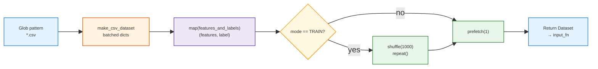
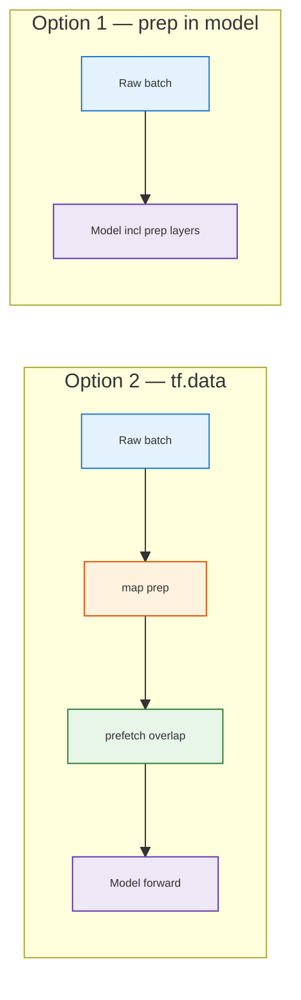
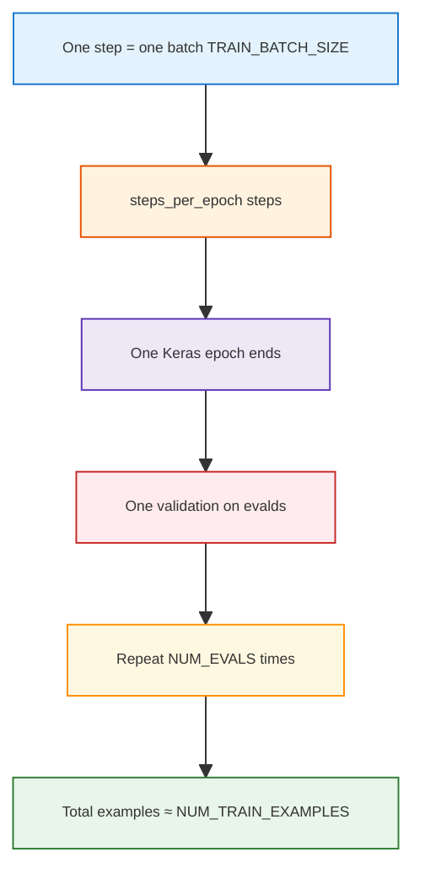

# TensorFlow `tf.data` pipeline: `create_dataset` (CSV + Estimator)

> **Purpose:** Explain **`create_dataset`-style pipelines**: (A) **CSV** → `make_csv_dataset` → `map` → train-only `shuffle`/`repeat` → `prefetch` for **`tf.estimator`**; (B) **in-memory** tensors → `from_tensor_slices` → `repeat`/`batch` for small tutorials (linear regression toy data).  
> **Style:** Tables follow [docs/styles/DOCS_TABLE_STYLE.md](../../../styles/DOCS_TABLE_STYLE.md). Diagrams follow [docs/styles/DOCS_MERMAID_DIAGRAM_STYLE.md](../../../styles/DOCS_MERMAID_DIAGRAM_STYLE.md).  
> **Related:** Keras Functional API &amp; Wide &amp; Deep in [tf_functional_api.md](./tf_functional_api.md).

---

## Training: multiple passes & why the “same” data helps

**Typical practice (high level):** Training often uses **many passes** over the training set. You stop when a **validation** curve flattens, loss stops improving much, you hit a **step/time budget**, or you’ve fixed **epochs/steps upfront** (common in large jobs). It’s not always a formal “wait until convergence is proven.”

**Why seeing the same examples again can still improve the model:** Each update uses only a **mini-batch**—a small, **noisy** estimate of how to adjust weights. One pass rarely “finishes” the job. **Many small steps** over the same data let the model keep correcting. **Shuffling** changes order each pass so updates aren’t tied to a fixed file order. You’re doing **iterative tuning** on the same facts, not expecting new rows to appear.

---

## Revisit of concept: epochs vs `create_dataset` / `repeat()`

- An **epoch** is usually **one full pass** over the training set (informal definition).
- **`create_dataset` does not count epochs.** It only wires **how** batches are read, shuffled, and looped.
- **`repeat()`** means: when the CSV stream would **end**, **start the file sequence again** so the trainer never hits “out of data” while it keeps asking for batches. **How long** you train (steps, `max_steps`, `fit(epochs=...)`, etc.) is set **outside** this function—not by `repeat()` counting “epoch 2.”

---

## In-memory tensors: how this synthetic dataset is built

Some courses use **data already in RAM** (no CSV) to teach `tf.data`. The idea is: build **`X` and `Y` tensors**, then wrap them in a **`Dataset`** that yields **aligned pairs** `(x_i, y_i)`, then **repeat** and **batch** for training.


### Step 1 — Create `X` and `Y` (the “ground truth” table)

```python
N_POINTS = 10
# Constant tensor: one row per “example” along axis 0 (here scalars, shape (10,)).
X = tf.constant(range(N_POINTS), dtype=tf.float32)  # [0, 1, 2, …, 9]
Y = 2 * X + 10  # elementwise: y_i = 2 * x_i + 10  →  [10, 12, 14, …, 28]
```

- **`X`** is the **input** feature (one number per example). `range(N_POINTS)` becomes integers; `tf.float32` matches what many ops and losses expect.
- **`Y`** is the **label** for a **linear** relationship \(y = 2x + 10\). There is no file: both columns are defined **in code**, so you always know the exact mapping (good for debugging a training loop).

So you can think of this as a **tiny table** with 10 rows: column `X`, column `Y`, with a perfect linear rule.

### Step 2 — Turn rows into a `Dataset` with `from_tensor_slices`

```python
def create_dataset(X, Y, epochs, batch_size):
    # Zip X and Y along the first dimension: each dataset element is (x_i, y_i).
    # Must be tf.data.Dataset.from_tensor_slices — not tf.data.from_tensor_slices (typo below).
    dataset = tf.data.Dataset.from_tensor_slices((X, Y))
    dataset = dataset.repeat(epochs).batch(batch_size, drop_remainder=True)  # drop short last batch
    return dataset
```

**Easy typo:** `from_tensor_slices` is a method on **`tf.data.Dataset`**, not an attribute of the `tf.data` module. If you write `tf.data.from_tensor_slices((X, Y))`, TensorFlow raises:

`AttributeError: module 'tensorflow._api.v2.data' has no attribute 'from_tensor_slices'`

| Wrong | Correct |
|:---|:---|
| `tf.data.from_tensor_slices((X, Y))` | `tf.data.Dataset.from_tensor_slices((X, Y))` |


- **`from_tensor_slices((X, Y))`** — TensorFlow walks the **first dimension** in lockstep. If `X` and `Y` have shape `(10,)`, you get **10** elements: `(X[0], Y[0])`, `(X[1], Y[1])`, … That is the usual way to feed **supervised** `(features, labels)` from tensors.
- **`.repeat(epochs)`** — Unlike the CSV recipe later (often **`repeat()` with no limit** for Estimator), here **`epochs` is a finite count**: the full sequence of 10 pairs is repeated **`epochs` times**, so over one full pass of the dataset you see **`epochs × N_POINTS`** **single-example** yields **before** batching. (Naming is course-dependent; the important part is **you know how many times the 10 rows repeat**.)
- **`.batch(batch_size, drop_remainder=True)`** — Groups consecutive elements into batches of shape `(batch_size,)` for `X` and `Y`. **`drop_remainder=True`** drops the **last** batch if it would be **smaller** than `batch_size`, so every batch has the **same** size (handy for static shapes / some XLA paths). If you need **every** example, use `drop_remainder=False` and accept a smaller final batch.

**Lazy execution:** Until you iterate (e.g. `for batch in dataset` or pass the dataset to `fit`), this only **describes** the pipeline.

### How this differs from the CSV `create_dataset` in section 1

| | **In-memory (`from_tensor_slices`)** | **CSV (`make_csv_dataset`)** |
|:---|:---|:---|
| **Source** | Tensors `X`, `Y` already in memory | Files matched by `pattern` |
| **One element before batch** | Usually **one example** `(x_i, y_i)` | Here **one batch** of rows (already batched by API) |
| **`repeat`** | Often **`repeat(epochs)`** with a **fixed** repeat count | Often **`repeat()`** **infinite** for train; trainer stops by steps |

---

## 1. The code (reference)

This is the pattern from the screenshot—`CSV_COLUMNS` and `DEFAULTS` are defined elsewhere (column names and per-column default values for missing fields).

```python
# tf.data.Dataset = lazy pipeline (nothing loaded until iterated). tf.estimator uses
# mode below to build TRAIN vs EVAL pipelines.

def create_dataset(pattern, batch_size=1, mode=tf.estimator.ModeKeys.EVAL):
    # pattern: glob(s) e.g. "data/train-*.csv"
    # batch_size: rows per training step; here each Dataset element is already one
    #   batch (dict of column tensors). ↑ batch → more RAM, usually less noisy updates.
    # mode: TRAIN vs EVAL for Estimator (see if below).

    dataset = tf.data.experimental.make_csv_dataset(
        pattern,
        batch_size,   # rows grouped into one batch per yield
        CSV_COLUMNS,  # column names, file order
        DEFAULTS,     # per-column default for missing cells; same length as CSV_COLUMNS
    )
    # Each element = one batch (not one row). See §5 for shuffle implications.

    # Run your fn on every batch: column dict → (features, label) for model_fn.
    dataset = dataset.map(features_and_labels)

    if mode == tf.estimator.ModeKeys.TRAIN:
        # shuffle(1000): randomize using a pool of up to 1000 *batches* (not rows here).
        #   Bigger buffer → better mix, more RAM. Small buffer → order still somewhat predictable.
        # repeat(): after files end, restart from beginning forever so training never
        #   runs out of batches. Does NOT count epochs—that’s outside (steps, max_steps, etc.).
        # No repeat on EVAL: one finite pass for metrics.
        dataset = dataset.shuffle(buffer_size=1000).repeat()

    # prefetch(1): overlap loading batch n+1 while model runs on batch n. "1" = depth.
    #   Newer code often uses tf.data.AUTOTUNE instead (§6).
    dataset = dataset.prefetch(1)

    return dataset  # input_fn returns this; Estimator consumes it
```

**Lazy execution:** Nothing is read from disk until the Estimator (or a loop) **consumes** the dataset—each op above only builds the graph of transformations.

---

## 2. What each part does (quick map)

<table style="width:100%;border-collapse:collapse;font-size:12px;">
<thead>
<tr>
<th style="border:1px solid #BFCAD6;padding:6px;background:#1565c0;color:white;text-align:left;width:22%;">Step</th>
<th style="border:1px solid #BFCAD6;padding:6px;background:#1565c0;color:white;text-align:left;width:38%;">API</th>
<th style="border:1px solid #BFCAD6;padding:6px;background:#1565c0;color:white;text-align:left;width:40%;">Role in this pipeline</th>
</tr>
</thead>
<tbody>
<tr>
<td style="border:1px solid #D7E0EA;padding:6px;background:#e3f2fd;vertical-align:top;"><b>① Read CSV</b></td>
<td style="border:1px solid #D7E0EA;padding:6px;background:#F8FBFF;vertical-align:top;"><code>make_csv_dataset</code></td>
<td style="border:1px solid #D7E0EA;padding:6px;background:#F8FBFF;vertical-align:top;"><b>Extract</b> • glob <code>pattern</code> • parse rows • apply <code>DEFAULTS</code> for missing values • yields <b>batched</b> dicts (one batch = <code>batch_size</code> rows per column tensor)</td>
</tr>
<tr>
<td style="border:1px solid #D7E0EA;padding:6px;background:#e3f2fd;vertical-align:top;"><b>② Transform</b></td>
<td style="border:1px solid #D7E0EA;padding:6px;background:#F4FFF6;vertical-align:top;"><code>.map(features_and_labels)</code></td>
<td style="border:1px solid #D7E0EA;padding:6px;background:#F4FFF6;vertical-align:top;"><b>Transform</b> each batch into what the model expects—usually <code>(features, labels)</code> for <code>Estimator</code> input functions</td>
</tr>
<tr>
<td style="border:1px solid #D7E0EA;padding:6px;background:#e3f2fd;vertical-align:top;"><b>③ Train only</b></td>
<td style="border:1px solid #D7E0EA;padding:6px;background:#fff3e0;vertical-align:top;"><code>shuffle</code> • <code>repeat</code></td>
<td style="border:1px solid #D7E0EA;padding:6px;background:#fff3e0;vertical-align:top;"><b>Shuffle</b> order (see §4) • <b>repeat</b> forever so the pipeline never runs out of batches while training keeps requesting more (epoch count lives in trainer config, not here)</td>
</tr>
<tr>
<td style="border:1px solid #D7E0EA;padding:6px;background:#e3f2fd;vertical-align:top;"><b>④ Overlap I/O</b></td>
<td style="border:1px solid #D7E0EA;padding:6px;background:#F8FBFF;vertical-align:top;"><code>.prefetch(1)</code></td>
<td style="border:1px solid #D7E0EA;padding:6px;background:#F8FBFF;vertical-align:top;"><b>Load</b> • while the device runs step <i>n</i>, CPU prepares batch <i>n+1</i> (small pipeline buffer)</td>
</tr>
</tbody>
</table>

---

## 3. End-to-end flow (diagram)



---

## 4. Why `ModeKeys.TRAIN` vs `EVAL`

<table style="width:100%;border-collapse:collapse;font-size:12px;">
<thead>
<tr>
<th style="border:1px solid #BFCAD6;padding:6px;background:#1565c0;color:white;text-align:left;width:18%;">Mode</th>
<th style="border:1px solid #BFCAD6;padding:6px;background:#1565c0;color:white;text-align:left;width:42%;">Typical behavior</th>
<th style="border:1px solid #BFCAD6;padding:6px;background:#1565c0;color:white;text-align:left;width:40%;">In this snippet</th>
</tr>
</thead>
<tbody>
<tr>
<td style="border:1px solid #D7E0EA;padding:6px;background:#e3f2fd;vertical-align:top;"><code>TRAIN</code></td>
<td style="border:1px solid #D7E0EA;padding:6px;background:#F8FBFF;vertical-align:top;">Need <b>stochastic</b> order • training loop may run longer than one file pass • often an <b>infinite</b> iterator</td>
<td style="border:1px solid #D7E0EA;padding:6px;background:#F8FBFF;vertical-align:top;"><span style="background:#c8e6c9;padding:2px 4px">✓</span> <code>shuffle</code> + <code>repeat()</code> so training never “runs out” after one pass over the CSVs (<b>how many</b> passes / steps = outside this function)</td>
</tr>
<tr>
<td style="border:1px solid #D7E0EA;padding:6px;background:#e3f2fd;vertical-align:top;"><code>EVAL</code> / <code>PREDICT</code></td>
<td style="border:1px solid #D7E0EA;padding:6px;background:#F4FFF6;vertical-align:top;">Need <b>stable</b>, usually <b>finite</b> pass over data</td>
<td style="border:1px solid #D7E0EA;padding:6px;background:#F4FFF6;vertical-align:top;">No shuffle/repeat—dataset runs until empty once (good for metrics / inference)</td>
</tr>
</tbody>
</table>

**Estimator hook:** The same `create_dataset` is usually called from an `input_fn(features, labels, mode)` that receives `mode` from the Estimator.

---

## 5. Critical detail: `make_csv_dataset` already **batches**

<span style="background:#ffcdd2;padding:2px 4px">⚠</span> Unlike the classic raw `tf.data.TextLineDataset` tutorial, **`make_csv_dataset(..., batch_size=...)`** emits **one element = one batch** (a dict of column tensors with leading batch dimension).

So here **`shuffle(buffer_size=1000)`** shuffles **up to 1000 batches**, not 1000 individual rows. For stronger per-row randomness you’d either:

- increase effective randomness by using a **larger shuffle buffer** (in batches), and/or  
- use a pipeline that **shuffles before batching** (different API shape).

Interview soundbite: *“I need to know whether shuffle sees rows or batches—here it’s batches because `make_csv_dataset` batches first.”*

---

## 6. `prefetch(1)` and the “AUTOTUNE” comment

| Setting | Meaning |
|--------|---------|
| `prefetch(1)` | Keep **1** batch ready ahead of the consumer—simple, predictable memory |
| `prefetch(tf.data.AUTOTUNE)` | Lets the runtime **tune** how many batches to prefetch <span style="background:#2e7d32;color:white;padding:1px 4px">recommended</span> in modern TF when you want performance without hand-tuning |

The screenshot comment *“1 = AUTOTUNE”* is **misleading**: **`1` is a literal buffer depth**; **`AUTOTUNE`** is a separate constant (not the integer 1). Prefer saying: *“prefetch overlaps producers and consumers; AUTOTUNE picks depth.”*

---

## 7. `features_and_labels` (what `map` is for)

`make_csv_dataset` gives **column dicts**. Estimator `input_fn` typically needs **`(features_dict, label_tensor)`** (or a similar contract your `model_fn` expects). **`features_and_labels`**:

- picks which columns are **features** vs **label**  
- may **cast**, **bucketize**, or **stack** tensors  
- runs **once per batch** in graph/eager according to TF version

---

## 8. Shuffle / batch ordering (general rule + how this snippet fits)

**Classic pattern** (row stream → shuffle rows → batch):

```text
dataset.shuffle(buffer).batch(batch_size)   ✓
dataset.batch(batch_size).shuffle(buffer)   ✗  (shuffles batches, not rows)
```

**This snippet:** Batching is **inside** `make_csv_dataset`, then **shuffle** runs on **batches**—still valid for training, but **not** the same as row-level shuffle.

<table style="width:100%;border-collapse:collapse;font-size:12px;">
<thead>
<tr>
<th style="border:1px solid #BFCAD6;padding:6px;background:#1565c0;color:white;text-align:left;width:28%;">Knob</th>
<th style="border:1px solid #BFCAD6;padding:6px;background:#1565c0;color:white;text-align:left;width:72%;">Interview explanation</th>
</tr>
</thead>
<tbody>
<tr>
<td style="border:1px solid #D7E0EA;padding:6px;background:#e3f2fd;vertical-align:top;"><code>batch_size</code></td>
<td style="border:1px solid #D7E0EA;padding:6px;background:#F8FBFF;vertical-align:top;">How many examples per training step • drives memory and gradient noise • passed here into <code>make_csv_dataset</code></td>
</tr>
<tr>
<td style="border:1px solid #D7E0EA;padding:6px;background:#e3f2fd;vertical-align:top;"><code>shuffle(buffer_size)</code></td>
<td style="border:1px solid #D7E0EA;padding:6px;background:#F4FFF6;vertical-align:top;">Larger buffer → better randomization (up to full dataset) • here buffer is in <b>batches</b> (§5)</td>
</tr>
</tbody>
</table>

---

## 9. Optional: why mini-batches matter (short)

**Stochastic (batch 1):** very noisy updates. **Full batch:** expensive; sharp minima folklore. **Mini-batch (e.g. 32–256):** usual compromise. This is **orthogonal** to the snippet—you’d set it via `batch_size` passed into `create_dataset`.

---

## 10. Takeaways (for interviews)

1. **ETL mental model:** <span style="background:#e3f2fd;padding:1px 3px">Extract</span> `make_csv_dataset` → <span style="background:#fff3e0;padding:1px 3px">Transform</span> `map` → <span style="background:#c8e6c9;padding:1px 3px">Train extras</span> `shuffle`/`repeat` → <span style="background:#e3f2fd;padding:1px 3px">Load overlap</span> `prefetch`.  
2. **Estimator:** `TRAIN` uses **`repeat()`** so the dataset never ends before the trainer stops; **EVAL** stays **finite**. **Epoch/step budget** is configured on the Estimator / `train()` call, not inside `create_dataset`.  
3. **Know what you shuffle:** with **`make_csv_dataset`**, you shuffle **batches**, not raw rows—say that explicitly.  
4. **`prefetch(1)` ≠ AUTOTUNE**—name the difference; mention **`tf.data.AUTOTUNE`** for modern pipelines.  
5. **Keras:** preprocessing can live **in the model** (portable serving) or **in `tf.data`** (often faster training + **`prefetch` overlaps pipeline work**); see §11–§12.  
6. **Optimizer:** connects **loss** to **weight updates** (gradient-based); **Adam** is a common adaptive choice—see §13.  
7. **`model.fit` scheduling trick:** use a **short** `steps_per_epoch` so Keras’s **end-of-epoch** hook (default **validation**, `on_epoch_end` callbacks) runs **`NUM_EVALS` times** while the formula fixes **total examples**—see §14 **Essence**.  
8. **`model.predict`:** <code>input_samples</code> = data to score; <code>steps</code> = how many **batches** to run forward-only (no training)—see §15.

---

## 11. Keras / TensorFlow: two places to preprocess

This is separate from the **`tf.estimator`** CSV snippet above, but the same idea—**where does “turn raw stuff into tensors the net can use” run?**—shows up in modern **Keras** workflows.

### Plain language

- **Option 1 — inside the model:** The **first layer(s)** do rescaling, tokenization wiring, etc. You ship **one saved model**; callers pass **roughly raw** inputs (images, features) and get predictions **without** a separate prep script. Strong for **sharing**, **TF.js**, and avoiding **train/serve skew** if the exported graph includes the same prep.
- **Option 2 — inside `tf.data`:** Use **`dataset.map(...)`** so the **CPU** prepares batches **before** `model.fit` / `model(...)`. Often **faster training** when prep is heavy, especially with **`prefetch`** and **`AUTOTUNE`** so the next batch is **ready while the GPU/TPU trains** on the current one.

**Training vs serving:** You can **train** with **Option 2** for throughput, then still **export** an **inference** model that **includes** preprocessing (Option‑1‑style graph) so production users don’t reimplement prep in another language.

<span style="background:#ffcdd2;padding:2px 4px">⚠</span> **TPU:** Heavy preprocessing is usually kept **in `tf.data` on CPU**. **Normalization** and **Rescaling** are often fine as the **first model layer** on TPU; follow current Google/TF guidance for your stack.

### Cheat sheet

<table style="width:100%;border-collapse:collapse;font-size:12px;">
<thead>
<tr>
<th style="border:1px solid #BFCAD6;padding:6px;background:#1565c0;color:white;text-align:left;width:18%;">Option</th>
<th style="border:1px solid #BFCAD6;padding:6px;background:#1565c0;color:white;text-align:left;width:32%;">Where prep runs</th>
<th style="border:1px solid #BFCAD6;padding:6px;background:#1565c0;color:white;text-align:left;width:25%;">Main win</th>
<th style="border:1px solid #BFCAD6;padding:6px;background:#1565c0;color:white;text-align:left;width:25%;">Tradeoff</th>
</tr>
</thead>
<tbody>
<tr>
<td style="border:1px solid #D7E0EA;padding:6px;background:#e3f2fd;vertical-align:top;"><b>1 — in model</b></td>
<td style="border:1px solid #D7E0EA;padding:6px;background:#F8FBFF;vertical-align:top;">First Keras layers</td>
<td style="border:1px solid #D7E0EA;padding:6px;background:#F8FBFF;vertical-align:top;"><span style="background:#c8e6c9;padding:2px 4px">✓</span> <b>Portable inference</b> • one artifact • raw-ish in → prediction out</td>
<td style="border:1px solid #D7E0EA;padding:6px;background:#F8FBFF;vertical-align:top;">Prep runs with the <b>forward pass</b> • less use of “CPU pipeline overlap” for <i>that</i> work</td>
</tr>
<tr>
<td style="border:1px solid #D7E0EA;padding:6px;background:#e3f2fd;vertical-align:top;"><b>2 — in pipeline</b></td>
<td style="border:1px solid #D7E0EA;padding:6px;background:#F4FFF6;vertical-align:top;"><code>tf.data</code> • e.g. <code>.map</code></td>
<td style="border:1px solid #D7E0EA;padding:6px;background:#F4FFF6;vertical-align:top;"><span style="background:#c8e6c9;padding:2px 4px">✓</span> <b>Training throughput</b> • CPU prep • pairs with <code>prefetch</code> / <code>AUTOTUNE</code></td>
<td style="border:1px solid #D7E0EA;padding:6px;background:#F4FFF6;vertical-align:top;">Serving may need a <b>separate</b> prep story unless you <b>export</b> prep into the model later</td>
</tr>
</tbody>
</table>

### Code shapes (from the “preprocessing before the model” pattern)

**Option 1 — prep as part of the model (Functional API):**

```python
inputs = keras.Input(shape=input_shape)
x = preprocessing_layer(inputs)
outputs = rest_of_the_model(x)
model = keras.Model(inputs, outputs)
```

**Option 2 — prep in the dataset (only transform features `x`, keep labels `y`):**

```python
dataset = dataset.map(
    lambda x, y: (preprocessing_layer(x), y))
```

### Flow (conceptual)



---

## 12. How this relates to `dataset.prefetch(...)`

**`prefetch`** is a **`tf.data`** operation: it only affects what happens **on the dataset pipeline** before tensors are consumed by training.

| Situation | Relation to `prefetch` |
|-----------|-------------------------|
| **Option 2** (prep in **`dataset.map`**, etc.) | <span style="background:#2e7d32;color:white;padding:1px 4px">strong fit</span> • prefetch overlaps **CPU pipeline work** (read + map + …) with **accelerator** time on the **previous** batch—this is the “async buffered before the model” story |
| **Option 1** (prep **inside** `model`) | Prefetch can still help **whatever is left in the pipeline** (e.g. **disk I/O**, decoding) • it does **not** parallelize **in-model** preprocessing the same way—that prep runs when the **model** runs |

**One line:** **`prefetch` pairs naturally with pipeline-side prep (Option 2).** With **Option 1**, use prefetch for **loading**, not as a substitute for moving heavy prep into **`tf.data`**.

---

## 13. Optimizer, loss, and gradient descent (`model.compile`)

Training needs two linked ideas: **how wrong** the model is (**loss**) and **how to improve** (**optimizer**).

### Plain language

- **Loss:** A score for “prediction vs truth” (e.g. **MSE** for regression). **Lower is better.**
- **Gradients:** For each weight, “if I nudge this weight a tiny bit, does loss go up or down?” The optimizer uses those signals from the **loss**.
- **Optimizer:** The rule that **actually changes the weights** after looking at gradients. It ties **loss → gradients → parameter updates**. Without it, you’d know the error but wouldn’t know how to step the weights in a principled way.

**Classical gradient descent (full batch):** Use **all** training examples to compute one average gradient, then take **one** step. Simple, but expensive on huge data.

**SGD (stochastic gradient descent):** Use **one example** or a **small mini-batch** to estimate the gradient and step. **Noisier** updates, but **much cheaper** per step and often works well in practice—most “deep learning” training is **mini-batch SGD** with a fancy optimizer on top.

### Adam (why courses highlight it)

**Adam** is an **adaptive** optimizer: it keeps **running estimates** of gradients (and their squares) to give **per-parameter** effective step sizes and **momentum-like** smoothing. In plain terms: it adjusts how big each weight’s update is based on **recent history** of that weight’s gradients—not one global fixed step for everything.

**When it tends to help** (intuition, not guarantees):

| Angle | Layman takeaway |
|-------|------------------|
| **Diagonal rescaling** | Each weight can move at a **different effective pace** (related to gradient scale), which helps when dimensions behave very differently. |
| **Large data / many parameters** | Cheap-ish per step vs full-batch descent; adaptive behavior often **stabilizes** training when the landscape is messy. |
| **Noisy or sparse gradients** | Averaging/smoothing in the algorithm can **dampen** wild mini-batch noise and awkward sparse updates. |
| **Non-stationary objectives** | Loss surface changes as you train (e.g. curriculum, shifting batches); adaptive methods often **cope** better than a single fixed learning rate for all weights. |

<span style="background:#fff9c4;padding:2px 4px">Note</span> **Adam isn’t always best**—some problems still favor plain SGD + careful tuning, or other optimizers. For interviews: **loss = what to minimize; optimizer = how you step weights using gradients of that loss.**

### Example: compile with a custom metric (from the “Compiling a Keras model” slide)

```python
def rmse(y_true, y_pred):
    return tf.sqrt(tf.reduce_mean(tf.square(y_pred - y_true)))

model.compile(optimizer="adam", loss="mse", metrics=[rmse, "mse"])
```

- **`optimizer="adam"`** — use Adam for weight updates.  
- **`loss="mse"`** — what the optimizer **differentiates** to get training signal.  
- **`metrics=[rmse, "mse"]`** — extra numbers to **log** (including duplicate MSE as a metric); metrics don’t have to be the same as `loss`, but often overlap.

---

## 14. `model.fit` trick: `steps_per_epoch`, `epochs`, and validation count

This pattern (from a “Training a Keras model” slide) **sizes** each Keras **“epoch”** so you hit two goals at once: **(a)** about **`NUM_TRAIN_EXAMPLES`** training examples in total, and **(b)** exactly **`NUM_EVALS`** runs of whatever fires **at end of epoch**—especially **validation**.

### Essence of the trick (read this first)

> **What Keras actually does:** After each **epoch**, it runs **validation** on `validation_data` (unless disabled) and runs callbacks on **`on_epoch_end`**. It does **not** check whether your epoch was “a full pass over the dataset”—it only knows: run **`steps_per_epoch`** training steps, then treat that as **one epoch finished**.

**So the trick is scheduling, not magic:** you **shorten** each epoch with a small **`steps_per_epoch`** so “end of epoch” happens **often**. You set **`epochs = NUM_EVALS`** so you get **`NUM_EVALS` of those boundaries** → **`NUM_EVALS` validations** (and **`NUM_EVALS` TensorBoard points**, **`NUM_EVALS` checkpoint epochs**, **`NUM_EVALS` LR-on-epoch ticks**, etc.—anything tied to **end of epoch**).

**Colloquial vs textbook:** people say you’re **“redefining epoch”** here. In **normal** training, you usually pick **`steps_per_epoch`** so **one** Keras epoch ≈ **one full pass** over the data, and **`epochs=50`** means **50 full passes**. **In this slide,** each Keras epoch is only a **slice**; **`NUM_EVALS` epochs together** match **one example budget**, not **`NUM_EVALS` full passes**.

The **formula** for `steps_per_epoch` is what forces **total examples** ≈ **`NUM_TRAIN_EXAMPLES`** while **`epochs`** fixes **how many evals** you get.

### Code (reference)

```python
from tensorflow.keras.callbacks import TensorBoard

steps_per_epoch = NUM_TRAIN_EXAMPLES // (TRAIN_BATCH_SIZE * NUM_EVALS)

history = model.fit(
    x=trainds,
    steps_per_epoch=steps_per_epoch,
    epochs=NUM_EVALS,
    validation_data=evalds,
    callbacks=[TensorBoard(LOGDIR)],
)
```

### Is the formula correct?

<span style="background:#c8e6c9;padding:2px 4px">✓</span> **Yes**, for the goal: over the whole `fit` call, see about **`NUM_TRAIN_EXAMPLES`** training **examples** (in aggregate) and run validation **`NUM_EVALS`** times (once per Keras epoch).

**Rough check** (ignoring `//` rounding):

`steps_per_epoch × epochs × TRAIN_BATCH_SIZE ≈ NUM_TRAIN_EXAMPLES`

because `epochs = NUM_EVALS` and `steps_per_epoch ≈ NUM_TRAIN_EXAMPLES / (TRAIN_BATCH_SIZE × NUM_EVALS)`.

`//` is **floor division**—integer `steps_per_epoch`; you may see **slightly fewer** than `NUM_TRAIN_EXAMPLES` examples if the division isn’t exact.

### What each term means (in *this* trick)

<table style="width:100%;border-collapse:collapse;font-size:12px;">
<thead>
<tr>
<th style="border:1px solid #BFCAD6;padding:6px;background:#1565c0;color:white;text-align:left;width:22%;">Term</th>
<th style="border:1px solid #BFCAD6;padding:6px;background:#1565c0;color:white;text-align:left;width:78%;">Meaning here</th>
</tr>
</thead>
<tbody>
<tr>
<td style="border:1px solid #D7E0EA;padding:6px;background:#e3f2fd;vertical-align:top;"><b>Step</b></td>
<td style="border:1px solid #D7E0EA;padding:6px;background:#F8FBFF;vertical-align:top;">One <b>optimizer update</b>: forward + loss on <b>one batch</b> (<code>TRAIN_BATCH_SIZE</code> examples) + backward + weight change. Not one single example (unless batch size is 1).</td>
</tr>
<tr>
<td style="border:1px solid #D7E0EA;padding:6px;background:#e3f2fd;vertical-align:top;"><code>steps_per_epoch</code></td>
<td style="border:1px solid #D7E0EA;padding:6px;background:#F4FFF6;vertical-align:top;">How many <b>batches</b> (steps) Keras runs <b>before</b> it ends one Keras “epoch” and triggers <b>one validation</b> (default behavior: validate at end of each epoch).</td>
</tr>
<tr>
<td style="border:1px solid #D7E0EA;padding:6px;background:#e3f2fd;vertical-align:top;"><code>epochs=NUM_EVALS</code></td>
<td style="border:1px solid #D7E0EA;padding:6px;background:#F8FBFF;vertical-align:top;">How many of those <b>short</b> epochs to run → equals <b>how many validation passes</b> you get (one eval per epoch), i.e. <b><code>NUM_EVALS</code> evaluations</b> on <code>evalds</code>.</td>
</tr>
<tr>
<td style="border:1px solid #D7E0EA;padding:6px;background:#e3f2fd;vertical-align:top;"><code>TRAIN_BATCH_SIZE</code></td>
<td style="border:1px solid #D7E0EA;padding:6px;background:#F4FFF6;vertical-align:top;">Examples <b>per step</b> • multiplies with step count to count <b>total examples seen</b>.</td>
</tr>
<tr>
<td style="border:1px solid #D7E0EA;padding:6px;background:#e3f2fd;vertical-align:top;"><b>“Epoch” (usual vs here)</b></td>
<td style="border:1px solid #D7E0EA;padding:6px;background:#fff3e0;vertical-align:top;"><span style="background:#ffcdd2;padding:2px 4px">⚠</span> Usually an epoch = <b>one full pass</b> over the training set. <b>Here</b>, each Keras epoch is a <b>slice</b>: only <code>steps_per_epoch × TRAIN_BATCH_SIZE</code> examples—so <b><code>NUM_EVALS</code> epochs together</b> approximate <b>one budget</b> of <code>NUM_TRAIN_EXAMPLES</code> examples, not <code>NUM_EVALS</code> full passes.</td>
</tr>
</tbody>
</table>

### Relationship in one line

**Scheduling core:** **`epochs`** = how many times Keras hits **end-of-epoch** → default **validation** count = **`NUM_EVALS`**; **`steps_per_epoch`** = how much training happens **between** those evals.

**Arithmetic:** **Total training steps** = `steps_per_epoch × epochs` = `steps_per_epoch × NUM_EVALS`.  
**Total training examples (approx.)** = that × `TRAIN_BATCH_SIZE` ≈ `NUM_TRAIN_EXAMPLES`.  
**Number of validations** = `epochs` = `NUM_EVALS` (one per epoch, with default Keras behavior).



---

## 15. Prediction: `model.predict(input_samples, steps=...)`

After training, you call **`predict`** to get outputs on **new** inputs. The slide pattern:

```python
predictions = model.predict(input_samples, steps=1)
```

- **`predictions`** — Keras returns a **NumPy array** (or list of arrays for multi-output models) of model outputs.

### What is `input_samples` for?

It is **the data you want predictions on**—not data for learning in this call. You are asking: *given these feature vectors, what does the trained model output?* (e.g. two houses: 1500 sq ft and 1800 sq ft as rows of features).

<table style="width:100%;border-collapse:collapse;font-size:12px;">
<thead>
<tr>
<th style="border:1px solid #BFCAD6;padding:6px;background:#1565c0;color:white;text-align:left;width:28%;">You can pass</th>
<th style="border:1px solid #BFCAD6;padding:6px;background:#1565c0;color:white;text-align:left;width:72%;">Notes</th>
</tr>
</thead>
<tbody>
<tr>
<td style="border:1px solid #D7E0EA;padding:6px;background:#e3f2fd;vertical-align:top;">NumPy array / TF tensor(s)</td>
<td style="border:1px solid #D7E0EA;padding:6px;background:#F8FBFF;vertical-align:top;">Typical for a fixed batch of examples</td>
</tr>
<tr>
<td style="border:1px solid #D7E0EA;padding:6px;background:#e3f2fd;vertical-align:top;"><code>tf.data.Dataset</code></td>
<td style="border:1px solid #D7E0EA;padding:6px;background:#F4FFF6;vertical-align:top;">Batches flow through the model; combine with <code>steps</code> or rely on dataset end (see below)</td>
</tr>
<tr>
<td style="border:1px solid #D7E0EA;padding:6px;background:#e3f2fd;vertical-align:top;">Generator of samples</td>
<td style="border:1px solid #D7E0EA;padding:6px;background:#F8FBFF;vertical-align:top;">Same idea: Keras consumes batches until <code>steps</code> or exhaustion rules apply</td>
</tr>
</tbody>
</table>

Plain terms: **`input_samples` = “here are the inputs; give me the model’s answers.”** Labels are not used for ordinary prediction (no loss / no weight updates).

### What does `steps` mean here—and is it “different” from training?

**Same unit, different job:** in both training and prediction, one **step** still means **one batch** through the model. What changes is **what the step does**.

<table style="width:100%;border-collapse:collapse;font-size:12px;">
<thead>
<tr>
<th style="border:1px solid #BFCAD6;padding:6px;background:#1565c0;color:white;text-align:left;width:22%;">Mode</th>
<th style="border:1px solid #BFCAD6;padding:6px;background:#1565c0;color:white;text-align:left;width:78%;">What one step does</th>
</tr>
</thead>
<tbody>
<tr>
<td style="border:1px solid #D7E0EA;padding:6px;background:#e3f2fd;vertical-align:top;"><b>Training</b> (<code>fit</code>)</td>
<td style="border:1px solid #D7E0EA;padding:6px;background:#F8FBFF;vertical-align:top;">One batch → forward + loss → <b>backward pass</b> → <b>optimizer updates weights</b></td>
</tr>
<tr>
<td style="border:1px solid #D7E0EA;padding:6px;background:#e3f2fd;vertical-align:top;"><b>Prediction</b> (<code>predict</code>)</td>
<td style="border:1px solid #D7E0EA;padding:6px;background:#F4FFF6;vertical-align:top;">One batch → <b>forward pass only</b> → collect outputs • <b>weights unchanged</b></td>
</tr>
</tbody>
</table>

For **`predict`**, **`steps`** is: **how many batches to run** before stopping this prediction call. Example: **one batch** of examples → <code>steps=1</code> matches the slide. <span style="background:#fff9c4;padding:2px 4px">Note</span> <code>steps=None</code> can also work for a **small finite** input; Keras infers behavior from the input shape.

<span style="background:#ffcdd2;padding:2px 4px">⚠</span> If <code>input_samples</code> is a <code>tf.data.Dataset</code> (or iterator) that can keep producing batches and <code>steps=None</code>, <code>predict</code> will **run until the dataset is exhausted**. For **infinite** or repeating datasets, set <code>steps</code> explicitly so the call **stops**.

**Layman line:** Training steps = “study this batch and change the model.” Predict steps = “show this batch to the finished model and read answers;” <code>steps</code> is how many such batches before you say done.

---

## Related

- Repo style references: [DOCS_TABLE_STYLE.md](../../../styles/DOCS_TABLE_STYLE.md), [DOCS_MERMAID_DIAGRAM_STYLE.md](../../../styles/DOCS_MERMAID_DIAGRAM_STYLE.md).
