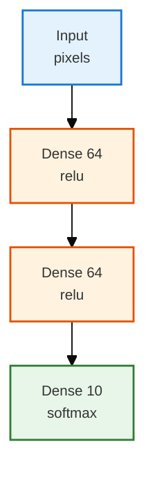
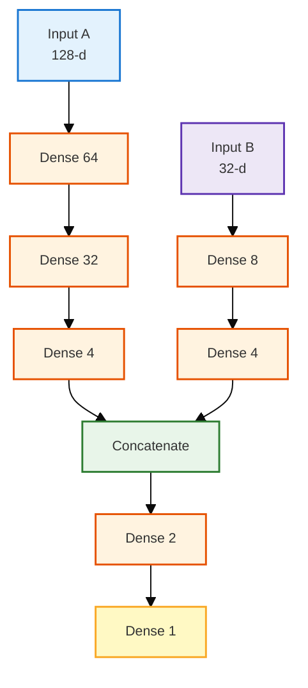
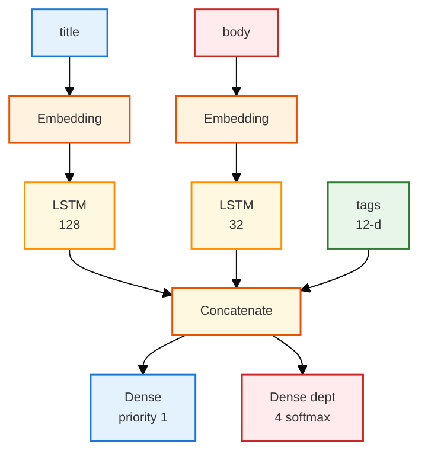
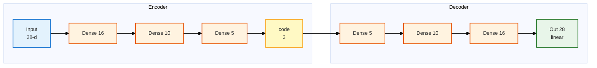
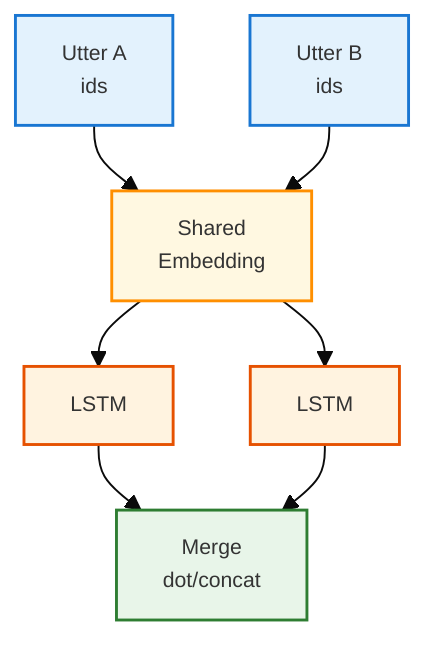
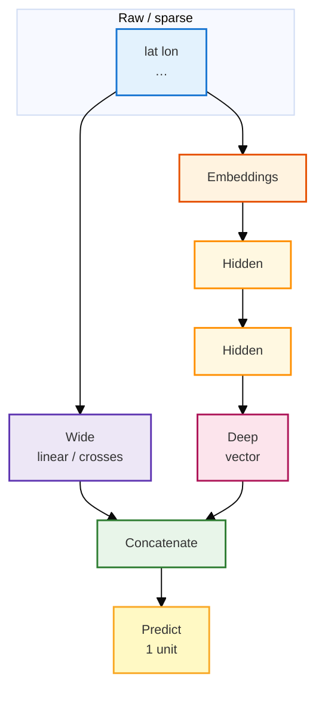

# TensorFlow Keras: Functional API (vs Sequential) & Wide & Deep

> **Purpose:** A readable walkthrough of **Keras Functional API**—what it buys you over `Sequential`, how to think in graphs, and how **Wide & Deep**–style models fit in.  
> **Audience:** You know “layers stacked in order”; you want **branches, merges, multiple inputs/outputs**, and a mental model that matches real TensorFlow code.  
> **Style:** Tables follow [docs/styles/DOCS_TABLE_STYLE.md](../../../styles/DOCS_TABLE_STYLE.md). Diagrams follow [docs/styles/DOCS_MERMAID_DIAGRAM_STYLE.md](../../../styles/DOCS_MERMAID_DIAGRAM_STYLE.md).  
> **Related:** Data loading patterns in [tf_data_pipeline_guide.md](./tf_data_pipeline_guide.md).

---

## 1. Key terms in plain English

These show up constantly in Keras docs and Wide &amp; Deep tutorials. Short definitions only—later sections use them in context.

<table style="width:100%;border-collapse:collapse;font-size:12px;">
<thead>
<tr>
<th style="border:1px solid #BFCAD6;padding:6px;background:#1565c0;color:white;text-align:left;width:18%;">Term</th>
<th style="border:1px solid #BFCAD6;padding:6px;background:#1565c0;color:white;text-align:left;width:82%;">What it means (layman)</th>
</tr>
</thead>
<tbody>
<tr>
<td style="border:1px solid #D7E0EA;padding:6px;background:#e3f2fd;vertical-align:top;"><b>Embedding</b></td>
<td style="border:1px solid #D7E0EA;padding:6px;vertical-align:top;">A <b>learned lookup table</b>: each token or category ID is turned into a short vector of numbers the network can train. Think “give every word (or zip code bucket) its own fingerprint of floats.” In Keras: <code>layers.Embedding(vocab_size, dim)</code>.</td>
</tr>
<tr>
<td style="border:1px solid #D7E0EA;padding:6px;background:#fff3e0;vertical-align:top;"><b>Dense</b></td>
<td style="border:1px solid #D7E0EA;padding:6px;vertical-align:top;">(1) <b>Fully connected</b> layer: every input unit connects to every output unit—classic “web of weighted sums + activation.” (2) Informally, a <b>dense tensor</b>: a block of numbers (float matrix), as opposed to sparse storage. <code>layers.Dense(n)</code> is the first meaning.</td>
</tr>
<tr>
<td style="border:1px solid #D7E0EA;padding:6px;background:#e8f5e9;vertical-align:top;"><b>Sparse</b></td>
<td style="border:1px solid #D7E0EA;padding:6px;vertical-align:top;">Data where <b>most slots are empty or zero</b>—e.g. one-hot categories, hashed buckets, “which of millions of IDs fired?” Wide models often start from <b>sparse features</b> (few active bits) before embeddings or linear terms turn them into something trainable.</td>
</tr>
<tr>
<td style="border:1px solid #D7E0EA;padding:6px;background:#ede7f6;vertical-align:top;"><b>Head</b></td>
<td style="border:1px solid #D7E0EA;padding:6px;vertical-align:top;">The <b>output branch</b> for one task: usually the last layer(s) sitting on a shared trunk. Example: same fused vector feeds a <b>priority head</b> (one score) and a <b>department head</b> (four probabilities). Not a special Keras type—just “this <code>Dense</code> is head A, that one is head B.”</td>
</tr>
<tr>
<td style="border:1px solid #D7E0EA;padding:6px;background:#fff9c4;vertical-align:top;"><b>Autoencoder</b></td>
<td style="border:1px solid #D7E0EA;padding:6px;vertical-align:top;">A model that <b>squeezes</b> input through a narrow middle (the <b>code</b> / bottleneck) then <b>rebuilds</b> something like the input. Used for compression, denoising, or learning a compact representation. Encode = encoder; decode = decoder.</td>
</tr>
<tr>
<td style="border:1px solid #D7E0EA;padding:6px;background:#ffebee;vertical-align:top;"><b>Cross</b> (feature cross)</td>
<td style="border:1px solid #D7E0EA;padding:6px;vertical-align:top;">A <b>combination</b> of raw features—e.g. pickup area × dropoff area—so the model can learn patterns that depend on <b>both</b> together, not only on each separately. In Google’s Wide &amp; Deep slides, the <b>wide</b> path often uses <b>crossed</b> sparse features with <b>indicator</b> (effectively one-hot–style) columns: mostly zeros, a one where that combination is active.</td>
</tr>
<tr>
<td style="border:1px solid #D7E0EA;padding:6px;background:#fce4ec;vertical-align:top;"><b>Memorization</b> / <b>memorizing</b></td>
<td style="border:1px solid #D7E0EA;padding:6px;vertical-align:top;">When people say a model (or a <b>wide</b> branch) “memorizes,” they usually mean it can <b>fit frequent, specific combos</b> from training—e.g. “this neighborhood pair + time band → fares are usually about X”—often via <b>sparse + linear</b> or crossed features. It’s not human rote memory; it’s weights tuned so **seen** combinations get accurate. That’s the complement to <b>generalization</b> (the <b>deep</b> path smoothing to **new** combos).</td>
</tr>
</tbody>
</table>

---

## 2. Sequential vs Functional—in plain language

**Sequential** is a **single hallway**: one front door, one line of rooms, one exit. Great when every layer eats exactly what the previous layer produced.

**Functional** is a **building with corridors**: several entrances, rooms that **split** or **rejoin**, and sometimes **more than one exit**. You describe *who connects to whom*; the computer draws a **directed graph** (arrows, no loops) from inputs to outputs.

<table style="width:100%;border-collapse:collapse;font-size:12px;">
<thead>
<tr>
<th style="border:1px solid #BFCAD6;padding:6px;background:#1565c0;color:white;text-align:left;width:22%;">Idea</th>
<th style="border:1px solid #BFCAD6;padding:6px;background:#1565c0;color:white;text-align:left;width:39%;"><span style="background:#e3f2fd;padding:1px 4px">Sequential</span></th>
<th style="border:1px solid #BFCAD6;padding:6px;background:#1565c0;color:white;text-align:left;width:39%;"><span style="background:#fff3e0;padding:1px 4px">Functional</span></th>
</tr>
</thead>
<tbody>
<tr>
<td style="border:1px solid #D7E0EA;padding:6px;background:#e8f5e9;vertical-align:top;"><b>Shape</b></td>
<td style="border:1px solid #D7E0EA;padding:6px;vertical-align:top;">One stack</td>
<td style="border:1px solid #D7E0EA;padding:6px;vertical-align:top;">DAG: branches, shared nodes, multiple heads</td>
</tr>
<tr>
<td style="border:1px solid #D7E0EA;padding:6px;background:#e8f5e9;vertical-align:top;"><b>When it shines</b></td>
<td style="border:1px solid #D7E0EA;padding:6px;vertical-align:top;">MNIST-style “flat vector → dense → …”</td>
<td style="border:1px solid #D7E0EA;padding:6px;vertical-align:top;">Multi-input, multi-output, skip/merge, Wide &amp; Deep</td>
</tr>
<tr>
<td style="border:1px solid #D7E0EA;padding:6px;background:#e8f5e9;vertical-align:top;"><b>API shape</b></td>
<td style="border:1px solid #D7E0EA;padding:6px;vertical-align:top;"><code>keras.Sequential([...])</code></td>
<td style="border:1px solid #D7E0EA;padding:6px;vertical-align:top;"><code>keras.Model(inputs=..., outputs=...)</code></td>
</tr>
</tbody>
</table>

**What follows:** Section 3 is the smallest Functional graph (one input, straight stack). **Examples A–E** (sections 4–8) each introduce one main pattern; every example opens with a small table (**Purpose**, **Context**, **What you’re building / Takeaway**) so the diagram and code have a clear job.

---

## 3. The Functional API in three moves

1. **Declare placeholders** with `keras.Input(shape=..., name=...)` (batch size is implicit; `shape` is per-example).
2. **Wire layers** by **calling** them: `y = SomeLayer(...)(x)`—like functions, outputs feed the next call.
3. **Freeze the graph** with `keras.Model(inputs=[...], outputs=...)` (single tensor or list of tensors on each side).

### Example: same stack as Sequential (baseline)

| | |
|:---|:---|
| **Purpose** | Show the Functional API on the **simplest** graph—one input, one straight line of layers—so you see the syntax on a **real task shape** (e.g. **classify digits or categories** from one feature vector) before branches appear. |
| **Context** | **Practically:** the same stack is used for **single-vector classification**—e.g. **handwritten digit recognition** (784 pixels → 10 classes), simple tabular “which category?”, or a first baseline before you add more inputs. Flat vector in, softmax over classes out. You could write this with `Sequential`; here it is with `Input` + `Model` so later examples only add *new* ideas (merges, extra inputs), not new syntax. |
| **Takeaway** | `Model(inputs, outputs)` wraps a linear chain; `compile` / `fit` / `predict` behave like any Keras model. |

```python
from tensorflow import keras
from tensorflow.keras import layers

# shape excludes batch: each example is 784 floats (e.g. flattened 28×28)
inputs = keras.Input(shape=(784,), name="pixels")
x = layers.Dense(64, activation="relu")(inputs)  # fully connected; 784 → 64
x = layers.Dense(64, activation="relu")(x)         # 64 → 64
outputs = layers.Dense(10, activation="softmax")(x)  # 10-class probabilities sum to 1

model = keras.Model(inputs=inputs, outputs=outputs, name="mnist_logreg_stack")
# model.compile(...); model.fit(...); model.predict(...) — same workflow as Sequential
```



---

## 4. Example A — Two inputs merged into one prediction

| | |
|:---|:---|
| **Purpose** | Learn **multi-input** models: two tensors enter the graph, each gets its own small “tower,” then you **merge** before one **business score** (click, fraud risk, relevance, etc.). |
| **Context** | **Practically:** **click / conversion prediction** (user embedding + item metadata), **fraud or risk scoring** (transaction sequence summary + account attributes), **search ranking** (query vector + document stats), or any tabular + side signal you must join inside the network. Data arrives as **different shapes or modalities**; `Sequential` cannot take two separate `Input`s—Functional can. |
| **What you’re building** | Two towers → `concatenate` → a few layers → **one** output (here a single score, e.g. probability of click). Same merge pattern as Wide &amp; Deep before the final head. |



```python
from tensorflow import keras
from tensorflow.keras import layers

in_a = keras.Input(shape=(128,), name="deep_features")
x = layers.Dense(64, activation="relu")(in_a)   # tower A: shrink 128 → … → 4
x = layers.Dense(32, activation="relu")(x)
branch_a = layers.Dense(4, activation="relu")(x)

in_b = keras.Input(shape=(32,), name="side_features")
y = layers.Dense(8, activation="relu")(in_b)    # tower B: 32 → 8 → 4
branch_b = layers.Dense(4, activation="relu")(y)

merged = layers.concatenate([branch_a, branch_b], name="merged")  # last-dim concat: 4+4=8
z = layers.Dense(2, activation="relu")(merged)
out = layers.Dense(1, activation="sigmoid", name="score")(z)  # e.g. binary score in (0,1)

model = keras.Model(inputs=[in_a, in_b], outputs=out, name="two_tower_merge")
```

---

## 5. Example B — One fused body, two output heads (ticket router)

| | |
|:---|:---|
| **Purpose** | Learn **multi-output** models: one shared trunk feeds **separate heads**—here mimicking **ticket triage** (priority + routing), each head with its own loss. |
| **Context** | **Practically:** **helpdesk / IT ticket triage**—ingest **title**, **body**, and **tags**, then in one forward pass predict **urgency (priority)** and **which team should own the ticket (department)**. Same multitask pattern elsewhere: **object detection** (box coordinates + class), **content moderation** (toxicity score + policy category), or any one trunk, several labels. |
| **What you’re building** | Three inputs → encode/merge → **two** `Dense` outputs; `Model(..., outputs=[...])` and dict/list losses in `compile` / `fit`. |



```python
from tensorflow import keras
from tensorflow.keras import layers

# None = variable sequence length; int32 token ids (not one-hot)
title = keras.Input(shape=(None,), dtype="int32", name="title_ids")
body = keras.Input(shape=(None,), dtype="int32", name="body_ids")
tags = keras.Input(shape=(12,), name="tags")  # fixed 12-d side features (e.g. multi-hot or numeric)

t = layers.Embedding(5000, 64)(title)   # id → 64-d vector per position; then sequence model
t = layers.LSTM(128)(t)                 # whole title → single 128-d vector

b = layers.Embedding(8000, 64)(body)    # separate vocab/size ok; often share emb in real systems
b = layers.LSTM(32)(b)                  # body summary vector (smaller capacity than title here)

combined = layers.concatenate([t, b, tags], name="fused")  # 128 + 32 + 12 = 172

priority = layers.Dense(1, activation="sigmoid", name="priority")(combined)      # head 1: scalar
department = layers.Dense(4, activation="softmax", name="department")(combined)   # head 2: 4-way probs

router = keras.Model(
    inputs=[title, body, tags],
    outputs=[priority, department],
    name="ticket_router",
)
# router.compile(optimizer="adam",
#                loss={"priority": "binary_crossentropy", "department": "categorical_crossentropy"},
#                loss_weights={"priority": 0.3, "department": 0.7})
```

*Training note:* With two outputs, pass **two label arrays** (or a dict keyed by output names) to `fit`.

---

## 6. Example C — Autoencoder: slice one graph into two `Model`s

| | |
|:---|:---|
| **Purpose** | Show that a **single** graph can define **two** `Model` objects—train **reconstruction** on the full autoencoder, then use **only the encoder** in production for **compact vectors** (search, anomalies)—without duplicating layers. |
| **Context** | **Practically:** train on **reconstruction** (e.g. **denoise** sensor readings or images, **compress** tabular rows to a short code, **flag anomalies** when reconstruction error is high). In production you often **ship only the encoder** to turn new rows into embeddings for search or clustering. |
| **Takeaway** | `encoder = Model(input, code)` and `autoencoder = Model(input, reconstruction)` share weights; treating a `Model` like a **callable layer** also reuses weights (see Example D below). |



```python
from tensorflow import keras
from tensorflow.keras import layers

encoder_input = keras.Input(shape=(28,), name="img_vec")
x = layers.Dense(16, activation="relu")(encoder_input)  # encoder: funnel down
x = layers.Dense(10, activation="relu")(x)
x = layers.Dense(5, activation="relu")(x)
encoder_output = layers.Dense(3, activation="relu", name="code")(x)  # bottleneck “code”
encoder = keras.Model(encoder_input, encoder_output, name="encoder")  # submodel: vec → code

x = layers.Dense(5, activation="relu")(encoder_output)   # decoder: expand from code
x = layers.Dense(10, activation="relu")(x)
x = layers.Dense(16, activation="relu")(x)
decoder_output = layers.Dense(28, activation="linear", name="reconstruction")(x)  # match input dim
autoencoder = keras.Model(encoder_input, decoder_output, name="autoencoder")  # same input → recon out
```

---

## 7. Example D — Shared layer weights (two inputs, one `Embedding`)

| | |
|:---|:---|
| **Purpose** | Show **weight sharing** for **paired inputs** (two tickets, query+document, etc.): the **same** `Embedding` instance on both sides so **one** vocabulary trains faster and stays consistent. |
| **Context** | **Practically:** **duplicate or near-duplicate tickets**, **question–answer matching**, **“are these two reviews about the same product?”**, or **semantic search** (encode query and document with one table so vocabulary is learned once). Especially helpful when **labels are scarce**—a word seen in passage A still updates the table used for passage B. |
| **Takeaway** | Instantiate `layers.Embedding(...)` **once**, call `shared_emb(a)` and `shared_emb(b)`; both calls use identical weights. |



```python
shared_emb = layers.Embedding(10000, 32, name="shared_text")  # one table; two consumers below

def twin_branch(ids):
    # (batch, time, 32) → LSTM → (batch, 64); same Embedding instance = shared weights
    return layers.LSTM(64)(shared_emb(ids))

a = keras.Input(shape=(None,), dtype="int32")
b = keras.Input(shape=(None,), dtype="int32")
sim = layers.Dot(axes=1)([twin_branch(a), twin_branch(b)])  # similarity-style merge (example)
siamese = keras.Model([a, b], sim)
```

---

## 8. Example E — Wide & Deep (Google-style intuition + code)

| | |
|:---|:---|
| **Purpose** | Combine **memorization** (wide / sparse crosses) with **generalization** (deep MLP), then **concatenate**—the pattern behind **taxi fare regression**, **install/CTR models**, and large-scale **recommendation / ranking**. |
| **Context** | **Practically:** the Google course uses this for **predicting taxi fare** from pickup/dropoff, passenger count, etc. The same architecture shows up for **app install prediction**, **ad CTR**, **YouTube-style recommendations**, and **search ranking**—anywhere you want both **exact combo effects** (wide / **memorization**) and **smooth generalization** (deep). **Wide:** linear-ish signal on crossed sparse features (e.g. pickup grid × dropoff grid). **Deep:** embeddings + hidden layers for **new** combos. **Together:** one head outputs fare, probability of install, relevance score, etc. |
| **What you learn** | Named/dict inputs → `DenseFeatures` per branch (in TF feature-column workflows) → `concatenate` → `Dense(1)` for regression (fare); plus a **minimal Keras-only toy** so you can run something without `tf.feature_column`. |



**Course-style wiring (TensorFlow feature columns + `DenseFeatures`):** inputs are often a **dict** of tensors keyed by column name; `DenseFeatures` turns feature columns into one dense tensor per branch.

```python
from tensorflow import keras
from tensorflow.keras import layers

# Column names for taxi-style example (from course slides)
INPUT_COLS = [
    "pickup_longitude",
    "pickup_latitude",
    "dropoff_longitude",
    "dropoff_latitude",
    "passenger_count",
]

# shape=(): one scalar per row per column; dict keys must match feature_column names
inputs = {
    name: keras.Input(name=name, shape=(), dtype="float32") for name in INPUT_COLS
}

# deep_columns / wide_columns = tf.feature_column.* lists (embeddings + numerics vs crosses)
# deep_inputs = layers.DenseFeatures(deep_columns, name="deep_inputs")(inputs)  # dict → one tensor
# x = layers.Dense(30, activation="relu")(deep_inputs)
# x = layers.Dense(20, activation="relu")(x)
# deep = layers.Dense(10, activation="relu")(x)  # deep tower output dim (example from slides)
#
# wide = layers.DenseFeatures(wide_columns, name="wide_inputs")(inputs)  # indicator / linear path
#
# combined = layers.concatenate([deep, wide], name="combined")  # merge both “opinions”
# output = layers.Dense(1, activation=None, name="prediction")(combined)  # e.g. regression: fare
#
# model = keras.Model(inputs=list(inputs.values()), outputs=output, name="wide_and_deep")
# model.compile(optimizer="adam", loss="mse", metrics=["mse"])
```

**Runnable toy (no `feature_column`)** — same *idea*: two views of the **same** feature vector, then merge (useful to practice `Model` wiring).

```python
from tensorflow import keras
from tensorflow.keras import layers

features = keras.Input(shape=(5,), name="numeric_features")  # pretend: 5 taxi scalars in one vector

# “Wide-ish” branch: one linear-ish projection (real wide = sparse crosses + linear layer)
wide = layers.Dense(16, activation=None, name="wide_linearish")(features)

x = layers.Dense(30, activation="relu")(features)  # deep branch: MLP on same raw features
x = layers.Dense(20, activation="relu")(x)
deep = layers.Dense(10, activation="relu")(x)

combined = layers.concatenate([deep, wide], name="combined")  # 10 + 16 = 26
fare = layers.Dense(1, activation=None, name="fare")(combined)  # single regression head

toy = keras.Model(inputs=features, outputs=fare, name="wide_deep_toy")
```

---

## 9. Strengths and weaknesses (Functional API)

<table style="width:100%;border-collapse:collapse;font-size:12px;">
<thead>
<tr>
<th style="border:1px solid #BFCAD6;padding:6px;background:#1565c0;color:white;text-align:left;width:50%;">Strengths</th>
<th style="border:1px solid #BFCAD6;padding:6px;background:#c62828;color:white;text-align:left;width:50%;">Weaknesses</th>
</tr>
</thead>
<tbody>
<tr>
<td style="border:1px solid #D7E0EA;padding:6px;background:#e8f5e9;vertical-align:top;">
<span style="background:#c8e6c9;padding:2px 4px">✓</span> Usually <b>less boilerplate</b> than subclassing <code>keras.Model</code> for standard graphs.<br><br>
<span style="background:#c8e6c9;padding:2px 4px">✓</span> <b>Static checks</b> while you build: shapes/dtypes flow; bad concat sizes fail early with clearer errors.<br><br>
<span style="background:#c8e6c9;padding:2px 4px">✓</span> <b>Inspectable</b>: plot the graph, grab intermediate tensors for debugging or transfer.<br><br>
<span style="background:#c8e6c9;padding:2px 4px">✓</span> <b>Serializable</b>: save/load the architecture + weights without re-running the Python that built it.
</td>
<td style="border:1px solid #D7E0EA;padding:6px;background:#ffebee;vertical-align:top;">
<span style="background:#ffcdd2;padding:2px 4px">⚠</span> Assumes a <b>DAG</b> of layers—no dynamic recursion / tree-RNN style control flow in the graph itself.<br><br>
<span style="background:#ffcdd2;padding:2px 4px">⚠</span> For heavy <b>custom train steps</b>, extra losses, or odd control flow, you may still <b>subclass</b> and use Functional models as components.
</td>
</tr>
</tbody>
</table>

---

## 10. Takeaways

- Use **Sequential** when one input, one output, strict stack order.  
- Use **Functional** when you need **merges**, **splits**, **shared weights**, or **multiple inputs/outputs**.  
- **Wide & Deep** is “two opinions about the same example, concatenated, then one head”—the API is just `concatenate` + `Model`.  
- After `Model` exists, **`compile` / `fit` / `evaluate` / `predict`** work like any other Keras model.

**Example map:** **A** (section 4) two inputs → merge → one score · **B** (5) multitask: fused trunk, two heads · **C** (6) encoder vs full autoencoder, same weights · **D** (7) one `Embedding`, two inputs · **E** (8) wide + deep branches, then combine (course pattern + runnable toy).

**Optional figures:** If you add slide screenshots to this folder, reference them with e.g. `` for side-by-side comparison with the Mermaid diagrams above.
