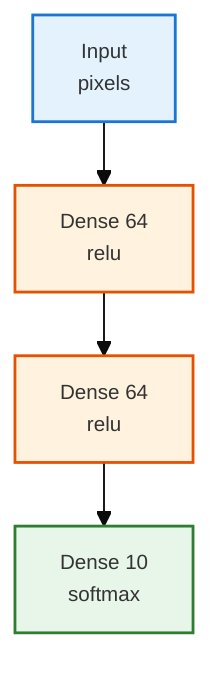
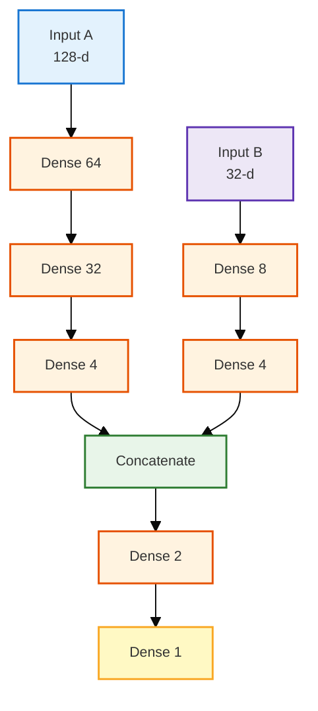
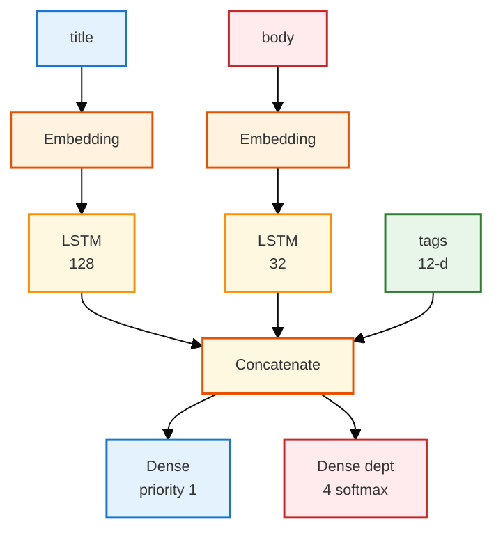
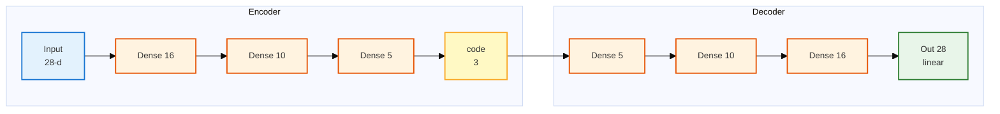
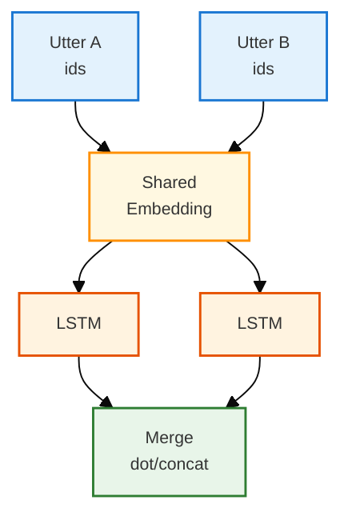
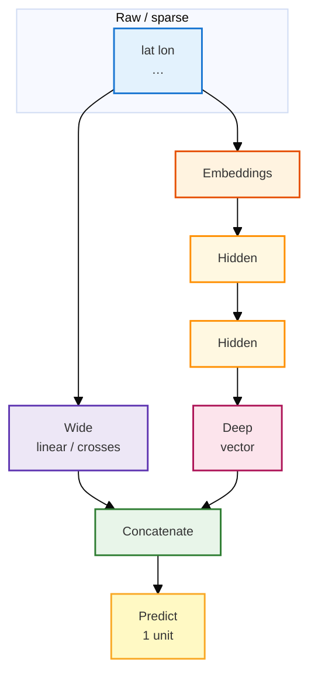

# TensorFlow Keras: Functional API (vs Sequential) & Wide & Deep

> **Purpose:** A readable walkthrough of **Keras Functional API**—what it buys you over `Sequential`, how to think in graphs, and how **Wide & Deep**–style models fit in.  
> **Audience:** You know “layers stacked in order”; you want **branches, merges, multiple inputs/outputs**, and a mental model that matches real TensorFlow code.  
> **Style:** Tables follow [docs/styles/DOCS_TABLE_STYLE.md](../../../styles/DOCS_TABLE_STYLE.md). Diagrams follow [docs/styles/DOCS_MERMAID_DIAGRAM_STYLE.md](../../../styles/DOCS_MERMAID_DIAGRAM_STYLE.md).  
> **Related:** Data loading patterns in [tf_data_pipeline_guide.md](./tf_data_pipeline_guide.md).

---

## 1. Key terms in plain English

These show up constantly in Keras docs and Wide &amp; Deep tutorials. Short definitions only—later sections use them in context.

<table style="width:100%;border-collapse:collapse;font-size:12px;">
<thead>
<tr>
<th style="border:1px solid #BFCAD6;padding:6px;background:#1565c0;color:white;text-align:left;width:18%;">Term</th>
<th style="border:1px solid #BFCAD6;padding:6px;background:#1565c0;color:white;text-align:left;width:82%;">What it means (layman)</th>
</tr>
</thead>
<tbody>
<tr>
<td style="border:1px solid #D7E0EA;padding:6px;background:#e3f2fd;vertical-align:top;"><b>Embedding</b></td>
<td style="border:1px solid #D7E0EA;padding:6px;vertical-align:top;">A <b>learned lookup table</b>: each token or category ID is turned into a short vector of numbers the network can train. Think “give every word (or zip code bucket) its own fingerprint of floats.” In Keras: <code>layers.Embedding(vocab_size, dim)</code>.</td>
</tr>
<tr>
<td style="border:1px solid #D7E0EA;padding:6px;background:#fff3e0;vertical-align:top;"><b>Dense</b></td>
<td style="border:1px solid #D7E0EA;padding:6px;vertical-align:top;">(1) <b>Fully connected</b> layer: every input unit connects to every output unit. (2) Informally, a <b>dense tensor</b>: a block of numbers (float matrix), as opposed to sparse storage. <code>layers.Dense(n)</code> is the first meaning.</td>
</tr>
<tr>
<td style="border:1px solid #D7E0EA;padding:6px;background:#e8f5e9;vertical-align:top;"><b>Sparse</b></td>
<td style="border:1px solid #D7E0EA;padding:6px;vertical-align:top;">Data where <b>most slots are empty or zero</b>—e.g. one-hot categories, hashed buckets. Wide models often start from <b>sparse features</b> before embeddings or linear terms turn them into something trainable.</td>
</tr>
<tr>
<td style="border:1px solid #D7E0EA;padding:6px;background:#ede7f6;vertical-align:top;"><b>Head</b></td>
<td style="border:1px solid #D7E0EA;padding:6px;vertical-align:top;">The <b>output branch</b> for one task: usually the last layer(s) on a shared trunk. Example: <b>priority head</b> (one score) and <b>department head</b> (four probabilities). Not a special Keras type—just “this <code>Dense</code> is head A, that one is head B.”</td>
</tr>
<tr>
<td style="border:1px solid #D7E0EA;padding:6px;background:#fff9c4;vertical-align:top;"><b>Autoencoder</b></td>
<td style="border:1px solid #D7E0EA;padding:6px;vertical-align:top;">A model that <b>squeezes</b> input through a narrow middle (the <b>code</b>) then <b>rebuilds</b> something like the input. Used for compression, denoising, or learning a compact representation.</td>
</tr>
<tr>
<td style="border:1px solid #D7E0EA;padding:6px;background:#ffebee;vertical-align:top;"><b>Cross</b> (feature cross)</td>
<td style="border:1px solid #D7E0EA;padding:6px;vertical-align:top;">A <b>combination</b> of raw features—e.g. pickup area × dropoff area—so the model learns patterns that depend on <b>both</b> together. The <b>wide</b> path often uses <b>crossed</b> sparse features with <b>indicator</b> columns.</td>
</tr>
<tr>
<td style="border:1px solid #D7E0EA;padding:6px;background:#fce4ec;vertical-align:top;"><b>Memorization</b> / <b>memorizing</b></td>
<td style="border:1px solid #D7E0EA;padding:6px;vertical-align:top;">When a model (often a <b>wide</b> branch) “memorizes,” it <b>fits frequent, specific combos</b> from training—often via <b>sparse + linear</b> or crosses. Complements <b>generalization</b> on the <b>deep</b> path for <b>new</b> combos.</td>
</tr>
</tbody>
</table>

---

## 2. Sequential vs Functional—in plain language

**Sequential** is a **single hallway**: one front door, one line of rooms, one exit.

**Functional** is a **building with corridors**: several entrances, rooms that **split** or **rejoin**, and sometimes **more than one exit**.

<table style="width:100%;border-collapse:collapse;font-size:12px;">
<thead>
<tr>
<th style="border:1px solid #BFCAD6;padding:6px;background:#1565c0;color:white;text-align:left;width:22%;">Idea</th>
<th style="border:1px solid #BFCAD6;padding:6px;background:#1565c0;color:white;text-align:left;width:39%;"><span style="background:#e3f2fd;padding:1px 4px">Sequential</span></th>
<th style="border:1px solid #BFCAD6;padding:6px;background:#1565c0;color:white;text-align:left;width:39%;"><span style="background:#fff3e0;padding:1px 4px">Functional</span></th>
</tr>
</thead>
<tbody>
<tr>
<td style="border:1px solid #D7E0EA;padding:6px;background:#e8f5e9;vertical-align:top;"><b>Shape</b></td>
<td style="border:1px solid #D7E0EA;padding:6px;vertical-align:top;">One stack</td>
<td style="border:1px solid #D7E0EA;padding:6px;vertical-align:top;">DAG: branches, shared nodes, multiple heads</td>
</tr>
<tr>
<td style="border:1px solid #D7E0EA;padding:6px;background:#e8f5e9;vertical-align:top;"><b>When it shines</b></td>
<td style="border:1px solid #D7E0EA;padding:6px;vertical-align:top;">MNIST-style “flat vector → dense → …”</td>
<td style="border:1px solid #D7E0EA;padding:6px;vertical-align:top;">Multi-input, multi-output, skip/merge, Wide &amp; Deep</td>
</tr>
<tr>
<td style="border:1px solid #D7E0EA;padding:6px;background:#e8f5e9;vertical-align:top;"><b>API shape</b></td>
<td style="border:1px solid #D7E0EA;padding:6px;vertical-align:top;"><code>keras.Sequential([...])</code></td>
<td style="border:1px solid #D7E0EA;padding:6px;vertical-align:top;"><code>keras.Model(inputs=..., outputs=...)</code></td>
</tr>
</tbody>
</table>

**What follows:** Section 3 is the smallest Functional graph. **Examples A–E** (sections 4–8) each introduce one pattern with **Purpose / Context / …** tables.

---

## 3. The Functional API in three moves

1. **`keras.Input(shape=..., name=...)`** — placeholders (batch size implicit).
2. **`y = Layer(...)(x)`** — call layers like functions.
3. **`keras.Model(inputs=[...], outputs=...)`** — freeze the graph.

### Example: same stack as Sequential (baseline)

| | |
|:---|:---|
| **Purpose** | Smallest Functional graph on a **real task shape** (e.g. **classify digits or categories** from one vector). |
| **Context** | **Practically:** handwritten digits, simple tabular classification. Same stack as `Sequential`; here you learn `Input` + `Model` syntax. |
| **Takeaway** | `compile` / `fit` / `predict` work like any Keras model. |

```python
from tensorflow import keras
from tensorflow.keras import layers

inputs = keras.Input(shape=(784,), name="pixels")
x = layers.Dense(64, activation="relu")(inputs)
x = layers.Dense(64, activation="relu")(x)
outputs = layers.Dense(10, activation="softmax")(x)
model = keras.Model(inputs=inputs, outputs=outputs, name="mnist_logreg_stack")
```



---

## 4. Example A — Two inputs merged into one prediction

| | |
|:---|:---|
| **Purpose** | Two towers → **one business score** (click, fraud, relevance, etc.). |
| **Context** | **Practically:** click/conversion, fraud/risk, search ranking; **`Sequential` cannot** take two `Input`s. |
| **What you’re building** | `concatenate` → head; same merge idea as Wide &amp; Deep. |



```python
from tensorflow import keras
from tensorflow.keras import layers

in_a = keras.Input(shape=(128,), name="deep_features")
x = layers.Dense(64, activation="relu")(in_a)
x = layers.Dense(32, activation="relu")(x)
branch_a = layers.Dense(4, activation="relu")(x)
in_b = keras.Input(shape=(32,), name="side_features")
y = layers.Dense(8, activation="relu")(in_b)
branch_b = layers.Dense(4, activation="relu")(y)
merged = layers.concatenate([branch_a, branch_b], name="merged")
z = layers.Dense(2, activation="relu")(merged)
out = layers.Dense(1, activation="sigmoid", name="score")(z)
model = keras.Model(inputs=[in_a, in_b], outputs=out, name="two_tower_merge")
```

---

## 5. Example B — One fused body, two output heads (ticket router)

| | |
|:---|:---|
| **Purpose** | **Ticket triage**-style multitask: priority + routing; each head has its own loss. |
| **Context** | **Practically:** helpdesk tickets (urgency + department); also detection (box + class), moderation multitask. |
| **What you’re building** | `Model(..., outputs=[...])` with dict/list losses in `compile` / `fit`. |



```python
from tensorflow import keras
from tensorflow.keras import layers

title = keras.Input(shape=(None,), dtype="int32", name="title_ids")
body = keras.Input(shape=(None,), dtype="int32", name="body_ids")
tags = keras.Input(shape=(12,), name="tags")
t = layers.Embedding(5000, 64)(title)
t = layers.LSTM(128)(t)
b = layers.Embedding(8000, 64)(body)
b = layers.LSTM(32)(b)
combined = layers.concatenate([t, b, tags], name="fused")
priority = layers.Dense(1, activation="sigmoid", name="priority")(combined)
department = layers.Dense(4, activation="softmax", name="department")(combined)
router = keras.Model(inputs=[title, body, tags], outputs=[priority, department], name="ticket_router")
```

*Training note:* With two outputs, pass **two label arrays** (or a dict keyed by output names) to `fit`.

---

## 6. Example C — Autoencoder: slice one graph into two `Model`s

| | |
|:---|:---|
| **Purpose** | Train **reconstruction** on the full model; ship **only the encoder** for **embeddings** in production. |
| **Context** | **Practically:** denoise, compress, anomaly detection; encoder for search/clustering. |
| **Takeaway** | `encoder` and `autoencoder` **share weights** (see Example D for reuse pattern). |



```python
from tensorflow import keras
from tensorflow.keras import layers

encoder_input = keras.Input(shape=(28,), name="img_vec")
x = layers.Dense(16, activation="relu")(encoder_input)
x = layers.Dense(10, activation="relu")(x)
x = layers.Dense(5, activation="relu")(x)
encoder_output = layers.Dense(3, activation="relu", name="code")(x)
encoder = keras.Model(encoder_input, encoder_output, name="encoder")
x = layers.Dense(5, activation="relu")(encoder_output)
x = layers.Dense(10, activation="relu")(x)
x = layers.Dense(16, activation="relu")(x)
decoder_output = layers.Dense(28, activation="linear", name="reconstruction")(x)
autoencoder = keras.Model(encoder_input, decoder_output, name="autoencoder")
```

---

## 7. Example D — Shared layer weights (two inputs, one `Embedding`)

| | |
|:---|:---|
| **Purpose** | **Paired inputs** (two tickets, query+document): **one** `Embedding` table, consistent vocabulary. |
| **Context** | **Practically:** duplicate tickets, Q–A match, semantic search; helps with **sparse labels**. |
| **Takeaway** | One `layers.Embedding(...)` instance; call it on both tensors—**same weights**. |



```python
from tensorflow import keras
from tensorflow.keras import layers

shared_emb = layers.Embedding(10000, 32, name="shared_text")

def twin_branch(ids):
    return layers.LSTM(64)(shared_emb(ids))

a = keras.Input(shape=(None,), dtype="int32")
b = keras.Input(shape=(None,), dtype="int32")
sim = layers.Dot(axes=1)([twin_branch(a), twin_branch(b)])
siamese = keras.Model([a, b], sim)
```

---

## 8. Example E — Wide & Deep (Google-style intuition + code)

| | |
|:---|:---|
| **Purpose** | **Memorization** (wide) + **generalization** (deep) → **taxi fare**, installs, CTR, ranking. |
| **Context** | **Practically:** course **taxi fare**; same idea for **recommendation** and **search**. Wide = crosses + linear; deep = embeddings + MLP. |
| **What you learn** | `DenseFeatures` + `concatenate` + `Dense(1)`; toy below without `feature_column`. |



```python
from tensorflow import keras
from tensorflow.keras import layers

INPUT_COLS = [
    "pickup_longitude", "pickup_latitude", "dropoff_longitude",
    "dropoff_latitude", "passenger_count",
]
inputs = {name: keras.Input(name=name, shape=(), dtype="float32") for name in INPUT_COLS}
# wide = layers.DenseFeatures(wide_columns)(inputs)
# deep path with DenseFeatures(deep_columns) + Dense stack...
# combined = layers.concatenate([deep, wide])
# model = keras.Model(inputs=list(inputs.values()), outputs=output)
```

**Runnable toy:**

```python
features = keras.Input(shape=(5,), name="numeric_features")
wide = layers.Dense(16, activation=None, name="wide_linearish")(features)
x = layers.Dense(30, activation="relu")(features)
x = layers.Dense(20, activation="relu")(x)
deep = layers.Dense(10, activation="relu")(x)
combined = layers.concatenate([deep, wide], name="combined")
fare = layers.Dense(1, activation=None, name="fare")(combined)
toy = keras.Model(inputs=features, outputs=fare, name="wide_deep_toy")
```

---

## 9. Strengths and weaknesses (Functional API)

<table style="width:100%;border-collapse:collapse;font-size:12px;">
<thead>
<tr>
<th style="border:1px solid #BFCAD6;padding:6px;background:#1565c0;color:white;text-align:left;width:50%;">Strengths</th>
<th style="border:1px solid #BFCAD6;padding:6px;background:#c62828;color:white;text-align:left;width:50%;">Weaknesses</th>
</tr>
</thead>
<tbody>
<tr>
<td style="border:1px solid #D7E0EA;padding:6px;background:#e8f5e9;vertical-align:top;">
<span style="background:#c8e6c9;padding:2px 4px">✓</span> Less boilerplate than subclassing for many graphs.<br><br>
<span style="background:#c8e6c9;padding:2px 4px">✓</span> Shape checks while you build.<br><br>
<span style="background:#c8e6c9;padding:2px 4px">✓</span> Plottable / inspectable; intermediate tensors easy to grab.<br><br>
<span style="background:#c8e6c9;padding:2px 4px">✓</span> Serializable save/load.
</td>
<td style="border:1px solid #D7E0EA;padding:6px;background:#ffebee;vertical-align:top;">
<span style="background:#ffcdd2;padding:2px 4px">⚠</span> DAG-only—no dynamic tree-RNN-style graphs in pure Functional form.<br><br>
<span style="background:#ffcdd2;padding:2px 4px">⚠</span> Heavy custom train steps → often subclass and compose Functional pieces.
</td>
</tr>
</tbody>
</table>

---

## 10. Takeaways

- **Sequential** — one input, one output, strict stack.  
- **Functional** — merges, splits, shared weights, multiple I/O.  
- **Wide &amp; Deep** — two opinions, `concatenate`, one head.  
- **`compile` / `fit` / `evaluate` / `predict`** — same as any Keras model.

**Example map:** **A** (4) two inputs → merge · **B** (5) multitask heads · **C** (6) encoder + autoencoder · **D** (7) shared `Embedding` · **E** (8) wide + deep.

**Optional figures:** Add PNGs under `./assets/` and use ``.
