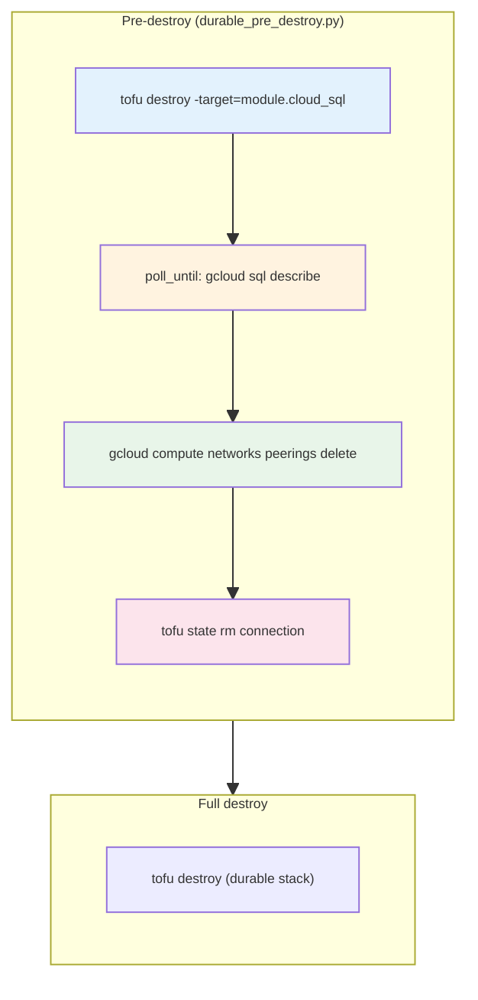
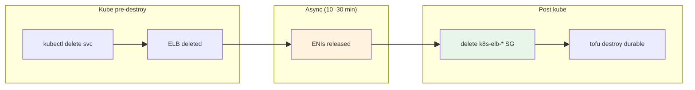
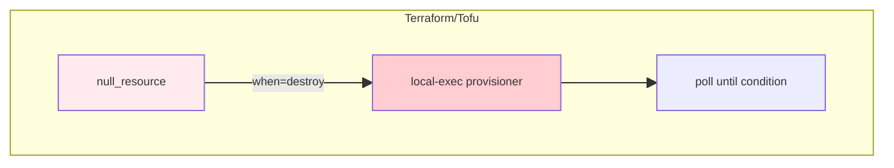

# Terraform/OpenTofu: Asynchronous Deletion (and Creation)

This document encapsulates **issues and strategies** for handling cloud resources whose deletion (or creation) is **asynchronous**—Terraform/Tofu issues the API call and returns immediately, but the cloud backend continues work in the background. Dependent resources may block until that work completes.

---

## 1. The Problem

| Aspect | Description |
|--------|-------------|
| <span style="color:#1565c0">**Async delete**</span> | Cloud issues delete; API returns success. Backend releases resources over minutes (or longer). |
| <span style="color:#1565c0">**Blocking dependency**</span> | Resource B depends on A. Terraform tries to delete B; cloud rejects until A is fully gone. |
| <span style="color:#1565c0">**No status to poll**</span> | Many clouds do not expose a "deleting" or "pending" status. The only check is retrying the dependent delete. |

### 1.1 Examples in Our Stacks

| Cloud | Resource A (async delete) | Resource B (blocked until A gone) | Typical delay |
|-------|---------------------------|-----------------------------------|----------------|
| <span style="color:#0d47a1">**GCP**</span> | Cloud SQL instance | `google_service_networking_connection` (VPC peering) | <span style="color:#e65100">5–15 min</span> (instance); <span style="color:#e65100">10–30+ min</span> (connection) |
| <span style="color:#e65100">**AWS**</span> | Classic ELB (from kubectl delete svc) | `k8s-elb-*` security group | <span style="color:#e65100">10–30 min</span> (ENI release) |
| <span style="color:#e65100">**AWS**</span> | EKS cluster | Node SGs, ENIs | Variable |

---

## 2. Strategies: Pro/Con Comparison

### 2.1 Summary Table

| Strategy | Pros | Cons | Where we use |
|----------|------|------|---------------|
| <span style="color:#0d47a1">**1. Pre-destroy external script**</span> <span style="color:#6a1b9a">*(main)*</span> | <span style="color:#2e7d32">Full control, logging, heartbeat, testable</span> | <span style="color:#c62828">Logic outside Terraform</span> | <span style="color:#00695c">GCP durable, AWS kube</span> |
| <span style="color:#0d47a1">**2. Poll until condition**</span> <span style="color:#6a1b9a">*(Strategy 1 sub-step)*</span> | <span style="color:#2e7d32">Declarative "wait until gone"</span> | <span style="color:#c62828">Needs external script; not in Terraform</span> | <span style="color:#00695c">GCP pre-destroy (Cloud SQL)</span> |
| <span style="color:#0d47a1">**3. Alternative API path**</span> <span style="color:#6a1b9a">*(Strategy 1 sub-step)*</span> | <span style="color:#2e7d32">Bypasses blocking check; instant</span> | <span style="color:#c62828">Cloud-specific; state sync needed</span> | <span style="color:#00695c">GCP pre-destroy (peering)</span> |
| <span style="color:#0d47a1">**4. Full destroy retry with sleep**</span> | <span style="color:#2e7d32">Simple; no pre-destroy</span> | <span style="color:#c62828">Long total time; many retries</span> | <span style="color:#00695c">GCP durable (fallback)</span> |
| <span style="color:#0d47a1">**5. Post-destroy orphan cleanup**</span> | <span style="color:#2e7d32">Handles resources Terraform never managed</span> | <span style="color:#c62828">Separate phase; retry logic</span> | <span style="color:#00695c">AWS k8s-elb-* SG, RDS log groups</span> |
| <span style="color:#0d47a1">**6. null_resource + destroy-time provisioner**</span> | <span style="color:#2e7d32">In-Terraform; runs at destroy</span> | <span style="color:#c62828">HashiCorp discourages; non-declarative; hard to debug</span> | <span style="color:#616161">**Not used**</span> |

### 2.2 Detailed Pro/Con

#### Strategy 1: Pre-destroy External Script

| <span style="color:#2e7d32">Pro</span> | <span style="color:#c62828">Con</span> |
|-----|-----|
| <span style="color:#2e7d32">Full control over order and timing</span> | <span style="color:#c62828">Logic lives outside Terraform</span> |
| <span style="color:#2e7d32">Rich logging, heartbeat, timeouts</span> | <span style="color:#c62828">Requires Python/shell; another moving part</span> |
| <span style="color:#2e7d32">Testable in isolation</span> | <span style="color:#c62828">Must be invoked by teardown orchestrator</span> |
| <span style="color:#2e7d32">Can combine multiple steps (targeted destroy + poll + alternative API)</span> | |

#### Strategy 2: Poll Until Condition <span style="color:#6a1b9a">*(part of Strategy 1)*</span>

| <span style="color:#2e7d32">Pro</span> | <span style="color:#c62828">Con</span> |
|-----|-----|
| <span style="color:#2e7d32">Clear "wait until X" semantics</span> | <span style="color:#c62828">Needs external script (poll_until)</span> |
| <span style="color:#2e7d32">Configurable timeout and interval</span> | <span style="color:#c62828">Not declarative in Terraform</span> |
| <span style="color:#2e7d32">Heartbeat avoids "appears frozen"</span> | |

#### Strategy 3: Alternative API Path <span style="color:#6a1b9a">*(part of Strategy 1)*</span>

| <span style="color:#2e7d32">Pro</span> | <span style="color:#c62828">Con</span> |
|-----|-----|
| <span style="color:#2e7d32">Bypasses blocking check; succeeds immediately</span> | <span style="color:#c62828">Cloud-specific; must discover correct path</span> |
| <span style="color:#2e7d32">Same effect as Console UI in many cases</span> | <span style="color:#c62828">Requires `tofu state rm` to sync state</span> |
| <span style="color:#2e7d32">No polling or long waits</span> | |

#### Strategy 4: Full Destroy Retry with Sleep

| <span style="color:#2e7d32">Pro</span> | <span style="color:#c62828">Con</span> |
|-----|-----|
| <span style="color:#2e7d32">Simple; no pre-destroy orchestration</span> | <span style="color:#c62828">Total time = N × (destroy duration + sleep)</span> |
| <span style="color:#2e7d32">Fallback when pre-destroy skips (resource not in state)</span> | <span style="color:#c62828">Many retries if delay is long</span> |
| | <span style="color:#c62828">User waits through full destroy attempts</span> |

#### Strategy 5: Post-destroy Orphan Cleanup

| <span style="color:#2e7d32">Pro</span> | <span style="color:#c62828">Con</span> |
|-----|-----|
| <span style="color:#2e7d32">Handles resources Terraform never managed</span> | <span style="color:#c62828">Separate phase after all stacks destroyed</span> |
| <span style="color:#2e7d32">Idempotent (ignore already gone)</span> | <span style="color:#c62828">Retry logic for async release (e.g. ENI)</span> |
| <span style="color:#2e7d32">Industry practice for cloud-created orphans</span> | |

#### Strategy 6: null_resource + Destroy-time Provisioner

| <span style="color:#2e7d32">Pro</span> | <span style="color:#c62828">Con</span> |
|-----|-----|
| <span style="color:#2e7d32">Logic inside Terraform</span> | <span style="color:#c62828">**HashiCorp recommends against** (last resort)</span> |
| <span style="color:#2e7d32">Runs automatically at destroy</span> | <span style="color:#c62828">Non-declarative; provisioners are escape hatches</span> |
| | <span style="color:#c62828">Hard to debug; `self.triggers` for dynamic values</span> |
| | <span style="color:#c62828">State drift if provisioner fails partially</span> |
| | <span style="color:#c62828">Tofu inherits same behavior; no technical advantage</span> |

**Note on HashiCorp's stance:** They recommend provisioners only as a last resort. Reasons are technical (non-declarative, state complexity, debugging) rather than purely commercial. For Tofu users: the same trade-offs apply. We use external scripts instead for better control and observability.

**Create-time vs destroy-time provisioner:** A *create-time* provisioner runs when a resource is created (`when = create` or default). A *destroy-time* provisioner runs when a resource is destroyed (`when = destroy`). For async *deletion*, you would use a **destroy-time** provisioner on a `null_resource`—e.g. a `local-exec` that polls until a dependent resource is gone before Terraform proceeds. Yes, `null_resource` is the typical vehicle for such provisioners. We do not use this pattern; we use external pre-destroy scripts instead.

---

## 3. Where and How We Use Each Strategy

### 3.1 Strategy 1 (Pre-destroy) with sub-steps 2 & 3: GCP Durable

**File:** `tools/gcp/scope_shared/teardown/durable_pre_destroy.py`

**Flow:** Strategy 1 (pre-destroy) runs: targeted Cloud SQL destroy → Strategy 2 (poll until instance gone) → Strategy 3 (`gcloud compute networks peerings delete` + `tofu state rm`) → full durable destroy.

```python
# Strategy 1: Pre-destroy — targeted destroy
cmd = ["destroy", "-target=module.cloud_sql", "-auto-approve"] + destroy_vars
result = terra_capture(cmd, cwd=stack_path, region=region)

# Strategy 2 (sub-step of 1): Poll until instance gone
ok = poll_until(
    _instance_gone,  # gcloud sql instances describe → rc!=0
    timeout_sec=CLOUD_SQL_WAIT_TIMEOUT_SEC,
    check_interval_sec=CLOUD_SQL_POLL_INTERVAL_SEC,
    heartbeat_interval_sec=60,
    heartbeat_message_fn=lambda elapsed: f"waiting for Cloud SQL ... ({elapsed}s)",
)

# Strategy 3 (sub-step of 1): Alternative API path
subprocess.run([
    "gcloud", "compute", "networks", "peerings", "delete",
    "servicenetworking-googleapis-com", "--network", network_name, "--project", gcp_project,
], ...)
subprocess.run([exe, "state", "rm", "google_service_networking_connection.default"], ...)
```

**Invoked by:** `tools/gcp/teardown.py` before durable stack destroy when `--incl-dura` or `--incl-dura-all`.

---

### 3.2 Strategy 4: Full Destroy Retry with Sleep

**File:** `tools/gcp/scope_shared/teardown/durable_pre_destroy.py` — `destroy_durable_with_retry`

**When:** Fallback when connection wasn't in state for pre-destroy targeted destroy.

```python
for attempt in range(1, CONNECTION_RETRY_MAX + 1):
    result = terra_capture(destroy_cmd, cwd=stack_path, region=region)
    if result.returncode == 0:
        return
    if "producer services" in err_lower and "still using" in err_lower:
        sleep_with_heartbeat(CONNECTION_RETRY_WAIT_SEC, "waiting for GCP to release connection", interval_sec=60)
        continue
    raise RuntimeError(...)
```

---

### 3.3 Strategy 5: Post-destroy Orphan Cleanup (AWS)

**File:** `tools/aws/kube/teardown_orphan_cleanup.py` — `remove_orphaned_k8s_elb_security_groups`

**Flow:** After kube destroy, before durable destroy. Retries `aws ec2 delete-security-group` on `DependencyViolation` (ENIs still attached).

```python
while time.monotonic() < deadline:
    r = subprocess.run(["aws", "ec2", "delete-security-group", "--group-id", sg_id, ...])
    if r.returncode == 0:
        break
    if "DependencyViolation" not in (r.stderr or ""):
        break
    time.sleep(K8S_ELB_SG_POLL_INTERVAL_SEC)
```

**File:** `tools/aws/scope_shared/teardown/durable_post_destroy.py` — RDS log groups, ECS log groups, state bucket (idempotent delete; no retry for async).

---

### 3.4 Strategy 6: null_resource — Not Used

We do **not** use `null_resource` with destroy-time provisioners. External scripts give us:

- Heartbeat logging
- Configurable timeouts
- Clear separation of orchestration (teardown.py) vs logic (durable_pre_destroy.py)
- Easier testing

---

## 4. Visual Aids

### 4.1 GCP Durable Teardown Flow



### 4.2 Strategy Comparison

| Strategy | Blocking? | Polling? | Timeout | Our usage |
|----------|-----------|----------|---------|-----------|
| <span style="color:#0d47a1">**Pre-destroy (Strategy 1)**</span> | No | <span style="color:#2e7d32">Yes</span> (Cloud SQL) | <span style="color:#e65100">20 min</span> | <span style="color:#00695c">GCP durable</span> |
| <span style="color:#6a1b9a">↳ Poll (Strategy 2)</span> | — | — | — | <span style="color:#00695c">part of Strategy 1</span> |
| <span style="color:#6a1b9a">↳ Alternative API (Strategy 3)</span> | — | — | — | <span style="color:#00695c">part of Strategy 1</span> |
| <span style="color:#0d47a1">Full destroy retry</span> | <span style="color:#c62828">Yes</span> | Implicit (retry) | <span style="color:#e65100">15 × 2 min</span> | <span style="color:#00695c">GCP fallback</span> |
| <span style="color:#0d47a1">Post-destroy orphan</span> | No | <span style="color:#2e7d32">Yes</span> (SG) | <span style="color:#e65100">5 min</span> | <span style="color:#00695c">AWS k8s-elb-*</span> |

### 4.3 AWS k8s-elb-* SG Flow



### 4.4 Option: null_resource (Not Used)



---

## 5. References

| Topic | Reference |
|-------|-----------|
| <span style="color:#0d47a1">GCP service networking</span> | [WAR_STORIES_GCP.md §8](../../../war_stories/WAR_STORIES_GCP.md) |
| <span style="color:#0d47a1">GCP Cloud SQL wiring</span> | [GCP_API_CLOUD_SQL_WIRING.md](../cloud_shared/GCP_API_CLOUD_SQL_WIRING.md) |
| <span style="color:#e65100">AWS ELB ENI release</span> | [KUBE_INGRESS_LEARNED.md §0.7](../KUBE_INGRESS_LEARNED.md) |
| Terraform provider issue | [terraform-provider-google #19908](https://github.com/hashicorp/terraform-provider-google/issues/19908) |
| <span style="color:#00695c">poll_until, sleep_with_heartbeat</span> | `tools/cloud_shared/retry/with_heartbeat.py` |

---

## 6. Decision Guide

| When to use | Strategy |
|-------------|----------|
| Resource blocks Terraform destroy; cloud has async release | <span style="color:#00695c">Strategy 1 (Pre-destroy) + sub-steps 2 & 3: poll + alternative API</span> |
| Resource blocks; no alternative API; must wait | <span style="color:#00695c">Strategy 1 (Pre-destroy) + sub-step 2: poll until condition</span> |
| Orphaned resource (Terraform never managed) | <span style="color:#00695c">Post-destroy cleanup with retry</span> |
| Pre-destroy skipped (resource not in state) | <span style="color:#00695c">Full destroy retry with sleep</span> |
| Prefer logic in Terraform | <span style="color:#616161">null_resource + provisioner</span> (we avoid; HashiCorp discourages) |
