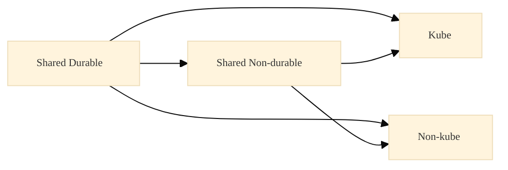

# Durable vs Non-durable and Teardown Scope Rules

Durability (how often we destroy) and ownership (who uses) are **orthogonal** axes. This doc summarizes our rules for stack lifecycle and teardown scope.

**See also:** [TERRA_STACK_OWNERSHIP_AND_SHARED_RESOURCES.md](TERRA_STACK_OWNERSHIP_AND_SHARED_RESOURCES.md), [TERRA_LEARNED.md](TERRA_LEARNED.md), [TERRA_LEARNED_TOTAL.md](TERRA_LEARNED_TOTAL.md).

---

## 1. Durable vs Non-durable vs Ownership

- **Durable**: rarely destroyed, explicit intent required (e.g., secrets, base networking, VPC)
- **Non-durable**: frequently destroyed (clusters, services, schedulers)

Ownership is separate:
- **shared** (scope_shared stacks)
- **kube-specific**
- **nonkube-specific**

---

## 2. Teardown Scope Rules

If kube and nonkube both exist, tearing down one must not break the other.

Rules:
1. Durable stacks are **never destroyed implicitly**
2. Non-durable stacks may depend on durable stacks
3. Durable stacks may not depend on non-durable stacks
4. Kube teardown only destroys kube-owned state (plus optional shared-nondurable when safe)
5. Nonkube teardown only destroys nonkube-owned state (plus optional shared-nondurable when safe)

---

*Doc: `docs/learned/terra/TERRA_DURABLE_TEARDOWN_RULES.md`*
