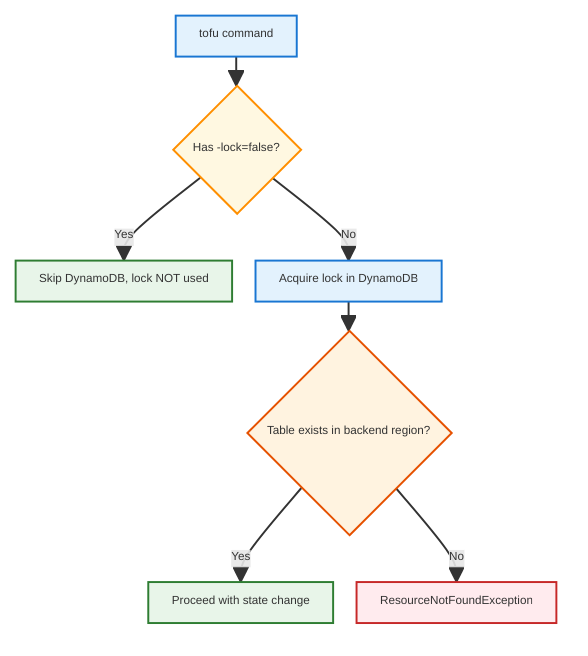
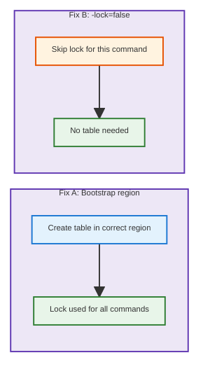
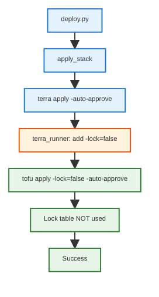

# Terraform DynamoDB Lock Table

General documentation about the <span style="background:#e3f2fd;padding:1px 4px">DynamoDB state lock table</span> used by the S3 backend, when it is used, and how to fix <span style="background:#ffebee;padding:1px 4px">ResourceNotFoundException</span> errors.

**See also:** [TERRA_LEARNED_INCONSISTENT_STATES.md](TERRA_LEARNED_INCONSISTENT_STATES.md) (when `tofu state rm` is needed to fix cross-stack state pollution), [setup_state_backend.py](../../tools/aws/scope_shared/deploy/setup_state_backend.py).

---

## 1. What Is the Lock Table?

```mermaid
graph TD
  subgraph Without["Without lock table"]
    W1[Process A: apply] --> W2[Write state to S3]
    W3[Process B: apply] --> W4[Write state to S3]
    W2 -.->|race| W4
  end

  subgraph With["With lock table"]
    A1[Process A: apply] --> A2[Acquire lock in DynamoDB]
    A2 --> A3[Write state to S3]
    A3 --> A4[Release lock]
    B1[Process B: apply] --> B2[Wait for lock...]
    B2 --> B3[Acquire lock]
    B3 --> B4[Write state]
  end

  style W1 fill:#e3f2fd,stroke:#1976d2,stroke-width:2px,font-size:16px
  style W2 fill:#ffebee,stroke:#c62828,stroke-width:2px,font-size:16px
  style W3 fill:#e3f2fd,stroke:#1976d2,stroke-width:2px,font-size:16px
  style W4 fill:#ffebee,stroke:#c62828,stroke-width:2px,font-size:16px
  style A1 fill:#e3f2fd,stroke:#1976d2,stroke-width:2px,font-size:16px
  style A2 fill:#e8f5e9,stroke:#2e7d32,stroke-width:2px,font-size:16px
  style A3 fill:#e8f5e9,stroke:#2e7d32,stroke-width:2px,font-size:16px
  style A4 fill:#e8f5e9,stroke:#2e7d32,stroke-width:2px,font-size:16px
  style B1 fill:#e3f2fd,stroke:#1976d2,stroke-width:2px,font-size:16px
  style B2 fill:#fff3e0,stroke:#e65100,stroke-width:2px,font-size:16px
  style B3 fill:#e8f5e9,stroke:#2e7d32,stroke-width:2px,font-size:16px
  style B4 fill:#e8f5e9,stroke:#2e7d32,stroke-width:2px,font-size:16px
```

The S3 backend for Terraform/OpenTofu stores state in S3. When multiple processes (or users) run <code>tofu apply</code> or <code>tofu state rm</code> at the same time, they could overwrite each other's state. The **DynamoDB lock table** provides <span style="background:#e8f5e9;padding:1px 4px">distributed locking</span>: before writing state, Terraform acquires a lock row; after writing, it releases it.



<table>
<tr style="background:#1565c0;color:white">
<th>Aspect</th>
<th>Value</th>
</tr>
<tr>
<td style="background:#e3f2fd"><strong>Table name</strong></td>
<td><code>{PROJ_PREFIX}-{TF_LOCK_TABLE_COMPONENT}-{region}</code> (e.g. <code>fru-tf-locks-tbl-us-east-2</code>)</td>
</tr>
<tr>
<td style="background:#e3f2fd"><strong>Region</strong></td>
<td>Must match the S3 backend region (where state lives)</td>
</tr>
<tr>
<td style="background:#e3f2fd"><strong>Key</strong></td>
<td><code>LockID</code> (string) — one row per state file</td>
</tr>
<tr>
<td style="background:#e3f2fd"><strong>Backend config</strong></td>
<td><code>dynamodb_table=...</code> in S3 backend block</td>
</tr>
<tr>
<td style="background:#e3f2fd"><strong>Alternative</strong></td>
<td><code>use_lockfile=true</code> — S3-native lockfile (no DynamoDB)</td>
</tr>
</table>

---

## 2. When Is the Lock Table Used?

Terraform uses the lock table **only when** you run state-modifying commands <span style="background:#ffebee;padding:1px 4px">without</span> <code>-lock=false</code>:



<table>
<tr style="background:#1565c0;color:white">
<th>Command</th>
<th>Uses lock by default?</th>
<th>Our deploy script</th>
</tr>
<tr>
<td style="background:#e3f2fd"><code>tofu apply</code></td>
<td><span style="background:#fff3e0;padding:1px 3px">Yes</span></td>
<td>Adds <code>-lock=false</code> → <span style="background:#e8f5e9;padding:1px 3px">no lock</span></td>
</tr>
<tr>
<td style="background:#e3f2fd"><code>tofu plan</code></td>
<td><span style="background:#fff3e0;padding:1px 3px">Yes</span></td>
<td>Adds <code>-lock=false</code> → <span style="background:#e8f5e9;padding:1px 3px">no lock</span></td>
</tr>
<tr>
<td style="background:#e3f2fd"><code>tofu destroy</code></td>
<td><span style="background:#fff3e0;padding:1px 3px">Yes</span></td>
<td>Adds <code>-lock=false</code> → <span style="background:#e8f5e9;padding:1px 3px">no lock</span></td>
</tr>
<tr>
<td style="background:#e3f2fd"><code>tofu state rm</code></td>
<td><span style="background:#fff3e0;padding:1px 3px">Yes</span></td>
<td>Manual runs → <span style="background:#ffebee;padding:1px 3px">no</span> <code>-lock=false</code> unless you pass it</td>
</tr>
<tr>
<td style="background:#e3f2fd"><code>tofu init</code></td>
<td><span style="background:#fff3e0;padding:1px 3px">Yes</span></td>
<td>Adds <code>-lock=false</code> → <span style="background:#e8f5e9;padding:1px 3px">no lock</span></td>
</tr>
</table>

---

## 3. The Two Fixes (ResourceNotFoundException)

When you get <span style="background:#ffebee;padding:1px 4px">ResourceNotFoundException</span> acquiring the state lock, you have two options:

### Fix A: Bootstrap region fix (create table in correct region)

**What:** Ensure the table exists in the same region as the S3 backend. The bootstrap script was updated to pass <code>--region</code> to <code>aws dynamodb</code> commands so the table is created in the <span style="background:#e3f2fd;padding:1px 3px">deploy region</span> (e.g. us-east-2), not the default region.

**How:** Run bootstrap with <code>CLOUD_REGION</code> set:

```bash
CLOUD_REGION=us-east-2 FRU_ENV=dev AWS_PROFILE=admin python tools/aws/scope_shared/deploy/setup_state_backend.py
```

### Fix B: Use <code>-lock=false</code> (bypass lock)

**What:** Skip the DynamoDB lock entirely for that command. Terraform will still write state, but without acquiring a lock.

**How:** Add <code>-lock=false</code> to the command:

```bash
tofu state rm module.ecs -lock=false
```

---

## 4. Comparison: Fix A vs Fix B



<table>
<tr style="background:#1565c0;color:white">
<th style="width:18%">Aspect</th>
<th style="width:41%">Fix A: Bootstrap region</th>
<th style="width:41%">Fix B: <code>-lock=false</code></th>
</tr>
<tr>
<td style="background:#e3f2fd"><strong>Pros</strong></td>
<td style="background:#ede7f6"><span style="background:#c8e6c9;padding:2px 4px">✓</span> Lock table works for future runs<br><span style="background:#c8e6c9;padding:2px 4px">✓</span> Protects against concurrent state writes</td>
<td style="background:#fff3e0"><span style="background:#c8e6c9;padding:2px 4px">✓</span> No table needed<br><span style="background:#c8e6c9;padding:2px 4px">✓</span> Works immediately<br><span style="background:#c8e6c9;padding:2px 4px">✓</span> Matches deploy script behavior</td>
</tr>
<tr>
<td style="background:#e3f2fd"><strong>Cons</strong></td>
<td style="background:#ede7f6"><span style="background:#ffcdd2;padding:2px 4px">⚠</span> Requires bootstrap run<br><span style="background:#ffcdd2;padding:2px 4px">⚠</span> Table must exist in correct region</td>
<td style="background:#fff3e0"><span style="background:#ffcdd2;padding:2px 4px">⚠</span> No protection against concurrent writes<br><span style="background:#ffcdd2;padding:2px 4px">⚠</span> Must remember to pass for each manual command</td>
</tr>
<tr>
<td style="background:#e3f2fd"><strong>When to use</strong></td>
<td style="background:#ede7f6">When you want locking for manual runs or CI/CD</td>
<td style="background:#fff3e0"><span style="background:#2e7d32;color:white;padding:1px 4px">recommended</span> One-off manual commands; deploy already uses this</td>
</tr>
<tr>
<td style="background:#e3f2fd"><strong>Scope</strong></td>
<td style="background:#ede7f6"><span style="background:#fff9c4;padding:1px 3px">manual</span> One-time fix (create table once)</td>
<td style="background:#fff3e0">Per-command (pass flag each time)</td>
</tr>
</table>

---

## 5. Why Our Deploy Succeeds Without the Table

<table>
<tr style="background:#1565c0;color:white">
<th>Step</th>
<th>What happens</th>
</tr>
<tr>
<td style="background:#e3f2fd"><strong>Deploy runs</strong></td>
<td><code>terra()</code> / <code>terra_capture()</code> in <span style="background:#e3f2fd;padding:1px 3px">terra_runner.py</span> adds <code>-lock=false</code> to apply, plan, destroy, output, init</td>
</tr>
<tr>
<td style="background:#e3f2fd"><strong>Terraform</strong></td>
<td><span style="background:#e8f5e9;padding:1px 3px">Skips</span> DynamoDB lock</td>
</tr>
<tr>
<td style="background:#e3f2fd"><strong>Result</strong></td>
<td><span style="background:#c8e6c9;padding:2px 4px">✓</span> Deploy succeeds even if the lock table does not exist</td>
</tr>
</table>



---

## 6. Quick Reference

<table>
<tr style="background:#1565c0;color:white">
<th>Scenario</th>
<th>Action</th>
</tr>
<tr>
<td style="background:#e3f2fd">Deploy fails with lock error</td>
<td><span style="background:#fff3e0;padding:1px 3px">Unlikely</span>; deploy uses <code>-lock=false</code>. If it happens, check <code>terra_runner.py</code>.</td>
</tr>
<tr>
<td style="background:#e3f2fd">Manual <code>tofu state rm</code> fails</td>
<td>Use <code>tofu state rm &lt;addr&gt; -lock=false</code></td>
</tr>
<tr>
<td style="background:#e3f2fd">Want locking for manual runs</td>
<td>Run bootstrap with <code>CLOUD_REGION</code> set so table exists in correct region</td>
</tr>
<tr>
<td style="background:#e3f2fd">Table in wrong region</td>
<td>Use Fix B for now; or delete table and re-run bootstrap with correct region</td>
</tr>
</table>
