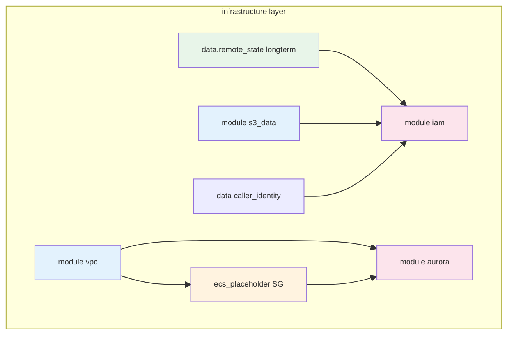
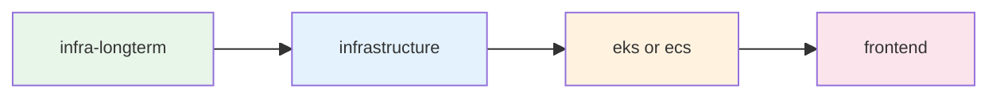
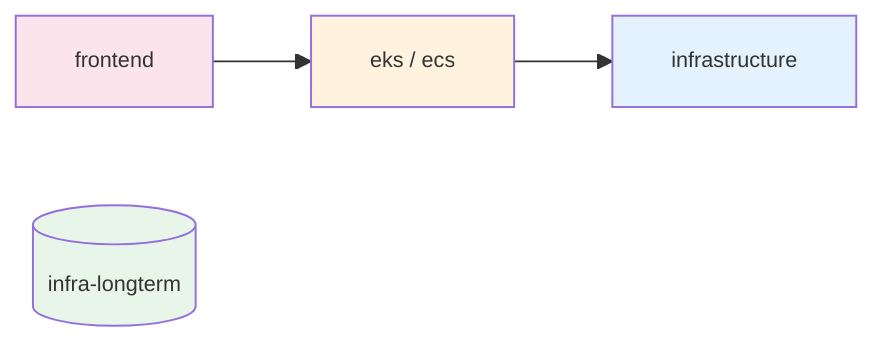
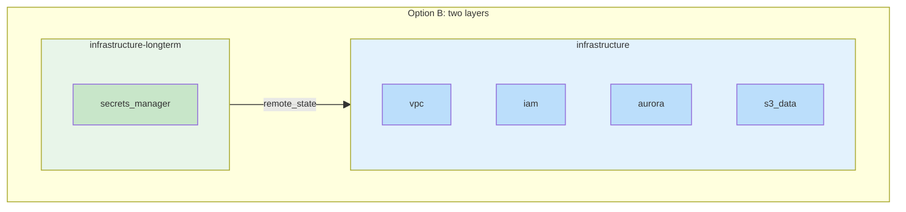

# Terraform “Layers” Crash Course

A short guide to what we mean by **layers** in Terraform/Terragrunt in this repo, how **deployment order** is determined, and how that connects to **long-term components** (e.g. Secrets Manager) and **Option B: separate long-term layer**.

**See also:** [VPC_LEARNED.md](VPC_LEARNED.md) (VPC + state + locks; [§3.2 Option B — Import](VPC_LEARNED.md#32-how-we-fix-it-align-state-and-reality) for fixing subnet group by importing), [DEPLOYMENT_ERRORS_AND_FIXES.md](../DEPLOYMENT_ERRORS_AND_FIXES.md), [war_stories/WAR_STORIES_CLOUD_SHARED.md](../../../war_stories/WAR_STORIES_CLOUD_SHARED.md).

---

## 1. What is a “layer”?

In this repo, a **layer** is **one unit of Terraform/Terragrunt that we apply or destroy as a single step**. It has:

- **One directory** with a `terragrunt.hcl` (and usually a Terraform module or `source`).
- **One remote state file** (e.g. in S3: `dev/infrastructure/terraform.tfstate`, `dev/eks/terraform.tfstate`).
- **One `terragrunt apply` or `terragrunt destroy`** = one layer.

So when we say “destroy the infrastructure layer,” we mean: run `terragrunt destroy` in that layer’s directory; everything in that layer’s state is destroyed together.

**Layers are not** the same as **modules**. A **module** is a reusable `.tf` folder (e.g. `modules/secrets-manager`, `modules/vpc`). One **layer** can use **many modules**. With **Option B**, the **infrastructure** layer uses: `data.terraform_remote_state.longterm`, `vpc`, `iam`, `aurora`, `s3_data` (no `secrets_manager`; that lives in **infrastructure-longterm**).

```text
Layer (one apply/destroy, one state)
  └── module_infra_basic/aws/terra/environments/dev/infrastructure/
        terragrunt.hcl  →  source = modules//root_infrastructure
        modules/root_infrastructure/main.tf
          ├── data "terraform_remote_state" "longterm"  (from module_infra_longterm)
          ├── module "vpc"
          ├── module "iam"   (uses longterm outputs + s3_data)
          ├── module "aurora"
          └── module "s3_data"
```

---

## 2. How is deployment order determined?

### 2.1 Order **among layers**

Layer order is **not** driven by Terragrunt `dependency` blocks. It is **explicit sequence** in `orchestration/terraform/deploy.sh`: the script runs a fixed sequence of `if` blocks and, for each layer, does `cd` → (optional import) → `terragrunt refresh` → `terragrunt plan` → `terragrunt apply`.

- **When `LAYER=all`** (full deploy), the script:
  1. Applies **infrastructure-longterm** (if that directory exists), then **infrastructure** — so the infrastructure layer can read longterm state.
  2. Then, depending on **`CONTAINER_TYPE`** (set by `./run.sh aws kube …` or `./run.sh aws nonkube …`):
     - **`CONTAINER_TYPE=eks`**: **eks** → **frontend-eks**
     - **`CONTAINER_TYPE=ecs`**: **ecs** → **frontend-ecs**
- **When `LAYER`** is a single layer (e.g. `infrastructure`, `eks`, `frontend-eks`, `frontend-ecs`), only that block runs; dependency on other layers is **assumed already deployed** (or you run deploy in the right order manually).

So: **longterm before infrastructure** (so `terraform_remote_state` works), **infrastructure before app** (EKS/ECS need VPC/subnets), **app before frontend** (frontend can reference app outputs if needed).

### 2.2 Order **within the same layer**

Within one layer we run a **single** `terragrunt apply`. Terraform decides the order of creates/updates from its **dependency graph**: resources and modules are applied in an order consistent with `depends_on` and with **references** (e.g. `module.aurora` depending on `module.vpc.vpc_id`). The deploy script does **not** sequence resources inside a layer — Terraform does.

Example **infrastructure** layer: `data.terraform_remote_state.longterm` and `data.aws_caller_identity.current` have no in-layer dependencies; `vpc` and `s3_data` have none; `aws_security_group.ecs_placeholder` depends on `vpc`; `iam` depends on longterm outputs and `s3_data`; `aurora` depends on `vpc` and `ecs_placeholder`. So the effective order is: longterm (read) + vpc + s3_data + caller_identity → ecs_placeholder → iam and aurora (parallel where possible).

**Within infrastructure layer (Terraform dependency order):**



---

## 3. Why layers matter for teardown

- **Apply:** We run apply **per layer** (e.g. infrastructure-longterm, infrastructure, then eks/ecs, then frontend). Order is fixed in `deploy.sh` (see §2.1).
- **Destroy:** We run destroy **per layer**, in **reverse** order (frontend first, then app, then **infra_basic**). Teardown script usage: `./teardown.sh [dev|prod] [infra_basic|longterm|ecs|eks|all]`. **longterm** (Secrets Manager) is never destroyed by `all`; use layer `longterm` explicitly to destroy it (Option B).

So “what gets destroyed” is decided by **which layers we run destroy on**. If Secrets Manager lived **inside** the infrastructure layer (as a module), destroying that layer would try to destroy secrets too — unless we block it (e.g. `prevent_destroy`) or **exclude it from that layer** (Option B).

**Deploy flow (layers):**



**Teardown flow (reverse; longterm never destroyed):**



*Main teardown never runs destroy on **infra-longterm**; that layer is left intact.*

---

## 4. Long-term components and “Option B”: separate long-term layer

Some AWS resources have **long-term** or **cool-off** behavior (e.g. Secrets Manager: 7–30 day recovery window, name reserved after delete). We don’t want **normal teardown** (including `teardown.sh aws all`) to delete them.

**Two ways to achieve “teardown never deletes long-term components”:**

| Approach | Idea | Pros / cons |
|----------|------|-------------|
| **Fail-back (current)** | Keep long-term resources in the **same** layer (e.g. infrastructure). Use `prevent_destroy` so destroy fails; then **state rm** those resources and run destroy again so only the rest (VPC, Aurora, etc.) are destroyed. | No Terraform refactor. One layer, one place to maintain. Teardown script has extra logic (state rm + second destroy). |
| **Option B: separate long-term layer** | Put long-term components (e.g. Secrets Manager) in a **separate Terragrunt layer** and tree (e.g. `module_infra_longterm` with layer `infrastructure-longterm`). That layer has its **own** state and its **own** directory. **Deploy:** apply both `infrastructure` and `infrastructure-longterm`. **Teardown:** only destroy `infrastructure` (layer **infra_basic**); **never** destroy longterm in the main flow (`all`). Destroy longterm explicitly with `./teardown.sh <env> longterm`. | Teardown logic stays simple: “destroy layer X” never touches the long-term layer. Clear split: “ephemeral infra” vs “long-term.” Implemented: separate trees `module_infra_basic`, `module_infra_longterm`, `module_infra_frontend`. |

**Option B in one picture:**



```text
Today (one layer):
  infrastructure (one state)
    ├── vpc, aurora, iam, s3_data, secrets_manager
    └── destroy infrastructure  →  would destroy secrets too (we use state rm + re-destroy to avoid that)

Option B (two layers):
  infrastructure          (state: dev/infrastructure)
    ├── vpc, aurora, iam, s3_data
    └── teardown destroys this only  →  secrets never in plan

  infrastructure-longterm (state: dev/infrastructure-longterm)
    └── secrets_manager
    └── main teardown never runs destroy here
    └── ./teardown.sh <env> longterm  can destroy this when explicitly requested
```

So **“layers”** are the knobs we turn to decide **what is applied together** and **what is destroyed together**. Putting long-term components in a **separate layer** that we **never** destroy in the main flow is the clean way to “never delete Secrets Manager in teardown” without `prevent_destroy` or state-rm logic.

**Implemented:** The repo uses **Option B**. The **infrastructure-longterm** layer lives in **module_infra_longterm** (Secrets Manager only); it is applied first on deploy and is **never** destroyed by `teardown.sh ... all`. The **infrastructure** layer in **module_infra_basic** (VPC, Aurora, IAM, S3) reads secret ARNs via `terraform_remote_state` and is destroyed with layer **infra_basic**.

---

## 5. Quick reference

| Term | Meaning |
|------|--------|
| **Layer** | One Terragrunt directory, one state file, one `apply`/`destroy` unit. |
| **Module** | Reusable Terraform code under `modules/`. A layer can use several modules. |
| **Deploy order (layers)** | Fixed in `orchestration/terraform/deploy.sh`: longterm → infrastructure → (eks or ecs) → frontend; app branch chosen by `CONTAINER_TYPE` when `LAYER=all`. |
| **Order within a layer** | Terraform dependency graph (references and `depends_on`); one `terragrunt apply` per layer. |
| **Option B** | Separate Terragrunt layer (and tree **module_infra_longterm**) for long-term resources (e.g. secrets); main teardown (`all`) never destroys that layer; destroy it explicitly with `./teardown.sh <env> longterm`. *(The VPC/subnet “Option B — Import” is a different idea; see [VPC_LEARNED.md §3.2](VPC_LEARNED.md#32-how-we-fix-it-align-state-and-reality).)* |
| **Fail-back** | *(Legacy)* When destroy failed on `prevent_destroy`, we used to remove protected resources from state and re-run destroy. With Option B, infrastructure no longer contains Secrets Manager, so this is no longer used. |

---

## 6. Terra directory layout and cache

### 6.1 All `terra` directories in this project

| Path | Purpose |
|------|--------|
| `module_infra_basic/aws/terra/` | Core infra only: environments (dev/prod), `_component` bases, and **modules/** (root_infrastructure, vpc, aurora, iam, s3-data). Layer: **infrastructure**. |
| `module_infra_longterm/aws/terra/` | Long-term resources: environments (dev/prod) and **modules/secrets-manager**. Layer: **infrastructure-longterm**. |
| `module_infra_frontend/aws/terra/` | Frontend (S3 + CloudFront): environments (dev/prod) and **modules/frontend**. Layers: **frontend-eks**, **frontend-ecs**. |
| `module_infra_kubetypes/kube/aws/terra/` | EKS app layer: environments (dev/prod) and **modules/root_eks** only. |
| `module_infra_kubetypes/nonkube/aws/terra/` | ECS app layer: environments (dev/prod) and **modules/root_ecs**, **modules/alb** only. |

Layer config lives under each `terra/environments/` (e.g. `dev/infrastructure/terragrunt.hcl`). The actual Terraform `.tf` source lives under each `terra/modules/<name>/`.

### 6.2 Why there is no `frontend` under kube/nonkube `modules/`

The **frontend** Terraform module (S3 + CloudFront) lives in **`module_infra_frontend/aws/terra/modules/frontend`**. The frontend **layers** (e.g. `frontend-eks`, `frontend-ecs`) are defined in **`module_infra_frontend/aws/terra/environments/dev|prod/frontend-eks|frontend-ecs/`** and use `_component/frontend-base.hcl`, which sets `source = ".../modules//frontend"` relative to that repo path. So:

- **Kube** `terra` has only **modules/root_eks** (EKS cluster, node group, etc.).
- **Nonkube** `terra` has only **modules/root_ecs** and **modules/alb**.

There is no `modules/frontend` under kube or nonkube in this repo. If you see a `frontend`-like directory under `module_infra_kubetypes/.../terra/modules/`, it is likely from a **Terragrunt cache** (e.g. a run that used a different `download_dir`) or from another project; it is not part of the committed layout.

### 6.3 Why the infrastructure layer can use `../vpc`, `../aurora`, etc.

`infrastructure-base.hcl` sets `source = ".../modules//root_infrastructure"`. The **double slash `//`** is what makes this work:

- Terragrunt copies **everything in the path before `//`** into the cache — i.e. the **entire** `modules/` directory (root_infrastructure, vpc, aurora, iam, s3-data, secrets-manager, frontend, …), not just the `root_infrastructure` subdir.
- The part **after** `//` (`root_infrastructure`) is the **subdirectory used as the Terraform root** in that copy.

So the cache for the infrastructure layer gets the full `modules/` tree. Terraform runs with working root = that copy’s `root_infrastructure/` subdir. From `modules/root_infrastructure/main.tf`, paths like `source = "../vpc"` and `source = "../aurora"` resolve to sibling dirs in that same copied tree. Without the `//`, Terragrunt would copy only `root_infrastructure/`, and those relative paths would break. (See [Terragrunt double-slash](https://awstip.com/terragrunt-double-slash-411dbd9a93c4).)

### 6.4 Option B and the cache: how the division appears

We use a shared **download_dir** so all layers cache under one tree:

- `download_dir = "${get_path_to_repo_root()}/temp_terra_gen/.terragrunt-cache/${local.env_name}/${local.layer_name}"`

So you get **sibling** cache dirs, for example:

- `temp_terra_gen/.terragrunt-cache/dev/infrastructure`
- `temp_terra_gen/.terragrunt-cache/dev/infrastructure-longterm`

The **division** is not by parent path (both are under `dev/`) but by **layer name** and **source**:

- **infrastructure** layer (module_infra_basic): `source = ".../modules//root_infrastructure"` → Terragrunt copies the whole `modules/` dir; Terraform root is `root_infrastructure/`. State key: `dev/infrastructure/terraform.tfstate`.
- **infrastructure-longterm** layer (module_infra_longterm): `source = ".../modules//secrets-manager"` → Terraform root is `secrets-manager/`. State key: `dev/infrastructure-longterm/terraform.tfstate`.
- **frontend-eks** / **frontend-ecs** (module_infra_frontend): each has its own state key under `dev/`.

So Option B is implemented: longterm and frontend each have their own tree and state. Main teardown (`all`) runs destroy for **infra_basic** (and frontend + app) but never for **longterm**; use `./teardown.sh <env> longterm` to destroy the longterm layer.

### 6.5 Leaf vs composition modules (root_infrastructure, root_eks, root_ecs)

Some modules map to **one concrete AWS surface** (VPC, IAM, S3, ALB); others are **composition** modules that group many resources (and sometimes call leaf modules) for one **layer**:

| Module | Type | What it is |
|--------|------|------------|
| **vpc**, **iam**, **aurora**, **s3-data**, **alb**, **frontend**, **secrets-manager** | Leaf | One concern: one main AWS “thing” (VPC, IAM roles, Aurora cluster, S3 bucket, ALB, S3+CloudFront, Secrets Manager). |
| **root_infrastructure** | Composition | The “ephemeral infra” layer: wires VPC + Aurora + IAM + S3 (via `../vpc`, `../aurora`, etc.) and reads longterm state. One Terragrunt layer = one apply/destroy. |
| **root_eks** | Composition | The “EKS app” layer: cluster + node groups + OIDC + security groups + Fargate, etc. One layer for the whole EKS footprint. |
| **root_ecs** | Composition | The “ECS app” layer: cluster + service + task def + ALB (via `../alb`) + security groups. One layer for the whole ECS footprint. |

The root_* modules are “abstract” by design: they are the **root module for that layer** (composition entry point), not a single AWS product. This split (leaf modules for one concern, one root composition per layer) is a common and valid pattern.

---

*This doc: `docs/learned/terra/TERRA_LEARNED.md`. Related: [VPC_LEARNED.md](../VPC_LEARNED.md), [DEPLOYMENT_ERRORS_AND_FIXES.md](../../DEPLOYMENT_ERRORS_AND_FIXES.md), [war_stories/WAR_STORIES_CLOUD_SHARED.md](../../../war_stories/WAR_STORIES_CLOUD_SHARED.md).*
