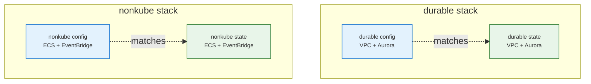
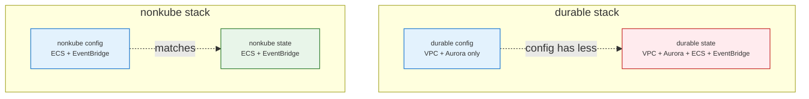
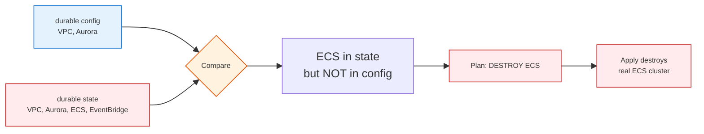
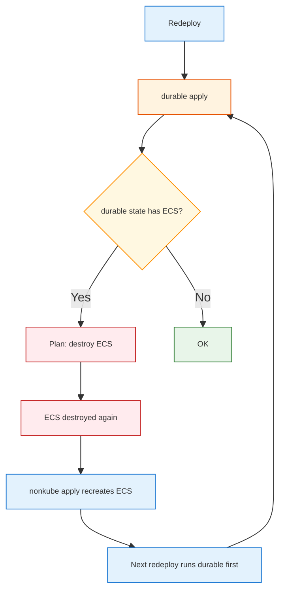

# Terraform Inconsistent State: Cross-Stack Pollution

What happens when one stack's state file contains resources that belong to another stack, and why a simple redeploy does not fix it.

**See also:** [TERRA_DYNAMODB_LOCK_TABLE.md](TERRA_DYNAMODB_LOCK_TABLE.md), [TERRA_STACK_OWNERSHIP_AND_SHARED_RESOURCES.md](TERRA_STACK_OWNERSHIP_AND_SHARED_RESOURCES.md), [restore_durable_state.py](../../tools/aws/standalone/restore_durable_state.py).

---

## 1. Correct Setup (Ideal)

Each stack has its own S3 state key. State and config are aligned.



---

## 2. Corrupted Setup (What Went Wrong)

Durable state was overwritten or merged with nonkube state (e.g. wrong `tofu init` directory, wrong backend key, or manual state copy). Durable state now contains resources that belong to nonkube.



---

## 3. What Happens on Durable Apply

Terraform compares **config** (what durable should manage) to **state** (what durable thinks it manages). Anything in state but not in config → Terraform plans to **destroy**.



---

## 4. Why Redeploy Does Not Fix It

A redeploy runs durable apply first. If durable state is still corrupted (still has ECS in it), the same logic applies: Terraform will destroy ECS again. The corruption perpetuates until durable state is fixed.



**Fix:** Remove the wrong resources from durable state (`tofu state rm module.ecs` in durable), or restore durable state from an S3 version that was clean, *before* redeploying.

---

## 5. Step-by-Step Fix (Resolved)

When durable state contains `module.ecs` (or other nonkube resources), follow these steps:

### 5.1. Ensure DynamoDB lock table exists in the correct region

The S3 backend uses a DynamoDB table for state locking. If the table is missing or in the wrong region, `tofu state rm` fails with `ResourceNotFoundException` **even with `-lock=false`** — the backend connects to DynamoDB during initialization, before the lock flag is applied. See [TERRA_DYNAMODB_LOCK_TABLE.md](TERRA_DYNAMODB_LOCK_TABLE.md) for details.

Run bootstrap (creates the table in the deploy region):

```bash
cd /path/to/fru-genai-analytics-new
PYTHONPATH=. CLOUD_REGION=us-east-2 FRU_ENV=dev AWS_PROFILE=admin python tools/aws/scope_shared/deploy/setup_state_backend.py
```

### 5.2. Remove the wrong resources from durable state

Run `tofu state rm` **from the durable stack directory** (Terraform needs the backend config from that dir):

```bash
cd infra_terraform/live_deploy/aws/scope_shared/durable
AWS_PROFILE=admin tofu init -upgrade -reconfigure \
  -backend-config bucket=fru-tf-state-dev-us-east-2-744139897900 \
  -backend-config key=fru/dev/us-east-2/aws-shared-durable.tfstate \
  -backend-config region=us-east-2 -backend-config encrypt=true \
  -backend-config dynamodb_table=fru-tf-locks-tbl-us-east-2
AWS_PROFILE=admin tofu state rm module.ecs
```

(If `tofu init` was already run in that directory, you can skip it and run only `tofu state rm module.ecs`.)

### 5.3. Redeploy via orchestrator

```bash
cd /path/to/fru-genai-analytics-new
python orchestrator.py deploy --provider aws --scope all --env dev --cloud-region us-east-2
```

The orchestrator runs bootstrap, durable apply (no longer tries to destroy ECS), then nonkube and kube.

---

## 6. Root Cause (How It Happens)

| Cause | What happened |
|-------|----------------|
| Wrong `tofu init` dir | Ran `tofu init` in nonkube dir but with durable backend key (or vice versa) |
| Wrong backend key | `-backend-config key=...` pointed at wrong state file |
| `init` → `apply` order | `tofu apply` in dir A, then `tofu init -reconfigure` in dir B with A's key, then `apply` in B overwrites A's state |
| Manual state copy | Copied nonkube state over durable state |

**Prevention:** Always use the deploy script (`tools/aws/deploy.py`) or `backend_config()` from `tools.aws.scope_shared.core.backend` so state keys stay consistent. Avoid manual `tofu init` with custom keys.

---

## 7. FAQ: Delete Both States and Redeploy?

**No.** Deleting both remote tfstate files and redeploying is not sufficient and not easier:

- **Durable:** VPC and Aurora already exist in AWS. Empty state → apply tries to CREATE → "already exists" errors. You must import many resources.
- **Nonkube:** ECS was destroyed; other resources (ALB, task defs, etc.) may still exist. Empty state → apply tries to CREATE → conflicts with existing resources.

**Simpler fix:** `tofu state rm module.ecs` from durable (if still present), then run nonkube apply to recreate ECS. Or restore durable state from a clean S3 version.
