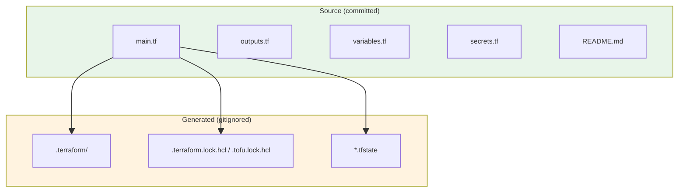
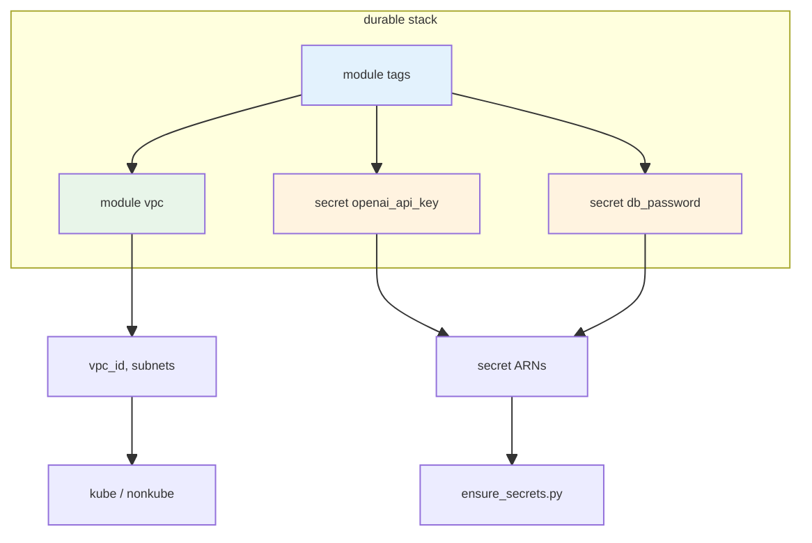

# OpenTofu / Terraform: infra_terraform/live_deploy/aws/scope_shared/durable

Comprehensive reference for the durable shared stack and its layout. Uses OpenTofu (alias `tofu`) or Terraform.

---

## 1. infra_terraform/live_deploy/aws layout

```text
infra_terraform/live_deploy/aws/
├── scope_shared/
│   ├── durable/          ← this stack (VPC, Secrets)
│   │   ├── main.tf
│   │   ├── outputs.tf
│   │   ├── README.md
│   │   ├── secrets.tf
│   │   └── variables.tf
│   └── nondurable/       ← buckets + ECR
├── kube/                 ← EKS app
└── nonkube/              ← ECS app
```

Deploy order: **durable → nondurable → (kube | nonkube)**. Teardown never destroys durable; use `tools/aws/destroy_durable.py` explicitly.

---

## 2. durable/ file structure



---

## 3. Source files

| File | Purpose | How it's used |
|------|---------|---------------|
| **main.tf** | Root config, backend, provider, VPC module, core outputs | Entry point. Defines S3 backend (empty block, filled by deploy scripts via `-backend-config`), AWS provider, tags module, VPC module. Outputs `vpc_id`, `public_subnet_ids`, `private_subnet_ids` consumed by kube/nonkube via remote state. |
| **outputs.tf** | Placeholder for extra outputs | Currently only a comment; main outputs live in `main.tf` for convenience. |
| **variables.tf** | Variable declarations | Defines `prefix`, `env`, `aws_region`, `vpc_cidr`, `azs`, `public_subnet_cidrs`, `private_subnet_cidrs`, `allow_destroy_durable`, `tf_state_*`. Values come from env (TF_VAR_*) and deploy scripts (`-var`). |
| **secrets.tf** | Secrets Manager containers | Creates empty secret placeholders for `openai_api_key` and `db_password`. Values are set by `tools/aws/ensure_secrets.py`; Terraform never stores secret values. |
| **README.md** | Human docs | Explains what durable provisions and how to deploy via orchestrator. |

---

## 4. Generated files (gitignored)

| File / Dir | Purpose | When / how created | In this project |
|------------|---------|--------------------|-----------------|
| **.terraform/** | Provider binaries, module cache | `tofu init`. Contains provider plugins and module downloads. | **Stale** when `TF_DATA_DIR` is set. Use `tofu_data/` instead; per-stack `.terraform/` dirs removed. |
| **.terraform.lock.hcl** | Provider version lock | `tofu init`. Pins provider versions for reproducible runs. | **Gitignored** (not committed). Created per stack; used when running from that stack. |
| **terraform.tfstate** | Local state (if used) | Normally state lives in S3; local state only if backend not configured. | State is remote (S3). |
| **tofu_data/** | Shared provider cache (repo root) | Set by `TF_DATA_DIR` so all stacks share one cache. | **Canonical** location. `init_terra_upgrade_reconfigure.sh` and `tools/aws/tofu/tofu_runner.py` set `TF_DATA_DIR=$REPO_ROOT/tofu_data`. |

State is stored remotely in S3; key format: `{prefix}/{env}/aws-shared-durable.tfstate`.

---

## 5. Resource dependency flow



---

## 6. How durable is invoked

| Caller | Action | Backend config |
|--------|--------|----------------|
| `tools/aws/deploy.py` | `tofu init -upgrade -reconfigure` + `tofu apply` | From `tools/aws/backend.py` via `-backend-config bucket=... -backend-config key=...` etc. |
| `tools/aws/ensure_secrets.py` | init + output read | Uses durable stack for secret ARNs |
| `tools/aws/destroy_durable.py` | `tofu destroy` | Same; requires `ALLOW_DURABLE_DESTROY=YES` and confirmation token |

**Required env vars** for init/apply (via `terra_var_handling.py` + `backend.py`): `TF_STATE_BUCKET` or `TF_STATE_BUCKET_COMPONENT`, `CLOUD_REGION`, `PROJ_PREFIX` (or `FRU_PREFIX`), `VPC_CIDR`; optionally `TF_STATE_PREFIX`, `TF_LOCK_TABLE`.

---

## 7. Module sources

```text
durable/main.tf
├── infra_terraform/modules/cloud_shared/primitives/tags
└── infra_terraform/modules/aws/primitives/vpc
```

VPC module creates: VPC, IGW, public/private subnets, route tables, NAT gateway. Uses `allow_destroy` (from `allow_destroy_durable`) to choose protected vs unprotected resources; durable passes `false` by default.

---

## 8. Quick reference

| Term | Meaning |
|------|---------|
| **durable** | Long-lived shared infra (VPC, Secrets). Never destroyed by normal teardown. |
| **nondurable** | Shared buckets + ECR. Destroyed by teardown. |
| **Backend config** | Injected by deploy scripts; `terraform init` run directly in `durable/` will prompt for S3 bucket unless you pass `-backend-config` or equivalent. |
| **ensure_secrets.py** | Populates secret values in AWS Secrets Manager; Terraform only creates the secret containers. |

---

*Related: [TERRA_LEARNED.md](TERRA_LEARNED.md), [VPC_AND_NETWORK.md](../cloud_shared/VPC_AND_NETWORK.md).*
