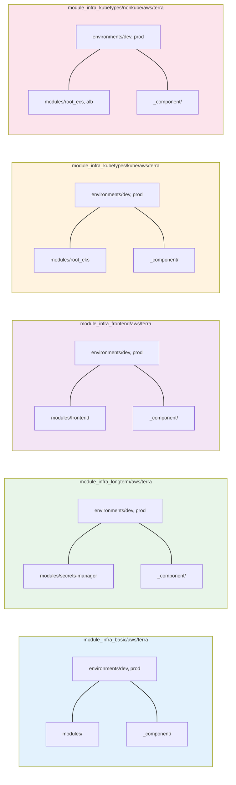
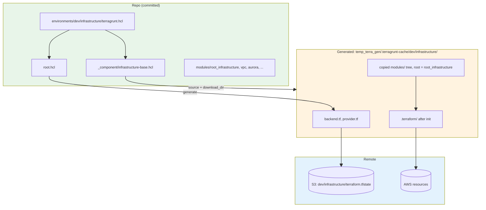
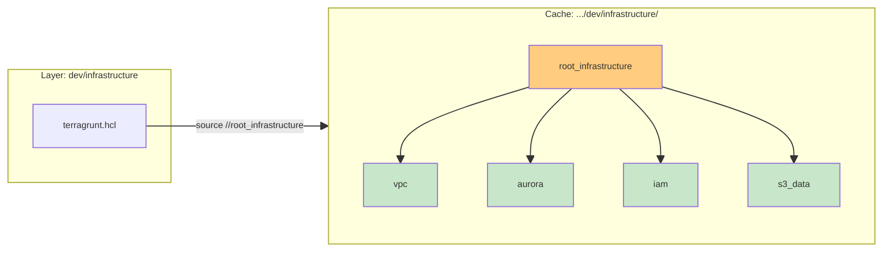

# Terra + Terragrunt: Total Map and Pipeline (Crash Course)

This doc is the **structural map** of how we use Terraform and Terragrunt in this project: where files live, what gets generated, and how that drives the cloud. For **layers**, **deploy order**, **Option B**, and **teardown**, see [TERRA_LEARNED.md](TERRA_LEARNED.md).

**Goals:** (1) One place for the full pipeline from repo layout → cache → Terraform → AWS. (2) Terraform-only vs Terragrunt usage. (3) The role of `//`, leaf vs root modules, and generated artifacts. Examples are from this repo.

**Guide to sections:** §0 = new project (OpenTofu, infra-modules + live-deploy); §1 = legacy Terragrunt mapping; §2–6 = Terraform/Terragrunt pipeline.

---

## 0. This Project: infra-modules + live-deploy (OpenTofu, Gruntwork-Style)

The **new** project uses OpenTofu (Terraform-compatible) without Terragrunt. It follows the **modules vs live** split from Gruntwork/Terragrunt best practice.

### 0.1 A (infra-modules) vs B (live-deploy-*)

| Layer | Path | Role | Contains |
|-------|------|------|----------|
| **A — Modules** | `infra-modules/aws/`, `infra-modules/gcp/`, `infra-modules/shared/` | Reusable building blocks | `resource` blocks, variable inputs, outputs |
| **B — Live** | `live-deploy-aws/`, `live-deploy-gcp/` | Environment-specific composition | **Only** `module` calls + `data` + `output`; no inline `resource` |

**Rule:** Live config = pure composition. If a deploy stack has `resource` blocks, extract them into a module.

### 0.2 Live stacks are thin

- `live-deploy-aws/shared/durable` — modules: tags, vpc; outputs only
- `live-deploy-aws/shared/nondurable` — modules: tags, s3_bucket, ecr; outputs only
- `live-deploy-aws/nonkube` — modules: tags, ecs, cloudfront; remote state data; outputs
- `live-deploy-aws/kube` — modules: tags, eks, cloudfront; remote state data; outputs
- `live-deploy-gcp/shared/durable` — module: vpc; outputs
- `live-deploy-gcp/shared/nondurable` — module: gcs_bucket; outputs
- `live-deploy-gcp/kube` — module: gke; outputs

### 0.3 Durability is a deployment concern, not a module concern

**Durable** vs **nondurable** lives in **B** (how we organize stacks and teardown), not in **A**. The same module (e.g. vpc, aurora) can be used in either context. "Durable" = don't destroy when we tear down; "nondurable" = safe to destroy.

### 0.4 Outputs flow

- **A (modules):** Each module exposes outputs (e.g. `vpc_id`, `subnet_ids`). Consumed by the root config that calls it.
- **B (live):** Stack-level outputs (e.g. `vpc_id`, `aurora_endpoint`) consumed by other stacks (via `terraform_remote_state`), scripts (`deploy.py`), or CI.

### 0.5 State keys

`tools/aws/_backend.py` maps stack dir → state key so S3 keys stay stable across renames:
- `live-deploy-aws/shared/durable` → `{prefix}/{env}/aws-shared-durable.tfstate`
- `live-deploy-gcp/shared/durable` → `{prefix}/{env}/gcp-shared-durable.tfstate`

Renaming `deploy-aws` → `live-deploy-aws` preserved state keys via explicit mapping.

### 0.6 S3 state + DynamoDB lock (how they work together)

Terraform/OpenTofu remote state uses two AWS resources:

| Resource | Purpose |
|----------|---------|
| **S3 bucket** (e.g. `fru-terraform-state-*`) | Stores the state JSON file per stack. Each state key (e.g. `fru/dev/us-east-1/aws-shared-durable.tfstate`) holds resources, outputs, lineage. |
| **DynamoDB table** (e.g. `fru-dev-lock`) | Lock table. Before `apply` or `destroy`, Terraform acquires a lock row for that state key; on completion it releases. Prevents concurrent runs from corrupting state. |

**Flow:** `tofu apply` → (1) acquire lock in DynamoDB for state key, (2) download state from S3, (3) plan/apply, (4) upload updated state to S3, (5) release lock. S3 = storage; DynamoDB = locking. Both are durable (never destroyed by teardown).

### 0.7 Schema and data are separate from IaC

Terraform provisions infrastructure. Schema (DDL) and data (ETL) run via **post-provision scripts** (e.g. `setup_database.py`). Industry practice: don't run DDL in Terraform.

---

## 1. Where Terra lives in this project (total mapping)

### 1.1 The five `terra` trees

We have five separate Terra/Terragrunt trees. Each has the same **layout pattern**: `environments/<env>/<layer>/` (Terragrunt config) and `modules/` (Terraform `.tf` source). After the refactor, core infra, long-term (Secrets Manager), and frontend (S3 + CloudFront) each have their own tree.

| Tree | Purpose | Example layers (dev) | Example modules |
|------|--------|----------------------|-----------------|
| **module_infra_basic/aws/terra/** | Core infra (VPC, Aurora, IAM, S3 data) | infrastructure | root_infrastructure, vpc, aurora, iam, s3-data |
| **module_infra_longterm/aws/terra/** | Long-term resources (Secrets Manager) | infrastructure-longterm | secrets-manager |
| **module_infra_frontend/aws/terra/** | Frontend (S3 + CloudFront) | frontend-eks, frontend-ecs | frontend |
| **module_infra_kubetypes/kube/aws/terra/** | EKS app | eks | root_eks |
| **module_infra_kubetypes/nonkube/aws/terra/** | ECS app | ecs | root_ecs, alb |

### 1.2 One layer = one directory under `environments/<env>/`

- **Path:** e.g. `module_infra_basic/aws/terra/environments/dev/infrastructure/` (or `module_infra_frontend/.../frontend-eks`, `module_infra_longterm/.../infrastructure-longterm`, etc.)
- **Contents:** `terragrunt.hcl` (required), often `.terraform.lock.hcl` (provider versions).
- **Meaning:** Running `terragrunt apply` (or `plan`/`destroy`) in that directory applies **one layer** and uses **one state file** (e.g. S3 key `dev/infrastructure/terraform.tfstate`). See [TERRA_LEARNED.md §1](TERRA_LEARNED.md#1-what-is-a-layer).

### 1.3 Shared building blocks: `root.hcl`, `env.hcl`, `_component/*.hcl`

- **root.hcl** (at `environments/root.hcl` in each tree): Defines remote state (S3), state key via `path_relative_to_include()`, and **generates** `backend.tf` and `provider.tf` in the working directory so Terraform talks to S3 and AWS.
- **env.hcl** (per env, e.g. `environments/dev/env.hcl`): Shared inputs for that environment (project_name, vpc_cidr, etc.).
- **_component/** (e.g. `_component/infrastructure-base.hcl`): Per-**layer type** template: sets `terraform { source = "..." }`, `download_dir`, and `inputs` for that layer. Each layer dir’s `terragrunt.hcl` **includes** root + the right component (e.g. `infrastructure-base.hcl` for the infrastructure layer).

Example: `environments/dev/infrastructure/terragrunt.hcl` includes root and `../../_component/infrastructure-base.hcl`. The component sets `source = ".../modules//root_infrastructure"` and passes inputs from `env.hcl`.

---

## 2. Terraform without Terragrunt (conceptual baseline)

### 2.1 Pure Terraform flow

1. You have a directory with `.tf` files (the “root module”).
2. You run `terraform init` → downloads providers, (if backend is remote) configures state.
3. You run `terraform plan` / `terraform apply` → Terraform builds a graph, talks to the provider (e.g. AWS), and creates/updates/deletes resources.
4. **State** (e.g. in S3) records what Terraform created so the next run can diff and update.

No notion of “layers”: one directory = one state. To get multiple states you’d run Terraform in different directories (or use workspaces), and you’d repeat backend/provider config and variable wiring yourself.

### 2.2 What Terragrunt adds (high level)

- **Layers:** One Terragrunt config per “layer” (e.g. `dev/infrastructure`). Each layer = one state, one apply/destroy.
- **Source:** Points Terraform at the right **module** (e.g. `modules//root_infrastructure`). Terragrunt **copies** that source into a cache and runs Terraform there.
- **Generated files:** Terragrunt generates `backend.tf`, `provider.tf` (and optionally more) in the cache so you don’t hand-write them per layer.
- **Inputs:** Pass variables from HCL (env, component, layer) into the module as Terraform variables.
- **Dependencies:** Optional `dependency` blocks so one layer can read another’s outputs (e.g. EKS layer depends on infrastructure for `vpc_id`, subnets).

So: **Terraform** does the actual cloud API calls; **Terragrunt** decides where to run it, what module to use, where state lives, and what inputs to pass.

---

## 3. Terraform with Terragrunt: the full pipeline

### 3.1 What you run

From the repo root (or via `orchestration/terraform/deploy.sh`):

- `cd` into a layer directory, e.g. `module_infra_basic/aws/terra/environments/dev/infrastructure`
- Run `terragrunt plan` or `terragrunt apply`

Terragrunt then (in order):

1. **Resolves includes** (root, component, env).
2. **Resolves `terraform { source }`** and **download_dir**.
3. **Copies** the module source into the cache (see §3.2).
4. **Generates** `backend.tf`, `provider.tf` in the cache (from root.hcl).
5. **Injects inputs** into the module (e.g. via `terraform.tfvars` or mechanism Terragrunt uses).
6. Runs **terraform init** (in the cache) → providers, backend.
7. Runs **terraform plan** / **apply** (in the cache) → Terraform talks to AWS and updates state.

### 3.2 Generated and cache layout

**Cache directory** (from `download_dir` in component, e.g. `infrastructure-base.hcl`):

- Path: `temp_terra_gen/.terragrunt-cache/<env>/<layer_name>/`
- Example: `temp_terra_gen/.terragrunt-cache/dev/infrastructure/`

**What Terragrunt puts there:**

1. **Copied module tree:** The path **before** `//` in `source` is copied here. The part **after** `//` is the Terraform **root** inside that copy (see §4). So you get e.g. a full `modules/` tree with `root_infrastructure/` as the working root.
2. **Generated files** (from root.hcl):
   - `backend.tf` — backend "s3" block (bucket, key, region, encrypt, use_lockfile).
   - `provider.tf` — terraform required_version, required_providers, provider "aws".
3. **Terraform’s own generated/state:**
   - `.terraform/` — providers, modules (after `terraform init`).
   - `.terraform.lock.hcl` — can live in the **layer dir** in the repo (e.g. `environments/dev/infrastructure/.terraform.lock.hcl`) and is used when running in the cache; lock file pins provider versions.
   - **State** is **remote** (S3); only the lock (e.g. `terraform.tfstate.lock.info`) may appear locally during runs.

**State key:** From root.hcl, `key = "${path_relative_to_include()}/terraform.tfstate"`. The include is root, so path is relative to the `environments/` folder → e.g. `dev/infrastructure/terraform.tfstate`.

### 3.3 How the cloud provider is configured “properly”

1. **backend.tf** (generated) → Terraform stores state in S3; no local state file.
2. **provider.tf** (generated) → Terraform uses the AWS provider (region, etc.); credentials come from the environment (e.g. `AWS_PROFILE`, `AWS_ACCESS_KEY_ID`).
3. **Module code** (`.tf` in the copied tree) → Declares resources (vpc, subnets, EKS cluster, etc.). Terraform turns these into **API calls** to AWS (CreateVpc, CreateSubnet, CreateCluster, …).
4. **Inputs** (from Terragrunt) → Feed into variables (e.g. `vpc_cidr`, `environment`) so the same module can be reused for dev/prod or different layers.
5. **State** → After apply, state holds resource IDs and attributes; the next plan/apply diffs state vs config and only changes what’s needed.

So: **HCL + .tf** describe desired state; **Terragrunt** wires layer → module and backend/provider; **Terraform** executes against the provider and keeps state in S3.

---

## 4. The `//` and leaf vs root (composition) modules

### 4.1 Why `source = ".../modules//root_infrastructure"` uses `//`

- **Without `//`:** Terragrunt would copy only the subdir after the path (e.g. `root_infrastructure/`). The Terraform root would have no siblings, so `source = "../vpc"` in `root_infrastructure/main.tf` would break.
- **With `//`:** Terragrunt copies **everything before** `//` (the whole `modules/` directory), then uses the part **after** `//` as the **Terraform root** inside that copy. So the cache contains e.g. `root_infrastructure/`, `vpc/`, `aurora/`, … and from `root_infrastructure/main.tf` the paths `../vpc`, `../aurora` resolve to siblings. See [TERRA_LEARNED.md §6.3](TERRA_LEARNED.md#63-why-the-infrastructure-layer-can-use-vpc-aurora-etc).

### 4.2 Leaf vs root (composition) modules

| Type | Role | In this project |
|------|------|------------------|
| **Leaf** | One main AWS concern (one “thing”). Reusable from other modules. | vpc, iam, aurora, s3-data, alb, frontend, secrets-manager |
| **Root / composition** | Entry point for a **layer**. Composes multiple resources and often calls leaf modules. One Terragrunt layer runs Terraform with this dir as root. | root_infrastructure, root_eks, root_ecs |

Example: The **infrastructure** layer uses `source = ".../modules//root_infrastructure"`. So Terraform’s root is `root_infrastructure/`. That module’s `main.tf` calls `module "vpc" { source = "../vpc" }`, `module "aurora" { source = "../aurora" }`, etc. So one **layer** (one apply) uses one **root** module that composes several **leaf** modules.

### 4.3 One-line summary

- **Layer** = one directory under `environments/<env>/` + one state key + one `terragrunt apply`.
- **Root module** = the subdir after `//` (e.g. `root_infrastructure`); Terragrunt copies the whole `modules/` tree so that root can reference sibling leaf modules via `../vpc`, etc.
- **Generated** = cache dir (copied module tree), `backend.tf`, `provider.tf`, and after init `.terraform/` and lock; state lives in S3.

---

## 5. End-to-end flow (one layer, one apply)

Numbered flow for one layer (e.g. **dev/infrastructure**):

1. You run `terragrunt apply` in `module_infra_basic/aws/terra/environments/dev/infrastructure/` (or the appropriate layer dir in another tree).
2. Terragrunt loads `terragrunt.hcl` → includes `root.hcl` and `_component/infrastructure-base.hcl`.
3. From component: `source = ".../modules//root_infrastructure"`, `download_dir = ".../temp_terra_gen/.terragrunt-cache/dev/infrastructure"`.
4. Terragrunt copies the full `modules/` dir into that cache; Terraform root = `root_infrastructure/`.
5. Terragrunt generates `backend.tf` and `provider.tf` in the cache (from root.hcl).
6. Terragrunt runs `terraform init` in the cache → backend S3, providers (e.g. hashicorp/aws), and `.terraform.lock.hcl` used if present.
7. Terragrunt passes **inputs** (from env.hcl + component) into the module.
8. Terragrunt runs `terraform plan` then `terraform apply` in the cache → Terraform updates state in S3 and creates/updates AWS resources (VPC, subnets, Aurora, IAM, etc.).
9. State key in S3: `dev/infrastructure/terraform.tfstate` (from `path_relative_to_include()` in root.hcl).

No step in this flow **edits** the committed repo; only the cache and remote state (and AWS) change.

---

## 6. Quick reference (this doc)

| Item | Meaning |
|------|--------|
| **Layer** | One dir under `environments/<env>/`, one state file, one `terragrunt apply`/`destroy`. See [TERRA_LEARNED.md](TERRA_LEARNED.md). |
| **Root module** | The dir after `//` in `source` (e.g. `root_infrastructure`). Terraform runs with this as the root. |
| **Leaf module** | A single-concern module (vpc, aurora, …) called by a root or another module via `source = "../vpc"` etc. |
| **Cache** | `temp_terra_gen/.terragrunt-cache/<env>/<layer>/` — copied module tree + generated backend.tf, provider.tf, .terraform/ after init. |
| **State key** | From root.hcl: `path_relative_to_include()/terraform.tfstate` (e.g. `dev/infrastructure/terraform.tfstate`). |
| **Generated files** | backend.tf, provider.tf (from root.hcl); lock file can live in layer dir or cache; state in S3. |
| **Import/reconcile scripts** | Per-layer `import-existing-*.sh` helpers that reconcile Terraform state with AWS before **apply** and **destroy** (including lock handling and “already managed / non-existent” cases). See [TERRA_LEARN_IMPORT_PREEXIST.md](TERRA_LEARN_IMPORT_PREEXIST.md). |

---

*This doc: `docs/learned/terra/TERRA_LEARNED_TOTAL.md`. For layers, deploy order, Option B, and teardown: [TERRA_LEARNED.md](TERRA_LEARNED.md).*
