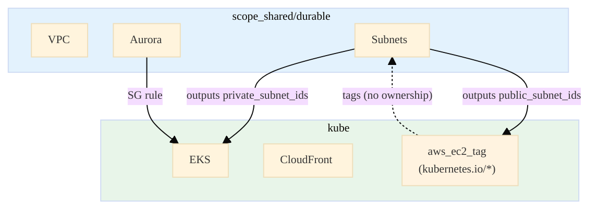

# Terraform Stack Ownership and Shared Resources

A guide to **who owns what** across our Terraform stacks, how stacks **share** AWS resources, and how to avoid **tag drift** and other conflicts. Essential reading after [War Story 58: VPC Subnet Tag Drift](../../war_stories/WAR_STORIES_AWS.md#35-vpc-subnet-tag-drift-durable-vs-kube-and-lifecycle-ignore_changes).

**See also:** [FULL_ARCH_KUBE_LEARN.md](../FULL_ARCH_KUBE_LEARN.md), [VPC_LEARNED.md](../VPC_LEARNED.md), [TERRA_LEARNED_TOTAL.md](TERRA_LEARNED_TOTAL.md).

---

## 1. Stack Ownership Model

Each Terraform stack has its own **state file**. A resource is "owned" by the stack whose state contains it. Only that stack can create, update, or destroy it.

| Stack | Owns | State Key |
|-------|------|-----------|
| **scope_shared/durable** | VPC, subnets, NAT, IGW, Aurora, Secrets Manager secrets | `aws-shared-durable.tfstate` |
| **scope_shared/nondurable** | ECR repos, S3 buckets (delta, artifacts) | `aws-shared-nondurable.tfstate` |
| **kube** | EKS cluster, CloudFront dist, frontend S3, **aws_ec2_tag** (subnet tags), Aurora SG rule | `aws-kube.tfstate` |
| **nonkube** | ECS cluster, ALB, CloudFront dist, frontend S3, EventBridge | `aws-nonkube.tfstate` |

**Key insight:** Durable **creates** VPC and subnets. Kube **uses** them (EKS nodes in private subnets) and **adds tags** to public subnets via `aws_ec2_tag`. Kube does **not** own the subnets—durable does. Kube only manages the tags as separate resources.

---

## 2. How Stacks Share Resources

### 2.1 Data Flow: Remote State

Stacks read each other's outputs via `terraform_remote_state` (or `data.terraform_remote_state`):

```hcl
# kube/main.tf
data "terraform_remote_state" "shared_durable" {
  backend = "s3"
  config = { ... }
}

# Kube uses durable's outputs
module "eks" {
  subnet_ids = data.terraform_remote_state.shared_durable.outputs.private_subnet_ids
}

resource "aws_ec2_tag" "public_subnet_elb" {
  for_each    = toset(data.terraform_remote_state.shared_durable.outputs.public_subnet_ids)
  resource_id = each.value  # Subnet ID from durable
  key         = "kubernetes.io/role/elb"
  value       = "1"
}
```

| Consumer | Reads From | Outputs Used |
|----------|------------|--------------|
| **kube** | shared_durable | `public_subnet_ids`, `private_subnet_ids`, `aurora_security_group_id` |
| **kube** | shared_nondurable | `ecr_app_url`, `ecr_spark_url`, `delta_bucket` |
| **nonkube** | shared_durable | `private_subnet_ids`, `aurora_*` |
| **nonkube** | shared_nondurable | `ecr_*`, `delta_bucket` |

### 2.2 Two Ways to "Touch" a Resource

| Pattern | Who | How | Example |
|---------|-----|-----|---------|
| **Own** | One stack | `resource "aws_subnet"` in that stack's state | Durable owns subnets |
| **Add to** | Another stack | `resource "aws_ec2_tag"` with `resource_id = <id from other stack>` | Kube adds tags to durable's subnets |

`aws_ec2_tag` is a **separate resource** that attaches a tag to an existing AWS resource by ID. It does **not** require owning the subnet. The tag lives in kube's state; the subnet lives in durable's state.

---

## 3. The Tag Drift Problem (War Story 58)

### 3.1 What Happened

1. **Durable** creates subnets with `tags = merge(var.tags, { Name = ... })` → desired state = tags X.
2. **Kube** adds `kubernetes.io/role/elb` and `kubernetes.io/cluster/<name>` via `aws_ec2_tag` → actual AWS = tags X + Y.
3. **Durable's next apply:** Terraform compares desired (X) to actual (X + Y). It sees "extra" tags Y in AWS. Terraform plans to **remove** Y to match desired state.
4. **Durable apply** removes Y.
5. **Kube's next apply:** Its `aws_ec2_tag` resources see tags are missing. It **re-adds** Y.
6. **Repeat** → endless drift cycle.

### 3.2 Why Terraform Does This

Terraform enforces **desired state**. For `aws_subnet`, desired state is whatever is in the `tags` attribute. If AWS has more tags than desired, Terraform plans a **update** to remove the extras. It doesn't know that another stack (kube) intentionally added them.

### 3.3 Resolution: lifecycle ignore_changes

Add to the **owning** resource (durable's `aws_subnet`):

```hcl
resource "aws_subnet" "public_protected" {
  # ...
  tags = merge(var.tags, { Name = "..." })

  lifecycle { ignore_changes = [tags] }
}
```

**Effect:** Durable sets tags on **create**. On subsequent applies, Terraform **ignores** any difference between desired tags and actual tags. So durable won't remove kube's tags.

**Trade-off:** Durable cannot change its own tags later via Terraform. If you need to update durable's tags, you must do it outside Terraform (e.g. AWS console) or remove `ignore_changes` temporarily.

---

## 4. aws_ec2_tag: Adding Tags to Resources You Don't Own

### 4.1 What It Is

`aws_ec2_tag` is an AWS provider resource that **adds or updates a single tag** on an EC2-related resource (VPC, subnet, ENI, etc.) by ID. It does not require owning the resource.

```hcl
resource "aws_ec2_tag" "public_subnet_elb" {
  for_each    = toset(data.terraform_remote_state.shared_durable.outputs.public_subnet_ids)
  resource_id = each.value
  key         = "kubernetes.io/role/elb"
  value       = "1"
}
```

### 4.2 Why Kube Uses It

Load balancer placement (Classic via in-tree, or NLB via AWS Load Balancer Controller when `aws-load-balancer-type` is set) uses **subnet tags**:

| Tag | Value | Purpose |
|-----|-------|---------|
| `kubernetes.io/role/elb` | `1` | Subnet is eligible for **internet-facing** load balancers. Without it, the LB is placed in private subnets → internal LB → CloudFront (on the internet) cannot reach it → **502**. |
| `kubernetes.io/cluster/<cluster_name>` | `shared` | Subnets belong to this EKS cluster. Controller uses this to know which subnets it can use. |

Durable's VPC module doesn't know about EKS or load balancers. So kube adds these tags after durable creates the subnets.

### 4.3 When to Use aws_ec2_tag vs Inline Tags

| Approach | Use When |
|----------|----------|
| **Inline tags** (in `aws_subnet` etc.) | You own the resource and want full control. All tags in one place. |
| **aws_ec2_tag** | You need to tag a resource **owned by another stack**. The owning stack must use `lifecycle { ignore_changes = [tags] }` or you get drift. |

---

## 5. lifecycle ignore_changes: When and Why

### 5.1 Syntax

```hcl
resource "aws_subnet" "example" {
  # ...
  lifecycle {
    ignore_changes = [tags]   # Ignore tag drift
    # or
    ignore_changes = [tags, cidr_block]  # Ignore multiple attrs
  }
}
```

### 5.2 When to Use

| Scenario | Use ignore_changes? |
|----------|---------------------|
| Another stack adds tags via `aws_ec2_tag` | **Yes** — on the owning resource's `tags` |
| AWS or a process adds attributes outside Terraform | **Yes** — on those attributes |
| You want Terraform to manage the attribute | **No** |

### 5.3 Our Usage

All four subnet resources in `infra_terraform/modules/aws/primitives/vpc/main.tf` have `lifecycle { ignore_changes = [tags] }` because kube adds `kubernetes.io/*` tags to public subnets. See [DEPLOYMENT_OPTIMIZATION_LEARNED.md](../DEPLOYMENT_OPTIMIZATION_LEARNED.md) §2.1.

---

## 6. Quick Reference: Stack → Resource Ownership



| Resource | Owner | Others That Touch It |
|----------|-------|----------------------|
| VPC, subnets | durable | kube adds tags via aws_ec2_tag |
| Aurora | durable | kube adds SG rule (aurora_from_eks) |
| EKS | kube | — |
| CloudFront | kube | — |

---

## 7. Related War Stories

| # | Topic |
|---|-------|
| 43 | CloudFront 502 when NLB in wrong subnets (missing `kubernetes.io/role/elb`) |
| 58 | VPC subnet tag drift: durable vs kube, lifecycle ignore_changes |

---

*Doc: `docs/learned/terra/TERRA_STACK_OWNERSHIP_AND_SHARED_RESOURCES.md`. Related: [FULL_ARCH_KUBE_LEARN.md](../FULL_ARCH_KUBE_LEARN.md), [VPC_LEARNED.md](../VPC_LEARNED.md), [WAR_STORIES_AWS.md](../../war_stories/WAR_STORIES_AWS.md).*
