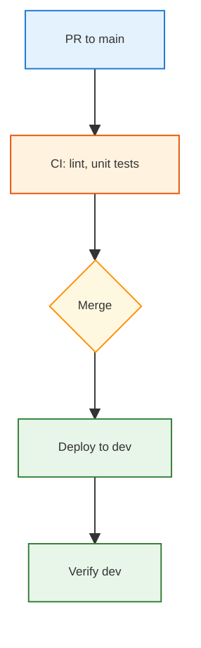

## Mermaid diagram style (reference)

Use this style for Mermaid diagrams in this repo so they stay consistent, colorful, and easy to read (especially in Cursor preview).

### Layout

- Prefer **simple flows**:
  - `graph TD` for top-down flows (e.g. release steps).
  - `graph LR` for left-to-right flows (e.g. data paths).
- Keep diagrams focused:
  - 5–11 nodes per diagram is ideal.
  - Use multiple diagrams instead of one huge one when needed.
- For long labels, use `\n` to break lines inside a node (e.g. `Deploy\nto staging`).

### Colors and shapes

- Reuse the following color logic (as in `TODO_CICD_ORCHESTRATOR_ENV.md`):
  - **Blue (`#e3f2fd` + `#1976d2`):** Sources / triggers (PRs, branches, orchestrator).
  - **Orange/amber (`#fff3e0` / `#fff8e1` + `#e65100` / `#ff8f00`):** CI / decision points.
  - **Green (`#e8f5e9` + `#2e7d32`):** Successful deploy steps & verification.
  - **Purple (`#ede7f6` + `#5e35b1`):** Staging / intermediate envs.
  - **Red/pink (`#ffebee` + `#c62828`):** Prod / approval / risk steps.
- Use consistent node shapes:
  - Rectangles for actions (deploy, verify, run tests).
  - Diamonds (`{Merge}`) for decisions.

### Font and sizing

- Use **`font-size:9px`** for all diagram styles (balances readability with density):
  - Example: `style A fill:#e3f2fd,stroke:#1976d2,stroke-width:1px,font-size:9px`
- Keep `stroke-width:1px` to match existing diagrams.

### Style snippets

Common patterns you can copy:

### Reference examples

- **Release flow:** see § 3.4.4 in `docs/TODO_CICD_ORCHESTRATOR_ENV.md`.
- **Branch vs environment mapping:** see § 3.4.5 in the same file.

