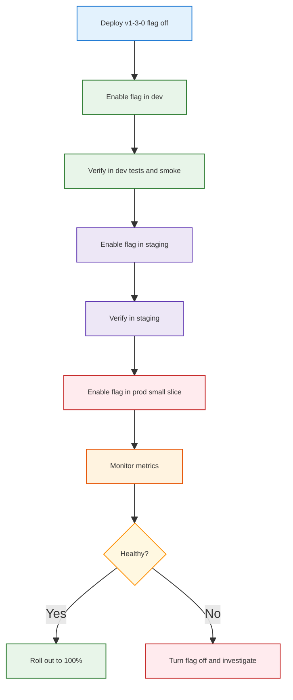

## CI/CD: learned patterns for this repo

This note **summarizes** CI/CD learnings from:
- `docs/TODO_UNIT_TEST_CICD.md` (what to test and where tests run),
- `docs/TODO_CICD_ORCHESTRATOR_ENV.md` (orchestrator, env/region, branches, Terraform/Tofu/Terragrunt),
- and prior exploration of CI/CD + feature flags (e.g. [TBD CI/CD Feature Flags](https://chatgpt.com/s/t_69afbcbd0a5081919108f8a021c9e13f)).

The goal is to keep those docs focused, and use this file as the **high-level CI/CD “map”** you can skim quickly.

---

## 1. Environments, branches, and deploy flow

### 1.1. Big picture

- **Source of truth:** `main` (trunk-based).
- **Environments:** `dev`, `staging`, `prod` (see §3.4 in `TODO_CICD_ORCHESTRATOR_ENV.md`).
- **Deploy model (recommended):**
  - Merge to `main` → auto deploy to **dev**.
  - Create `staging/v*` tag → deploy to **staging**.
  - Create `v*` release tag (with approval) → deploy to **prod**.

> **Branch vs tag (quick definitions)**  
> - **Branch**: a moving pointer to a line of development (e.g. `main`, feature branches). Commits keep advancing the branch tip.  
> - **Tag**: a named pointer to a specific commit (e.g. `v1.3.0`), usually immutable. Ideal for releases and repeatable deploys.

### 1.2. Branch ↔ environment mapping (summary)

<table>
<tr style="background:#1565c0;color:white">
<th>Strategy</th>
<th>Source <span style="background:#e3f2fd;color:#000;padding:1px 3px">branch</span> / <span style="background:#ede7f6;color:#000;padding:1px 3px">tag</span><br><small>where code is referenced</small></th>
<th>Target env<br><small>where it runs</small></th>
<th>Why we prefer it</th>
</tr>
<tr>
<td style="background:#e8f5e9"><strong>① Trunk-based</strong><br><span style="background:#2e7d32;color:white;padding:1px 4px;font-size:0.85em">recommended</span></td>
<td style="background:#e8f5e9">• <span style="background:#e3f2fd;padding:1px 3px">branch</span> <code>main</code> for all merges<br>• <span style="background:#ede7f6;padding:1px 3px">tag</span> <code>staging/v*</code><br>• <span style="background:#ede7f6;padding:1px 3px">tag</span> <code>v*</code> releases</td>
<td style="background:#e8f5e9">• <span style="background:#fff3e0;padding:1px 3px">env</span> dev from <code>main</code> (auto)<br>• <span style="background:#fff3e0;padding:1px 3px">env</span> staging from <code>staging/v*</code><br>• <span style="background:#fff3e0;padding:1px 3px">env</span> prod from <code>v*</code> (manual + approval)</td>
<td style="background:#e8f5e9"><span style="background:#c8e6c9;padding:2px 4px">✓</span> Simple mental model<br><span style="background:#c8e6c9;padding:2px 4px">✓</span> Easy to automate</td>
</tr>
<tr>
<td style="background:#fff3e0"><strong>② GitFlow</strong></td>
<td style="background:#fff3e0">• <span style="background:#e3f2fd;padding:1px 3px">branch</span> <code>main</code>, <code>develop</code>, <code>feature/*</code></td>
<td style="background:#fff3e0">• <span style="background:#fff3e0;padding:1px 3px">env</span> staging from <code>develop</code><br>• <span style="background:#fff3e0;padding:1px 3px">env</span> prod from <code>main</code></td>
<td style="background:#fff3e0"><span style="background:#ffcdd2;padding:2px 4px">⚠</span> Heavier workflow; more merges</td>
</tr>
<tr>
<td style="background:#ffebee"><strong>③ Env branches</strong></td>
<td style="background:#ffebee">• <span style="background:#e3f2fd;padding:1px 3px">branch</span> <code>dev</code>, <code>staging</code>, <code>prod</code></td>
<td style="background:#ffebee">• Push to branch → deploy to same-named <span style="background:#fff3e0;padding:1px 3px">env</span></td>
<td style="background:#ffebee"><span style="background:#ffcdd2;padding:2px 4px">⚠</span> Easy to drift; harder to keep in sync</td>
</tr>
</table>

For the detailed branch table and diagrams, see **§3.4.1–3.4.5 in `TODO_CICD_ORCHESTRATOR_ENV.md`**.

---

## 2. Tests across the pipeline (unit + integration)

### 2.1. Summary matrix

This compresses §2–3 of `TODO_UNIT_TEST_CICD.md` into one view.

<table>
<tr style="background:#1565c0;color:white">
<th>Stage</th>
<th>Key tests</th>
<th>Primary goal</th>
</tr>
<tr>
<td style="background:#e3f2fd"><strong>① PR</strong><br><small>feature → main</small></td>
<td style="background:#e8f5e9">• Lint / format<br>• Unit tests for API, agents, verify tools<br>• Coverage with thresholds for <code>core_app/backend</code> and verify modules</td>
<td style="background:#e8f5e9"><span style="background:#c8e6c9;padding:2px 4px">✓</span> Keep <code>main</code> healthy<br><span style="background:#c8e6c9;padding:2px 4px">✓</span> Catch regressions early</td>
</tr>
<tr>
<td style="background:#e3f2fd"><strong>② Dev env</strong><br><small>after merge</small></td>
<td style="background:#fff3e0">• All unit tests<br>• Fast integration/API tests<br>• <code>verify_api_endpoints.py</code>, <code>verify_sse.py</code> vs dev</td>
<td style="background:#fff3e0"><span style="background:#c8e6c9;padding:2px 4px">✓</span> Ensure deployable trunk<br>• Surface env-specific issues (auth, config)</td>
</tr>
<tr>
<td style="background:#e3f2fd"><strong>③ Staging</strong></td>
<td style="background:#e8f5e9">• Smoke subset of unit tests (optional)<br>• Full verify suite vs staging URLs<br>• Any critical e2e checks</td>
<td style="background:#e8f5e9"><span style="background:#c8e6c9;padding:2px 4px">✓</span> Pre-prod confidence</td>
</tr>
<tr>
<td style="background:#e3f2fd"><strong>④ Prod</strong></td>
<td style="background:#e8f5e9">• Post-deploy smoke tests<br>• Verify key analytics endpoints and SSE</td>
<td style="background:#e8f5e9"><span style="background:#c8e6c9;padding:2px 4px">✓</span> Guardrails for bad releases<br><span style="background:#ffcdd2;padding:2px 4px">⚠</span> Keep fast to avoid slowing incidents</td>
</tr>
</table>

For the **detailed test planning** (what to test in each module), continue to use `docs/TODO_UNIT_TEST_CICD.md`.

---

## 3. Tags and releases in git

### 3.1. Why tags?

Tags decouple **“what code is deployed”** from **“what branch we’re on”**:

- A **branch** (e.g. `main`) keeps moving as you merge new PRs; the tip changes.
- A **tag** (e.g. `v1.3.0`) is a **named snapshot** of a specific commit:
  - You can always say “prod is on `v1.3.0`” even if `main` has advanced to `v1.4.0-dev`.
  - You can re-deploy `v1.3.0` later without reopening old branches.
- CI workflows can trigger on tags like `staging/v1.3.0` and `v1.3.0` to route the **same commit** to different environments (staging first, prod later).
- Tags integrate well with feature flags (see §4):
  - Deploy new code behind flags using a tag.
  - Gradually enable flags without changing the image or tag.

### 3.2. Recommended tagging scheme

<table>
<tr style="background:#1565c0;color:white">
<th>Tag kind</th>
<th>Pattern</th>
<th>Used for</th>
</tr>
<tr>
<td style="background:#e3f2fd"><strong>① Staging candidate</strong></td>
<td style="background:#e8f5e9"><code>staging/vMAJOR.MINOR.PATCH</code><br><small>e.g. <code>staging/v1.3.0</code></small></td>
<td style="background:#e8f5e9">• Deploy this commit to staging<br>• Run full verify suite before prod</td>
</tr>
<tr>
<td style="background:#e3f2fd"><strong>② Prod release</strong></td>
<td style="background:#fff3e0"><code>vMAJOR.MINOR.PATCH</code><br><small>e.g. <code>v1.3.0</code></small></td>
<td style="background:#fff3e0">• Deploy to prod (requires approval)<br>• Serves as audit point for rollbacks</td>
</tr>
<tr>
<td style="background:#e3f2fd"><strong>③ Hotfix</strong></td>
<td style="background:#ffebee"><code>vMAJOR.MINOR.PATCH-hotfixN</code><br><small>e.g. <code>v1.3.1-hotfix1</code></small></td>
<td style="background:#ffebee">• Emergency patch based on existing release<br>• CI can treat as prod deploy with extra guardrails</td>
</tr>
</table>

### 3.3. How to create and push tags (git)

A typical flow from **feature branch → PR → staging → prod** looks like this:

```bash
# 1) Start a feature branch from main
git checkout main
git pull origin main
git checkout -b feature/add-report-filters

# ...make code changes...
git status
git add path/to/changed/files
git commit -m "Add report filters to analytics API"

# 2) Push branch and open PR to main
git push -u origin feature/add-report-filters
# (Open PR in GitHub: base=main, compare=feature/add-report-filters)

# 3) After PR is reviewed and merged into main:
git checkout main
git pull origin main   # now on the merged commit we want to release

# 4) Create a staging tag for this commit
git tag -a staging/v1.3.0 -m "Promote main to staging v1.3.0"
git push origin staging/v1.3.0

# 5) After staging verification looks good, create the prod tag
git tag -a v1.3.0 -m "Release v1.3.0 to prod"
git push origin v1.3.0
```

With CI wired as in this doc and `TODO_ORCHESTRATOR_ENV.md`:
- **Tag `staging/v1.3.0`** triggers a **staging deploy** job.
- **Tag `v1.3.0`** triggers a **prod deploy** job (typically with manual approval in GitHub Environments).

This keeps the story clean:
- Developers work on **feature branches** and merge to `main`.
- **Tags** on `main` decide when that merged commit is promoted to **staging** and then to **prod**.

### 3.3.1. Example timeline with two developers

<table>
<tr style="background:#1565c0;color:white">
<th>Time</th>
<th>🟢 Dev A actions</th>
<th>🟣 Dev B actions</th>
</tr>
<tr>
<td style="background:#e3f2fd"><strong>① Morning</strong></td>
<td style="background:#e8f5e9">
📝 Branch from <span style="background:#e3f2fd;color:#000;padding:1px 3px">branch</span> <code>main</code> → <code>feature/add-report-filters</code><br>
💾 Commit locally
</td>
<td style="background:#f3e5f5">
📝 Branch from <span style="background:#e3f2fd;color:#000;padding:1px 3px">branch</span> <code>main</code> → <code>feature/fix-sse-timeouts</code><br>
💾 Commit locally
</td>
</tr>
<tr>
<td style="background:#e3f2fd"><strong>② Midday</strong></td>
<td style="background:#fff3e0">
📤 Push branch; open PR A → <code>main</code><br>
🤖 CI runs on PR A<br>
✅ PR A merges → <span style="background:#e3f2fd;color:#000;padding:1px 3px">branch</span> <code>main</code> has A
</td>
<td style="background:#f3e5f5"></td>
</tr>
<tr>
<td style="background:#e3f2fd"><strong>③ Afternoon</strong></td>
<td style="background:#e8f5e9">
🏷️ From merged <code>main</code>, Dev A (or release owner) runs <code>git tag</code> + <code>git push</code> for <span style="background:#ede7f6;color:#000;padding:1px 3px">tag</span> <code>staging/v1.3.0</code><br>
🚀 CI deploys A to **staging**
</td>
<td style="background:#f3e5f5"></td>
</tr>
<tr>
<td style="background:#e3f2fd"><strong>④ Later</strong></td>
<td style="background:#fff3e0"></td>
<td style="background:#f3e5f5">
📤 Push branch; open PR B → <code>main</code><br>
🤖 CI runs on PR B; ✅ B merges → <code>main</code> has A + B<br>
🏷️ Dev B (or release owner) tags <span style="background:#ede7f6;color:#000;padding:1px 3px">staging/v1.3.1</span> from new <code>main</code> and pushes it<br>
🚀 CI deploys A + B to **staging**
</td>
</tr>
<tr>
<td style="background:#e3f2fd"><strong>⑤ Release</strong></td>
<td style="background:#e8f5e9"></td>
<td style="background:#f3e5f5">
🏷️ Release owner runs <code>git tag</code> + <code>git push</code> for <span style="background:#ede7f6;color:#000;padding:1px 3px">v1.3.1</span><br>
🚀 CI deploys <code>v1.3.1</code> to **prod** (A + B), with approval<br>
🔁 If prod breaks, re-deploy <code>v1.3.0</code> without changing branches
</td>
</tr>
</table>

This example shows:
- Feature branches are where devs work and get PR-level CI.
- **Only merged commits on `main` get tagged** and promoted.
- You can choose which merged snapshot (`staging/v1.3.0`, `staging/v1.3.1`, etc.) to release to prod via `v*` tags.

---

## 4. Feature flags in CI/CD

Drawing on the ideas from [TBD CI/CD Feature Flags](https://chatgpt.com/s/t_69afbcbd0a5081919108f8a021c9e13f) and adapting them to this repo.

### 4.1. Why feature flags?

<table>
<tr style="background:#1565c0;color:white">
<th>Goal</th>
<th>How feature flags help</th>
</tr>
<tr>
<td style="background:#e3f2fd"><strong>① Decouple deploy from release</strong></td>
<td style="background:#e8f5e9">• Deploy code dark (flag off) to dev/staging/prod<br>• Turn flag on gradually, without redeploying containers<br>• Roll back by flipping flag off instead of rolling back images</td>
</tr>
<tr>
<td style="background:#e3f2fd"><strong>② Safer experiments</strong></td>
<td style="background:#fff3e0">• Route a % of traffic through new analytics flow<br>• Compare metrics (latency, error rate) with old path<br>• Kill switch for problematic experiments</td>
</tr>
<tr>
<td style="background:#e3f2fd"><strong>③ Env-specific behavior</strong></td>
<td style="background:#e8f5e9">• Enable new LLM/provider only in dev/staging first<br>• Keep prod on conservative settings until ready<br>• Use flags to gate heavy batch jobs or schedulers</td>
</tr>
</table>

### 4.2. Where flags fit in this repo

- **Backend:** flags checked in `core_app/backend` (e.g. when deciding which agent or query path to use).
- **Config:** values provided via env vars from Terraform/Tofu:
  - e.g. `ENABLE_NEW_ANALYTICS_FLOW`, `ENABLE_BETA_SSE`, etc.
- **CI/CD:**
  - Flags default to **off** in new code.
  - Dev/staging workflows set them on via env or config maps.
  - Prod `v*` release starts with them off; separate “enable feature” workflow can flip them on gradually.

### 4.3. Simple feature-flag rollout diagram



Flags are a **behavioral layer on top of the env / tag model** described earlier: tags decide *what* code is running; flags decide *which paths* are active at runtime.

---

## 5. How this doc relates to the others

- **`TODO_UNIT_TEST_CICD.md`**
  - Deep dive on **what** to test and where to start in this repo.
  - Detailed tables for unit vs integration tests and CI mapping.
- **`TODO_CICD_ORCHESTRATOR_ENV.md`**
  - Deep dive on orchestrator, env/region, `.env` strategy, Terraform/Tofu/Terragrunt.
  - Detailed branch + environment tables, release diagrams, and GitHub Actions examples.
- **`TODO_LEARNED_CICD.md` (this file)**
  - Cross-cutting **summary** of CI/CD behavior:
    - Branch/env mapping
    - Test stages
    - Tags and releases
    - Feature flags
  - Use this as the “start here” page; follow links to the other docs when you need details.

