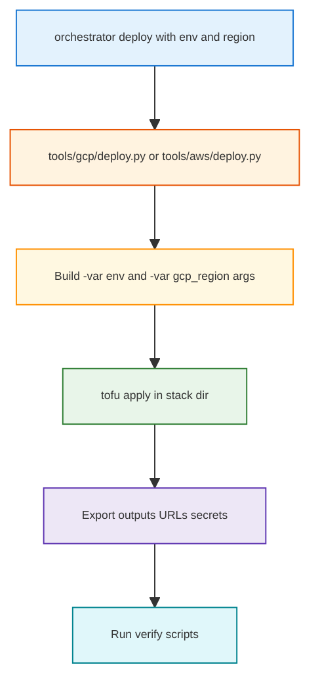

## Orchestrator & `env` Strategy (Project-Specific)

This note is grounded in the current layout:
- **App + tools**: `core_app/**`, `tools/local/**`, `tools/cloud_shared/**`
- **Infra**: `infra_terraform/live_deploy/**`, `infra_terraform/modules/**`
- **Current reality**:
  - Orchestrator accepts `--env`, `--region` but you **only run `env=dev`**.
  - There is a **single `.env` file** shared across all flows.

---

## 1. Is it feasible to keep the current orchestrator design?

**Yes** – keeping the current orchestrator design is feasible and advisable, with clearer semantics for `env`:

- **Today**
  - `env` is effectively **“deployment flavor”** used by Terraform modules:
    - GCP Nonkube main: `var.env` feeds:
      - Remote state prefixes like `${var.env}/${var.gcp_region}/...`
      - Tags: `environment = var.env`
      - Frontend CDN module: `env = var.env`
    - AWS ECS modules similarly interpolate `var.env` into:
      - Log group names (`/${var.name}/${var.env}/ecs-api`)
      - Resource names and IAM roles (`${var.name}-${var.env}-ecs-task-...`)
  - Orchestrator passes `--region` down, which aligns with:
    - `var.gcp_region` or `var.aws_region` in Terraform.

- **Recommended meaning going forward**
  - **`env` (dev / staging / prod)**:
    - Controls **Terraform workspace / state prefix**, **tags**, and **runtime env vars** (e.g. log level, analytics scheduler settings).
  - **`region` (us-central1, eu-west-1, etc.)**:
    - Controls **cloud location** for the same logical environment.

With that, the orchestrator can stay as:
- “Single CLI” that always takes `--env` and `--region` and:
  - Chooses the Terraform directory + var files.
  - Calls Terraform (or Terragrunt) with the right `-var env=... -var gcp_region=...`.
  - Optionally runs post-deploy scripts (e.g., `verify_api_endpoints.py`) against the chosen environment.

---

## 2. What should happen when we feed different `env` values?

Assume your orchestrator call looks like:

```bash
python orchestrator.py deploy --provider gcp --scope all --env dev --cloud-region us-central1
python orchestrator.py deploy --provider gcp --scope all --env staging --cloud-region us-central1
python orchestrator.py deploy --provider gcp --scope all --env prod --cloud-region us-central1
```

### 2.1. Desired behavior per `env`

- **`env=dev`**
  - **Terraform**
    - Uses remote-state prefixes like:
      - `.../dev/us-central1/gcp-shared-durable.tfstate`
      - `.../dev/us-central1/gcp-shared-nondurable.tfstate`
    - Creates **dev-tagged** resources:
      - Tags: `environment = "dev"`, `scope = "nonkube"`.
      - Names like `${var.name}-dev-ecs-task-...` or dev Cloud Run services.
  - **Runtime env vars**
    - `LOG_LEVEL = "debug"` or more verbose.
    - `ENABLE_ANALYTICS_SCHEDULER` could be `false` or lower-frequency.
    - Allowed origins limited to local/test frontends.

- **`env=staging`**
  - Similar structure as dev, but:
    - Tags: `environment = "staging"`.
    - Potentially uses **staging** DB or shared-durable stacks.
    - Scheduler enabled with near-prod schedule.
  - Post-deploy:
    - Run `verify_api_endpoints.py` and `verify_sse.py` against staging URL.

- **`env=prod`**
  - Terraform:
    - Uses `.../prod/<region>/...` remote state prefixes.
    - Tags: `environment = "prod"`.
  - Runtime env vars:
    - `LOG_LEVEL = "info"` or stricter.
    - Analytics scheduler **fully enabled**.
  - Orchestrator:
    - Always runs **verify** scripts after deploy.
    - Optionally requires a `--confirm-prod` flag or interactive approval (in CI this becomes a manual gate).

### 2.2. Visual: orchestrator behavior by `env`



---

## 3. `.env` strategy with multiple `env` values

### 3.1. Two kinds of secrets

<table>
<tr style="background:#1565c0;color:white">
<th>Kind</th>
<th>Who uses it</th>
<th>Where it lives</th>
<th>Differs per env?</th>
</tr>
<tr>
<td style="background:#e8f5e9"><strong>① App runtime</strong><br><small>(OPENAI_API_KEY, PGPASSWORD, etc.)</small></td>
<td style="background:#e8f5e9">Containers<br><small>Cloud Run, ECS</small></td>
<td style="background:#e8f5e9">• GCP Secret Manager / AWS Secrets Manager<br>• Terraform injects via <code>secret_ids</code> / <code>secret_arns</code></td>
<td style="background:#e8f5e9"><span style="background:#c8e6c9;padding:2px 6px">Yes</span><br>prod ≠ dev</td>
</tr>
<tr>
<td style="background:#fff3e0"><strong>② Deploy-time</strong><br><small>(GOOGLE_APPLICATION_CREDENTIALS, service account)</small></td>
<td style="background:#fff3e0">Orchestrator / tofu<br><small>when running <code>apply</code></small></td>
<td style="background:#fff3e0">• <code>.env</code> or CI/CD secrets</td>
<td style="background:#fff3e0"><span style="background:#c8e6c9;padding:2px 6px">Yes</span><br>prod SA ≠ dev SA</td>
</tr>
</table>

### 3.2. Do you need different `.env.*` files?

**Yes, if deploy-time credentials differ per env.** For example:
- Dev: service account with limited permissions, dev GCP project.
- Prod: service account with prod project access, different key file or JSON.

**With or without Terragrunt**, you need a way to supply the right deploy-time credentials per env. Two options:

<table>
<tr style="background:#1565c0;color:white">
<th>Aspect</th>
<th style="background:#2e7d32;color:white">Option A: Per-env `.env` files</th>
<th style="background:#6a1b9a;color:white">Option B: CI/CD secrets (GitHub)</th>
</tr>
<tr>
<td style="background:#e3f2fd"><strong>① How it works</strong></td>
<td style="background:#e8f5e9">
• Store <code>.env.dev</code>, <code>.env.staging</code>, <code>.env.prod</code> in repo (or private config repo)<br>
• Orchestrator loads file matching <code>--env</code> before tofu/terragrunt<br>
• Use <code>dotenv</code> with <code>path=.env.{env}</code>
</td>
<td style="background:#f3e5f5">
• No <code>.env.prod</code> in repo<br>
• GitHub <strong>Environments</strong> (dev, staging, prod) with env-specific secrets<br>
• Workflow sets <code>GOOGLE_APPLICATION_CREDENTIALS_JSON</code>, <code>GCP_PROJECT_ID</code> from <code>secrets.*</code> before orchestrator
</td>
</tr>
<tr>
<td style="background:#e3f2fd"><strong>② Where secrets live</strong></td>
<td style="background:#e8f5e9">
• Files in repo (add to <code>.gitignore</code> if sensitive)<br>
• Or separate private repo<br>
<span style="background:#ffcdd2;padding:2px 4px">⚠ Risk:</span> accidental commit of prod keys
</td>
<td style="background:#f3e5f5">
• <strong>GitHub Secrets</strong> (Settings → Secrets and variables → Actions)<br>
• Per-env via GitHub Environments<br>
<span style="background:#c8e6c9;padding:2px 4px">✓</span> Never in repo; encrypted at rest
</td>
</tr>
<tr>
<td style="background:#e3f2fd"><strong>③ Orchestrator change</strong></td>
<td style="background:#e8f5e9">
• If <code>--env</code> set → load <code>.env.{env}</code>, else <code>.env</code><br>
• One line: <code>load_dotenv(f".env.{args.env}") or load_dotenv(".env")</code>
</td>
<td style="background:#f3e5f5">
• <strong>No change</strong><br>
• CI exports env vars before <code>orchestrator.py deploy</code><br>
• Orchestrator reads <code>os.environ</code> (populated by GitHub)
</td>
</tr>
<tr>
<td style="background:#e3f2fd"><strong>④ Best for</strong></td>
<td style="background:#e8f5e9">
• Local deploys across dev/staging/prod<br>
• Small teams; quick iteration without CI
</td>
<td style="background:#f3e5f5">
• Prod deploys in CI<br>
• Audit trail; no secrets in repo<br>
<span style="background:#c8e6c9;padding:2px 4px">✓</span> Industry standard for production
</td>
</tr>
<tr>
<td style="background:#e3f2fd"><strong>⑤ Drawbacks</strong></td>
<td style="background:#e8f5e9">
• Prod keys in files = higher risk if repo compromised<br>
• Must ensure <code>.env.prod</code> is gitignored
</td>
<td style="background:#f3e5f5">
• Requires GitHub setup<br>
• Local prod deploy: manual export or use Option A for local-only
</td>
</tr>
</table>

**Recommended:** Use **Option A** for local dev/staging. Use **Option B** for prod in GitHub Actions. Hybrid: Option A for dev; Option B for staging and prod in CI.

### 3.3. App runtime vs deploy-time (unchanged)

- **App runtime:** Terraform injects secrets into containers from Secret Manager; no `.env` in containers.
- **Deploy-time:** Orchestrator/tofu need credentials to talk to GCS (state), GCP/AWS APIs. Those come from `.env` or CI secrets – and **can differ per env**, hence `.env.dev` vs `.env.prod` if you use Option A.

---

## 3.4. How this orchestrator plugs into CI/CD (pointer)

The orchestrator is designed to be **called from CI jobs** with the appropriate `--provider`, `--scope`, `--env`, and `--cloud-region` arguments.

- For the full CI/CD picture (branch strategy, release tags, GitHub Actions examples, feature flags), see `docs/TODO_LEARNED_CICD.md`.
- This file focuses on **orchestrator behavior, env/region semantics, `.env` handling, and Terragrunt wiring**; treat `TODO_LEARNED_CICD.md` as the higher-level CI/CD “map”.

---

---

## 4. Terragrunt: is it a plus here? How to use it lightly?

You currently have:
- Multiple **Terraform live directories** (`infra_terraform/live_deploy/gcp/nonkube`, `.../aws/nonkube`, etc.).
- Variables like `var.env`, `var.gcp_region`, `var.tf_state_prefix`, `var.tf_state_bucket`.
- An orchestrator that already:
  - Knows `provider` (`aws` / `gcp` / `local`).
  - Knows `env` and `region`.

### 4.1. When Terragrunt helps

Terragrunt is most helpful when you want to **reduce duplication** in:
- Backend config (`gcs` / `s3`), remote state prefixes.
- Common `env`/`region` variables.
- Per-environment `*.tfvars` files.

For this project, Terragrunt would mainly help to:
- Generate state prefixes like `${env}/${region}/...` in one place.
- Provide DRY configuration for multiple live stacks (dev/staging/prod, multiple regions).

### 4.2. Current flow vs Terragrunt: side-by-side comparison

<table>
<tr style="background:#e3f2fd">
<th>Aspect</th>
<th style="background:#fff3e0">Current (OpenTofu)</th>
<th style="background:#e8f5e9">With Terragrunt</th>
<th style="background:#ede7f6">Terragrunt advantage</th>
</tr>
<tr>
<td style="background:#e3f2fd"><strong>① Var injection</strong></td>
<td style="background:#fff8e1">• Python builds <code>-var=env=... -var=gcp_region=...</code><br>• In <code>_plan_vars_for_shared_stack</code><br>• Passed to <code>tofu</code> per stack</td>
<td style="background:#f1f8e9">• <code>terragrunt.hcl</code> reads <code>get_env("ENV")</code>, <code>get_env("GCP_REGION")</code><br>• No Python var list per stack</td>
<td style="background:#f3e5f5"><span style="background:#c8e6c9;padding:2px 4px">✓</span> DRY: env/region in one HCL place<br><span style="background:#c8e6c9;padding:2px 4px">✓</span> Add stacks without touching Python</td>
</tr>
<tr>
<td colspan="4" style="background:#e8eaf6;font-size:0.9em;padding:8px">
<strong>How multi-env and multi-region work:</strong><br>
• Orchestrator sets <code>ENV</code> and <code>GCP_REGION</code> in subprocess <em>before</em> each <code>terragrunt</code> call<br>
• One invocation = one (env, region) pair<br>
• Examples: <code>ENV=dev GCP_REGION=us-central1</code> | <code>ENV=staging GCP_REGION=us-east1</code> | <code>ENV=prod GCP_REGION=eu-west-1</code><br>
• Same <code>terragrunt.hcl</code>; Python maps <code>--env</code> / <code>--cloud-region</code> → <code>ENV</code> / <code>GCP_REGION</code>
</td>
</tr>
<tr>
<td style="background:#e3f2fd"><strong>② Backend / state</strong></td>
<td style="background:#fff8e1">• Each stack dir: own backend block<br>• State prefix built from vars</td>
<td style="background:#f1f8e9">• Single <code>generate</code> block in root<br>• Path from <code>path_relative_to_include</code></td>
<td style="background:#f3e5f5"><span style="background:#c8e6c9;padding:2px 4px">✓</span> One source of truth<br><span style="background:#c8e6c9;padding:2px 4px">✓</span> Fewer copy-paste errors</td>
</tr>
<tr>
<td style="background:#e3f2fd"><strong>③ Dependencies</strong></td>
<td style="background:#fff8e1">• Python enforces order<br>• durable → nondurable → nonkube via deploy phases</td>
<td style="background:#f1f8e9">• <code>dependency</code> blocks in HCL<br>• <code>terragrunt run-all</code> respects order</td>
<td style="background:#f3e5f5"><span style="background:#c8e6c9;padding:2px 4px">✓</span> Declarative<br><span style="background:#c8e6c9;padding:2px 4px">✓</span> No Python orchestration needed</td>
</tr>
<tr>
<td style="background:#e3f2fd"><strong>④ Orchestrator</strong></td>
<td style="background:#fff8e1">• <code>orchestrator.py</code> → <code>deploy.py</code> → <code>terra_runner.py</code><br>• Runs <code>tofu</code> per stack</td>
<td style="background:#f1f8e9">• Same CLI<br>• <code>terra_runner.py</code> invokes <code>terragrunt</code> with <code>ENV=... GCP_REGION=...</code></td>
<td style="background:#f3e5f5"><span style="background:#c8e6c9;padding:2px 4px">✓</span> Only subprocess changes<br><span style="background:#c8e6c9;padding:2px 4px">✓</span> Easier to add envs/regions</td>
</tr>
</table>

### 4.3. How to introduce Terragrunt (numbered steps)

1. **Add a thin Terragrunt wrapper per live directory**
   - Example: `infra_terraform/live_deploy/gcp/nonkube/terragrunt.hcl`:

   ```hcl
   terraform {
     source = "../../../modules/gcp/nonkube"
   }

   inputs = {
     env        = get_env("ENV", "dev")
     gcp_region = get_env("GCP_REGION", "us-central1")
   }
   ```

2. **Update cloud deploy flow in Python**
   - **Current:** `tools/gcp/deploy.py` builds `-var=env=... -var=gcp_region=...`; `terra_runner.py` runs `tofu plan/apply` with `cwd=stack_dir`.
   - **With Terragrunt:** In `terra_runner.py`, set `ENV` and `GCP_REGION` in the subprocess env, then call `terragrunt apply` (or `terragrunt run-all apply`) instead of `tofu`. Remove per-stack var construction from `_plan_vars_for_shared_stack` for env/region.

3. **Keep the orchestrator CLI unchanged**
   - Orchestrator still accepts `--env` and `--cloud-region`; passes them to `tools/gcp/deploy.py`. Only the underlying subprocess (tofu vs terragrunt) changes.

### 4.4. When to *avoid* Terragrunt (for now)

Terragrunt can be overkill if:
- You don’t yet have **real** staging/prod stacks.
- You are comfortable duplicating a small amount of HCL per environment.

In that case, you can:
- Stick to **pure Terraform**, using:
  - `tfvars.dev`, `tfvars.staging`, `tfvars.prod`.
  - Orchestrator mapping `--env` to the right `-var-file=...`.
- Revisit Terragrunt once you have:
  - Multiple cloud providers + multiple envs + multiple regions in active use.

---

## 5. Recommended next steps (short list)

- **Keep the current orchestrator design**:
  - Continue to accept `--env` and `--region`.
  - Tighten the mapping from `env` → Terraform vars and remote state prefixes.
- **Clarify `env` semantics**:
  - `env` drives Terraform `var.env`, tags, and runtime `ENV`/`APP_ENV` inside the containers.
  - `region` drives `var.gcp_region` / `var.aws_region`.
- **Stay with a single `.env` for now**:
  - Use it for local + dev defaults.
  - Rely on cloud secret managers and Terraform vars for staging/prod-only values.
- **Re-evaluate Terragrunt later**:
  - It can be a plus once you have more env/region combinations and want DRY state/variable wiring, but is optional at your current stage.  
