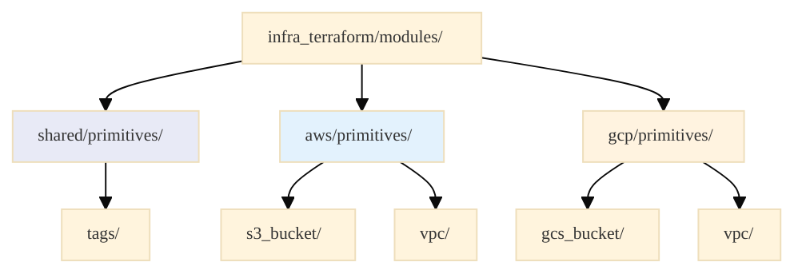
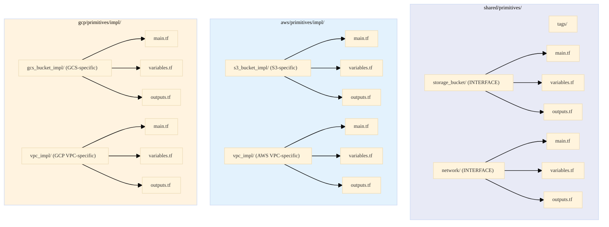
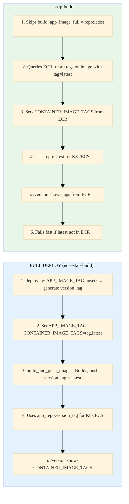
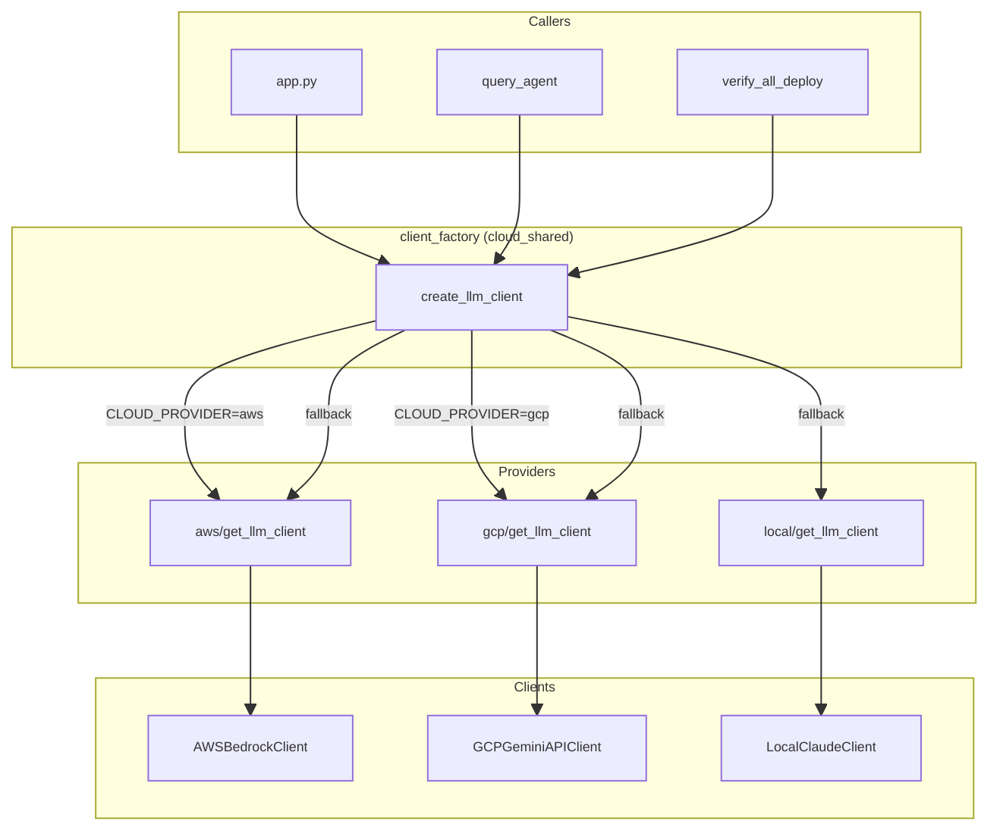
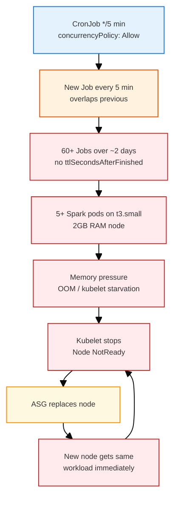
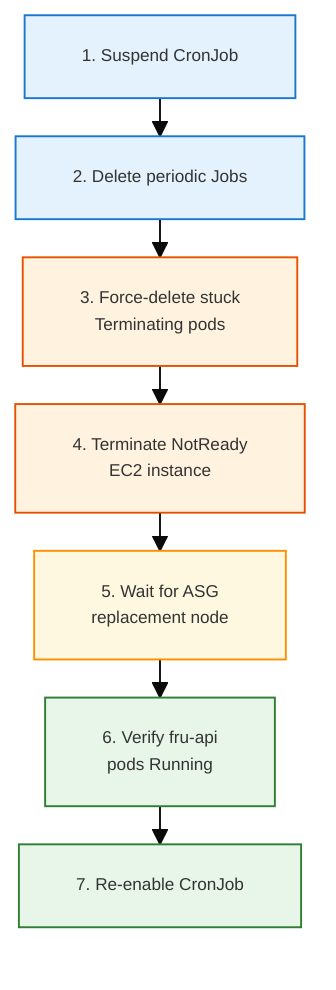
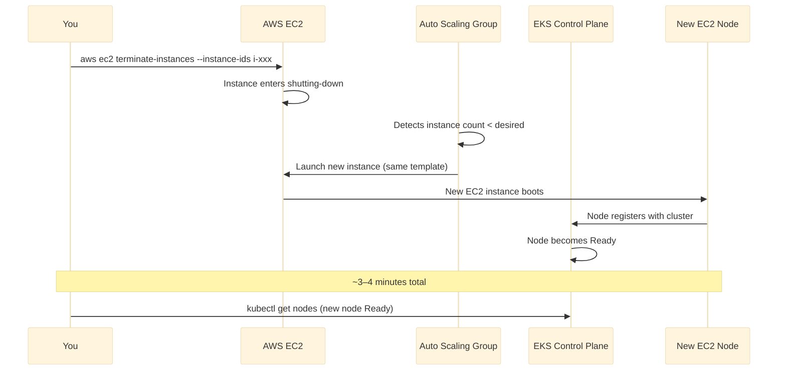

# WAR_STORIES_CLOUD_SHARED

A curated list of **non-trivial technical war stories**, capturing real lessons suitable for **senior-level interviews**.

# Cloud-Agnostic / Multi-Cloud War Stories

---

## 1. HTTP Status Code Corruption: Streaming Endpoint Validation with HEAD vs GET

**creation:** `<260127-175946>`
**last_updated:** `<260127-175946>`

**keywords:** HTTP, curl, streaming endpoints, Server-Sent Events (SSE), status code validation, HEAD request
**difficulty:** 6
**significance:** 7

### 1.1 Context

During automated endpoint validation, the `/query/stream` endpoint (a Server-Sent Events streaming endpoint) consistently returned a corrupted HTTP status code: `HTTP 200000` instead of the expected `HTTP 200`. The validation script used `curl -w "%{http_code}"` with a GET request, which worked fine for regular REST endpoints but failed for streaming endpoints.

### 1.2 Root Cause

The `/query/stream` endpoint streams data continuously using Server-Sent Events (SSE). When using `curl -w "%{http_code}"` with a GET request, curl:
1. Sends the GET request
2. Receives the HTTP response headers (including status code)
3. **Starts consuming the streaming response body**
4. Tries to write the status code to stdout

The problem: The streaming data output mixed with the status code output, resulting in a corrupted value like `200000` (the actual `200` status code followed by streaming data characters that were interpreted as part of the status code).

### 1.3 Key Insight

> Streaming endpoints require different validation strategies than regular REST endpoints. GET requests consume the stream, corrupting output parsing. HEAD requests retrieve only headers without consuming the response body.

### 1.4 Resolution

Changed the validation logic for streaming endpoints from GET to HEAD request:
- **Before:** `curl -s -o /dev/null -w "%{http_code}" "$endpoint"`
- **After:** `curl -s -I -o /dev/null -w "%{http_code}" "$endpoint"`

The `-I` flag (HEAD request) retrieves only the HTTP headers without consuming the response body, allowing clean status code extraction. Added robust extraction logic: `query_stream_status=$(echo "$curl_output" | grep -oE '[0-9]{3}' | head -1 || echo "000")` to handle edge cases.

### 1.5 Takeaway

Always use HEAD requests (`curl -I`) for status validation of streaming endpoints. GET requests will consume the stream and corrupt output parsing. For regular REST endpoints, GET is fine, but streaming endpoints (SSE, WebSockets, long-polling) require HEAD requests for validation.

---

## 2. Project-Wide venv: One Python, One Place, All Scripts

**creation:** `<260130>`
**last_updated:** `<260130>`

**keywords:** Python, venv, virtual environment, PYTHON_CMD, load-env, boto3, run scripts, dependency consistency
**difficulty:** 5
**significance:** 7

### 2.1 Context

I already knew the basics of venv: isolate dependencies, avoid polluting the system Python, pin versions in requirements.txt. What I learned in this project was how to apply that consistently when **dozens of shell scripts** invoke Python—teardown helpers, resource removal, Terraform deploy, Spark job runners, schema init, reference checks—and those scripts are run from different entry points (orchestrator, CI, one-offs). Without a single source of truth for "which Python," some scripts used `python3` and others `python`, and CI or a fresh clone might not have boto3 (or the right version) in the environment the script happened to use. That led to "works on my machine" and occasional ImportError or version skew.

### 2.2 Root Cause

There was no project-wide contract for "use the project venv if it exists." Scripts that needed Python either hardcoded `python3` or called whatever was first in PATH. The project had a `setup-python.sh` that created a venv and installed from requirements.txt, but nothing guaranteed that the **same** Python was used by every script that ran Python code. So one script might use `./venv/bin/python3` (if the author remembered), another used `python3` (system or pyenv), and dependency consistency was accidental.

### 2.3 Key Insight

> venv is not just "create it and activate it in your shell." In a script-heavy repo, you need a single, sourced contract: one variable (e.g. PYTHON_CMD) set once (e.g. by load-env or load-python-env), and every script that runs Python must use that variable. Then "which Python" is decided in one place (venv if present, else python3), and all scripts get the same interpreter and the same installed deps.

### 2.4 Resolution

- **Single source:** Added `load-python-env.sh`, which sets `PYTHON_CMD` to `$REPO_ROOT/venv/bin/python3` if the project venv exists, else `python3`. That script is sourced at the end of `load-env.sh`, which most run scripts already source. So any script that sources load-env gets a consistent `PYTHON_CMD` without changing each script’s logic.
- **Use it everywhere:** Replaced direct `python3` / `python` calls in all scripts that run Python (teardown, remove-all-aws-resources, ensure-release-address-policy, find-all-current-aws-resources, init_schema_aws, reference_check_frontend_bucket, delete-recreatable-resources, stop-ecs-services, kubernetes-manifests, terraform deploy, run-spark-job-aws, setup-and-verify for delta-lake) with `"$PYTHON_CMD"` or `"${PYTHON_CMD:-python3}"` so they all use the same interpreter.
- **Phase 0:** Confirmed the main orchestrator (run.sh) runs `setup-python.sh` in "Phase 0" before any container-type-specific deployment, so the venv is created and populated before any script that needs boto3 runs. Scripts that *define* the venv (e.g. setup-python.sh, check-and-install.sh) correctly keep using `python3` so they don’t depend on a venv that might not exist yet.

With that, one Python (the project venv when present) is used consistently across the repo, and boto3/version consistency is guaranteed for all those call sites.

### 2.5 Takeaway

In a repo where many shell scripts invoke Python, define one contract: a single sourced script that sets PYTHON_CMD (venv if present, else system python3), and have every script that runs Python use that variable. Run venv creation (e.g. setup-python) in a Phase 0 or equivalent so the venv exists before any dependent script runs. Then venv isn’t just "for interactive use"—it’s the project’s single Python runtime for automation.

---

## 3. Teardown: Prefer Python for Logic, Shell for Orchestration

**creation:** `<260130>`
**last_updated:** `<260130>`

**keywords:** Teardown, AWS, boto3, Python, shell, orchestration, sub_proc, cleanup, pre-destroy, Terraform
**difficulty:** 6
**significance:** 8

### 3.1 Context

The teardown flow (pre-destroy → Terraform destroy → orphan cleanup → local Docker cleanup) was originally implemented largely in shell: stop services, empty S3, run Terraform, then a mix of shell and ad-hoc Python for ECR and orphan cleanup. Adding new behaviors (e.g. per–container-type teardown, consistent feedback, timeouts) made the shell scripts long, hard to test, and brittle—lots of subshells, `aws` CLI parsing, and error handling in bash. We needed a clearer split between "what to run and in what order" (orchestration) and "how to do each step" (logic).

### 3.2 Root Cause

Shell is great for sequencing and calling other tools; it is poor for complex control flow, structured data, and APIs. Putting all teardown logic in shell meant: (1) S3/ECR/ECS logic was a mix of `aws` CLI and `jq` or grep, which is fragile; (2) adding heartbeat or timeout required either heavy bash or a separate helper anyway; (3) unit-testing "empty this bucket" or "deregister these task definitions" in shell is impractical. The real need was to keep orchestration in shell (one script that knows the order and passes env/args) and move step logic into something that could use boto3, structured output, and clear functions.

### 3.3 Key Insight

> Use Python for anything that talks to AWS APIs, parses structured data, or needs nontrivial logic (retries, timeouts, filtering). Use shell for orchestration: order of steps, env setup, calling Terraform wrappers, and running the Python scripts with the right arguments. That keeps the shell script short and readable and puts the hard parts in testable, reusable Python.

### 3.4 Resolution

- **sub_proc Python scripts:** Introduced a `sub_proc/` directory under resources_cleanup with Python scripts: `eks_pre_destroy.py`, `ecs_pre_destroy.py`, `shared_pre_destroy.py` (stop services via subprocess to existing shell scripts, empty S3 via boto3), and `cleanup_orphaned.py` (S3, ECR, ECS task definitions, EKS presence check—all boto3). Each script takes clear args (environment, profile, region, container-type where relevant) and does one job.
- **Shell as thin orchestrator:** The main teardown script (`teardown-resources-all.sh`) only: validates args, sets env, sources helpers, and for each step calls the right sub_proc script or Terraform wrapper. It doesn’t implement "how to empty a bucket" or "how to list ECR images"; it just runs `"$PYTHON_CMD" sub_proc/cleanup_orphaned.py ...` with the right flags.
- **Terraform wrappers:** Small shell scripts (`eks_terraform_teardown.sh`, etc.) that call the shared Terraform/Teardown entrypoint with the right layer (eks/ecs/infrastructure) so the orchestrator stays simple and Terraform stays the single place for infra state.

Benefits: (1) Python steps are testable and reusable; (2) boto3 gives reliable APIs instead of parsing CLI output; (3) new behaviors (e.g. heartbeat, timeout) can be added in one place (helpers) and reused; (4) the orchestrator stays short and easy to read.

### 3.5 Takeaway

For teardown (and similar multi-step automation), keep orchestration in shell—order of steps, env, and calling the right tools. Implement step logic (AWS API calls, filtering, retries) in Python with boto3. Expose that logic as small, CLI-invokable scripts (e.g. sub_proc) so the shell script stays thin and the complex parts are testable and maintainable.

---

## 4. Continuous Feedback and Heartbeat: So Long-Running Scripts Don’t Look Stuck

**creation:** `<260130>`
**last_updated:** `<260210>`

**keywords:** UX, feedback, heartbeat, timeout, teardown, remove-all-aws-resources, stderr, long-running, run_with_heartbeat, wait_with_heartbeat, output buffering, PYTHONUNBUFFERED, docker --progress=plain, non-TTY, Cursor IDE
**difficulty:** 6
**significance:** 7

### 4.1 Context

Teardown and brutal-force removal (remove-all-aws-resources) can run for many minutes: Terraform destroy, EKS/ECS/RDS deletion, S3/ECR cleanup. Without feedback, the terminal sits silent for long stretches and users (or CI) assume the process is stuck. We wanted: (1) continuous informative output (what step is running, what succeeded/failed); (2) "heartbeat" output while waiting (e.g. every 60s) so it’s clear the process is still running; (3) optional timeout so a step doesn’t hang forever and the script can exit with a clear message.

### 4.2 Root Cause

Initially, teardown just ran subprocesses (pre-destroy, Terraform, cleanup) and printed one line before and one after each step. If a step took 10 minutes, there was no output in between. Similarly, remove-all-aws-resources had internal waits (e.g. "wait for EKS cluster to be deleted") with no periodic message, so the script appeared frozen. There was no shared pattern for "run a command and print a heartbeat every N seconds" or "wait until condition with timeout and heartbeat," and no single place to define a per-step timeout (e.g. for teardown) so users could cap duration.

### 4.3 Key Insight

> Long-running automation needs two kinds of feedback: (1) progress lines (what’s running, what completed/failed) so users see continuous activity; (2) heartbeat lines (e.g. "Still running: &lt;description&gt; ... N s elapsed") so during long waits users know the process isn’t stuck. Prefer one helper per language (shell for "run command with heartbeat," Python for "wait until condition with heartbeat") and a single, prominent timeout constant (e.g. per-step) so behavior is predictable and easy to tune.

### 4.4 Resolution

- **Python helper (long_running_feedback.py):** Added a shared module used by remove-all-aws-resources: `progress(msg)`, `print_status(resource_id, status, detail)`, `log_timeout(component, resource_id, timeout_min)`, and `wait_with_heartbeat(description, check_fn, timeout_sec, interval_sec=60)`. The wait function polls `check_fn()`, prints a heartbeat every `interval_sec` ("... have waited for &lt;description&gt; - N min"), and returns False on timeout. So CloudFront/EKS/ECS/RDS deletion waits now give continuous feedback and a clear timeout.
- **Shell helper (run-with-heartbeat.sh):** Added `run_with_heartbeat "description" interval_sec [timeout_sec] -- command ...` (runs the command, prints "Still running: description ... N s elapsed" every interval_sec, optionally kills on timeout) and `sleep_with_heartbeat total_sec interval_sec "message"` (sleep with "message - N s remaining" every interval). Teardown sources this and wraps each long step (pre-destroy, Terraform, orphan cleanup) with `_run_with_heartbeat_step`, so each step streams its own output and a heartbeat every 60s (or TEARDOWN_HEARTBEAT_INTERVAL). The optional wait between layers uses `sleep_with_heartbeat` so that pause isn’t silent.
- **Timeout and wording:** Defined `TEARDOWN_STEP_TIMEOUT_SEC` and `HEARTBEAT_INTERVAL_SEC` at the top of the teardown script so they’re visible and overridable. Heartbeat messages use "N s elapsed" (not just "N s") so it’s clear the value is accumulated time. Documented that the initial "Loading AWS image identifiers" phase is not wrapped (can take ~3 min) and that any external timeout (e.g. CI/IDE) can still kill the process; the script’s own timeout is per-step only when set.

With this, both teardown and remove-all give continuous feedback and heartbeat during long operations, and teardown can optionally enforce a per-step timeout for a predictable, graceful exit.

### 4.5 Takeaway

For long-running scripts: (1) emit progress lines (what’s running, what completed/failed); (2) emit heartbeat lines on a fixed interval ("Still running: … N s elapsed") so waits don’t look stuck; (3) use a shared helper per language (shell: run command + heartbeat [+ timeout]; Python: wait until condition + heartbeat + timeout); (4) put timeout and interval constants at the top of the main script and document which phases have no heartbeat (e.g. initial setup). That keeps users and CI confident the process is alive and makes timeouts explicit and configurable.

### 4.6 Output Buffering: Silent "Hang" When Run Under IDE or CI

**creation:** `<260210>`
**last_updated:** `<260210>`

Deploy's build-and-push phase (Docker build + push) ran for 15+ minutes with no terminal output after "OpenTofu has been successfully initialized!" The process was not stuck—Docker build was actively running—but output was buffered. When Python runs in a non-TTY (e.g. Cursor's integrated terminal, CI runners), stdout is block-buffered by default. Docker build's fancy progress display also buffers when not attached to a real TTY. Result: users assume the script hung and kill it, or wait indefinitely with no feedback.

**Resolution:** (1) Set `PYTHONUNBUFFERED=1` in the subprocess env when spawning long-running child scripts (e.g. `build_and_push_images.py`) so Python flushes output immediately. (2) Add `--progress=plain` to `docker build` so Docker emits line-by-line output instead of the interactive progress bar, which buffers or misbehaves in non-TTY environments. (3) Run the top-level deploy with `PYTHONUNBUFFERED=1` when invoking from IDE or CI. Heartbeat helps too, but unbuffered output ensures the child's real progress (Docker layer logs, etc.) streams to the terminal.

**Takeaway:** When long-running subprocesses appear to "freeze" with no output, suspect buffering—not deadlock. Python block-buffers stdout when not a TTY; Docker's progress display buffers in non-TTY. Use `PYTHONUNBUFFERED=1` for Python children and `docker build --progress=plain` for build visibility in IDE/CI.

---

## 5. Terragrunt Dependency Outputs: Partial State and try()

**creation:** `<260131>`
**last_updated:** `<260131>`

**keywords:** Terragrunt, Terraform, dependency, mock_outputs, partial state, try(), refresh, plan
**difficulty:** 6
**significance:** 7

### 5.1 Context

During dry-runs, the ECS and EKS Terragrunt layers failed with `Error: Unsupported attribute` on lines like `dependency.infrastructure.outputs.vpc_id`—"This object does not have an attribute named 'vpc_id'." The same config worked when the infrastructure layer had been fully applied previously; it failed when state was partial (e.g. only `aurora_database_name` present) or when running `terragrunt refresh` before `plan`. The EKS layer had been fixed earlier with `try()`; the ECS layer had not.

### 5.2 Root Cause

Terragrunt resolves dependencies by running the dependency layer and reading its outputs. When the dependency's state is incomplete (e.g. infrastructure was applied in the past but some outputs were removed or state was pruned, or the dependency has never been applied), `terragrunt output` returns only the outputs that exist. Terragrunt then exposes that partial set as `dependency.<name>.outputs`. If the child config references `dependency.infrastructure.outputs.vpc_id` and that key is missing, HCL throws "Unsupported attribute." Similarly, for commands like `refresh`, Terragrunt may run the dependency and get real (partial) outputs instead of using `mock_outputs`, so the child sees missing keys and fails.

### 5.3 Key Insight

> When a Terragrunt layer depends on another and that dependency may have partial or empty state (e.g. before first apply, after selective destroy, or during refresh), reference dependency outputs with try(dependency.<name>.outputs.<key>, "fallback") so missing keys don't fail the config. Add "refresh" (and "init", "state") to mock_outputs_allowed_terraform_commands so that when you run refresh/plan without applying the dependency, Terragrunt uses mock outputs instead of partial real ones.

### 5.4 Resolution

- **ECS dev terragrunt.hcl:** Wrapped every `dependency.infrastructure.outputs.<key>` in `try(..., "fallback")` with sensible mock values (e.g. `try(dependency.infrastructure.outputs.vpc_id, "vpc-xxxxxxxx")`). Added `"refresh"`, `"init"`, `"state"` to `mock_outputs_allowed_terraform_commands` so refresh/plan use mocks when the dependency hasn't been applied.
- **Consistency:** EKS layers already used try() and broader mock_outputs_allowed_terraform_commands; ECS was updated to match. Frontend-ecs/frontend-eks dependency on app (ECS/EKS) also use try() for `alb_dns_name` and include "refresh" in mock_outputs_allowed_terraform_commands.

### 5.5 Takeaway

Design Terragrunt configs for partial dependency state: use try(dependency.*.outputs.<key>, fallback) for every dependency output you read, and allow mock_outputs for init, plan, refresh, and state so dry-runs and first-time runs succeed without applying every dependency first.

---

## 6. Terraform Provider Lock vs Constraint: "does not match configured version constraint ~> 5.0; must use terraform"

**creation:** `<260130>`
**last_updated:** `<260130>`

**keywords:** Terraform, Terragrunt, provider version, lock file, .terraform.lock.hcl, version constraint, ~> 5.0
**difficulty:** 6
**significance:** 7

### 6.1 Context

After adding the shared frontend module and Terragrunt layers (frontend-ecs, frontend-eks), running `terragrunt plan` or `terragrunt apply` failed with:

```
15:56:11.457 ERROR terraform: │ does not match configured version constraint ~> 5.0; must use terraform
```

The error pointed at the AWS provider: something was asking for a provider version that did not satisfy the constraint declared in the root configuration (`~> 5.0`). Other layers (infrastructure, ecs, eks) worked; the failure appeared only for the new frontend layers or when the frontend module was involved.

### 6.2 Root Cause

Terragrunt generates a provider block from `root.hcl`, which sets `required_providers.aws.version = "~> 5.0"`. Terraform then uses a **lock file** (`.terraform.lock.hcl`) in each layer directory (or in a module directory) to pin the exact provider version and checksums.

A lock file had been created—either in the frontend **module** or in the frontend-ecs / frontend-eks **environment** directories—that pinned the AWS provider to a **6.x** version (e.g. `6.28.0`). That can happen if:

- The module was inited elsewhere with a different root that allowed 6.x, or
- A one-off `terraform init` was run with a different constraint, or
- The lock file was copied from another project or branch.

Terraform requires that the **locked** provider version satisfy the **configured** constraint. Here, 6.x does **not** satisfy `~> 5.0` (which allows only 5.x). So Terraform refused to proceed and reported that the locked version "does not match configured version constraint ~> 5.0; must use terraform" (i.e. re-run init so the lock matches the constraint).

### 6.3 Key Insight

> Lock files (`.terraform.lock.hcl`) must be consistent with the provider constraints in the generated root. If a layer or module has a lock that pins a provider version outside the root constraint (e.g. lock has 6.x, root has ~> 5.0), Terraform will fail. Fix by either: (1) remove the stale lock and re-run `terragrunt init` so Terraform locks a version that satisfies the constraint, or (2) update the root constraint to allow the locked version (e.g. ~> 6.0) and then align all layers.

### 6.4 Resolution

- **Identify conflicting locks:** Located `.terraform.lock.hcl` in the frontend module (`module_infra_basic/aws/terra/modules/frontend/`) and in the frontend-ecs / frontend-eks environment directories. Inspected them and confirmed they pinned the AWS provider to 6.x (e.g. `version = "6.28.0"`) while `root.hcl` constrains to `~> 5.0`.
- **Remove stale locks:** Deleted those lock files so they would not override the root constraint. Lock files in **environment** directories (next to `terragrunt.hcl`) are the ones Terragrunt/Terraform use for that layer; lock files inside **modules** can also be used when the module is inited in isolation, so removing both ensured a clean slate.
- **Re-init:** Ran `terragrunt init` (or the usual init path) in the affected layer directories. Terraform re-resolved the AWS provider against the generated provider block and created new `.terraform.lock.hcl` files that lock a **5.x** version (e.g. `5.100.0`) satisfying `~> 5.0`.
- **Commit lock files:** Committed the new lock files so the whole team and CI use the same provider version. Per project policy, lock files next to `terragrunt.hcl` in environment directories are committed; root constraint and locks stay in sync.

After this, plan and apply for frontend-ecs and frontend-eks succeeded without the version constraint error.

### 6.5 Takeaway

When you see "does not match configured version constraint ~> X.Y; must use terraform", the lock file has pinned a provider version that does not satisfy the constraint in your Terraform/root config. Resolve it by deleting the offending `.terraform.lock.hcl` (in the layer or module) and re-running `terragrunt init` so Terraform locks a version that satisfies the constraint; or update the constraint to match the lock and re-init everywhere. Keep root constraint and lock files in sync and commit lock files so everyone uses the same provider version.

---

## 7. Preempt Teardown: State Lock Failure and Teardown Reporting Success on Failure

**creation:** `<260201>`
**last_updated:** `<260201>`

**keywords:** Terraform, Terragrunt, state lock, teardown, preempt, fail-fast, idempotent, force-unlock
**difficulty:** 6
**significance:** 7

### 7.1 Context

During `./run.sh aws kube dev --preempt`, the EKS layer Terraform destroy failed with **"Error acquiring the state lock"** (Lock ID in S3, from a previous interrupted apply). Despite the failure, the teardown script logged **"[SUCCESS] EKS layer destroyed!"** and continued to the next step (ECS destroy). The run did not fail fast: the user only discovered the error by reading logs, and the pipeline proceeded as if teardown had succeeded.

### 7.2 Root Cause

Two separate issues:

1. **State lock:** A prior Terraform/Terragrunt run (apply or destroy) had been interrupted or crashed, leaving a lock on the remote state (e.g. `fru-terraform-state-744139897900/dev/eks/terraform.tfstate`). New destroy runs could not acquire the lock and failed with `PreconditionFailed: At least one of the pre-conditions you specified did not hold`.

2. **Teardown not fail-fast:** In `orchestration/terraform/teardown.sh`, EKS (and ECS) destroy was implemented as:
   - `terragrunt destroy -- -auto-approve || { log_warning "Destroy failed or no resources to destroy (idempotent)" }`
   - followed unconditionally by `log_success "EKS layer destroyed!"`
   So any destroy failure (state lock, API error, etc.) was only warned; the script never exited with a non-zero status and always reported success. The intent had been to treat "no resources to destroy" as idempotent, but the same branch swallowed **all** failures.

### 7.3 Key Insight

> When a destructive step can fail for multiple reasons (state lock vs. "already destroyed"), don’t treat every non-zero exit as idempotent. Fail fast on real errors so the orchestrator stops and the user sees the failure; document recovery (e.g. force-unlock) for the lock case.

### 7.4 Resolution

- **Fail-fast:** In `teardown.sh`, EKS and ECS (and frontend-eks / frontend-ecs) destroy now check the exit code of `terragrunt destroy`. On failure, the script logs an error (including a force-unlock hint), exits with status 1, and does **not** run `log_success`. Teardown stops immediately and the orchestrator reports failure.
- **State lock recovery:** Run `terragrunt force-unlock <LOCK_ID>` in the layer directory (EKS, ECS, or infrastructure). For non-interactive use: `echo yes | terragrunt force-unlock <LOCK_ID>`. See War Story 17.
- **Preempt and shared infra:** Separately, preempt was fixed to use `--container-type all` so shared infrastructure (VPC, Aurora, DB subnet group) is torn down too, avoiding the "subnet group not in same VPC" error after preempt (see war story 16).
- **Import before shared destroy:** If infrastructure Terraform state was empty (e.g. after state loss), `terragrunt destroy` for the shared layer had nothing to destroy; orphaned resources (DB subnet group, etc.) remained in AWS. Deploy then re-imported them and hit the same VPC mismatch. **orchestration/aws/teardown-resources-all.sh** now runs `import-existing-infrastructure.sh` for the shared layer *before* calling shared Terraform destroy when `--container-type all`, so state is populated and destroy can remove those resources.

### 7.5 Takeaway

Orchestration scripts must not report success when a critical step fails. Using `cmd || { log_warning "..." }` and then always running `log_success` hides real errors (state lock, API failures) and breaks fail-fast. Check exit codes and exit 1 on failure; reserve "idempotent" handling for cases you can detect explicitly (e.g. "no state" or "already destroyed"). For Terraform state lock, document force-unlock and non-interactive usage (`echo yes |`) so users can recover and retry.

---

## 8. Import Preexisting Scripts: Before Apply and Before Destroy

**creation:** `<260130>`
**last_updated:** `<260130>`

**keywords:** Terraform, Terragrunt, import, state vs reality, RDS DB subnet group, VPC, InvalidParameterValue, teardown, deploy
**difficulty:** 6
**significance:** 8

### 8.1 Context

We have import-preexisting scripts (e.g. `import-existing-infrastructure.sh`) that run `terraform import` to pull existing AWS resources into Terraform state. Two questions arose: why run them **before** `terragrunt apply`, and why also run them **before** `terragrunt destroy`? The second became critical when, after a full teardown, deploy still failed with: **`api error InvalidParameterValue: The new Subnets are not in the same Vpc as the existing subnet group`**.

### 8.2 Why Import Before Apply

When reality was changed **outside** Terraform (e.g. brutal teardown that deletes resources via AWS API but does not update state, or state was lost and resources were recreated manually), resources exist in AWS but **not** in Terraform state. A normal `terragrunt apply` then tries to **create** those resources again. AWS responds with "already exists"–style errors (e.g. `EntityAlreadyExists`, `ResourceAlreadyExistsException`). Running the import script **before** apply pulls current AWS reality into state so Terraform treats those resources as managed; apply can then refresh/update instead of trying to create, and the flow stays consistent.

### 8.3 Why Import Before Destroy

If Terraform state was **empty** (e.g. state bucket recreated or state lost) but AWS still has resources (e.g. the RDS DB subnet group `fru-dev-aurora-subnet-group` left in an old VPC), `terragrunt destroy` has **nothing in state** to destroy—it no-ops. The orphan (subnet group, etc.) remains in AWS. The next deploy runs import **before** apply (as above) and pulls that subnet group into state; our config, however, wants the subnet group to use subnets from the **new** VPC. Terraform therefore plans to **update** the group to the new subnets. AWS RDS rejects that with:

`api error InvalidParameterValue: The new Subnets are not in the same Vpc as the existing subnet group`

So the error recurs not because import is wrong, but because we never **destroyed** the orphan—destroy had no state to act on. Running the import script **before** destroy (for the same layer) populates state with existing AWS resources so `terragrunt destroy` can actually **remove** them. After that, the next apply creates one VPC, subnets, and subnet group in one consistent run; no "update to different VPC" step, so no InvalidParameterValue.

### 8.4 Is This a Common Scenario?

Yes. State/reality drift is very common with Terraform:

- **State lost** (wrong backend, bucket recreated, local-only state).
- **Resources changed outside Terraform** (console, CLI, other automation, emergency deletes).
- **"Adopting" existing infra** into Terraform.

That's why Terraform has first-class **import** and **refresh**: adoption and drift are expected. Needing to fix state before **destroy** (so destroy actually has something to destroy) is the same idea—less often written down, but the same "state must match reality before you act" principle.

### 8.5 Resolution

- **Before apply:** Deploy already runs each layer’s import script (e.g. `import-existing-infrastructure.sh`) before that layer’s plan/apply so state matches reality and apply does not hit "already exists."
- **Before destroy:** **orchestration/aws/teardown-resources-all.sh** now runs the relevant import script(s) **before** each layer’s `terragrunt destroy`: infrastructure before shared destroy; EKS + frontend-eks before EKS destroy; ECS + frontend-ecs before ECS destroy. State is populated so destroy can remove orphaned resources instead of no-op’ing; the next deploy then creates a clean stack without the VPC/subnet group mismatch.

### 8.6 Takeaway

Import scripts reconcile **state with reality**: they don’t apply external state files—they pull current AWS reality into Terraform state. You need them **before apply** when resources exist in AWS but not in state (so apply doesn’t try to create and hit "already exists"). You also need them **before destroy** when state is empty but AWS still has resources (so destroy can remove orphans instead of no-op’ing and causing the next deploy to re-import and hit errors like `The new Subnets are not in the same Vpc as the existing subnet group`). Same tool, two moments: before apply and before destroy, to keep the whole Terraform flow consistent.

For a focused reference on the per-layer import scripts, their CLI, and teardown-mode behaviors (state locks, “already managed”, “non-existent” patterns), see `docs/learned/terra/TERRA_LEARN_IMPORT_PREEXIST.md`.

---

## 9. Fixing "The new Subnets are not in the same Vpc as the existing subnet group" — What We Did and Option A vs Option B

**creation:** `<260130>`
**last_updated:** `<260130>`

**keywords:** Terraform, RDS DB subnet group, VPC mismatch, InvalidParameterValue, prevent_destroy, state rm, Option A, Option B, long-term layer, Secrets Manager
**difficulty:** 6
**significance:** 8

### 9.1 Context and Goal

The goal is to run **`./run.sh <local|aws> <kube|nonkube> dev --preempt`** problem-free. Preempt tears down all AWS layers (EKS + ECS + shared infrastructure) then redeploys. The recurring failure was:

**`api error InvalidParameterValue: The new Subnets are not in the same Vpc as the existing subnet group`**

This appears during Phase 2 (Deploy infrastructure layer) after a preempt or teardown. War stories 16, 17, and 18 describe the root causes and partial fixes; this story summarizes **what we did already** and the **choice between Option A (fail-back) and Option B (separate long-term layer)**.

### 9.2 Root Cause (Recap)

1. **State vs reality:** The infrastructure layer creates one VPC, subnets, RDS DB subnet group, and Aurora in code. A single apply cannot produce a mismatch. The error occurs when:
   - Terraform state was empty or pointed at a **new** VPC (e.g. after state loss or a new apply that created VPC B).
   - The **existing** DB subnet group in AWS (e.g. `fru-dev-aurora-subnet-group`) still references subnets from an **old** VPC (VPC A).
   - Terraform then tries to **update** the subnet group to use subnets from VPC B; AWS rejects this because a DB subnet group cannot move to another VPC by replacing subnets.

2. **Why teardown didn't remove the subnet group:**
   - **Empty state:** If infrastructure state was empty, `terragrunt destroy` had nothing to destroy (no-op). Orphaned subnet group (and VPC A) remained; next deploy re-imported the subnet group and tried to point it at VPC B → error (War Story 18).
   - **prevent_destroy:** Secrets Manager resources in the same layer have `lifecycle { prevent_destroy = true }`. Terraform **aborts the entire destroy** when any resource has prevent_destroy. So VPC, Aurora, and the DB subnet group were **never** destroyed; they stayed in AWS. Next deploy re-imported and hit the same VPC mismatch.

### 9.3 What We Did Already (Current Fixes)

#### 19.3.1 Import before destroy (all layers)

- **orchestration/aws/teardown-resources-all.sh** runs the relevant import script(s) **before** each layer's `terragrunt destroy`: infrastructure before shared destroy; EKS + frontend-eks before EKS destroy; ECS + frontend-ecs before ECS destroy.
- **Effect:** State is populated with existing AWS resources so destroy can **remove** them instead of no-op'ing. After teardown, the next apply creates one VPC, one subnet group, one Aurora — no "update to different VPC" step.

#### 19.3.2 Preempt uses --container-type all

- **orchestration/aws/run.sh** (preempt step) calls teardown with `--container-type all` so EKS + ECS + **shared infrastructure** (VPC, Aurora, DB subnet group) are torn down, not just the app layer (War Story 17).

#### 19.3.3 prevent_destroy workaround when PREEMPT=true

- In **orchestration/terraform/teardown.sh**, when destroying the infrastructure layer:
  - If `terragrunt destroy` fails and the output indicates **prevent_destroy** (e.g. "cannot be destroyed", "must be removed from state"), and **PREEMPT=true**:
    1. Remove the protected Secrets Manager resources from Terraform state via `terragrunt state rm <address>` (secrets and secret versions).
    2. Re-run `terragrunt destroy -- -auto-approve`.
  - The second destroy then removes VPC, Aurora, DB subnet group, IAM, S3 (everything left in the layer). Secrets remain in AWS (only removed from state) and are re-imported on the next deploy.
- **Effect:** Preempt can complete a full teardown of shared infra without getting stuck on prevent_destroy. Teardown logic is more complex and tied to a fixed list of state addresses.

### 9.4 Option A (Current): Fail-Back with state-rm

| Aspect | Description |
|---

## 10. CONTAINER_IMAGE After Phase 1: Background Job vs Main Shell When Using --skip-build

**creation:** `<260202>`
**last_updated:** `<260202>`

**keywords:** CONTAINER_IMAGE, --skip-build, ECR, latest tag, background process, Delta table, image not found, orchestration
**difficulty:** 7
**significance:** 8

### 10.1 Context

With `./run.sh aws kube dev --skip-build`, Phase 1 (check_or_build_image) correctly set `CONTAINER_IMAGE` to the ECR `latest` image and skipped build/push. Later, Delta table creation (Phase 5) failed with "image not found" for a **different** tag (e.g. `fru_dev_..._dirty_20260202_200059`). The same image identifier must be used for the whole run (Terraform, Delta, k8s); otherwise downstream steps try to pull an image that was never built.

### 10.2 Root Cause

1. **Startup:** At script startup, `load_image_identifiers "aws"` runs and sets `CONTAINER_IMAGE` via `resolve_container_image_for_aws`, which produces a **new** tag (commit + timestamp, e.g. `..._200059`). So the main shell had `CONTAINER_IMAGE` = that new tag from the start.

2. **Phase 1 in background:** Phase 1 runs in a **background** process (`deploy_phase_check_image ... &`). In that process, with `--skip-build`, we set `CONTAINER_IMAGE` to `ECR:latest` and logged it. That only affected the background process; the main shell never saw it.

3. **After Phase 1:** The main script only overwrote `CONTAINER_IMAGE` when it was **empty**. It was not empty (still the startup value), so we kept the **startup** tag and never used the value Phase 1 had actually used.

4. **Phase 5 (Delta):** Data-lake setup and `run-spark-job-docker-ecr.sh` use `CONTAINER_IMAGE` from the environment. They received the main shell’s value—the **startup** tag that was never built—so `docker run` failed with "image not found".

So the bug was not in Delta or in --skip-build logic per se; it was that the **main shell** never adopted the image identifier that Phase 1 (running in the background) had set and logged.

### 10.3 Key Insight

> When a long-running step runs in a **background** process, any variables it sets (e.g. CONTAINER_IMAGE) are not visible in the parent. The parent must either (1) get that value from the child’s output (e.g. extract from logs) and set it in the main shell, or (2) not run that step in background. Prefer extracting the canonical value from the step’s output so the rest of the pipeline uses exactly what that step used (e.g. ECR:latest when --skip-build).

### 10.4 Resolution

- **After Phase 1:** In `orchestration/aws/run.sh`, after the Phase 1 background job completes, we now **always** try to extract `CONTAINER_IMAGE` from the Phase 1 output (lines matching `CONTAINER_IMAGE=`, `Using container image:`, or `Using CONTAINER_IMAGE:`). If we find a match, we set and export that value in the main shell; only if we find nothing do we keep the current value or regenerate. So the rest of the run (Terraform, Delta, k8s) uses the **same** image Phase 1 used (e.g. `ECR:latest` when --skip-build, or the built tag when we built).

- **--skip-build semantics:** We also standardized on: with `--skip-build`, Phase 1 sets `CONTAINER_IMAGE` to `ECR_REPO_URI:latest` and fails fast if the `latest` tag is not present in ECR. The build-push script was updated so that after every successful build it **must** push the `latest` tag (script exits with failure if that push fails), guaranteeing that a successful first run leaves `latest` in ECR for future --skip-build runs.

- **Grep pattern:** The extraction pattern was updated to match the log line emitted in the --skip-build path (`Using CONTAINER_IMAGE: ...`) so that path is captured correctly.

### 10.5 Takeaway

If a step that "sets the canonical value" for the rest of the pipeline (e.g. CONTAINER_IMAGE) runs in a **background** process, the parent must **adopt** that value from the child’s output (e.g. by parsing logs) and set it in the main shell. Do not assume "if CONTAINER_IMAGE is already set, leave it"—the existing value may be from an earlier phase (e.g. startup) and wrong for downstream. Prefer "extract from the step that actually chose the image; use that for the rest of the run." For --skip-build, use a single, well-defined tag (e.g. ECR:latest) and ensure the build path always updates that tag so --skip-build is reliable.

---

## 11. Shell Scripts "Permission Denied" After a Major Refactor: Git Mode 100755 → 100644

**creation:** `<260205>`
**last_updated:** `<260205>`

**keywords:** Git, file mode, execute bit, chmod, 100644, 100755, shell scripts, refactor
**difficulty:** 4
**significance:** 6

### 11.1 Context

After a large refactor commit (logger migration, ECR scripts, many file touches), orchestration and deploy started failing with "Permission denied" when invoking scripts—e.g. `orchestration/local/setup-python.sh`, `orchestration/terraform/setup-s3-bucket.sh`, and others. The same scripts had worked before the refactor.

### 11.2 Root Cause

Git records each file's **mode** (e.g. 100644 = regular file, 100755 = executable). The refactor commit had many "mode change 100755 => 100644" entries: shell scripts that were previously committed as executable were committed again as **non-executable**. Once that's in history, every checkout (and every clone) gets those files without the execute bit, so the shell refuses to run them and returns "Permission denied".

Common causes for the mode drop during a refactor:
- **Staging from an environment that didn't have execute bit set** (e.g. editor or IDE that doesn't preserve it, or files copied/touched in a way that cleared it).
- **Checkout on a filesystem or Git config** where `core.fileMode` is false or execute bits aren't preserved, then add/commit from that state.
- **Bulk operations** (find/replace, move, or tooling) that rewrote or re-added files without preserving mode.

### 11.3 Key Insight

> After a big refactor, if many scripts suddenly report "Permission denied", check Git mode: they may have been committed as 100644. Fix with `chmod +x` and **re-commit the mode** so the fix is permanent for everyone.

### 11.4 Resolution

- **Immediate fix:** Restore execute bit on all shell scripts:  
  `find . -name '*.sh' -type f ! -path './.git/*' -exec chmod +x {} \;`
- **Permanent fix:** Stage and commit the permission change so the index has 100755 for those files:  
  `git add -u '*.sh'` (or add the specific scripts), then commit e.g. "fix: restore execute bit on shell scripts (were committed as 100644)".
- **Prevention:** When doing large refactors, avoid re-adding or rewriting scripts in a way that drops the execute bit; after bulk changes, run `chmod +x` on `*.sh` and include that in the commit. Optionally add a CI or pre-commit check that verifies known entrypoint scripts are executable.

### 11.5 Takeaway

Git does not enforce "this file should be executable"; it only stores the mode that was committed. If scripts are committed as 100644, they will be checked out non-executable everywhere. After a refactor that touches many scripts, verify they still run—and if not, fix mode and commit the fix so the repo stays runnable.

---

## 12. Calling Child Shell Scripts: exec vs Run-Then-Exit, and Not Swallowing Output

**creation:** `<260205>`
**last_updated:** `<260205>`

**keywords:** Bash, exec, child script, exit code, command substitution, stdout, stderr, logging, dispatcher
**difficulty:** 5
**significance:** 7

### 12.1 Context

We added simple start/end log lines to entrypoint scripts (`run.sh`, `teardown.sh`, `orchestration/run.sh`, `orchestration/teardown.sh`) so logs would show e.g. `### start of orchestration/run.sh ###` and `### end of orchestration/run.sh ###`. On successful runs we never saw the "end" lines. Separately, when a phase failed (e.g. ECS Phase 1 container image check), the log showed only a generic "Phase failed (fail-fast)" with no underlying error (ECR/git/resolve)—the real error was missing from the log.

### 12.2 Root Cause (Two Different Issues)

**Why "end" never appeared:** The dispatchers used **exec** to run the next script (e.g. `exec "$REPO_ROOT/orchestration/aws/run.sh" ...`). **exec** replaces the current process with the child; the parent script never returns. So any code after the exec (including `log_info "### end of ... ###"`) is never executed. The "end" line only ran on error/help paths that exited before the exec.

**Why phase errors were invisible:** The ECS workflow used `step_num=$(run_phase_and_capture deploy_phase_check_image ...)`. Inside `run_phase_and_capture`, the phase ran as `"$@" 2>&1 | tee "$tmpf"`. All phase stdout/stderr went through the pipe; **tee** wrote to the temp file and to its stdout. That stdout was the only stdout of the function, and it was **consumed by the command substitution** (`step_num=$(...)`). So the phase’s log output (including `log_error` and the real failure reason) was captured into the substitution result and then discarded—never printed. Only the final "Phase failed (fail-fast)" from the caller was visible.

### 12.3 Key Insight

> **exec** is "run and never return": use it when you want the child to fully replace the parent (e.g. save one process slot). If the parent must run code after the child finishes (e.g. log "end", cleanup, or aggregate exit code), **do not use exec**—run the child as a normal command, capture its exit code, then do the post-work and exit with that code.
>
> **Command substitution** `var=$(cmd)` captures all stdout of `cmd`. If `cmd` is a pipeline (e.g. `phase 2>&1 | tee file`), then the pipeline’s stdout (everything tee writes to stdout) becomes the substitution result. So the user never sees that output—it’s swallowed. If the user must see phase output (especially errors), either don’t put it in a substitution, or duplicate it to stderr (e.g. `tee "$file" >&2`) so it’s visible while still writing to the file.

### 12.4 Resolution

- **"End" logging:** Replaced **exec** with run-then-exit in all four entrypoints. The parent runs the child script (no exec), captures exit code with `set +e` / `_rc=$?` / `set -e`, logs `### end of ... ###`, then `exit $_rc`. Exit codes are preserved; "end" is always logged when the dispatcher finishes.
- **Phase output visibility (ECS):** In `run_phase_and_capture`, changed the pipeline to `"$@" 2>&1 | tee "$tmpf" >&2` so tee’s output is duplicated to stderr. The user (and any `2>&1 | tee log` around the run) now sees the phase output including the real error; the temp file is still used to parse the step number.

### 12.5 Calling Child Scripts: General Guidelines

- **When to use exec:** When the parent is a thin launcher and you want the child to replace it completely (same PID, no code after the child). Good for "exec the real binary" or "exec the next stage and never return."
- **When not to use exec:** When the parent must run after the child (logging, cleanup, aggregating exit codes, or running multiple children). Run the child as a normal command, capture `$?`, then do the rest and `exit $rc`.
- **Propagating exit codes:** With `set -e`, a failing child will make the parent exit before you can capture `$?`. Use `set +e` around the child call, then `rc=$?`, then `set -e`, then your cleanup/logging, then `exit $rc`.
- **Don’t swallow important output:** If you run `result=$(some_script 2>&1 | tee file)`, the user sees nothing from `some_script`—it’s all in `result`. For phases or scripts that log errors to stdout/stderr, either run them without capturing (so output goes to the terminal) or tee to stderr: `some_script 2>&1 | tee file >&2` so output is visible and still in `file`.
- **exit vs return in called functions:** If a **sourced** function uses `exit 1`, the whole process exits—the caller never gets control to log or record failure. For functions that are called (not exec’d) and where the caller should handle failure, use `return 1` so the caller can run `perf_step_end`, log, then exit. Reserve `exit` for "this process should stop here."

### 12.6 Takeaway

Use **exec** only when the parent must not run after the child. For dispatchers that need to log "end" or handle exit codes, run the child, capture `$?`, log/cleanup, then exit with that code. Avoid command substitution that captures the only copy of phase output—duplicate to stderr (e.g. `tee file >&2`) so errors stay visible. Prefer **return** over **exit** in shared functions so callers can record and log before exiting.

---

## 13. Verification Script Stops With No Feedback: set -e and Command Substitution

**creation:** `<260205>`
**last_updated:** `<260205>`

**keywords:** Bash, set -e, command substitution, terragrunt, Terraform outputs, ECS, verification, exit code, silent failure
**difficulty:** 7
**significance:** 8

### 13.1 Context

Running the ECS verification script (`CONTAINER_TYPE=ecs ./orchestration/aws/verification/auto_verify_and_manual_hint.sh "" dev false`) caused the script to exit after printing "Fetching Terraform output: ecs_cluster_id" with **no error message and no further output**. Exit code was 1. Users had no indication of *why* it stopped.

### 13.2 Root Cause

The script uses **set -e** (exit on first non-zero). In the ECS fetch logic we had:

```bash
tg_output="$(terragrunt output -raw ecs_cluster_id 2>&1)"; tg_status=$?
if [ $tg_status -ne 0 ] || ...; then
    log_warning "Could not read ..."
```

When **terragrunt** failed (e.g. output `ecs_cluster_id` not in Terraform state), the **command substitution** `$(...)` returned non-zero. In Bash, the exit status of an assignment `var="$(cmd)"` is the exit status of `cmd`. So the whole line was considered a failing command; the shell exited immediately due to **set -e** and never ran `tg_status=$?` or the `if` block that would have logged the warning. The script died silently before any error handling could run.

Separately, the ECS Terraform module had outputs named `cluster_id` and `service_name`, but the verification script expected `ecs_cluster_id` and `ecs_service_name`. Those names weren’t in state yet, so terragrunt failed—and the script had no fallback to the existing output names.

### 13.3 Key Insight

> With **set -e**, any command that returns non-zero exits the script. Command substitution **var="$(cmd)"** inherits **cmd**’s exit status—so a failing **cmd** makes the assignment itself "fail" and the script exits before the next statement. For non-fatal captures (e.g. optional Terraform outputs), use **set +e** around the capture block, or design so failure doesn’t propagate (e.g. capture and then check status explicitly before using the value).

### 13.4 Resolution

- **Make terragrunt capture non-fatal:** In `fetch-deployment-info-ecs.sh`, wrapped all terragrunt output captures in **set +e** … **set -e**. Failed terragrunt calls no longer exit the script; the existing `if [ $tg_status -ne 0 ]` logic runs and logs a warning.
- **Fallback to existing output names:** Try `ecs_cluster_id` first, then **cluster_id**; try `ecs_service_name` first, then **service_name**. Verification works with current Terraform state (no need to add new outputs or run apply) and with future state once the aliases exist.
- **Sanitize terragrunt output:** Terragrunt sometimes mixes log/ANSI lines into the same stream as the value. Added a small helper that keeps only the last "value" line (drops empty and log-like lines) so **ALB_DNS**, **ECS_CLUSTER_ID**, **ECS_SERVICE_NAME**, and **CLOUDFRONT_DOMAIN** are not polluted—URLs and hints stay correct.

### 13.5 Takeaway

With **set -e**, a failing command substitution in an assignment will exit the script before you can check `$?` or log. Use **set +e** around non-fatal external calls (terragrunt, optional AWS/Terraform reads) so you can handle failure and log. When scripting against Terraform outputs, support both "new" and "legacy" output names so the same script works before and after adding outputs. Sanitize captured output (e.g. last line only) when the tool may mix logs with the value.

---

## 14. API Validation HTTP 000000: Retry Logic Bailing on Ambiguous Status

**creation:** `<260205>`
**last_updated:** `<260205>`

**keywords:** HTTP status, curl, 000, 000000, retry logic, validation, API health, set -e, normalize
**difficulty:** 6
**significance:** 7

### 14.1 Context

During endpoint validation (e.g. ECS or EKS API health), the script sometimes reported **HTTP 000000** and then **stopped or failed** instead of retrying. The API might have been temporarily unreachable (e.g. ALB still provisioning, connection reset), but the validator treated the run as a definitive failure and exited.

### 14.2 Root Cause

The retry logic treated only a small set of status strings as "known": e.g. exactly `200`, `502`, `503`, `504`, `000`. The code used strict string checks: if status is `000` then retry; if `200` then success; **else** (any other value) treat as failure and **return 1** immediately.

Curl (or the pipeline) can produce **000000** instead of **000**—e.g. streaming output mixed with the status code, or formatting that appended extra digits. The string `000000` did **not** match `000`, so it fell into the **else** branch and the script exited with failure instead of retrying. So a transient "no response yet" (effectively 000) was misclassified as a permanent error.

### 14.3 Key Insight

> When parsing HTTP status codes from curl or other tools, **normalize** to a fixed length (e.g. first three digits) before branching. Treat **000** as "no response / transient"—retry, don’t fail. Reserve immediate failure only for **definitive** client errors (e.g. 404, 401, 403); for 5xx and ambiguous values (including 000 and any unexpected string), keep retrying until timeout.

### 14.4 Resolution

- **Normalize status:** In `validate-endpoints.sh`, normalize the HTTP code to the **first three characters** (e.g. `000000` → `000`, `200` → `200`) before any comparison.
- **000 = retry:** Treat normalized `000` as "no response yet" and continue retrying; do not treat it as success or as a definitive failure.
- **Immediate fail only for definitive 4xx:** Return 1 (fail) only for statuses that clearly indicate "not available" (e.g. 404, 401, 403). For other 4xx, 5xx, and ambiguous responses (including 000), keep retrying until the configured timeout.

This prevented transient connectivity or "HTTP 000" / "000000" cases from bailing out early and gave the API time to become ready (e.g. ALB propagation).

### 14.5 Takeaway

Don’t use strict string equality (e.g. `"$status" = "000"`) when the tool might output extra digits or padding. Normalize status to three digits first. Treat 000 as retry; only fail fast on definitive 4xx that mean "endpoint not found or forbidden." For 5xx and 000, retry until timeout so temporary unavailability (ALB still coming up, ERR_HTTP2, etc.) doesn’t cause a false failure.

---

## 15. Breaking the Dependency Deadlock: Mocking Attributes for Multi-Phase Lifecycle

**creation:** `<260206-220111>`
**last_updated:** `<260206-220111>`

**keywords:** Terragrunt, mock_outputs, dependency, try(), lifecycle, teardown, import, circular dependency
**difficulty:** 6
**significance:** 8

### 15.1 Context

In a complex multi-layered infrastructure (VPC → App Cluster → Frontend), Terragrunt scripts often hit a "Deadlock":
*   **During Deploy**: You can't `plan` the App Cluster because the VPC (VPC ID, Subnets) doesn't exist yet.
*   **During Teardown**: You can't `destroy` the App Cluster if the VPC was already accidentally deleted or partially torn down, because the App Cluster's config crashes while looking for the VPC's outputs.
*   **During Reconciliation**: Our `import` scripts, run before destruction to ensure a clean slate, would crash if the parent infrastructure had no state.

### 15.2 Root Cause

Terragrunt’s `dependency` block is "fail-fast" by default. If the `config_path` points to a module with no `terraform.tfstate` or no `outputs {}` block, Terragrunt terminates with an error. This prevents developers from even *seeing* a plan (Phase 1) or *cleaning up* orphans (Teardown) without the parent being fully standing and "Applied."

### 15.3 Key Insight

> Infrastructure-as-Code must be "Runtime-Optional." The configuration should be able to resolve itself using "Best Effort" data: real outputs when they exist, and "Mocks" when they don't. This decoupling is essential for CI/CD dry-runs and disaster recovery.

### 15.4 Resolution

We implemented a three-tier "Mocking Strategy" to ensure the lifecycle never gets stuck:

1.  **The `mock_outputs` Block**: Provides dummy data (e.g., `vpc-xxxxxxxx`) for Terragrunt to pass to the HCL parser when the real dependency is missing.
2.  **The Command Whitelist**: Explicitly tells Terragrunt **when** it is allowed to use these mocks. Crucially, we discovered that adding `"import"` to this list is mandatory for automated teardown reconciliation:
    ```hcl
    dependency "infrastructure" {
      config_path = ".../infrastructure"
      mock_outputs = { vpc_id = "vpc-xxxxxxxx" }
      mock_outputs_allowed_terraform_commands = ["init", "plan", "destroy", "import"]
    ```
3.  **The HCL `try()` Pattern**: In the `inputs` block, we use `try()` to gracefully handle partial states. This prevents "Unsupported attribute" errors if the parent exists but has only *some* outputs:
    ```hcl
    vpc_id = try(dependency.infrastructure.outputs.vpc_id, "vpc-xxxxxxxx")
    ```

### 15.5 Takeaway

Mocking isn't just for testing; it's a structural requirement for complex infrastructure lifecycles. By whitelisting commands like `import` and `destroy` for mock usage, you transform your codebase from a "fragile chain" into a "robust stack" that can be partially destroyed, re-imported, or planned in any order without crashing. Always use the `try()` + `mock_outputs` + `allowed_commands` trio for any cross-module dependency.

---

## 16. Kubernetes Manifests: Where Should Cloud-Agnostic Assets Live?

**creation:** `<260210-030400>`
**last_updated:** `<260210-030400>`

**keywords:** Infrastructure-as-Code organization, Kubernetes, cloud-agnostic resources, module structure, multi-cloud readiness
**difficulty:** 4
**significance:** 6

### 16.1 Context

During infrastructure reorganization, we had Kubernetes manifests (`api-service.yaml`, `api-deployment.yaml`, etc.) nested under `deploy-aws/kube/k8s/`. The problem: these manifests are **completely cloud-agnostic**—they contain only Kubernetes-native YAML and work identically on EKS, GKE, AKS, or local k3s.

Nesting them under `deploy-aws/` carried a false implication that these were AWS-specific assets, when in reality they belonged in a "truly shared" location usable by both AWS and GCP deployments.

### 16.2 The Question

> Should `deploy-aws/kube/k8s/` contain these manifests, or should they move to a "shared" location that both cloud providers can reference?

**Initial hypothesis:** Move them somewhere truly shared and cloud-agnostic.

### 16.3 Key Insight

> **Cloud-agnostic assets (Kubernetes YAML, generic Docker configs, language-agnostic tools) should live physically separate from cloud-provider-specific code.** This prevents three antipatterns:
> 1. New team members assume k8s manifests are AWS-specific 
> 2. GCP deployment can't easily reuse the same manifests without copy-paste
> 3. Future cloud providers (Azure, IBM) hit the same friction

### 16.4 Resolution

Moved `deploy-aws/kube/k8s/` → `infra_terraform/modules/cloud_shared/k8s/` alongside other cloud-agnostic components. Updated references in `tools/aws/kube_apply.py`.

### 16.5 Takeaway

**Organize by asset type, not by cloud provider.** If an asset works identically on multiple cloud providers, it should live in `shared/`. If it's provider-specific, it belongs in `aws/` or `gcp/`. This rule prevents organizational confusion and unblocks multi-cloud adoption.

---

## 17. AWS vs GCP Primitives: When to Separate Cloud-Specific Modules

**creation:** `<260210-030400>`
**last_updated:** `<260210-030400>`

**keywords:** Infrastructure-as-Code architecture, module organization, cloud-provider abstraction, multi-cloud strategy, complexity management
**difficulty:** 7
**significance:** 8

### 17.1 Context

After moving Kubernetes manifests to `shared/`, we faced the question: Should `s3_bucket` and `vpc` live in `shared/primitives/` or move to `aws/primitives/`?

These modules are **AWS-specific** (S3 is not Azure Blob or GCP Cloud Storage). Yet they sat in `shared/primitives/`, falsely implying cloud-agnosticism.

### 17.2 Three Architectural Approaches

**Option A: Leave in `shared/primitives/` (Legacy)**
- Con: Confuses readers; modules aren't actually cloud-agnostic
- Con: Doesn't prepare for multi-cloud

**Option B: Phase 1 (Recommended) — Separate into provider folders**



- Pro: Clear semantic separation (aws/primitives = AWS resources)
- Pro: Scales naturally for GCP
- Cost: 3 terraform source updates + 1 move

**Option C: Phase 2 (Not Recommended) — True multi-cloud abstraction**

### 17.3 Decision: Phase 1 Now, Phase 2 Never (Unless Needed)

We chose **Phase 1** because:

1. **Clarity wins.** Junior developer reads: "aws/primitives = AWS resources"
2. **Minimal cost.** One refactor = 3 source updates + 1 directory move
3. **Phase 2 deferred.** If Azure is added later, Phase 2 happens then with real requirements
4. **Complexity debt is real.** Phase 2 introduces:
   - Interface versioning challenges
   - Abstraction leakage (S3 features ≠ GCS features)
   - Testing burden (test every implementation against every interface)
   - Onboarding friction (learn two levels: interface + implementation)

### 17.4 The Anti-Pattern We Avoided

> Building Phase 2 abstraction with one cloud is **YAGNI violation on steroids.** You're not solving a problem; you're creating one.

Many teams fall here: "We *might* use Azure someday, so abstract now." Result: 3x codebase, 2x maintenance, same single-cloud deployment. When Azure arrives, they find the abstraction insufficient and rewrite it anyway.

### 17.5 Key Insight

> **Start concrete, abstract later.** Write AWS modules clearly. If GCP comes, organize identically (`gcp/primitives/gcs_bucket/`, `gcp/primitives/vpc/`). Only after supporting 2-3 cloud providers with proven patterns, consider Phase 2.

### 17.6 Takeaway

Organize infrastructure modules by **cloud provider → resource type** until abstraction is proven necessary. Clear concrete code is better than confusing abstract code. Deferring Phase 2 doesn't eliminate it; it just ensures you build it with real requirements, not speculation.
**Option C: Phase 2 (Not Recommended) — True multi-cloud abstraction**

At first glance, Phase 2 seems justified: "We have AWS and GCP. Why duplicate? Let's abstract once and deploy either."

The reality: **Terraform's lack of polymorphism makes this far more complex than it appears in typed languages.**

**Phase 2 File Structure (What It Would Look Like):**



**The Core Problem: Terraform Has No Polymorphism**

In typed languages (Java, Go, Python), you write an interface and multiple implementations. The compiler verifies they match. At runtime, you pass an implementation and the code works.

In Terraform, **there is no type system, no interface enforcement, and no polymorphic dispatch.**

Instead, you must manually route each call in the interface module:

```hcl
# shared/primitives/storage_bucket/main.tf
# PROBLEM: How do we route to aws/s3_bucket or gcp/gcs_bucket?

variable "cloud_provider" {
  type = string  # "aws" or "gcp"
}

# Option 1: Call both, use one
module "aws_impl" {
  count  = var.cloud_provider == "aws" ? 1 : 0
  source = "../../aws/primitives/impl/s3_bucket_impl"
  # ... pass variables
}

module "gcp_impl" {
  count  = var.cloud_provider == "gcp" ? 1 : 0
  source = "../../gcp/primitives/impl/gcs_bucket_impl"
  # ... pass variables (but different schema!)
}

# Option 2: Merge outputs conditionally
output "bucket_name" {
  value = var.cloud_provider == "aws" ? module.aws_impl[0].bucket_name : module.gcp_impl[0].bucket_name
}
```

**Three Problems With This Approach:**

1. **Variable Mapping Nightmare:** S3 and GCS have different inputs and outputs.
   - S3 needs `acl`, `versioning`, `server_side_encryption_configuration`
   - GCS needs `storage_class`, `uniform_bucket_level_access`, `project_id`
   - The interface must accept **all** inputs for **all** implementations
   - Callers must know which inputs apply to their cloud → couples them to implementation details

   ```hcl
   # shared/primitives/storage_bucket/variables.tf
   variable "s3_acl" { type = string; default = null }                    # AWS-only
   variable "gcs_storage_class" { type = string; default = "STANDARD" }  # GCP-only
   variable "gcs_project_id" { type = string; default = null }           # GCP-only
   # ... 20+ variables, most unused per cloud
   ```

2. **Output Mismatch is Silent:** Even if you agree on a common set of outputs (e.g. `bucket_id`, `bucket_arn`), implementations can diverge.
   - S3 ARN: `arn:aws:s3:::my-bucket`
   - GCS has no direct ARN equivalent; you must synthesize one or parse upstream
   - Callers expect both outputs to be present, but they're fundamentally different
   - You find this at **runtime** (during apply), not at design time

3. **Testing Explodes:** You now have N implementations × M root modules × 2 test scenarios (successful, failure) = 2×N×M test cases.
   - Test s3 + deploy-aws + success
   - Test s3 + deploy-aws + failure
   - Test gcs + deploy-gcp + success
   - Test gcs + deploy-gcp + failure
   - And every combination of root modules × implementations
   - One bug in the conditional logic breaks entire "alternate cloud" paths (discovered only in production)

**The Reality of "Interface + Implementation" in Terraform:**

| Aspect | Typed Language | Terraform |
|--------|---|---|
| Interface enforcement | Compiler verifies at compile time | Manual field-by-field documentation; no enforcement |
| Implementation swapping | Polymorphic dispatch (1 line changes behavior) | Conditional logic + module count/for_each scattered through code |
| Output safety | Type system ensures caller gets expected type | Caller must know which cloud they're on to use correct output |
| Debugging | Stack trace points to implementation | Conditional path is opaque; must trace through count/for_each logic |
| Testing | Test interface + each implementation separately | Must test each implementation × each caller combination |

**The Real Cost: Distributed Coupling**

Phase 1 scatters modules by **cloud provider** (clear, separates concerns):
```
deploy-aws/shared/durable/main.tf
  → source = ../../infra_terraform/modules/aws/primitives/s3_bucket
```

Phase 2 scatters logic by **conditional routing** (couples everything):
```
infra_terraform/modules/cloud_shared/primitives/storage_bucket/main.tf
  → module "aws_impl" { count = var.cloud_provider == "aws" ? 1 : 0 }
  → module "gcp_impl" { count = var.cloud_provider == "gcp" ? 1 : 0 }

deploy-aws/shared/durable/main.tf
  → source = ../../infra_terraform/modules/cloud_shared/primitives/storage_bucket
  → cloud_provider = "aws"

deploy-gcp/shared/durable/main.tf
  → source = ../../infra_terraform/modules/cloud_shared/primitives/storage_bucket
  → cloud_provider = "gcp"
```

Now every call site **must know** it's passing cloud-specific inputs and choosing the right outputs. The "abstraction" doesn't hide the implementation—it **exposes it everywhere**.

### 17.3 Decision: Phase 1 Now, We Will Do Phase 2 Later When We Truly Understand The Pattern

We chose **Phase 1** for now, but we acknowledge: **we DO have multi-cloud (AWS and GCP).** So why not Phase 2?

Because Phase 2 requires understanding **what to abstract.** Here's what we'd learn:

1. **With one real AWS deployment**, we know S3's behavior (versioning, encryption, ACLs, output ARN format). We can document it.
2. **With one real GCP deployment**, we know GCS's behavior (storage classes, uniform access, no ACL equivalent). We can document it.
3. **Only after running both in production** do we find: "Oh, they differ in X, Y, Z. Here's the abstraction that hides those differences."

If we build Phase 2 now, we're guessing. If we build it after AWS and GCP both run smoothly, we're solving real pain.

4. **Complexity debt is real.** Phase 2 introduces:
   - **Routing logic:** conditional module calls, count/for_each everywhere
   - **Variable explosion:** accept all inputs for all clouds; most are unused per call
   - **Output divergence:** outputs exist but mean different things per cloud
   - **Testing burden:** N implementations × M callers × 2 scenarios = exponential test cases
   - **Onboarding friction:** new developers must learn "the interface pattern and which implementations do what"

### 17.4 The Gamble We Avoided

> Building Phase 2 abstraction without multiple successful deployments is **betting that we understand the problem.** We don't, yet.

Many teams fall here: "We *might* use Azure someday, so abstract now." Result: 3x codebase, 2x maintenance, same single-cloud deployment. When Azure arrives, they find the abstraction insufficient and rewrite it anyway.

**The Hidden Risk:** You ship Phase 2, it works for AWS, then GCP deployment reveals: "Oh, the abstraction doesn't fit. We need to parameterize X differently." Now you're debugging in production and retrofitting the abstraction.

### 17.5 The Real Takeaway: Proven Patterns Over Speculation

> **Don't abstract multi-cloud support until you've deployed to multiple clouds and found the patterns.** Phase 1 (separate folders) is clear, maintainable, and ready for Phase 2 IF the pattern becomes obvious.

With Phase 1:
- AWS folder is crystal clear: these are AWS resources, this is how we deploy them
- GCP folder is equally clear: these are GCP resources, this is how we deploy them
- If we discover "both clouds need X," we extract it to `shared/`
- If we discover "both implementations have common structure," we refactor upward

With Phase 2 (premature):
- Logic is scattered; conditional routing obscures intent
- Every change must test N implementations
- Abstractions leak (callers see implementation details)
- Refactoring is harder (removing a cloud-specific conditional is risky)

### 17.6 Key Insight

> **Start concrete, abstract later.** Write AWS modules clearly. Once GCP runs in production and we've solved real multi-cloud problems, *then* Phase 2 (if needed) will be obvious and safe to implement.

### 17.7 Takeaway

Organize infrastructure modules by **cloud provider → resource type** until abstraction is proven necessary. Clear concrete code is better than confusing abstract code with hidden routing logic and divergent outputs. Deferring Phase 2 doesn't defer the possibility—it ensures that when we build it, we build it with real requirements and proven patterns, not speculation.

---

## 18. Terraform: "Backend state config changed" — why it happens and how we fixed it

**creation:** `<260210>`
**last_updated:** `<260210>`

### 18.1 What happened

We hit this during `terraform init -upgrade`:

```
Error: Backend configuration changed

A change in the backend configuration has been detected, which may require
migrating existing state.
```

Terraform stopped because it detected a mismatch between the backend declared in the HCL and the cached backend metadata in the working directory.

### 18.2 Why it happens

- Terraform declares its backend (S3, etc.) in HCL. It also stores metadata in `.terraform/` in the working directory.
- If `.terraform/` metadata disagrees with the current backend block (different bucket, prefix, or config), Terraform refuses to proceed to avoid corrupting or losing the canonical state.
- Common triggers: moving modules, refactoring directories, checking out branches with different backend config, or stale `.terraform/` from another machine.

### 18.3 How we fixed it

**Manual init:**
- When we moved the ecr module and refreshed modules, we ran:

```bash
cd deploy-aws/shared/nondurable
terraform init -upgrade -reconfigure
```

- `-reconfigure` updates the local backend metadata to match the HCL without moving state. Use `-migrate-state` only when you intentionally want to move the authoritative state between backends.

**Python tools that run tofu init (ensure_secrets, build_and_push):**
- **ensure_secrets.py** — Uses `tofu init` to read durable outputs before setting secret values. It previously ran `init -upgrade` without `-reconfigure`, so when backend metadata disagreed (e.g. after deploy had already initted with different config), init failed with "Backend configuration changed". Fix: add `-reconfigure` and `check=True` so init fails loudly instead of silently; add safe handling for missing output keys (`o.get("openai_api_key_secret_arn", {}).get("value")`) with a clear error if durable wasn't applied.
- **build_and_push_images.py** — Reads nondurable outputs (ECR URLs). It passed `os.path.basename(stack_dir)` (e.g. `"nondurable"`) to `backend_config()`, producing the wrong state key (`fru/dev/nondurable.tfstate`) instead of the canonical `fru/dev/aws-shared-nondurable.tfstate`. That mismatch triggered "Backend configuration changed" and caused output to fail or return empty, leading to `KeyError: 'ecr_app_url'`. Fix: pass the full `stack_dir` to `backend_config()` (e.g. `"deploy-aws/shared/nondurable"`); add `-reconfigure` and `check=True` to init.

### 18.4 Takeaway

Treat backend changes as an operational event. After refactors run `terraform init -upgrade -reconfigure` in the affected directories to refresh module caches and avoid the backend mismatch error. Coordinate and use `-migrate-state` only when you mean to relocate the canonical state. **Any script that runs tofu init** must use the same backend config as the main deploy (full stack path for `backend_config`, `-reconfigure`), or it will hit the same error.

---

## 19. Live Config vs Modules: Making Deploy Stacks Pure Composition (Gruntwork-Style "Live")

**creation:** `<260210>`
**last_updated:** `<260210>`

**keywords:** Infrastructure-as-Code, Terraform, modules vs live config, Gruntwork, Terragrunt, deployment composition, inline resources
**difficulty:** 5
**significance:** 7

### 19.1 Context

Our project separates **infra_terraform/modules** (A: reusable Terraform modules) from **deploy** (B: composition of modules for deployment). Industry best practice (Gruntwork, Terragrunt) dictates that "live" config should be *thin*—purely module composition and variable passing—with no inline `resource` blocks. We discovered that `deploy-aws/nonkube` had ~15 inline resources (Spark EventBridge, IAM roles, CloudWatch), while `deploy-gcp` stacks had inline resources in durable, nondurable, and kube. This violated the "live = config only" principle.

### 19.2 Root Cause

Resources were defined directly in deploy stacks instead of being encapsulated in reusable modules. The same pattern appeared on both AWS and GCP: `resource "aws_*"` and `resource "google_*"` blocks lived in deploy directories rather than in `infra_terraform/modules/`.

### 19.3 Key Insight

> **Live config should be pure composition.** If a deploy stack contains `resource` blocks, those belong in a module. The deploy stack's job is to wire modules together with variables and pass outputs—nothing more. This aligns with Gruntwork's "modules" (reusable) vs "live" (environment-specific composition) split.

### 19.4 Resolution

1. **AWS:** Extracted Spark EventBridge wiring into `infra_terraform/modules/aws/ecs_spark_schedule/`. Replaced 15 inline resources in `nonkube/main.tf` with a single `module "ecs_spark_schedule"` call.

2. **GCP:** Refactored `deploy-gcp` durable, nondurable, and kube to use existing modules (`infra_terraform/modules/gcp/primitives/vpc`, `gcs_bucket`) and a new `infra_terraform/modules/gcp/gke` module. Replaced inline `resource` blocks with module composition.

3. **Rename:** Renamed `deploy-aws/` → `infra_terraform/live_deploy/aws/` and `deploy-gcp/` → `infra_terraform/live_deploy/gcp/` to explicitly signal the "live" role. Updated `backend.py` and `init_terra_upgrade_reconfigure.sh` to map `live-deploy-*` to the same state keys (`aws-*`, `gcp-*`) for backward compatibility.

### 19.5 Takeaway

Keep deploy stacks thin: module composition only. Extract any `resource` block into a reusable module. Name your deploy directories to reflect their role (e.g. `infra_terraform/live_deploy/aws`) so the architecture is self-documenting. When renaming, preserve state key semantics so existing Terraform state remains valid.

---

## 20. K8s Pre-Destroy: Why We Keep kubectl Instead of Moving K8s Resources into Terraform

**creation:** `<260215>`
**last_updated:** `<260215>`

**keywords:** Terraform, Kubernetes, EKS, teardown, pre-destroy, kubectl, kubernetes provider, infrastructure lifecycle
**difficulty:** 5
**significance:** 7

### 20.1 Context

Kube teardown requires pre-destroy: we run `kubectl` to scale deployments, delete the LoadBalancer service, CronJob, Job, and namespace before Terraform can destroy the EKS cluster. Without this, AWS blocks cluster deletion (LoadBalancer holds ENIs; pods block removal). The question arose: could we eliminate pre-destroy by moving K8s resources (Namespace, Deployment, Service, CronJob, Job) into Terraform using the `kubernetes` provider? Terraform would then destroy them in the right order before the cluster.

### 20.2 Evaluation

**Pros of Terraform-managed K8s:** Single source of truth, no pre-destroy, declarative, proper dependency ordering, idempotent teardown.

**Cons (why we kept kubectl):**
- **Templating:** `kube_apply.py` injects ECR URLs, secret ARNs, PGHOST, etc. Terraform would need `templatefile()` and data sources; more wiring.
- **Provider config:** kubernetes provider needs cluster endpoint/CA/token from EKS; brittle during first apply.
- **Secret handling:** Bootstrap needs DB/OpenAI secrets from AWS Secrets Manager. Terraform would need `kubernetes_secret` + `aws_secretsmanager_get_secret_value`; more complexity.
- **Migration:** Existing clusters have resources created by kubectl; would need `terraform import` or clean redeploy.
- **Slower iteration:** Changing a Deployment means `tofu apply` instead of `kubectl apply -f`; heavier for K8s-only tweaks.

### 20.3 Decision

We kept the pre-destroy approach. The cons outweighed the pros: templating, provider config, and secret handling add significant complexity; kubectl + pre-destroy is simpler and works. **Caveat:** When using in-tree Classic ELB, we must also remove `k8s-elb-*` SGs post kube destroy, before durable—otherwise VPC deletion fails. See `tools/aws/kube/kube_pre_destroy.py`, `tools/aws/kube/teardown_orphan_cleanup.py`, and `tools/aws/teardown.py`.

### 20.4 Takeaway

Moving K8s resources into Terraform is possible but not always worth it. When templating, provider config, and secret wiring add substantial complexity, keeping kubectl + pre-destroy is a pragmatic choice. **Details:** Full Terraform vs kubectl comparison, including the in-tree ELB `k8s-elb-*` SG caveat, is in [KUBE_LB.md](docs/learned/cloud_shared/KUBE_LB.md).

---

## 21. Image Version Tags: `latest` vs Version Tag, When Each Is Used, and the load_dotenv Overwrite Bug

**creation:** `<260218>`
**last_updated:** `<260218>`

**keywords:** Docker, ECR, image tag, latest, version tag, APP_IMAGE_TAG, load_dotenv, override, --skip-build, ImagePullBackOff
**difficulty:** 6
**significance:** 8

### 21.1 Context

We build and push two Docker images (app + spark) to ECR. Each image can have multiple tags. Deploy uses one tag to pull the image; the frontend `/version` endpoint displays tags for debugging. Confusion arose around: (1) when to use `latest` vs a version tag like `fru_dev_20260218_aa244e9_dirty_...`, (2) why `load_dotenv` was overwriting deploy-set values and causing ImagePullBackOff, and (3) how `--skip-build` should behave.

### 21.2 The Two Tags

| Tag | Format | Purpose |
|-----|--------|---------|
| **Version tag** | `fru_<env>_<date>_<sha>_<slug>` or `fru_<env>_<date>_<sha>_dirty_<ts>` | Unique per build; used for deployment so K8s/ECS pull the exact image we just pushed. Displayed on `/version`. |
| **latest** | Literal `latest` | Convenience tag; always points to the most recently pushed image. Used by `--skip-build` when no build runs. |

**Version tag format** (from `image_tag.generate_image_tag()`):
- Clean: `fru_dev_20260218_aa244e9_refactor-image-tagging`
- Dirty (uncommitted changes): `fru_dev_20260218_aa244e9_dirty_20260218_072510`

### 21.3 Deployment Flow: Which Tag Is Used When



### 21.4 .env Behavior: APP_IMAGE_TAG and SPARK_IMAGE_TAG

| .env state | Behavior |
|------------|----------|
| `APP_IMAGE_TAG=v1` | Use `v1` everywhere (pin version). No auto-generation. |
| `APP_IMAGE_TAG=latest` or commented out | Auto-generate version tag. Full deploy: build pushes both version_tag and latest. |
| `SPARK_IMAGE_TAG` commented out | Defaults to `latest`; deploy sets it before build. |

**Important:** `load_dotenv(override=False)` in `tools/cloud_shared/env.py` means **existing env vars are not overwritten**. When deploy sets `APP_IMAGE_TAG` and invokes build as a subprocess with that env, the build script's `load_dotenv()` will not overwrite it with `.env`'s value. This fixes the overwrite bug.

### 21.5 Root Cause: ImagePullBackOff from load_dotenv Overwrite

**Symptom:** Deploy ran with `app_image_full = repo:fru_dev_20260218_aa244e9_dirty_...`, but pods showed ImagePullBackOff. ECR only had `latest`; the version tag was never pushed.

**Cause:** `build_and_push_images.py` called `load_dotenv()` at the top. With the old `override=True` (or python-dotenv default), loading `.env` **overwrote** `APP_IMAGE_TAG` that deploy had set. So:
1. Deploy set `APP_IMAGE_TAG=fru_dev_...` (from `generate_image_tag()`)
2. Deploy invoked build subprocess with `env={**os.environ, ...}` (includes `APP_IMAGE_TAG`)
3. Build script ran `load_dotenv()` → `.env` had `APP_IMAGE_TAG=latest` → overwrote to `latest`
4. Build pushed `repo:latest` only (no version tag)
5. Deploy used `repo:fru_dev_...` for K8s → K8s tried to pull a tag that didn't exist → ImagePullBackOff

**Fix:** `load_dotenv(override=False)` so `.env` does not overwrite vars already set by deploy.

### 21.6 Summary Table

| Scenario | Image used for deploy | Tags for /version |
|----------|------------------------|-------------------|
| Full deploy, APP_IMAGE_TAG unset | `repo:version_tag` | `version_tag,latest` (from build) |
| Full deploy, APP_IMAGE_TAG=v1 | `repo:v1` | `v1` |
| Full deploy, APP_IMAGE_TAG=latest | `repo:version_tag` (generated) | `version_tag,latest` |
| --skip-build | `repo:latest` | From ECR `describe-images` for that image |

### 21.7 Takeaway

Use two tags: a **version tag** for deployment (unique per build) and **latest** for fast re-deploys without building (`--skip-build`). Always push both when building. Use `load_dotenv(override=False)` so parent scripts (deploy) can set env vars that child scripts (build) will keep. When `APP_IMAGE_TAG` and `SPARK_IMAGE_TAG` are commented out in `.env`, deploy auto-generates the version tag and everything works.

---

## 22. Terraform Import Idempotency: "Resource already managed" as Success

**creation:** `<260222>`
**last_updated:** `<260222>`

**keywords:** Terraform, OpenTofu, import, idempotency, Resource already managed, state
**difficulty:** 4
**significance:** 6

### 22.1 Context

When running `tofu import` for a resource that is **already in Terraform state**, the command fails (exit 1) with:

```
Error: Resource already managed by OpenTofu
OpenTofu is already managing a remote object for module.frontend.aws_s3_bucket.frontend.
To import to this address you must first remove the existing object from the state.
```

This is expected when import runs idempotently (e.g. deploy scope=all, where kube and nonkube both import the same global resource; or re-running deploy after a partial run).

### 22.2 Root Cause

Terraform/OpenTofu import is **not** idempotent by default. If the resource is already in state, import fails. Our import script runs before every apply to reconcile state with AWS. When we import a resource that was already imported (by the same deploy or a prior run), we hit this error.

### 22.3 Resolution

Treat "Resource already managed" as **success**, not failure. Pattern-match on stderr for `Resource already managed` (or `already managed by Terraform`). When matched, log and return success. The script is idempotent: import succeeds if the resource is adopted, and also succeeds if it was already in state.

Distinguish three outcomes: (1) **Imported**—resource adopted into state; (2) **Already in state**—import skipped, harmless; (3) **Does not exist**—skip if `allow_skip_nonexistent`; (4) **Real failure**—log and fail.

### 22.4 Takeaway

Import scripts can be idempotent by recognizing "already in state" as OK. Use pattern matching on import output; do not treat non-zero exit as failure when the message indicates the resource is already managed. Log clearly: "OK (already in state—import skipped; harmless, not an error)" so operators know it is not a problem.

---

## 23. Deploy scope=all and Shared Global Resources: Import Idempotency Across Scopes

**creation:** `<260222>`
**last_updated:** `<260222>`

**keywords:** Terraform import, scope=all, kube, nonkube, CloudFront OAC, global resources
**difficulty:** 5
**significance:** 6

### 23.1 Context

When running `deploy --scope all` (kube + nonkube), both scopes run import before apply. CloudFront OAC is **global**—one per account. The kube and nonkube frontends both use the same OAC (e.g. `fru-dev-frontend-kube-oac` and `fru-dev-frontend-nonkube-oac` are distinct, but each scope imports its own).

When deploying to **us-east-1** with scope=all, kube might import first and adopt the OAC. When nonkube runs import for the same resource (or when the same scope runs import twice due to orchestration), the second import fails with "Resource already managed by OpenTofu."

### 23.2 Root Cause

Import runs per-scope. Global resources (OAC, some IAM) can be imported by one scope and then "already in state" from another scope's perspective—or the same scope re-running. If we treat "Resource already managed" as failure, deploy would fail unnecessarily.

### 23.3 Resolution

Treat "Resource already managed" as success (War Story 51). The import script is idempotent: the first import adopts the resource; subsequent imports (same or different scope) see "already in state" and succeed. No manual state removal needed.

### 23.4 Takeaway

When deploying multiple scopes (e.g. all = kube + nonkube), global resources may be imported by one scope and then "already managed" for another. Import idempotency makes this harmless. Ensure the import script recognizes "Resource already managed" as OK.

---

## 24. OpenTofu vs Terraform: Provider-Agnostic Error Pattern Matching

**creation:** `<260222>`
**last_updated:** `<260222>`

**keywords:** OpenTofu, Terraform, import, error handling, pattern matching
**difficulty:** 3
**significance:** 5

### 24.1 Context

Our import script pattern-matches on stderr to detect "Resource already managed." Terraform says "Resource already managed by Terraform"; OpenTofu says "Resource already managed by OpenTofu." We use a single regex.

### 24.2 Root Cause

We migrated from Terraform to OpenTofu. Error messages changed slightly (vendor name in the string). A regex that matched only "Terraform" would miss OpenTofu's message.

### 24.3 Resolution

Match on the **common substring** `Resource already managed` instead of the full phrase. That matches both Terraform and OpenTofu. Same for "already managed by Terraform"—both work. Prefer provider-agnostic patterns when the semantic meaning is the same.

### 24.4 Takeaway

When supporting both Terraform and OpenTofu (or multiple providers), use error patterns that match the shared semantic content, not vendor-specific wording. `Resource already managed` works for both.

---

## 25. AI-Generated Logic Can Still Have Major Errors — Inverted Condition and Variable Reuse

**creation:** `<260210>`
**last_updated:** `<260210>`

**keywords:** AI-generated code, pseudocode, logic bug, inverted condition, variable reuse, state transition, conditional logic, code review
**difficulty:** 5
**significance:** 8

### 25.1 Context

While documenting a refactor plan for "Kube Apply Ran Twice" (see `docs/learned/cloud_shared/DEPLOY_BUILD_DOCKER.md` §2), AI-generated pseudocode was proposed for a two-phase deploy flow: first Terraform apply (possibly without NLB hostname), then kube_apply + poll for hostname, then a second Terraform apply to set CloudFront's API origin to the NLB DNS. The pseudocode looked plausible but contained a major logic bug.

### 25.2 The Buggy Pseudocode

```python
lb_host = _try_get_lb_hostname(env, region)  # kubectl or tofu output
ingress_var = ["-var", f"ingress_hostname={lb_host}"] if lb_host else []

# First apply (with hostname if available)
apply_stack(..., extra_vars=ingress_var)

# After kube_apply + wait:
lb_host = lb_host or _poll_lb_hostname(...)
if not lb_host:  # ← BUG: runs when we DON'T have hostname
    apply_stack(..., extra_vars=["-var", f"ingress_hostname={lb_host}"])  # passes empty!
```

### 25.3 Root Cause

The bug had two parts:

1. **Inverted condition:** The comment said "Second apply only when we didn't have it before." The code used `if not lb_host`, which checks "we don't have it now." Those are different. "Didn't have before" = we didn't have before the first apply; "don't have now" = we still don't have after polling. The second apply should run when we *got* it from polling (i.e., we didn't have it before but we have it now). The condition was backwards: we ran when we had nothing, and skipped when we had something.

2. **Variable reuse:** `lb_host` was reused for both "before first apply" and "after poll." After `lb_host = lb_host or _poll_lb_hostname(...)`, it only represents the "after" state. The condition `if not lb_host` then checks the wrong thing—we can't distinguish "didn't have before" from "don't have now" with a single variable.

**Concrete trace (fresh deploy):** Before first apply: `lb_host` is `None`. After poll: `lb_host` becomes the real hostname. `if not lb_host` is `False`, so we skip the second apply. We would never update CloudFront when we needed to.

### 25.4 Corrected Version

```python
hostname_before_first_apply = _try_get_lb_hostname(env, region)
ingress_var = ["-var", f"ingress_hostname={hostname_before_first_apply}"] if hostname_before_first_apply else []

apply_stack(..., extra_vars=ingress_var)

hostname_after_poll = hostname_before_first_apply or _poll_lb_hostname(...)
need_second_apply = not hostname_before_first_apply and hostname_after_poll  # got it from poll, must update CloudFront
if need_second_apply:
    apply_stack(..., extra_vars=["-var", f"ingress_hostname={hostname_after_poll}"])
```

### 25.5 Why the Bug Happened

| Factor | Explanation |
|--------|-------------|
| **Comment vs. condition mismatch** | "Didn't have before" was interpreted as "don't have now" when scanning quickly. |
| **Variable reuse** | One variable for two phases made it impossible to express "didn't have before" and "have now" correctly. |
| **Negative condition** | `if not lb_host` is a negative condition; easier to misread than "when do we need to run?" |
| **No execution/trace** | Pseudocode wasn't traced through with concrete values; a fresh-deploy trace would have exposed the bug. |

### 25.6 Takeaway

AI-generated logic and pseudocode can contain major errors. Treat it as a draft, not production-ready. **Watch out for:**

1. **Variable reuse across state transitions** — Use distinct names for distinct phases (e.g., `hostname_before_first_apply` vs `hostname_after_poll`).
2. **"When we didn't have X before"** — Requires two checks: (a) didn't have before, (b) have now. A single variable for "current value" can't express both.
3. **Negative conditions** — Prefer explicit booleans (`need_second_apply`) over `if not x`.
4. **Trace with concrete scenarios** — For each branch: "What values are passed? Is that correct?" If the second apply runs when hostname is empty, that would pass an empty value—obviously wrong.
5. **Review AI-generated control flow carefully** — State transitions and "when to run" logic are easy to get wrong without execution or tracing.

---

## 26. Import and Apply Skip When Plan Shows No Changes

**creation:** `<260210>`
**last_updated:** `<260210>`

**keywords:** Terraform, import, plan, detailed-exitcode, state clean, deploy optimization
**difficulty:** 5
**significance:** 8

### 26.1 Context

Before each kube/nonkube apply, we run a broad import to reconcile state with AWS. When infrastructure is already in sync (plan shows "No changes"), import adds no value—we won't create anything, so we won't hit "already exists." Running import and apply anyway wastes time.

### 26.2 Root Cause

Import was always run before apply. No check for whether plan would show changes. On re-deploys when nothing changed, we still ran import (many `tofu import` calls) and apply (no-op but still runs).

### 26.3 Resolution

Before import for a stack, run `tofu plan -detailed-exitcode` with the same vars as apply. Exit 0 = no changes → skip import and skip apply for that stack. Exit 2 = changes → run import, then apply. Implemented in `tools/aws/scope_shared/deploy/deploy_common.py` (`plan_shows_no_changes`) and wired into `deploy_kube.py` and `deploy_nonkube.py`.

### 26.4 Savings

| | Estimated | Actual (2026-02-23 full-scope re-deploy) |
|---|-----------|------------------------------------------|
| **Typical** | ~2–8 min per stack | Plan clean → skip import + apply. |
| **This run** | — | Kube import + apply skipped. Nonkube import 161.9s; kube import ~60–90s. Kube apply ~25–60s. **~2.5 min saved.** |

### 26.5 Takeaway

When import is "just in case" (reconcile state before apply), run `plan -detailed-exitcode` first. If no changes, skip import and apply. Saves time on re-deploys when infrastructure is already in sync. See `docs/learned/cloud_shared/DEPLOY_BUILD_DOCKER.md` §2.

---

## 27. Content-Based Build Skip: Hash vs Stored Hash

**creation:** `<260210>`
**last_updated:** `<260210>`

**keywords:** Docker build, deploy, content hash, build skip, --skip-build, --force-build, ECR
**difficulty:** 5
**significance:** 8

### 27.1 Context

Deploy's build phase (Docker build + push) takes 5–15 minutes. On re-deploys where only Terraform or config changed (not app/spark code), we were building anyway. Using `repo:latest` without verification could deploy stale code if the last build was from different code.

### 27.2 Root Cause

No content-aware skip. Options were: always build (slow) or `--skip-build` (use `repo:latest` blindly—risky if code changed). Git SHA alone is insufficient: uncommitted changes would not change the hash.

### 27.3 Resolution

Compute a hash of the build context (files in `core_app/` + Dockerfile path). Store it in S3 after each successful build. Before build, compare current hash to stored hash. If both app and spark match, skip build and use `repo:latest`. `--force-build` bypasses. Uncommitted changes change the hash. See `docs/learned/cloud_shared/DEPLOY_BUILD_DOCKER.md` and `tools/aws/scope_shared/deploy/build_context_hash.py`.

### 27.4 Overhead: Hash Check Cost Is Negligible

The time to compute the hash and check it against S3 must be insignificant compared to the build time we save. Measured (2026-02-23, us-east-2):

| Step | Time |
|------|------|
| Hash compute (app + spark) + S3 fetch (2 JSON files) + compare | **~2–3 s** |
| Full Docker build + push (Phase 7 when building) | **~95–106 s** |
| **Overhead ratio** | **~2–3%** of time saved |

Phase 7 when skipping: 11 s total (includes ~8 s `tofu_output_json` for `artifacts_bucket`; the hash+S3+compare is ~2–3 s). The hash check overhead is negligible—we spend ~2–3 s to avoid ~95 s of build. The optimization pays for itself many times over.

### 27.5 Savings

| | Estimated | Actual (2026-02-23 full-scope re-deploy, us-east-2) |
|---|-----------|------------------------------------------------------|
| **Typical** | ~3–10 min | Hash matches → skip Docker build and push. |
| **Measured** | — | Run 1 (no stored hash): built, 594s total. Run 2 (hash match): skipped, 327s total. **~4.5 min saved.** Phase 7: 106s → 11s. |

### 27.6 Takeaway

Use content-based hashing (not Git SHA) for build skip so uncommitted changes trigger rebuild. Store hash in S3; skip when current hash matches. `--force-build` for explicit override. The hash check overhead (~2–3 s) is negligible vs. build time saved (~95 s). See `docs/learned/cloud_shared/DEPLOY_BUILD_DOCKER.md`. Related: War Story 20 (CONTAINER_IMAGE and --skip-build in background process).

---

## 28. Analytics Panel Stale Data: Browser HTTP Cache for /analytics API Response

**creation:** `<260210>`
**last_updated:** `<260210>`

**keywords:** analytics, /analytics, browser cache, Cache-Control, HTTP cache, DevTools, CloudFront
**difficulty:** 4
**significance:** 6

### 28.1 Context

The analytics panel in the UI showed wrong or stale data. The API was healthy (200 OK when hit directly), and CloudFront was serving correctly. The problem went away when "Disable cache" was enabled in Chrome DevTools.

### 28.2 Root Cause

The browser was serving a **cached** response for `GET /analytics` instead of fetching fresh data. The `/analytics` endpoint does not set `Cache-Control` headers, so the browser uses its default caching heuristics. A previously cached response (e.g. from when the API returned an error like "No analytics data available yet", or from before a batch run completed) was reused. With cache disabled, the browser bypassed its local cache and fetched fresh JSON from CloudFront—the panel then showed correct data.

### 28.3 Distinction from War Story 42

War Story 42 covers **CloudFront** (CDN edge) cache for frontend assets (index.html, JS). This war story is about the **browser's** HTTP cache for an API response. Different layer, different fix.

### 28.4 Workaround (Immediate)

Chrome DevTools → Network tab → check "Disable cache". While DevTools is open, the browser bypasses cache. Closing DevTools or using a normal window restores default caching.

### 28.5 Proper Fix: Cache-Control on /analytics

Set `Cache-Control: no-store` or `Cache-Control: max-age=0` on the `/analytics` response so the browser does not cache it. Analytics data changes after each batch run; it should not be cached. Add to the Flask response in `core_app/backend/api/app.py`:

```python
# In get_analytics(), when returning jsonify(result):
response = jsonify(result)
response.headers['Cache-Control'] = 'no-store'
return response
```

(And for error responses: same header so a cached error does not persist.)

### 28.6 Takeaway

API endpoints that return frequently changing data (analytics, dashboards) should set `Cache-Control: no-store` or `max-age=0` to prevent the browser from serving stale cached responses. If the UI shows wrong data but the API returns correct data when hit directly, suspect browser cache first.

---

## 29. Multi-Cloud env_utils Placement: Cohesion Over Top-Level Extraction

**creation:** `<260227>`
**last_updated:** `<260227>`

**keywords:** structure refactor, multi-cloud, env_utils, Docker build context, core_app, cohesion, modularity
**difficulty:** 6
**significance:** 7

### 29.1 Context

In a multi-cloud project (AWS, GCP, local), we have provider-specific modules: `env_utils/aws/`, `env_utils/local/`, `env_utils/gcp/`. An initial refactor plan proposed moving `core_app/backend/env_utils/` to project root as `app_env_utils/`—the rationale: avoid a directory containing multiple cloud-provider subdirs buried deep in the tree (`core_app/backend/env_utils/aws`, `.../local`, `.../gcp`). Flattening cloud concerns at a higher level has obvious merit for discoverability and GCP readiness.

### 29.2 The Tension

Moving `app_env_utils/` to project root would require:

- **Docker build context** change from `core_app` to project root
- **Dockerfile** at `core_app/Dockerfile` but `COPY app_env_utils`, `COPY core_app/backend`, etc.—paths relative to project root
- Semantically: the Dockerfile builds the *core app*, yet the build context is the whole repo and we copy from multiple top-level dirs

The Dockerfile would live inside `core_app/` but would no longer be "contained" there—it would reference sibling dirs at project root. That's misleading: the image is the core app; the Dockerfile should reflect that.

### 29.3 Decision: In-Place Refactor

We kept `env_utils/` under `core_app/backend/` and added `cloud_shared/` and `gcp/` in-place. Reasons:

| Reason | Detail |
|:-------|:-------|
| **Logical cohesion** | env_utils is the core app's cloud-abstraction layer. It belongs with the app it serves. |
| **Modularity** | core_app is a self-contained unit: backend, analytics, frontend, env_utils. Moving env_utils out would split that unit. |
| **Docker semantics** | Build context stays `core_app`. `COPY backend /app/backend` includes env_utils. The Dockerfile builds the core app from core_app—no project-root context, no sibling-dir COPY. |
| **Avoiding misleading layout** | A Dockerfile at `core_app/Dockerfile` that builds from project root and copies `app_env_utils` + `core_app/backend` suggests the image is "project root stuff"—but it's just the core app. Keeping env_utils inside core_app keeps the Dockerfile honest. |

### 29.4 Key Insight

> Avoiding cloud-provider subdirs at deep nesting has merit—but don't force such dirs all the way to the top. Consider cohesion: does the module belong with the component it serves? Consider Docker: does the build context match what the image actually is? In our case, env_utils serves core_app; the image is core_app. Keeping env_utils under core_app preserves both logical cohesion and Docker semantics.

### 29.5 Takeaway

For multi-cloud structure refactors: (1) Flattening cloud-provider dirs out of deep nesting is good. (2) Pushing them to project root is not always right—weigh cohesion and Docker semantics. (3) If a module is the app's cloud-abstraction layer, keeping it under the app keeps the Dockerfile contained and the image meaning clear. (4) In-place refactor (add `cloud_shared/`, `gcp/` under existing `env_utils/`) achieved GCP readiness without build-context or Dockerfile changes.

---

## 30. Multi-Cloud "Just Copy AWS" is a Pipe Dream: Iterate in Small Chunks

**creation:** `<260227>`
**last_updated:** `<260227>`

**keywords:** multi-cloud, GCP, AWS, implementation, iteration, pipe dream, small chunks
**difficulty:** 7
**significance:** 9

### 30.1 Context

When adding a second cloud provider (GCP) to a working AWS codebase, the natural expectation is: "mimic the AWS code in the corresponding GCP dirs and it will work." That thinking turned out to be a pipe dream. The GCP implementation required many iterations over a long period, solving numerous problems and receiving many explicit instructions before it worked end-to-end.

### 30.2 Why "Copy AWS" Fails

| Expectation | Reality |
|-------------|---------|
| Same structure, same flow | Structure is similar, but **every** component has provider-specific differences |
| Copy `backend.py`, change S3→GCS | State backend: GCS has built-in locking (no DynamoDB); bucket naming uses `project_id` not `account_id` |
| Copy `build_and_push_images.py` | ECR vs Artifact Registry: different URLs, auth, CLI |
| Copy `deploy.py` phases | Phase order is same, but each phase calls different backends (GCS vs S3, gcloud vs aws) |
| Copy Terraform modules | VPC, DB, registry, CDN—all have different resource types and outputs |
| Copy verify script | Endpoint resolution, LLM client (Bedrock vs Gemini), logging (CloudWatch vs Cloud Logging) |

### 30.3 Key Insight

> Multi-cloud is not copy-paste. It is **systematic mapping** (document every AWS→GCP equivalent), **phased implementation** (env_utils first, then tools, then Terraform), and **incremental validation** (each phase must work before the next). Expect to iterate in small chunks and fix many "small" differences that compound.

### 30.4 Resolution

1. **Create `GCP_AWS_REFERENCE.md`** — Every GCP file references its AWS counterpart. Document gaps before coding.
2. **Implement in phases** — Phase 0: env vars, provider detection. Phase 1: env_utils (LLM, storage). Phase 2: agent decoupling. Phase 3: tools (deploy, teardown, verify). Phase 4: Terraform modules and live_deploy.
3. **Validate each phase** — Run doctor, health endpoint, single-stack deploy before moving on.
4. **Expect explicit instructions** — Many "obvious" mappings are not; document and follow explicit instructions for each component.

### 30.5 Takeaway

(1) Do not assume "copy AWS and change a few strings" will work. (2) Document the full mapping first (`docs/GCP_AWS_REFERENCE.md`). (3) Implement in phases; validate each phase. (4) For the next provider (Oracle, Azure), use `docs/WHAT_TO_DO_TO_BUILD_FOR_ANOTHER_CLOUD_PROVIDER.md` to avoid repeating the painful iteration.

---

## 31. Provider-Driven LLM Factory: One Interface, Multiple Backends

**creation:** `<260227>`
**last_updated:** `<260227>`

**keywords:** LLM, client factory, multi-cloud, Bedrock, Gemini, provider-driven
**difficulty:** 6
**significance:** 8

### 31.1 Context

The app needs an LLM client for the query agent. AWS uses Bedrock (Claude); GCP uses Gemini (AI Studio or Vertex AI); local uses Claude API. Each has different SDKs, auth, and initialization. The agent and tools must not know which backend is used.

### 31.2 Architecture



### 31.3 Key Rules

| Rule | Detail |
|------|--------|
| **Cloud-first** | If `CLOUD_PROVIDER` is set, call *only* that provider's `get_llm_client()`. If it returns `None`, raise—do not silently fall back to another provider. |
| **Fallback order** | If unset: aws → gcp → local (cloud deployments take precedence). |
| **Interface** | All clients implement `LLMClient` (e.g. `complete()`, `stream_complete()`). |
| **Location** | Factory in `env_utils/cloud_shared/client_factory.py`; each provider in `env_utils/{provider}/`. |

### 31.4 Takeaway

(1) One factory, multiple providers. (2) Never hardcode which LLM to use—branch on `CLOUD_PROVIDER` and env vars. (3) Agent and verify scripts import `create_llm_client()` from cloud_shared; they never import Bedrock or Gemini directly. (4) Adding a new provider: add `env_utils/{provider}/get_llm_client()` and extend the factory.

---

## 32. env_utils First: Cloud Provider Abstraction Before tools/

**creation:** `<260227>`
**last_updated:** `<260227>`

**keywords:** env_utils, multi-cloud, abstraction, core_app, tools, order of implementation
**difficulty:** 6
**significance:** 8

### 32.1 Context

The core app (API, agent, analytics) needs cloud-agnostic access to LLM, object storage, and credentials. If the app directly imports `boto3` or `s3_helpers`, adding GCP requires changing app code in many places. The abstraction layer must exist **before** building provider-specific tools.

### 32.2 Implementation Order

| Phase | What | Why first |
|-------|------|-----------|
| **0** | `get_cloud_provider()`, `.env` GCP vars | Enables branching everywhere |
| **1** | `env_utils/cloud_shared/` (interfaces, factory, provider) | Defines contracts |
| **2** | `env_utils/gcp/` (LLM, storage) | App can run on GCP |
| **3** | Agent uses `create_llm_client()` | Removes `get_bedrock_client()` |
| **4** | Filesystem uses `get_storage_backend()` | Removes direct s3_helpers |
| **5** | `tools/gcp/` | Deploy, teardown, verify |

### 32.3 Key Insight

> Do not start with `tools/gcp/deploy.py`. The app must be cloud-agnostic first. If the app still imports AWS-specific code, deploying to GCP will fail at runtime (e.g. Bedrock client in GKE). env_utils is the foundation; tools are the automation layer.

### 32.4 Takeaway

(1) env_utils (LLM, storage, credentials) must be done before tools. (2) `app.py` and `query_agent.py` must not import provider-specific modules directly. (3) Health endpoint should report credentials status per provider. (4) See `docs/REFACTOR_NEXT_STEPS.md` and `docs/REFACTOR_PLAN_GCP_READINESS.md`.

---

## 33. GCP_AWS_REFERENCE: Document Every Mapping Before You Code

**creation:** `<260227>`
**last_updated:** `<260227>`

**keywords:** GCP, AWS, reference, mapping, documentation, implementation
**difficulty:** 5
**significance:** 8

### 33.1 Context

When implementing GCP, it is easy to miss equivalents or create inconsistent structure. Without a central reference, each file is implemented in isolation and gaps accumulate. A single document that maps every AWS component to its GCP equivalent (or "gap") prevents this.

### 33.2 Structure of GCP_AWS_REFERENCE.md

| Section | Content |
|---------|---------|
| **env_utils** | `gcp/gemini_api_client.py` ↔ `aws/bedrock_client.py`; `gcp/gcs_helpers.py` ↔ `aws/s3_helpers.py`; etc. |
| **modules** | `gcp/primitives/gcs_bucket/` ↔ `aws/primitives/s3_bucket/`; gaps (artifact_registry, cloud_sql, etc.) |
| **live_deploy** | Each stack: durable, nondurable, kube, nonkube; backend block, remote state |
| **tools** | deploy.py, teardown.py, scope_shared/core, scope_shared/deploy, scope_shared/verify, kube, nonkube |
| **Gaps** | What exists in AWS but not yet in GCP (import_preexist, pre-destroy, etc.) |

### 33.3 Key Insight

> Every GCP file should have a top-of-file comment: `# Reference: <path to AWS>`. When creating a new GCP component, look up the reference first. When the reference says "GCP: create equivalent," do not skip—it is a documented gap. Update the reference when you add or change components.

### 33.4 Takeaway

(1) Maintain `docs/GCP_AWS_REFERENCE.md` as the single source of truth. (2) Use it as a checklist: implement each row, mark done. (3) For Oracle/Azure, create `ORACLE_AWS_REFERENCE.md` or `AZURE_AWS_REFERENCE.md` with the same structure. (4) Reference: `docs/GCP_AWS_REFERENCE.md`.

---

## 34. tools/ Mirror: Create Exact Structure, Then Fill Gaps

**creation:** `<260227>`
**last_updated:** `<260227>`

**keywords:** tools, gcp, aws, structure, mirror, deploy, teardown
**difficulty:** 6
**significance:** 8

### 34.1 Context

`tools/aws/` has a specific structure: `deploy.py`, `teardown.py`, `kube/`, `nonkube/`, `scope_shared/core/`, `scope_shared/deploy/`, `scope_shared/verify/`, `standalone/`. Creating `tools/gcp/` ad hoc leads to missing scripts and inconsistent behavior.

### 34.2 Required Structure (mirror AWS)

```
tools/gcp/
├── deploy.py              # Entry point
├── teardown.py            # Teardown orchestrator
├── kube/
│   ├── deploy_kube.py
│   ├── gke_kubeconfig.py
│   └── kube_apply.py
├── nonkube/
│   └── deploy_nonkube.py
├── scope_shared/
│   ├── core/              # backend.py, terra_runner.py, terra_init.py, phases.py, resource_names.py
│   ├── deploy/            # setup_state_backend, build_and_push_images, ensure_secrets, setup_database, deploy_common
│   └── verify/            # verify_all_deploy, verify_all_teardown
└── standalone/
    └── doctor.py
```

### 34.3 Implementation Strategy

| Step | Action |
|------|--------|
| 1 | Create the directory structure (empty files or stubs). |
| 2 | Implement `scope_shared/core/` first (backend, terra_runner, terra_init)—everything else depends on it. |
| 3 | Implement `scope_shared/deploy/setup_state_backend.py` (GCS bucket). |
| 4 | Implement `scope_shared/deploy/build_and_push_images.py` (Artifact Registry). |
| 5 | Implement `deploy.py` phases; wire to `run_deploy_stack`, `run_deploy_kube`, `run_deploy_nonkube`. |
| 6 | Implement `teardown.py` (reverse order of deploy). |
| 7 | Implement `scope_shared/verify/verify_all_deploy.py`. |
| 8 | Fill gaps (ensure_secrets, setup_database, kube_pre_destroy, etc.). |

### 34.4 Takeaway

(1) Create the full structure first; do not implement randomly. (2) Core (backend, terra_runner) is the foundation. (3) Deploy and teardown must mirror AWS phase order. (4) Reference: `docs/GCP_AWS_REFERENCE.md` Section 4.

---

## 35. Terraform State Backend: GCS vs S3, Different Config Required

**creation:** `<260227>`
**last_updated:** `<260227>`

**keywords:** Terraform, state, backend, GCS, S3, backend_config
**difficulty:** 6
**significance:** 7

### 35.1 Context

`tools/aws/scope_shared/core/terra_init.py` (or equivalent) calls `backend_config()` to generate the backend block for Terraform/OpenTofu. AWS passes `bucket`, `key`, `region`, `dynamodb_table`. GCP passes `bucket`, `prefix`—and no `dynamodb_table`. The `backend_config()` function must branch on cloud provider.

### 35.2 Backend Block Comparison

| AWS (S3) | GCP (GCS) |
|-----------|-----------|
| `backend "s3"` | `backend "gcs"` |
| `bucket = "..."` | `bucket = "..."` |
| `key = "fru/dev/us-east-1/aws-shared-durable.tfstate"` | `prefix = "fru/dev/us-central1/gcp-shared-durable.tfstate"` |
| `region = "us-east-1"` | (not used; bucket is regional) |
| `dynamodb_table = "fru-dev-lock"` | (not used; GCS has built-in locking) |

### 35.3 Key Insight

> Do not reuse AWS's `backend_config()` for GCP. Create a GCP-specific `backend_config()` or add a `cloud` parameter. The state key/prefix format may also differ (`gcp-shared-durable` vs `aws-shared-durable`). Ensure `stack_id_from_dir()` returns the correct prefix for each cloud.

### 35.4 Takeaway

(1) `tools/gcp/scope_shared/core/terra_init.py` (or `terra_runner.py`) must call a GCP-aware `backend_config()`. (2) Bootstrap creates only the GCS bucket; no lock table. (3) State prefix format: `{prefix}/{env}/{region}/{stack_id}.tfstate`. (4) See War Story 4 (GCS vs S3 State Backend).

---

## 36. Deploy Phase Order: doctor → bootstrap → durable → nondurable → secrets → build → apply

**creation:** `<260227>`
**last_updated:** `<260227>`

**keywords:** deploy, phases, order, Terraform, bootstrap, durable, nondurable
**difficulty:** 5
**significance:** 8

### 36.1 Context

Deploy has a fixed phase order. Changing it (e.g. applying nondurable before durable) causes failures because nondurable depends on durable outputs (VPC, DB, etc.). The order is the same for AWS and GCP; only the backends differ.

### 36.2 Phase Order (canonical)

| Phase | What | Why |
|-------|------|-----|
| 1 | **Doctor** | Pre-flight: creds, CLI, env vars, APIs (GCP) |
| 2 | **Bootstrap** | Create state bucket (S3 or GCS) if missing |
| 3 | **durable_with_cooloff** | Secrets (DB password, API keys) |
| 4 | **durable** | VPC, DB (Aurora/Cloud SQL), VPC connector (GCP) |
| 5 | **nondurable** | Buckets (delta, artifacts), registry (ECR/Artifact Registry) |
| 6 | **Ensure secrets** | Populate Secret Manager / Secrets Manager with values |
| 7 | **Build & push** | Docker images to registry |
| 8 | **Apply kube/nonkube** | EKS/GKE or ECS/Cloud Run |

### 36.3 Key Insight

> Teardown is the **reverse** order: kube/nonkube → nondurable → durable → durable_with_cooloff. Do not destroy durable before nondurable—nondurable may reference durable outputs in remote state.

### 36.4 Takeaway

(1) Deploy and teardown scripts must use the same phase definitions. (2) Extract `deploy_phases()` and `teardown_phases()` to a shared module (e.g. `phases.py`) so AWS and GCP stay in sync. (3) Reference: `tools/gcp/deploy.py`, `tools/aws/deploy.py`.

---

## 37. Cloud Run vs ECS: VPC Connector vs Fargate in VPC

**creation:** `<260227>`
**last_updated:** `<260227>`

**keywords:** Cloud Run, ECS, Fargate, VPC, nonkube, serverless
**difficulty:** 6
**significance:** 8

### 37.1 Context

Both Cloud Run and ECS Fargate are serverless container platforms. But their networking models differ: ECS Fargate tasks run **inside** the VPC; Cloud Run runs **outside** by default. This affects how the API reaches the database.

### 37.2 Comparison

| Aspect | AWS (ECS Fargate) | GCP (Cloud Run) |
|--------|-------------------|-----------------|
| **Network** | Tasks in VPC subnets | Runs outside VPC |
| **DB access** | Direct to Aurora private IP | Requires VPC connector |
| **Load balancer** | ALB in front of ECS | Cloud Run has built-in URL |
| **Scheduler** | EventBridge → ECS RunTask | Cloud Scheduler → Cloud Run Job |
| **Secrets** | Secrets Manager → env | Secret Manager → env |

### 37.3 Key Insight

> Do not assume Cloud Run "just works" like ECS. Cloud Run needs a VPC connector to reach Cloud SQL. The durable stack must create the connector; the nonkube stack must pass it to the Cloud Run module. See War Story 3 (Cloud Run → Cloud SQL: VPC Connector Required).

### 37.4 Takeaway

(1) ECS: task definition specifies subnets; traffic to Aurora stays in VPC. (2) Cloud Run: add `vpc_access { connector, egress = PRIVATE_RANGES_ONLY }` to the service. (3) Same pattern for Cloud Run Job (Spark)—it also needs the connector to reach Cloud SQL. (4) Reference: `docs/learned/cloud_shared/GCP_API_CLOUD_SQL_WIRING.md`.

---

## 38. Nonkube Verification Passed, UI Failed Later: Scale-to-Zero and Lazy Agent Init

**creation:** `<260306>`
**last_updated:** `<260306>`

**keywords:** nonkube, Cloud Run, scale-to-zero, cold start, verification, ensure_agent, /query/stream, CONTAINER_IMAGE_TAGS
**difficulty:** 7
**significance:** 8

### 38.1 Context

GCP nonkube showed "Build: No Version Info Found," "Agent-based query processing is disabled," and "Backend API not reachable" in the UI—yet verification had passed 10 hours earlier. The same URL worked again after redeploy.

### 38.2 Root Cause

(1) **Scale-to-zero:** `min_instance_count=0` lets Cloud Run scale to zero. Verification runs right after deploy (warm instances, retries). Hours later, a user hit a cold-started instance. (2) **Lazy agent init:** The UI uses `/query/stream`, which did not call `ensure_agent()` before checking `query_agent is None`. If the background `_run_slow_init()` hadn't finished or had failed, the instance served "Agent disabled" indefinitely. (3) **CONTAINER_IMAGE_TAGS:** With `--skip-build`, GCP deploy never set tags; `/version` returned 500 when empty.

### 38.3 Key Insight

> Verification passing ≠ production healthy. Cold-started instances can fail agent init. Ensure the primary UI endpoint (`/query/stream`) calls `ensure_agent()` before the `query_agent is None` check. For GCP skip-build, populate `CONTAINER_IMAGE_TAGS` from Artifact Registry.

### 38.4 Resolution

- Added `ensure_agent()` to `/query/stream` before the check.
- GCP deploy: fetch `CONTAINER_IMAGE_TAGS` from Artifact Registry when `--skip-build`.
- Nonkube Terraform: always pass `app_image_tags` (default `"latest"`).
- `/version`: fallback to `"latest"` when tags empty.
- Removed unused `/query-v2`; annotated `/query` as deprecated (UI uses `/query/stream`).

### 38.5 Takeaway

For nonkube with scale-to-zero: (1) call `ensure_agent()` on every agent-dependent endpoint, including `/query/stream`; (2) populate version tags even when skip-build; (3) optionally set `min_instance_count=1` to avoid cold starts. See `docs/learned/cloud_shared/BACKEND_SCALING_NONKUBE_MULTI_CLOUD.md` for full architecture, GCP vs AWS scaling, and best practices.

---

## 39. Terraform Inconsistent State: Durable Has ECS, tofu state rm Fails with ResourceNotFoundException

**creation:** `<260313>`
**last_updated:** `<260313>`

**keywords:** Terraform, OpenTofu, durable state, cross-stack pollution, tofu state rm, DynamoDB lock table, ResourceNotFoundException, bootstrap
**difficulty:** 6
**significance:** 8

### 39.1 Context

Durable state was corrupted (e.g. wrong `tofu init` dir, wrong backend key, or manual state copy) and contained resources that belong to nonkube (ECS, EventBridge). On redeploy, durable apply runs first and plans to **destroy** ECS because it is in durable state but not in durable config. The fix is to run `tofu state rm module.ecs` from the durable stack before redeploying. But `tofu state rm` failed with **`ResourceNotFoundException`** when acquiring the DynamoDB state lock—blocking the fix.

### 39.2 Root Cause

Two intertwined issues:

1. **Cross-stack state pollution:** Durable state had ECS in it; durable config does not. Terraform plans to destroy ECS on every durable apply. Redeploy runs durable first, so ECS gets destroyed again and again. See [TERRA_LEARNED_INCONSISTENT_STATES.md](../learned/terra/TERRA_LEARNED_INCONSISTENT_STATES.md).

2. **DynamoDB lock table missing or wrong region:** The S3 backend uses a DynamoDB table for state locking. When you run `tofu state rm`, Terraform initializes the backend and tries to connect to DynamoDB. If the table does not exist or is in the wrong region, you get `ResourceNotFoundException` **even with `-lock=false`**—the backend connects to DynamoDB during init, before the lock flag is applied. See [TERRA_DYNAMODB_LOCK_TABLE.md](../learned/terra/TERRA_DYNAMODB_LOCK_TABLE.md).

### 39.3 Key Insight

> Fixing corrupted Terraform state with `tofu state rm` can be blocked by a missing DynamoDB lock table. Run bootstrap first to create the table in the deploy region; then `tofu state rm` will succeed.

### 39.4 Resolution

1. **Bootstrap** (creates the lock table in the correct region):
   ```bash
   PYTHONPATH=. CLOUD_REGION=us-east-2 FRU_ENV=dev AWS_PROFILE=admin python tools/aws/scope_shared/deploy/setup_state_backend.py
   ```

2. **Remove wrong resources from durable state:**
   ```bash
   cd infra_terraform/live_deploy/aws/scope_shared/durable
   AWS_PROFILE=admin tofu init -upgrade -reconfigure -backend-config=...
   AWS_PROFILE=admin tofu state rm module.ecs
   ```

3. **Redeploy** via orchestrator.

### 39.5 Takeaway

When durable state contains resources that belong to another stack, `tofu state rm` is the fix—but it requires the DynamoDB lock table to exist in the backend region. Bootstrap creates it. For full step-by-step instructions and diagrams, see [TERRA_LEARNED_INCONSISTENT_STATES.md](../learned/terra/TERRA_LEARNED_INCONSISTENT_STATES.md). For lock table details and `-lock=false` behavior, see [TERRA_DYNAMODB_LOCK_TABLE.md](../learned/terra/TERRA_DYNAMODB_LOCK_TABLE.md).

---

## 40. EKS CronJob Overload: Jobs Accumulate, Node Fails, fru-api Pending

**creation:** `<260313>`
**last_updated:** `<260313>`

**keywords:** EKS, CronJob, concurrencyPolicy, ttlSecondsAfterFinished, Spark, kubelet, NotReady, unreachable, t3.small, fru-api Pending
**difficulty:** 7
**significance:** 8

### 40.1 Context

After deploy, **fru-api** pods stayed **Pending** indefinitely. EKS nodes transitioned to **NotReady** with "Kubelet stopped posting node status." Replacement nodes exhibited the same failure within ~3 minutes of boot. EC2 instances appeared healthy; the issue was at the kubelet/application layer.

### 40.2 The Cascade



### 40.3 Root Cause

| Factor | Effect |
|--------|--------|
| <span style="background:#e3f2fd;padding:1px 3px">**t3.small**</span> | 2 vCPU, 2GB RAM — minimal headroom for system + workload |
| <span style="background:#e3f2fd;padding:1px 3px">**concurrencyPolicy: Allow**</span> | Default; new Job every 5 min even if previous still running |
| <span style="background:#e3f2fd;padding:1px 3px">**No ttlSecondsAfterFinished**</span> | Completed/failed Jobs and pods persist indefinitely |
| <span style="background:#e3f2fd;padding:1px 3px">**Spark analytics pods**</span> | JVM + driver + local executors; ~512MB–1GB+ per pod, no limits |
| <span style="background:#e3f2fd;padding:1px 3px">**maxPods=11**</span> | 5+ Spark + 2 fru-api + daemonsets → node at capacity |
| <span style="background:#e3f2fd;padding:1px 3px">**Memory pressure**</span> | Multiple Spark pods on 2GB node → kubelet stops responding |

### 40.4 Key Insight

> A CronJob creates a **new Job** (and Pod) each time the schedule fires. With `concurrencyPolicy: Allow` and no `ttlSecondsAfterFinished`, Jobs accumulate and overlap. Heavy workloads (Spark) on a small node (t3.small) overload it; kubelet stops; replacement nodes fail the same way.

### 40.5 Takeaway

CronJob is a scheduler, not a singleton. Each schedule tick = one Job. For long-running or memory-heavy jobs, set `concurrencyPolicy: Forbid` and `ttlSecondsAfterFinished` to avoid accumulation and overlap. See War Story 41 for recovery and prevention.

---

## 41. EKS Kube Recovery: CronJob Overload and Node Failure — Playbook and Prevention

**creation:** `<260313>`
**last_updated:** `<260314>`

**keywords:** EKS, CronJob, recovery, suspend, delete Jobs, force-delete pods, terminate node, ASG replacement, us-east-1, us-east-2, tainted node, concurrencyPolicy, ttlSecondsAfterFinished
**difficulty:** 6
**significance:** 8

### 41.1 Context

When fru-api pods are Pending and nodes are NotReady due to CronJob overload (War Story 40), a recovery playbook is needed. The fix has two parts: **immediate recovery** (stop the cascade, free capacity, terminate the bad node, wait for replacement) and **prevention** (manifest changes so it does not recur).

### 41.2 Affected Regions: us-east-2 and us-east-1 — Same Tainted-Node Pattern

<span style="background:#ffebee;padding:2px 6px;border-radius:4px">**Both us-east-2 and us-east-1**</span> suffered the same failure pattern. You must run the full recovery playbook in **each affected region**, including **terminating the NotReady node** and **waiting for ASG replacement**.

| Region | When Observed | Symptoms | Root Cause |
|--------|---------------|----------|------------|
| <span style="background:#e3f2fd;padding:1px 3px">**us-east-2**</span> | 2026-03 (War Story 40) | fru-api Pending; node NotReady; "Kubelet stopped posting node status" | CronJob overload → 60+ Jobs → memory pressure → kubelet stops |
| <span style="background:#e3f2fd;padding:1px 3px">**us-east-1**</span> | 2026-03-14 | fru-api Pending; node NotReady; taint `node.kubernetes.io/unreachable:NoExecute` | Same: stuck Job (175m) + node overload → kubelet unreachable |

**Common outcome:** The node gets tainted with `node.kubernetes.io/unreachable:NoExecute`. Kubernetes evicts pods from it and cannot schedule new pods onto it. The only path to recovery is:

1. Suspend CronJob and delete Jobs (stop the cascade)
2. Force-delete stuck pods
3. **Terminate the NotReady EC2 instance** (manual step — Kubernetes/ASG will not auto-replace a "running" instance that is merely unreachable)
4. **Wait for ASG to launch a replacement node** (~3–4 min)
5. Re-enable CronJob after cluster recovers

### 41.3 Recovery Flow



### 41.4 Recovery Commands

| Step | Command |
|------|---------|
| <span style="background:#e3f2fd;padding:1px 3px">**1. Suspend CronJob**</span> | `kubectl patch cronjob fru-analytics-periodic-kube -n fru-kube -p '{"spec":{"suspend":true}}'` |
| <span style="background:#e3f2fd;padding:1px 3px">**2. Delete periodic Jobs**</span> | `kubectl get jobs -n fru-kube -o name \| grep periodic \| xargs kubectl delete -n fru-kube` (or `--all`; deploy re-runs bootstrap) |
| <span style="background:#e3f2fd;padding:1px 3px">**3. Force-delete stuck pods**</span> | `kubectl delete pod <pod> -n fru-kube --force --grace-period=0` (for pods stuck Terminating on unreachable nodes) |
| <span style="background:#e3f2fd;padding:1px 3px">**4. Terminate NotReady node**</span> | `AWS_PROFILE=admin aws ec2 terminate-instances --instance-ids <id> --region <region>` (instance ID: `kubectl get node -o jsonpath='{.items[0].spec.providerID}'` → extract `i-xxx` from end) |
| <span style="background:#fff8e1;padding:1px 3px">**5. Wait for ASG replacement**</span> | ~3–4 min — see §41.5 below |
| <span style="background:#e8f5e9;padding:1px 3px">**6. Verify**</span> | `kubectl get nodes` and `kubectl get pods -n fru-kube -l app=fru-api` |
| <span style="background:#e8f5e9;padding:1px 3px">**7. Re-enable CronJob**</span> | `kubectl patch cronjob fru-analytics-periodic-kube -n fru-kube -p '{"spec":{"suspend":false}}'` |

### 41.5 ASG Replacement: What It Is and How It Works

<span style="background:#e3f2fd;padding:2px 6px;border-radius:4px">**What is an ASG?**</span> An **Auto Scaling Group** (ASG) is an AWS construct that maintains a desired number of EC2 instances for your EKS worker node group. When you create an EKS managed node group, AWS creates an ASG behind it.

<span style="background:#e3f2fd;padding:2px 6px;border-radius:4px">**Why must we terminate the node manually?**</span> When the kubelet stops responding, the EC2 instance is still "running" from AWS's perspective. The ASG does **not** automatically replace instances that are merely unreachable or NotReady — it only replaces instances that are **terminated**, **stopped**, or fail health checks (if you configure them). So we must run `aws ec2 terminate-instances` ourselves.

<span style="background:#fff8e1;padding:2px 6px;border-radius:4px">**What happens after we terminate?**</span> The ASG detects that the desired count (e.g. 1) is greater than the current healthy count (0). It launches a **new EC2 instance** from the same launch template, joins it to the EKS cluster, and Kubernetes can schedule pods onto it.



| Phase | Duration | What Happens |
|-------|----------|--------------|
| <span style="background:#ffebee;padding:1px 3px">**1. Terminate**</span> | Immediate | You run `aws ec2 terminate-instances`. Instance state: `shutting-down` → `terminated`. |
| <span style="background:#fff3e0;padding:1px 3px">**2. ASG detects shortfall**</span> | ~30–60 s | ASG compares desired vs. current capacity; decides to launch a replacement. |
| <span style="background:#fff8e1;padding:1px 3px">**3. New instance launch**</span> | ~1–2 min | EC2 instance boots from launch template; joins VPC, gets private IP. |
| <span style="background:#e8f5e9;padding:1px 3px">**4. EKS node registration**</span> | ~1–2 min | EKS bootstrap (kubelet, containerd) runs; node registers with control plane; status becomes `Ready`. |
| <span style="background:#e3f2fd;padding:1px 3px">**Total**</span> | **~3–4 min** | New node Ready; fru-api pods can schedule. |

<span style="background:#e8f5e9;padding:2px 6px;border-radius:4px">**How to monitor:**</span> Run `kubectl get nodes -w` in one terminal. You will see the old node eventually disappear (or show `NotReady,SchedulingDisabled`) and a new node appear with `Ready`. Alternatively, `kubectl get nodes` every 60 seconds until a Ready node appears.

### 41.6 Prevention: Manifest Changes

| Change | Purpose |
|--------|---------|
| <span style="background:#e3f2fd;padding:1px 3px">**concurrencyPolicy: Forbid**</span> | Only one Job at a time; skip new run if previous still running |
| <span style="background:#e3f2fd;padding:1px 3px">**ttlSecondsAfterFinished: 240**</span> | Auto-delete Job and pods 4 min after completion |
| <span style="background:#e3f2fd;padding:1px 3px">**Optional: desired_size=2 or t3.medium**</span> | More headroom for overlapping workloads |

Applied in `infra_terraform/modules/cloud_shared/k8s/spark-cronjob.yaml.j2`:

```yaml
spec:
  schedule: "{{ SCHEDULE_CRON }}"
  concurrencyPolicy: Forbid
  jobTemplate:
    spec:
      ttlSecondsAfterFinished: 240
```

### 41.7 Scope: CronJobs vs EventBridge vs GCP

The wasteful-resource problem and TTL apply differently across schedulers and providers:

| Scheduler | Provider | Overlap? | TTL? | Failure mode |
|-----------|----------|----------|------|--------------|
| <span style="background:#e3f2fd;padding:1px 3px">**K8s CronJob**</span> | AWS EKS, GCP GKE | Yes (default `concurrencyPolicy: Allow`) | `ttlSecondsAfterFinished: 240` — Jobs and pods auto-deleted 4 min after completion | Shared node → pods accumulate → node overload → kubelet stops |
| <span style="background:#e3f2fd;padding:1px 3px">**EventBridge → ECS**</span> | AWS nonkube | Yes — each schedule tick starts a new task even if previous still running | No — EventBridge has no TTL; each invocation is a separate ECS task | Isolated Fargate tasks — no shared node; no node crash (but overlapping runs waste $) |
| <span style="background:#e3f2fd;padding:1px 3px">**Cloud Scheduler → Cloud Run Job**</span> | GCP nonkube | Each execution is independent | N/A — Cloud Run Job executions don't accumulate like K8s Jobs | Different semantics; no K8s-style TTL needed |

**Kube vs nonkube (AWS):** The node failure happened on kube because all CronJob pods share a single node (t3.small). Nonkube uses ECS Fargate — each Spark task runs in its own Fargate instance, so there is no shared node to overload. EventBridge can still start overlapping tasks (wasteful in $ and redundant writes), but it does not crash a node.

**EventBridge TTL:** EventBridge does not provide TTL for scheduled ECS tasks. Each trigger creates a task; when the task completes, ECS retains it in "stopped" state for a while, but there is no configurable per-task TTL. The concept differs from Kubernetes: ECS has no persistent "Job" object that accumulates like K8s Jobs.

**GCP:** GCP kube (GKE) uses the same CronJob manifest (`spark-cronjob.yaml.j2`), so it gets `concurrencyPolicy: Forbid` and `ttlSecondsAfterFinished: 240`. GCP nonkube uses Cloud Scheduler → Cloud Run Job; executions are independent and do not pile up the same way, so no equivalent TTL is required.

### 41.8 Key Insight

> Recovery requires stopping the cascade (suspend CronJob, delete Jobs) before replacing the node. Otherwise the new node receives the same overload and fails again. You must **terminate the NotReady EC2 instance** and **wait for ASG replacement** — both us-east-2 and us-east-1 required this. Re-enable CronJob only after the cluster recovers and fru-api pods are Running.

### 41.9 Deploy-Trigger Hypothesis: Why Every Deploy Causes Unreachable

<span style="background:#ffebee;padding:2px 6px;border-radius:4px">**Do not blindly replace the node.**</span> Something causes the node to become unreachable. Evidence suggests the **deploy itself** triggers it:

| Deploy Phase | Concurrent Load on 1× t3.small (2GB) |
|--------------|--------------------------------------|
| helm upgrade LB controller | 2 old (Terminating) + 2 new (Starting) ≈ 600MB spike |
| kube_apply + rollout restart fru-api | 2 old (Terminating) + 2 new (Starting) ≈ 1GB |
| CronJob Spark (if schedule fired) | 1 Spark pod ≈ 512MB–1GB |
| **Total** | **2.3GB+ on 2GB node → OOM → kubelet stops** |

See [EKS_NODE_KUBELET_CRONJOB.md](../learned/cloud_shared/EKS_NODE_KUBELET_CRONJOB.md) §4 for diagnostic commands (run **before** terminating) and mitigation options (suspend CronJob before deploy, scale to 2 nodes, t3.medium).

### 41.10 Deploy Fail-Fast and Investigation (us-east-1, us-east-2, 2026-03)

When fru-api or aws-load-balancer-controller pods stay Pending due to node unreachable/taint, deploy now **fail-fasts after ~90s** instead of waiting the full timeout. `k8s_deploy_helpers.py` detects:

- Scheduler events: "0/N nodes available" or "untolerated taint(s)"
- Node status: NotReady or `node.kubernetes.io/unreachable` taint

On detection, deploy prints a full investigation including **node conditions** (when did it transition?), **cluster events** (OOMKilled?), and **EC2 console output** hint. Same pattern in <span style="background:#e3f2fd;padding:1px 3px">**us-east-1**</span> and <span style="background:#e3f2fd;padding:1px 3px">**us-east-2**</span>. Run diagnostics (EKS_NODE_KUBELET_CRONJOB.md §4) **before** terminating. Follow recovery playbook in §41.4 and §41.5.

### 41.11 Takeaway

For EKS kube with Spark CronJobs: (1) use `concurrencyPolicy: Forbid` and `ttlSecondsAfterFinished` to prevent accumulation; (2) if nodes go NotReady in **any region** (us-east-1, us-east-2, etc.), follow the recovery playbook in order — **including terminating the node and waiting for ASG replacement**; (3) re-enable CronJob only after deploy applies the fixes and cluster recovers. See [EKS_NODE_KUBELET_CRONJOB.md](../learned/cloud_shared/EKS_NODE_KUBELET_CRONJOB.md) for full reference.

---
